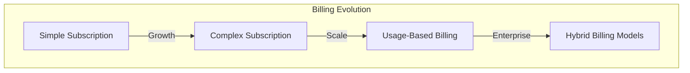
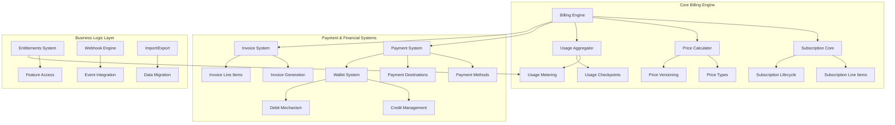
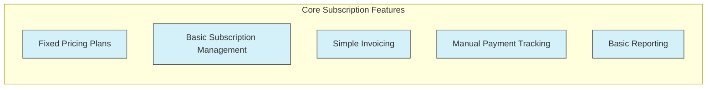
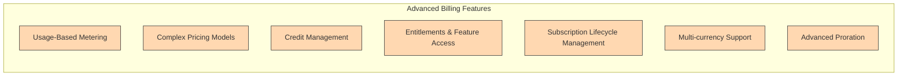

# Flexprice: Solving Modern Billing Challenges

## The Evolution of Billing Needs

## Flexprice Architecture Overview

## Common vs. Complex Features

### Easy to Set Up Features (For Early-Stage Companies)

### Complex Features (For Scaling Companies)

## How Flexprice Solves Key Billing Challenges

### 1. Flexible Subscription Management

Flexprice provides a comprehensive subscription management system that handles:

- **Multiple Pricing Models**: Support for fixed, tiered, volume, and usage-based pricing
- **Subscription Line Items**: Ability to mix and match different products and pricing models in a single subscription
- **Lifecycle Management**: Handling upgrades, downgrades, pauses, and cancellations with proper proration
- **Billing Period Management**: Clear handling of period boundaries, transitions, and timezone considerations

### 2. Robust Usage-Based Billing

The usage-based billing system includes:

- **Accurate Metering**: Real-time tracking of usage across multiple meters
- **Usage Aggregation**: Efficient aggregation of usage data for billing calculations
- **Usage Checkpoints**: Tracking usage at specific points in time for accurate billing
- **Debit Wallet Mechanism**: Sophisticated credit management with expiry tracking and priority-based consumption

### 3. Advanced Entitlements System

The entitlements system provides:

- **Feature Access Control**: Boolean, metered, and config-based feature access
- **Dynamic Usage Limits**: Computation of allowed usage based on subscription period
- **Plan-Based Entitlements**: Automatic assignment of entitlements based on subscription plan

### 4. Comprehensive Payment System

The payment system supports:

- **Multiple Payment Methods**: Offline, credits, card, and ACH payments
- **Payment Lifecycle Tracking**: Full tracking of payment attempts and status
- **Reconciliation**: Proper reconciliation with invoices and wallet transactions
- **Idempotent Processing**: Safe handling of duplicate payment requests

## Implementation Complexity Matrix

| Feature | Complexity | Implementation Time | Value at Scale |
|---------|------------|---------------------|----------------|
| Fixed Subscription Plans | Low | Days | Medium |
| Basic Invoicing | Low | Days | Medium |
| Subscription Lifecycle | Medium | Weeks | High |
| Usage-Based Billing | High | Months | Very High |
| Credit Management | High | Months | Very High |
| Entitlements System | Medium | Weeks | High |
| Multi-currency Support | Medium | Weeks | Medium |
| Advanced Proration | High | Months | High |

## The Flexprice Advantage

Flexprice provides a comprehensive solution that grows with your business:

1. **Start Simple**: Begin with core subscription features that are easy to set up
2. **Scale Gradually**: Add more complex features as your business grows
3. **Enterprise Ready**: Support for the most complex billing scenarios when you reach scale

By using Flexprice, companies can:

- **Avoid Technical Debt**: No need to rebuild billing systems as requirements evolve
- **Reduce Development Time**: Months of development work already done
- **Focus on Growth**: Spend time on revenue generation, not billing infrastructure
- **Experiment Freely**: Test new pricing models without breaking existing systems 