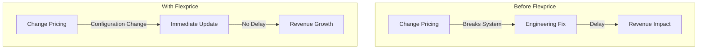
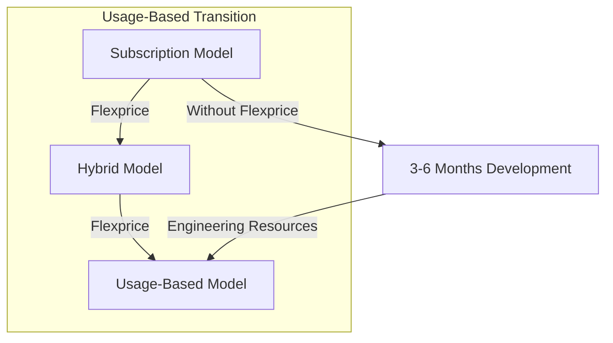
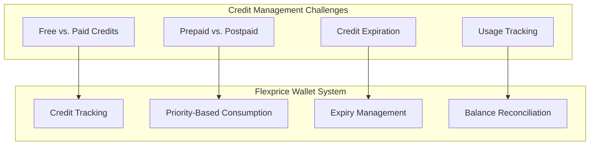
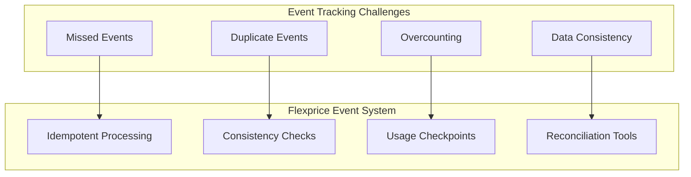
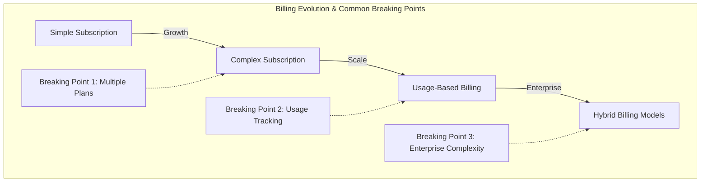

# The Flexprice Story: From Aftershoot's Challenges to a Comprehensive Solution

## The Aftershoot Journey: A Common Growth Story

The story of Flexprice begins with a real-world challenge faced at Aftershoot, an AI productivity tool for professional photographers. As the company rapidly scaled from $1M to $10M ARR in just 1-1.5 years, the limitations of their billing system became painfully apparent:

1. **Broken Pricing Changes**: Every time they modified pricing or packaging, the system would break
2. **Bottlenecked Growth**: Instead of focusing on revenue growth, the team was constrained by system limitations
3. **Usage-Based Transition Challenges**: Moving from subscription to usage-based pricing became a mammoth task
4. **Credit Management Complexity**: Managing prepaid vs. postpaid access, free vs. paid credits
5. **Event Tracking Reliability**: Building infrastructure that wouldn't miss events or overcount usage

These challenges are not unique to Aftershoot. They represent the common journey of fast-growing SaaS companies that outgrow their initial billing infrastructure.

## The Market Gap: Why Existing Solutions Failed

When Aftershoot looked for solutions:

1. **Custom Development**: Building in-house would have taken 3-6 months of engineering time
2. **Indian Provider (Togai)**: Required custom integrations and workflows
3. **Enterprise Solutions (Metronome)**: Wouldn't serve companies below $100M ARR

This revealed a critical gap in the market: mid-market companies scaling from $1M to $100M ARR lacked suitable billing solutions that could grow with them.

## How Flexprice Solves These Challenges

### 1. Flexible Pricing Changes Without Breaking

**Flexprice Solution:**
- **Price Versioning**: Track and maintain price versions to ensure consistency
- **Subscription Line Items**: Decouple subscriptions from specific plans for flexibility
- **Billing Engine**: Handle complex pricing changes without breaking existing subscriptions

### 2. Seamless Transition to Usage-Based Pricing

**Flexprice Solution:**
- **Usage Metering**: Accurate tracking of usage across multiple dimensions
- **Usage Aggregation**: Efficient aggregation of usage data for billing
- **Hybrid Billing Models**: Support for both subscription and usage components simultaneously

### 3. Sophisticated Credit Management

**Flexprice Solution:**
- **Debit Wallet Mechanism**: Sophisticated credit management with expiry tracking
- **Priority-Based Consumption**: Consume credits in the optimal order (expiring soonest first)
- **Credit Types**: Distinguish between free and paid credits
- **Balance Tracking**: Accurate tracking of available credits

### 4. Reliable Event Tracking Infrastructure

**Flexprice Solution:**
- **Idempotent Processing**: Prevent duplicate event processing
- **Usage Checkpoints**: Track usage at specific points for reconciliation
- **Consistency Checks**: Validate data integrity across the system
- **Error Recovery**: Robust error handling and recovery mechanisms

## The Evolution of Billing Needs: Where Companies Get Stuck

Most companies start with simple subscription billing, but as they grow, they hit predictable breaking points:

1. **Breaking Point 1 ($1-5M ARR)**: Need for multiple plans, add-ons, and more complex pricing
2. **Breaking Point 2 ($5-20M ARR)**: Need for usage-based components and accurate metering
3. **Breaking Point 3 ($20-100M ARR)**: Need for enterprise features like custom contracts, complex entitlements

Flexprice is designed to address all these breaking points with a scalable architecture that grows with your business.

## Why Build vs. Buy Is No Longer a Question

For companies like Aftershoot, building a robust billing system in-house is:

- **Time-Consuming**: 3-6 months of engineering time
- **Resource-Intensive**: Requires dedicated engineering resources
- **Risky**: High potential for errors in critical financial systems
- **Ongoing Maintenance**: Continuous updates as requirements evolve

Flexprice provides a comprehensive solution that:

- **Deploys Quickly**: Get started in days, not months
- **Scales Seamlessly**: Handles growth from $1M to $100M+ ARR
- **Reduces Risk**: Battle-tested components for critical financial operations
- **Evolves Continuously**: Regular updates to support new billing models and requirements

## The Flexprice Advantage: Start Simple, Scale Confidently

Flexprice's architecture allows companies to:

1. **Start with the Basics**: Simple subscription billing for early-stage companies
2. **Add Complexity Gradually**: Introduce more advanced features as you grow
3. **Experiment Freely**: Test new pricing models without breaking existing systems
4. **Focus on Growth**: Spend time on revenue generation, not billing infrastructure

By providing a solution that grows with your business, Flexprice ensures you'll never again be bottlenecked by billing system limitations—allowing you to focus on what matters most: growing your business. 