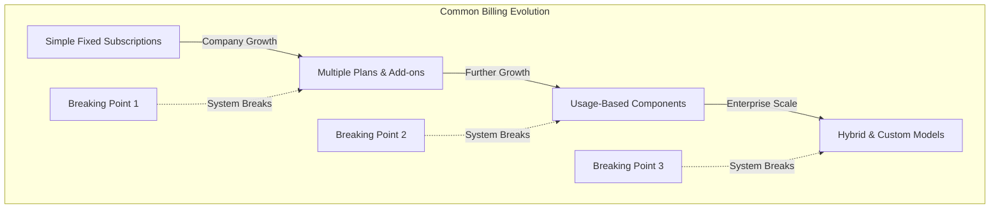

# Flexprice: The Complete Billing Solution for Growing Companies

## Executive Summary

Flexprice is a comprehensive billing solution designed to solve the challenges faced by growing SaaS companies as they scale from simple subscription models to complex usage-based billing. Born from real-world challenges experienced at Aftershoot (which scaled from $1M to $10M ARR in just 1-1.5 years), Flexprice fills a critical gap in the market for mid-market companies that need sophisticated billing capabilities without the enterprise price tag.

## The Problem: Billing Systems Break as Companies Scale

Most companies face predictable breaking points in their billing systems:

1. **Breaking Point 1**: When introducing multiple plans, add-ons, or complex pricing
2. **Breaking Point 2**: When adding usage-based components that require accurate metering
3. **Breaking Point 3**: When implementing enterprise features like custom contracts

## The Flexprice Solution: Simple to Complex in One Platform

Flexprice provides a scalable architecture that addresses all these breaking points with a comprehensive set of features:

### Core Features (Easy to Set Up)

- **Fixed Subscription Plans**: Simple recurring billing with flexible terms
- **Basic Subscription Management**: Create, update, and cancel subscriptions
- **Simple Invoicing**: Generate and manage invoices for subscriptions
- **Manual Payment Tracking**: Record and reconcile payments
- **Basic Reporting**: Track key metrics like MRR, churn, and revenue

### Advanced Features (For Scaling Companies)

- **Usage-Based Metering**: Track and bill for actual usage across multiple dimensions
- **Complex Pricing Models**: Support for tiered, volume, and graduated pricing
- **Credit Management**: Sophisticated wallet system with expiry tracking
- **Entitlements & Feature Access**: Control access to features based on subscription
- **Subscription Lifecycle Management**: Handle upgrades, downgrades, pauses, and cancellations
- **Multi-currency Support**: Bill in multiple currencies with proper exchange rate handling
- **Advanced Proration**: Accurately prorate charges for mid-period changes

## Key Differentiators

1. **Scalable Architecture**: Start simple and add complexity as you grow
2. **Flexible Pricing Models**: Support for any pricing model, from simple to complex
3. **Robust Usage Tracking**: Accurate metering with idempotent processing
4. **Comprehensive Credit Management**: Handle prepaid and postpaid credits with expiry
5. **Enterprise-Ready Features**: Support for the most complex billing scenarios

## Implementation Timeline

| Phase | Features | Timeline | Complexity |
|-------|----------|----------|------------|
| 1: Basic | Fixed subscriptions, simple invoicing | Days | Low |
| 2: Intermediate | Multiple plans, basic usage tracking | Weeks | Medium |
| 3: Advanced | Complex pricing, credit management | Months | High |
| 4: Enterprise | Custom contracts, advanced entitlements | Ongoing | Very High |

## The Build vs. Buy Decision

For companies considering building their own billing system:

- **In-house Development**: 3-6 months of engineering time
- **Ongoing Maintenance**: Continuous updates as requirements evolve
- **Opportunity Cost**: Engineering resources diverted from core product
- **Risk**: Potential for errors in critical financial systems

Flexprice provides a battle-tested solution that:

- **Deploys Quickly**: Get started in days, not months
- **Scales Seamlessly**: Handles growth from $1M to $100M+ ARR
- **Reduces Risk**: Proven components for critical financial operations
- **Evolves Continuously**: Regular updates to support new billing models

## Conclusion: Never Be Bottlenecked by Billing Again

Flexprice ensures that your billing system will never again be the bottleneck to your company's growth. By providing a solution that grows with your business, Flexprice allows you to:

1. **Focus on Growth**: Spend time on revenue generation, not billing infrastructure
2. **Experiment Freely**: Test new pricing models without breaking existing systems
3. **Scale Confidently**: Know that your billing system can handle your growth
4. **Serve Customers Better**: Provide flexible billing options that meet customer needs

With Flexprice, you can transform billing from a technical challenge into a strategic advantage. 