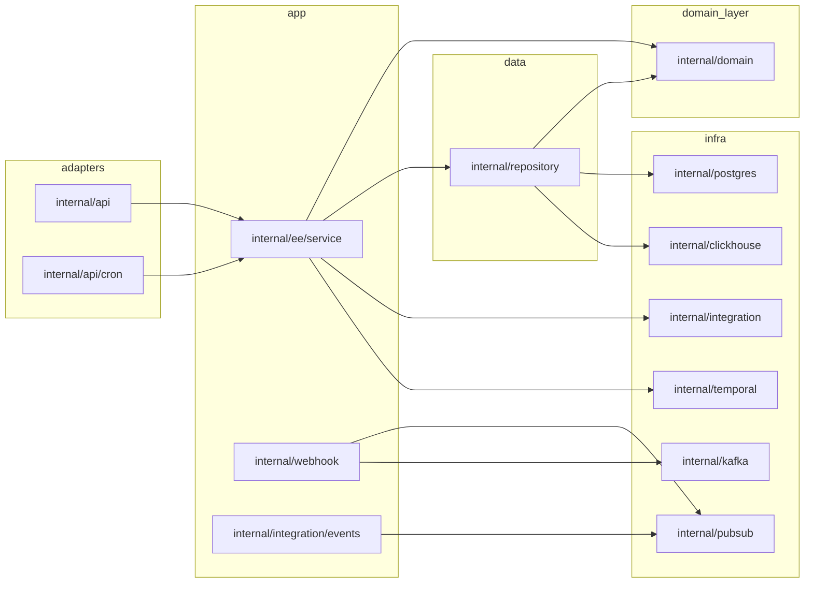

# Dependency intelligence

This document captures **verified dependency directions**, **chains**, and **concentrations of coupling** for the FlexPrice Go backend. It complements [`REPO_MAP.md`](REPO_MAP.md).

**Evidence sources:** package structure, Fx wiring in `cmd/server/main.go`, `internal/ee/service/factory.go` (`ServiceParams`), import rules between layers, and targeted code searches (e.g., `GetGlobalTemporalService`).

---

## Layered dependency DAG (canonical)



**Intended invariant:** `internal/domain/**` MUST NOT import `internal/repository`, `internal/ee/service`, or `internal/api`.

---

## Upstream vs downstream (runtime perspective)

### Ingest path (metering events)

```
Client → Gin (api/v1/events) → EventService (+ publisher.EventPublisher)
  → Kafka (events topic configured)
    → Watermill Router (middleware: poison/DLQ, retry, throttle per handler)
      → EventConsumptionService → ClickHouse (events.Repository impl)
      → Optional post-processing hooks / feature pipelines (parallel consumers per config)
```

**Upstream:** External clients / SDKs.  
**Downstream:** ClickHouse + downstream billing/feature usage derivation.

### Transactional mutations

```
Client → Middleware (auth/RBAC/env) → v1 Handler → FooService → Repositories → Ent/Postgres
```

### Async orchestration

```
Service or Activity → TemporalService.ExecuteWorkflow / signals
  → Temporal Server → Activities → Services + Integrations + Webhook publishers
```

### Outbound webhooks

```
Domain action / activity → Kafka system_events topic → WebhookService consumer
  → Payload builders (pull many read-only services) → Svix/native delivery config
```

---

## ServiceParams: structural hub (“god bag” tendency)

`internal/ee/service/factory.go` defines **`ServiceParams`**, the shared dependency struct for constructing services:

- **Repositories**: ~35+ interfaces (PostgreSQL aggregates + event-related repos split by concern).
- **Cross-cutting**: `Logger`, `Config`, `postgres.IClient`, publishers (`publisher.EventPublisher`, `webhook` publisher via params), HTTP client, proration calculator, **`integration.Factory`**, pubsubs for wallet alerts and usage benchmarks.

**Why it matters:** Nearly every feature service constructor fans in through this struct → **high fan-in** on `factory.go` and **high fan-out** from any service holding `ServiceParams` (implicit access to the whole persistence surface).

---

## High fan-in modules (many callers depend on them)

| Module / type | Role | Call pattern |
| ------------- | ---- | ------------- |
| `internal/ee/service.ServiceParams` | Universal DI blob for services | Embedded or passed explicitly into service structs |
| `internal/domain/*/repository.go` | Interface boundaries | Implemented once per store (Ent vs CH) |
| `internal/integration/factory.go` | Provider routing | Resolved by billing, payments, onboarding, Temporal activities |
| `internal/config.Configuration` | All tunables | Every layer reads scoped subtrees |
| `internal/logger.Logger` | Structured logging | Widespread |
| `internal/types` | Header names, ctx keys | API + middleware + services |
| Temporalservice `GetGlobalTemporalService()` | Convenience access to Temporal | Dispersed (see hotspots) |

---

## High fan-out modules (many dependencies downstream)

| Module | Depends on |
| ------ | --------- |
| `cmd/server/main.go` | Essentially every production package registered in Fx |
| `internal/temporal/registration.go` | Instantiates many **inline** services + activities/workflows from multiple integrations |
| `internal/webhook/handler`, `payload` | Multiple read services to assemble webhook payloads |
| Large services (`subscription`, `invoice`, `billing`, `feature_usage_tracking`) | Many repos + Temporal + integrations + publishers |

---

## Cross-module communication patterns

| Pattern | Mechanism | Coupling notes |
| ------- | --------- | ------------- |
| Synchronous RPC to self | Gin handlers → service interfaces | Clean when interfaces stay narrow |
| Async fan-out | Kafka producers (`internal/kafka`, `internal/publisher`) | Topic contracts are config-bound; versioning risk |
| Async fan-in | Watermill `pubsub.Router` handlers | Retry + poison middleware centralized in `pubsub/router/router.go` |
| Long-running workflows | Temporal workflows/activities | Strong reliability; beware activity ↔ service cyclic **logical** coupling |
| RBAC enforcement | Gin groups + `middleware.NewPermissionMiddleware` | Permission strings co-evolve with handlers |
| Integration webhooks | `internal/api/v1/webhook.go` → provider handlers under `integration/*` | Large switch surface; risky for merge conflicts |

---

## Circular dependency risks

Go compile-time cycles are avoided, but **logical cycles** appear:

1. **Temporal registration** constructs `service.New*` inside `registration.go`, duplicating some Fx wiring paths — risk of divergence between DI graph and worker-local instances.
2. **Global Temporal accessor** (`GetGlobalTemporalService`) lets API handlers and deep services enqueue workflows **without** explicit constructor injection → hidden coupling + harder testing boundaries.
3. **Feature pipelines**: event consumption triggers feature usage and may schedule Temporal work → depends on operational ordering (`registerRouterHandlers` in `cmd/server/main.go`).

---

## Risky / unstable abstractions (watch closely)

| Abstraction | Risk | Mitigation posture |
| ----------- | ----- | ------------------- |
| `integration.Factory` | Grows monolithically with each provider | Keep provider packages isolated; resist new coupling in factory beyond lookup |
| `ServiceParams` | Becomes dumping ground | Introduce narrower param structs when touching new bounded contexts |
| Global Temporal service | Testability & lifecycle clarity | Prefer injected `TemporalService` in **new** code paths |
| Webhook payload builders | Serialization drift vs API | Contract tests against sample payloads |

---

## Shared packages overview

| Package | Usage |
| ------- | ----- |
| `internal/types` | Canonical string constants / enums crossing API & services |
| `internal/domain/errors`, `internal/errors` | Error plumbing to HTTP layer (`internal/api/dto`-style mappings where used) |
| `internal/interfaces` | Some handler-facing service interfaces (legacy / boundary typing) |

---

## Suggested tooling (optional enrichment)

Automated layering checks (not committed here) commonly use:

- `go-flowchart` / `goviz` / `graphify-out/graph.json` (see `CLAUDE.md` graphify section if generated in repo).

When adding such tooling, regenerate docs or link generated artifacts rather than contradicting verified structure.
