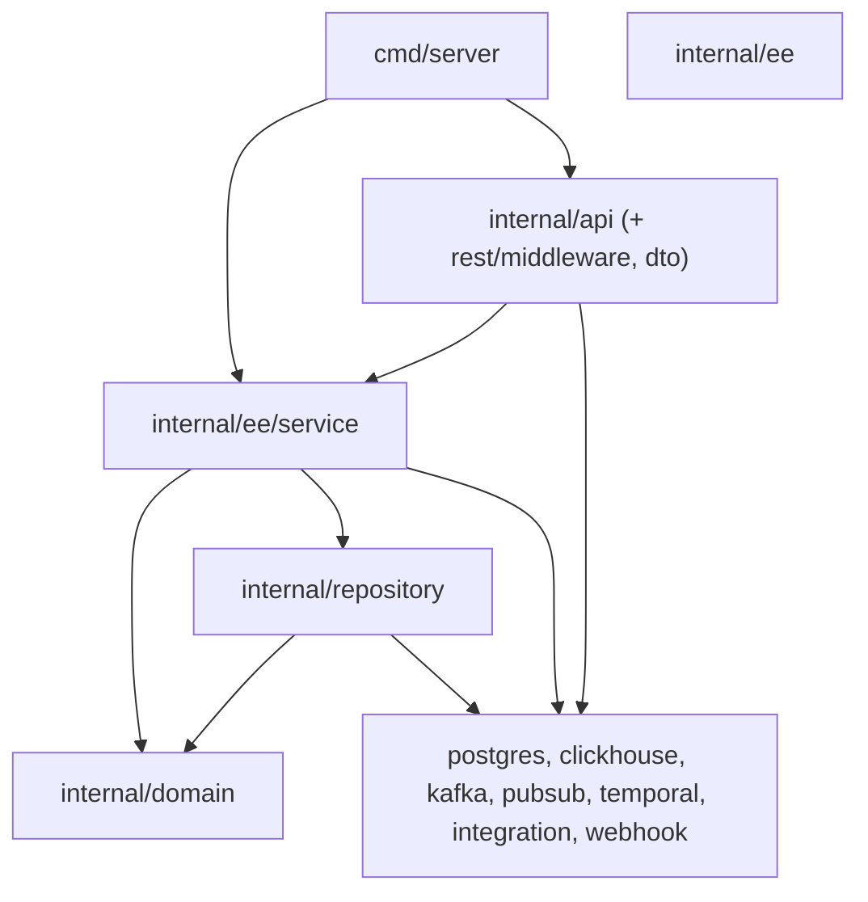

# FlexPrice repository map

This document is repository **census and orientation**: where major systems live, how they relate, and who “owns” which boundaries. Pair with [`ARCHITECTURE.md`](ARCHITECTURE.md), [`DEPENDENCY_GRAPH.md`](DEPENDENCY_GRAPH.md), and [`FLOWS/`](FLOWS/).

**Maintenance:** After structural changes (new packages, deployment modes, major routes, or pipelines), update this file in the same PR when practical.

---

## Executive summary

FlexPrice is a **Go monolith** (Gin HTTP + Uber Fx DI) that can split by **deployment mode** into API-only, Kafka consumer-heavy, or Temporal worker processes. Persistence is **PostgreSQL (Ent)** for transactional state and **ClickHouse** for high-volume metering/analytics paths. **Kafka** feeds Watermill-backed consumers; **Temporal** orchestrates billing, invoicing sync, exports, and cron-style schedules.

---

## Entrypoints

| Entry | Role |
| ----- | ---- |
| `cmd/server/main.go` | Sole application binary: wires Fx modules, registers HTTP handlers, starts pub/sub router (optional), Temporal workers (optional), Gin server |
| `cmd/migrate/main.go` | Database migration tooling (separate binary) |

There is **no separate `consumer` binary** in `cmd/`; consumer behavior is activated via `FLEXPRICE_DEPLOYMENT_MODE` (see `internal/types` and `cmd/server/main.go`).

---

## Deployment modes (logical services)

Controlled by configuration (`deployment.mode`). Same codebase, different runtime responsibilities:

| Mode | HTTP API | Kafka message router / handlers | Temporal workers |
| ---- | -------- | -------------------------------- | ---------------- |
| `local` (default) | Yes | Full processing registrations | Yes |
| `api` | Yes | Router runs; ingestion handlers **not** registered | No |
| `consumer` | No | Full processing registrations | No |
| `temporal_worker` | No | Minimal (webhook/integration paths for activity-side publishing) | Yes |

Implementation reference: `startServer`, `registerRouterHandlers`, `includeProcessingHandlers` in `cmd/server/main.go`.

---

## Layer map (canonical directions)

Approved dependency flow (conceptual):

- **Domain** (`internal/domain/*`): Models and repository **interfaces only** — no Implementations importing Ent.
- **Repository** (`internal/repository/*`): PostgreSQL via **Ent generated code** under `repository/ent/`, analytics via **`repository/clickhouse/`**.
- **Service** (`internal/ee/service/*`): Business orchestration; primary consumer of domain interfaces and infrastructure facades.
- **API** (`internal/api/v1`, `internal/api/cron`, `internal/api/dto`): HTTP adapters; validates and maps DTOs; **no duplicated business rules**.
- **Enterprise** (`internal/ee/`): Commercial features layered on core; services composed in Fx alongside open-core services (`cmd/server/main.go`).

---

## Major directories (ownership)

| Area | Path | Responsibility |
| ---- | ---- | -------------- |
| HTTP surface | `internal/api/v1/` | REST handlers (~one file per bounded context) |
| Cron HTTP triggers | `internal/api/cron/` | Operational `/v1/cron/...` triggers (schedules primarily Temporal) |
| Middleware | `internal/rest/middleware/` | Auth (JWT / API key), RBAC permission checks, tenancy headers, observability hooks |
| Services | `internal/ee/service/` | Core business logic (~50+ cohesive files plus tests) |
| Domain | `internal/domain/` | Interfaces + pure models per aggregate |
| Repositories | `internal/repository/` | Ent + ClickHouse implementations |
| Temporal | `internal/temporal/` | Client, worker manager, workflows, activities, registration |
| Integrations | `internal/integration/` | Payment/billing/connectors (Stripe, Chargebee, Paddle, Razorpay, Moyasar, Nomod, QuickBooks, Zoho, HubSpot, S3, etc.) |
| Outbound webhooks | `internal/webhook/` | Kafka-backed pipeline to deliver customer webhooks / system events |
| Integration events | `internal/integration/events/` | Isolated consumer group on **system_events**-shaped topics |
| Pub/sub | `internal/pubsub/` + `internal/pubsub/kafka/` | Watermill adapters, shared subscribe patterns |
| Message router | `internal/pubsub/router/` | Retry, poison/DLQ, handler registration |
| Event publishing | `internal/publisher/`, `internal/kafka/` | Produce usage events (Kafka/Dynamo paths per config) |
| Auth helpers | `internal/auth/` | Token validation abstraction used by middleware |
| Security / RBAC | `internal/security/`, `internal/rbac/` | Encryption helpers, permission model |
| Config | `internal/config/` | Viper-loaded configuration (`config.yaml` + env) |
| Shared types | `internal/types/` | Context keys, headers, enums, deployment constants |
| Test utilities | `internal/testutil/` | DB setup, fixtures, in-memory stores |
| Ent schema | `ent/schema/` | Source of truth for PostgreSQL entities (run `make generate-ent`) |
| SQL migrations | `migrations/postgres/`, `migrations/clickhouse/` | Versioned DDL (parallel to Ent migrations in workflows) |
| SDKs | `api/go`, `api/python`, `api/typescript`, `api/mcp` | Generated from OpenAPI; custom overlay in `api/custom/` |
| Ops / local | `docker-compose*.yml`, `Makefile` | Compose stacks, codegen, test shortcuts |

---

## Data stores and pipelines

### PostgreSQL (transactional)

- **ORM:** Ent (`ent/schema/*` → generated `repository/ent/*`).
- Core aggregates: tenants, environments, users, customers, plans, prices, subscriptions, invoices, payments, wallets, coupons, addons, integrations, secrets, workflows, scheduled tasks, etc.

### ClickHouse (metering / analytics)

- Consumption services write/query via `repository/clickhouse/` (events, processed events, feature usage, cost sheet usage, meter usage, raw events, benchmarks).
- Migrations under `migrations/clickhouse/`.

### Kafka topics (from `internal/config/config.yaml`)

Representative configured topics:

- **`events`** — primary usage event stream after API ingest / publish pipeline.
- **`events_lazy`** — deferred/low-priority processing path.
- **`events_backfill`** — replay/backfill inputs.
- **`events_post_processing`** (+ backfill variant) — post-processing stage.
- **`events_dlq`** — dead-letter when configured for the Watermill router.
- **`flexprice_system_events`** (webhook/system event bus naming in config sections).
- **`wallet_alert`**, benchmarking topics, **`onboarding_events`**, transform pipeline topics (staging-oriented keys in yaml).

Exact binding is **per config section** (event processing vs webhook vs integration events); trace `RegisterHandler` calls in services and `webhook`/integration modules.

---

## Important modules / relationships

### Fx composition hub

`cmd/server/main.go` centralizes construction order:

1. Infrastructure: logger, Postgres, ClickHouse, Kafka producer/consumer, cache, optional DynamoDB/S3.
2. All `repository.New*` constructors.
3. **`webhook.Module`** then **`integrationevents.Module`** (webhook-shaped system events pipeline).
4. **Service constructors** (+ `internal/ee/service` overlays).
5. Temporal client/worker/service + **`api` handlers + Gin router.**

### Temporal

- **`internal/temporal/registration.go`** registers workflows/activities onto task queues derived from **`internal/types`** task queue helpers.
- **Schedules**: `EnsureSchedules` runs on Temporal worker startup — cron-like automation prefers Temporal over naked OS cron.
- Activities often call back into **`internal/ee/service`** and **`internal/integration`**.

### Billing core (high cohesion, large files)

- **`internal/ee/service/subscription.go`**, **`invoice.go`**, **`billing.go`** — primary subscription/invoice/rating surfaces (see [`HOTSPOTS.md`](HOTSPOTS.md)).

### Generated code

- **Do not hand-edit** `internal/repository/ent/*` (Ent codegen), large portions of **`api/*/generated`**, etc. Prefer schema + codegen + merge-custom for SDKs.

---

## Ownership boundaries (team mental model)

| Boundary | Contracts | Consumers |
| -------- | --------- | --------- |
| **Metering ingestion** | Event API → publisher → Kafka → consumption → ClickHouse | Billing, dashboards, exports |
| **Billing / subscription** | Domain invariants + invoice generation | Payments, integrations, Temporal |
| **Integrations** | Provider-specific clients + webhook HTTP handlers under `integration/*/webhook` | Services, Temporal activities |
| **Outbound notifications** | `webhook/` pipeline + Svix (`internal/svix`) | Customers, portals |
| **Platform / tenancy** | Tenant, environment, RBAC, secrets | All handlers |

---

## Related reading

- [ARCHITECTURE.md](ARCHITECTURE.md) — principles and conventions  
- [DEPENDENCY_GRAPH.md](DEPENDENCY_GRAPH.md) — fan-in/out and coupling  
- [HOTSPOTS.md](HOTSPOTS.md) — risk ledger  
- [FLOWS/](FLOWS/) — traced business paths  
