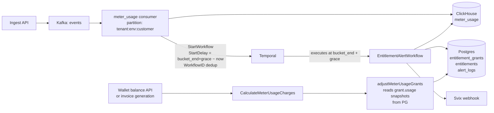
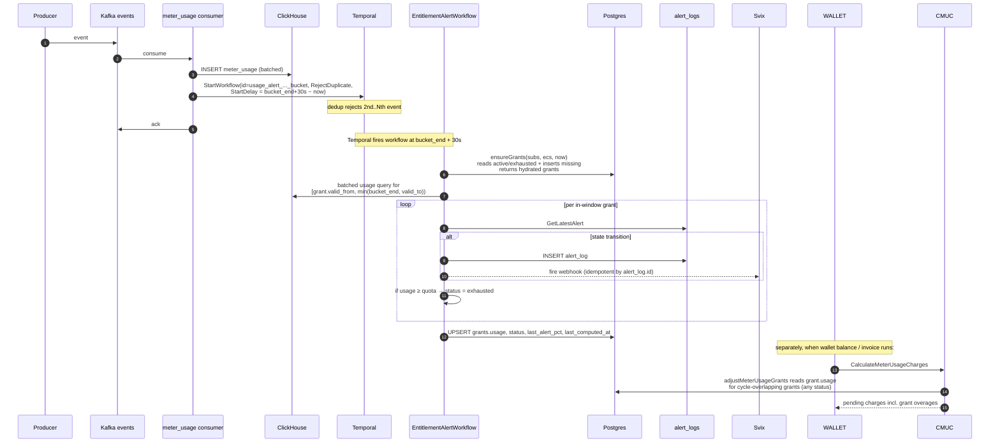
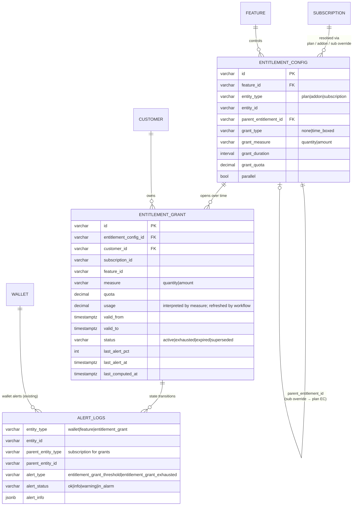
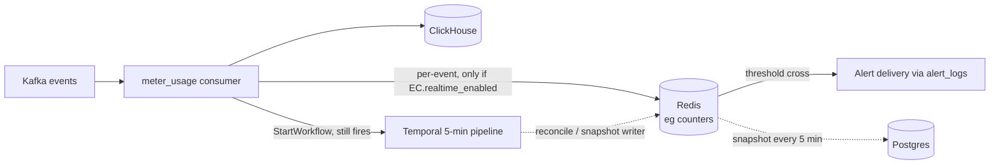

# FLE-959 — Entitlements Revamp: Time-Boxed Grants, Parallel Entitlements, and Usage Alerts

- **Ticket:** [FLE-959](https://linear.app/flexprice/issue/FLE-959/entitlements-revamp)
- **Date:** 2026-07-08
- **Author:** Ankit Malik
- **Status:** Draft for review

---

## 1. Executive Summary

Introduce **Entitlement Grants** — time-boxed, parallel, quantity- or amount-based usage buckets that layer on top of the existing `entitlements` table (renamed conceptually to *entitlement configs*).

**Ship in this phase (Phase 1):**

- **Data:** new `entitlement_grants` PG table; new grant-related columns on `entitlements`.
- **Pipeline:** meter_usage consumer starts a Temporal workflow per `(customer, 5-min consumer-time bucket)` using `StartDelay`. Temporal schedules the workflow to execute at `bucket_end + grace`. `WorkflowID` dedup makes 2nd..Nth events in the same bucket a no-op.
- **Reused everywhere:** `CalculateMeterUsageCharges` (all pricing: bucketed meters, windowed/cumulative commit, tier, true-up), `alert_logs` + `AlertState` machine, `GetAggregatedSubscriptionEntitlements` (for per-subscription EC overrides).
- **Billing over-usage** flows through the existing pricing pipeline via a new `adjustMeterUsageGrants` step, so wallet balance / invoicing correctly reflect grant overages without any new billing surface.
- **New tables:** `entitlement_grants` only.
- **No new datastores. No CH schema changes. No Redis.**

**SLA:** alerts fire within **≤ 5 min p99** of event ingest.

**Delivery:** default webhook via Svix on grant exhaustion. No new alert-channel wiring.

**Deferred (Phase 2 and later, see §15):** per-event real-time counters (Redis-backed, <60 s SLA), per-event wallet balance decrement.

**Note on `feature_usage`:** deprecated and being removed. All reads target `meter_usage` via `MeterUsageRepo`.

---

## 2. Motivation

### 2.1 What we're building

- **Time-boxed grants:** "100 tokens per 5 hours" or "1M requests per week" — grants have their own `valid_from` / `valid_to`, independent of the subscription billing cycle.
- **Parallel entitlements:** two grants on the same feature (e.g. 5 h + 1 w) tracked independently. Exhausting either fires an alert. Today entitlements are additive; parallel is new.
- **Amount-based grants:** "$50 of compute per day" alongside qty-based "1M req/day". Alerting on amount requires the pricing engine.
- **Auto-rotation:** when a grant expires, the next grant on the same EC opens automatically (via `ensureGrants` on the next tick), subject to the cycle-boundary cap (§8.4).

### 2.2 Why we need it

- **Customer-level rate limits at multiple time scales** — 5 h rolling, 1 w rolling, subscription-wide — from a single primitive.
- **Claude Code-style spending caps** (real-time is Phase 2, but the modeling for the caps starts here).
- **Spend caps in parent-child subscriptions** via wallet alerts — the pricing/alert semantics should match entitlement caps.
- **Unified alerting substrate:** wallet alerts and entitlement soft-limits stop drifting into separate code paths; both write into `alert_logs`.

---

## 3. Goals & Non-Goals

### 3.1 Phase 1 Goals

- Deliver Entitlement Grants as a first-class domain object: time-boxed, parallel, qty/amount duality.
- Alert p99 ≤ 5 min end-to-end.
- Reuse existing pricing (`CalculateMeterUsageCharges` and everything under it).
- Reuse existing alerts (`alert_logs`, `AlertState` machine, `GetLatestAlert`).
- Reuse existing per-subscription override mechanism (`GetAggregatedSubscriptionEntitlements`).
- Grant over-usage flows into wallet balance and invoices automatically through the existing pricer.
- No wallet-alert regressions.
- Additive migration — grants are opt-in per EC; legacy entitlements untouched.

### 3.2 Non-Goals for Phase 1

- Real-time (<60 s) alerting — Phase 2.
- Redis, ClickHouse schema changes, per-event counters — Phase 2.
- Per-event wallet balance decrement — Phase 3.
- Backfilling grants retroactively for prior cycles.
- New pricing primitives.
- Grant edits mid-life. A separate future "grant edit workflow" can update PG rows when needed (admin quota adjust etc.); out of scope for Phase 1.
- Replacing the existing `usage_reset_period` semantics — grants complement it.
- Grants shorter than 1 hour (product decision — avoid noisy short buckets).
- Grants on MAX/bucketed meters (rejected at EC validation — no clear per-grant-window semantic for peak/high-water-mark aggregations).
- **Amount-based grants on any pricing beyond linear per-unit** — commit (any flavor), tier (any flavor), bucketed, and true-up are rejected at EC validation for `grant_measure='amount'`. Rationale in §8.6.

---

## 4. Terminology

| Term | Meaning |
|---|---|
| **Entitlement Config (EC)** | Existing `entitlement` row. Defines feature, per-grant quota, grant duration. Alert config is NOT on the EC — that lives in the alerts subsystem. |
| **Entitlement Grant (EG)** | New PG row. A concrete, time-boxed usage bucket. Has `valid_from`, `valid_to`, `quota`, `usage`, `measure`, `status`. |
| **Grant status** | `active` (usage < quota, in window) → `exhausted` (usage ≥ quota, still in window) → `expired` (window passed). See §7.2. |
| **Parallel EGs** | Multiple EGs on the same feature. Independent counters, independent alerts, **independent billing overages summed**. |
| **Cycle-boundary cap** | `EG.valid_to <= subscription.current_period_end`. When a full `grant_duration` would cross the cycle end, `valid_to` is truncated. Next grant opens fresh in the new cycle. See §8.4. |
| **5-min consumer bucket** | Wall-clock 5-minute window **derived from consumer receive time**, not `event.timestamp`. `bucket_start = floor(consumer_now / 5min) * 5min`. `bucket_end = bucket_start + 5min`. Used as the `WorkflowID` suffix. Backdated events land in whichever bucket the consumer is in when it processes them (§8.1). |
| **Alert state** | Reused from existing `alert_logs` machine: `ok → info → warning → in_alarm`. Grant alerts are written on state transition; no dedicated table. |
| **EC override** | Existing pattern: subscription-scoped `entitlement` row with `parent_entitlement_id` pointing to a plan-level EC. Handled by `ProcessSubscriptionEntitlementOverrides` (`subscription.go:6708`) and `GetAggregatedSubscriptionEntitlements` (`subscription.go:6648`). Grants inherit this — `ensureGrants` uses the resolved EC. |

---

## 5. High-Level View

### 5.1 System context



Key points:

- Bucket is derived from **consumer wall-clock** (`floor(consumer_now / 5min) * 5min`), NOT `event.timestamp`. This is what makes backdated event handling automatic — see §8.1.
- Consumer's only new responsibility per event: one `StartWorkflow` call with a deterministic ID and a `StartDelay`. Temporal executes the workflow at the scheduled time; no in-workflow `Sleep`.
- Billing over-usage is a separate integration: `adjustMeterUsageGrants` inside the existing pricer reads `grant.usage` snapshots (updated by the workflow every 5 min) and produces per-grant overage that feeds the rest of the pricing chain.

### 5.2 Phase 1 sequence



### 5.3 ER diagram

Alerts reuse the existing `alert_logs` table — no new alert table.



### 5.4 Cycle-boundary cap illustration

```
Cycle:  |------------- 30 days ----------|-------- next cycle -->
        Aug 1                            Aug 31 23:59:59

5h EGs: [EG1][EG2][EG3]...          [EG_N|
                                         ^ valid_to capped at cycle_end

                                             [EG(N+1)][EG(N+2)]...
                                             starts fresh in new cycle
```

Grants never span two cycles. Rationale in §11 Alternatives.

---

## 6. Current State (Baseline)

### 6.1 Entitlements today

- Table: `entitlements` (`ent/schema/entitlement.go`). Fields: `feature_id`, `entity_type`/`entity_id`, `usage_limit`, `usage_reset_period`, `is_soft_limit`, `static_value`, `parent_entitlement_id`, `start_date`, `end_date`.
- Additive semantics. No parallel isolation. No arbitrary time windows.
- **Overrides work today** via `parent_entitlement_id` + `ProcessSubscriptionEntitlementOverrides` + `GetAggregatedSubscriptionEntitlements`. Grants inherit this — see §7.1.

### 6.2 Wallet balance alerts today (what we're reusing)

`walletBalanceAlertService.processEvent` → throttle cache → `walletService.CheckWalletBalanceAlert` → `computeRealtimeBalanceDefault` (`wallet.go:2710`) → per active sub: `GetMeterUsageBySubscription` (CH) → `CalculateMeterUsageCharges` (`billing_meter_usage.go:36`). Alert state written to `alert_logs` with `AlertState` transitions.

`CalculateMeterUsageCharges` handles all the hard cases we care about — reuse gives us these for free:

| Case | Function |
|---|---|
| Bucketed meters (MAX/SUM) | `queryBucketedMeterUsageDirect` + `calculateBucketedMeterCost` |
| Entitlement quotas with reset period ≠ billing period | `adjustMeterUsageEntitlement` + `MeterUsageRepo.GetUsage` with `WindowSize` + `BillingAnchor` + `sumWindowedOverage` |
| Line-item flat commitment | `applyCommitmentToLineItem` + `computeCommitmentMath` |
| Line-item windowed commitment | `applyMeterUsageCommitment` + `applyWindowCommitmentToLineItem` |
| Cumulative multi-period commitment | `getCumulativePriorBaseFromInvoices` + `buildCumulativeCommitmentCharges` |
| True-up | non-cumulative path when `sub.EnableTrueUp && !hasOverage` |
| Overage factor | inside `computeCommitmentMath` |
| Volume/tier pricing | `priceService.CalculateCost` |

### 6.3 `alert_logs` today (what we're reusing)

Schema (`ent/schema/alertlogs.go`) already has `entity_type`, `entity_id`, `parent_entity_type/id`, `customer_id`, `alert_type`, `alert_status` (`ok | info | warning | in_alarm`), `alert_info` (jsonb).

Idempotency pattern (from `walletService.processWalletBalanceAlert`):

```
latest = alertlogsRepo.GetLatestAlert(entity_type, entity_id, alert_type, ...)
new_state = computeState(usage, quota, thresholds)
if latest == nil OR latest.alert_status != new_state:
    INSERT alert_log(new_state)
```

State transitions are the dedup mechanism. No unique constraint needed.

### 6.4 What's being removed

- `feature_usage` table and its consumer path — deprecated.
- `GetFeatureUsageBySubscription`, legacy `CalculateFeatureUsageCharges` fallback, `IsMeterUsageEnabledForAnalytics` flag — being retired.

---

## 7. Data Model (Phase 1)

### 7.1 `entitlement_configs` — extending existing `entitlements`

Fields already present continue to be used, including `parent_entitlement_id` for subscription-scoped overrides. New fields:

| Field | Type | Purpose |
|---|---|---|
| `grant_type` | enum (`none`, `time_boxed`) | `none` = legacy behavior. `time_boxed` = auto-rotate grants of `grant_duration` each. |
| `grant_measure` | enum (`quantity`, `amount`) | Interprets `grant_quota` and `EG.usage`. |
| `grant_duration` | interval | Length of each time-boxed grant. Minimum 1 hour. Null when `grant_type=none`. Capped at cycle end (§8.4). |
| `grant_quota` | decimal(25, 15) | Per-grant quota. |
| `parallel` | bool | If true, multiple ECs on the same feature produce independent grants. If false, additive as today. |

Notes:

- **No `alert_thresholds` on the EC.** Alerts are configured in the alerts subsystem. Grant exhaustion (`usage ≥ quota`) fires a Svix webhook by default with no config.
- **Per-subscription overrides for free.** Create a subscription-scoped EC row (`entity_type='subscription'`, `parent_entitlement_id=plan_ec_id`) with a different `grant_quota` / `grant_duration`. `GetAggregatedSubscriptionEntitlements` resolves to the overriding row; `ensureGrants` uses whatever it gets back. Zero new code.

**Validation at EC write time** (both new and updated ECs):

- Reject `grant_type='time_boxed'` if the meter's aggregation is `MAX` or bucketed → grants have no clean semantic on peak/high-water-mark meters.
- Reject `grant_measure='amount'` if any line item on the feature has any commit (flat, windowed, cumulative), volume/graduated tier, or true-up → Phase 1 supports only linear per-unit pricing for amount grants (§8.6).

### 7.2 `entitlement_grants` (new)

```sql
CREATE TABLE entitlement_grants (
    id                     varchar PRIMARY KEY,             -- prefix eg_
    tenant_id              varchar NOT NULL,
    environment_id         varchar NOT NULL,
    entitlement_config_id  varchar NOT NULL REFERENCES entitlements(id),
    customer_id            varchar NOT NULL,
    subscription_id        varchar NOT NULL,                -- denorm for query
    feature_id             varchar NOT NULL,                -- denorm for query
    measure                varchar NOT NULL,                -- quantity | amount
    quota                  decimal(25, 15) NOT NULL,
    usage                  decimal(25, 15) NOT NULL DEFAULT 0,   -- refreshed by workflow every tick
    valid_from             timestamptz NOT NULL,
    valid_to               timestamptz NOT NULL,            -- always <= sub.current_period_end
    status                 varchar NOT NULL,                -- active | exhausted | expired | superseded
    last_alert_pct         int,                             -- fast filter; source of truth is alert_logs
    last_alert_at          timestamptz,
    last_computed_at       timestamptz,                     -- last workflow refresh
    created_at             timestamptz NOT NULL DEFAULT now(),
    updated_at             timestamptz NOT NULL DEFAULT now()
);

-- One live EG per (config, customer). "Live" = still occupies a slot for
-- the config. Both active and exhausted count as live; expired frees the slot.
CREATE UNIQUE INDEX ux_egrants_one_live
  ON entitlement_grants (entitlement_config_id, customer_id)
  WHERE status IN ('active', 'exhausted');

CREATE INDEX ix_egrants_customer_live
  ON entitlement_grants (tenant_id, environment_id, customer_id)
  WHERE status IN ('active', 'exhausted');

-- Billing-path lookups: any grant overlapping a cycle window (regardless of
-- status). Used by adjustMeterUsageGrants (§8.6).
CREATE INDEX ix_egrants_feature_customer_window
  ON entitlement_grants (tenant_id, environment_id, customer_id, feature_id, valid_from, valid_to);
```

**Grant status state machine:**

| Status | Meaning | In alert path? | In billing path? |
|---|---|---|---|
| `active` | `usage < quota` and `now < valid_to` | yes | yes |
| `exhausted` | `usage ≥ quota` and `now < valid_to` — set by the workflow when firing the exhaustion alert | yes (state stays until expiry, no new alert transitions unless usage drops — but usage only grows) | yes |
| `expired` | `now >= valid_to` — set opportunistically by `ensureGrants` before opening the next grant | no | yes (overage from the expired window still counts toward the cycle) |
| `superseded` | Replaced via admin edit (future) | no | no |

Notes:

- Single `usage` column interpreted by `measure` — same pattern as `quota`, and matches the existing `entitlement.usage_limit` shape.
- `subscription_id`, `feature_id` denormalized for fast lookup. Config remains authoritative for policy.
- `valid_to <= subscription.current_period_end` enforced by `ensureGrants`, not a CHECK constraint (cycle rolls over).

### 7.3 Alert bookkeeping — `alert_logs`

New enum values (constants only, no schema change):

- `AlertEntityType = "entitlement_grant"`
- `AlertType = "entitlement_grant_threshold"` and `"entitlement_grant_exhausted"`

Row layout:

```
entity_type        = "entitlement_grant"
entity_id          = eg_{grant_id}
parent_entity_type = "subscription"
parent_entity_id   = sub_id
customer_id        = customer_id
alert_type         = threshold | exhausted
alert_status       = ok | info | warning | in_alarm
alert_info         = { threshold_pct, usage, quota, measure, value_at_time, valid_from, valid_to, timestamp }
```

Idempotency: `GetLatestAlert` + state-transition check (§6.3). Same helper used by wallet alerts.

**Delivery:** Svix webhook fires on every INSERT into `alert_logs` for `entity_type='entitlement_grant'`. Uses `alert_log.id` as the Svix idempotency key. No new delivery-channel wiring beyond registering the new `alert_type` values on Svix.

---

## 8. Approach — 5-Minute Temporal Pipeline

### 8.1 Trigger — StartWorkflow with StartDelay and WorkflowID dedup

```
Consumer, per event:
  1. INSERT into CH meter_usage (batched, as today)
  2. bucket_start = floor(consumer_now / 5min) * 5min       -- consumer wall-clock
     bucket_end   = bucket_start + 5min
     workflow_id  = "usage_alert_" + tenant + "_" + env + "_" + customer + "_" + bucket_start
     delay        = bucket_end + 30s − consumer_now         -- when Temporal should fire
     Temporal.StartWorkflow(
         WorkflowID            = workflow_id,
         WorkflowIdReusePolicy = RejectDuplicate,
         StartDelay            = delay,
         input                 = { tenant, env, customer, bucket_start, bucket_end }
     )
     -> dedup index in Temporal makes the 2nd..Nth event a no-op
  3. ack Kafka
```

**Why StartDelay instead of an in-workflow `Sleep`.** Temporal creates the workflow record immediately (so `WorkflowID` dedup works right away) but doesn't allocate an execution slot until `bucket_end + grace`. Cheaper, cleaner, no workflow sitting on a timer.

**Why bucket = consumer wall-clock, not `event.timestamp`.** This is what makes backdated events land correctly with zero extra logic. Concrete example:

- Current EG: `usage = 123`, `quota = 125`, `valid_from = 10:00`, `valid_to = 14:00`.
- Consumer receives an event at 13:30:00 with `event.timestamp = 12:30:00`, `qty = 10`.
- Consumer bucket = `floor(13:30 / 5min) = 13:30`. Workflow ID `usage_alert_..._13:30`, `StartDelay ≈ 5 min`.
- Workflow executes at 13:35:30 and queries CH:
  ```sql
  SELECT sum(qty_total) FROM meter_usage
  WHERE customer=? AND meter=?
    AND timestamp >= grant.valid_from            -- 10:00
    AND timestamp <  bucket_end                  -- 13:35
  ```
  The `event.timestamp = 12:30` satisfies `12:30 < 13:35` → included. Recomputed usage from CH = 133 → exceeds quota → alert transitions to `in_alarm`, fires.

Because we **always recompute usage from CH** (not `old.usage + delta`), the grant's `usage` is monotonic and idempotent — a workflow can re-run at any time and produce the same answer for the same `bucket_end`.

**Temporal WorkflowID retention:** target 15 minutes, cap at 1 hour. Buckets are keyed on consumer time; no new event produces a colliding ID beyond its own bucket + a small clock-skew margin.

### 8.2 Workflow

```
EntitlementAlertWorkflow(tenant, env, customer, bucket_start, bucket_end):

  -- No in-workflow sleep; Temporal already fired us at bucket_end + grace.

  1. subs = active subscriptions for (tenant, env, customer)
     ecs  = for each sub: GetAggregatedSubscriptionEntitlements(sub.id)
            (resolves plan + addon + sub overrides in one call)

  2. grants = ensureGrants(subs, ecs, bucket_end)       -- §8.4
              -- reads existing live (active + exhausted) grants;
              -- expires stale rows only if we need to insert a new grant;
              -- inserts new time_boxed grants for ECs with no live grant;
              -- returns hydrated grant list

  3. Compute usage for each grant from CH:
     For each grant:
        compute_end = min(bucket_end, grant.valid_to)
        grant.usage = SELECT sum(qty_total) FROM meter_usage
                      WHERE customer AND meter
                        AND timestamp >= grant.valid_from
                        AND timestamp <  compute_end
     -- batched into one CH query per customer, attributed in-app (§8.5)

  4. For each grant, alert state transition:
        ratio = grant.usage / grant.quota
        state = computeState(ratio, thresholds_for(grant))    -- ok|info|warning|in_alarm
        write_alert_state_if_changed(grant, state)            -- §8.3
        if grant.usage >= grant.quota AND grant.status != 'exhausted':
            grant.status = 'exhausted'
            fire "entitlement_grant_exhausted" via alert_logs

  5. UPSERT entitlement_grants
        SET usage, status, last_alert_pct, last_alert_at,
            last_computed_at = bucket_end
        WHERE id IN (touched)

  6. Subscription-level and wallet alerts (unchanged behavior):
        for each sub: evaluate sub-scoped alerts
        for each wallet of customer: walletService.CheckWalletBalanceAlert
        (both write to alert_logs; wallet path calls CalculateMeterUsageCharges,
         which now includes adjustMeterUsageGrants — see §8.6)
```

**Compute range is quantized to `bucket_end`**, not `time.Now()`. Deterministic across retries and re-computations; grace period on `StartDelay` gives CH time to flush anything with `event.timestamp < bucket_end`. Events with `event.timestamp >= bucket_end` are the next bucket's problem.

**Exhausted grants stay in the workflow's fetch set** (via `status IN ('active','exhausted')`) so their `usage` snapshot keeps refreshing every tick — that's what billing (§8.6) reads. They don't fire threshold alerts again once at `in_alarm`.

**No `if now >= grant.valid_to` branch**: `ensureGrants` already filters and status-transitions expired rows before returning, so the workflow never sees an expired grant.

### 8.3 Alert state transitions

```
write_alert_state_if_changed(grant, new_state):
  latest = alertlogsRepo.GetLatestAlert(
             entity_type       = "entitlement_grant",
             entity_id         = grant.id,
             alert_type        = "entitlement_grant_threshold",
             parent_entity_type= "subscription",
             parent_entity_id  = grant.subscription_id)

  if latest == nil OR latest.alert_status != new_state:
     alertlogsRepo.Create({ ..., alert_status: new_state,
                            alert_info: { usage, quota, measure, ... } })
     -> Svix delivers webhook with alert_log.id as idempotency key
     grant.last_alert_pct = threshold_pct(new_state)
```

Same shape as `walletService.processWalletBalanceAlert`. State-machine transitions are the idempotency guarantee.

### 8.4 `ensureGrants` — read + write + return in one shot

```
ensureGrants(subs, ecs, at):
  # 1. Read live grants once
  live = SELECT * FROM entitlement_grants
         WHERE tenant/env AND customer_id IN subs.customer_ids
           AND status IN ('active','exhausted')
           AND valid_to > at        -- filters out anything whose window has closed

  # 2. For each EC needing a new grant, expire any stale row blocking the
  #    unique index, then insert. Only touched when we're actually opening
  #    a new grant — no blanket sweep.
  for ec in ecs where grant_type='time_boxed' and no matching live grant for (ec, customer):
      UPDATE entitlement_grants
        SET status='expired'
        WHERE entitlement_config_id=ec.id AND customer_id=?
          AND status IN ('active','exhausted') AND valid_to <= at

      valid_from = last_grant.valid_to (in this cycle) OR max(at, sub.current_period_start)
      if valid_from < at - 5min: valid_from = at - 5min      -- avoid backdate drift

      proposed_valid_to = valid_from + ec.grant_duration
      valid_to = min(proposed_valid_to, sub.current_period_end)   -- CYCLE-BOUNDARY CAP

      if valid_to - valid_from < 1 hour:
          continue                                             -- product rule: no <1h grants

      row = INSERT ... ON CONFLICT (ux_egrants_one_live) DO NOTHING RETURNING *
      if row:
          live.append(row)
      else:
          # race lost; read the winning row
          live.append(SELECT * WHERE ec.id AND customer AND status IN ('active','exhausted'))

  return live
```

**Why cycle-boundary cap.** Grants never span two cycles → pricer stays cycle-scoped, no cross-cycle bookkeeping. See §11.

**Why not sweep expired blanket-style.** Old rows past `valid_to` don't hurt anything — they're filtered out by `valid_to > at` on read. We only need to transition them to `expired` when we're about to open a new grant on the same slot (unique index requires it). Batch sweep is unnecessary work.

**Cycle rollover.** When `sub.current_period_end` passes, the old grant's `valid_to` is behind `at`, so it's not returned; on the next event, `ensureGrants` sees "no live grant for this EC" and opens a fresh one with `valid_from = new_period_start`.

### 8.5 Batched CH query for quantity grants

One query per customer, grouped by (meter, minute), attributed in-app per grant window:

```sql
SELECT meter_id, toStartOfMinute(timestamp) AS bucket, sum(qty_total) AS qty
FROM meter_usage
WHERE tenant_id=? AND environment_id=? AND external_customer_id=?
  AND meter_id IN (:in_window_grant_meter_ids)
  AND timestamp >= :min_valid_from_across_in_window_grants
  AND timestamp <  :bucket_end
GROUP BY meter_id, bucket
SETTINGS max_memory_usage = 90000000000
```

Per-grant `usage` = sum where `bucket >= grant.valid_from AND bucket < min(bucket_end, grant.valid_to)`.

For amount grants (linear per-unit): the same query result multiplied by `unit_price` gives per-grant `usage_amount`.

### 8.6 Billing over-usage — `adjustMeterUsageGrants`

This is a **separate integration point** from the workflow. It lives inside `CalculateMeterUsageCharges` (called by wallet balance API, invoice generation, etc.) and it uses a different grant filter than the workflow's alert path.

**Two grant sets, two purposes:**

| Purpose | Filter | Where |
|---|---|---|
| Alert state transitions | `status IN ('active','exhausted') AND valid_to > compute_end` | `EntitlementAlertWorkflow` |
| Billing overage per cycle | `status IN ('active','exhausted','expired') AND valid_from < cycle_end AND valid_to > cycle_start` | `adjustMeterUsageGrants` |

The billing path includes **expired grants** because their overage doesn't disappear when the grant rolls over — a grant that exhausted mid-cycle contributed billable usage that still owes.

**Per-grant overage summed (not combined-pool).** Each grant is its own budget; exhausting it contributes its overage regardless of what other grants have left. This matches the parallel-EGs-as-independent-budgets model.

```
adjustMeterUsageGrants(sub, line_item, cycle_start, cycle_end):
  cycle_grants = SELECT * FROM entitlement_grants
                 WHERE customer_id  = sub.customer_id
                   AND feature_id   = line_item.feature_id
                   AND status IN ('active','exhausted','expired')
                   AND valid_from < cycle_end
                   AND valid_to   > cycle_start

  if none: return unchanged (falls through to adjustMeterUsageEntitlement)

  # Reads grant.usage from PG snapshot — refreshed by the workflow every 5 min.
  # Wallet balance API's 60s cache further smooths reads. Fresh enough for Phase 1.
  total_overage_qty    = 0     # quantity-lane
  total_overage_amount = 0     # amount-lane

  for grant in cycle_grants:
      overage = max(0, grant.usage - grant.quota)
      if grant.measure == 'quantity':
          total_overage_qty += overage
      else:  # amount — validated at EC write time as linear per-unit
          total_overage_amount += overage

  return { qty: total_overage_qty, amount: total_overage_amount }
```

**Integration in `CalculateMeterUsageCharges`:**

For each line item:
1. Call `adjustMeterUsageGrants` first. If it returns grants for the feature, use its result and **skip `adjustMeterUsageEntitlement`** (grants replace the legacy entitlement quota semantics for this feature).
2. `total_overage_qty` feeds the existing pricing chain (`CalculateCost` → commit → tier → true-up) → normal line item amount.
3. `total_overage_amount` is added directly to the line item amount as an extra "grant overage" line, bypassing pricing (already priced).
4. Result flows into wallet pending charges / invoice as usual.

**Phase 1 amount-lane restriction: linear per-unit pricing only.** Rejected at EC write time for any meter with commit (flat, windowed, cumulative), tier (any flavor), bucketed windowed commit, or true-up. Reason: those pricing components need full-cycle scope to be correct — running the pricer over an arbitrary grant window would treat each window as its own "cycle" and give wrong answers for commit consumption and tier boundaries. Quantity-lane doesn't have this problem because grants feed *into* the pricer as adjusted qty; the pricer still runs cycle-scoped.

**Future: volume/graduated tier for amount grants.** Track a per-`(subscription, line_item, cycle)` `tier_qty` counter incremented at ingest so tier lookup is stateful-composable across grant windows; then per-event amount = `priceService.CalculateCost` with that counter. Skip unless a customer asks.

### 8.7 Scale — Phase 1 cost

Assumptions: 1M active customers, 200k active-in-5min under peak, avg 3 grants each.

| Metric | Per 5-min tick | QPS |
|---|---|---|
| `StartWorkflow` calls | ~1M (avg 5 events/customer) | ~3.3k/s (mostly dedup-rejected) |
| Actual workflows executed | ~200k | ~670/s |
| CH queries | ~200k (batched) | ~670 QPS |
| PG grant reads | ~200k | ~670 QPS |
| PG grant UPSERTs | ~30k (state changes only) | ~100 QPS |
| Temporal activities | ~600k | ~2k/s |
| `alert_logs` writes | ~10-30k (transitions only) | ~30-100 QPS |
| `adjustMeterUsageGrants` PG reads | ~as many as wallet-balance / invoice queries today | negligible add |

All within comfortable bounds for current infra. First scale escape hatches: tenant-batched CH queries (§8.5 variant), promote hot customers to Phase 2 (§15).

### 8.8 Interaction with existing wallet alert consumer

**Chosen: leave wallet alert consumer as-is.** The workflow invokes `walletService.CheckWalletBalanceAlert` directly (step 6). The existing `wallet_balance_alert` Kafka topic + consumer remain for wallet-transaction-initiated checks. Unification is a Phase 3 concern.

### 8.9 Failure modes

| Failure | Behavior |
|---|---|
| Workflow crashes | Temporal retries. Alert idempotency (state comparison) + `alert_log.id` prevent double-fire. UPSERT is idempotent. |
| CH query timeout | Retry with backoff; if exhausted, skip this tick — next tick catches up. |
| PG unique conflict on grant open | Loser reads winner's row, proceeds. |
| Temporal unavailable | Consumer keeps CH insert + Kafka ack; StartWorkflow is retried in-memory. Prolonged outage = delayed alerts, not lost events. |
| Backdated event (event.timestamp far in the past) | Handled by consumer-time bucketing (§8.1). Event lands in whichever bucket the consumer is currently in; that workflow's CH query naturally includes it. |
| CH insert lag > grace | Bucket workflow may miss events with `event.timestamp` very close to `bucket_end`. They surface in the next bucket. Freshness cost at most 5 min. |
| Grant "opened in the past" | `ensureGrants` caps `valid_from` to `at - 5min`. |
| Cycle rollover mid-workflow | `sub.current_period_*` returns the new cycle; old EG becomes non-live; new EG opened fresh. |
| Partition rebalance while starting workflow | Both new/old owners attempt same WorkflowID; RejectDuplicate makes exactly one win. |
| Backdated price/EC edit | Next 5-min workflow recomputes fresh from CH (no cached derived state to invalidate). `adjustMeterUsageGrants` reads snapshots that update within 5 min. |

---

## 9. Metrics & SLIs

Metrics:

- `entitlement_alert_workflow_duration_seconds{tenant, outcome}` — histogram.
- `entitlement_alert_workflow_start_dedup_ratio` — StartWorkflow rejections vs total.
- `entitlement_ch_query_duration_seconds` — histogram.
- `entitlement_alert_fired_total{scope, alert_status}` — counter.
- `entitlement_grants_live_total{status}` — gauge (`active` + `exhausted`).
- `entitlement_grants_truncated_by_cycle_total` — counter.
- `entitlement_grant_overage_amount_total{measure}` — counter (billing overage flowing to wallet / invoices).

SLIs:

- 99% of alert workflows complete within their bucket + grace.
- Alerts fire within ≤ 5 min p99 of event ingest.
- Zero duplicate alerts (state-transition helper guarantees by construction).

---

## 10. Open Questions

1. **`alert_logs` retention & partitioning.** Volume from grant alerts will grow; do we need a monthly partition + drop policy? Revisit once initial rollout data is available.

---

## 11. Alternatives Considered

Only the alternatives that carry real design tension are retained here.

### 11.1 Grants allowed to cross subscription cycle boundary

**What:** let a `time_boxed` grant extend past `subscription.current_period_end` when `grant_duration` is long enough. E.g. a 7-day grant opened on the 28th of a month would run into the next cycle.

**Why rejected:**

- **Pricing engine is cycle-scoped.** `CalculateMeterUsageCharges` — with `applyMeterUsageCommitment`, windowed commit anchors, cumulative commit, and true-up — settles at cycle end. A grant that straddles the boundary would require the pricer to split the grant's usage across two anchor cycles and reconcile per-cycle commit budgets, which the pipeline does not do today. Building it would double the query cost and add a class of split-bucket edge cases.
- **Which cycle's config wins?** If a plan / commit / price changes at cycle rollover, a cross-cycle grant would need a rule for which config applies to which portion of its window. Grant immutability becomes ambiguous.
- **Alerts anchor to cycles.** Subscription-scoped and wallet alerts are evaluated per cycle. A cross-cycle grant that alerts partway through would need to reconcile with two cycles' alert states.

**Cost of the cap we chose:** a customer using a 5-hour grant with 2 hours left in the cycle gets a truncated 2-hour grant. If <1 hour remains, no grant opens until the new cycle (product rule). Occasional truncation is a much smaller cost than pricer/config ambiguity.

### 11.2 A `grant_type = subscription_cycle` enum value

**What:** add a `grant_type` variant that opens one grant per billing cycle (`valid_from = cycle_start`, `valid_to = cycle_end`).

**Why rejected:**

- **Redundant with existing semantics.** An entitlement with `usage_reset_period = BILLING_PERIOD` already behaves as "one bucket per cycle, reset at rollover." Adding `subscription_cycle` grants creates two ways to express the same policy — either the workflow has to reconcile which one takes precedence, or product/ops has to remember which knob controls what.
- **`time_boxed` + cap covers 95% of cases.** For "reset with the cycle" behavior, use `usage_reset_period`. For "reset every N hours/days" with cycle-aware truncation, use `time_boxed` with `grant_duration`. There is no product need for a third mode.
- **Enum minimality.** Fewer branches = fewer bugs. The only cost of not having this value is that a customer wanting "one grant per cycle" configures it via the existing entitlement reset semantics instead — no code path is worse off.

**We may revisit if:** an explicit product feature demands cycle-scoped grants with grant-only semantics (independent alerting, parallel counter, etc.) that the existing entitlement reset behavior can't express. Not seen yet.

### 11.3 Combined-pool billing (union window + summed quotas) vs per-grant overage summed

**What:** for a customer with multiple parallel grants on the same feature, compute `combined_usage` over the union of grant windows and compare to `Σ grant.quota`. Overage = `max(0, combined_usage − Σ quota)`.

**Why rejected:** this is Semantic A (customer-friendly, "any grant can cover any event in the union window"), but it lets unused quota from one grant cover overage from another — cross-grant borrowing. That contradicts the "each grant is its own budget" mental model that maps naturally to rate-limit-style products (5h token cap, 1w spend cap, etc.), and it silently masks overages that product/ops want to see and bill.

**Chosen (per-grant overage summed):** each grant computes its own overage independently. Sum of overages is the total billable. For overlapping parallel grants, both contribute if both are exhausted — reflecting that they're distinct budgets, not a shared pool. If a customer wants "one shared budget," they configure one grant, not two.

---

## 12. Decisions Log

| Decision | Rationale |
|---|---|
| Reuse `CalculateMeterUsageCharges` for amount grants + wallet | Bucketed meters, windowed & cumulative commit, tier, overage, true-up all inherited correctly for the qty lane. |
| Reuse `alert_logs` + `AlertState` machine (no new alert table) | State-transition idempotency; single alert surface with wallet/feature alerts. |
| Per-subscription EC overrides via existing `GetAggregatedSubscriptionEntitlements` | Zero new code for per-customer customization; `ensureGrants` uses the resolved EC. |
| Per-event `StartWorkflow` with `StartDelay = bucket_end + grace − now` and `WorkflowID` dedup | No in-workflow sleep; no new datastore in Phase 1; "no event = no work" is native. |
| Bucket keyed on consumer wall-clock (not event.timestamp) | Backdated events land in whichever bucket sees them and get recomputed automatically. |
| Compute quantized to `bucket_end` (not `time.Now()`) | Deterministic across retries; grace covers CH flush lag; freshness cost ≤ 5 min matches SLA. |
| Temporal WorkflowID retention: target 15 min, max 1 h | Once bucket completes, no new event produces the same ID. |
| Cycle-boundary cap on `EG.valid_to` | Grants stay strictly inside a cycle → pricer stays cycle-scoped. |
| Minimum grant duration = 1 hour | Product rule. Trailing windows shorter than 1 h skip creation and wait for the new cycle. |
| Grant status includes `exhausted` (not just `active`/`expired`) | Explicit DB signal set when the exhaustion alert fires; unique index treats `active` + `exhausted` as "live" so no new grant opens until expiry. No cross-grant rotation. |
| Single `usage`/`quota` columns interpreted by `measure` | Matches existing `entitlement.usage_limit` pattern; tight schema. |
| Alerts NOT stored on the EC; alerts are a first-class parallel subsystem | Configuration lives in the alerts surface; grants only add new `AlertType`/`AlertEntityType` constants. |
| Default alert on grant exhaustion, delivered via Svix webhook | No new alert-channel wiring. Svix already handles retry, idempotency (via `alert_log.id`), signing. |
| No carryover on grant rotation | Unused quota expires with the grant. Simpler mental model; matches product intent for time-boxed rate limits. |
| Grants immutable in Phase 1; edits via a future grant-edit workflow | Keeps the state machine simple. |
| No parallel grant rotation on exhaustion | Exhausted grant stays live (status `exhausted`) until `valid_to`; next grant opens on the following event via `ensureGrants` after expiry. Prevents burning N × quota in one window. |
| Per-grant overage summed for billing (not combined-pool) | Each grant is an independent budget. Overlapping parallel grants both contribute overage when exhausted. See §11.3. |
| Alert-path grants filter: `status IN ('active','exhausted') AND valid_to > compute_end` | Only grants currently inside their window can transition alert state. |
| Billing-path grants filter: `status IN ('active','exhausted','expired') AND overlap(cycle)` | Overage from grants that expired earlier in the cycle is still billable this cycle. |
| Qty lane supported on SUM/COUNT/COUNT_UNIQUE meters only; MAX/bucketed rejected at EC validation | No clean per-grant-window semantic for peak/high-water-mark aggregations. |
| Amount lane supported only on linear per-unit pricing; commit/tier/bucketed/true-up rejected at EC validation | Those pricing components require full-cycle scope to be correct. Qty lane covers complex-priced features. |
| `adjustMeterUsageGrants` reads `grant.usage` from PG snapshot (not fresh CH per call) | Snapshots refresh every 5 min; wallet-balance 60s cache smooths further; matches alert SLA. |

---

## 13. Appendix A — PG DDL

See §7.2 for `entitlement_grants`. New EC columns:

```sql
ALTER TABLE entitlements
  ADD COLUMN grant_type      varchar,          -- 'none' | 'time_boxed'; default 'none'
  ADD COLUMN grant_measure   varchar,          -- 'quantity' | 'amount'
  ADD COLUMN grant_duration  interval,
  ADD COLUMN grant_quota     decimal(25, 15),
  ADD COLUMN parallel        boolean NOT NULL DEFAULT false;
```

## 14. Appendix B — Sample `alert_logs` row for a grant alert

```json
{
  "id":                 "al_01H8...",
  "tenant_id":          "t_flex",
  "environment_id":     "env_prod",
  "entity_type":        "entitlement_grant",
  "entity_id":          "eg_01H8...",
  "parent_entity_type": "subscription",
  "parent_entity_id":   "sub_01H8...",
  "customer_id":        "cust_123",
  "alert_type":         "entitlement_grant_threshold",
  "alert_status":       "warning",
  "alert_info": {
    "threshold_pct":    80,
    "usage":            "800",
    "quota":            "1000",
    "measure":          "quantity",
    "value_at_time":    "0.8",
    "grant_valid_from": "2026-07-08T00:00:00Z",
    "grant_valid_to":   "2026-07-08T05:00:00Z",
    "timestamp":        "2026-07-08T04:12:34Z"
  }
}
```

---

# 15. Phase 2 — Real-Time Path (Future Work Outline)

> **Not building in Phase 1.** This section captures scope so we don't design ourselves into a corner. Detailed ERD will be written when we commit.

### 15.1 When it's justified

- Product need for alert p99 < 60 s (e.g. Claude Code hard caps).
- The 5-min pipeline's SLA becomes insufficient for a specific customer or feature.
- The EC opts in via a new `realtime_enabled` boolean.

### 15.2 What it adds — high level



- Redis counters per grant: `eg:{grant_id}` HASH with `usage`, `state_version`, `last_alert_pct`.
- Per-event handler in the consumer: dedup, update counter, transition alert state via `alert_logs` (same helper as Phase 1).
- 5-min pipeline continues to run for reconciliation and for non-realtime ECs. It stops fetching CH for realtime grants and reads Redis instead.

### 15.3 Schema additions (Phase 2 only)

**ClickHouse `meter_usage`:**

```sql
ALTER TABLE meter_usage
  ADD COLUMN seq_id       UInt64 NOT NULL DEFAULT 0,
  ADD COLUMN ingest_epoch UInt32 NOT NULL DEFAULT 0;
```

- `seq_id`: per-partition monotonic bigint stamped by consumer at insert.
- `ingest_epoch`: bumped on each consumer start via PG sequence. Together with `seq_id`, gives a strict total order that survives consumer restarts.

**PG `entitlement_grants`:**

```sql
ALTER TABLE entitlement_grants
  ADD COLUMN state_version   bigint NOT NULL DEFAULT 1,
  ADD COLUMN snapshot_at     timestamptz,
  ADD COLUMN snapshot_ts     timestamptz,
  ADD COLUMN snapshot_seq_id bigint;
```

**PG new table:**

```sql
CREATE SEQUENCE consumer_epoch_seq;
CREATE TABLE consumer_epochs (
    tenant_id      varchar NOT NULL,
    environment_id varchar NOT NULL,
    partition_id   int     NOT NULL,
    epoch          bigint  NOT NULL,
    started_at     timestamptz NOT NULL DEFAULT now(),
    PRIMARY KEY (tenant_id, environment_id, partition_id, epoch)
);
```

**EC:**

```sql
ALTER TABLE entitlements
  ADD COLUMN realtime_enabled boolean NOT NULL DEFAULT false;
```

### 15.4 Cold-path bootstrap (sketch)

Triggered on Redis key miss OR `redis.state_version < pg.state_version`.

- Load PG snapshot: `usage, snapshot_ts, snapshot_seq_id, state_version, last_alert_pct`.
- Replay CH events strictly between the snapshot fence and the current event, using `(timestamp, ingest_epoch, seq_id)` as the total order.
- Fold through the pricer to reconstruct the counter.
- Write to Redis with the current PG `state_version`.

### 15.5 Backdated recompute (sketch)

Admin API bumps `state_version` in PG and publishes to a new Kafka topic `entitlement_recompute` (partitioned by customer_id). The meter_usage consumer receives and DELs the Redis key; next event triggers cold-path bootstrap with fresh pricing.

### 15.6 Constraints on Phase 2

- Only for grants whose per-event pricing is stateless or ordered-stateful with small state (linear, volume-tier).
- **Not for** grants that require bucketed windowed commit + true-up settlement — those stay on the 5-min pipeline.
- Wallet balance decrement per event is NOT in Phase 2 — deferred to Phase 3 because replicating bucketed/cumulative/true-up per event is expensive and drift-prone.

### 15.7 Trade-off summary

| | Phase 1 (5-min) | Phase 2 (real-time) |
|---|---|---|
| SLA | ≤ 5 min p99 | < 60 s p99 |
| New infra | none | Redis + CH schema |
| Complexity | low | high (bootstrap, versioning, recompute) |
| Wallet included | yes | no (Phase 3) |
| Reuses Phase 1 alert helper | — | yes |
| Rollback | flag off | flag off + Redis cleanup job |

### 15.8 Open items to resolve before building Phase 2

- Which ECs go realtime (product criteria).
- Exact reconciliation cadence between paths (drift alarm threshold).
- Redis cluster sizing and eviction policy (`noeviction` recommended).
- Fence tuple: ship `(timestamp, seq_id)` initially or wire `ingest_epoch` from day one?
- Dedicated Phase 2 ERD before commit.
