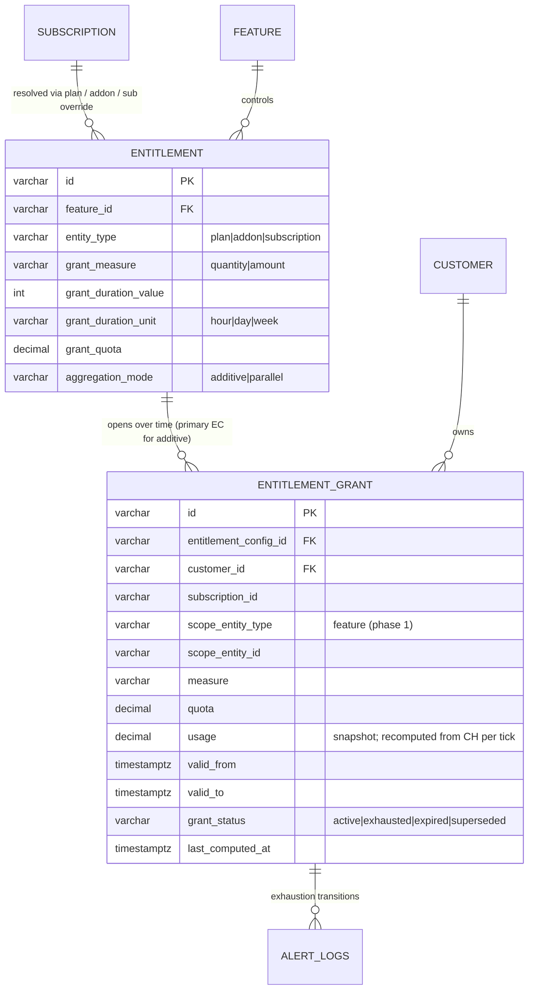
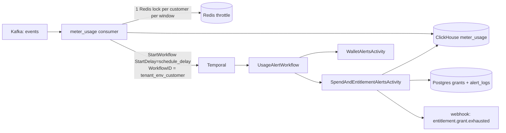

# FLE-959 — Entitlements Revamp: Time-Boxed Grants, Parallel Entitlements, and Usage Alerts

- **Ticket:** [FLE-959](https://linear.app/flexprice/issue/FLE-959/entitlements-revamp)
- **Date:** 2026-07-08 (revised 2026-07-23 to match implementation)
- **Author:** Ankit Malik
- **Status:** Implemented (Phase 1)

---

## 1. Summary

**Entitlement Grants** are time-boxed usage buckets instantiated from entitlements that carry a *grant config*. They add three capabilities on top of the legacy entitlement model:

- **Time-boxed quotas** — "100 tokens per 5 hours", independent of the billing cycle.
- **Aggregation modes** — `additive` (multiple entitlements on a feature merge into ONE summed bucket) or `parallel` (each entitlement is its own independent bucket).
- **Amount-based quotas** — "$50 of compute per day", priced through the existing billing pipeline.

Everything reuses existing infrastructure:

| Concern | Reused surface |
|---|---|
| Pricing (incl. mid-window price changes) | `GetSubscriptionMeterUsageWithSub` + `ConvertToBillingCharges` (per-line-item date-range segmentation) |
| Alerts | `alert_logs` + state-transition dedup (`GetLatestAlert`) |
| Webhooks | `entitlement.grant.exhausted` via the standard alert→webhook pipeline |
| Per-subscription overrides | `GetSubscriptionEntitlements` (plan + addon + sub override resolution) |
| Billing overage | `adjustMeterUsageGrants` inside `CalculateMeterUsageCharges` |

New surface: one PG table (`entitlement_grants`), grant-config columns on `entitlements`, one Temporal workflow (`UsageAlertWorkflow`), one config block (`usage_alerts`).

**SLA:** alerts fire within ≤ `schedule_delay` (default 5m30s) p99 of event ingest.

---

## 2. Concepts

| Term | Meaning |
|---|---|
| **Entitlement Config (EC)** | An `entitlements` row that carries a grant config (`grant_measure`, `grant_duration_*`, `grant_quota`). Presence of the config is the opt-in — there is no separate `grant_type` discriminator. `HasGrantConfig()` in the domain model is the single source of truth. |
| **Entitlement Grant (EG)** | A row in `entitlement_grants`: one concrete, immutable time window with a quota and a usage snapshot. Lifecycle `active → exhausted → expired`. |
| **Aggregation mode** | `additive` (default): all grant ECs on a feature open **one** grant per window with `quota = Σ quotas`. `parallel`: each EC opens its own grant. One mode per feature, enforced at write time. |
| **Measure** | `quantity` (raw meter units) or `amount` (currency). One measure per feature, enforced at write time. |
| **Live grant** | `grant_status IN (active, exhausted)`. Live grants occupy the unique slot per (tenant, env, config, customer); `expired`/`superseded` free it. |
| **Cycle-boundary cap** | `valid_to <= subscription.current_period_end`. Grants never straddle two cycles. |

---

## 3. Data Model

### 3.1 `entitlements` — grant-config columns

```sql
ALTER TABLE entitlements
  ADD COLUMN grant_measure        varchar(20),        -- 'quantity' | 'amount'
  ADD COLUMN grant_duration_value int,
  ADD COLUMN grant_duration_unit  varchar(10),        -- 'hour' | 'day' | 'week'
  ADD COLUMN grant_quota          numeric(25,15),
  ADD COLUMN aggregation_mode     varchar(20) NOT NULL DEFAULT 'additive';
```

Grant config is **all-or-nothing**: either every field is set (metered feature required) or none are (legacy entitlement). The update API clears a config via `clear_grant_config: true`.

### 3.2 `entitlement_grants`

```sql
CREATE TABLE entitlement_grants (
    id                     varchar(50) PRIMARY KEY,          -- prefix eg_
    tenant_id              varchar NOT NULL,
    environment_id         varchar NOT NULL,
    entitlement_config_id  varchar(50) NOT NULL,             -- primary EC for additive groups
    customer_id            varchar(50) NOT NULL,
    subscription_id        varchar(50) NOT NULL,
    scope_entity_type      varchar(20) NOT NULL DEFAULT 'feature',  -- feature | subscription | group (future)
    scope_entity_id        varchar(50) NOT NULL,
    measure                varchar(20) NOT NULL,             -- quantity | amount
    quota                  numeric(25,15) NOT NULL,          -- immutable; Σ quotas for additive groups
    usage                  numeric(25,15) NOT NULL DEFAULT 0,-- snapshot, refreshed per tick
    valid_from             timestamptz NOT NULL,
    valid_to               timestamptz NOT NULL,             -- <= sub.current_period_end
    grant_status           varchar(20) NOT NULL DEFAULT 'active',
    last_computed_at       timestamptz
    -- + standard base columns (status, created_at, ...)
);

-- One live grant per slot.
CREATE UNIQUE INDEX ON entitlement_grants (tenant_id, environment_id, entitlement_config_id, customer_id)
  WHERE grant_status IN ('active','exhausted');

-- Alert-path hot lookup.
CREATE INDEX ON entitlement_grants (tenant_id, environment_id, customer_id)
  WHERE grant_status IN ('active','exhausted');

-- Billing-path cycle-overlap lookup (any status).
CREATE INDEX ON entitlement_grants
  (tenant_id, environment_id, customer_id, scope_entity_type, scope_entity_id, valid_from, valid_to);
```

Alert history lives in `alert_logs` (`entity_type='entitlement_grant'`, `alert_type='entitlement_grant_exhausted'`); `grant_status` is the durable exhaustion signal. There are no per-grant alert bookkeeping columns.

### 3.3 ER diagram



---

## 4. Trigger Pipeline



Per event, after the ClickHouse insert (`runMeterUsagePostInsertSideEffects`, gated by `usage_alerts.enabled`):

1. **Redis throttle** — `AcquireLock(usage_alert_schedule:v1:{customer}, TTL = schedule_delay)`. An event at 5:02pm scheduling a 5:07pm run locks the customer until 5:07pm; the burst in between never calls Temporal. Lock is released on StartWorkflow failure so a later event retries. No Locker configured = fail open.
2. **StartWorkflow** with a stable `WorkflowID` per (tenant, env, customer) and `StartDelay = schedule_delay`. `WorkflowExecutionAlreadyStarted` is the dedup safety net behind the lock.

There is **no pre-scheduling "does this customer have configs" gate** — each workflow-side evaluator bails on cheap indexed DB reads when there is nothing to do.

**Staleness handling** (two distinct queues, two mechanisms; `stale_after` bounds both):

- **Workflow run fired late** — under a workflow-task backlog, a run scheduled for 5:07 may only reach a worker at 6:10. The scheduler stamps the intended fire time (`ScheduledFor`) into the input; a run older than `stale_after` re-schedules **once** via `ContinueAsNew` — the same workflow ID atomically gets a fresh run whose first task lands at the *back* of the queue, so already-queued newer customers evaluate first. No sleeping, no duplicate-workflow race (same ID chain); the `AlreadyRescheduled` flag caps it to one hand-off per chain so a sustained backlog can't livelock.
- **Activity waited too long in the activity queue** — bounded by `ScheduleToStartTimeout = stale_after`. Temporal does not retry schedule-to-start timeouts (a retry would rejoin the same queue); the error is logged and the next event's workflow re-evaluates the customer.

The knobs travel in the workflow input (stamped from config by the scheduler) to keep replays deterministic.

### Config (`usage_alerts`, root of config.yaml)

```yaml
usage_alerts:
  enabled: false          # meter usage pushes the debounce workflow
  schedule_delay: "5m30s" # workflow StartDelay AND Redis throttle-lock TTL
  stale_after: "1h"       # late-run yield (ContinueAsNew) + activity ScheduleToStartTimeout
```

---

## 5. Evaluation (`SpendAndEntitlementAlertsActivity`)

`EvaluateSpendAndEntitlementAlertsForCustomer` fetches the customer's **active subscriptions once** and feeds them to both halves; their errors join (`errors.Join`) so one failing never blocks the other.

### 5.1 Spend alerts

Subscription-level only (line-item and group scopes were dropped). Enabled sub-scoped alert configs are fetched first; only configured subs pay for a usage query. Usage flows through the data-fed `GetMeterUsageForSubscription` → `CalculateMeterUsageCharges`; the total is compared against thresholds and logged via `alert_logs`.

### 5.2 `EnsureGrantsForSubscriptions`

For each subscription, resolve its entitlements (`GetSubscriptionEntitlements` — plan + addon + sub overrides), keep those with a grant config, then per feature:

- Skip ECs whose `grant_duration >= cycle length` — a grant spanning the whole cycle is just the cycle quota, which legacy `usage_limit + usage_reset_period` already expresses. Avoids redundant rows and evaluation.
- **parallel** → one grant per EC without a live slot.
- **additive** → ONE grant for the group with `quota = Σ quotas`, opened on the lowest-ID ("primary") EC's slot. One bucket downstream means evaluation, alerts, and billing treat the group as a single pool with no extra machinery.

Grant opening (`openOneGrant`): expire the stale live row on the slot if its window closed, INSERT with the partial unique index as the race arbiter (loser re-reads the winner).

**Window math (`computeGrantWindow`):**

- **Continuity**: when a previous grant exists in this cycle, the new window starts exactly at its `valid_to` — no coverage gap, even if evaluation was delayed. Usage recompute from CH is idempotent, so late catch-up windows still account correctly (catch-up walks one window per tick).
- **Fresh slots** start `schedule_delay` in the past — the debounce window bounds how old the triggering event can be, so already-ingested events always land inside the first window.
- `valid_to = min(valid_from + duration, cycle_end)` — cycle-boundary cap.
- Windows under **1 hour** are skipped (trailing cycle remainder waits for the new cycle).

Grants are immutable for their lifetime; EC/mode/quota changes take effect from the next window.

### 5.3 Usage refresh + exhaustion

Per live feature-scoped grant, over `[valid_from, min(now, valid_to))`:

- **quantity** — one raw `meter_usage` query (`dto.GrantWindowUsageRequest.ToParams()`, FINAL consistency).
- **amount** — rides the billing path: `GetSubscriptionMeterUsageWithSub` + `ConvertToBillingCharges`, summing the charges for the grant's meter. The billing path splits the window into per-line-item date ranges, so a **mid-window price change produces a new segment priced at its own price** — no price pinning, no retroactive repricing.

Snapshot write (`UpdateSnapshot`): `usage`, `last_computed_at`, and `active → exhausted` when `usage >= quota`.

**Alerts fire on exhaustion only** (`usage/quota >= 1`): one `alert_logs` row (`in_alarm`) per grant, deduped by state transition, delivered as the `entitlement.grant.exhausted` webhook (payload: subscription + grant id + usage ratio). Recovery is a new grant window, not a state flip.

---

## 6. Billing Overage — `adjustMeterUsageGrants`

Runs inside `CalculateMeterUsageCharges`. Grants for the cycle are loaded once per invoice build (`WithCycleOverlap` — **includes expired**: a grant that exhausted mid-cycle still owes its overage) and folded per line item, replacing the legacy entitlement adjustment for that feature.

**Overage-sum model:** `Σ max(0, grant.usage − grant.quota)` across the cycle's grants. Each grant is an independent budget — combined-pool was rejected because it silently masks overage across parallel budgets. Additive groups are already one summed grant, so the same formula covers both modes.

- **Quantity lane** — the summed overage becomes the billable quantity for the pricer (commit / tier / true-up apply on top as usual).
- **Amount lane** — the summed overage is already currency; it lands directly on the line item and the quantity zeroes so nothing double-counts. A runtime guard skips folding when the line item carries commitment or true-up, or the price is tiered (those need full-cycle pricing scope) — EC-write validation prevents the tiered case, the guard covers config drift and sub-line-level commitments invisible at EC-write time.

Only **feature-scoped** grants fold per meter. A future subscription- or group-scoped grant spans multiple meters; folding it per line item would count its overage once per meter, so those scopes wait for an invoice-level allocation pass.

---

## 7. Restrictions (enforced)

**EC write time (domain + service validation):**

1. Grant config is all-or-nothing: `grant_measure` + `grant_duration_value/unit` + `grant_quota`, on **metered features only**; `grant_quota > 0`.
2. `grant_duration >= 1 hour`.
3. No **MAX** meters (peak, not additive consumption) and no **bucketed** meters (a grant window slices buckets ambiguously).
4. `measure='amount'` rejects **tiered** prices on the meter — amount grants require linear/flat per-unit pricing.
5. `aggregation_mode='parallel'` requires a grant config (legacy entitlements are always additive).
6. **Cross-EC coherence per feature**: one aggregation mode, one measure; **additive** groups must also share `grant_duration` (their quotas sum into one window).

**Grant open time:**

7. `grant_duration < subscription cycle length` — cycle-spanning grants are skipped (use `usage_reset_period` instead).
8. Cycle-boundary cap: `valid_to <= current_period_end`; trailing windows `< 1 hour` are skipped.
9. One live grant per (tenant, env, config, customer) — partial unique index.
10. Grants are immutable; config changes apply from the next window.

**Runtime (billing fold):**

11. Amount-lane folding skips line items with commitment / true-up / tiered pricing (belt-and-braces).
12. Only feature-scoped grants fold per meter.

**Alerting:**

13. Exhaustion-only (`usage/quota >= 1` → `in_alarm`), deduped by alert-log state transition; no intermediate thresholds, no recovery transitions.

---

## 8. Failure Modes

| Failure | Behavior |
|---|---|
| Activity crashes / retried | Alert dedup (state transition) + idempotent `UpdateSnapshot` + `EnsureGrants` convergence make retries safe. |
| Redis unavailable | Throttle fails open; Temporal `AlreadyStarted` dedup absorbs duplicates. |
| Temporal unavailable | CH insert + Kafka ack unaffected; alerts delayed, not lost. |
| Evaluation delayed / consumer down | Windows butt-joint on catch-up — no coverage gap; catch-up opens one window per tick and recomputes usage from CH. |
| Backdated events | Usage is always recomputed from CH over the grant window, never incremented — late events inside a window are picked up on the next tick. |
| Slot race (two workers opening) | Partial unique index; loser re-reads the winner. |
| Workflow-task backlog | Late-firing runs yield once via `ContinueAsNew` to the back of the queue; newer customers evaluate first. |
| Activity-queue backlog | `ScheduleToStartTimeout` bounds the wait; error logged, next event's workflow re-evaluates. |

---

## 9. Decisions Log

| Decision | Rationale |
|---|---|
| No `grant_type` column | Fully derivable: an entitlement with a grant config *is* grant-based (`HasGrantConfig()`). Fewer knobs, no half-set states. |
| `aggregation_mode` enum (`additive` default / `parallel`) instead of a `parallel` bool | Names the semantic; additive stays the legacy-compatible default. |
| Additive = ONE summed grant on the primary EC slot | Single pool downstream — evaluation, alerts, billing need zero group-awareness. Splitting usage across same-feature buckets would need attribution machinery. |
| Parallel = one grant per EC slot | Independent windows/budgets; per-grant overage summed for billing (combined-pool rejected — masks overage). |
| No price pinning on amount grants | The billing path already segments queries by line-item date ranges; a mid-window price change is priced per segment. Pinning would freeze the whole window at one price — worse. |
| Continuity window math (butt-joint previous `valid_to`) | No coverage gaps; every event belongs to exactly one window; CH recompute makes late catch-up idempotent. Fresh slots start `schedule_delay` back — derived from config so the grace tracks the debounce window. |
| Skip `duration >= cycle length` at open | Cycle-scoped quotas already exist as `usage_reset_period`; avoids redundant rows/evaluation. Checked at open (not write) because cycle length is per-subscription. |
| Cycle-boundary cap | Pricer stays cycle-scoped; no cross-cycle config ambiguity. |
| Exhaustion-only alerts | Product decision; alert history in `alert_logs`, `grant_status` is the durable signal. Intermediate thresholds can return later without schema changes. |
| Redis schedule-throttle + Temporal `StartDelay` (not Schedules, not in-workflow sleep) | `StartDelay` is the native one-shot debounce primitive — no task dispatched until fire time; the Redis lock keeps the per-event Temporal RPC to one per customer per window. Schedules are for recurring triggers; in-workflow sleep burns a task immediately. |
| No pre-scheduling config gate | Workflow-side evaluators bail on cheap indexed reads; a gate duplicates those checks and risks false negatives (missed grant evaluation = billing wrongness). |
| Spend alerts subscription-level only | Line-item/group spend alerts dropped by design review; settings CRUD retained for now. |
| `ContinueAsNew` for late-firing workflow runs | Temporal's native "replace myself with a fresh run": same workflow ID (no duplicate race), fresh task at the back of the queue, no in-workflow sleep. One yield per chain guards against livelock. |
| `ScheduleToStartTimeout` for activity-queue waits | Temporal's out-of-the-box queue-wait bound; not retried by policy (a retry rejoins the same queue). Distinct from workflow-run staleness — different queues. Knobs ride the workflow input for replay determinism. |
| Minimum grant duration 1 hour; hour/day/week units | Product rule — no noisy short buckets. |

---

## 10. Phase 2 (future, not building now)

Real-time (<60s) alerting via per-event Redis counters, CH `seq_id`/`ingest_epoch` ordering, cold-path bootstrap from PG snapshots, and per-event wallet decrement (Phase 3). The 5-minute pipeline remains the reconciliation layer. Detailed ERD to be written when committed; earlier draft retained in git history of this file.
