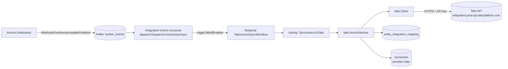
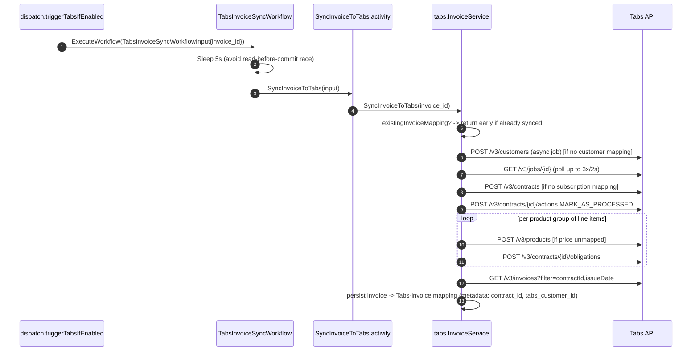

# FLE-965 — Tabs Integration: push finalized invoices to Tabs as contract obligations

- **Ticket:** [FLE-965](https://linear.app/flexprice/issue/FLE-965)
- **Date:** 2026-07-08
- **Author:** Gursimar Singh
- **Status:** Documented post-implementation (branch `FLE-965`)
- **Reviewers:** _tbd_

> This ERD was written after the implementation landed, to record the design intent and reuse decisions for review. §9 (Rollout) and §10 (Open Questions) reflect actual state, not a forward-looking plan.

---

## 1. Executive Summary

- **What ships (Phase 1):** One-way (outbound) sync of finalized FlexPrice invoices into [Tabs](https://tabsplatform.com) as contract **obligations**, triggered automatically when an invoice is finalized. Tabs is added as the 10th integration provider alongside Stripe, Chargebee, QuickBooks, Zoho Books, Paddle, Whop, HubSpot, Razorpay, Nomod, Moyasar.
- **Data:** No new tables. Reuses `entity_integration_mapping` with one new `EntityType` (`invoice_line_item`) and a new `ProviderType` value (`tabs`).
- **Reused:** integration-events dispatch fan-out, connection/secret storage + encryption, `entity_integration_mapping` idempotency ledger, Temporal per-provider workflow/activity pattern, integration `Factory` provider-construction pattern.
- **New infra:** None — one new outbound HTTP client (`internal/integration/tabs`), one new Temporal workflow/activity pair, all on existing task queues.
- **Target:** Best-effort async sync within the existing invoice-finalization pipeline; no hard SLA (matches the other 9 outbound providers).
- **Deferred:** Inbound/webhook sync from Tabs (no callbacks for invoice-paid, obligation-updated, etc.). Tabs *is* now registered in the generic factory registries (`GetIntegrationByProvider` / `GetSupportedProviders` / `GetAvailableProviders`), but `PullAndUpdateInvoice` returns "not supported" — so pull-resync is a no-op for Tabs, same as most other providers. See §3.2.

## 2. Motivation

### 2.1 What we're building

When a FlexPrice invoice is finalized, its line items are pushed to Tabs as billing **obligations** on a Tabs **contract**, so that Tabs — the customer's contract and revenue-recognition system — has an accurate, up-to-date mirror of what FlexPrice billed. Concretely, for an invoice with two line items (a $500 platform fee and a $120 usage overage) on the same price/product, FlexPrice: ensures the customer and subscription exist in Tabs, creates one obligation of $620 against the mapped Tabs product, and records the resulting Tabs invoice ID back onto the FlexPrice invoice via a mapping row.

### 2.2 Why we need it

A specific customer/partner contract requires that invoices raised in FlexPrice also be reflected as obligations in Tabs, since Tabs is the system of record the partner uses for contract billing and revenue recognition on that deal. Without this sync, the partner would have to re-key FlexPrice invoice data into Tabs by hand.

## 3. Goals & Non-Goals

### 3.1 Goals (this phase)

- Automatically sync every finalized, subscription-linked invoice to Tabs with no manual step, using the existing invoice-finalization → integration-events pipeline.
- Be idempotent and safe to retry at every level (customer, contract, product, obligation, invoice) so partial failures don't create duplicate Tabs entities.
- Support manual re-trigger via the existing `POST` sync-entity path (`IntegrationSyncService.SyncEntity`, push method) for ops/support use.
- Follow the established per-provider integration shape exactly (client / service / activities / workflow / factory wiring) so it needs no bespoke review model.

### 3.2 Non-Goals

- **No inbound/webhook sync.** Tabs does not push events (invoice paid, obligation updated, etc.) back into FlexPrice in this phase. Compare Whop, which has a `MarkWhopInvoicePaid` workflow for exactly this — Tabs has no equivalent.
- **No pull/resync support.** Tabs is registered in `Factory.GetIntegrationByProvider`, `GetSupportedProviders`, and `GetAvailableProviders` (`factory.go:735`, `:760`, `:1240`) so it is visible to the generic integration paths and provider-listing, consistent with every other provider. But `TabsIntegration.PullAndUpdateInvoice` returns "not supported" (`factory.go:1049`) — identical to Stripe/HubSpot/Chargebee/Nomod/Zoho/Whop — so `IntegrationSyncService.pullInvoice` is effectively a no-op for Tabs. Only the push path (`syncInvoice` → Kafka → `DispatchInvoiceVendorSync` → `triggerTabsIfEnabled`) actually syncs.
- **No customer creation outside of invoice sync.** There is no standalone "sync customer to Tabs" trigger (unlike Stripe/Paddle/etc., which have `triggerXCustomerSyncIfEnabled`); a Tabs customer is only created lazily, the first time that customer's invoice is synced.
- **No multi-currency / multi-line-item-cadence obligations beyond simple aggregation.** Line items are grouped only by their mapped Tabs product; cadence comes from the first item's price in the group. Mixed-cadence line items on the same product in one invoice are not specially handled.
- **No tiered/usage-based Tabs pricing.** Every obligation is built as `PricingType: SIMPLE`, `BillingType: FLAT`, a single `TOTAL_INVOICE` tier — FlexPrice always sends Tabs a pre-computed total, never raw usage.

## 4. Terminology

| Term | Meaning |
|---|---|
| Tabs **Customer** | Tabs-side counterpart of a FlexPrice `customer.Customer`. Created async via a Tabs job. |
| Tabs **Contract** | Tabs-side counterpart of a FlexPrice `subscription.Subscription`. One contract per subscription, named after the plan. |
| Tabs **Product** | Tabs-side counterpart of a FlexPrice `price.Price`. One product per distinct price referenced by an invoice's line items. |
| Tabs **Obligation** | A charge on a contract — the counterpart of one or more FlexPrice `invoice.InvoiceLineItem`s grouped by product. |
| Tabs **Job** | Tabs' async-operation envelope (used only for customer creation); polled via `GET /v3/jobs/{id}` until `SUCCESS`/`FAILED`. |
| `entity_integration_mapping` | Existing table (`internal/domain/entityintegrationmapping/model.go:11`) that stores FlexPrice-entity → provider-entity ID pairs; used here for all four mapping kinds (customer, subscription→contract, price→product, line-item→obligation, invoice→contract). |

## 5. High-Level View

### 5.1 System context

### 5.2 Sequence — happy path

## 6. Current State (Baseline)

### 6.1 The outbound-invoice-sync subsystem today

Before this change, `internal/integration/events/dispatch.go` already fanned a finalized invoice out to 9 providers via `DispatchInvoiceVendorSync`, each behind the same three gates: (1) `cfg.IntegrationEvents.Enabled`, (2) a published `connection` for that provider with `IsInvoiceOutboundEnabled()`, (3) no existing `entity_integration_mapping` row for `(invoice_id, invoice, provider)`. Each provider then starts its own Temporal workflow on `TemporalTaskQueueTask`. Tabs is the 10th provider added to this exact fan-out list — no new dispatch mechanism was introduced.

### 6.2 What we reuse (the reuse map)

| Need | Existing pattern (`file.go:line`) | What we get for free |
|---|---|---|
| Fan-out trigger on invoice finalize, config/connection/idempotency gating | `internal/integration/events/dispatch.go:100` (`DispatchInvoiceVendorSync`), pattern e.g. `triggerZohoBooksIfEnabled` at `dispatch.go:620` | No new Kafka topic, no new race-condition handling — the existing 5s-sleep-then-fetch pattern (`dispatch.go:79-81` comment) already solves the "event arrives before DB commit" problem |
| Encrypted per-tenant provider credentials | `internal/ee/service/connection.go` `encryptMetadata` switch (e.g. Whop case just above the new Tabs case), `security.EncryptionService` | Tabs API key is encrypted/decrypted using the same service every other provider uses — no new crypto code |
| Idempotent FlexPrice-entity ↔ provider-entity mapping | `internal/domain/entityintegrationmapping/model.go:11` + `types.NewNoLimitEntityIntegrationMappingFilter` | The customer/contract/product/obligation mapping chain in `tabs.go` is just repeated `List`+`Create` calls against the existing table — no new persistence layer, and retries are safe by construction (§8.y) |
| Temporal per-provider workflow/activity registration | `internal/temporal/registration.go:246` (`tabsActivities.NewInvoiceSyncActivities`), pattern from `zohoInvoiceSyncActivities` just above it | Workflow tracking, retry policy (3 attempts, 5m timeout), and task-queue placement (`TemporalTaskQueueTask`) come for free — `internal/temporal/workflows/tabs_invoice_sync_workflow.go` is a near-identical copy of the Zoho Books workflow |
| Deterministic workflow ID (dedupe concurrent syncs for the same invoice) | `internal/temporal/service/service.go:464` (`extractWorkflowContextID` case `TemporalTabsInvoiceSyncWorkflow`) | Two Kafka redeliveries of the same finalize event can't start two concurrent Tabs syncs for the same invoice |
| Provider construction / DI wiring | `internal/integration/factory.go:683` (`GetTabsIntegration`), mirrors `GetZohoBooksIntegration` immediately above it (connection-must-be-published guard, then wire client + service) | Consistent error shape (`ErrNotFound` with a hint) when a tenant hasn't configured Tabs yet |
| HTTP client scaffolding (auth header, JSON marshal/unmarshal, tracing transport) | `internal/httpclient.OtelTransport`, pattern shared with every other provider's `Client` | OTel spans on every Tabs API call for free |

### 6.3 What's being removed / deprecated

Nothing. This is purely additive.

## 7. Data Model

No new tables. Two additive, backward-compatible changes to existing enums:

| Change | Location | Purpose |
|---|---|---|
| New `SecretProvider` value `tabs` | `internal/types/secret.go:45` | Lets `connection` rows and `entity_integration_mapping.provider_type` reference Tabs |
| New `IntegrationEntityType` value `invoice_line_item` | `internal/types/entityintegrationmapping.go:22` | Lets a mapping row point at a single invoice line item, needed because one Tabs obligation covers a *group* of line items, not a whole invoice — see §8.y |
| New `ConnectionMetadata.Tabs` struct (`{api_key}`) | `internal/types/connection.go:348` | Stores the encrypted Tabs API key the same way every other provider's connection metadata does |

`entity_integration_mapping` rows this feature writes, all under `provider_type = "tabs"`:

| `entity_type` | `entity_id` | `provider_entity_id` | Written by |
|---|---|---|---|
| `customer` | FlexPrice customer ID | Tabs customer ID | `ensureCustomer` (`tabs.go:177`) |
| `subscription` | FlexPrice subscription ID | Tabs contract ID | `ensureContract` (`tabs.go:236`) |
| `price` | FlexPrice price ID | Tabs product ID | `createProduct` (`tabs.go:489`) |
| `invoice_line_item` | FlexPrice line item ID | Tabs obligation ID | `mapLineItemsToObligation` (`tabs.go:403`) |
| `invoice` | FlexPrice invoice ID | Tabs **invoice** ID | `mapInvoice` (`tabs.go:155`), with `contract_id`, `tabs_customer_id`, `tabs_invoice_id`, `synced_at` in `metadata` |

The `invoice` mapping stores the Tabs **invoice** ID as `provider_entity_id` (`tabs.go:161`), consistent with how every other provider maps a FlexPrice invoice to its provider-side invoice. The Tabs contract ID is preserved in `metadata.contract_id`.

## 8. Approach

`tabs.InvoiceService.SyncInvoiceToTabs` (`internal/integration/tabs/tabs.go:61`) runs, in order:

1. **Idempotency check** — if the invoice already has a published `invoice`-type Tabs mapping, return it unchanged (no API calls). (`tabs.go:68`)
2. **`ensureCustomer`** — look up or create the Tabs customer. Creation is async (Tabs returns a `jobId`); `WaitForJob` polls `GET /v3/jobs/{id}` up to 3× every 2s (bounded further by the activity's 5-minute `StartToCloseTimeout`). (`tabs.go:177`, `client.go:217`)
3. **`ensureContract`** — requires the invoice to be subscription-linked (validation error otherwise, since "Tabs obligations are created on a contract, which maps to a subscription" — `tabs.go:90`). Contract creation is synchronous; it's immediately transitioned `NEW → PROCESSED` via a contract action before the mapping is persisted, so a persisted mapping always means "fully usable contract". (`tabs.go:236`)
4. **`syncObligations`** — bulk-loads the invoice line items' prices, resolves/creates a Tabs product per distinct price, groups line items by product, and creates one obligation per group (amount = sum of the group, service period = union of the group's periods, billing-schedule start = invoice issue date, invoice-date strategy derived from the price's `InvoiceCadence`: `ADVANCE → FIRST_OF_PERIOD`, `ARREAR → ARREARS`). (`tabs.go:308`)
5. **`fetchTabsInvoiceID`** — Tabs generates its own invoice from the obligations; FlexPrice looks it up by `contractId` + `issueDate` and records it for observability. (`tabs.go:521`)
6. **`mapInvoice`** — persists the final invoice → Tabs-invoice mapping (Tabs invoice ID as `provider_entity_id`; contract ID, Tabs customer ID and `synced_at` in metadata), making step 1 a no-op on any retry. If Tabs hasn't generated an invoice yet (`tabsInvoiceID == ""`), the sync errors out (`tabs.go:114`) rather than persisting an incomplete mapping. (`tabs.go:155`)

### 8.y Failure modes

| Failure | Behavior |
|---|---|
| Kafka redelivers the finalize event | `invoiceAlreadySynced` check in `dispatch.go:38` skips re-dispatch once the `invoice` mapping exists; deterministic workflow ID also prevents a concurrent duplicate run |
| Activity crashes after customer created, before contract created | Retry re-enters `SyncInvoiceToTabs`; `ensureCustomer` finds the existing mapping and returns immediately without calling Tabs again |
| Activity crashes after obligation group 1 succeeds, before group 2 is attempted | Retry re-enters `syncObligations`; `groupAlreadySynced` (`tabs.go:392`) skips group 1 because its line items already carry `invoice_line_item` mappings — only group 2 is retried, so group 1's obligation is never duplicated |
| Tabs connection missing/unpublished at sync time | `GetTabsIntegration` returns `ErrNotFound`; the activity wraps it as a **non-retryable** Temporal application error (`activities/tabs/invoice_sync_activities.go:34`) so the workflow doesn't burn retries on a config problem |
| Tabs job (customer creation) never reaches `SUCCESS`/`FAILED` | `WaitForJob` gives up after 3 polls (~6s) and returns a system error; the Temporal activity retries the whole activity (up to 3 attempts per the workflow's `RetryPolicy`), each attempt re-polling |
| Invoice not linked to a subscription | Hard validation error, no partial Tabs state created (customer step happens first and is safely re-runnable, but contract/obligation steps never start) |

## 9. Rollout Plan (actual)

- **Gate:** `cfg.IntegrationEvents.Enabled` (existing global flag for the whole integration-events pipeline, not Tabs-specific) + per-tenant: a published `connection` with `provider_type=tabs` and `sync_config.invoice.outbound=true`. No tenant is affected until both are true, i.e. rollout is opt-in per tenant by connection setup — no separate feature flag was added for Tabs specifically, consistent with how the other 9 providers ship.
- **Rollback:** unpublish (or delete) the tenant's Tabs connection; no code rollback needed since the sync is fully gated by connection state. In-flight workflow retries will hit the non-retryable `ErrNotFound` path and stop cleanly (§8.y).

## 10. Open Questions

1. **`ListInvoicesResponse` / `TabsInvoice` DTOs are marked "best guess pending a confirmed sample response"** (`dto.go:50-57`) — they were written against Tabs' documented shape, not a captured real response. Since `mapInvoice` now stores the Tabs invoice ID as the mapping's `provider_entity_id` (not just metadata), an incorrect DTO shape means `fetchTabsInvoiceID` returns `""` and the whole sync fails at `tabs.go:114` — so this must be verified against a live Tabs sandbox call before it's trusted for a real customer.
2. **`jobPollAttempts`/`jobPollInterval` (3 attempts × 2s ≈ 6s)** is quite short for an async customer-creation job with no documented Tabs SLA. If Tabs' job actually takes longer under load, every first sync for a new customer will fail and rely on the workflow's 3× activity retry to eventually succeed — worth confirming Tabs' real p99 job latency.
3. **Tabs products no longer carry the FlexPrice price ID** (`integrationItemId` was dropped from `CreateProductRequest`). The price↔product association now lives only in FlexPrice's `entity_integration_mapping`, not on the Tabs side — confirm Tabs doesn't need a back-reference for its own reconciliation/reporting.

## 11. Alternatives Considered

| Alternative | Rejected because |
|---|---|
| Route Tabs sync through `interfaces.EntityIntegrationMappingService` (the adapter Paddle uses, `factory.go:108`) instead of calling `mappingRepo` directly | Every other push-only provider (Stripe, Zoho, Chargebee, etc.) also calls `entityIntegrationMappingRepo` directly; the adapter exists specifically to decouple Paddle's more complex bidirectional sync loop. Using it here would be inconsistent with the simpler providers this one most resembles, for no benefit. |
| One obligation per line item (no product grouping) | Tabs contracts likely expect one obligation per priced product, and grouping avoids creating N nearly-identical obligations for, e.g., a plan with a flat fee plus several usage line items on the same price. Chosen grouping key is the Tabs product (i.e., the FlexPrice price), matching how Tabs models recurring charges. |
| Real-time (synchronous) Tabs sync during invoice finalization, instead of async via Kafka + Temporal | Every other provider already uses the async dispatch pattern specifically to keep invoice finalization fast and to get Temporal's retry/idempotency guarantees for free; deviating here would both slow down finalization and require bespoke error handling. |

## 12. Decisions Log

| Decision | Rationale |
|---|---|
| Add Tabs as provider #10 using the exact same client/service/activity/workflow/factory shape as the other providers | Minimizes reviewer cognitive load and reuses every cross-cutting concern (idempotency, retries, encryption, dispatch gating) instead of re-deriving it |
| Group line items by Tabs product before creating obligations, rather than 1:1 | Matches Tabs' contract/obligation data model (one obligation = one charge type) and keeps the number of Tabs API calls proportional to distinct products, not line items |
| Use `entity_integration_mapping` with a new `invoice_line_item` entity type instead of a new join table | The existing mapping table already generalizes to "any FlexPrice entity ↔ any provider entity"; adding a table for one new granularity would duplicate its schema for no new capability |
| Mark Tabs contracts `PROCESSED` immediately after creation, before persisting the mapping | Ensures a persisted subscription→contract mapping always represents a contract that's actually usable for obligations, so a retry never has to special-case "contract exists but isn't processed yet" |
| No dedicated Tabs customer-sync trigger (unlike Stripe/Paddle) | Tabs customers are cheap to create lazily on first invoice sync and there's no other trigger (e.g. no `customer.created` webhook consumer) that currently needs a Tabs customer to exist ahead of an invoice |
| Store the Tabs **invoice** ID (not contract ID) as the `invoice` mapping's `provider_entity_id` | Consistency with every other provider's `invoice` mapping; the contract ID is preserved in `metadata.contract_id`. Removes the asymmetry that was previously flagged as an open question |
| Dropped `integrationItemId` from `CreateProductRequest` | The price↔product link is fully owned by FlexPrice's `entity_integration_mapping`; sending a redundant back-reference to Tabs added coupling with no consumer (tracked as Open Question #3) |
| Registered Tabs in `GetIntegrationByProvider`/`GetSupportedProviders`/`GetAvailableProviders` | Tabs is now visible to the generic integration and provider-listing paths for consistency with every other provider; `PullAndUpdateInvoice` stays "not supported" so no pull behavior is added |
| Removed unused `TemporalIntegrationInvoiceSyncWorkflow` constant | Added to `types/temporal.go` during development but never wired to a workflow function or dispatch trigger; dead code, removed rather than documented as a gap |
