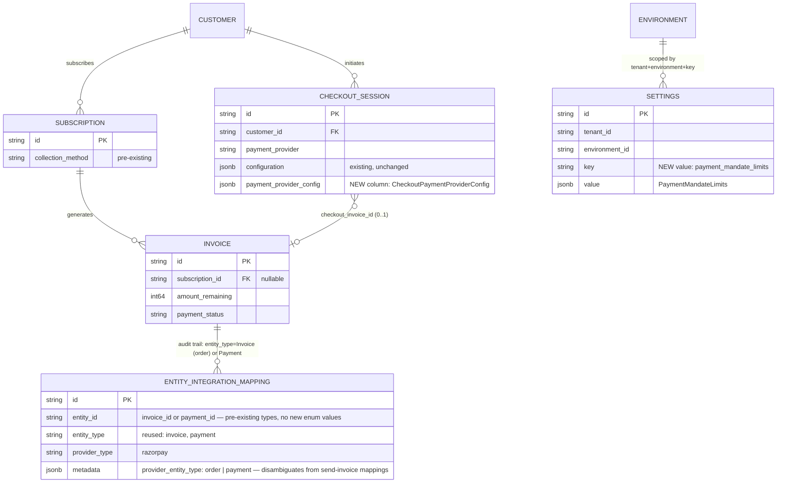

# Razorpay UPI Autopay Auto-Charge — Design & Status

Status: **Checkout mandate registration + opportunistic invoice auto-charge implemented and tested at the unit level.**
Date: 2026-07-11
Branch: `feat/razorpay-autocharge` ([PR #2219](https://github.com/flexprice/flexprice/pull/2219))
Supersedes: `docs/prds/razorpay-upi-autopay-prd.md`, `docs/prds/razorpay-upi-autopay-handoff.md`, `docs/prds/razorpay-autocharge-implementation-handoff.md`, `docs/prds/razorpau-runbook.md`, `docs/superpowers/specs/2026-07-10-razorpay-late-webhook-refund-design.md` (all removed by this PR — this doc is the single durable record of problem, approach, ERD, testing, and scenario coverage).

---

## 1. Problem Statement

Every Razorpay invoice — one-off or subscription — was sent for manual payment via a Payment Link, regardless of a subscription's `collection_method`. There was no mandate/token registration, no auto-charge on invoice finalize, and mandate-lifecycle webhooks were silently dropped.

**Goal**: let a customer authorize a UPI Autopay mandate at checkout, then auto-charge subsequent invoices against it — up to the mandate's registered ceiling — falling back to manual payment (Payment Link) whenever auto-charge isn't possible, with **zero behavior change** for tenants who don't opt in and the mandate token **never stored locally**.

## 2. Approach Taken (as actually implemented)

The implementation diverged from the original PRD in a few deliberate ways during build-out (see §7). The description below reflects the real, shipped code.

### 2.1 Mandate registration (checkout)

- A checkout caller opts in explicitly per-session via `POST /v1/checkout/sessions { payment_provider_config: { collection_method, preferred_method, max_mandate_limit } }` — there is no server-side heuristic or tenant-wide default; `CollectionMethodChargeAutomatically` on the request is the only opt-in signal (`internal/types/checkout_configuration.go`, `CheckoutPaymentProviderConfig`).
- `executeCheckoutAction` → `callCheckoutProvider` (`internal/ee/service/checkout_session_actions.go`) routes to `CreateAuthorizationLink` (mandate flow) instead of the existing `CreatePaymentLink` when `collection_method == charge_automatically`.
- `CreateAuthorizationLink` (`internal/integration/razorpay/mandate.go`) calls Razorpay's Registration Link API (`type: "link"`, `subscription_registration.method: "upi"`) — one call registers the mandate **and** pays the first invoice together. Only UPI is supported today; any other `preferred_method` returns `ierr.ErrNotImplemented`.
- **The mandate token is never persisted locally.** `ent/schema/paymentmethod.go` is untouched by this feature. Every check (checkout-time dedup, invoice-time charge) calls `client.GetCustomerTokens` live against Razorpay and picks a usable one via `SelectUsableToken` (confirmed, non-expired, method-matched, under the token's own registered ceiling, newest wins).

### 2.2 Invoice auto-charge

- Entry: `SyncInvoiceToRazorpayIfEnabled` (`internal/ee/service/invoice.go`) — invoked from the finalize-invoice Temporal activity — gates only on `AmountRemaining != 0`, payment not already succeeded, and a Razorpay connection with outbound sync enabled.
- `InvoiceSyncService.SyncInvoice` (`internal/integration/razorpay/invoice.go`) **always attempts auto-charge first, opportunistically**, for any eligible invoice — it is not gated by the originating subscription's `collection_method` or by anything stored on the invoice itself. If the customer has *any* usable UPI token (from *any* prior checkout), the invoice is auto-charged; otherwise it falls through to the existing send-invoice/Payment-Link path unchanged.
- `executeAutoCharge` creates a Razorpay `order` (`receipt = invoiceID`, Razorpay-native dedup) and submits a recurring payment against the selected token via `AutoCharge`/`submitRecurringPayment` (`internal/integration/razorpay/payment.go`).

### 2.3 Idempotency — three independent layers, no new claim table

1. **Local payment-row state machine**: `findOrCreateAutoChargePayment` looks up an existing payment by idempotency key `autocharge:<invoiceID>`. `INITIATED`/`PENDING` → reused; anything terminal or in-flight (`PROCESSING`, `SUCCEEDED`, `OVERPAID`, `FAILED`, `VOIDED`, `REFUNDED`, `PARTIALLY_REFUNDED`) → skipped, no charge attempted.
2. **Distributed lock**: `cache.Locker.AcquireLock(ctx, "razorpay:autocharge:{tenant}:{env}:{invoiceID}", 15m)`. Invoice/payment state is re-fetched and re-checked *after* acquiring the lock, closing the race between the initial check and lock acquisition.
3. **Razorpay-native idempotency**: `receipt=invoiceID` on order creation — Razorpay itself rejects a duplicate-receipt order; the duplicate/already-processing responses are treated as "already submitted" and left for webhook reconciliation rather than retried inline.

No new `IntegrationEntityType` or `idempotency.Scope` was added. `createAutoChargeMappings` writes best-effort, non-fatal audit-trail rows onto the pre-existing `IntegrationEntityTypeInvoice`/`IntegrationEntityTypePayment` mappings (disambiguated via `metadata.provider_entity_type`) — these are audit trail only, not the reconciliation mechanism.

## 3. ERD (as actually implemented)

**No `PaymentMethod` row, no `Invoice.collection_method` field, no new `entity_integration_mapping` entity types** — all three were part of the original PRD/handoff design but were dropped or never wired in during implementation (§7).

## 4. What's Implemented

| Piece | Status |
|---|---|
| Checkout mandate registration (`CreateAuthorizationLink`, Registration Link API) | ✅ Implemented |
| Live token lookup, no local storage (`GetCustomerTokens`, `SelectUsableToken`) | ✅ Implemented |
| Opportunistic invoice auto-charge (`InvoiceSyncService.SyncInvoice` → `executeAutoCharge`) | ✅ Implemented |
| Idempotency (local payment state machine + Redis lock + Razorpay `receipt` dedup) | ✅ Implemented |
| `payment.captured` / `payment.failed` / `payment_link.*` webhook handling | ✅ Implemented (pre-existing, extended) |

## 5. What's Already Tested

- **`internal/integration/razorpay/invoice_autocharge_test.go`** (`AutoChargePaymentSuite`) — the only dedicated test file for this feature. Covers the local payment-record idempotency state machine exhaustively: no existing record → creates `INITIATED`; existing `INITIATED`/`PENDING` → reused; existing `PROCESSING`/`SUCCEEDED`/`OVERPAID`/`FAILED`/`VOIDED`/`REFUNDED`/`PARTIALLY_REFUNDED` → all skipped; same-invoice double-call → same payment ID returned. Uses an in-memory fake repository, not a real DB.
- Two incidental, non-behavioral test updates (`internal/temporal/activities/paddle/subscription_sync_activities_test.go`, `internal/testutil/base_service_suite.go`) to thread a `nil` `cache.Locker` through `integration.NewFactory(...)` after the constructor gained that param.

## 6. Scenarios It Handles

| # | Scenario | Handling |
|---|---|---|
| 1 | Checkout opts into `charge_automatically` + `preferred_method=upi` | Registration Link issued; mandate + first invoice payment happen together |
| 2 | Checkout with `collection_method` unset or `send_invoice` | Unchanged baseline: plain Payment Link |
| 3 | Later invoice, customer already has a usable UPI token from any prior checkout | Auto-charged opportunistically, independent of that invoice's own subscription's `collection_method` |
| 4 | No usable token (never registered, expired, rejected, over the token's own ceiling) | Falls back to existing send-invoice/Payment-Link path, unchanged |
| 5 | Duplicate auto-charge attempt for the same invoice (retry, concurrent Temporal activity) | Local payment idempotency key (`autocharge:<invoiceID>`) + Redis lock + Razorpay `receipt` dedup — three independent backstops |
| 6 | Razorpay returns "duplicate receipt" / "order already processing" | Treated as already-submitted, not retried inline; left for webhook to resolve |
| 7 | `payment.captured` / `payment.failed` webhook for an auto-charged invoice | Handled — marks payment/invoice accordingly |
| 8 | Tenant/checkout never opts in | Zero behavior change — existing Payment Link flow untouched |

## 7. Notable Divergences From the Original Plan (for anyone picking this up later)

The original PRD/handoff docs (now removed, see header) designed a `PaymentMethod`-backed token store, an `Invoice.CollectionMethod` field, new `IntegrationEntityTypeInvoiceCharge`/`TokenCycleCharge` claim rows, and a `TokenCycleCharge` idempotency scope enforcing "one debit per token per billing cycle" at the DB layer. None of these shipped. What shipped instead is simpler: live token lookup (no local storage), a generic per-checkout-session `CheckoutPaymentProviderConfig` (not Razorpay-specific), and idempotency via a local payment-state machine + distributed lock + Razorpay's own `receipt` dedup, with the per-cycle NPCI single-debit rule left to Razorpay's own network enforcement rather than a structural DB guarantee.
