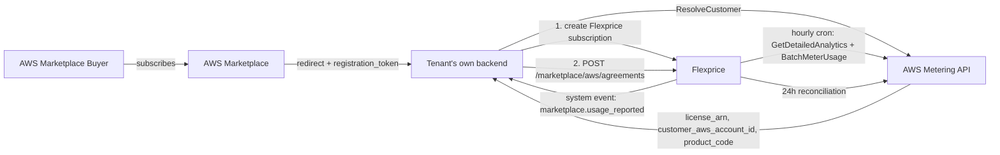
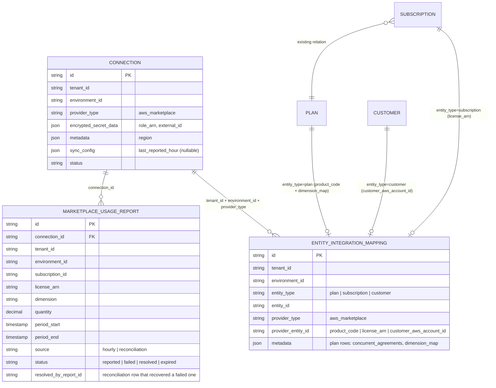
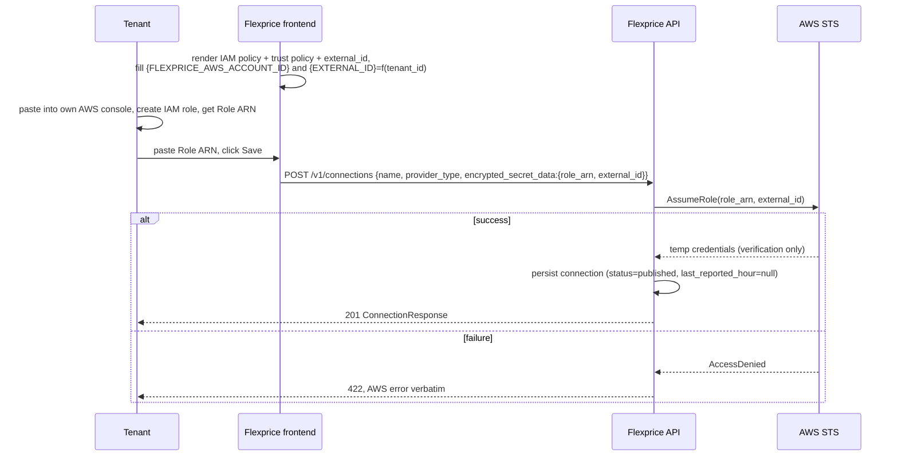
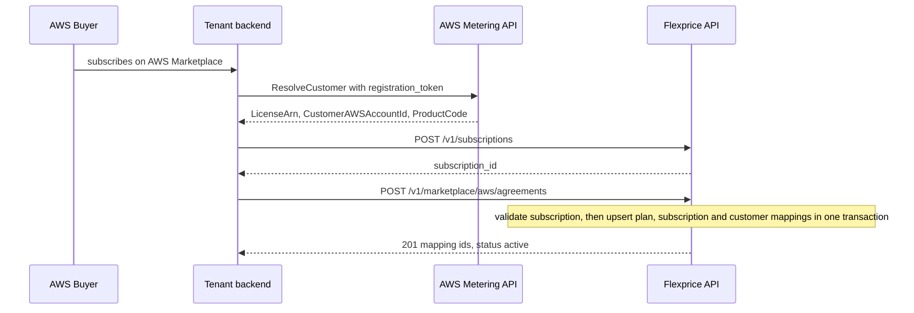
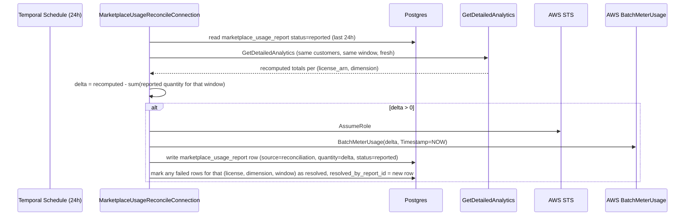

# AWS Marketplace Standalone Integration — Design Doc

Author: Tsage
Scope: AWS only. Azure is out of scope for v1, but `provider_type` extends to it without new tables.

---

## 1. Overview

Flexprice does not sell its own AWS Marketplace listing. Flexprice is the billing engine our tenants (who are themselves AWS Marketplace sellers) plug into, so their AWS Marketplace buyers get metered correctly.

Flexprice's job is exactly one thing: **take usage already ingested for a Flexprice subscription and report it to AWS via `BatchMeterUsage`, keyed by the AWS Agreement's `LicenseArn`.**

Everything upstream — the tenant's AWS product/dimension setup, the buyer's AWS-side subscribe flow, resolving the buyer via `ResolveCustomer` — happens on the tenant's own infrastructure. Flexprice never hosts a fulfillment URL, never calls `ResolveCustomer`, never listens to AWS EventBridge/SNS.

---

## 2. Actors


| Actor           | Role                                                                                                                                         |
| --------------- | -------------------------------------------------------------------------------------------------------------------------------------------- |
| AWS Marketplace | Hosts the tenant's listing, checks the buyer out, invoices the buyer, pays the tenant. Ground truth for Agreements.                          |
| Tenant          | An AWS Marketplace seller. Owns their AWS account, IAM role, and integration code. Resolves their own buyers.                                |
| Tenant's buyer  | The AWS end-customer. Maps 1:1 to a Flexprice Customer under that tenant.                                                                    |
| Flexprice       | Stores the mapping between Flexprice entities and AWS identifiers. Runs the hourly usage-reporting cron and the 24h reconciliation workflow. |


---

## 3. Architecture




---

## 4. Data model

Reuses two existing tables (`connection`, `entity_integration_mapping`) — AWS Marketplace is just a new `provider_type`. Adds **one** new table (`marketplace_usage_report`): a log of every usage record we attempt to send, with a status. It serves both roles at once — the record of what was sent (so reconciliation can diff and send only deltas) and the dead-letter/retry set (failed rows). One row = one usage record, mirroring an analytics item.




### 4.1 `connection`

New enum values only, no table schema change: `ConnectionMetadataType.aws_marketplace`, `SecretProvider.aws_marketplace`.

```json
{
  "id": "conn_01JX...",
  "tenant_id": "t_acme",
  "environment_id": "env_prod",
  "name": "AWS Marketplace",
  "provider_type": "aws_marketplace",
  "encrypted_secret_data": {
    "aws_marketplace": {
      "role_arn": "arn:aws:iam::222222222222:role/flexprice-marketplace-role",
      "external_id": "acme-corp-t_acme01k"
    }
  },
  "metadata": { "aws_marketplace": { "region": "us-east-1" } },
  "sync_config": { "aws_marketplace": { "last_reported_hour": null } },
  "status": "published"
}
```

`role_arn` and `external_id` are both stored (encrypted) so a single decrypt at cron time yields everything `AssumeRole` needs. `last_reported_hour` is `null` until the cron's first run (§7.2).

### 4.2 `entity_integration_mapping` — three mapping kinds, all written by one endpoint


| entity_type    | entity_id                   | provider_entity_id            | metadata                                                                           |
| -------------- | --------------------------- | ----------------------------- | ---------------------------------------------------------------------------------- |
| `plan`         | Flexprice `plan_id`         | AWS `product_code`            | `{ concurrent_agreements: bool, dimension_map: {feature_id: dimension_api_name} }` |
| `subscription` | Flexprice `subscription_id` | AWS `license_arn`             | —                                                                                  |
| `customer`     | Flexprice `customer_id`     | AWS `customer_aws_account_id` | —                                                                                  |


`plan`, `subscription`, `customer` all already exist in `IntegrationEntityType`. All three rows are written by `POST /marketplace/aws/agreements` (§6).

**Dimension mapping** lives inline in the `plan` row's `dimension_map` metadata, keyed `feature_id → AWS Dimension API Name`. It is an explicit map, not a naming rule: AWS Dimension API Names are immutable once created ([saas-product-settings](https://docs.aws.amazon.com/marketplace/latest/userguide/saas-product-settings.html): *"You can't change the API identifier and unit after the dimension is created"*) and a tenant's AWS product may pre-date its Flexprice integration, so we cannot require the two names to match. The `Dimension` field in `BatchMeterUsage` takes this API Name, not the display name ([UsageRecord](https://docs.aws.amazon.com/marketplace/latest/APIReference/API_marketplace-metering_UsageRecord.html)).

### 4.3 `marketplace_usage_report`

One row per usage record we attempt to send — the same thing as an analytics item resolved to a `BatchMeterUsage` record, plus a status. This single table does two jobs that would otherwise be two tables: it is the durable record of *what was sent* (so reconciliation can diff and send only the delta, §8) **and** the dead-letter/retry set (`status = failed`).

```go
type MarketplaceUsageReport struct {
    ID                 string          // ur_...
    TenantID           string
    EnvironmentID      string
    ConnectionID       string
    SubscriptionID     string          // from the analytics item
    LicenseArn         string
    Dimension          string
    Quantity           decimal.Decimal // total_usage from the analytics item
    PeriodStart        time.Time       // clock-hour window start this quantity covers
    PeriodEnd          time.Time       // clock-hour window end — reconciliation re-sums this exact range to diff
    Source             string          // "hourly" | "reconciliation"
    Status             string          // "reported" | "failed" | "resolved" | "expired"
    ResolvedByReportID string          // set when a "failed" row is later covered — points at the reconciliation row that recovered it
    CreatedAt          time.Time
    UpdatedAt          time.Time
}
```
Indexed on `(tenant_id, environment_id, connection_id, status)` and on `(connection_id, license_arn, dimension, period_start)`.

- `reported` → successfully sent. Reconciliation reads these to know what was already billed.
- `failed` → a `BatchMeterUsage` chunk exhausted retries. The retry set. In v1 these are written and surfaced in the webhook; the automatic drain/retry is a future enhancement (§9.2). Recovered by reconciliation in the meantime.
- `resolved` → a previously-`failed` row that reconciliation has since covered by sending the missing amount as a delta. `ResolvedByReportID` links it to the `source=reconciliation` row that recovered it, so it's clear the failure was made good and won't be double-sent.
- `expired` → AWS's 24h submission window passed before this row could be (re)sent; unsendable forever (`TimestampOutOfBoundsException`).

**Retention / TTL — two tiers:**
- `reported` rows are pruned after ~48h (just past the 24h reconciliation lookback — nothing older is ever re-read).
- `failed` / `resolved` / `expired` rows are kept **30 days** for audit — a failed or unsendable record is an operational event worth retaining well beyond the reporting window; the short 48h prune must never touch them.

`PeriodStart`/`PeriodEnd` are the clock-hour window the `Quantity` aggregates over (e.g. `[14:00, 15:00)`) — reconciliation must re-sum that exact range to compute a correct delta. `Source` distinguishes an original hourly send from a reconciliation top-up.

---

## 5. Connection setup

One endpoint, `POST /v1/connections`, matching every other provider in the codebase (`internal/api/v1/connection.go`). The IAM policy and trust policy are static templates rendered by the frontend — no backend call produces them.




### 5.1 IAM policy + trust policy (static frontend content)

```json
// IAM policy — identical for every tenant
{ "Version": "2012-10-17", "Statement": [
  { "Effect": "Allow", "Action": "aws-marketplace:BatchMeterUsage", "Resource": "*" }
]}
```

```json
// Trust policy — {EXTERNAL_ID} filled client-side
{ "Version": "2012-10-17", "Statement": [{
  "Effect": "Allow",
  "Principal": { "AWS": "arn:aws:iam::{FLEXPRICE_AWS_ACCOUNT_ID}:root" },
  "Action": "sts:AssumeRole",
  "Condition": { "StringEquals": { "sts:ExternalId": "{EXTERNAL_ID}" } }
}]}
```

`Resource: "*"` is required — `aws-marketplace:BatchMeterUsage` is not resource-scopable. Only `BatchMeterUsage` is requested; `GetEntitlements` is not (contract/pre-paid pricing is out of scope for v1).

### 5.2 External ID

The `sts:ExternalId` condition guards the confused-deputy risk: Flexprice's AWS account is trusted to assume roles across many tenant accounts, so a role ARN alone isn't sufficient proof of intent. The frontend derives the value from the tenant's own session data (tenant name + `tenant_id`, e.g. `acme-corp-t_acme01k`) — deterministic and human-readable, unique per tenant, not secret from the tenant. It is stored alongside `role_arn` so no per-call re-derivation is needed.

### 5.3 `POST /v1/connections`

```json
// Request
{
  "name": "AWS Marketplace",
  "provider_type": "aws_marketplace",
  "encrypted_secret_data": {
    "role_arn": "arn:aws:iam::222222222222:role/flexprice-marketplace-role",
    "external_id": "acme-corp-t_acme01k"
  }
}
```

**Ruling — verification happens BEFORE the connection is created, synchronously, in the same request.** The order is: receive the request → call `AssumeRole` → only persist the connection if it succeeds. This is how the tenant is told the connection is wrong: on failure the endpoint returns **422 with AWS's error verbatim in the same response**, and nothing is saved — so the tenant fixes their role/trust policy and resubmits. There is no "created but broken" state to explain, and no async check to poll for.

The live `AssumeRole(role_arn, external_id)` is a single atomic check of three things: the role exists, its trust policy names Flexprice's account, and its `sts:ExternalId` condition matches the submitted `external_id`. On success the connection is saved with `status = published` and `last_reported_hour = null`.

One edge to handle in implementation: a freshly-created IAM role can take a few seconds to propagate in AWS, so an `AssumeRole` immediately after role creation may transiently fail. Surface it as a retryable "role not ready yet, try again" rather than a hard rejection, so a tenant who saves too quickly isn't confused.

---

## 6. Agreement registration — `POST /v1/marketplace/aws/agreements`

**One endpoint, one call per buyer purchase.** It carries everything — subscription/customer identity, the plan's product code, the Concurrent Agreements flag, and the dimension map — so the tenant never makes a second call. The plan-level portion is upserted idempotently: the first agreement on a plan creates its mapping, later agreements on the same plan confirm it.

Called by the tenant's backend after it has (a) resolved the buyer via its own `ResolveCustomer`, and (b) created the Flexprice subscription through the normal API.




### 6.1 Request

```json
POST /v1/marketplace/aws/agreements
{
  "subscription_id": "subs_01KX6ABC3T731GFVZDYH3Z19CP",
  "customer_id": "cust_01KX6ABC211T628N0NZHVMK2PZ",
  "customer_aws_account_id": "222222222222",
  "license_arn": "arn:aws:license-manager:us-east-1:222222222222:license:l-abc123xyz",
  "plan_id": "plan_01KX5YWBTX2SZ76R7NPRAEBXZH",
  "product_code": "4qwerty789",
  "concurrent_agreements": true,
  "dimension_map": [
    { "feature_id": "feat_01KX5YWBTVMPF2XK8W5R19TBH1", "dimension_api_name": "gpt4o_tokens" },
    { "feature_id": "feat_01KWVA7W9ZVXT25FQ4JGSDVFAV", "dimension_api_name": "whisper_minutes" }
  ]
}
```

`product_code` is always stored (`ResolveCustomer` always returns it, regardless of Concurrent Agreements status). `concurrent_agreements` only controls whether the cron *sends* `product_code` in `BatchMeterUsage` (§7.5). `dimension_map` need not cover every priced feature — an unmapped feature surfaces as `unresolved` in the run's webhook rather than blocking the call.

### 6.2 Validations

1. `subscription_id` must already exist in Flexprice and be active — this endpoint never creates subscriptions.
2. Each `dimension_map` `feature_id` must be priced on `plan_id`.
3. `(tenant_id, environment_id, license_arn)` is unique — one Agreement, one registration.
4. `(tenant_id, environment_id, subscription_id)` maps to at most one `license_arn` — a new Agreement always means a new subscription, never a re-point.

### 6.3 Pseudocode

```go
func RegisterAgreement(ctx, tenantID, envID string, req Request) (*Response, error) {
    sub := subscriptionRepo.Get(ctx, req.SubscriptionID)
    if sub == nil || sub.Status != "active" { return nil, ErrSubscriptionNotFound }

    pricedFeatures := featureRepo.ListPricedOnPlan(ctx, req.PlanID).IDs()
    dimensionMap := map[string]string{}
    for _, dm := range req.DimensionMap {
        if !pricedFeatures.Contains(dm.FeatureID) {
            return nil, ierr.NewError("feature not priced on this plan").Mark(ierr.ErrValidation)
        }
        dimensionMap[dm.FeatureID] = dm.DimensionAPIName
    }
    if mappingRepo.ExistsByProviderEntityID(tenantID, envID, "aws_marketplace", req.LicenseArn) {
        return nil, ierr.NewError("license_arn already registered").Mark(ierr.ErrValidation)
    }

    tx := db.Begin()
    plan := mappingRepo.Upsert(tx, &Mapping{EntityType: "plan", EntityID: req.PlanID,
        ProviderType: "aws_marketplace", ProviderEntityID: req.ProductCode,
        Metadata: map[string]any{"concurrent_agreements": req.ConcurrentAgreements, "dimension_map": dimensionMap}})
    subM := mappingRepo.Upsert(tx, &Mapping{EntityType: "subscription", EntityID: sub.ID,
        ProviderType: "aws_marketplace", ProviderEntityID: req.LicenseArn})
    custM := mappingRepo.Upsert(tx, &Mapping{EntityType: "customer", EntityID: req.CustomerID,
        ProviderType: "aws_marketplace", ProviderEntityID: req.CustomerAWSAccountID})
    tx.Commit()
    return &Response{PlanMappingID: plan.ID, SubscriptionMappingID: subM.ID, CustomerMappingID: custM.ID, Status: "active"}, nil
}
```

---

## 7. Hourly usage reporting cron

### 7.1 Uses `GetDetailedAnalytics`

`internal/.../events.GetDetailedAnalytics` resolves and aggregates in one call: `subscription_id`, `plan_id`, `feature_id`, `meter_id`, and pre-aggregated `total_usage` per subscription line item. Report `total_usage` (the quantity), never `subtotal`/`total_cost` (dollar amounts) — AWS multiplies quantity by its own rate.

### 7.2 No event scan, no data-derived checkpoint — clock-aligned hourly windows

There is **no `meter_usage` scan** to find "active" customers, and **no data-derived checkpoint**. Both existed in an earlier design only to answer "who has new usage since when," and both dragged in fragile timestamp-boundary arithmetic. They are unnecessary:

- **Customers come from the mapping.** The marketplace-customer set for a connection is exactly the customers that have a `customer → customer_aws_account_id` row in `entity_integration_mapping` for this connection. That set is already small (only AWS buyers), so we call `GetDetailedAnalytics` for all of them directly — no scan to narrow it further.
- **The cursor is a clock hour.** `sync_config` stores `last_reported_hour` (e.g. `2026-07-11T14:00:00Z`). Each run reports the window **`[last_reported_hour, most_recent_complete_hour)`** in one `GetDetailedAnalytics` call for all mapped customers, then advances `last_reported_hour` to that complete hour. On a perfectly regular hourly schedule this is just "the previous complete hour" — the cursor's actual job is the *unhappy* path: after a missed run or downtime, `[last_reported_hour, now)` spans every skipped hour so none is silently lost; and a double-fire within one hour advances no window and does nothing. It keeps the hourly path self-correcting so reconciliation stays a backstop, not the primary recovery for missed runs.

Because both window bounds are **clock hours**, not observed event timestamps, the boundary problem disappears entirely. `GetDetailedAnalytics` is natively `timestamp >= StartTime AND timestamp < EndTime`, so consecutive windows `[14:00, 15:00)`, `[15:00, 16:00)` partition the timeline perfectly: an event at exactly `15:00` falls in the second window and only the second. No `+1ms`, no max-observed-timestamp, no `>` vs `>=` mismatch, no over-count risk.

`GetDetailedAnalytics` windows on event `timestamp` (confirmed in `internal/repository/clickhouse/meter_usage_query_builder.go` — `StartTime`/`EndTime` bind to `timestamp >= ? / < ?`; there is no `ingested_at` parameter). A **backdated event** (a `timestamp` in an hour we've already reported) is therefore not caught by the hourly run — it is caught by the 24h reconciliation (§8), which re-sums the affected hour and sends the delta. The only residual is a backdated event older than 24h, which coincides with AWS's own submission wall and is unrecoverable regardless (§9.1).

**Missed runs self-heal**: reporting `[last_reported_hour, most_recent_complete_hour)` means a run that catches up after downtime simply reports every whole hour in the gap in one window. **Bootstrap**: on the first run of a connection whose `last_reported_hour` is `null`, set it to the current complete hour (no backfill) and report nothing.

### 7.3 Sequence

```mermaid
sequenceDiagram
    participant Sched as Temporal Schedule (hourly)
    participant Dispatch as MarketplaceUsageReportDispatcher
    participant Child as MarketplaceUsageReportConnection
    participant PG as Postgres
    participant Analytics as GetDetailedAnalytics
    participant STS as AWS STS
    participant AWSMeter as AWS BatchMeterUsage
    participant SysEvent as system_events

    Sched->>Dispatch: trigger
    Dispatch->>PG: SELECT connection WHERE provider_type='aws_marketplace' AND status='published'
    loop for each connection
        Dispatch->>Child: child workflow(connection_id)
    end

    alt last_reported_hour is null (first run)
        Child->>PG: set last_reported_hour = current complete hour (no backfill), report nothing
    else set
        Child->>PG: decrypt role_arn, external_id
        Child->>PG: customers = external_customer_ids from customer mappings (this connection)
        Child->>Child: window = [last_reported_hour, most_recent_complete_hour)
        Child->>Analytics: GetDetailedAnalytics(customers, StartTime=window.start, EndTime=window.end)
        Analytics-->>Child: items (subscription_id, plan_id, feature_id, total_usage)
        alt no usage in window
            Child->>PG: advance last_reported_hour = window.end
        else usage
            Child->>PG: resolve license_arn, product_code, concurrent_agreements, dimension_map
            Child->>STS: AssumeRole(role_arn, external_id)
            loop chunks of 25
                Child->>AWSMeter: BatchMeterUsage(records; ProductCode omitted if concurrent_agreements)
                AWSMeter-->>Child: Results (Success | error per record)
            end
            Child->>PG: write usage_report rows; advance last_reported_hour = window.end
            Child->>SysEvent: publish marketplace.usage_reported
        end
    end
```

### 7.4 Workflow pseudocode

```go
func MarketplaceUsageReportConnection(ctx workflow.Context, connectionID string) (*RunResult, error) {
    conn := activities.GetConnection(ctx, connectionID)

    completeHour := truncateToHour(workflow.Now(ctx)) // start of the most recent COMPLETE hour

    if conn.SyncConfig.LastReportedHour == nil {
        activities.SetLastReportedHour(ctx, connectionID, completeHour) // no backfill
        return &RunResult{Status: "bootstrapped"}, nil
    }
    windowStart := *conn.SyncConfig.LastReportedHour
    windowEnd := completeHour
    if !windowEnd.After(windowStart) {
        return &RunResult{Status: "no_new_hour"}, nil // ran twice within the same hour
    }

    // customers straight from the mapping — no meter_usage scan
    customers := activities.GetMarketplaceCustomerExternalIDs(ctx, conn.TenantID, conn.EnvironmentID)
    items := activities.GetDetailedAnalytics(ctx, conn.TenantID, conn.EnvironmentID, customers, windowStart, windowEnd)
    records, unresolved := activities.BuildUsageRecords(ctx, conn.TenantID, conn.EnvironmentID, items)

    outcomes := []Outcome{}
    if len(records) > 0 {
        creds := activities.AssumeRole(ctx, conn.SecretData.RoleArn, conn.SecretData.ExternalID)
        for _, chunk := range chunk(records, 25) {
            // Each record's Timestamp = windowStart (the clock hour), NOT now — so a
            // Temporal activity retry re-sends the IDENTICAL record and AWS dedupes it
            // (BatchMeterUsage: "Multiple requests with the same UsageRecords ... will be
            // de-duplicated to prevent double charges"). A wall-clock Timestamp would make
            // each retry a distinct record => double bill.
            _, err := activities.BatchMeterUsage(ctx, creds, chunk) // own activity; Temporal retries transient errors
            status := "reported"
            if err != nil {
                status = "failed" // never lost, never blocks the run; recovered by reconciliation (§8)
            }
            outcomes = append(outcomes, Outcome{chunk, status})
        }
    }

    // ONE DB transaction: write all usage_report rows AND advance the cursor together, so the
    // record of what was sent and the cursor can never disagree. The AWS sends above are
    // already committed at AWS (external, irreversible) — this transaction only records them.
    activities.CommitRunTx(ctx, connectionID, outcomes, windowStart, windowEnd) // writes usage_report rows + SetLastReportedHour(windowEnd)

    activities.PublishSystemEvent(ctx, conn, "marketplace.usage_reported", ...)
    return &RunResult{Status: "completed"}, nil
}
```

**Cursor advances always** (`windowEnd`), regardless of any individual chunk failing. It is *not* gated on all-chunks-success and the window is *never* re-processed — re-processing would re-send already-billed chunks, and AWS billing cannot be reversed. Failed chunks (`status=failed`) are recovered by reconciliation (§8), which re-sums the same window and sends only the missing delta — never by rewinding the cursor.

`BuildUsageRecords` resolves each item: `subscription_id → license_arn`, `customer_id → customer_aws_account_id`, `plan_id → product_code + concurrent_agreements + dimension_map`, then `dimension = dimension_map[feature_id]`, `quantity = total_usage`, and **`Timestamp = windowStart`** (the window's clock hour — deterministic, so AWS dedupes retries). An item missing any mapping goes to `unresolved` (surfaced in the webhook, never sent).

### 7.5 `BatchMeterUsage` payload, response, webhook

```json
{
  "ProductCode": "4qwerty789",
  "UsageRecords": [{
    "CustomerAWSAccountId": "222222222222",
    "LicenseArn": "arn:aws:license-manager:us-east-1:222222222222:license:l-abc123xyz",
    "Dimension": "gpt4o_tokens",
    "Quantity": 66,
    "Timestamp": 1752300000
  }]
}
```

`Timestamp` is the **window's clock hour** (`windowStart`), not wall-clock `now` — this is what makes a Temporal activity retry safe.

**How AWS de-dup works (verbatim from the docs):**
- [`UsageRecord`](https://docs.aws.amazon.com/marketplace/latest/APIReference/API_marketplace-metering_UsageRecord.html): *"A UsageRecord indicates a quantity of usage for a given product, customer, dimension and time."* — so a record's identity is **product + customer + dimension + timestamp**. And: *"Multiple requests with the same UsageRecords as input will be de-duplicated to prevent double charges."*
- [`BatchMeterUsage`](https://docs.aws.amazon.com/marketplace/latest/APIReference/API_marketplace-metering_BatchMeterUsage.html): *"Identical requests are idempotent and can be retried with the same records or a subset of records."*

So when a Temporal retry re-sends a **byte-identical** record (same license, dimension, quantity, and the fixed hour timestamp), AWS drops the duplicate — no double charge. A `now` timestamp would make each retry a *different* record and defeat this.

Two requirements this imposes:
1. **The records must be computed once and passed as fixed input to the send activity** (as in §7.4 — `records` is built once, then chunks are sent). A retry must carry the identical chunk; it must not recompute `GetDetailedAnalytics`, or a late event could change the quantity and break de-dup.
2. **De-dup is only documented for *identical* records.** AWS does not document what happens if you resend the same product/customer/dimension/hour with a *different* quantity — so we never rely on that. This is exactly why reconciliation (§8) sends its correction as a *new* record with a fresh `now` timestamp rather than re-reporting the original hour.

If `concurrent_agreements = true`, `ProductCode` is omitted entirely (AWS Concurrent Agreements: *"For opted-in products, LicenseArn is required, and ProductCode is not supported"*).

Response `Status` per record: `Success` counts toward the summary. `InvalidLicenseException` / `InvalidUsageDimensionException` / `InvalidCustomerIdentifierException` are permanent per-record rejections — surfaced in the webhook's `failures[]`, not written as `failed` rows (retrying an invalid record achieves nothing; the tenant must fix the mapping or Agreement). `ThrottlingException` is retried inside the activity; only when Temporal's retries are exhausted does the whole chunk land in `marketplace_usage_report` as `status=failed`.

One `marketplace.usage_reported` system event per connection per run, delivered through Flexprice's existing `system_events` webhook pipeline (`internal/webhook/service.go`):

```json
{
  "event": "marketplace.usage_reported",
  "connection_id": "conn_01JX...",
  "window": { "start": "...", "end": "..." },
  "summary": { "usage_records": 1500, "succeeded": 1496, "failed": 4, "unresolved": 2 },
  "failures": [{ "subscription_id": "...", "license_arn": "...", "dimension": "whisper_minutes",
                 "quantity": 120, "error_code": "InvalidLicenseException" }],
  "unresolved": [{ "subscription_id": "...", "feature_id": "...", "reason": "no_license_arn_mapping" }]
}
```

### 7.6 Alternate approach considered (not chosen): iterate raw events on `ingested_at`

Instead of `GetDetailedAnalytics` over clock-hour `timestamp` windows, the cron could scan raw `meter_usage` rows on `ingested_at`, group and sum by `(license_arn, dimension)`, and send. Trade-offs:

- **Upside**: an `ingested_at` cursor (monotonic) never lets an event slip under it, so backdated events would be caught in the hourly run directly — no reliance on reconciliation (§8) for that case.
- **Downside (why not chosen)**: it re-implements what `GetDetailedAnalytics` already does — subscription-line-item resolution `(customer_id, meter_id) → subscription/plan/feature` and the meter's aggregation logic — as duplicated, separately-maintained code, and it reintroduces a data-derived cursor (the `ingested_at` high-water mark) with its own boundary handling. `GetDetailedAnalytics` over clean clock-hour windows avoids both.

Chosen path: `GetDetailedAnalytics` on clock-aligned `timestamp` windows (§7.2), reconciliation (§8) covers backdated events. Recorded here in case the backdated gap ever needs closing in the hourly path rather than at 24h.

---

## 8. Reconciliation workflow — every 24 hours

A separate Temporal workflow on its own 24h schedule. It re-verifies already-reported clock-hour windows and corrects anything the hourly cron missed (late-arriving or backdated events, §7.2).

24h is dictated by AWS's own window: `[BatchMeterUsage](https://docs.aws.amazon.com/marketplace/latest/APIReference/API_marketplace-metering_BatchMeterUsage.html)` — *"Usage records aren't accepted 24 hours or more after an event"*, with a 6h month-end grace. Running every 24h re-verifies every closed window comfortably inside that limit.




The delta is sent with the **current** timestamp, not the original window's. AWS only documents de-dup for *identical* records (§7.5); the behavior of re-reporting an already-sent `(customer, dimension, hour)` with a *different* quantity is undocumented, so we don't rely on it. Instead the delta rides as a **new** record with a fresh `now` timestamp — AWS bills on cumulative period totals, so re-attributing a late top-up to "now" is correct and never hits the 24h wall. Only positive deltas are ever sent (missed usage); an over-count cannot be corrected here — you cannot un-bill AWS. This is why the hourly windows are clock-aligned (§7.2): clean partitioning means the hourly path never over-counts in the first place, and reconciliation only ever needs to add. Reconciliation-sourced records are tagged `source: reconciliation` in the webhook so a tenant reconciling their own AWS payout can tell late corrections apart from fresh usage.

---

## 9. Gaps & decisions

### 9.1 Backdated events older than AWS's 24h window (unrecoverable — AWS limit)

A usage event whose `timestamp` is already more than 24h old (6h grace at month-end) cannot be reported to AWS at all — `TimestampOutOfBoundsException`, no workaround. Within the window, backdated events are caught by reconciliation (§7.2, §8). Beyond it, the record is written to `marketplace_usage_report` as `status=expired` for visibility. Not a Flexprice bug — an AWS platform constraint.

### 9.2 `failed`-row auto-retry (deferred) — and its future coordination with reconciliation

A failed chunk is written as `status=failed` and never re-processed by the hourly cron (the cursor always advances, §7.4). **In v1 it is recovered by reconciliation**: reconciliation reads only `status=reported` rows, so a failed chunk's quantity is absent from the reported total → the 24h re-sum finds the shortfall and sends it as a delta. So nothing is lost even without a dedicated retry.

When reconciliation covers a failed row, it flips that row `failed → resolved` and sets `resolved_by_report_id` to the delta row that recovered it (§4.3, §8) — so a failed row is never left ambiguous, and `failed`/`resolved`/`expired` rows are retained 30 days for audit.

The automatic drain/retry that resends `status=failed` rows directly is a future enhancement. **When it ships it must be coordinated with reconciliation** so the same shortfall isn't sent twice (once by the retry, once by the reconciliation delta) — e.g. the retry only touches rows still `status=failed` (skipping `resolved`), or it runs inside the reconciliation pass. Until then, reconciliation alone handles it and there is no double-send risk.

### 9.3 Concurrent Agreements flag accuracy (no AWS verification API)

**Background — what Concurrent Agreements changes.** Historically one AWS account could hold only one active Agreement per SaaS product. AWS's Concurrent Agreements feature removes that limit, and with it changes how `BatchMeterUsage` is keyed:
- Before: `ProductCode` identifies the product being metered.
- For a product opted into Concurrent Agreements: `LicenseArn` identifies both the product and the specific Agreement, and **`ProductCode` must be omitted** — per AWS, *"For opted-in products, LicenseArn is required, and ProductCode is not supported."* Starting **June 1, 2026**, new SaaS products are on this model by default; older products can opt in.

That is exactly what the `concurrent_agreements` flag on the plan mapping controls: `true` → omit `ProductCode` from the request; `false` → include it (§7.6). We always store `product_code` either way, so storage is not the issue.

**The gap:** the flag is set by the tenant at agreement-registration time, and there is **no AWS API to verify it** against the product's real migration state. A wrong value produces a `BatchMeterUsage` failure — an over-included `ProductCode` on an opted-in product, or a missing required `ProductCode` on a legacy one — surfaced clearly in the webhook. Mitigated (clear error), not prevented (no upfront check possible).

Reference docs:
- [Complete guide to upgrading your SaaS product to AWS Marketplace Concurrent Agreements](https://aws.amazon.com/blogs/awsmarketplace/complete-guide-to-upgrading-your-saas-product-to-aws-marketplace-concurrent-agreements/)
- [Concurrent Agreements integration workshop](https://catalog.workshops.aws/mpseller/en-US/saas/integration-for-concurrent-agreements)
- [`BatchMeterUsage` API reference](https://docs.aws.amazon.com/marketplace/latest/APIReference/API_marketplace-metering_BatchMeterUsage.html) — the `ProductCode`/`LicenseArn` migration note is at the top.

---

## 10. Open items
- Load-check ClickHouse for the cron fan-out: the hourly cron and the 24h reconciliation each run one `GetDetailedAnalytics` query per connection, so query concurrency scales with the number of marketplace tenants. Confirm ClickHouse handles that volume, or cap concurrent child workflows if it doesn't.

