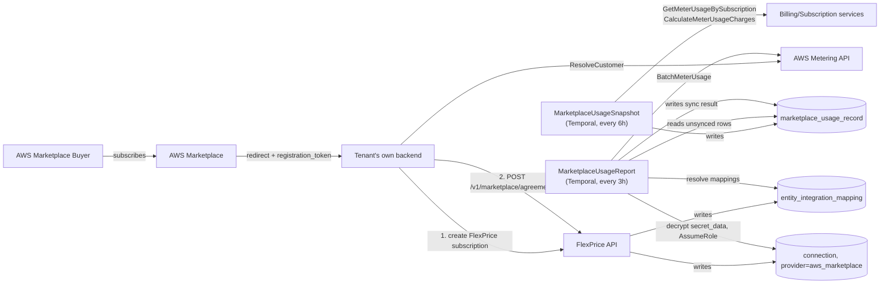
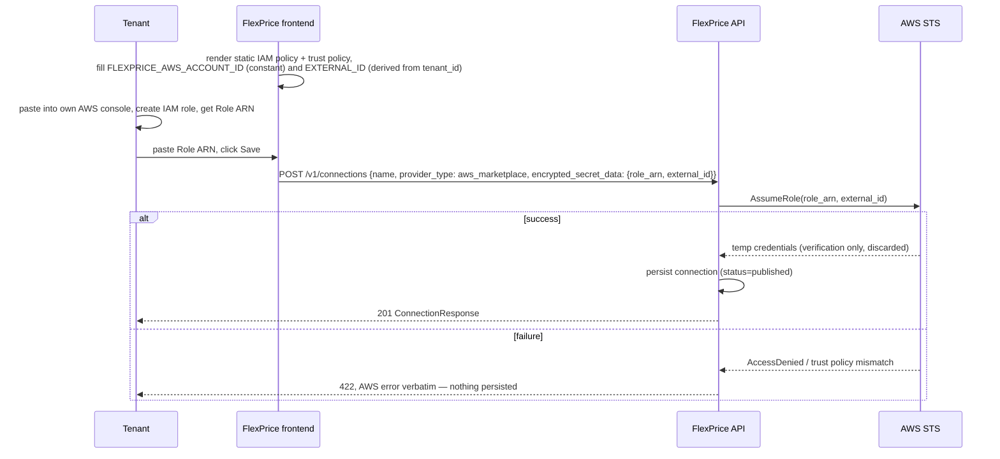

# FLE-981 — AWS Marketplace Integration v1: report tenant usage to AWS Marketplace via BatchMeterUsage

- **Ticket:** [FLE-981](https://linear.app/flexprice/issue/FLE-981)
- **Date:** 2026-07-13
- **Author:** Tsage
- **Status:** Proposed — pending implementation
- **Reviewers:** _tbd_

---

## 1. Executive Summary

- **What ships (v1):** Tenants who resell through AWS Marketplace can connect their AWS account to FlexPrice and have their customers' usage automatically reported to AWS via `BatchMeterUsage`, on a recurring schedule, with no manual step after initial setup.
- **Scope constraint (v1):** a tenant's AWS Marketplace product must be priced with **exactly one dimension**, in dollar terms (i.e. FlexPrice reports a dollar `Quantity`, not a raw unit count). Multi-dimension products are out of scope for v1.
- **Data:** One new table, `marketplace_usage_record` (tenant-scoped snapshot of usage owed to a marketplace, independent of which marketplace(s) it's synced to). Reuses `connection` (new `provider_type = aws_marketplace`) and `entity_integration_mapping` (new mapping rows for `plan`, `subscription`, `customer`) — the same two tables every other provider integration already uses.
- **New infra:** Two Temporal cron workflows — `MarketplaceUsageSnapshot` (generates usage records, every 6h) and `MarketplaceUsageReport` (syncs them to marketplaces, every 3h) — plus one new API endpoint, `POST /v1/marketplace/agreements`.
- **Reused:** connection/secret storage + encryption, `entity_integration_mapping` idempotency pattern, the existing invoicing-grade usage/billing computation (`GetMeterUsageBySubscription` + `CalculateMeterUsageCharges`), Temporal per-provider workflow/activity registration pattern.
- **Deferred beyond v1:** multi-dimension products, Azure/GCP marketplaces (the data model is provider-agnostic from day one, but only AWS is wired up), a dedicated retry/reconciliation workflow (v1 relies on Cron B's own indefinite retry instead — see §8.4), automated verification of the tenant-provided `concurrent_agreements` flag (no AWS API exists for this).

## 2. Motivation

### 2.1 What we're building

A tenant who sells their product on AWS Marketplace needs their customers' usage reported to AWS so AWS can bill the buyer and pay the tenant out. Today this requires the tenant to build and run their own AWS `BatchMeterUsage` integration by hand. This feature lets them instead: connect their AWS account to FlexPrice once, register each buyer's AWS Agreement against the FlexPrice subscription that's already tracking their usage, and let FlexPrice handle metering to AWS on a recurring schedule.

### 2.2 Why we need it

FlexPrice already meters usage for these tenants' own billing. AWS Marketplace sellers need that same usage mirrored to AWS in AWS's specific format (`BatchMeterUsage`, keyed by `LicenseArn`/`Dimension`/`Quantity`/`Timestamp`) so AWS's own invoicing and payout pipeline works. Without this, tenants either can't sell through AWS Marketplace or have to build a redundant metering pipeline themselves.

## 3. Goals & Non-Goals

### 3.1 Goals (v1)

- One-time connection setup: tenant provides an IAM role ARN FlexPrice can assume (`sts:AssumeRole`), verified synchronously before the connection is ever persisted.
- One API call per buyer purchase (`POST /v1/marketplace/agreements`) registers everything needed to bill that buyer — no separate "register the plan" step.
- Usage is generated as period-delta snapshots (never double-counted, never re-reported) and synced to AWS on a schedule, fully automated after setup.
- Safe to retry at every level — a Temporal activity retry, a failed AWS call, or a missed cron run must never result in AWS being billed twice for the same usage.
- Provider-agnostic data model from day one, even though only AWS ships in v1.

### 3.2 Non-Goals

- **No multi-dimension products.** A tenant's AWS product must have exactly one pricing dimension for v1; FlexPrice reports usage as a dollar amount against that single dimension. Multi-dimension mapping (feature → dimension) is explicitly out of scope — see §11 for why it was dropped from the design.
- **No Azure/GCP implementation.** The `Marketplace` enum and `marketplace_usage_record.syncs` JSONB map support multiple providers structurally, but only `aws` has a working sync path in v1.
- **No AWS EventBridge/SNS lifecycle listening.** FlexPrice never learns about Agreement cancellation/entitlement changes directly from AWS. A revoked license just starts failing `BatchMeterUsage` calls, which get logged and retried per §8.4.
- **No dedicated reconciliation workflow.** Earlier design iterations included a separate 24h reconciliation pass; v1 drops it in favor of Cron B retrying every unsynced record indefinitely (§8.4) — simpler, and sufficient given usage is generated as non-overlapping deltas in the first place (§8.2).
- **No automated verification of `concurrent_agreements`.** The tenant declares this boolean per plan; there is no AWS API to check it against the product's real Concurrent Agreements migration state (see §11, Open Questions).
- **No tenant-facing failure notifications (webhook/event).** Failures are logged with full context (§8.4) for operational visibility; no outbound event is sent to the tenant in v1.

## 4. Terminology

| Term | Meaning |
|---|---|
| AWS **Agreement** | AWS's record that a specific buyer accepted a specific offer for the tenant's product. Identified by `LicenseArn`. FlexPrice never creates or reads Agreements directly — the tenant resolves them via their own `ResolveCustomer` call. |
| AWS **Dimension** | The tenant-defined pricing unit on their AWS product (its **API Name**, not display name — immutable once created). v1 requires exactly one per product. |
| `BatchMeterUsage` | The AWS Marketplace Metering API call that reports usage; accepts up to 25 records per call, keyed by `CustomerAWSAccountId`/`LicenseArn`/`Dimension`/`Quantity`/`Timestamp`. |
| **Concurrent Agreements** | An AWS Marketplace capability (default for new products since June 1, 2026) letting one AWS account hold multiple simultaneous Agreements for the same product. Opted-in products must omit `ProductCode` from `BatchMeterUsage` and rely on `LicenseArn` alone. |
| `entity_integration_mapping` | Existing table mapping a FlexPrice entity to a provider-side identifier. Used here for `plan → product_code`, `subscription → license_arn`, `customer → customer_aws_account_id`, all under `provider_type = aws_marketplace`. |
| `marketplace_usage_record` | New table — one row per period-delta usage snapshot for a subscription, independent of marketplace. Synced to zero or more marketplaces via its `syncs` JSONB map. |
| **Period** | The `[period_start, period_end)` window a `marketplace_usage_record` row's `quantity` covers. Always contiguous and non-overlapping per subscription (§8.2) — this is what makes re-running Cron A safe. |

## 5. High-Level View

### 5.1 System context



### 5.2 Sequence — connection setup



### 5.3 Sequence — agreement registration

```mermaid
sequenceDiagram
    participant Buyer as AWS Buyer
    participant TenantApp as Tenant backend
    participant AWSMeter as AWS Metering API
    participant FP as FlexPrice API

    Buyer->>TenantApp: subscribes on AWS Marketplace
    TenantApp->>AWSMeter: ResolveCustomer(registration_token)
    AWSMeter-->>TenantApp: LicenseArn, CustomerAWSAccountId, ProductCode
    TenantApp->>FP: POST /v1/subscriptions
    FP-->>TenantApp: subscription_id
    TenantApp->>FP: POST /v1/marketplace/agreements (all fields, one call)
    FP->>FP: validate subscription; upsert plan, subscription, customer mappings
    FP-->>TenantApp: 201 mapping ids, status active
```

### 5.4 Sequence — usage generation and reporting

```mermaid
sequenceDiagram
    participant SnapSched as Temporal Schedule (6h)
    participant SnapWF as MarketplaceUsageSnapshot
    participant Bill as Billing/Subscription services
    participant PG as Postgres
    participant RepSched as Temporal Schedule (3h)
    participant RepWF as MarketplaceUsageReport
    participant STS as AWS STS
    participant AWSMeter as AWS BatchMeterUsage

    SnapSched->>SnapWF: trigger (scheduled_time)
    SnapWF->>SnapWF: period_start = scheduled_time - 10h<br/>period_end = scheduled_time - 4h<br/>(fixed 6h window, same for every subscription this run — no per-subscription lookup)
    SnapWF->>PG: tenants with connection provider_type=aws_marketplace, published
    loop per tenant
        SnapWF->>PG: customers with entity_integration_mapping provider_type=aws_marketplace
        loop per customer
            SnapWF->>PG: subscriptions with entity_integration_mapping provider_type=aws_marketplace
            loop per subscription
                SnapWF->>Bill: GetMeterUsageBySubscription + CalculateMeterUsageCharges(period_start, period_end)
                Bill-->>SnapWF: amount (dollar total for the window)
                SnapWF->>PG: insert marketplace_usage_record (period_start, period_end, syncs={}, all_providers_synced=false)
            end
        end
    end

    RepSched->>RepWF: trigger
    RepWF->>PG: tenants with connection provider_type=aws_marketplace
    loop per tenant
        RepWF->>PG: decrypt role_arn, external_id
        RepWF->>PG: usage records WHERE all_providers_synced=false for this tenant
        loop per record, per unsynced marketplace
            RepWF->>PG: resolve license_arn, product_code, concurrent_agreements, dimension (entity_integration_mapping)
            RepWF->>STS: AssumeRole(role_arn, external_id)
            RepWF->>AWSMeter: BatchMeterUsage(Timestamp=period_end, ProductCode omitted if concurrent_agreements)
            AWSMeter-->>RepWF: Results / UnprocessedRecords
            RepWF->>PG: write sync result into record.syncs[aws]; recompute all_providers_synced
        end
    end
```

## 6. Current State (Baseline) — what we reuse

| Need | Existing pattern | What we get for free |
|---|---|---|
| Provider connection storage, encrypted credentials | `ent/schema/connection.go`, `internal/types/connection.go` (`ConnectionMetadata` per-provider structs, same pattern as Stripe/HubSpot/Tabs/etc.) | No new secrets table, no new crypto path — `AWSMarketplaceConnectionSecrets{RoleArn, ExternalID}` slots into the existing `ConnectionMetadata` union |
| Single-endpoint connection creation, verified before persistence | `internal/api/v1/connection.go` `CreateConnection` → `service.CreateConnection` | AWS Marketplace follows the exact same one-call `POST /v1/connections` shape every other provider uses — no bespoke init/confirm flow |
| FlexPrice-entity ↔ provider-entity mapping | `internal/domain/entityintegrationmapping/model.go`, `entity_integration_mapping` table | `plan`, `subscription`, `customer` entity types already exist; no new mapping table needed |
| Invoicing-grade usage aggregation, period-aware | `internal/ee/service/subscription.go:6387` (`GetMeterUsageBySubscription`) + `internal/ee/service/billing_meter_usage.go:36` (`CalculateMeterUsageCharges`) — the same commitment/overage-aware computation used for real invoices, and for spend-threshold alert evaluation (see `docs/design/2026-07-08-FLE-899-spend-notifications.md`) | The dollar amount FlexPrice reports to AWS matches what the tenant is actually billing the customer for that period — no separate/divergent usage-aggregation code path |
| Temporal per-feature workflow/activity/schedule registration | `internal/temporal/workflows/`, `internal/temporal/activities/`, `internal/temporal/registration.go`, `internal/temporal/service/schedules.go`, `TemporalTaskQueueCron` | Scheduling, retry policy, and task-queue placement come from the existing Temporal Schedule pattern (same shape as `schedule_draft_finalization_workflow.go` / `schedule_subscription_billing_workflow.go`) |

### 6.1 What's new

- One table: `marketplace_usage_record`.
- Two enum additions: `ConnectionMetadataType.aws_marketplace` / `SecretProvider.aws_marketplace` (no new `IntegrationEntityType` values — `plan`/`subscription`/`customer` already exist).
- One API endpoint: `POST /v1/marketplace/agreements`.
- Two Temporal workflows: `MarketplaceUsageSnapshot`, `MarketplaceUsageReport`.

## 7. Data Model

### 7.1 `connection` — no schema change, new `provider_type`

```json
{
  "name": "AWS Marketplace",
  "provider_type": "aws_marketplace",
  "encrypted_secret_data": {
    "aws_marketplace": {
      "role_arn": "arn:aws:iam::222222222222:role/flexprice-marketplace-role",
      "external_id": "acme-corp-t_acme01k"
    }
  },
  "metadata": { "aws_marketplace": { "region": "us-east-1" } },
  "status": "published"
}
```
`role_arn` and `external_id` are both submitted by the tenant (the frontend derives `external_id` deterministically from `tenant_id`, displays it inline with the static IAM/trust policy templates, and the tenant pastes the identical value into their own AWS trust policy) and both stored encrypted, so a single decrypt at cron time yields everything `AssumeRole` needs.

```go
type AWSMarketplaceConnectionSecrets struct {
    RoleArn    string `json:"role_arn"`
    ExternalID string `json:"external_id"`
}
```

### 7.2 `entity_integration_mapping` — three mapping kinds, `provider_type = "aws_marketplace"`

| entity_type | entity_id | provider_entity_id | metadata |
|---|---|---|---|
| `plan` | FlexPrice `plan_id` | AWS `product_code` | `{ concurrent_agreements: bool, dimension: "string" }` |
| `subscription` | FlexPrice `subscription_id` | AWS `license_arn` | — |
| `customer` | FlexPrice `customer_id` | AWS `customer_aws_account_id` | — |

`dimension` is a **flat string** — the tenant's single AWS Dimension API Name for that plan's product. There is no feature-to-dimension map in v1 (§3.2, §11) — a direct consequence of the one-dimension-per-product constraint.

### 7.3 `marketplace_usage_record` — new table

One row per period-delta usage snapshot for a subscription. Provider-agnostic: it doesn't belong to any one marketplace — its `syncs` map tracks which marketplaces it has (or hasn't) been reported to, so the same row structure extends to Azure/GCP without a schema change.

```go
type Marketplace string

const (
    MarketplaceAWS   Marketplace = "aws"
    MarketplaceAzure Marketplace = "azure"
    MarketplaceGCP   Marketplace = "gcp"
)

// MarketplaceSyncEntry is one marketplace's sync outcome for a usage record. Stored as a
// value in the record's `Syncs` JSONB map, keyed by Marketplace. Presence + a non-nil
// SyncedAt IS the "already synced" signal — there is no separate status field. An entry
// that's absent (or present with SyncedAt nil) means "not yet successfully synced," and
// Cron B retries it on every run (§8.4). Failure detail is never persisted on the row —
// only logged (§8.4) — so this struct only ever represents a SUCCESS.
type MarketplaceSyncEntry struct {
    ConnectionID         string     `json:"connection_id"`
    SyncedAt              *time.Time `json:"synced_at,omitempty"`
    MarketplaceReportID  string     `json:"marketplace_report_id,omitempty"` // AWS: MeteringRecordId
}

// MarketplaceUsageRecord — Postgres row. One row = one usage snapshot for one subscription
// over a fixed 6h window. Syncs stored as JSONB, one entry per marketplace successfully synced.
type MarketplaceUsageRecord struct {
    ID                 string
    TenantID           string
    EnvironmentID      string
    Status             string // "published" | "archived"
    CustomerID         string
    CustomerExternalID string
    SubscriptionID     string
    PlanID             string
    Quantity           decimal.Decimal // reserved for future multi-dimension/raw-unit use; unused in v1
    Amount             decimal.Decimal // dollar total for [PeriodStart, PeriodEnd), from CalculateMeterUsageCharges — THIS is what's sent to AWS as BatchMeterUsage's "Quantity" field (§8.4; naming collision with AWS's own field name, called out explicitly so it isn't missed during implementation)
    PeriodStart        time.Time       // = the run's scheduled_time - 10h (§8.3) — NOT derived from any prior record
    PeriodEnd          time.Time       // = the run's scheduled_time - 4h (§8.3) — this is also the Timestamp reported to AWS
    Syncs              map[Marketplace]MarketplaceSyncEntry // jsonb
    AllProvidersSynced bool            // denormalized: true once every connected marketplace for this tenant has a Syncs entry
    CreatedAt          time.Time
    UpdatedAt          time.Time
}
```

Indexed on `(tenant_id, environment_id, all_providers_synced)` for Cron B's hot query.

**No `Timestamp` field.** `PeriodEnd` **is** the timestamp reported to AWS (§8.4) — a separate field would only be able to drift out of sync with it.

**No per-record TTL/expiry status, and no failure detail stored on the row.** A record that fails forever is retried every Cron B run, indefinitely (§8.4) — failure detail (error code, attempt count) lives only in structured logs, never on the row itself, and there is no `expired` terminal state in v1.

## 8. Approach

### 8.1 Connection setup — `POST /v1/connections`

Standard single-call connection creation, verified synchronously before persistence (§5.2). `AssumeRole(role_arn, external_id)` is one atomic check of three things: the role exists, its trust policy names FlexPrice's AWS account, and its `sts:ExternalId` condition matches. Any mismatch → 422 with AWS's error verbatim, nothing persisted — this is how the tenant learns the connection is wrong, with no async step to poll.

IAM policy requested: `aws-marketplace:BatchMeterUsage` only, `Resource: "*"` (not resource-scopable in AWS's permission model). `GetEntitlements` is not requested — contract/pre-paid pricing is out of scope for v1.

### 8.2 Agreement registration — `POST /v1/marketplace/agreements`

One call per buyer purchase, called by the tenant's backend after they've resolved the buyer via their own `ResolveCustomer` and created the FlexPrice subscription.

```json
{
  "provider": "aws",
  "subscription_id": "subs_01KX6ABC3T731GFVZDYH3Z19CP",
  "customer_id": "cust_01KX6ABC211T628N0NZHVMK2PZ",
  "customer_aws_account_id": "222222222222",
  "license_arn": "arn:aws:license-manager:us-east-1:222222222222:license:l-abc123xyz",
  "plan_id": "plan_01KX5YWBTX2SZ76R7NPRAEBXZH",
  "product_code": "4qwerty789",
  "concurrent_agreements": true,
  "dimension": "gpt4o_tokens"
}
```

Validations:
1. `subscription_id` must already exist in FlexPrice and be active. This endpoint never creates subscriptions.
2. `(tenant_id, environment_id, license_arn)` is unique — one Agreement, one registration.
3. `(tenant_id, environment_id, subscription_id)` maps to at most one `license_arn` — a new Agreement always means a new subscription, never a re-point.

`product_code` is always stored, regardless of `concurrent_agreements` — `ResolveCustomer` always returns it. `concurrent_agreements` only controls whether Cron B *sends* `product_code` in `BatchMeterUsage` (§8.3): `true` → omit it (per AWS, *"For opted-in products, LicenseArn is required, and ProductCode is not supported"*); `false` → include it. Writes the `plan`, `subscription`, `customer` mapping rows in one transaction (§7.2) — the plan-level portion (`product_code`, `concurrent_agreements`, `dimension`) is upserted idempotently, so the first agreement on a plan sets it and later agreements on the same plan just confirm it.

**Tenant requirement, must be documented and surfaced at setup:** the tenant's AWS product must be priced with exactly one dimension, and that dimension should be priced such that FlexPrice can report a **dollar amount directly as `Quantity`** (e.g. rate = 1 unit per $1). FlexPrice does not do unit conversion — it sends the computed dollar amount for the period as-is.

### 8.3 `MarketplaceUsageSnapshot` — generates usage records, every 6 hours

The window is **fixed arithmetic on the run's `scheduled_time`** — the Temporal Schedule's own scheduled-start time for this workflow instance (read via Temporal's schedule-provided start time, e.g. the `TemporalScheduledStartTime` search attribute — not `workflow.Now()`, which drifts by however late the run actually executed). Not a stored cursor, not derived from any prior record, not looked up per subscription:

- **`period_start`** = `scheduled_time - 10h`
- **`period_end`** = `scheduled_time - 4h`

This gives a 6-hour-wide window, offset 4 hours back from the scheduled time (the "snapshot buffer" — time for FlexPrice's own event-ingestion pipeline, Kafka consumer → ClickHouse, to settle before a period is treated as final). Worked example: cron scheduled for 06:00 → `period_start = 18:00 the previous day`, `period_end = 02:00`. Since the window width (6h) equals the cron interval (6h), and both bounds are anchored to the *scheduled* time rather than actual execution time, consecutive on-schedule runs produce contiguous, non-overlapping windows automatically — the 12:00 run computes `[02:00, 08:00)`, picking up exactly where the 06:00 run's `[18:00, 02:00)` left off. **No per-subscription "last processed" lookup is needed** — every subscription processed in a given run gets the identical window.

**Implementation note, needs verification before this is built:** deriving `scheduled_time` this way depends on Temporal actually populating a schedule-provided start time on the workflow execution (SDK version, deployment configuration, and whether a manual "Run Now" from the Temporal UI preserves it are all unconfirmed against this codebase today). Tracked as an open item (§10).

For each tenant with a published `aws_marketplace` connection, for each customer with an `aws_marketplace` customer mapping, for each of that customer's subscriptions with an `aws_marketplace` subscription mapping: call `GetMeterUsageBySubscription` + `CalculateMeterUsageCharges` for `[period_start, period_end)` (same invoicing-grade computation used for real invoices — see §6 for the exact function signatures; the code block shown to derive this design was illustrative of *which functions to call*, not literal log-message text to reuse), and insert one `marketplace_usage_record` row: `amount` = the computed dollar total, `period_start`/`period_end` as above, `syncs = {}`, `all_providers_synced = false`.

**Nothing fails silently — every failure in this step is logged, with a consistent, greppable prefix.** If `GetMeterUsageBySubscription` or `CalculateMeterUsageCharges` errors for a subscription, log at ERROR with the message prefixed `"marketplace usage snapshot failed"` (so `grep -i marketplace` on the log stream reliably surfaces every marketplace-related failure across both crons — same convention as Cron B, §8.4), plus tenant_id, environment_id, subscription_id, customer_id, period_start, period_end, and the underlying error — never any secret material. The subscription is skipped for this run (its next attempt is the following scheduled run, same fixed-window arithmetic — there is no separate retry for a Cron A failure within the run).

**Why periods never overlap on the regular schedule:** because both bounds are pure functions of the scheduled time, and window width matches cron interval exactly, on-schedule runs partition the timeline with no gap and no overlap by construction — there is nothing for a reconciliation pass to correct in the normal case (§3.2, §11).

**Manual-trigger risk — closed by using `scheduled_time` instead of `workflow.Now()`.** A manual "Run Now" against an existing Temporal Schedule instance re-executes *that instance*, which carries the same `scheduled_time` it always had — so the workflow recomputes the exact same `[period_start, period_end)` window and the exact same `PeriodEnd`/`Timestamp` as the original run. Re-sending that record to AWS is a byte-identical retry, and AWS's documented exact-match de-dup catches it (§8.4 citations) — no double-billing. This is why `scheduled_time` (not `run_time`/`workflow.Now()`) is the load-bearing choice in the formula above: `run_time` would give a manual run a *different* window each time it's clicked, which AWS's de-dup cannot catch (different `Timestamp`); `scheduled_time` gives it the *same* window every time, which AWS's de-dup can catch. **Residual, narrower gap:** a raw ad-hoc `StartWorkflow` call that bypasses the Schedule entirely has no `scheduled_time` to derive from at all — this case is not covered and is treated as an operational-discipline-only risk (don't start this workflow outside its Schedule).

**Related but distinct gap: a missed scheduled run leaves a permanent coverage hole.** This is not solved by using `scheduled_time` — if a cycle is skipped entirely (e.g. the Temporal worker is down when a scheduled run was due), there is no run at all for that grid point, so no window is ever computed for it, and no later run backfills it (each later run only covers its own fixed `[scheduled_time-10h, scheduled_time-4h)`). Recorded as an accepted v1 limitation.

**Proposed solution for the missed-run gap only — not implemented in v1, documented here for a future iteration.** (The manual-trigger gap above is already closed by the `scheduled_time` + AWS de-dup combination and does not need this.)

- Introduce a `marketplace_usage_checkpoint` table, one row per `(tenant_id, environment_id)` — not on `connection`, since the checkpoint isn't connection-scoped and no existing table is a natural home for it today. Row: `{tenant_id, environment_id, checkpoint_time, updated_at}`.
- Revised Cron A logic: `period_start = checkpoint_time` if a checkpoint row exists, else `scheduled_time - 10h` (bootstrap only, first-ever run for that tenant). `period_end = scheduled_time - 4h`, unchanged. On a successful write, upsert `checkpoint_time = period_end`.
- Deliberately **not** `period_start = min(scheduled_time - 10h, checkpoint_time)` — an earlier version of this proposal used `min()`, but it can re-introduce overlap in edge cases. Using the checkpoint directly (no `min()`) is contiguous by construction: every window starts exactly where the last one ended, so a skipped cycle just makes the next window wider, with no gap and no overlap.
- Edge case the implementation would need to guard: if `period_end <= period_start` (checkpoint already caught up), skip the write and leave the checkpoint untouched rather than persisting a zero/negative-length record.

### 8.4 `MarketplaceUsageReport` — syncs usage records to marketplaces, every 3 hours

For each tenant, for each of its published marketplace connections (only `aws_marketplace` has a live path in v1), decrypt `role_arn`/`external_id` once. Read all `marketplace_usage_record` rows for that tenant where `all_providers_synced = false`. For each row, for each marketplace whose `Syncs` entry is absent (i.e. not yet successfully synced):

1. Resolve `license_arn` (subscription mapping), `product_code` + `concurrent_agreements` + `dimension` (plan mapping).
2. `AssumeRole(role_arn, external_id)`.
3. Call `BatchMeterUsage` (chunks of 25) with **`Timestamp = record.PeriodEnd`** (not `now`) — deterministic per record, so a Temporal activity retry re-sends a byte-identical record and AWS de-duplicates it (confirmed: [`UsageRecord`](https://docs.aws.amazon.com/marketplace/latest/APIReference/API_marketplace-metering_UsageRecord.html) — *"Multiple requests with the same UsageRecords as input will be de-duplicated to prevent double charges"*; [`BatchMeterUsage`](https://docs.aws.amazon.com/marketplace/latest/APIReference/API_marketplace-metering_BatchMeterUsage.html) — *"Identical requests are idempotent and can be retried with the same records or a subset of records."*). **Explicit field mapping (do not confuse with the record's own `Quantity` column, which is unused in v1):** `BatchMeterUsage.UsageRecords[i].Quantity = record.Amount`. `ProductCode` omitted when `concurrent_agreements = true`.
4. On success: write `Syncs[aws] = {ConnectionID, SyncedAt: now, MarketplaceReportID: <MeteringRecordId>}`.
5. On failure (including anything returned in `UnprocessedRecords`): write **nothing** to `Syncs[aws]` — its continued absence is exactly what makes the next Cron B run retry it. **Nothing about this failure is silent.** Log at ERROR level, message prefixed `"marketplace usage report failed"` (greppable, same convention as Cron A, §8.3) — with tenant_id, environment_id, subscription_id, license_arn, dimension, amount, AWS error code/message. **Never** log `role_arn`, `external_id`, or any decrypted secret material, here or in Cron A.
6. Recompute `AllProvidersSynced` = true iff every marketplace this tenant has a connection for now has a `Syncs` entry for this row.

**Retry policy: indefinite, every 3h, no terminal failure state, no data persisted about the failure itself.** There is no dead-letter queue, no drain job, no expiry — a permanently-broken record (e.g. a revoked license) simply keeps failing and keeps getting logged on every retry, indefinitely, past AWS's own 24h/6h-grace wall included. This is intentionally simpler than an earlier design iteration's dead-letter-queue-plus-reconciliation-workflow approach: because on-schedule usage records never overlap (§8.3), there is nothing to reconcile in the normal case. AWS's de-dup guarantee is only relied on for *identical* re-sends (point 3 above) — a genuinely different amount for an already-reported `(license, dimension, timestamp)` is never attempted, since `PeriodEnd` is fixed once a record is created.

## 9. Rollout Plan

- **Gate:** per-tenant, entirely by connection state — a tenant is unaffected until they have a published `aws_marketplace` connection *and* at least one agreement registered. No separate feature flag.
- **Rollback:** unpublish/delete the tenant's connection. `MarketplaceUsageSnapshot` and `MarketplaceUsageReport` both filter on `status = published` connections, so in-flight generation/sync stops cleanly on the next cron tick.

## 10. Open Questions

1. **`sts:ExternalId` derivation function** — needs to be pinned down precisely (e.g. `slugify(tenant_name) + "-" + tenant_id`) so frontend and backend compute byte-identical values.
2. **AWS Dimension API Name charset** — needs to be verified as compatible with whatever format the tenant is told to use when creating their single dimension, before this is documented as a hard requirement in tenant-facing setup docs.
3. **`concurrent_agreements` accuracy** — no AWS API exists to verify the tenant's declared value against their product's real Concurrent Agreements migration state. A wrong value produces a `BatchMeterUsage` failure (caught and logged per §8.4, retried indefinitely) rather than being caught upfront.
4. **IAM role propagation delay** — a freshly-created IAM role can take a few seconds to become assumable; `POST /v1/connections` should treat an immediate `AssumeRole` failure right after role creation as retryable/transient in the tenant-facing error message, not a hard "your policy is wrong."
5. **Snapshot buffer duration (4h)** — chosen to comfortably exceed FlexPrice's own event-ingestion lag, but not measured against real p99 ingestion latency. Should be validated, and made configurable if 4h proves too short or unnecessarily long in practice.
6. **`GetDetailedAnalytics`/`GetMeterUsageBySubscription` performance at fan-out scale** — `MarketplaceUsageSnapshot` calls this once per (tenant × customer × subscription) every 6h; needs a load check at expected tenant/subscription counts, and a decision on whether the per-tenant loop should fan out as parallel Temporal child workflows rather than run sequentially.
7. **`scheduled_time` derivation needs implementation-time verification** (§8.3) — Cron A's window arithmetic depends on reading Temporal's schedule-provided start time (e.g. `TemporalScheduledStartTime`) rather than `workflow.Now()`, since this is what makes a manual "Run Now" recompute an identical (safely AWS-de-duped) window instead of a new overlapping one. The exact Go SDK API, whether this attribute is populated in this deployment, and whether "Run Now" preserves it are all unconfirmed. A raw ad-hoc `StartWorkflow` call that bypasses the Schedule entirely still has no `scheduled_time` to read and remains an accepted, narrower, operational-discipline-only risk even once this is verified.
8. **Missed scheduled run leaves a permanent coverage gap** (§8.3) — since there's no persisted cursor, a skipped cycle (worker downtime, etc.) is never backfilled by a later run. A checkpoint-based fix has been designed (§8.3, "Proposed solution for the missed-run gap") but deliberately deferred — v1 ships the fixed-formula-only version and accepts this as a limitation. Needs a decision: accept for v1, pull the checkpoint fix forward, or add at minimum an alerting signal (e.g. "last successful snapshot older than N hours per tenant") even without the checkpoint/backfill.

## 11. Alternatives Considered

| Alternative | Rejected because |
|---|---|
| Multi-dimension products with an explicit `feature_id → dimension_api_name` map per plan | Correct and more general, but adds a mapping-management UI/API surface and validation rules (unmapped-feature handling, dimension immutability constraints) that aren't needed for the tenants this v1 targets. Single-dimension-in-dollars covers the common case with far less surface area; multi-dimension is a natural v2 extension of the same `entity_integration_mapping` pattern. |
| Checkpoint-based hourly cron scanning `meter_usage`/`GetDetailedAnalytics` on a clock-hour window, plus a dedicated 24h reconciliation workflow correcting missed/backdated usage | An earlier design iteration; dropped once the period-delta model (§8.2) was adopted, because contiguous non-overlapping periods per subscription make double-counting structurally impossible without needing a second workflow to detect and correct it after the fact. Simpler to reason about and implement. |
| Per-record dead-letter-queue table with `pending`/`resolved`/`expired` states and a separate drain/retry cron | Also from the same earlier iteration; replaced by "retry every 3h forever, log everything" (§8.4) once reconciliation was no longer needed to coordinate with a retry path — there was nothing left for a dead-letter table to do that the record's own `Syncs` map and Cron B's blanket retry don't already cover. |
| Separate `POST /v1/marketplace/aws/plans` endpoint for plan-level configuration, called once before any agreement registration | Merged into `POST /v1/marketplace/agreements` (§8.2) so the tenant only ever calls one endpoint; the plan-level fields are upserted idempotently on every call instead of requiring a distinct setup step. |
| Provider-specific endpoint path (`/v1/marketplace/aws/agreements`) | Generalized to `/v1/marketplace/agreements` with a `provider` field in the body, matching the provider-agnostic `marketplace_usage_record`/`Marketplace` enum data model — avoids a path-per-provider proliferation once Azure/GCP are added. |

## 12. Decisions Log

| Decision | Rationale |
|---|---|
| One AWS dimension per product, usage reported in dollars | Removes an entire class of mapping complexity (dimension immutability, unmapped-feature handling) for v1's target tenants; a natural v2 extension point if multi-dimension support is needed later |
| `period_start`/`period_end` computed as fixed offsets from the run's `scheduled_time` (`-10h`/`-4h`, Temporal's schedule-provided start time, not `workflow.Now()`), not from any stored per-subscription cursor | Window width (6h) equals cron interval (6h), so on-schedule runs partition the timeline with no gap and no overlap purely from arithmetic — no per-subscription "last processed" lookup needed, no `+1ms` tick adjustments, no `>` vs `>=` boundary mismatches. Using `scheduled_time` specifically (not `run_time`) means a manual "Run Now" recomputes the same window and the same `Timestamp` as the original scheduled run, so AWS's exact-match de-dup absorbs it — closing the manual-trigger gap without extra state. Still needs implementation-time verification (§10 item 7). A missed scheduled run remains a real, separate gap (§8.3, §10 item 8) — recorded as open, not silently accepted |
| Checkpoint-based fix for the missed-run gap (§8.3) designed but **not implemented in v1** | A `marketplace_usage_checkpoint` table (`period_start = checkpoint_time`, no `min()`) would close the missed-run gap by construction. Deferred to keep v1's Cron A logic exactly the fixed formula above — no new table, no upsert-on-every-write coupling — since the gap is operationally rare and already documented as accepted risk (§10 item 8). Not needed for the manual-trigger gap, which `scheduled_time` + AWS de-dup already close |
| 4-hour snapshot buffer between `period_end` and the scheduled time | Gives FlexPrice's own ingestion pipeline time to settle before a period is treated as final, without needing a reconciliation pass to catch late-arriving usage — usage that arrives after the buffer just shows up in the *next* period's window instead of being lost |
| `Timestamp` sent to AWS = `PeriodEnd`, fixed at record-creation time, never `now` | Makes every `BatchMeterUsage` retry byte-identical, so AWS's documented de-dup guarantee applies and a Temporal retry can never double-bill |
| No `Timestamp` column on `marketplace_usage_record` (only `PeriodStart`/`PeriodEnd`) | `PeriodEnd` already serves as the reported timestamp; a separate field would only be able to drift out of sync with it |
| No dead-letter queue, no reconciliation workflow, no `expired` status — indefinite retry with structured logging instead | Justified only because periods are non-overlapping by construction (nothing to reconcile) and AWS's own 24h wall naturally bounds how long a truly-stale record could matter, even though nothing in FlexPrice enforces that bound explicitly |
| `entity_integration_mapping.provider_type = "aws_marketplace"` (not the shorter `"aws"` used by the `Marketplace` enum) | Matches the existing `connection.provider_type` convention already used by every other integration provider in the codebase |
| Single endpoint `POST /v1/marketplace/agreements` carrying plan-level fields inline, upserted idempotently | Tenant never calls more than one endpoint per buyer purchase; avoids a distinct "register the plan" step |
| No tenant-facing failure webhook/event in v1 | Failures are fully logged (redacted of secrets) for operational visibility; a tenant-facing signal is deferred rather than adding a new outbound-event type for a first release |
