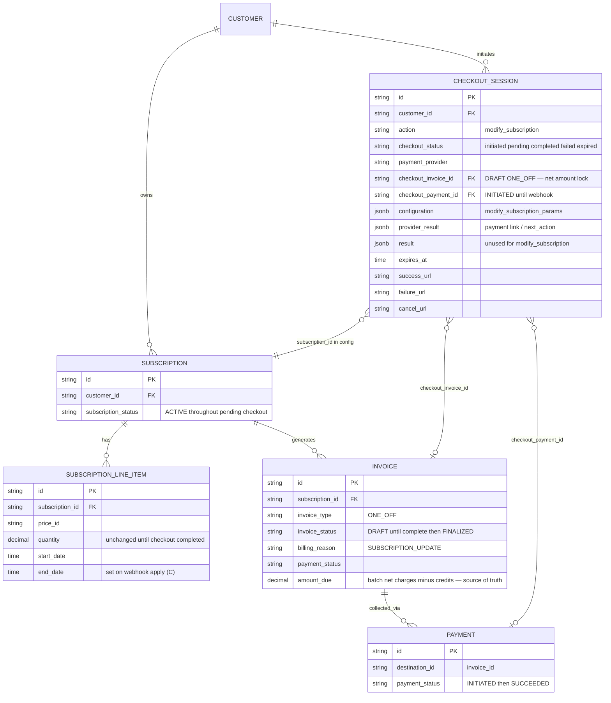

# Payment-Gated Subscription Quantity Change — Design ERD

Status: **Implemented (backend)** — pay-first quantity change live  
Date: 2026-07-17 (updated 2026-07-18)  
Related: [Seat-Based Pricing](https://docs.flexprice.io/docs/subscriptions/seat-based-pricing), [Checkout overview](https://docs.flexprice.io/docs/checkout/overview.md), checkout create-subscription in `internal/ee/service/checkout_session.go`

---

## 1. Problem Statement

`POST /subscriptions/{id}/modify/execute` with `type: quantity_change` historically **applied line-item close-and-replace immediately**, then created a ONE_OFF proration invoice (ADVANCE upgrade) that may remain unpaid. That pay-later model fits B2B invoice customers.

For B2B2C, a seat increase that produces a **proration charge** must only take effect **after** checkout payment succeeds — same gate as hosted checkout for `create_subscription`.

**Goal (achieved):** opt-in pay-first path for quantity changes when the batch **net** (charges − credits) > 0; zero behavior change for existing pay-later modify when `checkout` is omitted; reuse checkout sessions as the short-lived payment vehicle (no new pending-operations table).

---


## 2. Approach


### 2.1 API surface (backward compatible)

- `modify/preview` — dry-run (A + B only; no writes).
- `modify/execute` — default pay-later when `checkout` is omitted.
- Opt-in: optional `checkout` object (`CheckoutParams`) on the execute request. Presence means “collect payment before applying” when net charge > 0.
- Checkout is **allowlisted** to `quantity_change` only (`checkoutAllowedModifyTypes`).
- `POST /checkout/sessions` **rejects** `action: modify_subscription` — sessions are created only via modify/execute.

```json
{
  "type": "quantity_change",
  "quantity_change_params": {
    "line_items": [
      { "id": "subs_line_old", "quantity": "15", "effective_date": "2026-07-20T04:00:00Z" }
    ]
  },
  "checkout": {
    "payment_provider": "razorpay",
    "success_url": "https://app.example.com/ok",
    "failure_url": "https://app.example.com/fail",
    "cancel_url": "https://app.example.com/cancel",
    "idempotency_key": "optional-client-retry-key",
    "payment_provider_config": {},
    "metadata": {}
  }
}
```

Reusable DTO (`internal/api/dto/checkout_session.go`):


| Struct              | Fields                                        |
| ------------------- | --------------------------------------------- |
| `PaymentParams`     | `payment_provider`, `payment_provider_config` |
| `RedirectionParams` | `success_url`, `failure_url`, `cancel_url`    |
| `CheckoutParams`    | embeds both + `idempotency_key`, `metadata`   |


`CreateCheckoutSessionRequest` embeds `CheckoutParams` (flat JSON). `ExecuteSubscriptionModifyRequest.Checkout` is `*CheckoutParams`.

Not taken from full create-session request: `customer_external_id` (from sub), `action` (implied `modify_subscription`), `configuration.create_subscription_params`.

**Branching:**


| Condition                                        | Behavior                                                                |
| ------------------------------------------------ | ----------------------------------------------------------------------- |
| No `checkout`                                    | Pay-later: apply LIs, then per-item charge invoice and/or wallet credit |
| `checkout` + **net** (charges − credits) **> 0** | Pay-first: no LI mutation; session + one DRAFT for net + payment link   |
| `checkout` + net **≤ 0** (credit / zero)         | Immediate path (ignore checkout)                                        |


Mixed LI upgrades and downgrades in one request are **netted** for pay-first (not rejected). The DRAFT invoice keeps per-LI charge and credit line items; `amount_due` is their sum.

### 2.2 Modular pipeline (A → B → C → D)

Implemented in `internal/ee/service/subscription_modification_quantity.go` (orchestration in `subscription_modification.go`).


| Module | Function(s)                          | Role                                                                                                             |
| ------ | ------------------------------------ | ---------------------------------------------------------------------------------------------------------------- |
| **A**  | `buildQuantityChangePlan`            | Validate + build `quantityChangePlan` (read-only). Persistable via `toModifySubscriptionParams()`.               |
| **B**  | `calculateProrationForPlan`          | Per-ADVANCE-item proration; `GetNetCharge` / `GetNetCredit` / `GetNetAmount`. No money writes.                   |
| **C**  | `applyQuantityChangePlan`            | LI close-and-replace in one tx; new UUID at apply time. Idempotent if already ended at `effective_date`.         |
| **D1** | `settlePayLater`                     | C, then **per item**: charge → ONE_OFF + AttemptPayment; credit → wallet top-up.                                 |
| **D3** | `settlePayFirst`                     | Concurrent guard → DRAFT (net) → session + payment link. **No C.**                                               |
| **D4** | `completeModifySubscriptionCheckout` | Hydrate plan from config → C → finalize DRAFT + reconcile payment → `subscription.updated`. No proration recalc. |


Shared by paths:


| Path              | Modules                                   |
| ----------------- | ----------------------------------------- |
| Preview           | A + B → placeholders / synthetic invoices |
| Pay-later execute | A + B → D1 (C inside)                     |
| Pay-first execute | A + B → D3                                |
| Webhook complete  | D4 (rebuild A-shaped plan → C)            |


### 2.3 Where the intent lives

**Checkout session** `configuration` **JSONB** — `modify_subscription_params` (minimal apply intent).  
**Money** locked on the **DRAFT ONE_OFF** (`checkout_invoice_id` → `amount_due` = batch net).  
`checkout_sessions.result` — unused for this action (IDs on `checkout_invoice_id` / `checkout_payment_id`).

On complete: reload each `line_item_id` from DB, end at `effective_date`, create replacement with a **new** UUID (not preallocated).

Pay-first response line-item ids use placeholders `(preview-ended)` / `(preview-created)`. Real ids exist only after webhook apply (client refetches subscription).

### 2.4 Concurrent guard

Before pay-first session create: reject if any `initiated`/`pending` checkout session already exists for the same subscription (`action = modify_subscription`, match `configuration.modify_subscription_params.subscription_id`).

### 2.5 Lifecycle

```text
modify/execute (checkout present, net > 0)
  → A validate + B compute proration (once)
  → concurrent guard
  → DRAFT ONE_OFF (line items = per-LI charges/credits; amount_due = net)
  → CheckoutSession (action = modify_subscription → pending)
       configuration.modify_subscription_params = minimal apply intent
  → INITIATED payment + provider link
  → set checkout_invoice_id / checkout_payment_id
  → return SubscriptionModifyResponse:
       subscription = current (unchanged)
       changed_resources = preview-style placeholders + draft invoice
       checkout_session (with nested payment / payment_action)

Razorpay webhook (payment_link.paid / payment.captured)
  → CompleteCheckoutSession
  → completeModifySubscriptionCheckout:
       planFromModifySubscriptionParams → applyQuantityChangePlan (C)
       finalize existing draft + mark payment SUCCEEDED + reconcile
       — do NOT recompute proration; do NOT also issue wallet credits
         for downgrade LIs already netted into the draft
  → session completed + subscription.updated

fail / expire / cancel
  → cleanupCheckoutSession (archive invoice/payment via session columns)
  → line items never changed
```


### 2.6 Client UX

Redirect / new tab to `checkout_session.payment.payment_action.url` → return on success/cancel URL → poll `GET /checkout/sessions/{id}`. Closing a local polling UI does not cancel the session. After `completed`, refetch subscription for real LI ids.

### 2.7 Pay-later vs pay-first money (important)


|             | Pay-later (`checkout` omitted)         | Pay-first (net > 0)                                         |
| ----------- | -------------------------------------- | ----------------------------------------------------------- |
| LI apply    | Immediate (C before money)             | Deferred until payment success                              |
| Charges     | **One ONE_OFF per** upgrade LI         | **One** aggregated DRAFT                                    |
| Credits     | **One wallet credit per** downgrade LI | Included as negative lines on the same DRAFT; net collected |
| Mixed batch | Separate charge invoice(s) + credit(s) | Netted into one `amount_due`                                |


---


## 3. ERD




**No new tables.** Persistence delta:


| Piece                             | Change                            |
| --------------------------------- | --------------------------------- |
| `checkout_sessions.action`        | New value: `modify_subscription`  |
| `checkout_sessions.configuration` | `modify_subscription_params` (§4) |
| `checkout_sessions.result`        | **Unused** for this action        |
| Line items / invoices / payments  | Existing only                     |


---


## 4. Configuration JSON (v1)

Parallel to `CreateSubscriptionParams` in `internal/types/checkout_configuration.go`.

### 4.1 `configuration.modify_subscription_params`

```json
{
  "subscription_id": "subs_...",
  "line_item_modifications": [
    {
      "line_item_id": "subs_line_old",
      "quantity": "15",
      "effective_date": "2026-07-20T04:00:00.000Z"
    }
  ]
}
```

`subscription_id` is taken from the modify path when the session is created (not from the execute request body).


| Field                                      | Meaning                                                |
| ------------------------------------------ | ------------------------------------------------------ |
| `subscription_id`                          | From modify path; concurrent guard + webhook apply     |
| `line_item_modifications[].line_item_id`   | Existing LI to end                                     |
| `line_item_modifications[].quantity`       | New quantity                                           |
| `line_item_modifications[].effective_date` | Optional; omit = now at execute time, stored for apply |


**Why not store the full in-memory** `quantityChangePlan`**?** The plan holds live `*Subscription` / `*SubscriptionLineItem` pointers. Config stores **minimal intent**; complete hydrates via `planFromModifySubscriptionParams` then runs C. Money stays on the DRAFT, not in config.

**Webhook apply (per modification):** load `line_item_id` → if already ended at `effective_date`, skip (idempotent) → else set `end_date = effective_date` → create new LI (new id) via line-item builder, `quantity` + `start_date = effective_date`. Finalize + reconcile session invoice — **no proration recalculation**.

---


## 5. Execute response (pay-first)

`SubscriptionModifyResponse` includes optional `checkout_session` (`CheckoutSessionResponse`).

```json
{
  "subscription": { },
  "changed_resources": {
    "line_items": [
      {
        "id": "(preview-ended)",
        "quantity": "10",
        "change_action": "ended"
      },
      {
        "id": "(preview-created)",
        "quantity": "15",
        "change_action": "created"
      }
    ],
    "invoices": [
      {
        "action": "created",
        "status": "PENDING",
        "invoice": { "id": "inv_...", "amount_due": "1298.39", "invoice_status": "DRAFT" }
      }
    ]
  },
  "checkout_session": {
    "id": "cs_...",
  },
  "payment_action": {
    ...
  }
}
```


- Poll: `GET /v1/checkout/sessions/{checkout_session.id}`.

---


## 6. Status mapping


| Phase                   | Checkout             | Invoice            | Payment     | Live line items                    |
| ----------------------- | -------------------- | ------------------ | ----------- | ---------------------------------- |
| After pay-first execute | `pending`            | `DRAFT`            | `INITIATED` | Unchanged                          |
| After webhook success   | `completed`          | `FINALIZED` + paid | `SUCCEEDED` | Old ended / new created (new UUID) |
| Fail / expire / cancel  | `failed` / `expired` | Archived           | Archived    | Unchanged                          |


---


## 7. Scenarios


| #   | Scenario                                 | Handling                                                           |
| --- | ---------------------------------------- | ------------------------------------------------------------------ |
| 1   | Execute without `checkout`               | Pay-later: apply LIs + per-item invoice/credit                     |
| 2   | `checkout` + net (charges − credits) > 0 | Session + one DRAFT for net; LIs deferred; mixed LI up/down netted |
| 3   | `checkout` + net credit / zero           | Immediate path (no session); ignore checkout                       |
| 4   | Second pay-first while session pending   | Rejected (concurrent guard)                                        |
| 5   | Payment succeeds                         | C from config; finalize/reconcile existing invoice                 |
| 6   | Link cancel / expire / cron              | Cleanup; seats unchanged                                           |
| 7   | Late capture after expired/failed        | Existing refund path; no LI apply                                  |
| 8   | Client closes poll UI mid-pay            | Session continues; return URL / GET session / refetch sub          |


---

## 8. Evolvability notes (for later capabilities)

This work establishes a **reusable recipe**, not a universal “all modifies” platform:

1. Opt-in `CheckoutParams` on execute
2. Split A intent → B price → C apply → D settle
3. Pay-first: persist **minimal** config intent + lock money on DRAFT; defer C
4. Complete: hydrate → C → finalize same invoice (no recalc)
5. Concurrent guard per subscription

**v1 scope:** `modify_subscription` + `ModifySubscriptionParams` = **quantity LI close-and-replace only**.  
**Next likely consumer (plan change):** new checkout action and params blob (e.g. `change_subscription` / `plan_change_params`) — do **not** overload `line_item_modifications`. Extract A/B/C inside `SubscriptionChangeService` and reuse the same settlement lifecycle. Prefer concurrent guard across all payment-gated actions for a subscription.