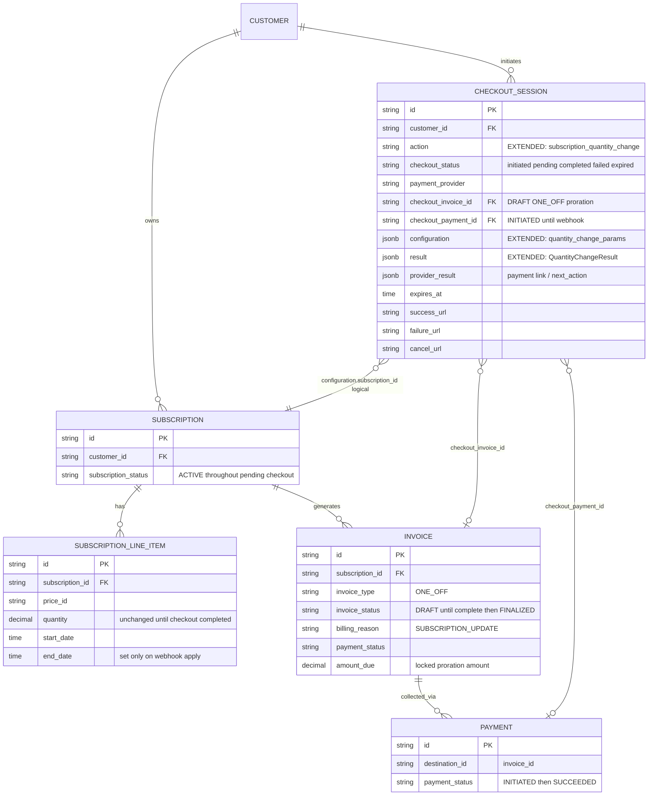

  
Payment-Gated Subscription Quantity Change — Design ERD

Status: **Design (not implemented)**  
Date: 2026-07-17  
Related: [Seat-Based Pricing](https://docs.flexprice.io/docs/subscriptions/seat-based-pricing), [Checkout overview](https://docs.flexprice.io/docs/checkout/overview.md), checkout create-subscription flow in `internal/ee/service/checkout_session.go`

---

## 1. Problem Statement

Today, `POST /subscriptions/{id}/modify/execute` with `type: quantity_change` **applies line-item close-and-replace immediately**, then creates a ONE_OFF proration invoice (ADVANCE upgrade) that may remain unpaid. That pay-later model fits B2B invoice customers.

For B2B2C (e.g. Sarvam-style), a seat increase that produces a **proration charge** must only take effect **after** checkout payment succeeds — same gate as hosted checkout for `create_subscription`.

**Goal:** opt-in pay-first path for quantity changes with net charge > 0; zero behavior change for existing pay-later modify; reuse checkout sessions as the short-lived payment vehicle (no separate pending-operations table).

---

## 2. Approach

### 2.1 API surface (backward compatible)

- `modify/preview` — unchanged (dry-run).
- `modify/execute` — default unchanged (pay-later).
- Opt-in flag on execute (name TBD, e.g. `require_payment: true`):
  - If net proration **charge ≤ 0** (credit / no-op / ARREAR-only versioning): keep today’s immediate path.
  - If net proration **charge > 0**: do **not** mutate live line items; create checkout session + draft invoice + payment; return same `SubscriptionModifyResponse` extended with checkout / `payment_action`.

### 2.2 Where the intent lives

**Checkout session** `configuration` **JSONB only** — same pattern as `create_subscription_params`.

Intent is short-lived; after payment, durable truth is line items + invoices.

**When fields are set (not only on completed):** same as create-subscription checkout today — at pay-first execute / fulfill (session → `pending`):


| Field                                                                                                         | When set                                                 |
| ------------------------------------------------------------------------------------------------------------- | -------------------------------------------------------- |
| `configuration.subscription_id` + quantity-change plan + locked amount + **preallocated `new_line_item_id`s** | At session create (execute), before payment              |
| `result` (subscription_id, invoice_id, payment_id)                                                            | When draft invoice/payment are created (still `pending`) |
| `checkout_invoice_id` / `checkout_payment_id`                                                                 | Same moment                                              |
| Live LI rows                                                                                                  | **Only** on webhook complete                             |


So `result` / `configuration.subscription_id` are **not** nil while waiting for payment — they are populated as soon as the session is ready for the customer to pay. Concurrent guard: list `initiated`/`pending` sessions for this tenant/env whose `configuration.subscription_id` (or `result.subscription_id`) matches; reject a second pay-first modify.

### 2.3 Lifecycle

```text
modify/execute (require_payment, charge > 0)
  → validate + compute proration (lock amount)
  → preallocate new line item IDs (store in configuration; return in changed_resources; NOT inserted in DB yet)
  → CheckoutSession (action = subscription_quantity_change, status → pending)
       configuration = full apply plan (see §4), not a bare re-executable modify request alone
  → DRAFT ONE_OFF invoice + INITIATED payment
  → result + checkout_*_id columns set now
  → return ModifyResponse + payment_action.url

Razorpay webhook (payment_link.paid / payment.captured)
  → CompleteCheckoutSession
  → apply from configuration (deterministic): end old LIs / create new LIs with stored IDs
       — do NOT re-run modify/execute or recompute proration
  → finalize existing draft invoice + reconcile payment
  → session completed

fail / expire / cancel
  → existing checkout cleanup (archive invoice/payment; session failed|expired)
  → line items never changed
```

### 2.4 Client UX (non-persistence)

Hosted payment link: redirect or new tab → return on `success_url` / `cancel_url` → poll `GET /checkout/sessions/:id`. Webhook is source of truth; closing a polling dialog does not cancel the session.

---

## 3. ERD




**No new tables.** Persistence delta vs today:


| Piece                             | Change                                                                     |
| --------------------------------- | -------------------------------------------------------------------------- |
| `checkout_sessions.action`        | New allowed value, e.g. `subscription_quantity_change`                     |
| `checkout_sessions.configuration` | New JSON branch (see §4)                                                   |
| `checkout_sessions.result`        | New JSON branch with subscription / invoice / payment ids + applied LI ids |
| Line items / invoices / payments  | Existing tables and statuses only                                          |


**Explicitly not added:** dedicated pending-operations table, protobuf blobs, pay-later audit rows for every modify.

---

## 4. Configuration & result JSON (v1)

Mirrors `CreateSubscriptionParams` / `CreateSubscriptionResult` style in `internal/types/checkout_configuration.go`.

### 4.1 `configuration.quantity_change_params` (name TBD)

```json
{
  "subscription_id": "subs_...",
  "schema_version": 1,
  "quantity_change_params": {
    "line_items": [
      {
        "id": "subs_line_..._existing",
        "quantity": "15",
        "effective_date": "2026-07-20T04:00:00.000Z",
        "new_line_item_id": "subs_line_..._preallocated"
      }
    ]
  },
  "locked_amount": "1298.39",
  "currency": "inr",
  "require_payment": true
}
```

- `new_line_item_id`: preallocated ID returned in `changed_resources` at execute; created only on webhook apply.
- `locked_amount`: proration computed at execute time; payment link uses this amount.

### 4.2 `result.quantity_change_result` (name TBD)

Set when the session becomes `pending` (draft money created), **not** only after payment:

```json
{
  "subscription_id": "subs_...",
  "invoice_id": "inv_...",
  "payment_id": "pay_..."
}
```

After webhook apply, optionally extend with `ended_line_item_ids` / `created_line_item_ids` for traceability (same IDs as `new_line_item_id` in configuration). Apply logic must use **configuration**, not re-call execute.

---

## 5. Status mapping


| Phase                   | Checkout             | Invoice            | Payment     | Live line items         |
| ----------------------- | -------------------- | ------------------ | ----------- | ----------------------- |
| After pay-first execute | `pending`            | `DRAFT`            | `INITIATED` | Unchanged (old qty)     |
| After webhook success   | `completed`          | `FINALIZED` + paid | `SUCCEEDED` | Old ended / new created |
| Fail / expire / cancel  | `failed` / `expired` | Archived           | Archived    | Unchanged               |


---

## 6. Scenarios


| #   | Scenario                                      | Handling                                                        |
| --- | --------------------------------------------- | --------------------------------------------------------------- |
| 1   | Execute without require_payment               | Today’s path: apply LIs + invoice/credit immediately            |
| 2   | require_payment + net charge > 0              | Checkout session + draft money; LIs deferred                    |
| 3   | require_payment + net credit / zero           | Immediate path (no checkout)                                    |
| 4   | Second pay-first modify while session pending | Rejected                                                        |
| 5   | Payment succeeds                              | Apply LIs from configuration; finalize + reconcile              |
| 6   | Link cancel / expire / cron expiry            | Cleanup session artifacts; seats unchanged                      |
| 7   | Late capture after expired/failed             | Existing refund path; no LI apply                               |
| 8   | Client closes poll UI mid-pay                 | Session continues; return URL / later GET session / refetch sub |


  
NOTE:

- In future we could think of a separate table to store payment gated intents as they would be an increasing thing in future starting from now.
- Right now such intent is captured in checkoutSession.Configuration linking any discoverability of that intent to checkout session existence which is a dependency.

