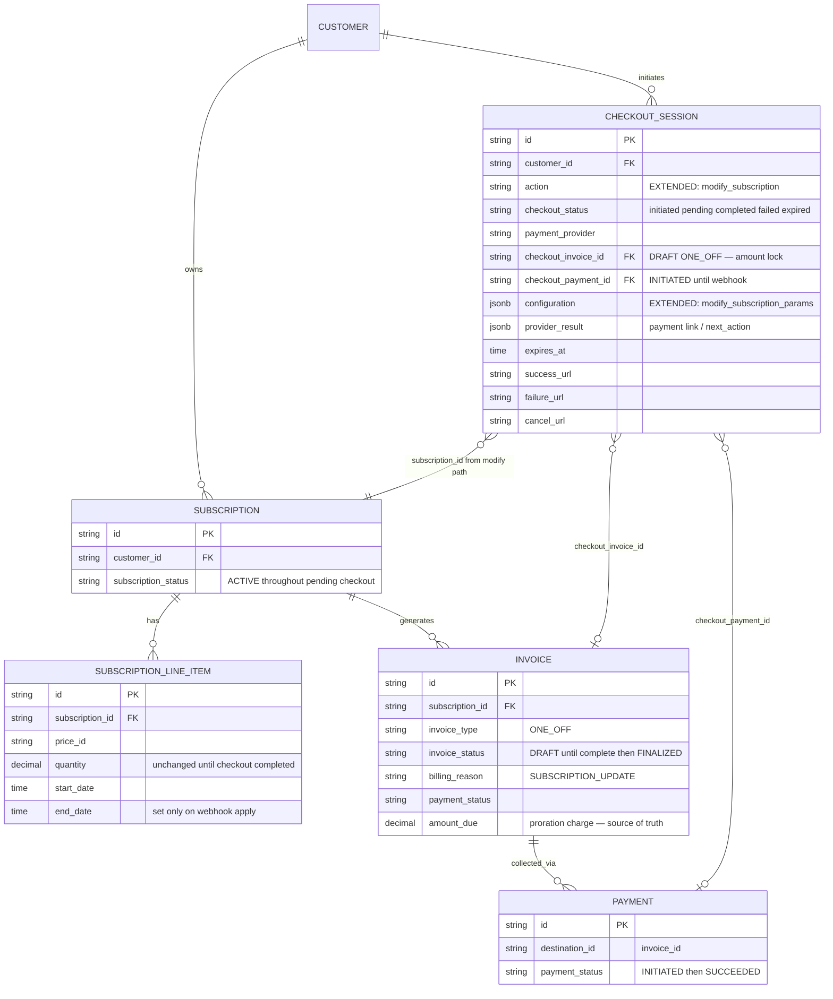

# Payment-Gated Subscription Quantity Change — Design ERD

Status: **In progress** (A–D3 + D4 complete path wired; D5/D6 tests/polish remain)  
Date: 2026-07-17 (updated 2026-07-18)  
Related: [Seat-Based Pricing](https://docs.flexprice.io/docs/subscriptions/seat-based-pricing), [Checkout overview](https://docs.flexprice.io/docs/checkout/overview.md), checkout create-subscription in `internal/ee/service/checkout_session.go`

---

## 1. Problem Statement

Today, `POST /subscriptions/{id}/modify/execute` with `type: quantity_change` **applies line-item close-and-replace immediately**, then creates a ONE_OFF proration invoice (ADVANCE upgrade) that may remain unpaid. That pay-later model fits B2B invoice customers.

For B2B2C (e.g. Sarvam-style), a seat increase that produces a **proration charge** must only take effect **after** checkout payment succeeds — same gate as hosted checkout for `create_subscription`.

**Goal:** opt-in pay-first path for quantity changes with net charge > 0; zero behavior change for existing pay-later modify; reuse checkout sessions as the short-lived payment vehicle (no new pending-operations table).

---

## 2. Approach

### 2.1 API surface (backward compatible)

- `modify/preview` — unchanged (dry-run).
- `modify/execute` — default unchanged (pay-later) when `checkout` is omitted.
- Opt-in: optional `**checkout**` object on the execute request. Presence means “collect payment before applying.”

```json
{
  "type": "quantity_change",
  "quantity_change_params": {
    "line_items": [
      { "id": "subs_line_old", "quantity": "15", "effective_date": "2026-07-20T04:00:00Z" }
    ]
  },
  "checkout": {
    "payment_provider": "razorpay",
    "success_url": "https://app.example.com/ok",
    "failure_url": "https://app.example.com/fail",
    "cancel_url": "https://app.example.com/cancel",
    "idempotency_key": "optional-client-retry-key",
    "payment_provider_config": {},
    "metadata": {}
  }
}
```


| `checkout` field                             | Required | Notes                                                      |
| -------------------------------------------- | -------- | ---------------------------------------------------------- |
| `payment_provider`                           | Yes      | e.g. `razorpay`                                            |
| `success_url` / `failure_url` / `cancel_url` | Optional | Redirect UX                                                |
| `idempotency_key`                            | Optional | Client retries; omit if duplicates on retry are acceptable |
| `payment_provider_config`                    | Optional | Mandates later                                             |
| `metadata`                                   | Optional |                                                            |


Not taken from full `CreateCheckoutSessionRequest`: `customer_external_id` (from sub), `action` (implied), `configuration.create_subscription_params`.

**Branching:**


| Condition                                         | Behavior                                                                              |
| ------------------------------------------------- | ------------------------------------------------------------------------------------- |
| No `checkout`                                     | Today’s pay-later path                                                                |
| `checkout` present + net proration **charge > 0** | Pay-first: no LI mutation; create session + draft invoice + payment                   |
| `checkout` present + net **≤ 0** (credit / zero)  | Immediate path (ignore checkout / or validation error — prefer immediate credit path) |


### 2.2 Where the intent lives

**Checkout session `configuration` JSONB only** — parallel to `create_subscription_params`.

Money amount is locked on the **DRAFT ONE_OFF invoice** (`checkout_invoice_id` → `amount_due`), same idea as create-sub compute.

**Apply plan (approach B):** store minimal modifications; on webhook reload old LI from DB, end it, create replacement with a **new** UUID (generated at apply time — not preallocated).

**Response ids match preview:** `changed_resources.line_items` use placeholders `(preview-ended)` / `(preview-created)` until payment completes. Real new LI ids exist only after webhook apply (client refetches subscription).

### 2.3 Concurrent guard

Before creating a pay-first session: use the subscription id from the modify path (`POST /subscriptions/{id}/modify/execute`) and reject if any `initiated`/`pending` checkout session already exists for that subscription (action `modify_subscription`). Prevents a second pending checkout for the same sub.

### 2.4 Lifecycle

```text
modify/execute (checkout present, charge > 0)
  → validate + compute proration once
  → concurrent guard
  → CheckoutSession (action = modify_subscription → pending)
       configuration.modify_subscription_params = apply plan (§4)
       (subscription_id taken from modify path, not request body)
  → DRAFT ONE_OFF invoice (amount_due = proration) + INITIATED payment
  → set checkout_invoice_id / checkout_payment_id
  → return SubscriptionModifyResponse:
       subscription = current (unchanged)
       changed_resources = preview-style placeholders + draft invoice
       checkout_session (with nested payment)

Razorpay webhook (payment_link.paid / payment.captured)
  → CompleteCheckoutSession
  → for each line_item_modification:
       load line_item_id, end at effective_date,
       create new LI (new UUID) copying fields, quantity = modification.quantity
  → finalize existing draft invoice + reconcile payment
       — do NOT recompute proration
  → session completed

fail / expire / cancel
  → checkout cleanup (archive invoice/payment)
  → line items never changed
```

### 2.5 Client UX

Redirect / new tab to `checkout_session.payment.payment_action.url` → return on success/cancel URL → poll `GET /checkout/sessions/{id}`. Closing a local polling UI does not cancel the session. After `completed`, refetch subscription for real LI ids.

---

## 3. ERD




**No new tables.** Persistence delta:


| Piece                             | Change                            |
| --------------------------------- | --------------------------------- |
| `checkout_sessions.action`        | New value: `modify_subscription`  |
| `checkout_sessions.configuration` | `modify_subscription_params` (§4) |
| `checkout_sessions.result`        | **Unused** for this action        |
| Line items / invoices / payments  | Existing only                     |


---

## 4. Configuration JSON (v1)

Parallel to `CreateSubscriptionParams` in `internal/types/checkout_configuration.go`.

### 4.1 `configuration.modify_subscription_params`

```json
{
  "subscription_id": "subs_...",
  "line_item_modifications": [
    {
      "line_item_id": "subs_line_old",
      "quantity": "15",
      "effective_date": "2026-07-20T04:00:00.000Z"
    }
  ]
}
```

`subscription_id` is **not** on the modify execute request body — it is taken from the path (`/subscriptions/{id}/modify/execute`) when the session is created and stored here for webhook apply / lookups.


| Field                                      | Meaning                                                           |
| ------------------------------------------ | ----------------------------------------------------------------- |
| `subscription_id`                          | From modify path; used for concurrent guard match + webhook apply |
| `line_item_modifications[].line_item_id`   | Existing LI to end                                                |
| `line_item_modifications[].quantity`       | New quantity (fields present = values to apply)                   |
| `line_item_modifications[].effective_date` | Optional; omit = now at execute time, stored for apply            |


**Webhook apply (per modification):** load `line_item_id` → set `end_date = effective_date` → create new LI with **new** generated id, copy fields from old, set `quantity` and `start_date = effective_date`. Finalize + reconcile invoice already on the session — **no proration recalculation**.

---

## 5. Execute response (pay-first)

Extend `SubscriptionModifyResponse`:

```json
{
  "subscription": { },
  "changed_resources": {
    "line_items": [
      {
        "id": "(old-item-id)",
        "quantity": "10",
        "change_action": "ended",
        "...": "..."
      },
      {
        "id": "(modified-item-id)",
        "quantity": "15",
        "change_action": "created",
        "...": "..."
      }
    ],
    "invoices": [
      {
        "action": "created",
        "status": "PENDING",
        "invoice": { "id": "inv_...", "amount_due": "1298.39", "invoice_status": "DRAFT" }
      }
    ]
  },
  "checkout_session": {
    "id": "cs_...",
    "checkout_status": "pending",
    "payment": {
      "id": "pay_...",
      "payment_status": "INITIATED",
      "payment_action": { "type": "payment_link", "url": "https://rzp.io/..." },
      "expires_at": "..."
    }
  }
}
```

- `subscription` = **current** state (old quantities), like preview.
- Line item ids in `changed_resources` = **placeholders**, not real future ids.
- Payment lives **inside** `checkout_session` (includes `payment_action` + `expires_at`); no top-level `payment` field.
- Poll: `GET /v1/checkout/sessions/{checkout_session.id}`.

---

## 6. Status mapping


| Phase                   | Checkout             | Invoice            | Payment     | Live line items                    |
| ----------------------- | -------------------- | ------------------ | ----------- | ---------------------------------- |
| After pay-first execute | `pending`            | `DRAFT`            | `INITIATED` | Unchanged                          |
| After webhook success   | `completed`          | `FINALIZED` + paid | `SUCCEEDED` | Old ended / new created (new UUID) |
| Fail / expire / cancel  | `failed` / `expired` | Archived           | Archived    | Unchanged                          |


---

## 7. Scenarios


| #   | Scenario                               | Handling                                                             |
| --- | -------------------------------------- | -------------------------------------------------------------------- |
| 1   | Execute without `checkout`             | Pay-later: apply LIs + invoice/credit immediately                    |
| 2   | `checkout` + net (charges − credits) > 0 | Session + one DRAFT for net; LIs deferred; mixed LI up/down netted |
| 3   | `checkout` + net credit / zero         | Immediate path (no session); ignore checkout                         |
| 4   | Second pay-first while session pending | Rejected (concurrent guard)                                          |
| 5   | Payment succeeds                       | Apply B from config; finalize/reconcile existing invoice             |
| 6   | Link cancel / expire / cron            | Cleanup; seats unchanged                                             |
| 7   | Late capture after expired/failed      | Existing refund path; no LI apply                                    |
| 8   | Client closes poll UI mid-pay          | Session continues; return URL / GET session / refetch sub            |


---

## 8. Implementation touchpoints (for later)


| Area                             | Likely files                                                                                        |
| -------------------------------- | --------------------------------------------------------------------------------------------------- |
| Modify execute + `checkout` DTO  | `internal/ee/service/subscription_modification.go`, `internal/api/dto/subscription_modification.go` |
| Checkout action + complete apply | `internal/ee/service/checkout_session.go`, `checkout_session_actions.go`                            |
| Types                            | `internal/types/checkout.go`, `checkout_configuration.go`                                           |
| Razorpay webhook                 | existing → `CompleteCheckoutSession`                                                                |
| Dashboard                        | quantity dialog → redirect; poll session; refetch sub                                               |


