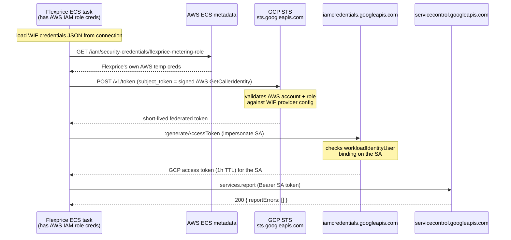
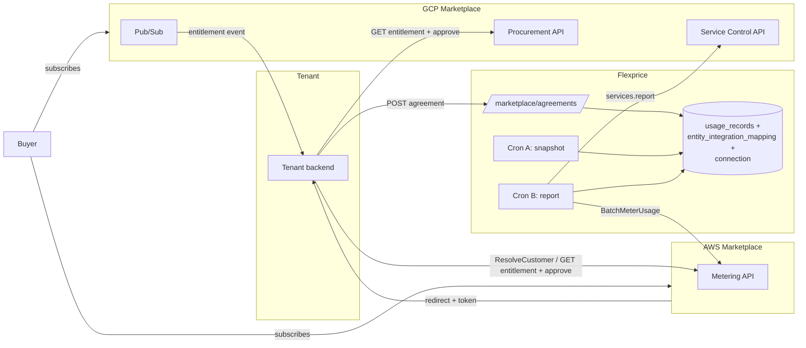
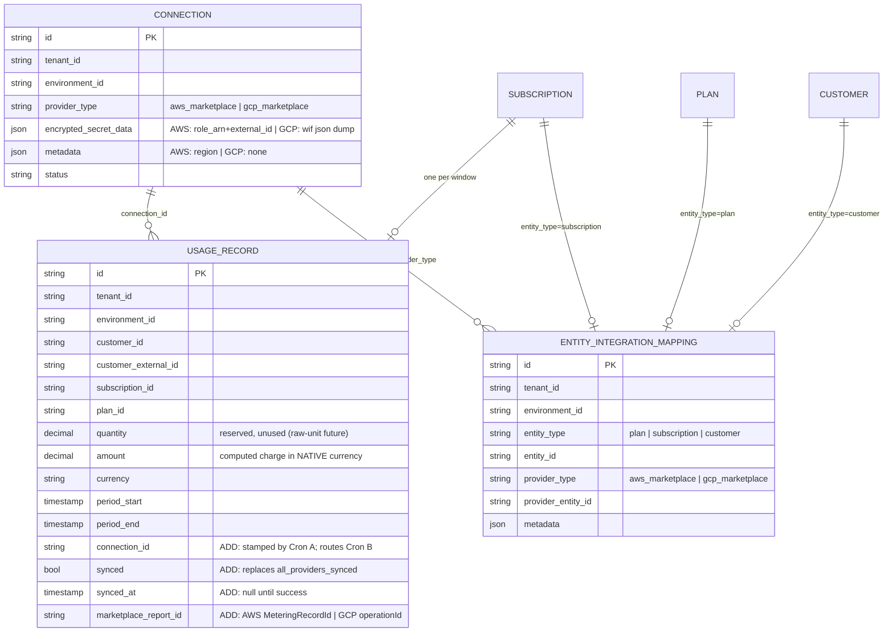
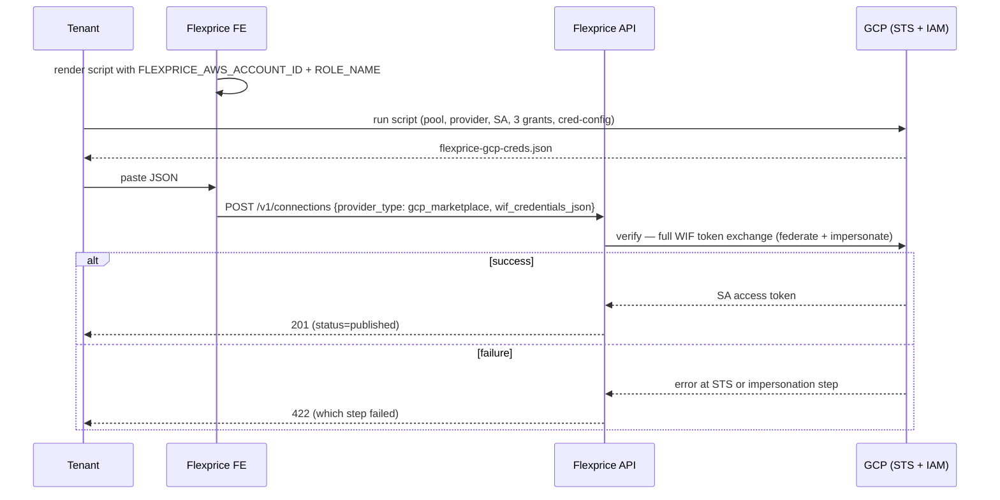
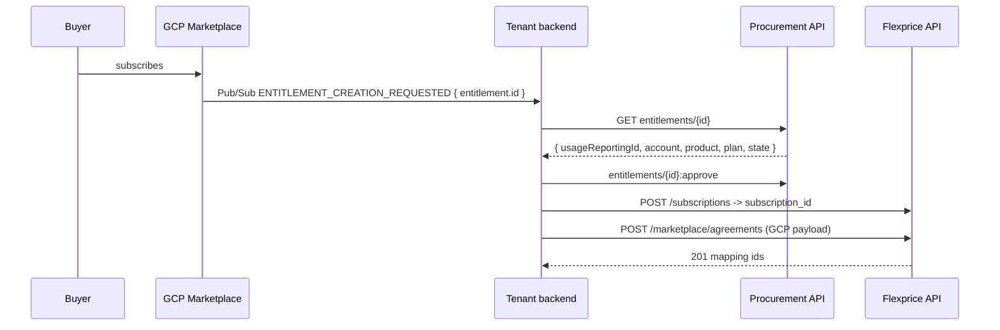
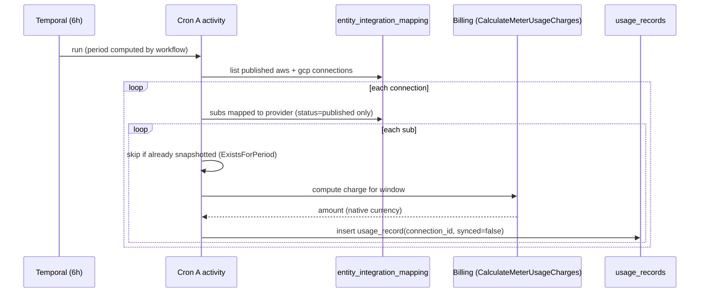
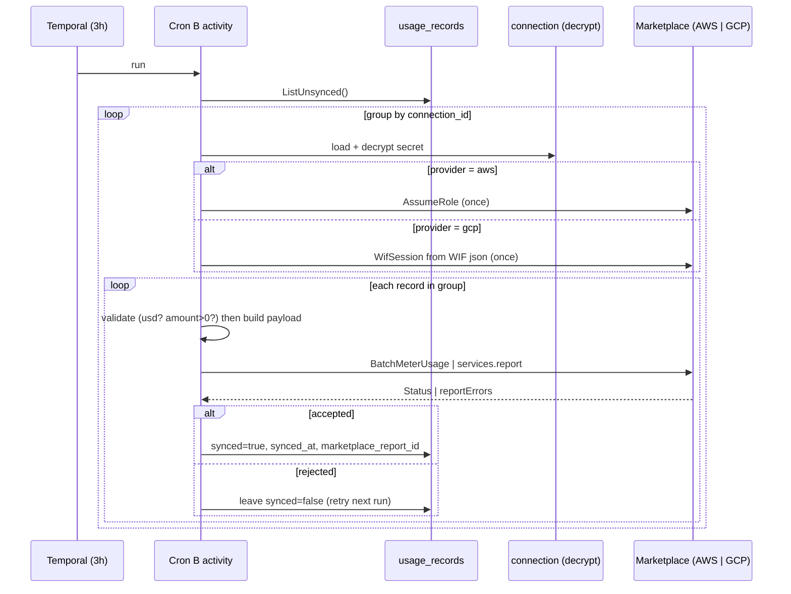

# Marketplace Integration — Design Doc (AWS + GCP)

Author: Tsage
Scope: AWS Marketplace (shipped) + GCP Marketplace (this design). Azure is out of scope but the
data model extends to it without new tables.

---

## 0. TL;DR

Flexprice does not sell its own marketplace listing. Flexprice is the metering engine our tenants
(who are themselves AWS/GCP Marketplace sellers) plug into, so their marketplace buyers get metered
correctly. Flexprice's job is exactly one thing per marketplace:

- **AWS:** take usage already computed for a Flexprice subscription and report it via `BatchMeterUsage`,
keyed by the buyer's `LicenseArn`.
- **GCP:** take the same computed usage and report it via the Service Control API `services.report`,
keyed by the buyer's `usageReportingId` (the `consumerId`).

Both marketplaces use the **USD-cents model**: Flexprice computes the invoice amount for a window,
converts to USD cents, and sends that integer. The marketplace multiplies cents × its own per-unit
rate ($0.01) to bill the buyer. Flexprice never constructs invoice line items on the marketplace side
— it posts one aggregated number per subscription per window.

Everything upstream — the tenant's marketplace product setup, the buyer's subscribe flow, resolving
the buyer (AWS `ResolveCustomer` / GCP Pub/Sub + Procurement API) — happens on the tenant's own
infrastructure. Flexprice never hosts a fulfillment URL, never listens to AWS EventBridge/SNS, never
subscribes to GCP Pub/Sub.

---


## 1. Concepts (read this first)


### 1.1 The core problem both marketplaces solve

Flexprice runs on AWS. To report usage it must call a marketplace API with valid credentials for
that marketplace. The entire auth design exists to answer: *how does a workload running in Flexprice's
AWS account call the tenant's marketplace API without the tenant handing us a long-lived secret?*

- **AWS:** `sts:AssumeRole`. The tenant creates an IAM role in their own account whose trust policy
names Flexprice's AWS account + an `ExternalId`. Flexprice assumes that role → short-lived creds →
`BatchMeterUsage`. **One hop.**
- **GCP:** Workload Identity Federation (WIF). GCP APIs only accept GCP credentials, and Flexprice has
none. WIF lets Flexprice present its *AWS* identity to GCP, which exchanges it for a short-lived GCP
token that impersonates a service account in the tenant's GCP project. **Two hops** (AWS creds →
GCP federated token → service-account token).


### 1.2 GCP terminology (the part everyone gets confused by)


| Term                           | What it is                                                                                                                                        | Example                                                | Analogous AWS concept                   |
| ------------------------------ | ------------------------------------------------------------------------------------------------------------------------------------------------- | ------------------------------------------------------ | --------------------------------------- |
| **Service Account (SA)**       | A non-human GCP identity Flexprice impersonates to call GCP APIs. **Always required** — there is no way to call a GCP API without becoming an SA. | `flexprice-metering-sa@tenant.iam.gserviceaccount.com` | The assumed IAM role                    |
| **Workload Identity Pool**     | A container in the tenant's GCP project that says "I accept identities from an external IdP." Holds no permissions itself.                        | `flexprice-pool`                                       | The `Principal` block in a trust policy |
| **Workload Identity Provider** | Inside the pool: "trust AWS, but only THIS account ID and THIS role name." The confused-deputy guard.                                             | `flexprice-provider` (AWS type)                        | `sts:ExternalId` condition              |
| **WIF credentials JSON**       | Config file (NOT a key) that tells Google's auth lib how to do the token exchange. Tenant generates it, hands it to Flexprice.                    | `type: external_account`                               | The `role_arn` + `external_id` pair     |
| **service_name**               | Technical API identifier of the tenant's marketplace **product**. Goes in the `services.report` URL. NOT a display name.                          | `my-product.gcpmarketplace.example.com`                | `ProductCode`                           |
| **Metric**                     | Billable unit defined under the service. For the cents model it is always `usage_fee`, priced at $0.01.                                           | `usage_fee`                                            | AWS Dimension                           |
| **metricName**                 | `{service_name}/{metric_id}` — goes in the payload.                                                                                               | `my-product.../usage_fee`                              | Dimension API name                      |
| **Entitlement**                | One buyer's purchase of the product.                                                                                                              | `providers/PARTNER/entitlements/abc123`                | The Agreement                           |
| **usageReportingId**           | The `consumerId` for `services.report`. Read from the entitlement (NOT the entitlement id itself).                                                | opaque string                                          | `LicenseArn`                            |


### 1.3 The GCP auth chain, concretely (what Google's auth library does automatically)




One SA token per connection per run covers **all** products (service_names) under that GCP project,
because the SA's `servicemanagement.serviceController` role is granted at the **project** level.

---


## 2. Actors


| Actor                   | Role                                                                                                                               |
| ----------------------- | ---------------------------------------------------------------------------------------------------------------------------------- |
| Marketplace (AWS / GCP) | Hosts the tenant's listing, checks the buyer out, invoices the buyer, pays the tenant. Ground truth for Agreements/Entitlements.   |
| Tenant                  | A marketplace seller. Owns their AWS account / GCP project, IAM role / WIF setup, and integration code. Resolves their own buyers. |
| Tenant's buyer          | The marketplace end-customer. Maps 1:1 to a Flexprice Customer under that tenant.                                                  |
| Flexprice               | Stores the mapping between Flexprice entities and marketplace identifiers. Runs Cron A (snapshot) and Cron B (report).             |


---


## 3. Architecture




---


## 4. Data model

Reuses `connection` and `entity_integration_mapping` (marketplace = new `provider_type` values) and
the existing `usage_records` table. GCP requires **no new table** — the cents model means a GCP
row is the same shape as an AWS row.

### 4.1 `usage_records` — schema change (drop `syncs`/`all_providers_synced`, add flat sync fields)

The original v1 shipped with a `syncs` JSONB map + `all_providers_synced` bool, built to let one row
sync to *multiple* marketplaces. **That case cannot exist:** a subscription is born from exactly one
marketplace purchase; metering the same subscription to two marketplaces would double-bill the buyer.
So `1 subscription : 1 marketplace` is a hard invariant, and the map collapses to a flat bool.




**Migration (**`ent/schema/usagerecord.go`**):**


| Change | Field                                       | Why                                                                                                                   |
| ------ | ------------------------------------------- | --------------------------------------------------------------------------------------------------------------------- |
| DROP   | `syncs` (JSONB map)                         | one sub = one marketplace, no fan-out needed                                                                          |
| DROP   | `all_providers_synced` (bool)               | replaced by flat `synced`                                                                                             |
| ADD    | `connection_id` (varchar 50)                | stamped by Cron A; the **only** routing field Cron B needs — the connection's `provider_type` decides the marketplace |
| ADD    | `synced` (bool, default false)              | the single retry signal; `false` = report next run                                                                    |
| ADD    | `synced_at` (timestamp, null)               | audit: when the report succeeded                                                                                      |
| ADD    | `marketplace_report_id` (varchar 255, null) | AWS `MeteringRecordId` | GCP `operationId`                                                                            |


- Index for Cron B's hot query: `(tenant_id, environment_id, synced)`.
- Idempotency: unique `(subscription_id, period_start, period_end)` (Cron A's `ExistsForPeriod`).
- `provider_type` is **not** stored on the row — Cron B loads the connection anyway (to decrypt the
secret), and `provider_type` comes free with it.


### 4.2 `entity_integration_mapping` — three mapping kinds per provider


| entity_type    | entity_id       | provider_entity_id (AWS)  | provider_entity_id (GCP) | metadata (AWS)                       | metadata (GCP)              |
| -------------- | --------------- | ------------------------- | ------------------------ | ------------------------------------ | --------------------------- |
| `plan`         | plan_id         | `product_code`            | `service_name`           | `{dimension, concurrent_agreements}` | `{metric_name}`             |
| `subscription` | subscription_id | `license_arn`             | `usageReportingId`       | —                                    | —                           |
| `customer`     | customer_id     | `customer_aws_account_id` | `account_id`             | —                                    | —                           |


- **The GCP customer mapping IS created** (`account_id`), same as AWS — written at agreement
registration. It is not used in the `services.report` payload (`consumerId` = `usageReportingId` on the
subscription mapping is enough), but it is stored for completeness and lifecycle events (e.g.
`ACCOUNT_DELETED`).
- **No `entitlement_name`, no `state`, no Procurement-API call from the crons.** Flexprice never calls
the Procurement API in the report path, so it stores neither `entitlement_name` nor a mutable `state`.
Entitlement lifecycle is entirely **tenant-driven**: when an entitlement closes the tenant cancels the
subscription at Flexprice and Flexprice **archives** the subscription mapping. Both crons filter
`status = published`, so a closed entitlement drops out automatically (§10.5). (`entitlement_name` can
be re-added later if Procurement-API reconciliation is ever needed.)


### 4.3 `connection` — secret shapes

```jsonc
// AWS
{
  "provider_type": "aws_marketplace",
  "encrypted_secret_data": { "aws_marketplace": { "role_arn": "arn:aws:iam::222...:role/fp", "external_id": "acme-t_01k" } },
  "metadata": { "aws_marketplace": { "region": "us-east-1" } },
  "status": "published"
}

// GCP  (nothing product-specific — a connection = one GCP project = potentially many products)
// Same pattern as AWS: the secret lives under the provider key. For GCP that value is just the WIF
// JSON dump — the whole external_account document — encrypted as one blob. No extra wrapper key.
{
  "provider_type": "gcp_marketplace",
  "encrypted_secret_data": { "gcp_marketplace": { "type": "external_account", "audience": "...", "credential_source": { "...": "..." }, "service_account_impersonation_url": "..." } },
  "metadata": {},
  "status": "published"
}
```

New enum values: `SecretProviderGCPMarketplace`, `ConnectionMetadataType.gcp_marketplace`.

---


## 5. Connection setup


### 5.1 AWS — one static template, verified by `AssumeRole`

Tenant renders a static IAM policy + trust policy (frontend fills `{FLEXPRICE_AWS_ACCOUNT_ID}` and
`{EXTERNAL_ID}`), creates the role, pastes the Role ARN. `POST /v1/connections` calls `AssumeRole`
synchronously; on success the connection is saved, on failure a 422 with the AWS error is returned.

### 5.2 GCP — tenant runs a script, pastes the WIF JSON

Flexprice's UI renders the script below with `FLEXPRICE_AWS_ACCOUNT_ID` + `FLEXPRICE_AWS_ROLE_NAME`
pre-filled (these two values are why the WIF provider knows *whose* AWS identity to trust — without
them GCP would trust nobody, or with only the account id it would trust *any* role in Flexprice's
account). Tenant runs it in GCP Cloud Shell, then pastes the resulting JSON.

```bash
GCP_PROJECT_ID="tenant-project"
GCP_PROJECT_NUMBER="123456789"
SA_ID="flexprice-metering-sa"
FLEXPRICE_AWS_ACCOUNT_ID="111122223333"        # Flexprice pre-fills
FLEXPRICE_AWS_ROLE_NAME="flexprice-gcp-metering-role"  # Flexprice pre-fills

# 1. WIF pool — trust container for an external IdP
gcloud iam workload-identity-pools create "flexprice-pool" \
  --location="global" --project="$GCP_PROJECT_ID"

# 2. WIF provider — trust AWS, only Flexprice's account + role (confused-deputy guard)
gcloud iam workload-identity-pools providers create-aws "flexprice-provider" \
  --location="global" --workload-identity-pool="flexprice-pool" \
  --account-id="$FLEXPRICE_AWS_ACCOUNT_ID" \
  --attribute-mapping="google.subject=assertion.arn.extract('assumed-role/{role}/'),attribute.aws_role=assertion.arn.extract('assumed-role/{role}/')" \
  --attribute-condition="attribute.aws_role == '$FLEXPRICE_AWS_ROLE_NAME'" \
  --project="$GCP_PROJECT_ID"

# 3. Service account — the GCP identity Flexprice impersonates
gcloud iam service-accounts create "$SA_ID" --project="$GCP_PROJECT_ID"

# 4a. Grant SA -> report usage (Service Control API)
gcloud projects add-iam-policy-binding "$GCP_PROJECT_ID" \
  --role="roles/servicemanagement.serviceController" \
  --member="serviceAccount:$SA_ID@$GCP_PROJECT_ID.iam.gserviceaccount.com"

# 4b. Grant SA -> read entitlements (Procurement API)
gcloud projects add-iam-policy-binding "$GCP_PROJECT_ID" \
  --role="roles/consumerprocurement.entitlementViewer" \
  --member="serviceAccount:$SA_ID@$GCP_PROJECT_ID.iam.gserviceaccount.com"

# 5. THE principal binding — let Flexprice's AWS identity impersonate the SA
gcloud iam service-accounts add-iam-policy-binding \
  "$SA_ID@$GCP_PROJECT_ID.iam.gserviceaccount.com" \
  --role="roles/iam.workloadIdentityUser" \
  --member="principalSet://iam.googleapis.com/projects/$GCP_PROJECT_NUMBER/locations/global/workloadIdentityPools/flexprice-pool/attribute.account/$FLEXPRICE_AWS_ACCOUNT_ID" \
  --project="$GCP_PROJECT_ID"

# 6. Generate the credentials JSON — paste this into Flexprice
gcloud iam workload-identity-pools create-cred-config \
  "projects/$GCP_PROJECT_NUMBER/locations/global/workloadIdentityPools/flexprice-pool/providers/flexprice-provider" \
  --service-account="$SA_ID@$GCP_PROJECT_ID.iam.gserviceaccount.com" \
  --aws --output-file="flexprice-gcp-creds.json"
```

The generated JSON contains **no private key** — only: `audience` (which pool/provider), a
`credential_source` telling the auth lib where to fetch Flexprice's own AWS creds (the ECS metadata
URL), the GCP STS `token_url`, and the `service_account_impersonation_url`. It is a recipe, not a
secret.




---


## 6. Agreement registration — `POST /v1/marketplace/agreements`

One endpoint. The provider is determined by the referenced `connection_id`. Called by the tenant's
backend after it has resolved the buyer and created the Flexprice subscription. Writes the 3
`entity_integration_mapping` rows in one transaction (plan row upserted idempotently).

### 6.1 GCP buyer lifecycle (async Pub/Sub — no browser redirect)




### 6.2 Request payloads

```jsonc
// AWS
{
  "connection_id": "conn_aws_01",
  "subscription_id": "subs_01",
  "customer_id": "cust_01",
  "plan_id": "plan_01",
  "product_code": "4qwerty789",
  "license_arn": "arn:aws:license-manager:us-east-1:222...:license:l-abc",
  "customer_aws_account_id": "222222222222",
  "dimension": "usage_fee",
  "concurrent_agreements": true
}

// GCP
{
  "connection_id": "conn_gcp_01",
  "subscription_id": "subs_01",
  "customer_id": "cust_01",
  "plan_id": "plan_01",
  "service_name": "my-product.gcpmarketplace.example.com",
  "usage_reporting_id": "USAGE_REPORTING_ID",
  "account_id": "providers/PARTNER/accounts/buyer-456",
  "metric_name": "my-product.gcpmarketplace.example.com/usage_fee"
}
```

The tenant passes `usage_reporting_id` and `account_id` directly (it already fetched the entitlement to
approve it). Flexprice **never** calls the Procurement API — not at registration, not in the crons — so
it stores neither `entitlement_name` nor a mutable `state`. Lifecycle is entirely tenant-driven via
archiving the mapping (§4.2, §10.5). `account_id` writes the customer mapping, same as AWS.

### 6.3 One endpoint, provider-specific typed fields (clean validation)

A single endpoint serves both marketplaces, so the request carries a `provider` discriminator plus
exactly one provider block. Each block validates itself — no soup of optional top-level fields, and
adding Azure later is one new block + its own validator, nothing else touched.

```go
type MarketplaceProvider string
const (
    ProviderAWS MarketplaceProvider = "aws_marketplace"
    ProviderGCP MarketplaceProvider = "gcp_marketplace"
)

type CreateAgreementRequest struct {
    ConnectionID   string              `json:"connection_id"   validate:"required"`
    SubscriptionID string              `json:"subscription_id" validate:"required"`
    CustomerID     string              `json:"customer_id"     validate:"required"`
    PlanID         string              `json:"plan_id"         validate:"required"`
    Provider       MarketplaceProvider `json:"provider"        validate:"required,oneof=aws_marketplace gcp_marketplace"`
    AWS *AWSAgreement `json:"aws,omitempty"`   // required iff Provider == aws_marketplace
    GCP *GCPAgreement `json:"gcp,omitempty"`   // required iff Provider == gcp_marketplace
}

type AWSAgreement struct {
    ProductCode          string `json:"product_code"            validate:"required"`
    LicenseArn           string `json:"license_arn"             validate:"required"`
    CustomerAWSAccountID string `json:"customer_aws_account_id" validate:"required"`
    Dimension            string `json:"dimension"               validate:"required"`
    ConcurrentAgreements bool   `json:"concurrent_agreements"`
}

type GCPAgreement struct {
    ServiceName      string `json:"service_name"       validate:"required"`
    UsageReportingID string `json:"usage_reporting_id" validate:"required"`  // -> consumerId
    MetricName       string `json:"metric_name"        validate:"required"`
    AccountID        string `json:"account_id"         validate:"required"`   // writes the customer mapping (not in report payload)
}
```

`Validate()` enforces the discriminator (`Provider == aws` ⇒ `AWS != nil && GCP == nil`, and vice
versa), each block owns its required-field checks, and the connection is cross-checked
(`connection.provider_type == Provider`) so a GCP agreement can't be registered against an AWS
connection.

---


## 7. Cron A — Snapshot (every 6h)

Provider-agnostic bookkeeping. Computes each mapped subscription's charge for the window using the
**same commitment/overage-aware** `CalculateMeterUsageCharges` **as real invoicing**, and writes one
`usage_record` per subscription in the subscription's **native currency**. Nothing is sent to any
marketplace here. Marketplace-specific currency conversion happens at report time (Cron B).

**Cron A is the billability gate and the source-of-truth producer.** A `usage_record` is created
*only* for a subscription whose mapping is `published` (= entitlement active). Once written, the record
is a committed fact that Cron B will report — the "should we bill this?" question is answered here and
never re-asked downstream.

### 7.1 Window

Anchored to the run's scheduled time (`TemporalScheduledStartTime`), not execution time:
`period_start = scheduledTime − 10h`, `period_end = scheduledTime − 4h` (a 6h window, ending 4h back
to let ingestion settle). Deterministic per scheduled run → a re-run recomputes the same window (same
AWS timestamp / same GCP operationId), so a resend de-dupes instead of double-billing.

### 7.2 Loop (connection-driven → connection_id is free)

```text
for each PUBLISHED marketplace connection (aws_marketplace + gcp_marketplace):
    # The published filter on the mapping is what skips cancelled/ended entitlements: when an
    # entitlement closes the tenant ARCHIVES the subscription mapping, so it drops out right here.
    # There is no Flexprice-side grace timer — the tenant owns when to archive.
    subs = subscriptions whose SUBSCRIPTION mapping.provider_type == connection.provider_type
                         AND mapping.status == published
    for each sub:
        if ExistsForPeriod(sub, period_start, period_end):   # idempotent retry guard
            skip
        usage  = GetMeterUsageBySubscription(sub, window)
        amount = CalculateMeterUsageCharges(sub, usage, window)   # native currency
        insert usage_record {
            connection_id = connection.id,     # pins the marketplace this row reports through
            subscription_id, customer_id, plan_id,
            amount, currency = usage.currency,
            period_start, period_end,
            synced = false
        }
```

Scoping `subs` to `connection.provider_type` (not "any marketplace") is required: a tenant with both
an AWS and a GCP connection would otherwise snapshot a GCP sub while iterating the AWS connection and
stamp the wrong `connection_id`. Because a sub belongs to exactly one marketplace, per-connection
scoping partitions cleanly with no double-snapshot.




---


## 8. Cron B — Report (every 3h)

All provider-specific logic lives here. Record-driven: fetch unsynced records, group by
`connection_id`, do the expensive auth once per connection, branch on `connection.provider_type`.

**Usage records are the source of truth — Cron B does not re-gate.** The billability decision was made
in Cron A (§7); every unsynced record is a committed fact that must be reported. Cron B never re-checks
entitlement state, and it does **not** call GCP `services.check` (Open Question 2, resolved: dropped —
a gate here would block reporting an already-computed record; `services.report`'s own `reportErrors`
are the safety net). Cron B's only per-record skips are on the record's own data (non-USD, non-positive,
§8.2), never a re-decision of whether to bill.

### 8.1 Loop

```text
records = ListUnsynced(synced == false, status == published)   # published filter — we always do this
for each connection_id group:
    conn   = load connection(connection_id)                    # published connections only
    secret = decrypt(conn.encrypted_secret_data)
    mappings = load plan/subscription/customer mappings for (tenant, env, conn.provider_type)
               # mapping fetch also filters status == published (archived = closed entitlement)

    switch conn.provider_type:
      aws_marketplace:
        creds = AssumeRole(secret.role_arn, secret.external_id, 1h)   # once
        for rec in group: reportAWS(rec, mappings, creds, region)
      gcp_marketplace:
        sess = WifSession(secret.gcp_marketplace)                     # once; the whole WIF json dump
        for rec in group: reportGCP(rec, mappings, sess)
```


### 8.2 Per-record validation (BOTH providers, before building any payload)

```text
# currency: marketplaces bill in USD; a non-USD record stays unsynced (retried once conversion lands)
if rec.currency != "usd":  log.debug(skip); continue

# NEW: positive-quantity guard — GCP AND AWS reject non-positive; a credit/refund window can net <= 0
if rec.amount <= 0:  log.info(skip non-positive, leave unsynced-or-mark-noop); continue

cents = ToSmallestUnit(rec.amount, "usd")   # decimal -> integer USD cents
```


### 8.3 AWS payload build (unchanged, for parity)

```text
license_arn   = mappings.licenseArnBySubscription[rec.subscription_id]
aws_account   = mappings.awsAccountByCustomer[rec.customer_id]
plan          = mappings.plan[rec.plan_id]     # product_code, dimension, concurrent_agreements
product_code  = plan.concurrent_agreements ? "" : plan.product_code
if any missing: log.error(missing mapping); mark failed; continue
if cents > MaxInt32: log.error(overflow); mark failed; continue

BatchMeterUsage(AWSUsageReportInput{
    CustomerAWSAccountID: aws_account,
    LicenseArn:           license_arn,
    ProductCode:          product_code,
    Dimension:            plan.dimension,
    Quantity:             int32(cents),
    Timestamp:            rec.period_end,      # dedup key: identical resend de-dupes
})
```


### 8.4 GCP payload build (the four swaps)

Cron B calls `services.report` **directly — no `services.check` preflight** (Open Question 2, resolved:
dropped). `services.report` returns `reportErrors` for an inactive consumer, which is the safety net.

```text
service_name  = mappings.plan[rec.plan_id].service_name
metric_name   = mappings.plan[rec.plan_id].metric_name         # "service_name/usage_fee"
consumer_id   = mappings.usageReportingIdBySubscription[rec.subscription_id]
if any missing: log.error(missing mapping); mark failed; continue

Report(sess, GCPUsageReportInput{
    ServiceName: service_name,                # -> URL /v1/services/{ServiceName}:report
    ConsumerID:  consumer_id,                 # usageReportingId (SAME id check used)
    MetricName:  metric_name,
    ValueCents:  cents,                       # a single int64 scalar. NOT a metricValues struct —
                                              #   the client wraps it into
                                              #   metricValueSets[0].metricValues[0].int64Value
    OperationID: rec.id,                      # SAME operationId as check; stable -> GCP de-dupes
    StartTime:   rec.period_start,
    EndTime:     rec.period_end,
})
```


| AWS                                   | GCP                                       | source                          |
| ------------------------------------- | ----------------------------------------- | ------------------------------- |
| `LicenseArn` + `CustomerAWSAccountID` | `consumerId` (usageReportingId)           | subscription mapping            |
| `ProductCode` (body)                  | `service_name` (URL)                      | plan mapping provider_entity_id |
| `Dimension`                           | `metricName`                              | plan mapping metadata           |
| `Timestamp` (dedup)                   | `operationId` = `usage_record.id` (dedup) | the record itself               |
| `int32` cents                         | `int64Value` cents                        | `ToSmallestUnit(amount,"usd")`  |


### 8.5 Result handling

```text
# AWS: per-record Status must be checked (a present Result != accepted)
Success               -> synced=true, synced_at=now, marketplace_report_id=MeteringRecordId
CustomerNotSubscribed -> leave unsynced (self-heals when buyer resubscribes), log.error
DuplicateRecord       -> leave unsynced, log.error (needs manual investigation)
unprocessed / other   -> leave unsynced, retry next run, log.error

# GCP: services.report — HTTP 200 does NOT mean success — MUST inspect reportErrors[]
len(reportErrors) == 0 -> synced=true, synced_at=now, marketplace_report_id=operationId
len(reportErrors) > 0  -> leave unsynced, log.error(code + message)   # code 5=NOT_FOUND (consumer inactive), 7=PERMISSION_DENIED, 3=INVALID_ARGUMENT
```

Because Flexprice sends **one usage record per call** (§12 gap 2), each response maps to exactly one
record, so the `reportErrors` / `Status` check above is unambiguous per record.

`synced=false` is the single retry signal. Failures are logged, never persisted as a state (no
dead-letter table).

**Logging — every step, both crons.** Log at entry/exit of each stage (connection load, decrypt,
auth `AssumeRole`/`WifSession`, mapping resolve, payload build, marketplace call, result write) at
**error / debug / info** only — **no warn**. **Never log confidential values:** no `role_arn`,
`external_id`, `customer_aws_account_id`, `account_id`, WIF JSON, or `usageReportingId`. Log only
non-sensitive correlators: `connection_id`, `subscription_id`, `usage_record_id`,
`period_start/end`, `amount`/`cents`, and the marketplace status/error `code`. (The AWS `AssumeRole`
path already redacts the SDK error because its text can embed the role ARN.)




---


## 9. Helper methods / package surface


### 9.1 `awsmarketplace.Client` (shipped)

```go
// AssumeRole exchanges role_arn + external_id for short-lived creds (once per connection loop).
AssumeRole(ctx, roleArn, externalID string, duration time.Duration) (aws.Credentials, error)

// BatchMeterUsage reports ONE record. Returns a result whose Status the caller MUST check
// (present != accepted), nil if AWS returned it unprocessed, or error on call failure.
BatchMeterUsage(ctx, creds, region string, record AWSUsageReportInput) (*BatchMeterUsageResult, error)

// AWSUsageReportInput — confirmed rename of the shipped `UsageRecordInput`, for symmetry with GCPUsageReportInput.
type AWSUsageReportInput struct { CustomerAWSAccountID, LicenseArn, ProductCode, Dimension string; Quantity int32; Timestamp time.Time }
type BatchMeterUsageResult struct { MeteringRecordID, Status string }  // StatusSuccess | StatusCustomerNotSubscribed | StatusDuplicateRecord
```


### 9.2 `gcpmarketplace.Client` (new — mirror of AWS)

```go
// WifSession turns the WIF JSON dump into a reusable authenticated session (mirror of AssumeRole).
// Google's auth lib runs the whole AWS->STS->SA-impersonation chain internally:
//   google.CredentialsFromJSON(ctx, []byte(wifJSON), "https://www.googleapis.com/auth/cloud-platform")
WifSession(ctx, wifCredentialsJSON string) (Session, error)

// Report reports ONE record via services.report (no services.check preflight — Open Q2 resolved).
// Accepted == len(reportErrors)==0 (HTTP 200 != success).
Report(ctx, sess Session, in GCPUsageReportInput) (*ReportResult, error)

// ValueCents is a single scalar; the client wraps it into metricValueSets[0].metricValues[0].int64Value.
type GCPUsageReportInput struct { ServiceName, ConsumerID, MetricName string; ValueCents int64; OperationID string; StartTime, EndTime time.Time }
type ReportResult struct { Accepted bool; ErrorCode int64; ErrorMessage string }
```


### 9.3 Activity helpers

- `SnapshotActivities.MarketplaceUsageSnapshotActivity` — Cron A entrypoint.
- `ReportActivities.MarketplaceUsageReportActivity` — Cron B entrypoint.
- `loadMappings(ctx, providerType)` — one pass each for subscription/customer/plan mappings, indexed
by Flexprice entity id (extended to build `usageReportingIdBySubscription` + `service_name`/
`metric_name` per plan for GCP).
- `usageRecordRepo`: `Create`, `ExistsForPeriod`, `ListUnsynced`, `UpdateSyncResult(id, connectionID, marketplaceReportID, synced=true)`.

---


## 10. Wire payloads & responses (verbatim shapes)


### 10.1 AWS `BatchMeterUsage`

```jsonc
// Request
{ "ProductCode": "4qwerty789",
  "UsageRecords": [{ "CustomerAWSAccountId": "222222222222",
    "LicenseArn": "arn:aws:license-manager:us-east-1:222...:license:l-abc",
    "Dimension": "usage_fee", "Quantity": 1250, "Timestamp": 1752300000 }] }
// Response
{ "Results": [{ "MeteringRecordId": "abc-123", "Status": "Success", "UsageRecord": { "...": "..." } }],
  "UnprocessedRecords": [] }
```

Note: usage records are not accepted 24h+ after the event; a 6h end-of-cycle grace applies (records
for the previous billing month accepted until 06:00 UTC on the 1st). After that:
`TimestampOutOfBoundsException`.

### 10.2 GCP `services.report`

Flexprice calls `services.report` directly — no `services.check` preflight (Open Question 2, resolved).

```jsonc
// POST https://servicecontrol.googleapis.com/v1/services/my-product.gcpmarketplace.example.com:report
// Authorization: Bearer <SA access token>
{
  "operations": [{
    "operationId": "usage_record_id_stable_uuid",
    "operationName": "flexprice/usage_report",
    "consumerId": "USAGE_REPORTING_ID",
    "startTime": "2026-07-16T14:00:00Z",
    "endTime":   "2026-07-16T15:00:00Z",
    "metricValueSets": [{
      "metricName": "my-product.gcpmarketplace.example.com/usage_fee",
      "metricValues": [{ "int64Value": "1250" }]      // $12.50 in USD cents; INT64 + DELTA only
    }]
  }]
}
// Response — SUCCESS (HTTP 200)
{ "reportErrors": [], "serviceConfigId": "2026-07-16r0", "serviceRolloutId": "..." }
// Response — PARTIAL FAILURE (HTTP 200, but errors present)
{ "reportErrors": [{ "operationId": "usage_record_id_stable_uuid",
    "status": { "code": 5, "message": "Consumer '...' not found or not active." } }] }
```

`MetricValue` union types available: `int64Value`, `doubleValue`, `boolValue`, `stringValue`,
`distributionValue` (also `moneyValue` per the discovery doc) — **but billing accepts only**
`int64Value` **with** `metric_kind: DELTA`.

### 10.3 GCP entitlement (Procurement API `GET`)

```jsonc
{ "name": "providers/PARTNER/entitlements/abc123",
  "account": "providers/PARTNER/accounts/buyer-456",
  "product": "my-product", "plan": "pro",
  "usageReportingId": "USAGE_REPORTING_ID",     // -> consumerId
  "state": "ENTITLEMENT_ACTIVE",                // ACTIVATION_REQUESTED | ACTIVE | PENDING_CANCELLATION | CANCELLED | SUSPENDED | PENDING_PLAN_CHANGE...
  "createTime": "...", "updateTime": "..." }
```


### 10.4 GCP Pub/Sub lifecycle (to the TENANT, not Flexprice)

```jsonc
{ "eventType": "ENTITLEMENT_CREATION_REQUESTED", "providerId": "PARTNER", "entitlement": { "id": "abc123", "updateTime": "..." } }
{ "eventType": "ENTITLEMENT_PLAN_CHANGE_REQUESTED", "providerId": "PARTNER", "entitlement": { "id": "abc123", "newPendingPlan": "ultimate" } }
{ "eventType": "ENTITLEMENT_PENDING_CANCELLATION", "providerId": "PARTNER", "entitlement": { "id": "abc123" } }
{ "eventType": "ENTITLEMENT_DELETED", "providerId": "PARTNER", "entitlement": { "id": "abc123" } }
{ "eventType": "ACCOUNT_DELETED", "providerId": "PARTNER", "account": { "id": "buyer-456" } }
```


| Event                     | Tenant does                                   | Flexprice impact                          |
| ------------------------- | --------------------------------------------- | ----------------------------------------- |
| CREATION_REQUESTED        | GET + approve, create sub, register agreement | 3 mapping rows written                    |
| PLAN_CHANGE_REQUESTED     | approvePlanChange, update sub                 | plan mapping updated                      |
| PENDING_CANCELLATION      | notify user (still active until it closes)    | none — still `published`, keeps reporting |
| CANCELLED / DELETED / ACCOUNT_DELETED | archive the subscription mapping (status → archived) | published filter drops it → Cron A/B stop (§4.2, §7.2) |


---


### 10.5 Tenant lifecycle contract (load-bearing)

Flexprice has **no** feed of marketplace lifecycle events — GCP Pub/Sub and AWS notifications go to the
**tenant**, never to Flexprice. So the contract the tenant must honor:

- **On any cancellation / close / suspension, the tenant cancels the subscription at Flexprice**, which
  archives its subscription mapping. Until they do, the mapping stays `published` and Cron A keeps
  snapshotting (and Cron B keeps reporting) — i.e. Flexprice will keep billing a dead entitlement.
- **The tenant owns grace timing.** They should cancel only after their grace window *and* after
  Flexprice's 4–10h snapshot lag has captured the final active-period usage; archiving too early loses
  that tail at the snapshot stage (§Open-Q1).

This tenant-driven archival is the entire lifecycle mechanism — it's what makes the `published`-status
gate (§4.2, §7, §8) correct. There is no Flexprice-side timer, Pub/Sub listener, or Procurement poll.

---


## 11. Metronome comparison


| Dimension                                                 | Metronome                                                                | Flexprice                                                           | Verdict                                                                                            |
| --------------------------------------------------------- | ------------------------------------------------------------------------ | ------------------------------------------------------------------- | -------------------------------------------------------------------------------------------------- |
| WIF setup (pool + provider + SA + 3 grants + cred-config) | ✅                                                                        | ✅ identical                                                         | match                                                                                              |
| Metric = `usage_fee`, unit `count`, price `$0.01`         | ✅                                                                        | ✅ identical                                                         | match                                                                                              |
| Payload = total in **USD cents** (`int64Value`)           | ✅                                                                        | ✅ identical                                                         | match                                                                                              |
| USD-only; non-USD invoices excluded (not converted)       | ✅                                                                        | ✅ non-USD skip                                                      | match                                                                                              |
| One aggregated record per customer per cycle              | ✅                                                                        | ✅ one `amount` per sub per window                                   | match                                                                                              |
| Aggregation model                                         | **cumulative since last metering request** (running cursor per customer) | **fixed clock-aligned windows** (one row per window, `synced` flag) | intentional divergence — ours is more auditable (per-window rows show exactly which period failed) |
| Positive quantities only                                  | pauses metering if overbilled                                            | **§8.2 positive-quantity guard** (skip `amount<=0`)                 | adopted from Metronome docs                                                                        |
| Subscription-end grace + auto-disable                     | 1h grace, disable 2h after end                                           | **§7.2 archived-mapping skip**; late tail still a gap (§12.1)        | partial — post-end skipped; late tail unresolved                                                   |
| Prepaid/postpaid/credit invoice rules                     | Metronome-specific contract logic                                        | absorbed upstream in `CalculateMeterUsageCharges`                   | N/A for us (correctly out of scope)                                                                |
| Multiple products per vendor                              | not documented                                                           | plan-level `service_name`/`metric_name` mapping                     | ours is more complete                                                                              |
| Retry/failure                                             | "accrued usage included in next request"                                 | `synced=false` + retry next run                                     | equivalent                                                                                         |


---


## Open questions (resolve before implementation)

1. **GCP's acceptance rule — the load-bearing unknown.** Does GCP reject a usage report **by
   report-time** (usage must be submitted within ~1h of the entitlement ending) or **by
   usage-timestamp** (the operation's `startTime`/`endTime` fell within the active entitlement period,
   regardless of *when* it was submitted)?
   - **report-time** → our 4–10h reporting lag loses the **last pre-end window** (lost revenue); we'd
     need a shorter buffer / faster cadence for marketplace subs (§12.1).
   - **usage-timestamp** → late submission of pre-end usage is fine; we're safe.
   Confirm with a GCP partner engineer before building — the whole buffer/cadence tradeoff hangs on it.

   **Answer (working position):** largely mitigated by the source-of-truth gate. Cron A only snapshots
   `published` (active) subs, so once the tenant archives on cancellation **no new post-end usage is
   computed**, and the tenant owns grace (they cancel at Flexprice only after their grace window). One
   honest residual: because Cron A's window lags 4–10h, the tenant must not archive until that lag has
   passed — otherwise the final active-period window is never snapshotted (lost at the *snapshot* stage,
   before reporting even happens). Captured as the tenant lifecycle contract (§10.5). Net: acceptable
   for v1 with that contract; still worth a one-line confirmation of GCP's rule. Not a blocker.

2. **Is `services.check` needed in Cron B at all?** Cron A is the billability gate (a record exists
   only for a `published` = active entitlement), and `services.report` already returns `reportErrors`
   for an inactive consumer — so `services.check` may be redundant. Options: **(a)** keep it as GCP's
   prescribed preflight (failure = "retry later", never a billability re-decision); **(b)** drop it and
   rely on `services.report`'s own `reportErrors`. Note `services.check` is a report-time Service
   Control call coupled to `services.report` (shared `operationId`, immediately before) — it
   structurally **cannot** move into Cron A; only the *entitlement gate* lives in Cron A. Decide (a)
   vs (b) before building.

   **Answer: (b) — drop it.** A gate in Cron B would block reporting an already-computed usage record,
   which violates the source-of-truth model. Cron B calls `services.report` directly and relies on its
   `reportErrors` for an inactive consumer. Reflected throughout §8. One residual: GCP's marketplace
   docs phrase `services.check` as required — if `report`-without-`check` is rejected in testing, revert
   to (a).

---

## 12. Gaps & future enhancements

1. **The reporting-lag vs. end-grace "tail" problem (grace is NOT handled by the buffer).** The
   snapshot window ends 4h back and records are reported by a later Cron B run, so usage is reported
   ~4–10h after it occurred (plus retries). Archiving a closed entitlement's mapping correctly stops
   *new* (post-end) snapshots — but it does **not** rescue the **last pre-end window**, which is
   snapshotted and reported *hours after* the entitlement ended. Per Metronome's docs GCP strictly
   enforces subscription end with only a ~1h grace (auto-disables 2h after end); AWS gives 24h + a 6h
   end-of-cycle grace (`TimestampOutOfBoundsException` after). So the 6h/4h buffer is about
   **ingestion settling, not grace** — for a short end-grace it works *against* us. Consequences:
   (a) the final legitimate window may be rejected → lost revenue; (b) since Cron B calls
   `services.report` directly (no `services.check`, Open Q2), an ended-consumer record surfaces as a
   `reportErrors` entry and stays `synced=false`; (c) such a record is then retried forever. Largely
   mitigated by the tenant lifecycle contract (§10.5): if the tenant archives only after the snapshot
   lag, the tail is captured before cancellation. Residual fix: a terminal skip once `period_end` is
   past the marketplace's wall (mark `synced=true` no-op or an `expired` marker), and consider a
   shorter buffer / faster report cadence for marketplace subs to shrink the tail.
   **Not implemented in v1 — see Open Question 1 (needs confirmation of GCP's exact acceptance rule:
   reject by report-time vs. by usage-timestamp).**
2. **Batching / bulk report (both providers).** v1 reports **one record per API call** for AWS *and*
  GCP — matching the current AWS behavior. Both APIs support batches: AWS `BatchMeterUsage` accepts
   up to **25** `UsageRecords` per call (grouped by `ProductCode`); GCP `services.report` has **no
   operation count limit**, only a **1MB** payload cap (~5000 operations at ~200 bytes each), grouped
   by `service_name` in the URL. Enhancement: group a connection's records by product/service +
   window and send in bulk to cut API round-trips. **Not implemented in v1.**
3. **Failure visibility (deferred, by decision).** Failures are logged, not persisted. No
  dead-letter/attempt-count on the row. Accepted for v1.
4. **Backdated events older than the acceptance window** are unrecoverable (marketplace platform
  constraint, not a Flexprice bug). Overlaps with gap 1.

---


## 13. Reference docs

**GCP — Service Control API (the metering call):**

1. `services.report` method — [https://docs.cloud.google.com/service-infrastructure/docs/service-control/reference/rest/v1/services/report](https://docs.cloud.google.com/service-infrastructure/docs/service-control/reference/rest/v1/services/report)
2. `Operation` object schema (operationId, consumerId, startTime, endTime, metricValueSets, userLabels) — [https://docs.cloud.google.com/service-infrastructure/docs/service-control/reference/rest/v1/Operation](https://docs.cloud.google.com/service-infrastructure/docs/service-control/reference/rest/v1/Operation)
3. Configure & send usage reports (the `BatchMeterUsage` equivalent doc, real field names) — [https://docs.cloud.google.com/marketplace/docs/partners/integrated-saas/configure-usage-reports](https://docs.cloud.google.com/marketplace/docs/partners/integrated-saas/configure-usage-reports)
4. Reporting billing metrics (DELTA + INT64 only; gcurl example) — [https://docs.cloud.google.com/service-infrastructure/docs/reporting-billing-metrics](https://docs.cloud.google.com/service-infrastructure/docs/reporting-billing-metrics)
5. Service Control API discovery doc (MetricValue types incl. int64Value/doubleValue/moneyValue/distributionValue; reportErrors) — [https://servicecontrol.googleapis.com/$discovery/rest?version=v1](https://servicecontrol.googleapis.com/$discovery/rest?version=v1)

**GCP — Procurement API (entitlements / lifecycle):**
6. Entitlement resource schema (usageReportingId, state enum, name format) — [https://docs.cloud.google.com/marketplace/docs/partners/commerce-procurement-api/reference/rest/v1/providers.entitlements](https://docs.cloud.google.com/marketplace/docs/partners/commerce-procurement-api/reference/rest/v1/providers.entitlements)
7. Manage customer entitlements (Pub/Sub message formats, approve/reject/plan-change) — [https://docs.cloud.google.com/marketplace/docs/partners/integrated-saas/manage-entitlements](https://docs.cloud.google.com/marketplace/docs/partners/integrated-saas/manage-entitlements)

**WIF setup (auth chain, verbatim gcloud):**
8. Metronome setup script (pool, provider, SA, 3 IAM grants, create-cred-config) — [https://raw.githubusercontent.com/Metronome-Industries/metronome-gcp-marketplace-configuration/main/setup-gcp-marketplace-integration.sh](https://raw.githubusercontent.com/Metronome-Industries/metronome-gcp-marketplace-configuration/main/setup-gcp-marketplace-integration.sh)
9. Metronome GCLOUD_SETUP.md (auth chain narrative) — [https://raw.githubusercontent.com/Metronome-Industries/metronome-gcp-marketplace-configuration/main/GCLOUD_SETUP.md](https://raw.githubusercontent.com/Metronome-Industries/metronome-gcp-marketplace-configuration/main/GCLOUD_SETUP.md)
10. Metronome GCP integration guide (WIF overview, why AWS, USD-cents model, `usage_fee`, entitlement id) — [https://docs.metronome.com/integrations/marketplace-integrations/gcp](https://docs.metronome.com/integrations/marketplace-integrations/gcp)

**AWS (parity reference):** see `marketplace-aws-batchUsageReport.md`.