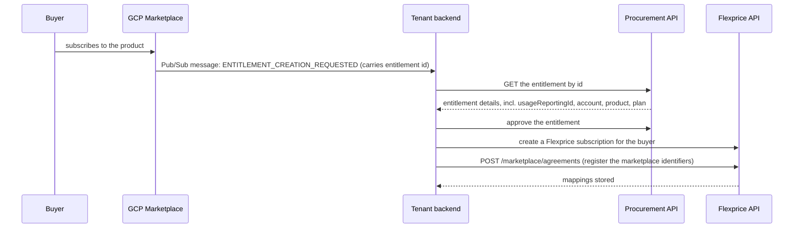
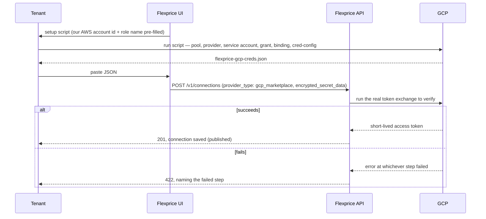
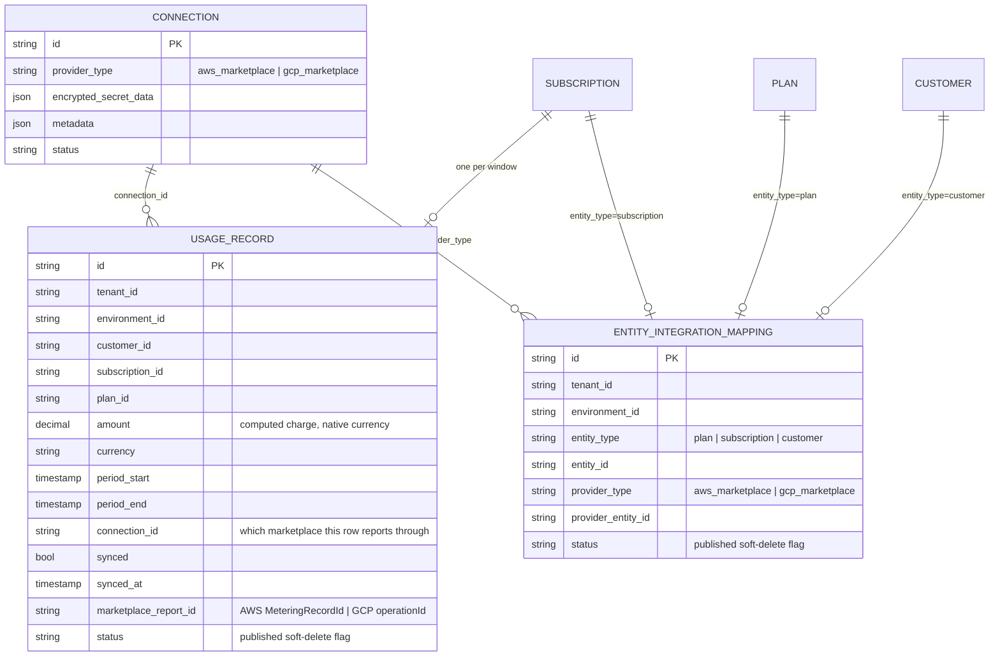
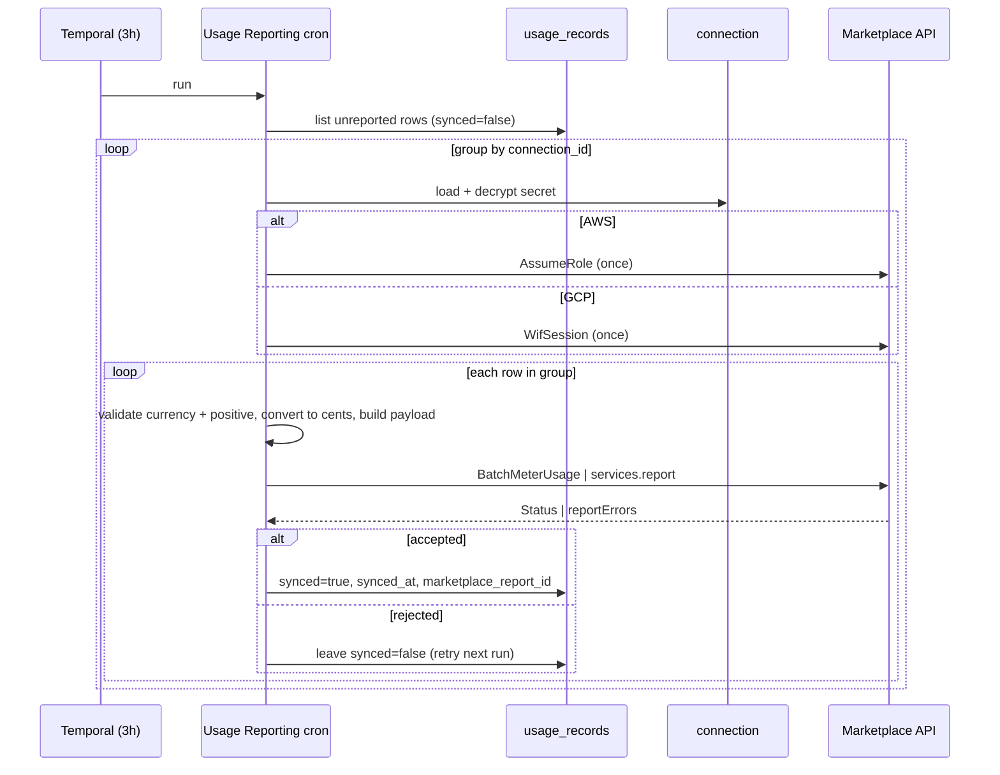

# Marketplace Integration — AWS + GCP

Author: Tsage  
Status: design, pending approval  
Scope: AWS Marketplace (already shipped) + GCP Marketplace (this proposal).

---

## 1. What we are building, in plain terms

A cloud marketplace (AWS Marketplace, GCP Marketplace) is a storefront where a software vendor can
list their product, and where cloud customers can subscribe to it and pay for it through their
existing cloud bill. The marketplace handles the buyer relationship end to end: it shows the listing,
signs the buyer up, invoices them, collects the money, and pays the vendor.

Our tenants are those vendors. They sell usage-based products, and Flexprice is already their metering
and billing engine. What they need from us for a marketplace listing is narrow but essential: for each
of their marketplace buyers, periodically tell the marketplace **how much that buyer owes**, so the
marketplace can put it on the buyer's cloud bill.

That is the entire job. We do not set prices on the marketplace, we do not produce invoices there, we
do not handle payment. We compute a dollar amount — the same way we'd compute an invoice line for that
subscription — and hand that one number to the marketplace's metering API, tagged with which buyer it
belongs to. The marketplace does the rest.

We already do this for AWS Marketplace. This document extends the identical pipeline to GCP
Marketplace. The two are conceptually the same; they differ only in the specific API calls, the names
of the identifiers, and how we authenticate. Wherever GCP behaves like AWS, this document says so
rather than re-explaining it.

### Actors:


| Who                         | What they do                                                                                                                            |
| --------------------------- | --------------------------------------------------------------------------------------------------------------------------------------- |
| **Marketplace** (AWS / GCP) | Hosts the listing, signs the buyer up, invoices and charges the buyer, pays the tenant. The source of truth for who has bought what.    |
| **Tenant**                  | Our customer — the software vendor selling on the marketplace. Owns their own AWS account / GCP project and their own integration code. |
| **Buyer**                   | The tenant's end customer, who subscribed through the marketplace. Corresponds one-to-one to a Flexprice customer under that tenant.    |
| **Flexprice**               | Computes each buyer's usage charge and reports it to the marketplace on a schedule. That's us.                                          |


### The end-to-end lifecycle, at a glance

1. **The tenant lists their product** on the marketplace and connects their marketplace account to
  Flexprice (Section 5). One-time setup.
2. **A buyer subscribes** on the marketplace. The marketplace notifies the tenant, the tenant sets the
  buyer up, and registers them with Flexprice (Section 3).
3. **The buyer uses the product.** Flexprice ingests that usage the same way it always does.
4. **On a schedule, Flexprice reports the charge** to the marketplace (Section 7). The marketplace
  bills the buyer.
5. **The buyer eventually cancels.** The tenant tells Flexprice, and we stop reporting (Section 8).

The rest of this document works through each of these, starting with the part that everything else
exists to serve: the actual usage-report API call.

---


## 2. The core of it: what a usage report looks like

Everything in this integration builds toward one API call per marketplace — the usage report. This
section covers that call for both clouds before anything about storage or scheduling.

Both marketplaces need the same three things in a usage report:

- **Which product** the usage is for (the tenant may sell several).
- **Which buyer** the usage is for (so the marketplace bills the right customer).
- **How much** — a single number.

They just name these things differently and package them into different API calls.

### 2.1 The "how much" is always USD cents

We use one uniform pricing convention across both marketplaces, and it's worth stating up front
because it explains a lot of later choices.

On the marketplace side, the tenant defines a single billable unit — a "metric" — priced at **$0.01
per unit**, named `usage_fee`. Flexprice then computes the actual dollar amount the buyer owes for the
window (the same computation that produces an invoice line), converts it to cents, and reports **that
number of cents as the quantity**. The marketplace multiplies quantity × $0.01 and arrives at the
correct dollar charge.

Example: a buyer owes $12.50 for the hour. We report a quantity of `1250`. The marketplace computes
1250 × $0.01 = $12.50 and bills them that.

Why cents instead of reporting raw usage units (e.g. "1,000 API calls")? Because it keeps all pricing logic inside Flexprice. The tenant doesn't have to mirror their price book into the marketplace — the marketplace only ever sees a dollar figure we already computed.

Two consequences to keep in mind, referenced later:

- The marketplaces only accept **whole numbers**, so we report integer cents (there is no fractional
cent).
- The marketplaces only accept **positive** quantities. If a billing correction ever nets a window to
zero or negative, that report has to be skipped — there is no way to reduce a previous charge
through these APIs.

The "which product" and "which buyer" identifiers in the two calls below don't appear out of nowhere —
Flexprice stores them per buyer as three mappings, written when the buyer is registered (Section 3) and
detailed in full in Section 4. In gist:


| Flexprice entity | AWS identifier            | GCP identifier                            |
| ---------------- | ------------------------- | ----------------------------------------- |
| plan             | `product_code`            | `service_name`                            |
| subscription     | `license_arn`             | `usageReportingId` (sent as `consumerId`) |
| customer         | `customer_aws_account_id` | `account_id`                              |


### 2.2 AWS: the `BatchMeterUsage` call

This is the call we already make in production today. It goes to the AWS Marketplace Metering API.

```jsonc
// Request
{
  "ProductCode": "4qwerty789",
  "UsageRecords": [{
    "CustomerAWSAccountId": "222222222222",
    "LicenseArn": "arn:aws:license-manager:us-east-1:222...:license:l-abc",
    "Dimension": "usage_fee",
    "Quantity": 1250,
    "Timestamp": 1752300000
  }]
}
```

Field by field:


| Field                  | Required?                                                              | What it is                                                                                                           |
| ---------------------- | ---------------------------------------------------------------------- | -------------------------------------------------------------------------------------------------------------------- |
| `ProductCode`          | Required, but omitted for "Concurrent Agreements" products (see below) | Identifies **which product**. AWS assigns this when the tenant creates the listing.                                  |
| `CustomerAWSAccountId` | Required                                                               | The buyer's AWS account number. Part of identifying **which buyer**.                                                 |
| `LicenseArn`           | Required                                                               | Identifies the buyer's specific purchase (their "agreement") of this product. The other half of **which buyer**.     |
| `Dimension`            | Required                                                               | **Which metric** — always `usage_fee` in our model.                                                                  |
| `Quantity`             | Required                                                               | **How much**, as integer USD cents. AWS caps this at a 32-bit integer.                                               |
| `Timestamp`            | Required                                                               | When the usage occurred. We set it to the end of the reporting window. It doubles as an idempotency key — see below. |


"Concurrent Agreements" is an AWS product setting. For those products, the `LicenseArn` alone
identifies the product and AWS rejects the call if `ProductCode` is also sent, so we omit it. The
tenant tells us at registration whether their product is set up this way.

**The** `Timestamp` **is also how AWS de-duplicates.** If we send the exact same record twice — same
customer, dimension, timestamp, quantity — AWS treats it as one. Because our reporting window is
computed deterministically (Section 6), a retry produces a byte-identical record, so retries are safe
and never double-bill.

```jsonc
// Response
{
  "Results": [{
    "MeteringRecordId": "abc-123",
    "Status": "Success",
    "UsageRecord": { "...": "..." }
  }],
  "UnprocessedRecords": []
}
```

The response is where it gets subtle: **a record appearing in** `Results` **does not mean it was
accepted.** You have to read its `Status`:


| `Status`                | Meaning                                                                         | What we do                                                   |
| ----------------------- | ------------------------------------------------------------------------------- | ------------------------------------------------------------ |
| `Success`               | Accepted and billed.                                                            | Mark it reported, store the `MeteringRecordId`.              |
| `CustomerNotSubscribed` | The buyer has no active agreement (cancelled or suspended).                     | Leave it to retry — it self-heals if the buyer resubscribes. |
| `DuplicateRecord`       | AWS already has a *different* record for the same customer/dimension/timestamp. | Leave it; needs a human to look, since a retry won't fix it. |


Records that couldn't be processed at all come back in `UnprocessedRecords` (not `Results`), and we
retry them next run.

AWS also enforces a time limit: it won't accept a usage record more than 24 hours after the event,
with a 6-hour grace at the end of each billing cycle. Past that, it returns
`TimestampOutOfBoundsException`.

### 2.3 GCP: the `services.report` call

GCP's equivalent goes to the **Service Control API**, and the method is `services.report`. It is the
direct counterpart of `BatchMeterUsage` — same purpose, different shape.

```jsonc
// POST https://servicecontrol.googleapis.com/v1/services/my-product.gcpmarketplace.example.com:report
{
  "operations": [{
    "operationId": "8f2c...unique-per-report",
    "operationName": "flexprice/usage_report",
    "consumerId": "USAGE_REPORTING_ID",
    "startTime": "2026-07-16T14:00:00Z",
    "endTime":   "2026-07-16T15:00:00Z",
    "metricValueSets": [{
      "metricName": "my-product.gcpmarketplace.example.com/usage_fee",
      "metricValues": [{ "int64Value": "1250" }]
    }]
  }]
}
```

Field by field:


| Field                                     | Required?                                           | What it is                                                                                                                                                                                                                                                  |
| ----------------------------------------- | --------------------------------------------------- | ----------------------------------------------------------------------------------------------------------------------------------------------------------------------------------------------------------------------------------------------------------- |
| `service_name` (in the URL, not the body) | Required                                            | Identifies **which product**. It's a domain-like string GCP assigns to the listing, e.g. `my-product.gcpmarketplace.example.com`. This is GCP's equivalent of AWS's `ProductCode`.                                                                          |
| `consumerId`                              | Required                                            | Identifies **which buyer** — holds the entitlement's `usageReportingId` (see below). GCP's equivalent of AWS's `LicenseArn`.                                                                                                                                |
| `metricName`                              | Required                                            | **Which metric**: `{service_name}/usage_fee`. GCP's equivalent of AWS's `Dimension`.                                                                                                                                                                        |
| `int64Value` (inside `metricValueSets`)   | Required                                            | **How much**, as a string-encoded integer of USD cents. GCP's equivalent of AWS's `Quantity`. Billing only accepts `int64Value`; the other value types the API technically allows (`doubleValue`, `moneyValue`, etc.) are not accepted for billing metrics. |
| `operationId`                             | Required                                            | A unique ID for this specific report. It is the idempotency key — GCP de-duplicates on it. Equivalent to how AWS uses `Timestamp`. We set it to the usage record's own database ID, which is stable across retries.                                         |
| `operationName`                           | Optional                                            | A free-form label for logs/tracing. We send `flexprice/usage_report`.                                                                                                                                                                                       |
| `startTime` / `endTime`                   | `startTime` required, `endTime` required for report | The window the usage covers.                                                                                                                                                                                                                                |


`consumerId` is the Service Control API's generic field for "who is consuming this service" — for an
ordinary GCP API it would be a project ID. GCP Marketplace repurposes it to identify the buyer: each
entitlement (Section 3.2) carries an opaque `usageReportingId`, and GCP's contract is to send that
value in `consumerId`. So `consumerId` is the field, `usageReportingId` is the value that goes in it —
the same role `LicenseArn` plays on AWS.

```jsonc
// Response — SUCCESS (HTTP 200)
{ "reportErrors": [], "serviceConfigId": "2026-07-16r0", "serviceRolloutId": "..." }

// Response — REJECTED (still HTTP 200, but reportErrors is non-empty)
{ "reportErrors": [{
    "operationId": "8f2c...unique-per-report",
    "status": { "code": 5, "message": "Consumer '...' not found or not active." }
}] }
```

The critical gotcha, mirroring AWS's "present ≠ accepted": **an HTTP 200 from GCP does not mean the
report was accepted.** GCP returns 200 even when it rejects the record. The real outcome is in
`reportErrors`: an empty list means success; a non-empty list means rejected, with a numeric error
code and message. Common codes: `5` = NOT_FOUND (the consumer/entitlement isn't active), `7` =
PERMISSION_DENIED, `3` = INVALID_ARGUMENT.

Unlike AWS, GCP returns no per-record receipt on success — there is no `MeteringRecordId` equivalent
(the `serviceConfigId`/`serviceRolloutId` in the response are service-level, not per-report). This
matters for what we store; see Section 5.

### 2.4 The two calls, side by side

The whole integration reduces to filling in the same three slots two different ways:


| The three things     | AWS field                             | GCP field                                             |
| -------------------- | ------------------------------------- | ----------------------------------------------------- |
| Which product        | `ProductCode` (body)                  | `service_name` (URL)                                  |
| Which buyer          | `LicenseArn` + `CustomerAWSAccountId` | `consumerId` (= the entitlement's `usageReportingId`) |
| Which metric         | `Dimension` (`usage_fee`)             | `metricName` (`{service_name}/usage_fee`)             |
| How much (USD cents) | `Quantity` (int32)                    | `int64Value` (int64)                                  |
| Idempotency key      | `Timestamp`                           | `operationId`                                         |


Everything else in this document is about how Flexprice comes to know each buyer's product, buyer ID,
and dollar amount — and how it's allowed to make these calls in the first place.

---


## 3. Where the identifiers come from: onboarding a buyer

The report calls above need `ProductCode`/`service_name`, the buyer identifiers, and the metric name.
None of those originate in Flexprice — they come from the marketplace when a buyer subscribes, flow
through the tenant, and get registered with us. This section traces that.

### 3.1 AWS side (for reference — already built)

When a buyer subscribes on AWS Marketplace, AWS redirects them to a URL the tenant hosts, carrying a
short-lived registration token. The tenant's backend calls AWS's `ResolveCustomer` with that token and
gets back the `LicenseArn`, the buyer's AWS account ID, and the `ProductCode`. The tenant then creates
a Flexprice subscription for the buyer and registers the mapping with us (Section 3.3).

### 3.2 GCP side: Pub/Sub and the Procurement API

GCP has no browser redirect. Instead, two GCP services are involved, and it's worth being explicit
about what each one is, since the rest of the doc refers to them:

- **Pub/Sub** is GCP's message queue. When something happens to a buyer's subscription — created,
plan changed, cancelled — GCP publishes a message to a Pub/Sub topic that the *tenant* owns.
Flexprice never receives these; they always go to the tenant.
- **The Procurement API** (full name: Cloud Commerce Partner Procurement API) is GCP's API for
managing marketplace purchases. Through it, the tenant approves or rejects a buyer's subscription
and reads the details of the resulting **entitlement**.

An **entitlement** is GCP's record of one buyer's purchase of one product — the equivalent of AWS's
"agreement." It carries the fields the tenant needs, including the `usageReportingId` that will later
become our `consumerId`.

The flow when a buyer subscribes:




The entitlement the tenant reads back looks like this (the fields we care about are `usageReportingId`
and `account`):

```jsonc
{
  "name": "providers/PARTNER/entitlements/abc123",
  "account": "providers/PARTNER/accounts/buyer-456",
  "product": "my-product",
  "plan": "pro",
  "usageReportingId": "USAGE_REPORTING_ID",   // becomes our consumerId
  "state": "ENTITLEMENT_ACTIVE"
}
```

Note that **all of the Procurement API interaction is the tenant's job, not Flexprice's.** Flexprice
never calls the Procurement API — not here, not later in the crons. The tenant already has everything
we need from it by the time they call us, so they just pass it to us directly. This matters for the
permission model in Section 4 (we don't request Procurement access) and for the lifecycle handling in
Section 7 (**we rely on the tenant, not on polling GCP**).

### 3.3 Registering with Flexprice: `POST /v1/marketplace/agreements`

Whichever marketplace, the tenant finishes onboarding by calling one Flexprice endpoint that records
the marketplace identifiers against the Flexprice subscription. One endpoint serves both marketplaces;
the request carries a `provider` field and exactly one provider-specific block, so AWS-only and
GCP-only fields never mix.

```go
type MarketplaceProvider string
const (
    ProviderAWS MarketplaceProvider = "aws_marketplace"
    ProviderGCP MarketplaceProvider = "gcp_marketplace"
)

type CreateAgreementRequest struct {
    ConnectionID   string              `json:"connection_id"   validate:"required"` // which marketplace connection (Section 4)
    SubscriptionID string              `json:"subscription_id" validate:"required"` // the Flexprice subscription
    CustomerID     string              `json:"customer_id"     validate:"required"`
    PlanID         string              `json:"plan_id"         validate:"required"`
    Provider       MarketplaceProvider `json:"provider"        validate:"required,oneof=aws_marketplace gcp_marketplace"`
    AWS *AWSAgreement `json:"aws,omitempty"` // required iff Provider == aws_marketplace
    GCP *GCPAgreement `json:"gcp,omitempty"` // required iff Provider == gcp_marketplace
}

type AWSAgreement struct {
    ProductCode          string `json:"product_code"            validate:"required"` // -> report's ProductCode
    LicenseArn           string `json:"license_arn"             validate:"required"` // -> report's LicenseArn
    CustomerAWSAccountID string `json:"customer_aws_account_id" validate:"required"` // -> report's CustomerAWSAccountId
    Dimension            string `json:"dimension"               validate:"required"` // -> report's Dimension (usage_fee)
    ConcurrentAgreements bool   `json:"concurrent_agreements"`                        // if true, omit ProductCode when reporting
}

type GCPAgreement struct {
    ServiceName      string `json:"service_name"       validate:"required"` // -> report URL's service_name
    UsageReportingID string `json:"usage_reporting_id" validate:"required"` // -> report's consumerId
    MetricName       string `json:"metric_name"        validate:"required"` // -> report's metricName
    AccountID        string `json:"account_id"         validate:"required"` // stored as the customer mapping
}
```

Validation enforces the discriminator (`Provider == aws` means `AWS` is set and `GCP` is not, and vice
versa), each block checks its own required fields, and we cross-check that the referenced connection's
provider matches — so a GCP agreement can't be registered against an AWS connection.

Example bodies:

```jsonc
// AWS
{
  "connection_id": "conn_aws_01", "subscription_id": "subs_01",
  "customer_id": "cust_01", "plan_id": "plan_01",
  "provider": "aws_marketplace",
  "aws": {
    "product_code": "4qwerty789",
    "license_arn": "arn:aws:license-manager:us-east-1:222...:license:l-abc",
    "customer_aws_account_id": "222222222222",
    "dimension": "usage_fee",
    "concurrent_agreements": true
  }
}

// GCP
{
  "connection_id": "conn_gcp_01", "subscription_id": "subs_01",
  "customer_id": "cust_01", "plan_id": "plan_01",
  "provider": "gcp_marketplace",
  "gcp": {
    "service_name": "my-product.gcpmarketplace.example.com",
    "usage_reporting_id": "USAGE_REPORTING_ID",
    "account_id": "providers/PARTNER/accounts/buyer-456",
    "metric_name": "my-product.gcpmarketplace.example.com/usage_fee"
  }
}
```

This call writes three rows into `entity_integration_mapping` — one for the plan, one for the
subscription, one for the customer. That table is where every marketplace identifier lives at
Flexprice, so it gets its own section next.

---


## 4. Entity mapping: how a marketplace buyer is represented at Flexprice

Every marketplace buyer is represented at Flexprice by three rows in `entity_integration_mapping`,
written by the registration call above (Section 3.3). Each row ties one Flexprice entity to the
matching identifier on the marketplace side:


| Flexprice entity | provider_entity_id — AWS  | provider_entity_id — GCP | metadata                                                       |
| ---------------- | ------------------------- | ------------------------ | -------------------------------------------------------------- |
| plan             | `product_code`            | `service_name`           | AWS: `dimension`, `concurrent_agreements`. GCP: `metric_name`. |
| subscription     | `license_arn`             | `usageReportingId`       | —                                                              |
| customer         | `customer_aws_account_id` | `account_id`             | —                                                              |


The table is generic — other integrations use it too. Each row carries `entity_type` (plan /
subscription / customer), `entity_id` (the Flexprice id), `provider_type` (`aws_marketplace` /
`gcp_marketplace`), `provider_entity_id` (the marketplace's identifier), an optional `metadata` JSON,
and a `status` (the standard published/archived soft-delete flag).

These three rows are exactly what the usage report (Section 2) reads back at report time: the plan
mapping supplies the product and metric, the subscription mapping supplies the buyer identifier (GCP's
`consumerId` / AWS's `LicenseArn`), and — for AWS only — the customer mapping supplies the AWS account
number.

Three deliberate choices about the GCP mappings:

- **The customer mapping (**`account_id`**) is stored even though the GCP report call never reads it.** For
GCP, `consumerId` comes entirely from the subscription mapping's `usageReportingId`; the customer
mapping is kept for parity with AWS and as a hook for the `ACCOUNT_DELETED` lifecycle event.
- **We do not store the entitlement's** `name` **or its** `state`**.** Nothing reads them, because Flexprice
never calls the Procurement API. Entitlement lifecycle is handled entirely by the tenant archiving
the mapping (Section 8), not by us polling GCP.
- **Lifecycle runs through** `status`**, not a dedicated field.** Every query filters on
`status = published`. When a buyer cancels, the tenant archives the mapping, and it stops appearing
in both crons — no separate lifecycle machinery.

---


## 5. Connecting a tenant's marketplace (authentication)

Before any of the above can happen, the tenant has to give Flexprice permission to call the
marketplace API on their behalf. This is the part of the integration that's genuinely hard to get
right and quiet when it's wrong, so it gets the most detail.

The problem: Flexprice runs on AWS. To call a marketplace API it needs valid credentials for that
marketplace, but we don't want to hold a long-lived secret that could leak.

### 5.1 AWS (already built)

The tenant creates an IAM role in their own AWS account whose trust policy names Flexprice's AWS
account plus an `ExternalId` (a shared value that guards against a "confused deputy" — us being tricked
into acting for the wrong tenant). The tenant pastes the role's ARN into Flexprice. At report time,
Flexprice calls AWS STS `AssumeRole` with that ARN and external ID, gets short-lived credentials, and
calls `BatchMeterUsage`. One hop.

`POST /v1/connections` verifies it synchronously: we call `AssumeRole` on the spot, and only save the
connection if it succeeds; otherwise we return AWS's error.

### 5.2 GCP: Workload Identity Federation

GCP APIs only accept GCP credentials, and Flexprice has none. Handing us a GCP service-account key
(the long-lived secret) is exactly what **we want to avoid**. GCP's mechanism for this is **Workload
Identity Federation (WIF)**: it lets a workload that already has *some* cloud identity — our AWS IAM
role — exchange that identity for a short-lived GCP token, with no GCP key stored anywhere.

Three GCP concepts make this work, and the tenant creates all three in their own project:

- A **service account** — the GCP identity Flexprice will act as. Every GCP API call runs as some
service account; there is no anonymous mode. This is the GCP analogue of the AWS role we assume.
- A **workload identity pool** — a container that declares "I accept identities from an external
system." It grants nothing on its own.
- A **workload identity provider** inside that pool — the actual trust rule: "trust AWS, but only
Flexprice's specific account and role." This is the GCP analogue of the AWS trust policy's
`ExternalId` guard.

At runtime, Flexprice presents its AWS credentials to Google's token endpoint, Google checks them
against the provider rule, issues a short-lived federated token, and that token is used to impersonate
the service account. So instead of AWS's one hop, GCP is: AWS credentials → GCP federated token →
service-account token. Google's client library does all three steps internally; we just hand it the
config file from step 6 below.

### 5.3 The setup script, command by command

Flexprice's UI generates this script with our own AWS account ID and role name already filled in, so
the tenant runs it as-is in GCP Cloud Shell and pastes back the file it produces. It starts with the
values the tenant supplies:

```bash
GCP_PROJECT_ID="tenant-project"
GCP_PROJECT_NUMBER="123456789"
SA_ID="flexprice-metering-sa"
FLEXPRICE_AWS_ACCOUNT_ID="111122223333"                # Flexprice fills this in
FLEXPRICE_AWS_ROLE_NAME="flexprice-gcp-metering-role"  # Flexprice fills this in
```

**Step 1 — create the workload identity pool.**

```bash
gcloud iam workload-identity-pools create "flexprice-pool" \
  --location="global" --project="$GCP_PROJECT_ID"
```

The pool is just a namespace; it grants nothing, and exists only so the provider in step 2 has
somewhere to attach.

**Step 2 — create the provider inside the pool, and pin exactly who to trust.**

```bash
gcloud iam workload-identity-pools providers create-aws "flexprice-provider" \
  --location="global" --workload-identity-pool="flexprice-pool" \
  --account-id="$FLEXPRICE_AWS_ACCOUNT_ID" \
  --attribute-mapping="google.subject=assertion.arn,attribute.account=assertion.account,attribute.aws_role=assertion.arn.extract('assumed-role/{role}/')" \
  --attribute-condition="attribute.aws_role == '$FLEXPRICE_AWS_ROLE_NAME'" \
  --project="$GCP_PROJECT_ID"
```

This is the real trust decision. `--account-id` restricts trust to Flexprice's AWS account, not any
AWS account in the world. `--attribute-condition` narrows it further, to the one specific IAM role our
metering job runs as — without it, *any* role in Flexprice's account could act as this tenant's
service account. This is the same protection AWS's `ExternalId` provides.

The `--attribute-mapping` is what makes that condition writable, and it's also what step 5 depends on.
GCP can't natively read an AWS credential, so this maps the AWS caller's identity into readable
attributes: `google.subject` (the caller ARN, for audit logs), `attribute.account` (the AWS account
number), and `attribute.aws_role` (the role name, parsed out so the condition can compare it). The
`attribute.account` mapping is the one people forget — step 5 grants access to a principal built from
`attribute.account`, and if it isn't mapped here, that principal never resolves to anything. The
binding in step 5 will look correct, `gcloud` will accept it without complaint, and it will silently
match nothing at runtime. This is the single most common way to break a WIF setup.

**Step 3 — create the service account.**

```bash
gcloud iam service-accounts create "$SA_ID" --project="$GCP_PROJECT_ID"
```

This is the identity Flexprice becomes. Required no matter how the rest is wired, because GCP has no
way to call an API except as a service account.

**Step 4 — grant that service account exactly one permission: report usage.**

```bash
gcloud projects add-iam-policy-binding "$GCP_PROJECT_ID" \
  --role="roles/servicemanagement.serviceController" \
  --member="serviceAccount:$SA_ID@$GCP_PROJECT_ID.iam.gserviceaccount.com"
```

`servicemanagement.serviceController` is what permits `services.report`. We deliberately do **not**
also grant `consumerprocurement.entitlementViewer` (Procurement API read access): Flexprice never
calls the Procurement API (Section 3.2), so that grant would only widen what our workload can see, for
no benefit. If a future reconciliation feature ever needs it, add it then, scoped to that feature.

**Step 5 — the trust binding: let the AWS identity from step 2 impersonate the service account.**

```bash
gcloud iam service-accounts add-iam-policy-binding \
  "$SA_ID@$GCP_PROJECT_ID.iam.gserviceaccount.com" \
  --role="roles/iam.workloadIdentityUser" \
  --member="principalSet://iam.googleapis.com/projects/$GCP_PROJECT_NUMBER/locations/global/workloadIdentityPools/flexprice-pool/attribute.account/$FLEXPRICE_AWS_ACCOUNT_ID" \
  --project="$GCP_PROJECT_ID"
```

This is where Flexprice actually becomes a principal in the tenant's project — there's no separate
registration beyond this binding. Its `--member` reads directly from step 2's `attribute.account`
mapping, which is why those two steps have to be verified together.

**Step 6 — generate the credentials config the tenant pastes into Flexprice.**

```bash
gcloud iam workload-identity-pools create-cred-config \
  "projects/$GCP_PROJECT_NUMBER/locations/global/workloadIdentityPools/flexprice-pool/providers/flexprice-provider" \
  --service-account="$SA_ID@$GCP_PROJECT_ID.iam.gserviceaccount.com" \
  --aws --output-file="flexprice-gcp-creds.json"
```

The output contains no private key. It's a small config document telling Google's client library where
to find Flexprice's own AWS credentials at runtime, which GCP endpoint to trade them at, and which
service account to impersonate.

### 5.4 What Flexprice does with the file

We store the JSON encrypted, whole, under the connection's secret data — the same
`encrypted_secret_data.<provider>` shape AWS uses, just holding a different kind of value:

```jsonc
// AWS connection
{
  "provider_type": "aws_marketplace",
  "encrypted_secret_data": { "aws_marketplace": { "role_arn": "arn:aws:iam::222...:role/fp", "external_id": "acme-t_01k" } },
  "metadata": { "aws_marketplace": { "region": "us-east-1" } },
  "status": "published"
}

// GCP connection — the whole WIF JSON is the secret. Nothing product-specific lives here;
// one connection covers a whole GCP project, which may have many products.
{
  "provider_type": "gcp_marketplace",
  "encrypted_secret_data": { "gcp_marketplace": { "type": "external_account", "audience": "...", "credential_source": { "...": "..." }, "service_account_impersonation_url": "..." } },
  "metadata": {},
  "status": "published"
}
```

Verification is synchronous on `POST /v1/connections`, same as AWS: we load the JSON and run the real
token exchange — fetch our AWS credentials, trade them at Google's STS endpoint, impersonate the
service account — and only save the connection if the whole chain works. If any step fails, we return
which step failed, so the tenant knows whether the problem is the pool, the provider, the binding, or
the service account, instead of one opaque error.




Because the service account's permission is granted at the project level (step 4), one token works for
every product under that GCP project. That's why a connection maps to a whole project, and the
per-product `service_name` lives on the plan mapping instead of the connection.

---


## 6. What Flexprice stores

Three tables, all of which already exist for AWS. GCP adds new `provider_type` values, not new tables.




The three `entity_integration_mapping` rows (plan / subscription / customer) are written at
registration and are detailed in Section 3.3; the connection secret shapes are in Section 4.4. The
rest of this section covers `usage_records`, the table the two crons operate on.

### `usage_records` — one row per subscription per window

This is the table the two crons operate on: the snapshot cron writes rows, the reporting cron reports
them. It already exists for AWS; GCP needs one schema change.

The shipped version had a `syncs` JSONB map and an `all_providers_synced` flag, designed for a
subscription that might report to more than one marketplace at once. That can't happen — a subscription
is sold through exactly one marketplace, so metering it to two would double-bill the buyer. We replace
that machinery with flat fields:


| Change | Field                          | Reason                                                                                                                                                                                                 |
| ------ | ------------------------------ | ------------------------------------------------------------------------------------------------------------------------------------------------------------------------------------------------------ |
| drop   | `syncs` (JSONB map)            | one subscription = one marketplace; no fan-out                                                                                                                                                         |
| drop   | `all_providers_synced` (bool)  | replaced by the flat `synced`                                                                                                                                                                          |
| add    | `connection_id`                | set by the snapshot cron; tells the reporting cron which connection (and therefore which marketplace) this row reports through                                                                         |
| add    | `synced` (bool, default false) | the one retry signal — `false` means "still needs reporting"                                                                                                                                           |
| add    | `synced_at` (timestamp)        | when the report succeeded                                                                                                                                                                              |
| add    | `marketplace_report_id`        | AWS's `MeteringRecordId`. For GCP, the `operationId` we sent — which equals the row's own `id`, since GCP returns no receipt of its own (Section 6.2). Stored so the field is populated for every row. |


`provider_type` isn't stored on the row — the reporting cron loads the connection anyway (to decrypt
its secret) and gets the provider from there.

Index change: **drop** the existing `usagerecord_tenant_id_environment_id_all_providers_synced` index
(its column is going away) and **add** one on `(tenant_id, environment_id, synced)` for the reporting
cron's query. The unique constraint on `(subscription_id, period_start, period_end)` stays — it's what
gives the snapshot cron its idempotency.

---


## 7. Reporting on a schedule: the two crons

Reporting is split into two scheduled Temporal workflows, matching what ships for AWS:

- The **Usage Snapshot cron** (`MarketplaceUsageSnapshotWorkflow`), every 6 hours, computes each
buyer's charge and writes a `usage_records` row. It does not talk to any marketplace.
- The **Usage Reporting cron** (`MarketplaceUsageReportWorkflow`), every 3 hours, takes unreported
rows and sends them to the marketplace.

Splitting them keeps the expensive billing computation separate from the marketplace API calls, so a
marketplace outage doesn't block computing charges, and a slow computation doesn't hold up reporting
what's already computed.

### 7.1 The Usage Snapshot cron

For every active marketplace subscription, it computes the charge for a fixed time window and writes
one row. It is the only place that decides whether a subscription should be billed at all: it only
writes a row for a subscription whose mapping is `published` (i.e. the entitlement is still active).
Once a row exists, it is a committed fact — the reporting cron will send it, and nothing reconsiders
that decision later.

**The window.** It's anchored to the run's scheduled time, not when it actually executes:
`period_start = scheduledTime − 10h`, `period_end = scheduledTime − 4h`. So it's a 6-hour window that
ends 4 hours in the past — the lag gives event ingestion time to settle before we treat a window as
final. Because the window comes from the schedule rather than wall-clock time, a re-run computes the
exact same window, and therefore the same AWS `Timestamp` / GCP `operationId`, so a resend de-dupes
cleanly.

```text
for each PUBLISHED marketplace connection (aws_marketplace and gcp_marketplace):
    subs = subscriptions whose mapping.provider_type == connection.provider_type
                         AND mapping.status == published
    for each sub:
        if a usage_record already exists for (sub, period_start, period_end):   # idempotency
            skip
        usage  = GetMeterUsageBySubscription(sub, window)
        amount = CalculateMeterUsageCharges(sub, usage, window)   # same calc as a real invoice, native currency
        insert usage_record {
            connection_id = connection.id,
            subscription_id, customer_id, plan_id,
            amount, currency = usage.currency,
            period_start, period_end,
            synced = false
        }
```

We scope the subscription list to the connection's own provider (not "any marketplace subscription"):
a tenant with both an AWS and a GCP connection would otherwise snapshot a GCP subscription while
iterating the AWS connection and stamp it with the wrong `connection_id`. Since a subscription belongs
to one marketplace, per-connection scoping partitions cleanly.

The amount is stored in the subscription's **native currency** here; conversion to USD cents happens
in the reporting cron, because it's marketplace-specific (both marketplaces require USD).

### 7.2 The Usage Reporting cron

Takes everything not yet reported, groups it by connection, authenticates once per connection, and
sends each row to the right marketplace.

```text
records = ListUnreported(synced == false, status == published)
for each connection_id group:
    conn   = load connection(connection_id)
    secret = decrypt(conn.encrypted_secret_data)
    mappings = load plan/subscription/customer mappings for this tenant + provider (published only)

    switch conn.provider_type:
      aws_marketplace:
        creds = AssumeRole(secret.role_arn, secret.external_id, 1h)   # once per connection
        for rec in group: reportToAWS(rec, mappings, creds)
      gcp_marketplace:
        session = WifSession(secret.gcp_marketplace)                  # once per connection
        for rec in group: reportToGCP(rec, mappings, session)
```

This cron never re-decides billability — that was settled by the snapshot cron. Every unreported row
is a committed fact that must be sent. Its only per-row skips are on the row's own data:

```text
if rec.currency != "usd":
    log.debug("skip, non-usd"); continue     # marketplaces bill in USD; retried once conversion is supported

if rec.amount <= 0:
    log.info("skip, non-positive"); continue  # marketplaces reject non-positive; a refund window can net <= 0

cents = ToSmallestUnit(rec.amount, "usd")     # decimal dollars -> integer cents
```

Building the AWS report (this is the shipped logic): read `license_arn` and the AWS account from the
subscription/customer mappings, read `product_code`/`dimension` from the plan mapping, drop
`product_code` if the product is Concurrent Agreements, guard against the int32 overflow, then call
`BatchMeterUsage` with `Quantity = cents` and `Timestamp = period_end`.

Building the GCP report: read `service_name`/`metric_name` from the plan mapping and `usageReportingId`
from the subscription mapping, then call `services.report` with `consumerId = usageReportingId`,
`int64Value = cents`, and `operationId = rec.id` (stable across retries, so GCP de-dupes).

**Handling the response** — exactly the semantics from Section 2:

```text
# AWS: a present Result is not "accepted"; check Status
Success               -> synced=true, synced_at=now, store MeteringRecordId
CustomerNotSubscribed -> leave unreported, log.error (self-heals if buyer resubscribes)
DuplicateRecord       -> leave unreported, log.error (needs manual investigation)
unprocessed / other   -> leave unreported, retry next run, log.error

# GCP: HTTP 200 is not "accepted"; check reportErrors
reportErrors empty     -> synced=true, synced_at=now, store operationId (= rec.id)
reportErrors non-empty -> leave unreported, log.error(code + message)
```

For AWS we store the returned `MeteringRecordId` as the row's `marketplace_report_id`. GCP returns no
receipt of its own, so we store the `operationId` we sent — which equals the row's own `id`. It's
redundant with `id`, but it keeps `marketplace_report_id` populated on every row regardless of
provider.

`synced = false` is the only retry mechanism — a row that isn't accepted just gets picked up next run.
Failures are logged, not stored as a separate state; there's no dead-letter table (a known gap,
Section 10).

**Logging rules for both crons.** Log at entry and exit of each stage — connection load, decrypt, auth,
mapping resolve, payload build, marketplace call, result write — at `error` / `debug` / `info` only (no
`warn`). Never log a secret or buyer identifier: no `role_arn`, `external_id`, `customer_aws_account_id`,
`account_id`, WIF JSON, or `usageReportingId`. Do log the safe correlators: `connection_id`,
`subscription_id`, `usage_record_id`, the period bounds, the amount in cents, and the marketplace's
status/error code. (The AWS `AssumeRole` path already redacts the raw SDK error, since its text can
contain the role ARN.)




### 7.3 Client interfaces

```go
// awsmarketplace.Client — shipped
AssumeRole(ctx, roleArn, externalID string, duration time.Duration) (aws.Credentials, error)
BatchMeterUsage(ctx, creds, region string, record AWSUsageReportInput) (*BatchMeterUsageResult, error)

type AWSUsageReportInput struct {
    CustomerAWSAccountID, LicenseArn, ProductCode, Dimension string
    Quantity  int32       // USD cents
    Timestamp time.Time   // = period_end; dedup key
}
type BatchMeterUsageResult struct {
    MeteringRecordID, Status string // Success | CustomerNotSubscribed | DuplicateRecord
}

// gcpmarketplace.Client — new, mirrors the AWS client
WifSession(ctx, wifCredentialsJSON string) (Session, error)
Report(ctx, session Session, in GCPUsageReportInput) (*ReportResult, error)

type GCPUsageReportInput struct {
    ServiceName, ConsumerID, MetricName string
    ValueCents  int64      // client wraps this into metricValueSets[0].metricValues[0].int64Value
    OperationID string     // = usage_record.id; dedup key
    StartTime, EndTime time.Time
}
type ReportResult struct {
    Accepted     bool      // true iff reportErrors is empty
    ErrorCode    int64
    ErrorMessage string
}
```

`WifSession` turns the WIF JSON into a reusable authenticated session the way `AssumeRole` turns a role
ARN into reusable credentials — Google's library runs the full three-hop exchange internally. `Report`
sends one record and reports `Accepted` only when `reportErrors` comes back empty, regardless of HTTP
status.

---


## 8. Subscription lifecycle and the tenant contract

Flexprice has no feed of marketplace lifecycle events. Every GCP Pub/Sub message and AWS notification
goes to the tenant, never to us. So the whole lifecycle mechanism rests on one contract with the
tenant: **when a buyer's subscription ends for any reason, the tenant cancels the corresponding
subscription at Flexprice, and that cancellation archives the mapping.** Until they do, the mapping
stays `published` and Flexprice keeps reporting — potentially billing an entitlement that's already
gone.

The GCP lifecycle events (all delivered to the tenant, all handled by the tenant):


| GCP Pub/Sub event                                                   | Tenant does                                      | Effect on Flexprice                                                    |
| ------------------------------------------------------------------- | ------------------------------------------------ | ---------------------------------------------------------------------- |
| `ENTITLEMENT_CREATION_REQUESTED`                                    | approve, create subscription, register agreement | 3 mapping rows written                                                 |
| `ENTITLEMENT_PLAN_CHANGE_REQUESTED`                                 | approve the change, update the subscription      | plan mapping updated                                                   |
| `ENTITLEMENT_PENDING_CANCELLATION`                                  | notify the buyer; still active until it closes   | none — mapping stays published, reporting continues                    |
| `ENTITLEMENT_CANCELLED` / `ENTITLEMENT_DELETED` / `ACCOUNT_DELETED` | cancel the subscription at Flexprice             | mapping archived → drops out of the published filter → both crons stop |


The tenant also owns the *timing* of cancellation. They should archive only after their own grace
window has passed and after the snapshot cron's 4–10h lag has had a chance to capture the final
active-period usage. Archiving too early loses that last window, because it would never get
snapshotted. There's no Flexprice-side timer, Pub/Sub listener, or Procurement poll — the tenant's
cancellation is the entire signal.

---


## 9. Design decisions and open questions

**Decided — no** `services.check` **before** `services.report`**.** GCP's docs describe a two-step flow:
call `services.check` (a validation preflight) first, and only report if it comes back clean. We call
`services.report` directly. The reasoning: a usage record only exists because the snapshot cron already
decided the subscription was billable, so a preflight here would just re-litigate that decision, and
`services.report`'s own `reportErrors` already catches an inactive consumer. If testing shows GCP
actually requires the preceding `check` call, we'd add it back as a pure preflight, never as a second
billability gate.

**Open — does GCP/AWS reject a late report by submission time, or by usage timestamp?** Our snapshot window runs 4–10 hours behind real time by design. If GCP enforces a hard cutoff based on how long after the entitlement ended we submit, the last window before a subscription closes could be rejected outright. If instead it only checks that the report's `startTime`/`endTime` fall inside the period the
entitlement was active, submitting late is fine. The tenant contract (Section 8) mitigates this in
practice, but it's worth confirming GCP's actual rule before launch — it determines whether marketplace
subscriptions need a shorter buffer than everything else.

---


## 10. Known gaps

- **Stale-record retries.** A row the marketplace will never accept — e.g. the buyer's entitlement
closed before it could be reported — currently retries forever, because nothing marks a row as
permanently unsendable. Worth adding a terminal state once a row's `period_end` is past the
marketplace's acceptance window.
- **One record per API call.** Both APIs support batching (AWS up to 25 records per call, GCP up to a
1MB payload with no count limit), but v1 sends one record per call for both, matching how AWS ships
today. Grouping a connection's records per window would cut round-trips; deferred.
- **No dead-letter table.** Failures are logged, not persisted as a distinct state. Accepted for v1.

---


## 11. Reference

- `services.report` method reference: [https://docs.cloud.google.com/service-infrastructure/docs/service-control/reference/rest/v1/services/report](https://docs.cloud.google.com/service-infrastructure/docs/service-control/reference/rest/v1/services/report)
- `Operation` object schema (the object inside `operations[]`): [https://docs.cloud.google.com/service-infrastructure/docs/service-control/reference/rest/v1/Operation](https://docs.cloud.google.com/service-infrastructure/docs/service-control/reference/rest/v1/Operation)
- Configuring usage reports (GCP Marketplace side, `usageReportingId` → `consumerId`): [https://docs.cloud.google.com/marketplace/docs/partners/integrated-saas/configure-usage-reports](https://docs.cloud.google.com/marketplace/docs/partners/integrated-saas/configure-usage-reports)
- Reporting billing metrics (DELTA + INT64 constraint): [https://docs.cloud.google.com/service-infrastructure/docs/reporting-billing-metrics](https://docs.cloud.google.com/service-infrastructure/docs/reporting-billing-metrics)
- Entitlement resource schema (Procurement API): [https://docs.cloud.google.com/marketplace/docs/partners/commerce-procurement-api/reference/rest/v1/providers.entitlements](https://docs.cloud.google.com/marketplace/docs/partners/commerce-procurement-api/reference/rest/v1/providers.entitlements)
- Managing customer entitlements (Pub/Sub formats, approve/reject): [https://docs.cloud.google.com/marketplace/docs/partners/integrated-saas/manage-entitlements](https://docs.cloud.google.com/marketplace/docs/partners/integrated-saas/manage-entitlements)
- AWS side, for parity: `marketplace-aws-batchUsageReport.md`

