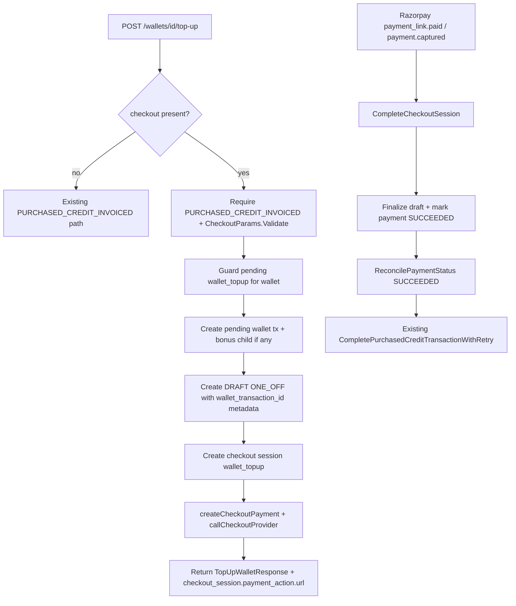
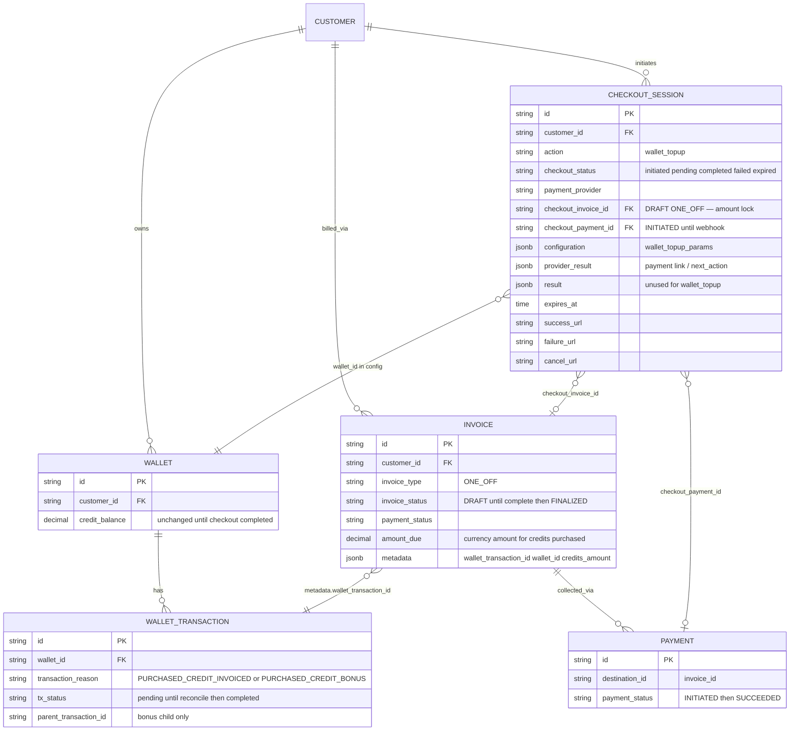

# Payment-Gated Wallet Top-Up — Design ERD

Status: **Implemented (backend)** — pay-first wallet top-up live; swagger regen optional follow-up  
Date: 2026-07-20  
Related: [Payment-gated quantity change](2026-07-17-payment-gated-quantity-change.md), [Bonus credit top-up](2026-07-09-FLE-904-bonus-credit-topup.md), checkout create-subscription in `internal/ee/service/checkout_session.go`

---

## 1. Problem Statement

`POST /wallets/{id}/top-up` with `transaction_reason: PURCHASED_CREDIT_INVOICED` today creates a wallet transaction and a ONE_OFF invoice, then either:

- **Pay-later (default):** leaves the purchase **pending** until the invoice is paid; `ReconcilePaymentStatus(SUCCEEDED)` credits the wallet via `metadata.wallet_transaction_id`, or
- **Auto-complete:** when tenant setting `AutoCompletePurchasedCreditTransaction` is true, credits the wallet **immediately** and marks the invoice paid — payment collection is deferred / assumed elsewhere.

For B2B2C (and any flow that needs hosted checkout before credits land), the merchant must **collect payment first** and only then apply credits — the same gate as `create_subscription` and pay-first `quantity_change`.

**Goal:** opt-in pay-first path on wallet top-up when the client sends a `checkout` object with `PURCHASED_CREDIT_INVOICED`; zero behavior change when `checkout` is omitted; reuse checkout sessions as the short-lived payment vehicle (no new pending-operations table, no parallel credit-apply path).

---


## 2. Approach


### 2.1 API surface (backward compatible)

- `POST /wallets/{id}/top-up` — default pay-later / auto-complete when `checkout` is omitted (unchanged).
- Opt-in: optional `checkout` object (`CheckoutParams`) on the top-up request. Presence means “collect payment before crediting the wallet.”
- Checkout is **allowlisted** to `transaction_reason = PURCHASED_CREDIT_INVOICED` only. Any other reason + `checkout` → validation error.
- `POST /checkout/sessions` **rejects** `action: wallet_topup` — sessions are created only via top-up.

```json
{
  "credits_to_add": "1000",
  "transaction_reason": "PURCHASED_CREDIT_INVOICED",
  "idempotency_key": "optional-wallet-tx-key",
  "checkout": {
    "payment_provider": "razorpay",
    "success_url": "https://app.example.com/ok",
    "failure_url": "https://app.example.com/fail",
    "cancel_url": "https://app.example.com/cancel",
    "idempotency_key": "optional-checkout-session-key",
    "payment_provider_config": {},
    "metadata": {}
  }
}
```

Reusable DTO (`internal/api/dto/checkout_session.go`):


| Struct              | Fields                                        |
| ------------------- | --------------------------------------------- |
| `PaymentParams`     | `payment_provider`, `payment_provider_config` |
| `RedirectionParams` | `success_url`, `failure_url`, `cancel_url`    |
| `CheckoutParams`    | embeds both + `idempotency_key`, `metadata`   |


`TopUpWalletRequest.Checkout` is `*CheckoutParams`. Not taken from a full create-session request: `customer_external_id` (from wallet → customer), `action` (implied `wallet_topup`), `configuration.create_subscription_params`.

**Idempotency:**

- Wallet transaction keeps existing top-up idempotency key generation (`idempotency_key` on the top-up body, or auto-generated).
- Checkout session prefers `checkout.idempotency_key` (same pattern as modify / create-subscription).

**Branching:**


| Condition                                   | Behavior                                                                                              |
| ------------------------------------------- | ----------------------------------------------------------------------------------------------------- |
| No `checkout` + `PURCHASED_CREDIT_INVOICED` | Existing pay-later / auto-complete path (`handlePurchasedCreditInvoicedTransaction`)                  |
| `checkout` + `PURCHASED_CREDIT_INVOICED`    | Pay-first: force pending wallet tx, DRAFT invoice, checkout session + payment link; balance unchanged |
| `checkout` + any other `transaction_reason` | Validation error; no session / no balance change                                                      |
| No `checkout` + other reasons               | Existing direct / free / etc. paths unchanged                                                         |


### 2.2 Why force pending (ignore auto-complete)

When `AutoCompletePurchasedCreditTransaction` is true, today’s invoiced path credits the wallet **before** payment is collected. That contradicts pay-first.

Pay-first **always** forces:

- Purchase (and bonus child, if any) → `pending`
- Wallet credit balance **unchanged** until payment succeeds

Do not read the auto-complete setting for this branch (or override it to false). The invoice must not be created as already-paid.

### 2.3 Why DRAFT until complete

Modify / create-subscription checkout leave the checkout invoice as **DRAFT** at execute, then finalize inside `completeCheckoutAction` after the provider confirms payment. That keeps:

- Orphan cleanup simple (`cleanupCheckoutSession` / archive draft)
- Finalize + `ReconcilePaymentStatus(SUCCEEDED)` as the single “money settled” moment

Pay-first top-up follows the same pattern. Do **not** call `CreateOneOffInvoice` on the pay-first path if that helper finalizes; use draft create + compute (or equivalent) so status stays `DRAFT` until complete.

Today’s pay-later path may create a finalized/pending invoice via `CreateOneOffInvoice` — that path is unchanged when `checkout` is omitted.

### 2.4 Credit apply (reuse existing hook — do not invent a parallel path)

Invoice metadata already carries:


| Key                                         | Purpose                                    |
| ------------------------------------------- | ------------------------------------------ |
| `wallet_transaction_id`                     | Purchase tx to complete on payment success |
| `wallet_id`                                 | Wallet that receives credits               |
| `credits_amount`                            | Credits purchased (string)                 |
| `auto_completed`                            | `"false"` on pay-first                     |
| (+ optional request metadata / description) | Pass-through                               |


On `ReconcilePaymentStatus(SUCCEEDED)`, `[invoice.go](../../internal/ee/service/invoice.go)` already calls `CompletePurchasedCreditTransactionWithRetry`, which completes the purchase and any pending bonus child (`parent_transaction_id`). Complete for `wallet_topup` only needs to finalize the draft, mark the checkout payment succeeded, and reconcile — **no new credit logic**.

### 2.5 Lifecycle

```text
POST /wallets/{id}/top-up (checkout present, PURCHASED_CREDIT_INVOICED)
  → Validate CheckoutParams + reason allowlist
  → Concurrent guard (one pending/initiated wallet_topup per wallet)
  → Create pending purchase tx (+ pending bonus child if any)
  → Create DRAFT ONE_OFF with wallet_transaction_id metadata
  → CheckoutSession (action = wallet_topup → pending)
       configuration.wallet_topup_params = { wallet_id, wallet_transaction_id? }
       checkout_invoice_id set before session Create
  → On session Create failure → archive draft (orphan cleanup)
  → createCheckoutPayment + callCheckoutProvider
  → On fulfill failure → cleanupCheckoutSession
  → Return TopUpWalletResponse:
       wallet_transaction = pending purchase
       invoice_id = draft
       wallet = unchanged balance
       checkout_session (includes payment_action.url)

Razorpay webhook (payment_link.paid / payment.captured)
  → CompleteCheckoutSession
  → completeCheckoutAction (wallet_topup):
       finalize draft if still DRAFT
       mark checkout payment SUCCEEDED (+ gateway id)
       ReconcilePaymentStatus(SUCCEEDED)
         → existing metadata hook → CompletePurchasedCreditTransactionWithRetry
         → purchase (+ bonus) completed; balance updated
  → session completed

fail / expire / cancel
  → cleanupCheckoutSession (archive invoice/payment via session columns)
  → wallet txs remain pending (or are handled by existing void/cleanup ops — no new path required for v1)
```




### 2.6 Concurrent guard

Before pay-first session create: reject if any `initiated` / `pending` checkout session already exists for the **same wallet** (`action = wallet_topup`, match `configuration.wallet_topup_params.wallet_id`).

List by customer + action (same pattern as modify), then filter by wallet id in config. No new DB unique index in v1.

### 2.7 Orphan draft on session create failure

If `CheckoutSessionRepo.Create` fails after the DRAFT invoice exists, archive/delete the draft immediately (same pattern as `settlePayFirst` in subscription quantity change). Do not leave an unpaid draft without a session.

### 2.8 Client UX

Redirect / new tab to `checkout_session.payment_action.url` → return on success/cancel URL → poll `GET /v1/checkout/sessions/{id}`. Closing a local polling UI does not cancel the session. After `completed`, refetch wallet / transaction for credited balance.

---


## 3. ERD




**No new tables.** Persistence delta:


| Piece                                      | Change                     |
| ------------------------------------------ | -------------------------- |
| `checkout_sessions.action`                 | New value: `wallet_topup`  |
| `checkout_sessions.configuration`          | `wallet_topup_params` (§4) |
| `checkout_sessions.result`                 | **Unused** for this action |
| Wallets / wallet txs / invoices / payments | Existing only              |


---


## 4. Configuration JSON (v1)

Parallel to `CreateSubscriptionParams` / `ModifySubscriptionParams` in `internal/types/checkout_configuration.go`.

### 4.1 `configuration.wallet_topup_params`

```json
{
  "wallet_id": "wallet_...",
  "wallet_transaction_id": "wtx_..."
}
```


| Field                   | Meaning                                                                                                                |
| ----------------------- | ---------------------------------------------------------------------------------------------------------------------- |
| `wallet_id`             | From top-up path; concurrent guard + optional revalidation on complete                                                 |
| `wallet_transaction_id` | Purchase tx id after create (debugging / optional revalidation); money + credit apply still driven by invoice metadata |


**Why not store the full top-up request?** Credits, currency, and bonus are already locked on the pending wallet txs + DRAFT invoice. Complete does not re-run top-up; it finalizes and reconciles so the existing invoice metadata hook credits the wallet.

---


## 5. Top-up response (pay-first)

`TopUpWalletResponse` gains optional `checkout_session` (`CheckoutSessionResponse`).

```json
{
  "wallet_transaction": {
    "id": "wtx_...",
    "wallet_id": "wallet_...",
    "credits": "1000",
    "transaction_status": "pending",
    "transaction_reason": "PURCHASED_CREDIT_INVOICED"
  },
  "invoice_id": "inv_...",
  "wallet": {
    "id": "wallet_...",
    "credit_balance": "0"
  },
  "checkout_session": {
    "id": "cs_...",
    "checkout_status": "pending",
    "payment_action": {
      "type": "payment_link",
      "url": "https://rzp.io/..."
    }
  }
}
```

- Payment URL lives on `checkout_session.payment_action` (not a top-level sibling).
- Poll: `GET /v1/checkout/sessions/{checkout_session.id}`.
- Wallet balance in the response is **pre-credit** (unchanged).

---


## 6. Status mapping


| Phase                  | Checkout             | Invoice            | Checkout payment | Wallet txs                     | Wallet balance |
| ---------------------- | -------------------- | ------------------ | ---------------- | ------------------------------ | -------------- |
| After pay-first top-up | `pending`            | `DRAFT`            | `INITIATED`      | Purchase (+ bonus) `pending`   | Unchanged      |
| After webhook success  | `completed`          | `FINALIZED` + paid | `SUCCEEDED`      | Purchase (+ bonus) `completed` | Credited       |
| Fail / expire / cancel | `failed` / `expired` | Archived           | Archived         | Remain `pending`               | Unchanged      |


---


## 7. Scenarios


| #   | Scenario                                     | Handling                                                          |
| --- | -------------------------------------------- | ----------------------------------------------------------------- |
| 1   | Top-up without `checkout`                    | Existing pay-later / auto-complete                                |
| 2   | `checkout` + `PURCHASED_CREDIT_INVOICED`     | Session + DRAFT; pending txs; balance unchanged                   |
| 3   | `checkout` + other reason                    | Validation error                                                  |
| 4   | Second pay-first while session pending       | Rejected (concurrent guard)                                       |
| 5   | Payment succeeds                             | Finalize + reconcile → existing complete credits wallet (+ bonus) |
| 6   | Link cancel / expire / cron                  | Cleanup; balance unchanged; txs stay pending                      |
| 7   | Auto-complete setting true + checkout        | Still force pending (ignore setting)                              |
| 8   | Bonus slab / explicit `bonus_credits_to_add` | Bonus child created pending with purchase; completed on reconcile |
| 9   | Session Create fails after draft             | Archive draft; return error                                       |
| 10  | Client closes poll UI mid-pay                | Session continues; return URL / GET session / refetch wallet      |


---


## 8. Evolvability notes

This reuses the same recipe as quantity-change pay-first:

1. Opt-in `CheckoutParams` on an existing write API
2. Lock money on a DRAFT invoice; persist minimal config intent
3. Defer the “effect” (here: wallet credit) until webhook complete
4. Complete = finalize same invoice + reconcile (existing hook applies effect)
5. Concurrent guard per resource (wallet)

**v1 scope:** `wallet_topup` + `WalletTopupParams` for `PURCHASED_CREDIT_INVOICED` only. Direct / free top-ups stay immediate and out of checkout.

NOTES:

- If in setting tenant has chosen autoCompleteTopupInvoices but has sent checkout object, we still force them to pay if the reason is purchaseCreditsInvoiced.

