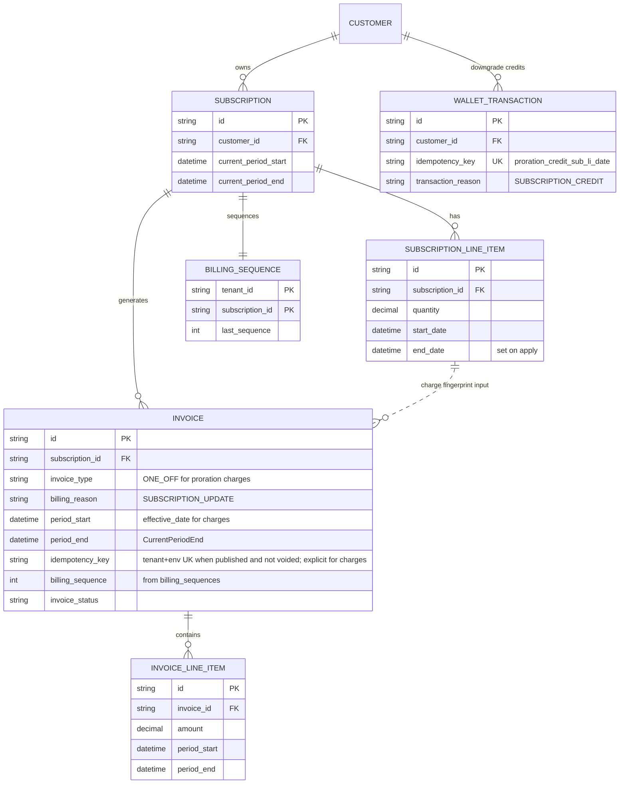
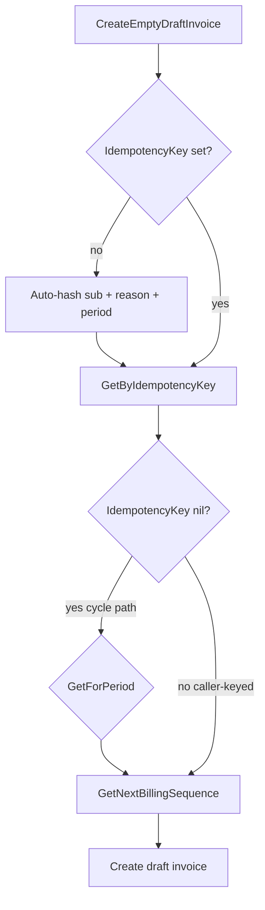

# Proration Charge Invoice Idempotency — Design ERD

Status: **Implemented** — mid-cycle quantity-change / line-item proration charges use operation-scoped keys  
Date: 2026-07-22  
Related: [Payment-Gated Quantity Change](./2026-07-17-payment-gated-quantity-change.md), `CreateEmptyDraftInvoice` in `internal/ee/service/invoice.go`

---

## 1. Problem Statement

Mid-cycle proration **charge** invoices set `SubscriptionID`, `BillingReason = SUBSCRIPTION_UPDATE`, and `PeriodStart = effective_date`, but historically omitted `IdempotencyKey`.

They therefore inherited **period-invoice** uniqueness:

1. Auto key = hash(`sub` + `billing_reason` + period)
2. `GetForPeriod(sub, period_start, period_end, billing_reason)`

So upgrading **distinct** line items at the **same** `effective_date` collided after the first invoice was finalized/paid (`invoice already exists`), even though each change is a separate ONE_OFF charge.

Wallet **credits** for the same flow already used an explicit key (`proration_credit_{sub}_{lineItem}_{effectiveDate}`) and were fine.

**Goal:** operation-scoped uniqueness for proration charges (mirror credits), without changing cycle / opening invoice period uniqueness.

---

## 2. Approach

### 2.1 Explicit charge keys (caller owns uniqueness)

| Path                               | Key |
| ---------------------------------- | --- |
| Pay-later per-item charge          | `idempotency.Generator` with `ScopeProrationCharge` |
| Pay-first aggregated DRAFT         | same scope; `line_item_changes` covers **all** `(lineItemID, effectiveDate)` pairs |

Key shape: `proration_charge-{16hex}` from `GenerateKey` (SHA-256, first 8 bytes). Params: `subscription_id`, `line_item_changes` (sorted `"liID|RFC3339"` lines joined by `\n`).

Helper: `prorationChargeIdempotencyKey` in `subscription_modification_quantity.go` (wraps the generator).  
DTO already copies `IdempotencyKey` via `CreateInvoiceRequest.ToDraftRequest()`.

Out of scope: add/delete line-item proration via `line_item_proration.settleCharge` (not on the modification execute path).

### 2.2 Skip period uniqueness when a key is supplied

In `CreateEmptyDraftInvoice`:

- `GetForPeriod` runs **only** when `req.IdempotencyKey == nil` (cycle / opening / auto-keyed path).
- `GetNextBillingSequence` still runs for every subscription-scoped create (counter only — not a uniqueness gate).

### 2.3 What did **not** change

- Auto-key formula for subscription invoices when no caller key is passed
- Wallet credit key shape
- Add/delete line-item proration charge path (`line_item_proration.settleCharge`)
- Schema / unique indexes (period uniqueness remains app-enforced; real unique index is on `(tenant, environment, idempotency_key)` for published non-voided invoices)

---

## 3. ERD

**No new tables.** Behavior delta only:

| Piece                      | Change                                                    |
| -------------------------- | --------------------------------------------------------- |
| `invoices.idempotency_key` | Set by modification / LI-proration charge builders        |
| `CreateEmptyDraftInvoice`  | Skip `GetForPeriod` when caller supplies `IdempotencyKey` |
| `billing_sequences`        | Unchanged (still incremented)                             |

---

## 4. Uniqueness model

| Invoice kind                                     | Key source                        | `GetForPeriod` |
| ------------------------------------------------ | --------------------------------- | -------------- |
| `SUBSCRIPTION_CYCLE` / create / trial opening    | Auto                              | Yes            |
| Proration ONE_OFF charge (`SUBSCRIPTION_UPDATE`) | Explicit `proration_charge-…` (generator) | No             |
| Proration wallet credit                          | Explicit on `wallet_transactions` | N/A            |

---

## 5. Code map

| File                                                        | Role                                                                       |
| ----------------------------------------------------------- | -------------------------------------------------------------------------- |
| `internal/ee/service/invoice.go`                            | Gate `GetForPeriod` on nil caller key                                      |
| `internal/idempotency/generator.go`                         | `ScopeProrationCharge`                                                     |
| `internal/ee/service/subscription_modification_quantity.go` | `prorationChargeIdempotencyKey` via generator; set key on builders         |
| `internal/ee/service/subscription_modification_test.go`     | Distinct LIs, same `effective_date`                                        |

---

## 6. Multi-effective-date note

One `quantity_change` request may include multiple line items with **different** `effective_date`s.

- **Pay-later:** one charge invoice (or wallet credit) per item → per-item fingerprint.
- **Pay-first:** one aggregated DRAFT; invoice `period_start` is the earliest date, but the idempotency fingerprint hashes **all** `(liID, effectiveDate)` pairs so mixed-date batches do not collide.

