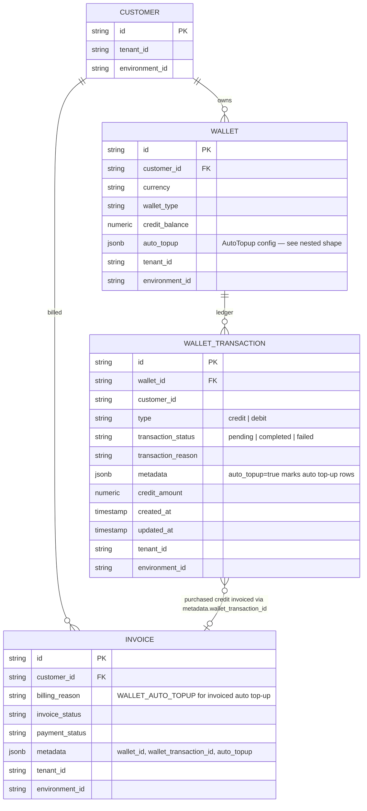
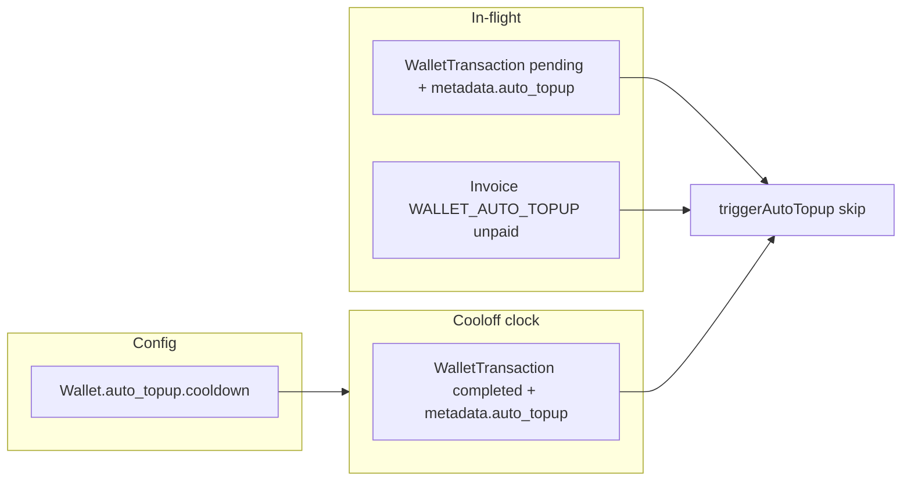
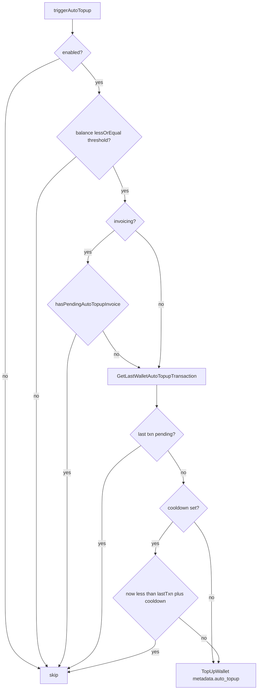

# Wallet Auto Top-up — In-flight Guard & Optional Cooloff

Status: **Implemented and QA’d via Postman (direct cooloff, direct burst, invoiced in-flight).**
Date: 2026-07-22
Postman: [`docs/postman/auto-topup-cooloff.postman_collection.json`](../postman/auto-topup-cooloff.postman_collection.json)

---

## 1. Problem Statement

Auto top-up already fires when wallet ongoing balance ≤ threshold (`triggerAutoTopup`). Gaps:

1. **Direct mode** nested re-eval could burst many completed credits in one evaluation chain until balance cleared the threshold.
2. **In-flight** protection for invoiced mode was customer-scoped invoice payment status only; there was no wallet-scoped pending-txn guard for both modes.
3. Product asked for an optional **cooloff** (minutes/days — now also seconds/hours) after a *successful* auto-topup before another may run. Evaluations during cooloff **skip** (no queue).

Manual credit/debit/top-up must never be gated by these rules.

---

## 2. Approach (as implemented)

### 2.1 Config

- Extend `wallets.auto_topup` JSONB with optional `cooldown: { value, unit }`.
- Generic `types.Duration` / `types.DurationUnit` (`SECOND` | `MINUTE` | `HOUR` | `DAY`) in [`internal/types/duration.go`](../../internal/types/duration.go). Optionality is `*Duration` at the call site.
- No new table / migration — JSONB field already exists.

### 2.2 Guards in `triggerAutoTopup`

| Mode | Guards (in order) |
|---|---|
| Invoiced | Existing `hasPendingAutoTopupInvoice` (customer + `WALLET_AUTO_TOPUP`) **and** latest auto-topup wallet txn pending |
| Direct | Latest auto-topup wallet txn pending |
| Both | Optional cooloff from the same latest auto-topup txn (`UpdatedAt`/`CreatedAt` + `cooldown`) when it is not pending |

Discriminator: `metadata.auto_topup = "true"` (`types.WalletMetadataKeyAutoTopup`). Manual purchased-credit txns lack this key.

### 2.3 Single ledger lookup

`WalletRepo.GetLastWalletAutoTopupTransaction(ctx, walletID)` returns the most recent published txn with `metadata.auto_topup=true` (`created_at` desc), or nil.

`triggerAutoTopup` uses that one row for both guards:
1. pending → skip (in-flight)
2. otherwise → cooloff check from its timestamp (when `cooldown` is set)

Cooloff/pending stay ledger-authoritative — no Redis TTL (pending invoices/txns have no natural expiry today).

### 2.4 Cooloff semantics

- Unset `cooldown` → previous behavior (direct can still burst).
- Set → strict one successful auto-topup per window; nested re-eval and later debits skip until window ends.
- No wake-up timer; next top-up needs a normal re-eval after cooloff (usage alert / debit / payment complete event).

---

## 3. ERD (as actually implemented)

No new entities. Cooloff config lives inside existing `Wallet.auto_topup` JSONB. In-flight/cooloff state is derived from `WalletTransaction` (+ existing auto-topup `Invoice` for invoiced mode).



### 3.1 `auto_topup` JSON shape (on `WALLET`)

```json
{
  "enabled": true,
  "threshold": "50",
  "amount": "10",
  "invoicing": false,
  "cooldown": {
    "value": 1,
    "unit": "MINUTE"
  }
}
```

| Field | Required | Notes |
|---|---|---|
| `enabled` | yes* | `*` when configuring AutoTopup |
| `threshold` | yes | Trigger when ongoing balance ≤ this |
| `amount` | yes | Credits/currency amount per auto-topup |
| `invoicing` | yes | `true` → pending txn + invoice; `false` → direct credit |
| `cooldown` | no | Omit = no cooloff. `unit`: `SECOND` \| `MINUTE` \| `HOUR` \| `DAY`. On **update**: omit/null = leave unchanged; `{ "value": 0, "unit": "<any>" }` = clear cooloff |

### 3.2 How rows relate for guards



---

## 4. Decision flow



---

## 5. Key code

| Piece | Location |
|---|---|
| `types.Duration` / `DurationUnit` | `internal/types/duration.go` |
| `AutoTopup.Cooldown`, `WalletMetadataKeyAutoTopup` | `internal/types/wallet.go` |
| Repo lookup | `WalletRepo.GetLastWalletAutoTopupTransaction` (`internal/domain/wallet`, ent + inmemory) |
| Guards | `internal/ee/service/wallet.go` (`triggerAutoTopup`, `isWithinAutoTopupCooldown`) |
| Legacy invoice guard (kept) | `hasPendingAutoTopupInvoice` |
| Unit tests | `internal/types/duration_test.go`, `internal/ee/service/wallet_test.go` (`WalletAutoTopupInvoiceSuite`, `WalletAutoTopupDirectSuite`) |

---

## 6. Out of scope / known limits

- No Redis cooloff/pending keys (ledger remains source of truth).
- No natural expiry for pending wallet txns or unpaid auto-topup invoices — a stuck pending row blocks further auto-topups until paid/voided/completed.
- Cooloff completed-txn lookup considers the latest 50 completed rows for the wallet; dense non-auto-topup traffic could theoretically miss an older auto-topup marker (acceptable for v1).
- No scheduled wake-up when cooloff ends.
