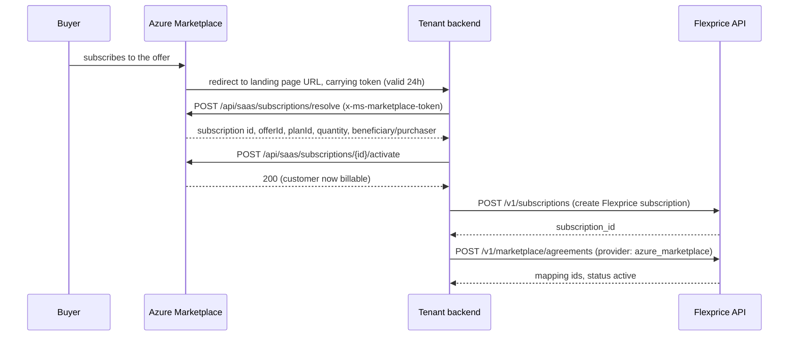
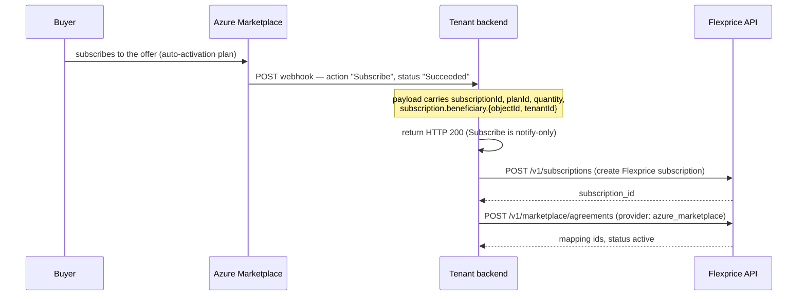
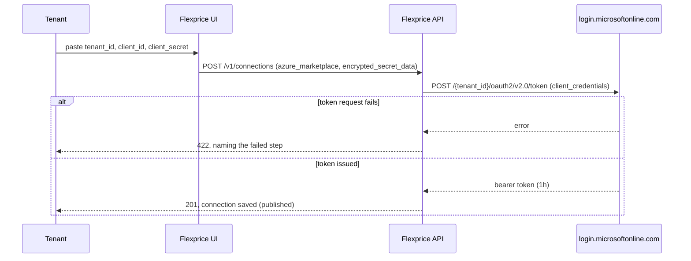
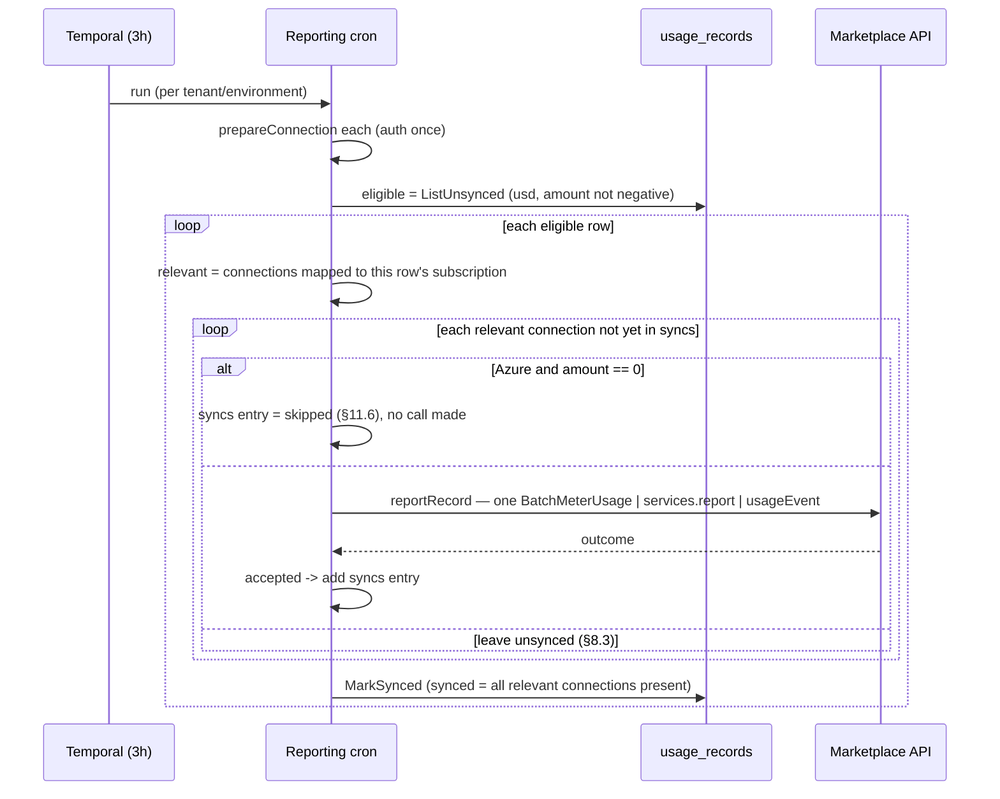

# Marketplace Integration — Azure

Author: Tsage
Status: design, pending approval
Scope: Azure Marketplace (new), as a third provider alongside the shipped AWS and GCP integrations.

This builds on the shipped state of
[2026-07-18-FLE-1070-marketplace-integration-v2.md](2026-07-18-FLE-1070-marketplace-integration-v2.md).
The starting point is v2 as it actually shipped — its Section 12 deviations: `usage_records` is
provider-agnostic with a `syncs` map, and there is no `connection_id` column.

---

## 1. What we are building

The job is the same one we already do for AWS and GCP: for each of a tenant's marketplace buyers,
periodically tell the marketplace how much that buyer owes for the window, computed the same way an
invoice line is. Azure is the third of three symmetrical integrations. It shares the actors, the
snapshot cron, the entity-mapping table, and the lifecycle contract (the tenant owns lifecycle;
Flexprice never listens for it). It differs only in the specific API calls, the authentication
mechanism, and — Azure-only — the offer and dimension the tenant sets up before anything can be
reported.

### Actors


| Who                                 | What they do                                                                                                            |
| ----------------------------------- | ----------------------------------------------------------------------------------------------------------------------- |
| **Marketplace** (AWS / GCP / Azure) | Hosts the listing, signs the buyer up, invoices and charges the buyer, pays the tenant.                                 |
| **Tenant**                          | Our customer — the ISV selling on the marketplace. Owns their marketplace account/offer and their own integration code. |
| **Buyer**                           | The tenant's end customer, subscribed through the marketplace. One-to-one with a Flexprice customer.                    |
| **Flexprice**                       | Computes each buyer's usage charge and reports it to the marketplace on a schedule.                                     |


---


## 2. The usage report, all three providers


### 2.1 The pricing convention

The tenant defines one billable dimension named `usage_fee`, priced at **$0.01 per unit**. Flexprice
computes the real dollar charge for the window, converts it to cents, and reports that integer as the
quantity. The marketplace multiplies quantity × $0.01 and bills the correct amount. This keeps all
pricing logic inside Flexprice — the tenant never mirrors their price book into the marketplace.

Azure supports this the same way AWS and GCP do: a dimension takes an arbitrary `Price per unit` with
no documented floor ([Metered billing for managed applications](https://learn.microsoft.com/en-us/partner-center/marketplace-offers/azure-app-metered-billing)),
so `$0.01` is a valid value. The base plan's own recurring price is set to **$0** — all revenue flows
through the metered dimension.

### 2.2 AWS: `BatchMeterUsage`

One record per call.

```jsonc
// Request
{
  "ProductCode": "4qwerty789",   // omitted for Concurrent Agreements products
  "UsageRecords": [
    { "CustomerAWSAccountId": "222222222222", "LicenseArn": "arn:aws:license-manager:...:l-abc",
      "Dimension": "usage_fee", "Quantity": 1250, "Timestamp": 1752300000 }
  ]
}
```

```jsonc
// Response
{
  "Results": [
    { "MeteringRecordId": "abc-123", "Status": "Success", "UsageRecord": {"...":"..."} }
  ],
  "UnprocessedRecords": []
}
```

The record carries its own `Status`: `Success | CustomerNotSubscribed | DuplicateRecord`. A present `Results` entry is not the same as accepted — `Status` must be checked
([awsmarketplace/client.go:34-48](../../internal/integration/awsmarketplace/client.go)). A record that
could not be processed at all comes back in `UnprocessedRecords` and is retried next run.

### 2.3 GCP: `services.report`

One record per call.

```jsonc
// Request
POST https://servicecontrol.googleapis.com/v1/services/{service_name}:report
{
  "operations": [
    { "operationId": "usage_rec_001", "operationName": "flexprice/usage_report",
      "consumerId": "USAGE_REPORTING_ID_A", "startTime": "...", "endTime": "...",
      "metricValueSets": [{ "metricName": "{service_name}/usage_fee", "metricValues": [{ "int64Value": "1250" }] }] }
  ]
}
```

```jsonc
// Response — HTTP 200, operation rejected
{
  "reportErrors": [
    { "operationId": "usage_rec_002", "status": { "code": 5, "message": "Consumer '...' not found or not active." } }
  ],
  "serviceConfigId": "2026-07-16r0", "serviceRolloutId": "..."
}
```

GCP is the only provider that does not return a per-record success receipt. Success is read as
**absence** from `reportErrors`. The schema defines three cases:

> "
>
> 1. The combination of a successful RPC status and an empty `report_errors` list indicates a complete
>
> success where all `Operations` in the request are processed successfully. 2. …a non-empty
> `report_errors` list indicates a partial success where some `Operations` in the request succeeded.
> Each `Operation` that failed processing has a corresponding item in this list. 3. A failed RPC status
> indicates a general non-deterministic failure. When this happens, it's impossible to know which of
> the 'Operations' in the request succeeded or failed."
> — `ReportResponse.reportErrors`, [Service Control API discovery document](https://servicecontrol.googleapis.com/$discovery/rest?version=v1)

Case 3 is the operational rule that matters here: if the RPC itself fails (network error, 5xx, timeout
— not a 200 with a populated `reportErrors`), the outcome of the call is unknown and the row is left
unsynced for the next run. This is safe because `operationId = usage_record.id`
([gcpmarketplace/client.go:35-36](../../internal/integration/gcpmarketplace/client.go)), so a retry
resends a byte-identical operation.

A failure is matched back to its row by `ReportError.operationId` ("The Operation.operation_id value
from the request"). `MetricValue` allows `int64Value | doubleValue | moneyValue | distributionValue | boolValue | stringValue`; only `int64Value` is used, matching the shipped client
([gcpmarketplace/client.go:41](../../internal/integration/gcpmarketplace/client.go)).

### 2.4 Azure: `usageEvent`

New.

```jsonc
// Request — POST https://marketplaceapi.microsoft.com/api/usageEvent?api-version=2018-08-31
{ "resourceId": "<saas-subscription-guid>", "quantity": 1250.0, "dimension": "usage_fee",
  "effectiveStartTime": "2026-07-23T14:00:00", "planId": "silver" }
```

```jsonc
// Response — HTTP 200
{
  "usageEventId": "<guid>", "status": "Accepted", "messageTime": "2026-07-23T14:00:05Z",
  "resourceId": "<saas-subscription-guid>", "quantity": 1250.0, "dimension": "usage_fee",
  "effectiveStartTime": "2026-07-23T14:00:00", "planId": "silver"
}
```

— [Metering service APIs](https://learn.microsoft.com/en-us/partner-center/marketplace-offers/marketplace-metering-service-apis).

Unlike AWS's `Results[]` and GCP's `reportErrors`, a 200 response here carries no separate status to
check: *"status: Accepted — this is the only value in case of single usage event."* Every rejection —
`Duplicate`, `Expired`, an invalid resource, a malformed request — comes back as a distinct non-2xx
status code with its own response shape, not as a 200 with a different `status` value. A `Duplicate`
specifically is HTTP 409, with the conflicting event's details nested under
`additionalInfo.acceptedMessage`. `usageEventId` is Azure's receipt, the equivalent of AWS's
`MeteringRecordId`.

Azure's dedup key is `(resourceId, dimension, calendar hour)` — one event per hour per resource per
dimension, and events can only be reported for the past 24 hours:

> "Only one usage event can be emitted for each hour of a calendar day per resource and dimension. …
> Usage events can only be emitted for the past 24 hours."
> — [Metering service APIs](https://learn.microsoft.com/en-us/partner-center/marketplace-offers/marketplace-metering-service-apis)

The 409 Conflict / `Duplicate` case is keyed on the resource: "A usage event has already been
successfully reported for the specified resource ID, effective usage date and hour."

**Quantity must be strictly greater than 0 — checked two ways, not one.** The `quantity` field's own
inline doc comment reads: *"how many units were consumed for the date and hour specified in
effectiveStartTime, must be greater than 0 or a double integer."* That phrasing is ambiguous on its
own — "double integer" isn't a defined value category, and every example on the page uses a whole
number formatted as a double (`5.0`, `39.0`), so the more plausible reading is "must be greater than 0,
[as] a double [or] integer [numeric type]" — describing the accepted *representation*, not opening a
loophole around the positivity requirement. This document does not rely on that ambiguous sentence
alone: the batch endpoint's error table settles it unambiguously — `InvalidQuantity`: *"The quantity
passed is lower or equal to 0."* That is a normative rejection rule, not a loosely worded comment.
Formatting a zero as a double changes nothing: `0.0` is still `0`, and `0 <= 0` triggers
`InvalidQuantity` regardless of representation. Both sources agree: Azure requires `quantity > 0`,
strictly, with no exception for how the zero is encoded.

### 2.5 The three, side by side


|                      | AWS                                                                      | GCP                                                      | Azure                                       |
| -------------------- | ------------------------------------------------------------------------ | -------------------------------------------------------- | ------------------------------------------- |
| Report call          | `BatchMeterUsage`                                                        | `services.report`                                        | `usageEvent`                                |
| Dedup key            | product + customer + dimension + `Timestamp` (byte-identical retry-safe) | `operationId` (caller-chosen)                            | `(resourceId, dimension, calendar hour)`    |
| Quantity type        | int32 cents                                                              | int64 cents                                              | double (cents as a whole number)            |
| Submission window    | 24h + 6h month-end grace                                                 | not documented; assumed similar                          | 24h, no stated grace                        |
| Per-call receipt     | `MeteringRecordId`                                                       | none — absence from `reportErrors` = success              | `usageEventId`                              |
| Rejection outcome    | `Status` in `Results[]`, or absent (`UnprocessedRecords`, retried)       | listed in `reportErrors`; success is its absence          | distinct non-2xx status code, not a 200     |
| Call-level ambiguity | none — an explicit outcome every time                                    | RPC-level failure = outcome unknown, retried              | none — an explicit outcome every time       |

---


## 3. Onboarding a buyer


### 3.1 AWS / GCP

Unchanged from v2 §3. AWS: buyer redirect + `ResolveCustomer`, done by the tenant; Flexprice never
calls it. GCP: Pub/Sub + Procurement API, also done by the tenant. In both, the tenant has every
identifier it needs by the time it registers the agreement with Flexprice.

### 3.2 Azure

Two paths. Auto-activation is recommended, since it avoids depending on the browser redirect.

**Path A — manual Resolve/Activate**
([SaaS fulfillment Subscription APIs v2](https://learn.microsoft.com/en-us/partner-center/marketplace-offers/pc-saas-fulfillment-subscription-api)):




**Path B — auto-activation (recommended)**
([SaaS fulfillment Subscription APIs v2](https://learn.microsoft.com/en-us/partner-center/marketplace-offers/pc-saas-fulfillment-subscription-api),
[Implementing a webhook](https://learn.microsoft.com/en-us/partner-center/marketplace-offers/pc-saas-fulfillment-webhook)):

> "For plans with auto activation enabled, the Resolve API isn't needed. Microsoft sends the
> subscription details directly to the publisher via the Subscribe webhook notification."




Both paths give the tenant the same fields, which is what flows into the agreement registration call:

```jsonc
// Resolve response / Subscribe webhook — the fields we use
{
  "id": "<guid>",         // -> resource_id (this is resourceId in the usage-report payload)
  "offerId": "offer1",    // informational; not part of the usage-report payload, not stored
  "planId": "silver",     // -> azure.plan_id
  "subscription": {
    "beneficiary": { "objectId": "<guid>", "tenantId": "<guid>", "emailId": "..." }, // tenantId -> beneficiary_account_id
    "saasSubscriptionStatus": "Subscribed"
  }
}
```

---


## 4. Registering with Flexprice: `POST /v1/marketplace/agreements`

One endpoint serves all providers ([dto/marketplace.go](../../internal/api/dto/marketplace.go)): a
`provider` discriminator and exactly one provider-specific block. Azure adds a third block.

```go
const (
    ProviderAWS   MarketplaceProvider = "aws_marketplace"
    ProviderGCP   MarketplaceProvider = "gcp_marketplace"
    ProviderAzure MarketplaceProvider = "azure_marketplace" // new
)

// AWSMarketplaceAgreement, GCPMarketplaceAgreement — unchanged
// (dto/marketplace.go:34-72). Their field names stay as-is; see §11.3.

// AzureMarketplaceAgreement — new
type AzureMarketplaceAgreement struct {
    PlanID               string `json:"plan_id"                validate:"required"` // Azure's planId (distinct from the request's top-level Flexprice plan_id)
    Dimension            string `json:"dimension"              validate:"required"` // the usage_fee dimension on the offer
    ResourceID           string `json:"resource_id"            validate:"required"` // Azure SaaS subscription id -> resourceId in the usage-report payload
    BeneficiaryAccountID string `json:"beneficiary_account_id" validate:"required"` // buyer's Entra tenant id, from subscription.beneficiary.tenantId
}
```

```jsonc
// Example body
{
  "provider": "azure_marketplace",
  "subscription_id": "subs_01KY75NK7SF1WAH4N5XF4TXMZQ",
  "customer_id": "cust_01KY75M8JJJYAXC2PTP7DC0SFE",
  "plan_id": "plan_01KY75N4JCY64266FES411GEK7",
  "azure": {
    "plan_id": "silver",
    "dimension": "usage_fee",
    "resource_id": "11111111-2222-3333-4444-555555555555",
    "beneficiary_account_id": "test-account-001"
  }
}
```

There is no `offer_id` field. `offerId` is not part of the usage-report payload (§2.4), so it is not
stored on either side.

---


## 5. Entity mapping

Same generic `entity_integration_mapping` table, no schema change. Azure is a third `provider_type`
value, the way GCP was added as a second one in v2.


| entity_type  | AWS `provider_entity_id`  | GCP `provider_entity_id` | Azure `provider_entity_id`                | metadata                                                                                           |
| ------------ | ------------------------- | ------------------------ | ----------------------------------------- | -------------------------------------------------------------------------------------------------- |
| plan         | `product_code`            | `service_name`           | `planId`                                  | AWS: `dimension`, `concurrent_agreements`. GCP: `metric_name`. Azure: `{"dimension": "usage_fee"}` |
| subscription | `license_arn`             | `usageReportingId`       | Azure SaaS subscription id (`resourceId`) | —                                                                                                  |
| customer     | `customer_aws_account_id` | `account_id`             | `beneficiary_account_id`                  | — (not read by the report call on any provider; kept for parity and audit)                         |


The plan maps to Azure's `planId`, not `offerId`, because `planId` is the only product/plan identifier
in the usage-report payload (§2.4, §3.2). One Azure offer can hold several plans ("Each Azure
Application offer can have … managed application plans … Billing dimensions are shared across all plans
for an offer",
[Metered billing for managed applications](https://learn.microsoft.com/en-us/partner-center/marketplace-offers/azure-app-metered-billing)),
so a tenant with a three-tier offer has three Flexprice plans, each with its own mapping row holding
its own `planId`. This is the same one-row-per-plan shape the table already uses.

---


## 6. Connecting a tenant's Azure marketplace (authentication)


### 6.1 AWS / GCP

Unchanged from v2 §5. AWS: tenant-created IAM role + `ExternalId`, which Flexprice assumes. GCP:
Workload Identity Federation, no stored key. Neither applies to Azure — there is no federation path for
a third-party AWS-hosted caller to exchange into an Entra token.

### 6.2 Azure: Entra app registration + client credentials

For SaaS offers this is the only supported authentication method:

> "Applicable offer types are transactable SaaS and Azure Applications with managed application plan
> type. … For SaaS offers, this is the only available option."
> — [Marketplace metering service authentication strategies](https://learn.microsoft.com/en-us/partner-center/marketplace-offers/marketplace-metering-service-authentication)

The Entra app is tied to the tenant's own offer:

> "You must generate tokens using the same Entra tenant ID and Entra application ID that you specified
> in the Partner Center Technical Configuration page of the offer."
> — [Register a SaaS application](https://learn.microsoft.com/en-us/partner-center/marketplace-offers/pc-saas-registration)

Azure requires storing a static `client_secret`. This is the one point where Azure differs from AWS
and GCP, which both avoid a stored secret; Microsoft offers no federation equivalent for SaaS metering
(§11.4).

Everything in the setup below is done by the tenant. Flexprice creates no Azure application, registers
nothing with Microsoft, and never touches Partner Center — the same division of labor as AWS (tenant
creates the IAM role; Flexprice receives the ARN) and GCP (tenant runs the WIF script; Flexprice
receives the JSON). Flexprice consumes credentials; it never creates them.

**Tenant-side setup** ([Register a SaaS application](https://learn.microsoft.com/en-us/partner-center/marketplace-offers/pc-saas-registration)):

1. **Register an app in Microsoft Entra ID** (Entra ID → App registrations → New registration), inside
  the tenant's own Azure AD tenant. Recommended as single-tenant. This is the identity Flexprice
   authenticates as, on the tenant's behalf.
2. **Generate a client secret** (Certificates & secrets, on that app registration). This is the app's
  password for the `client_credentials` flow.
3. **Register the Marketplace metering API inside the tenant's directory** — one-time, run by the
  tenant. `20e940b3-4c77-4b0b-9a53-9e16a1b010a7` is Microsoft's own fixed application ID for the
   Marketplace SaaS/metering API — the same value for every publisher, not something the tenant
   generates. Before the app from step 1 can request a token *scoped to* that API, the tenant's
   directory needs a local record of it. That record is a **service principal**: a per-directory
   instance of an application. The tenant creates it by running, in Azure Cloud Shell or any terminal
   signed in as the tenant (`az login`):
   `az ad sp create --id 20e940b3-4c77-4b0b-9a53-9e16a1b010a7`.
   It creates no secret and grants no access on its own — it only makes that Microsoft API addressable
   from the tenant's directory so step 1's app can request tokens for it. This command is the method
   given in [Register a SaaS application](https://learn.microsoft.com/en-us/partner-center/marketplace-offers/pc-saas-registration).
4. **Wire the app's tenant ID and application ID into the offer's Technical Configuration** in Partner
  Center, for every offer this app should report usage for. This is required for actual usage
   reporting to work — Microsoft cross-references the token's app ID against what is registered for
   the offer on every Marketplace API call, not just at setup — but it is entirely the tenant's own
   responsibility to get right (§11.7). Flexprice has no way to know which offer(s) a given app is
   meant to represent, so it does not check this at connection time; getting it wrong surfaces as a
   report-time 401 (§8.4), not a rejected connection.
5. **Paste** `tenant_id` **/** `client_id` **/** `client_secret` **into the Flexprice connection drawer.** The only
  step Flexprice touches: it receives three strings the tenant already generated.

**Token request:**

```
POST https://login.microsoftonline.com/{tenant_id}/oauth2/v2.0/token
Content-Type: application/x-www-form-urlencoded

grant_type=client_credentials&client_id={client_id}&client_secret={client_secret}&scope=20e940b3-4c77-4b0b-9a53-9e16a1b010a7/.default
```

Returns a one-hour bearer token (`expires_in: 3600`). Flexprice requests one token per connection per
cron run, the same pattern as AWS `AssumeRole` and GCP `WifSession`.

**Connection verification** — synchronous, before the connection is saved. Unlike AWS's `AssumeRole`
and GCP's `WifSession`, this is a token request only, not also a call against a specific Marketplace
resource (§11.7 explains why):



A successful token request proves the tenant_id/client_id/client_secret triple is real and the
Marketplace API's service principal is registered in that directory (§6.2 step 3). It does not prove
this is the Entra app wired into any particular offer's Technical Configuration — that binding is
checked by Microsoft only when a token is used against an actual Marketplace API call, and Flexprice
has no offer to check it against at connection time anyway. A mismatch there surfaces as a real 401 at
report time instead (§8.4), documented here for when that's the failure being debugged:

> "401 Unauthorized. … The request is attempting to access an SaaS subscription for an offer that was
> published with a different Microsoft Entra app ID from the one used to create the authentication
> token."
> — [SaaS fulfillment Subscription APIs v2](https://learn.microsoft.com/en-us/partner-center/marketplace-offers/pc-saas-fulfillment-subscription-api)

**Storage** — same encrypted-blob shape as AWS/GCP:

```jsonc
{
  "provider_type": "azure_marketplace",
  "encrypted_secret_data": { "azure_marketplace": { "tenant_id": "...", "client_id": "...", "client_secret": "..." } },
  "metadata": {},
  "status": "published"
}
```

---


## 7. What Flexprice stores

No new tables. `entity_integration_mapping` gains a third `provider_type` value. `usage_records` is
already provider-agnostic (v2 §12.1: fan-out via `syncs`, no `connection_id` column), so Azure plugs
into it as-is.


The `Marketplace` enum gains Azure. `SyncEntry` gains two fields, `Skipped` and `SkipReason`
(rationale in §8.3/§11.6): a connection this row is relevant to can be resolved either because the
marketplace actually accepted the report (a real `ReportingID`), or because sending it is
*deterministically* pointless — currently, only "Azure + amount == 0" qualifies. Both cases get an
entry so `synced` can still reach `true`; only the first kind means anything was posted.

```go
type Marketplace string
const (
    MarketplaceAWS   Marketplace = "aws_marketplace"
    MarketplaceGCP   Marketplace = "gcp_marketplace"
    MarketplaceAzure Marketplace = "azure_marketplace" // new
)
type SyncEntry struct {
    Marketplace Marketplace `json:"marketplace"`
    ReportingID string      `json:"reporting_id"`         // AWS MeteringRecordId | GCP operationId | Azure usageEventId; empty when Skipped
    SyncedAt    time.Time   `json:"synced_at"`
    Skipped     bool        `json:"skipped,omitempty"`     // new: true = never sent to this marketplace, not a real acceptance
    SkipReason  string      `json:"skip_reason,omitempty"` // new: e.g. "zero_amount_not_supported" — only set when Skipped
}
```

A real acceptance is `Skipped == false` (or the zero value) with a non-empty `ReportingID`. A skip is
`Skipped == true`, `ReportingID == ""`, `SkipReason` set. The two are never conflated — anyone reading
this table to ask "did the marketplace actually confirm this" checks `Skipped == false`, not just
whether an entry exists.

---


## 8. Reporting on a schedule


### 8.1 Snapshot cron — unchanged

No change. The 6-hour cadence stays: `period_start = scheduledTime − 10h`, `period_end = scheduledTime − 4h` (v2 §7.1), applied uniformly to all three providers.

This does not collide with Azure's hour-grained dedup key. `period_end` is always 4 hours old, well
inside Azure's 24-hour window. Consecutive snapshot runs are 6 hours apart, so `period_end` lands in a
different calendar hour every run — no two windows for the same subscription can share a `(resourceId, dimension, hour)` key. Azure reports with `effectiveStartTime = period_end`, matching AWS's `Timestamp = period_end`.

### 8.2 Reporting cron — add Azure

The shipped cron ([report_activities.go](../../internal/temporal/activities/marketplace/report_activities.go))
does the same job for all three providers. `MarketplaceUsageReportActivity` groups every published
marketplace connection by tenant/environment; `reportForTenant` then, for one tenant/environment:

1. authenticates each connection once and loads its mappings (`prepareConnection`),
2. reads that tenant's unsynced records once (`usageRecordRepo.ListUnsynced`),
3. keeps the eligible ones (`isEligibleForReport`: currency is USD, amount is not negative),
4. reports each eligible record to every relevant connection it isn't already in the `syncs` map for
   (`isRelevantForSubscription`), one API call per record, and persists the record's `syncs` + `synced`
   (`MarkSynced`).

Azure slots into step 4 the same way AWS and GCP already do — `reportAzureRecord` alongside
`reportAWSRecord`/`reportGCPRecord` — with one addition: a zero-amount row is never sent to an Azure
connection (§2.4, §11.6). Instead that connection is resolved immediately with a `skipped` `syncs`
entry, so the row can still reach `synced = true` once its other connections succeed, without ever
posting a quantity Azure would reject.

```text
reportForTenant(conns):
    preparedConns = [prepareConnection(c) for c in conns]             # auth once each; drop any that fail
    eligible = ListUnsynced(tenant, env)                              # every unsynced row this tenant/environment owns

    for r in eligible:
        if not isEligibleForReport(r): continue                      # usd, amount not negative

        relevantConns = [c for c in preparedConns if c.isRelevantForSubscription(r.SubscriptionID)]
        if not relevantConns: continue                               # no connection maps to this subscription yet

        added = false
        for c in relevantConns:
            if c.ID in r.Syncs: continue                             # already reported here
            if c.provider == azure_marketplace and r.Amount == 0:
                r.Syncs[c.ID] = { skipped: true, skip_reason: "zero_amount_not_supported" }  # Azure rejects 0 (§11.6)
                added = true
                continue
            res = reportRecord(c, r)                                 # ONE call: BatchMeterUsage | services.report | usageEvent
            if res.accepted:
                r.Syncs[c.ID] = { marketplace, reporting_id: res.reportingID, synced_at: now }
                added = true
            # not accepted -> no entry; retried next run (per-provider rules in §8.3)

        synced = every connection in relevantConns now has an entry in r.Syncs
        if not added and not synced: continue                        # nothing changed this run; leave the row as-is
        MarkSynced(r.ID, r.Syncs, synced)
```




### 8.3 Per-provider response handling

Each provider's report method reads its own response shape and returns, per row, accepted (with a
`reporting_id`) or not. A row with `amount == 0` is sent to AWS/GCP like any other and read the same way
(AWS documents `Quantity` valid range minimum 0; GCP documents no minimum); only Azure filters it out
before sending (§8.2, §11.6).

```text
# AWS: Status in Results[], or absent from UnprocessedRecords (retried next run)
Success               -> syncs[conn] = { reporting_id: MeteringRecordId }
CustomerNotSubscribed -> no entry, log.error (self-heals when the buyer resubscribes)
DuplicateRecord       -> no entry, log.error (a conflicting different record — needs a human)
in UnprocessedRecords -> no entry, retried next run

# GCP: absence from reportErrors (given a 200 RPC) = accepted
not in reportErrors -> syncs[conn] = { reporting_id: operationId }   # our own id
in reportErrors     -> no entry, log.error(code + message)
RPC itself failed   -> no entry, log.error (§2.3 case 3)

# Azure: 200 is unconditionally Accepted; every rejection is a distinct non-2xx status (§2.4)
200 (Accepted)                                     -> syncs[conn] = { reporting_id: usageEventId }
409 Duplicate                                      -> no entry, log.error (ambiguous — §11.5)
400 / 401 / 403 / 409 (other) / 500                -> no entry, log.error
amount == 0 (never sent, §8.2)                     -> syncs[conn] = { skipped: true, skip_reason: "zero_amount_not_supported" }
```

A `syncs` entry is only ever written for a definitive accept (a real `reporting_id`) or the Azure
zero-amount skip (`skipped: true`). Every other outcome — including Azure `Duplicate`, which is
ambiguous (§11.5) — is left with no entry and retried next run. `usage_records` stays the source of
truth: an entry is either a real receipt or an explicit `skipped`, never a guess.

### 8.4 Logging and what to search for

Until a live Azure listing exists we cannot end-to-end test a real report, so these logs are the only
signal that reporting works. Levels are `error`, `info`, or `debug` only — never `warn`.

**Credentials are never logged, at any level, for any provider.** No `client_secret` and no bearer
token (Azure); no `role_arn`, `external_id`, or assumed-role temporary credentials (AWS); no Workload
Identity Federation JSON, federated token, or impersonation token (GCP). AWS's `AssumeRole` error path
already redacts the raw SDK error because it can embed the role ARN; the GCP and Azure clients follow
the same rule for their own errors.

Every log line tied to one connection carries `marketplace` (`aws_marketplace` | `gcp_marketplace` |
`azure_marketplace`) and `connection_id`, so a search can always be scoped to one provider or one
connection regardless of which message matched. The two pre-filter checks in `isEligibleForReport` run
before any connection is chosen and carry no `marketplace` tag — a row can be relevant to more than one
connection at that point.

| Stage | Level | Message | Tags |
|---|---|---|---|
| Row skipped: non-USD | `debug` | `skipping marketplace usage record, currency not usd` | `subscription_id`, `usage_record_id`, `currency` |
| Row skipped: negative amount (investigate) | `error` | `marketplace usage record has negative amount` | `subscription_id`, `usage_record_id`, `amount` |
| Zero-amount row skipped on Azure only (§11.6) | `info` | `marketplace usage record skipped: zero amount not supported by azure` | `marketplace`, `connection_id`, `subscription_id`, `usage_record_id` |
| Row reported successfully | `info` | `marketplace usage record synced` | `marketplace`, `connection_id`, `subscription_id`, `usage_record_id`, `reporting_id` |
| AWS: buyer not subscribed to this product | `error` | `marketplace usage report rejected by aws: customer not subscribed, will retry next run` | `marketplace`, `connection_id`, `customer_id`, `license_arn`, `dimension`, `amount` |
| AWS: conflicts with a different record on file | `error` | `marketplace usage report rejected by aws: conflicts with a different record already on file, needs manual investigation` | `marketplace`, `connection_id`, `customer_id`, `license_arn`, `dimension`, `amount`, `period_end` |
| AWS: unrecognized `Status` value | `error` | `marketplace usage report rejected by aws: unrecognized status, will retry next run` | `marketplace`, `connection_id`, `license_arn`, `dimension`, `amount`, `aws_status` |
| AWS: record returned in `UnprocessedRecords` | `info` | `marketplace usage record not processed by aws, will retry next run` | `marketplace`, `connection_id`, `license_arn`, `dimension`, `amount` |
| GCP: row present in `reportErrors` | `error` | `marketplace usage report rejected by gcp, will retry next run` | `marketplace`, `connection_id`, `error_code`, `error_message` |
| Any provider: the call itself failed, a mapping was missing, or an auth/decrypt step failed | `error` | `marketplace usage report failed` | `marketplace`, `connection_id`, `error`, `stage` |

`stage` on the generic `marketplace usage report failed` line names exactly what broke:
`read_connection` / `decrypt_*` / `load_mappings` / `assume_role` / `wif_session` / `get_token` (auth,
before any record is reported), `resolve_record` (a record has no entity mapping for this connection),
`convert_quantity` (AWS only — cents exceed `int32`), or the report call itself:
`batch_meter_usage` (AWS), `services_report` (GCP), `usage_event` (Azure — every Azure rejection,
including a `Duplicate` 409, surfaces here, since Azure's client turns any non-2xx into an error rather
than a checkable status field, §2.4).

Example lines — an Azure success, an Azure rejection, a GCP row-level rejection:

```text
level=info  msg="marketplace usage record synced"                                   usage_record_id=ur_01H.. connection_id=conn_az_01  marketplace=azure_marketplace reporting_id=<usageEventId>
level=error msg="marketplace usage report failed"                                   usage_record_id=ur_01H.. connection_id=conn_az_01  marketplace=azure_marketplace stage=usage_event error="409 Conflict: This usage event already exist."
level=error msg="marketplace usage report rejected by gcp, will retry next run"     usage_record_id=ur_01H.. connection_id=conn_gcp_01 marketplace=gcp_marketplace  error_code=5 error_message="Consumer not found or not active."
```

To answer "did this record get reported", grep `usage_record_id=<id>`: `marketplace usage record
synced` means it landed and was accepted; `marketplace usage record skipped: zero amount not supported
by azure` means that connection is resolved but nothing was ever posted there (check the row's `syncs`
map for that connection's `skipped: true` to confirm — never assume it was billed); any other line for
that id means it was sent (or attempted) and rejected or unknown, and is retried next run. The new
Azure client (`GetToken`, `ReportUsageEvent`) must emit every message above it's responsible for —
called out because it is new and has no existing logging to inherit, unlike the AWS and GCP clients.

---


## 9. Client interfaces

```go
// awsmarketplace.Client
AssumeRole(ctx, roleArn, externalID string, duration time.Duration) (aws.Credentials, error)
BatchMeterUsage(ctx, creds, region string, record UsageRecordInput) (*BatchMeterUsageResult, error)

// gcpmarketplace.Client
WifSession(ctx, wifCredentialsJSON string) (*servicecontrol.Service, error)
Report(ctx, svc *servicecontrol.Service, record UsageReportInput) (*ReportResult, error)

// azuremarketplace.Client — new
GetToken(ctx, tenantID, clientID, clientSecret string) (Token, error) // client_credentials, ~1h
ReportUsageEvent(ctx, token Token, record UsageEventInput) (*UsageEventResult, error)

type UsageEventInput struct {
    ResourceID, Dimension, PlanID string
    Quantity           float64   // cents, a whole number carried as a double (Azure's schema)
    EffectiveStartTime time.Time // = period_end
}
type UsageEventResult struct {
    UsageEventID string // a nil error already means Accepted (§2.4) — nothing else to check
}
```

---


## 10. Subscription lifecycle and the tenant contract

Flexprice does not process any Azure lifecycle event. There is no Flexprice-side webhook listening for
Azure and no polling of Azure's subscription status. The tenant's own webhook — which the tenant
registers in the same Technical Configuration page as the Entra app (§6.2), a separate field Flexprice
does not set up — is the only thing that receives `Subscribe`, `ChangePlan`, `ChangeQuantity`,
`Renew`, `Suspend`, `Unsubscribe`, `Reinstate`. Flexprice learns of a change only when the tenant,
having seen it on their own webhook, calls Flexprice's subscription/agreement APIs. When a buyer's
subscription ends, the tenant cancels the Flexprice subscription, which archives the mapping, which
drops it out of both crons' `published`-only filter. That cancellation is the entire signal.

Azure's lifecycle events, all delivered to the tenant's webhook
([Implementing a webhook](https://learn.microsoft.com/en-us/partner-center/marketplace-offers/pc-saas-fulfillment-webhook)):


| Webhook `action` | Tenant does                                                                | ACK required?                                                    |
| ---------------- | -------------------------------------------------------------------------- | ---------------------------------------------------------------- |
| `Subscribe`      | create Flexprice subscription, register agreement                          | 200 only (notify-only)                                           |
| `ChangePlan`     | approve, update the Flexprice subscription's plan mapping                  | Yes — PATCH the Operations API within 10s, or Azure auto-accepts |
| `ChangeQuantity` | update seat count if relevant                                              | Yes — same 10s ACK window                                        |
| `Renew`          | nothing                                                                    | notify-only                                                      |
| `Suspend`        | nothing — mapping stays published, reporting continues until `Unsubscribe` | notify-only                                                      |
| `Unsubscribe`    | cancel the Flexprice subscription → mapping archived → both crons stop     | notify-only                                                      |
| `Reinstate`      | nothing — buyer's payment recovered                                        | notify-only                                                      |


Timing is the same as AWS/GCP: the tenant should archive only after the snapshot cron's 4–10h lag has
had a chance to capture the final active-period usage.

---


## 11. Design decisions

**11.1 — Snapshot cadence stays 6h for all three, not hourly.** We considered an hourly cadence for
Azure to sit more tightly inside its hour-grained dedup key. §8.1 shows the 6-hour spacing already
guarantees no same-hour collision, so there is no correctness reason to special-case Azure's cadence.
One cadence for all three.

**11.2 — Quantity is USD cents through a single** `usage_fee` **dimension, not a per-feature dimension
map.** AWS's shipped implementation already uses one `usage_fee` dimension
([dto/marketplace.go:38](../../internal/api/dto/marketplace.go),
[ee/service/marketplace.go:46-50](../../internal/ee/service/marketplace.go)), matching GCP's
`metric_name` convention. Azure uses the same, keeping the pipeline uniform. An earlier AWS-only
predecessor design used a per-feature `dimension_map`; that is not what shipped and is not carried
forward.

**11.3 — Customer-identifier field names stay provider-specific.** `customer_aws_account_id` is AWS's
own field name in `BatchMeterUsage`. GCP's `account_id` matches GCP's own vocabulary — the Entitlement
resource's `account` field and the Account resource's `name` (`accounts/{account_id}`) both use it
([Entitlement reference](https://docs.cloud.google.com/marketplace/docs/partners/commerce-procurement-api/reference/rest/v1/providers.entitlements),
[Account reference](https://docs.cloud.google.com/marketplace/docs/partners/commerce-procurement-api/reference/rest/v1/providers.accounts)).
Azure uses `beneficiary_account_id`, "beneficiary" being Microsoft's own term for the buyer in the
Resolve/webhook payloads. Each name matches its platform.

**11.4 — Azure stores a static** `client_secret`**.** AWS (`AssumeRole`) and GCP (Workload Identity
Federation) both avoid a stored secret; Azure's SaaS metering auth has no federation option ("For SaaS
offers, this is the only available option",
[authentication strategies](https://learn.microsoft.com/en-us/partner-center/marketplace-offers/marketplace-metering-service-authentication)).
Stored encrypted in `encrypted_secret_data.azure_marketplace`, the same as every other provider's
secret.

**11.5 — Azure** `Duplicate` **is logged, never marked synced.** A `Duplicate` says Azure already holds
*an* event for `(resourceId, dimension, hour)`, but the response is not matched against what we sent, so
it does not prove that event is ours. Marking the row synced off it would let Azure's response, not our
own record, decide the table's state. So it gets no `syncs` entry, is logged at `error`, and is retried
next run (§12 covers the rows that then never resolve). Distinct from AWS `DuplicateRecord`, which is a
conflicting *different* record and needs a human.

**11.6 — Zero-amount is provider-specific.** `amount < 0` is never sent, on any provider — a negative
computed charge is an upstream bug, logged at `error`. `amount == 0` differs by provider, per each
one's own docs:

- **AWS** allows it: `Quantity` *"Valid Range: Minimum value of 0"* ([UsageRecord reference](https://docs.aws.amazon.com/marketplace/latest/APIReference/API_marketplace-metering_UsageRecord.html)).
  The shipped eligibility check already only rejects negative amounts, so zero is already sent today.
- **GCP** documents no minimum for a `MetricValue` ([Reporting billing metrics](https://docs.cloud.google.com/service-infrastructure/docs/reporting-billing-metrics));
  the shipped client already sends `Int64Value: 0` with no guard. Sent like any other value.
- **Azure** rejects it: `InvalidQuantity` — *"The quantity passed is lower or equal to 0"* (§2.4). Never
  sent.

For Azure the connection still needs resolving, or a fan-out row with an Azure connection could never
reach `synced = true` even after AWS/GCP succeed. It gets a `SyncEntry` with `Skipped: true`,
`ReportingID: ""` (§7) — recording that nothing was posted while still letting the row complete. This is
safe because Azure's zero-rejection is deterministic, unlike `Duplicate` (§11.5), which is ambiguous and
gets no entry.

**11.7 — Connection verification is a token request only, not also an offer-binding check.** A
successful `client_credentials` token proves the tenant_id/client_id/client_secret are real and the
Marketplace API's service principal is registered in that directory. It does not prove the app is the
one wired into any particular offer's Technical Configuration in Partner Center — Microsoft only checks
that binding when a token is used against an actual Marketplace API call tied to a specific offer's
subscriptions. An earlier version of this design added a second call
(`GET /api/saas/subscriptions`) purely to force that check synchronously, mirroring how AWS's
`AssumeRole` and GCP's `WifSession` fully exercise the credential before saving a connection. That does
not carry over to Azure: unlike AWS/GCP, where the connection itself is scoped to one resource Flexprice
can directly probe, Azure's connection is scoped to the tenant's Entra app, not to any one offer —
Flexprice has no offer to check the binding against at connection-creation time, and one Entra app is
expected to be reused across every offer the tenant reports through it (§1, §5), so there is no single
"the offer" this call could even target. Getting the Technical Configuration wiring wrong is entirely
the tenant's own responsibility (step 4 in the setup above); it surfaces as a real 401 the first time a
report is attempted (§8.4), not as a rejected connection.

---


## 12. Known gaps

- **No terminal state / TTL for un-acceptable or expired rows.** A row a marketplace will not accept —
the subscription closed, the row is past the 24h submission window, or Azure keeps answering
`Duplicate` (§11.5) — is retried every run, because nothing marks a row permanently done. A
`synced=false` (or missing `syncs` entry) means both "retry me" and "I can never succeed"; the two
are indistinguishable today. The reporting cron runs every 3h and Azure accepts a `period_end` for
24h, so a row that first fails still has ~21h — about 7 more runs — to succeed before it expires.
That window is the safety margin we rely on while there is no terminal state: every failure is logged
(§8.4), so it can be alerted on and resolved by hand within those ~21h. The future work is a terminal
state (e.g. `expired`) set once a row's `period_end` passes the acceptance window (24h for AWS/Azure,
assumed similar for GCP), plus TTL/reaping of those rows so they stop being retried and stop
accumulating. Alerting on the `error`-level log lines is a natural follow-on. None of this is built
here.
- **No dead-letter table.** A failed row is visible only as a log line plus its own state in
`usage_records`. There is no place that surfaces "these rows have failed N times". Carried through
v1 and v2; not blocking Azure.
- **Azure's late-submission rule is unconfirmed.** Does Azure judge lateness by submission time or by
`effectiveStartTime`? No doc checked answers it. The 4–10h snapshot lag (§8.1) makes this a
non-issue for ordinary reporting, but the edge case of a subscription closing right at the 24h
boundary is untested. Same open status as the equivalent AWS/GCP question in v2.
- **Usage records are reported one at a time, not batched.** All three providers support a
multi-record call — AWS and Azure up to 25 records, GCP up to a 1MB request. None of that is used
here; every report is one API call per record. Two reasons this is deferred rather than done now:

  1. AWS's `BatchMeterUsage` and GCP's `services.report` both scope a single call to one product
     (AWS: one `ProductCode` for the whole `UsageRecords[]` array; GCP: `service_name` is part of the
     URL path, not per-operation). A connection can back more than one plan with a different product —
     a tenant running a Basic and a Pro listing under one seller account is a realistic setup — so a
     naive chunk of unrelated records into one call would silently misreport whichever records don't
     match the call's single declared product. Making that safe requires grouping pending records by
     product before chunking, which is real added complexity for no correctness gain today. Azure's
     `usageEvent`/`batchUsageEvent` do not have this constraint — every record in a batch is
     self-describing (`resourceId`, `dimension`, `planId` all per-record) — but is deferred alongside
     AWS and GCP for one uniform reporting path across all three, rather than batching only the one
     provider where it is already safe.
  2. AWS is moving new SaaS products off `ProductCode` onto `LicenseArn` for Concurrent Agreements,
     required starting June 1, 2026. Unlike `ProductCode`, `LicenseArn` is already a per-record field
     on `UsageRecord`, not scoped to the whole call — so once a product is on that model, AWS's
     single-product-per-call constraint no longer applies, and batching AWS records across different
     products becomes safe without any product-grouping step. Revisiting batching for all three makes
     more sense once that's the norm rather than the exception.

  References: [BatchMeterUsage API reference](https://docs.aws.amazon.com/marketplace/latest/APIReference/API_marketplace-metering_BatchMeterUsage.html)
  (`ProductCode` is a top-level request field, not per-record); [Configuring metering for usage with SaaS subscriptions](https://docs.aws.amazon.com/marketplace/latest/userguide/metering-for-usage.html)
  (the June 1, 2026 `LicenseArn` requirement for Concurrent Agreements); [Service Control API discovery document](https://servicecontrol.googleapis.com/$discovery/rest?version=v1)
  (`services.report`'s `service_name` in the URL path); [Metering service APIs](https://learn.microsoft.com/en-us/partner-center/marketplace-offers/marketplace-metering-service-apis)
  (Azure's per-record batch request shape, §2.4).

---

## 13. Reference

**AWS — Marketplace Metering:**
- [BatchMeterUsage API reference](https://docs.aws.amazon.com/marketplace/latest/APIReference/API_marketplace-metering_BatchMeterUsage.html) — request/response shape, the 25-record batch cap, `Status` values (`Success` | `CustomerNotSubscribed` | `DuplicateRecord`), the *"Identical requests are idempotent and can be retried"* dedup guarantee
- [UsageRecord object reference](https://docs.aws.amazon.com/marketplace/latest/APIReference/API_marketplace-metering_UsageRecord.html) — field-by-field: `CustomerAWSAccountId`, `Dimension`, `LicenseArn`, `Quantity`, `Timestamp`; the record-identity note ("a UsageRecord indicates a quantity of usage for a given product, customer, dimension and time")
- [ResolveCustomer API reference](https://docs.aws.amazon.com/marketplace/latest/APIReference/API_marketplace-metering_ResolveCustomer.html) — the tenant-side onboarding call (§3.1); Flexprice never calls this
- [Metering service overview / TimestampOutOfBoundsException](https://docs.aws.amazon.com/marketplace/latest/userguide/saas-metering-for-registered-users.html) — the 24h submission window + 6h month-end grace

**Microsoft — Azure Marketplace / SaaS fulfillment:**
- [Metering service APIs](https://learn.microsoft.com/en-us/partner-center/marketplace-offers/marketplace-metering-service-apis) — usage/batch event shape, response codes, status values
- [Marketplace metering service authentication strategies](https://learn.microsoft.com/en-us/partner-center/marketplace-offers/marketplace-metering-service-authentication)
- [Register a SaaS application](https://learn.microsoft.com/en-us/partner-center/marketplace-offers/pc-saas-registration) — Entra app registration, service principal, token endpoint
- [Microsoft Entra ID and transactable SaaS offers](https://learn.microsoft.com/en-us/partner-center/marketplace-offers/azure-ad-saas)
- [SaaS fulfillment Subscription APIs v2](https://learn.microsoft.com/en-us/partner-center/marketplace-offers/pc-saas-fulfillment-subscription-api) — Resolve/Activate, subscription fields
- [SaaS fulfillment Operations APIs v2](https://learn.microsoft.com/en-us/azure/marketplace/partner-center-portal/pc-saas-fulfillment-operations-api)
- [Implementing a webhook on the SaaS service](https://learn.microsoft.com/en-us/partner-center/marketplace-offers/pc-saas-fulfillment-webhook) — lifecycle events, payload shape
- [Metered billing for managed applications](https://learn.microsoft.com/en-us/partner-center/marketplace-offers/azure-app-metered-billing) — dimension model, constraints
- [Transacting on Microsoft Marketplace](https://learn.microsoft.com/en-us/partner-center/marketplace-offers/transacting-commercial-marketplace)
- [Plan a SaaS offer](https://learn.microsoft.com/en-us/partner-center/marketplace-offers/plan-saas-offer)
- [Create a SaaS offer](https://learn.microsoft.com/en-us/azure/marketplace/create-new-saas-offer)

**Google — GCP Marketplace / Service Control:**
- [services.report method reference](https://docs.cloud.google.com/service-infrastructure/docs/service-control/reference/rest/v1/services/report)
- [Service Control API discovery document](https://servicecontrol.googleapis.com/$discovery/rest?version=v1) — schema for `Operation`, `MetricValue`, `ReportRequest`, `ReportResponse`, `ReportError`, `Status`
- [Reporting billing metrics](https://docs.cloud.google.com/service-infrastructure/docs/reporting-billing-metrics) — DELTA/INT64 constraint; no documented minimum value for a `MetricValue` (§11.6)
- [Entitlement resource reference](https://docs.cloud.google.com/marketplace/docs/partners/commerce-procurement-api/reference/rest/v1/providers.entitlements)
- [Account resource reference](https://docs.cloud.google.com/marketplace/docs/partners/commerce-procurement-api/reference/rest/v1/providers.accounts)
- [Configuring usage reports](https://docs.cloud.google.com/marketplace/docs/partners/integrated-saas/configure-usage-reports)
- [Managing customer entitlements](https://docs.cloud.google.com/marketplace/docs/partners/integrated-saas/manage-entitlements)

