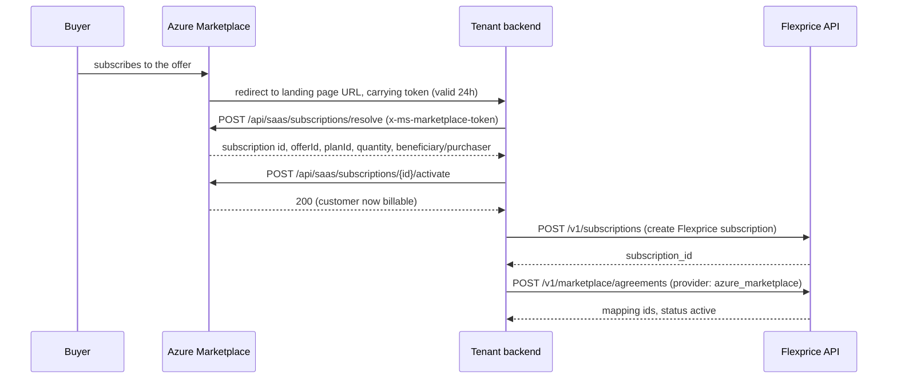
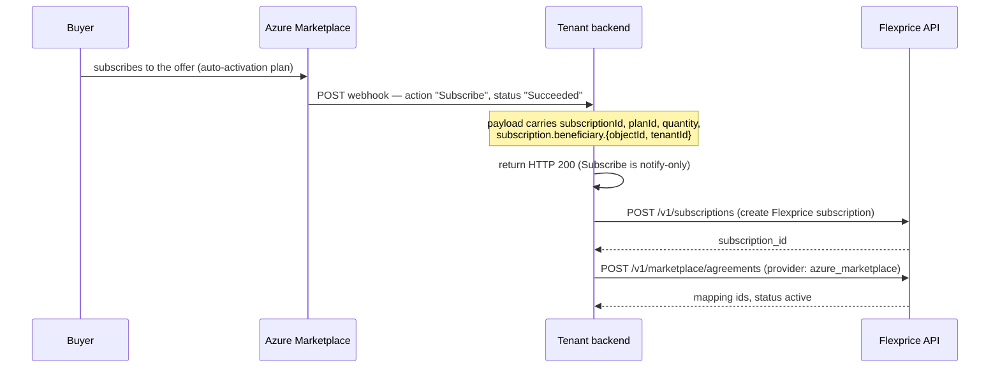
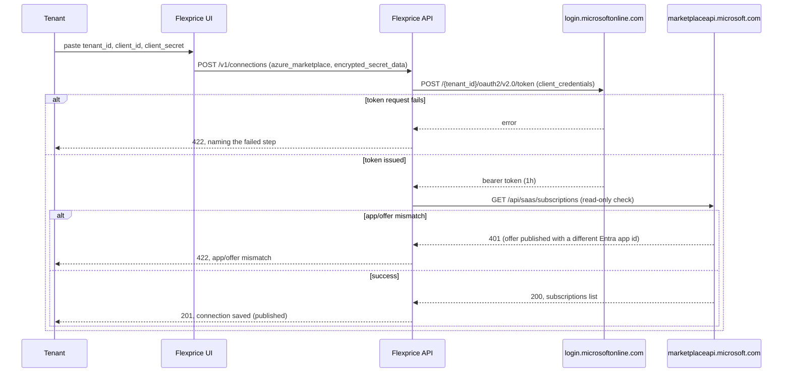
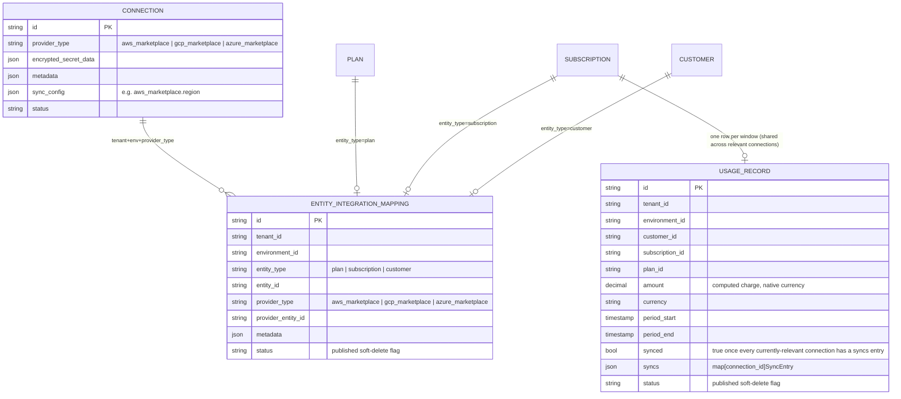

# Marketplace Integration — Azure + Batch Reporting

Author: Tsage
Status: design, pending approval
Scope: Azure Marketplace (new), plus moving AWS/GCP/Azure usage reporting onto one shared batch
mechanism.

This builds on the shipped state of
[2026-07-18-FLE-1070-marketplace-integration-v2.md](2026-07-18-FLE-1070-marketplace-integration-v2.md).
The starting point is v2 as it actually shipped — its Section 12 deviations: `usage_records` is
provider-agnostic with a `syncs` map, and there is no `connection_id` column.

---

## 1. What we are building

The job is the same one we already do for AWS and GCP: for each of a tenant's marketplace buyers,
periodically tell the marketplace how much that buyer owes for the window, computed the same way an
invoice line is. Azure is the third of three symmetrical integrations. It shares the actors, the
snapshot cron, the entity-mapping table, and the lifecycle contract (the tenant owns lifecycle;
Flexprice never listens for it). It differs only in the specific API calls, the authentication
mechanism, and — Azure-only — the offer and dimension the tenant sets up before anything can be
reported.

This document also changes AWS and GCP: both reporting clients move from one record per call to a
shared batch mechanism. v2 §10 already noted this as a known gap ("Both APIs support batching … but v1
sends one record per call for both … deferred"). This un-defers it, for all three providers together.

### Actors


| Who                                 | What they do                                                                                                            |
| ----------------------------------- | ----------------------------------------------------------------------------------------------------------------------- |
| **Marketplace** (AWS / GCP / Azure) | Hosts the listing, signs the buyer up, invoices and charges the buyer, pays the tenant.                                 |
| **Tenant**                          | Our customer — the ISV selling on the marketplace. Owns their marketplace account/offer and their own integration code. |
| **Buyer**                           | The tenant's end customer, subscribed through the marketplace. One-to-one with a Flexprice customer.                    |
| **Flexprice**                       | Computes each buyer's usage charge and reports it to the marketplace on a schedule.                                     |


---


## 2. The usage report, all three providers


### 2.1 The pricing convention

The tenant defines one billable dimension named `usage_fee`, priced at **$0.01 per unit**. Flexprice
computes the real dollar charge for the window, converts it to cents, and reports that integer as the
quantity. The marketplace multiplies quantity × $0.01 and bills the correct amount. This keeps all
pricing logic inside Flexprice — the tenant never mirrors their price book into the marketplace.

Azure supports this the same way AWS and GCP do: a dimension takes an arbitrary `Price per unit` with
no documented floor ([Metered billing for managed applications](https://learn.microsoft.com/en-us/partner-center/marketplace-offers/azure-app-metered-billing)),
so `$0.01` is a valid value. The base plan's own recurring price is set to **$0** — all revenue flows
through the metered dimension.

### 2.2 AWS: `BatchMeterUsage`

Shipped today, one record per call. This document adds batching (up to 25 records).

```jsonc
// Request
{
  "ProductCode": "4qwerty789",   // omitted for Concurrent Agreements products
  "UsageRecords": [
    { "CustomerAWSAccountId": "222222222222", "LicenseArn": "arn:aws:license-manager:...:l-abc",
      "Dimension": "usage_fee", "Quantity": 1250, "Timestamp": 1752300000 }
    // ... up to 25 records
  ]
}
```

```jsonc
// Response
{
  "Results": [
    { "MeteringRecordId": "abc-123", "Status": "Success", "UsageRecord": {"...":"..."} }
  ],
  "UnprocessedRecords": []
}
```

Each record in `Results` carries its own `Status`: `Success | CustomerNotSubscribed | DuplicateRecord`. A present `Results` entry is not the same as accepted — `Status` must be checked
([awsmarketplace/client.go:34-48](../../internal/integration/awsmarketplace/client.go)). Records that
could not be processed at all come back in `UnprocessedRecords` and are retried next run. Batch cap:
**25 records per call**, a hard limit.

### 2.3 GCP: `services.report`

Shipped today, one record per call. This document adds batching.

```jsonc
// Request
POST https://servicecontrol.googleapis.com/v1/services/{service_name}:report
{
  "operations": [
    { "operationId": "usage_rec_001", "operationName": "flexprice/usage_report",
      "consumerId": "USAGE_REPORTING_ID_A", "startTime": "...", "endTime": "...",
      "metricValueSets": [{ "metricName": "{service_name}/usage_fee", "metricValues": [{ "int64Value": "1250" }] }] }
    // ... multiple operations; bounded by request size
  ]
}
```

```jsonc
// Response — HTTP 200, one operation rejected out of three
{
  "reportErrors": [
    { "operationId": "usage_rec_002", "status": { "code": 5, "message": "Consumer '...' not found or not active." } }
  ],
  "serviceConfigId": "2026-07-16r0", "serviceRolloutId": "..."
}
```

GCP is the only provider that does not return a per-record success receipt. Success is read as
**absence** from `reportErrors`. The schema defines three cases:

> "
>
> 1. The combination of a successful RPC status and an empty `report_errors` list indicates a complete
>
> success where all `Operations` in the request are processed successfully. 2. …a non-empty
> `report_errors` list indicates a partial success where some `Operations` in the request succeeded.
> Each `Operation` that failed processing has a corresponding item in this list. 3. A failed RPC status
> indicates a general non-deterministic failure. When this happens, it's impossible to know which of
> the 'Operations' in the request succeeded or failed."
> — `ReportResponse.reportErrors`, [Service Control API discovery document](https://servicecontrol.googleapis.com/$discovery/rest?version=v1)

Case 3 is the operational rule that matters for batching: if the RPC itself fails (network error, 5xx,
timeout — not a 200 with populated `reportErrors`), every row in that batch is left unsynced and the
whole batch is retried next run. This is safe because `operationId = usage_record.id`
([gcpmarketplace/client.go:35-36](../../internal/integration/gcpmarketplace/client.go)), so a retry
resends byte-identical operations.

There is no count limit on `operations[]`, only a size limit:

> "There is no limit on the number of operations in the same ReportRequest, however the ReportRequest
> size should be no larger than 1MB."
> — `ReportRequest.operations`, [Service Control API discovery document](https://servicecontrol.googleapis.com/$discovery/rest?version=v1)

A failure is matched back to its row by `ReportError.operationId` ("The Operation.operation_id value
from the request"). `MetricValue` allows `int64Value | doubleValue | moneyValue | distributionValue | boolValue | stringValue`; only `int64Value` is used, matching the shipped client
([gcpmarketplace/client.go:41](../../internal/integration/gcpmarketplace/client.go)).

### 2.4 Azure: `usageEvent` / `batchUsageEvent`

New. The single-event endpoint and the batch endpoint have the same record shape.

```jsonc
// Single — POST https://marketplaceapi.microsoft.com/api/usageEvent?api-version=2018-08-31
{ "resourceId": "<saas-subscription-guid>", "quantity": 1250.0, "dimension": "usage_fee",
  "effectiveStartTime": "2026-07-23T14:00:00", "planId": "silver" }
```

```jsonc
// Batch — POST https://marketplaceapi.microsoft.com/api/batchUsageEvent?api-version=2018-08-31
{ "request": [
    { "resourceId": "<guid1>", "quantity": 1250.0, "dimension": "usage_fee", "effectiveStartTime": "...", "planId": "silver" }
    // ... up to 25
] }
```

```jsonc
// Response — HTTP 200, one of three rejected
{
  "count": 3,
  "result": [
    { "usageEventId": "<guid>", "status": "Accepted",  "resourceId": "<guid1>", "dimension": "usage_fee", "effectiveStartTime": "...", "planId": "silver" },
    { "status": "Duplicate", "error": { "code": "Conflict", "message": "This usage event already exist." },
      "resourceId": "<guid2>", "dimension": "usage_fee", "effectiveStartTime": "...", "planId": "silver" },
    { "usageEventId": "<guid>", "status": "Accepted",  "resourceId": "<guid3>", "dimension": "usage_fee", "effectiveStartTime": "...", "planId": "silver" }
  ]
}
```

— [Metering service APIs](https://learn.microsoft.com/en-us/partner-center/marketplace-offers/marketplace-metering-service-apis).

The response is a `result[]` array, one entry per record sent, each with its own `status` and — when
accepted — its own `usageEventId`. This is a per-record outcome, the same shape as AWS's `Results[]`.
Per-record `status` values: `Accepted | Expired | Duplicate | Error | ResourceNotFound | ResourceNotAuthorized | ResourceNotActive | InvalidDimension | InvalidQuantity | BadArgument`.
`usageEventId` is Azure's per-record receipt, the equivalent of AWS's `MeteringRecordId`. Match each
result back to its row by the echoed `resourceId` / `dimension` / `effectiveStartTime` / `planId`, not
by array position — the doc does not guarantee order is preserved.

Azure's dedup key is `(resourceId, dimension, calendar hour)` — one event per hour per resource per
dimension, and events can only be reported for the past 24 hours:

> "Only one usage event can be emitted for each hour of a calendar day per resource and dimension. …
> Usage events can only be emitted for the past 24 hours."
> — [Metering service APIs](https://learn.microsoft.com/en-us/partner-center/marketplace-offers/marketplace-metering-service-apis)

The 409 Conflict / `Duplicate` case is keyed on the resource: "A usage event has already been
successfully reported for the specified resource ID, effective usage date and hour." Batch cap: **25
records per call**, a hard limit ("The maximal number of events in a single batch is 25"); a batch of
more than 25 returns 400.

**Quantity must be strictly greater than 0 — checked two ways, not one.** The `quantity` field's own
inline doc comment (identical on both the single and batch request bodies) reads: *"how many units were
consumed for the date and hour specified in effectiveStartTime, must be greater than 0 or a double
integer."* That phrasing is ambiguous on its own — "double integer" isn't a defined value category, and
every example on the page uses a whole number formatted as a double (`5.0`, `39.0`), so the more
plausible reading is "must be greater than 0, [as] a double [or] integer [numeric type]" — describing
the accepted *representation*, not opening a loophole around the positivity requirement. This document
does not rely on that ambiguous sentence alone: the batch response's own error table settles it
unambiguously — `InvalidQuantity`: *"The quantity passed is lower or equal to 0."* That is a normative
rejection rule, not a loosely worded comment. Formatting a zero as a double changes nothing: `0.0` is
still `0`, and `0 <= 0` triggers `InvalidQuantity` regardless of representation. Both sources agree:
Azure requires `quantity > 0`, strictly, with no exception for how the zero is encoded.

### 2.5 The three, side by side


|                      | AWS                                                                      | GCP                                                      | Azure                                       |
| -------------------- | ------------------------------------------------------------------------ | -------------------------------------------------------- | ------------------------------------------- |
| Report call          | `BatchMeterUsage`                                                        | `services.report`                                        | `batchUsageEvent`                           |
| Batch cap            | 25 per call (hard)                                                       | 1MB per call (no count cap)                              | 25 per call (hard)                          |
| Dedup key            | product + customer + dimension + `Timestamp` (byte-identical retry-safe) | `operationId` (caller-chosen)                            | `(resourceId, dimension, calendar hour)`    |
| Quantity type        | int32 cents                                                              | int64 cents                                              | double (cents as a whole number)            |
| Submission window    | 24h + 6h month-end grace                                                 | not documented; assumed similar                          | 24h, no stated grace                        |
| Per-record receipt   | `MeteringRecordId`                                                       | none — absence from `reportErrors` = success             | `usageEventId`                              |
| Per-record outcome   | `Results[]` + `UnprocessedRecords`                                       | only failures listed in `reportErrors`; success inferred | `result[]`, each with its own `status`      |
| Batch-wide ambiguity | none — every record has an explicit outcome                              | RPC-level failure = outcome of the whole batch unknown   | none — every record has an explicit outcome |


### 2.6 Batch size

A usage-report record on any provider is a small flat object — a couple of GUIDs, an ISO-8601
timestamp, a short dimension string, one numeric value — on the order of 200 bytes. Twenty-five of
them with array and wrapper overhead is roughly 5–6KB, well under GCP's 1MB request-size cap (about
half a percent of it). AWS and Azure cap by count, not size, at 25. So 25 is a safe, uniform batch
size across all three. It is chosen for consistency; GCP's real ceiling is far higher.

---


## 3. Onboarding a buyer


### 3.1 AWS / GCP

Unchanged from v2 §3. AWS: buyer redirect + `ResolveCustomer`, done by the tenant; Flexprice never
calls it. GCP: Pub/Sub + Procurement API, also done by the tenant. In both, the tenant has every
identifier it needs by the time it registers the agreement with Flexprice.

### 3.2 Azure

Two paths. Auto-activation is recommended, since it avoids depending on the browser redirect.

**Path A — manual Resolve/Activate**
([SaaS fulfillment Subscription APIs v2](https://learn.microsoft.com/en-us/partner-center/marketplace-offers/pc-saas-fulfillment-subscription-api)):




**Path B — auto-activation (recommended)**
([SaaS fulfillment Subscription APIs v2](https://learn.microsoft.com/en-us/partner-center/marketplace-offers/pc-saas-fulfillment-subscription-api),
[Implementing a webhook](https://learn.microsoft.com/en-us/partner-center/marketplace-offers/pc-saas-fulfillment-webhook)):

> "For plans with auto activation enabled, the Resolve API isn't needed. Microsoft sends the
> subscription details directly to the publisher via the Subscribe webhook notification."




Both paths give the tenant the same fields, which is what flows into the agreement registration call:

```jsonc
// Resolve response / Subscribe webhook — the fields we use
{
  "id": "<guid>",         // -> resource_id (this is resourceId in the usage-report payload)
  "offerId": "offer1",    // informational; not part of the usage-report payload, not stored
  "planId": "silver",     // -> azure.plan_id
  "subscription": {
    "beneficiary": { "objectId": "<guid>", "tenantId": "<guid>", "emailId": "..." }, // tenantId -> beneficiary_account_id
    "saasSubscriptionStatus": "Subscribed"
  }
}
```

---


## 4. Registering with Flexprice: `POST /v1/marketplace/agreements`

One endpoint serves all providers ([dto/marketplace.go](../../internal/api/dto/marketplace.go)): a
`provider` discriminator and exactly one provider-specific block. Azure adds a third block.

```go
const (
    ProviderAWS   MarketplaceProvider = "aws_marketplace"
    ProviderGCP   MarketplaceProvider = "gcp_marketplace"
    ProviderAzure MarketplaceProvider = "azure_marketplace" // new
)

// AWSMarketplaceAgreement, GCPMarketplaceAgreement — unchanged
// (dto/marketplace.go:34-72). Their field names stay as-is; see §11.3.

// AzureMarketplaceAgreement — new
type AzureMarketplaceAgreement struct {
    PlanID               string `json:"plan_id"                validate:"required"` // Azure's planId (distinct from the request's top-level Flexprice plan_id)
    Dimension            string `json:"dimension"              validate:"required"` // the usage_fee dimension on the offer
    ResourceID           string `json:"resource_id"            validate:"required"` // Azure SaaS subscription id -> resourceId in the usage-report payload
    BeneficiaryAccountID string `json:"beneficiary_account_id" validate:"required"` // buyer's Entra tenant id, from subscription.beneficiary.tenantId
}
```

```jsonc
// Example body
{
  "provider": "azure_marketplace",
  "subscription_id": "subs_01KY75NK7SF1WAH4N5XF4TXMZQ",
  "customer_id": "cust_01KY75M8JJJYAXC2PTP7DC0SFE",
  "plan_id": "plan_01KY75N4JCY64266FES411GEK7",
  "azure": {
    "plan_id": "silver",
    "dimension": "usage_fee",
    "resource_id": "11111111-2222-3333-4444-555555555555",
    "beneficiary_account_id": "test-account-001"
  }
}
```

There is no `offer_id` field. `offerId` is not part of the usage-report payload (§2.4), so it is not
stored on either side.

---


## 5. Entity mapping

Same generic `entity_integration_mapping` table, no schema change. Azure is a third `provider_type`
value, the way GCP was added as a second one in v2.


| entity_type  | AWS `provider_entity_id`  | GCP `provider_entity_id` | Azure `provider_entity_id`                | metadata                                                                                           |
| ------------ | ------------------------- | ------------------------ | ----------------------------------------- | -------------------------------------------------------------------------------------------------- |
| plan         | `product_code`            | `service_name`           | `planId`                                  | AWS: `dimension`, `concurrent_agreements`. GCP: `metric_name`. Azure: `{"dimension": "usage_fee"}` |
| subscription | `license_arn`             | `usageReportingId`       | Azure SaaS subscription id (`resourceId`) | —                                                                                                  |
| customer     | `customer_aws_account_id` | `account_id`             | `beneficiary_account_id`                  | — (not read by the report call on any provider; kept for parity and audit)                         |


The plan maps to Azure's `planId`, not `offerId`, because `planId` is the only product/plan identifier
in the usage-report payload (§2.4, §3.2). One Azure offer can hold several plans ("Each Azure
Application offer can have … managed application plans … Billing dimensions are shared across all plans
for an offer",
[Metered billing for managed applications](https://learn.microsoft.com/en-us/partner-center/marketplace-offers/azure-app-metered-billing)),
so a tenant with a three-tier offer has three Flexprice plans, each with its own mapping row holding
its own `planId`. This is the same one-row-per-plan shape the table already uses.

---


## 6. Connecting a tenant's Azure marketplace (authentication)


### 6.1 AWS / GCP

Unchanged from v2 §5. AWS: tenant-created IAM role + `ExternalId`, which Flexprice assumes. GCP:
Workload Identity Federation, no stored key. Neither applies to Azure — there is no federation path for
a third-party AWS-hosted caller to exchange into an Entra token.

### 6.2 Azure: Entra app registration + client credentials

For SaaS offers this is the only supported authentication method:

> "Applicable offer types are transactable SaaS and Azure Applications with managed application plan
> type. … For SaaS offers, this is the only available option."
> — [Marketplace metering service authentication strategies](https://learn.microsoft.com/en-us/partner-center/marketplace-offers/marketplace-metering-service-authentication)

The Entra app is tied to the tenant's own offer:

> "You must generate tokens using the same Entra tenant ID and Entra application ID that you specified
> in the Partner Center Technical Configuration page of the offer."
> — [Register a SaaS application](https://learn.microsoft.com/en-us/partner-center/marketplace-offers/pc-saas-registration)

Azure requires storing a static `client_secret`. This is the one point where Azure differs from AWS
and GCP, which both avoid a stored secret; Microsoft offers no federation equivalent for SaaS metering
(§11.4).

Everything in the setup below is done by the tenant. Flexprice creates no Azure application, registers
nothing with Microsoft, and never touches Partner Center — the same division of labor as AWS (tenant
creates the IAM role; Flexprice receives the ARN) and GCP (tenant runs the WIF script; Flexprice
receives the JSON). Flexprice consumes credentials; it never creates them.

**Tenant-side setup** ([Register a SaaS application](https://learn.microsoft.com/en-us/partner-center/marketplace-offers/pc-saas-registration)):

1. **Register an app in Microsoft Entra ID** (Entra ID → App registrations → New registration), inside
  the tenant's own Azure AD tenant. Recommended as single-tenant. This is the identity Flexprice
   authenticates as, on the tenant's behalf.
2. **Generate a client secret** (Certificates & secrets, on that app registration). This is the app's
  password for the `client_credentials` flow.
3. **Register the Marketplace metering API inside the tenant's directory** — one-time, run by the
  tenant. `20e940b3-4c77-4b0b-9a53-9e16a1b010a7` is Microsoft's own fixed application ID for the
   Marketplace SaaS/metering API — the same value for every publisher, not something the tenant
   generates. Before the app from step 1 can request a token *scoped to* that API, the tenant's
   directory needs a local record of it. That record is a **service principal**: a per-directory
   instance of an application. The tenant creates it by running, in Azure Cloud Shell or any terminal
   signed in as the tenant (`az login`):
   `az ad sp create --id 20e940b3-4c77-4b0b-9a53-9e16a1b010a7`.
   It creates no secret and grants no access on its own — it only makes that Microsoft API addressable
   from the tenant's directory so step 1's app can request tokens for it. This command is the method
   given in [Register a SaaS application](https://learn.microsoft.com/en-us/partner-center/marketplace-offers/pc-saas-registration).
4. **Wire the app's tenant ID and application ID into the offer's Technical Configuration** in Partner
  Center. This is what makes Microsoft's later 401 check work — Microsoft cross-references the token's
   app ID against what is registered for that offer.
5. **Paste** `tenant_id` **/** `client_id` **/** `client_secret` **into the Flexprice connection drawer.** The only
  step Flexprice touches: it receives three strings the tenant already generated.

**Token request:**

```
POST https://login.microsoftonline.com/{tenant_id}/oauth2/v2.0/token
Content-Type: application/x-www-form-urlencoded

grant_type=client_credentials&client_id={client_id}&client_secret={client_secret}&scope=20e940b3-4c77-4b0b-9a53-9e16a1b010a7/.default
```

Returns a one-hour bearer token (`expires_in: 3600`). Flexprice requests one token per connection per
cron run, the same pattern as AWS `AssumeRole` and GCP `WifSession`.

**Connection verification** — synchronous, before the connection is saved, matching AWS/GCP:




The 401 is a documented error:

> "401 Unauthorized. … The request is attempting to access an SaaS subscription for an offer that was
> published with a different Microsoft Entra app ID from the one used to create the authentication
> token."
> — [SaaS fulfillment Subscription APIs v2](https://learn.microsoft.com/en-us/partner-center/marketplace-offers/pc-saas-fulfillment-subscription-api)

**Storage** — same encrypted-blob shape as AWS/GCP:

```jsonc
{
  "provider_type": "azure_marketplace",
  "encrypted_secret_data": { "azure_marketplace": { "tenant_id": "...", "client_id": "...", "client_secret": "..." } },
  "metadata": {},
  "status": "published"
}
```

---


## 7. What Flexprice stores

No new tables. `entity_integration_mapping` gains a third `provider_type` value. `usage_records` is
already provider-agnostic (v2 §12.1: fan-out via `syncs`, no `connection_id` column), so Azure plugs
into it as-is.




The `Marketplace` enum gains Azure. `SyncEntry` gains two fields, `Skipped` and `SkipReason`
(rationale in §8.3/§11.8): a connection this row is relevant to can be resolved either because the
marketplace actually accepted the report (a real `ReportingID`), or because sending it is
*deterministically* pointless — currently, only "Azure + amount == 0" qualifies. Both cases get an
entry so `synced` can still reach `true`; only the first kind means anything was posted.

```go
type Marketplace string
const (
    MarketplaceAWS   Marketplace = "aws_marketplace"
    MarketplaceGCP   Marketplace = "gcp_marketplace"
    MarketplaceAzure Marketplace = "azure_marketplace" // new
)
type SyncEntry struct {
    Marketplace Marketplace `json:"marketplace"`
    ReportingID string      `json:"reporting_id"`         // AWS MeteringRecordId | GCP operationId | Azure usageEventId; empty when Skipped
    SyncedAt    time.Time   `json:"synced_at"`
    Skipped     bool        `json:"skipped,omitempty"`     // new: true = never sent to this marketplace, not a real acceptance
    SkipReason  string      `json:"skip_reason,omitempty"` // new: e.g. "zero_amount_not_supported" — only set when Skipped
}
```

A real acceptance is `Skipped == false` (or the zero value) with a non-empty `ReportingID`. A skip is
`Skipped == true`, `ReportingID == ""`, `SkipReason` set. The two are never conflated — anyone reading
this table to ask "did the marketplace actually confirm this" checks `Skipped == false`, not just
whether an entry exists.

---


## 8. Reporting on a schedule


### 8.1 Snapshot cron — unchanged

No change. The 6-hour cadence stays: `period_start = scheduledTime − 10h`, `period_end = scheduledTime − 4h` (v2 §7.1), applied uniformly to all three providers.

This does not collide with Azure's hour-grained dedup key. `period_end` is always 4 hours old, well
inside Azure's 24-hour window. Consecutive snapshot runs are 6 hours apart, so `period_end` lands in a
different calendar hour every run — no two windows for the same subscription can share a `(resourceId, dimension, hour)` key. Azure reports with `effectiveStartTime = period_end`, matching AWS's `Timestamp = period_end`.

### 8.2 Reporting cron — add batching (and Azure)

The shipped cron ([report_activities.go](../../internal/temporal/activities/marketplace/report_activities.go))
already does everything except batch. `MarketplaceUsageReportActivity` groups every published
marketplace connection by tenant/environment; `reportForTenant` then, for one tenant/environment:

1. authenticates each connection once and loads its mappings (`prepareConnection`),
2. reads that tenant's unsynced records once (`usageRecordRepo.ListUnsynced`),
3. keeps the eligible ones (`isEligibleForReport`: currency is USD, amount is not negative),
4. reports each eligible record to every relevant connection it isn't already in the `syncs` map for
   (`isRelevantForSubscription`), and persists the record's `syncs` + `synced` (`MarkSynced`).

Step 4 sends **one record per API call** today. This document changes only that: send **up to 25 per
call**, and add Azure as a third provider. The tenant grouping, auth-once-per-connection,
`ListUnsynced`, `isEligibleForReport`, the `syncs` map, and `MarkSynced` are all unchanged.

Batching flips step 4 from record-outer to connection-outer (you cannot fill a 25-record call while
iterating one record at a time). For each connection, gather the records it still owes, chunk them into
groups of ≤25, and send each chunk as one call:

```text
reportForTenant(conns):
    prepared = [prepareConnection(c) for c in conns]                  # auth once each; drop any that fail
    eligible = [r for r in ListUnsynced(tenant, env) if isEligibleForReport(r)]   # usd, amount not negative

    for pc in prepared:                                              # one connection at a time
        pending = []
        for r in eligible:
            if not pc.isRelevantForSubscription(r.SubscriptionID): continue   # not this connection's row
            if pc.conn.ID in r.Syncs:                              continue   # already reported here
            if pc.provider == azure_marketplace and r.Amount == 0:
                r.Syncs[pc.conn.ID] = { skipped: true, skip_reason: "zero_amount_not_supported" }  # Azure rejects 0 (§11.8)
                continue
            pending.append(r)

        for chunk in chunk(pending, 25):                            # each chunk holds 1..25 records
            results = pc.reportChunk(chunk)                         # ONE call: BatchMeterUsage | services.report | batchUsageEvent
            for (r, res) in match(results, chunk):
                if res.accepted:
                    r.Syncs[pc.conn.ID] = { marketplace, reporting_id: res.reportingID, synced_at: now }
                # not accepted -> no entry; retried next run (per-provider rules in §8.3)

    for r in eligible that got a new entry this run:
        synced = every connection relevant to r now has an entry in r.Syncs
        MarkSynced(r.ID, r.Syncs, synced)
```

Two new pieces, everything else reused:

- **`chunk(records, 25)`** — the one new helper; splits a slice into groups of at most 25.
- **`reportChunk`** — the provider report methods change from single-record (`reportAWSRecord`,
  `reportGCPRecord`) to per-chunk (one `BatchMeterUsage` / `services.report` / `batchUsageEvent` call),
  returning a per-record result the caller matches back to its row (§8.3). New `reportAzureChunk` for
  Azure.

`isEligibleForReport` is unchanged. The Azure `amount == 0` skip is the only per-connection rule —
applied while gathering `pending`, because AWS and GCP accept zero (already sent today) and only Azure
rejects it. It writes a `skipped` `syncs` entry so the row can still reach `synced = true` once its
other connections succeed (§11.8).

```mermaid
sequenceDiagram
    participant Sch as Temporal (3h)
    participant Cron as Reporting cron
    participant DB as usage_records
    participant MP as Marketplace API

    Sch->>Cron: run (per tenant/environment)
    Cron->>Cron: prepareConnection each (auth once)
    Cron->>DB: eligible = ListUnsynced + isEligibleForReport (usd, amount not negative)
    loop each connection, one at a time
        Cron->>Cron: pending = its relevant rows not yet in syncs<br/>(Azure amount==0 -> skipped syncs entry, not batched)
        loop chunk(pending, 25)
            Cron->>MP: reportChunk — one BatchMeterUsage | services.report | batchUsageEvent
            MP-->>Cron: per-record results
            Cron->>Cron: accepted -> add syncs entry; else leave unsynced (§8.3)
        end
    end
    Cron->>DB: MarkSynced each touched row (synced = all relevant connections present)
```


### 8.3 Per-provider response handling

`reportChunk` reads each provider's per-record result and returns, per row, accepted (with a
`reporting_id`) or not. A row with `amount == 0` is sent to AWS/GCP like any other and read the same way
(AWS documents `Quantity` valid range minimum 0; GCP documents no minimum); only Azure filters it out
before sending (§8.2, §11.8).

```text
# AWS: per-record Status in Results[]; UnprocessedRecords retried next run
Success               -> syncs[conn] = { reporting_id: MeteringRecordId }
CustomerNotSubscribed -> no entry, log.error (self-heals when the buyer resubscribes)
DuplicateRecord       -> no entry, log.error (a conflicting different record — needs a human)
in UnprocessedRecords -> no entry, retried next run

# GCP: absence from reportErrors (given a 200 RPC) = accepted
not in reportErrors -> syncs[conn] = { reporting_id: operationId }   # our own id
in reportErrors     -> no entry, log.error(code + message)
RPC itself failed   -> no entry for the whole chunk, log.error (§2.3 case 3)

# Azure: per-record status in result[]
Accepted  -> syncs[conn] = { reporting_id: usageEventId }
Duplicate -> no entry, log.error (ambiguous — §11.7)
Expired | ResourceNotActive | InvalidDimension | InvalidQuantity | BadArgument -> no entry, log.error
amount == 0 (never sent, §8.2) -> syncs[conn] = { skipped: true, skip_reason: "zero_amount_not_supported" }
```

A `syncs` entry is only ever written for a definitive `Accepted` (a real `reporting_id`) or the Azure
zero-amount skip (`skipped: true`). Every other outcome — including Azure `Duplicate`, which is
ambiguous (§11.7) — is left with no entry and retried next run. `usage_records` stays the source of
truth: an entry is either a real receipt or an explicit `skipped`, never a guess.

### 8.4 Logging and what to search for

Until a live Azure listing exists we cannot end-to-end test a real report, so these logs are the only
signal that reporting works. Every stage logs, on every provider — successful `info` lines included,
not just failures. Levels are `error`, `info`, or `debug` only — never `warn`.

**Credentials are never logged, at any level, for any provider.** No `client_secret` and no bearer
token (Azure); no `role_arn`, `external_id`, or assumed-role temporary credentials (AWS); no Workload
Identity Federation JSON, federated token, or impersonation token (GCP). Buyer identifiers are also
never logged: `resource_id` / `beneficiary_account_id` (Azure); `license_arn` /
`customer_aws_account_id` (AWS); `usageReportingId` / `account_id` (GCP). AWS's `AssumeRole` error path
already redacts the raw SDK error because it can embed the role ARN; the GCP and Azure clients follow
the same rule for their own errors. Only the safe correlators below ever appear in a line.

Safe correlators (tag on every line): `usage_record_id`, `connection_id`, `marketplace`
(`aws_marketplace` | `gcp_marketplace` | `azure_marketplace`), `period_start` / `period_end`, the
amount in cents, and the marketplace's returned `status` / error code.

The stages are identical across all three providers — `marketplace` is what tells them apart:

| Stage | Level | Message to grep | Tags |
|---|---|---|---|
| Connection authenticated | `debug` | `marketplace connection authenticated` | `connection_id`, `marketplace` |
| Row skipped: non-usd | `info` | `marketplace skip` | `usage_record_id`, `connection_id`, `currency` |
| Row skipped: negative amount (investigate) | `error` | `marketplace usage record has negative amount` | `usage_record_id`, `connection_id`, `amount` |
| Zero-amount row skipped on Azure only (never sent; connection resolved via a `skipped` `syncs` entry, §11.8) | `info` | `marketplace usage record skipped: zero amount not supported by azure` | `usage_record_id`, `connection_id` |
| About to report a row (includes `amount == 0` on AWS/GCP — sent normally, §11.8) | `debug` | `marketplace reporting` | `usage_record_id`, `connection_id`, `marketplace`, `cents`, `period_end` |
| Row reported successfully | `info` | `marketplace usage record synced` | `usage_record_id`, `connection_id`, `marketplace`, `reporting_id` |
| Row not accepted (rejected / Azure `Duplicate` / GCP `reportErrors`) | `error` | `marketplace usage record not synced` | `usage_record_id`, `connection_id`, `marketplace`, `status` |
| Whole batch call failed (network / 5xx / GCP RPC failure) | `error` | `marketplace batch call failed` | `connection_id`, `marketplace`, `chunk_size` |

To scope a search to one provider, filter the same message on its `marketplace` value:

- **GCP failures** — `marketplace usage record not synced` with `marketplace=gcp_marketplace` (a
  per-row `reportErrors` rejection; `status` carries the GCP error code/message), or `marketplace
  batch call failed` with `marketplace=gcp_marketplace` (the case-3 whole-batch RPC failure, §2.3).
- **AWS failures** — `marketplace usage record not synced` with `marketplace=aws_marketplace`
  (`status` = `CustomerNotSubscribed` | `DuplicateRecord`), or `marketplace batch call failed` with
  `marketplace=aws_marketplace`.
- **Azure failures** — `marketplace usage record not synced` with `marketplace=azure_marketplace`
  (`status` = `Duplicate` | `Expired` | `ResourceNotActive` | `InvalidDimension` | `InvalidQuantity` |
  `BadArgument`), or `marketplace batch call failed` with `marketplace=azure_marketplace`.

Example lines — an Azure success, an Azure `Duplicate`, a GCP whole-batch failure:

```text
level=info  msg="marketplace usage record synced"     usage_record_id=ur_01H.. connection_id=conn_az_01  marketplace=azure_marketplace reporting_id=<usageEventId>
level=error msg="marketplace usage record not synced" usage_record_id=ur_01H.. connection_id=conn_az_01  marketplace=azure_marketplace status=Duplicate
level=error msg="marketplace batch call failed"       connection_id=conn_gcp_01 marketplace=gcp_marketplace chunk_size=25 error="rpc DeadlineExceeded"
```

To answer "did this record get reported", grep `usage_record_id=<id>`: `marketplace usage record
synced` means it landed and was accepted; `marketplace usage record skipped: zero amount not supported
by azure` means that connection is resolved but nothing was ever posted there (check the row's `syncs`
map for that connection's `skipped: true` to confirm — never assume it was billed); `marketplace usage
record not synced` or `marketplace batch call failed` means it was sent (or attempted) and
rejected/unknown, and is retried next run. The new Azure client (`GetToken`, `BatchReportUsageEvent`)
must emit every stage above — called out because it is new and has no existing logging to inherit,
unlike the AWS and GCP clients.

---


## 9. Client interfaces

```go
// awsmarketplace.Client — BatchMeterUsage takes a slice. The AWS SDK type is already []UsageRecord;
// awsmarketplace/client.go:163 builds a one-element slice into it today. This removes that narrowing.
AssumeRole(ctx, roleArn, externalID string, duration time.Duration) (aws.Credentials, error)
BatchMeterUsage(ctx, creds, region string, records []UsageRecordInput) ([]BatchMeterUsageResult, error) // up to 25

// gcpmarketplace.Client — Report widened to ReportBatch
WifSession(ctx, wifCredentialsJSON string) (*servicecontrol.Service, error)
ReportBatch(ctx, svc *servicecontrol.Service, records []UsageReportInput) ([]ReportResult, error) // up to 25; match by OperationID

// azuremarketplace.Client — new
GetToken(ctx, tenantID, clientID, clientSecret string) (Token, error) // client_credentials, ~1h
BatchReportUsageEvent(ctx, token Token, records []UsageEventInput) ([]UsageEventResult, error) // up to 25; match by echoed fields

type UsageEventInput struct {
    ResourceID, Dimension, PlanID string
    Quantity           float64   // cents, a whole number carried as a double (Azure's schema)
    EffectiveStartTime time.Time // = period_end
}
type UsageEventResult struct {
    Accepted     bool   // Status == "Accepted"
    UsageEventID string // populated only when Accepted
    Status       string // Accepted | Expired | Duplicate | Error | ResourceNotFound | ResourceNotAuthorized | ResourceNotActive | InvalidDimension | InvalidQuantity | BadArgument
    // echoed back for matching, since order is not guaranteed:
    ResourceID, Dimension, PlanID string
    EffectiveStartTime            time.Time
}
```

---


## 10. Subscription lifecycle and the tenant contract

Flexprice does not process any Azure lifecycle event. There is no Flexprice-side webhook listening for
Azure and no polling of Azure's subscription status. The tenant's own webhook — which the tenant
registers in the same Technical Configuration page as the Entra app (§6.2), a separate field Flexprice
does not set up — is the only thing that receives `Subscribe`, `ChangePlan`, `ChangeQuantity`,
`Renew`, `Suspend`, `Unsubscribe`, `Reinstate`. Flexprice learns of a change only when the tenant,
having seen it on their own webhook, calls Flexprice's subscription/agreement APIs. When a buyer's
subscription ends, the tenant cancels the Flexprice subscription, which archives the mapping, which
drops it out of both crons' `published`-only filter. That cancellation is the entire signal.

Azure's lifecycle events, all delivered to the tenant's webhook
([Implementing a webhook](https://learn.microsoft.com/en-us/partner-center/marketplace-offers/pc-saas-fulfillment-webhook)):


| Webhook `action` | Tenant does                                                                | ACK required?                                                    |
| ---------------- | -------------------------------------------------------------------------- | ---------------------------------------------------------------- |
| `Subscribe`      | create Flexprice subscription, register agreement                          | 200 only (notify-only)                                           |
| `ChangePlan`     | approve, update the Flexprice subscription's plan mapping                  | Yes — PATCH the Operations API within 10s, or Azure auto-accepts |
| `ChangeQuantity` | update seat count if relevant                                              | Yes — same 10s ACK window                                        |
| `Renew`          | nothing                                                                    | notify-only                                                      |
| `Suspend`        | nothing — mapping stays published, reporting continues until `Unsubscribe` | notify-only                                                      |
| `Unsubscribe`    | cancel the Flexprice subscription → mapping archived → both crons stop     | notify-only                                                      |
| `Reinstate`      | nothing — buyer's payment recovered                                        | notify-only                                                      |


Timing is the same as AWS/GCP: the tenant should archive only after the snapshot cron's 4–10h lag has
had a chance to capture the final active-period usage.

---


## 11. Design decisions

**11.1 — Snapshot cadence stays 6h for all three, not hourly.** We considered an hourly cadence for
Azure to sit more tightly inside its hour-grained dedup key. §8.1 shows the 6-hour spacing already
guarantees no same-hour collision, so there is no correctness reason to special-case Azure's cadence.
One cadence for all three.

**11.2 — Quantity is USD cents through a single** `usage_fee` **dimension, not a per-feature dimension
map.** AWS's shipped implementation already uses one `usage_fee` dimension
([dto/marketplace.go:38](../../internal/api/dto/marketplace.go),
[ee/service/marketplace.go:46-50](../../internal/ee/service/marketplace.go)), matching GCP's
`metric_name` convention. Azure uses the same, keeping the pipeline uniform. An earlier AWS-only
predecessor design used a per-feature `dimension_map`; that is not what shipped and is not carried
forward.

**11.3 — Customer-identifier field names stay provider-specific.** `customer_aws_account_id` is AWS's
own field name in `BatchMeterUsage`. GCP's `account_id` matches GCP's own vocabulary — the Entitlement
resource's `account` field and the Account resource's `name` (`accounts/{account_id}`) both use it
([Entitlement reference](https://docs.cloud.google.com/marketplace/docs/partners/commerce-procurement-api/reference/rest/v1/providers.entitlements),
[Account reference](https://docs.cloud.google.com/marketplace/docs/partners/commerce-procurement-api/reference/rest/v1/providers.accounts)).
Azure uses `beneficiary_account_id`, "beneficiary" being Microsoft's own term for the buyer in the
Resolve/webhook payloads. Each name matches its platform.

**11.4 — Azure stores a static** `client_secret`**.** AWS (`AssumeRole`) and GCP (Workload Identity
Federation) both avoid a stored secret; Azure's SaaS metering auth has no federation option ("For SaaS
offers, this is the only available option",
[authentication strategies](https://learn.microsoft.com/en-us/partner-center/marketplace-offers/marketplace-metering-service-authentication)).
Stored encrypted in `encrypted_secret_data.azure_marketplace`, the same as every other provider's
secret.

**11.5 — Batch reporting for all three, at 25 per call.** AWS and GCP move off one-record-per-call.
Batch size 25 is safe per §2.6. GCP having no per-record success receipt does not block batching:
Flexprice generates `operationId` per row before sending, so it needs `reportErrors` only to detect
failures.

**11.6 — GCP RPC-level failure retries the whole batch, never partial.** Required by §2.3 case 3: if
the call itself fails, the outcome of each operation is unknown, so all rows in the batch are retried.
Safe because `operationId` is deterministic.

**11.7 — Azure** `Duplicate` **is logged, never marked synced.** A `Duplicate` says Azure already holds
*an* event for `(resourceId, dimension, hour)`, but the response is not matched against what we sent, so
it does not prove that event is ours. Marking the row synced off it would let Azure's response, not our
own record, decide the table's state. So it gets no `syncs` entry, is logged at `error`, and is retried
next run (§12 covers the rows that then never resolve). Distinct from AWS `DuplicateRecord`, which is a
conflicting *different* record and needs a human.

**11.8 — Zero-amount is provider-specific.** `amount < 0` is never sent, on any provider — a negative
computed charge is an upstream bug, logged at `error`. `amount == 0` differs by provider, per each
one's own docs:

- **AWS** allows it: `Quantity` *"Valid Range: Minimum value of 0"* ([UsageRecord reference](https://docs.aws.amazon.com/marketplace/latest/APIReference/API_marketplace-metering_UsageRecord.html)).
  The shipped eligibility check already only rejects negative amounts, so zero is already sent today.
- **GCP** documents no minimum for a `MetricValue` ([Reporting billing metrics](https://docs.cloud.google.com/service-infrastructure/docs/reporting-billing-metrics));
  the shipped client already sends `Int64Value: 0` with no guard. Sent like any other value.
- **Azure** rejects it: `InvalidQuantity` — *"The quantity passed is lower or equal to 0"* (§2.4). Never
  sent.

For Azure the connection still needs resolving, or a fan-out row with an Azure connection could never
reach `synced = true` even after AWS/GCP succeed. It gets a `SyncEntry` with `Skipped: true`,
`ReportingID: ""` (§7) — recording that nothing was posted while still letting the row complete. This is
safe because Azure's zero-rejection is deterministic, unlike `Duplicate` (§11.7), which is ambiguous and
gets no entry.

---


## 12. Known gaps

- **No terminal state / TTL for un-acceptable or expired rows.** A row a marketplace will not accept —
the subscription closed, the row is past the 24h submission window, or Azure keeps answering
`Duplicate` (§11.7) — is retried every run, because nothing marks a row permanently done. A
`synced=false` (or missing `syncs` entry) means both "retry me" and "I can never succeed"; the two
are indistinguishable today. The reporting cron runs every 3h and Azure accepts a `period_end` for
24h, so a row that first fails still has ~21h — about 7 more runs — to succeed before it expires.
That window is the safety margin we rely on while there is no terminal state: every failure is logged
(§8.4), so it can be alerted on and resolved by hand within those ~21h. The future work is a terminal
state (e.g. `expired`) set once a row's `period_end` passes the acceptance window (24h for AWS/Azure,
assumed similar for GCP), plus TTL/reaping of those rows so they stop being retried and stop
accumulating. Alerting on the `error`-level log lines is a natural follow-on. None of this is built
here.
- **No dead-letter table.** A failed row is visible only as a log line plus its own state in
`usage_records`. There is no place that surfaces "these rows have failed N times". Carried through
v1 and v2; not blocking Azure.
- **Azure transport-level (network/5xx) failure is not documented.** Azure's per-record batch response
is fully documented (§2.4). What is not documented is what has landed if the `batchUsageEvent` HTTP
call itself fails before returning a 200 body. Handled conservatively, the same as GCP case 3: leave
the whole chunk unsynced and retry. Safe because `effectiveStartTime = period_end` is deterministic,
so the resend is byte-identical — if the earlier attempt did land, the resend comes back `Duplicate`,
which is logged and left unsynced (§11.7), not double-charged.
- **Azure's late-submission rule is unconfirmed.** Does Azure judge lateness by submission time or by
`effectiveStartTime`? No doc checked answers it. The 4–10h snapshot lag (§8.1) makes this a
non-issue for ordinary reporting, but the edge case of a subscription closing right at the 24h
boundary is untested. Same open status as the equivalent AWS/GCP question in v2.

---

## 13. Reference

**AWS — Marketplace Metering:**
- [BatchMeterUsage API reference](https://docs.aws.amazon.com/marketplace/latest/APIReference/API_marketplace-metering_BatchMeterUsage.html) — request/response shape, the 25-record batch cap, `Status` values (`Success` | `CustomerNotSubscribed` | `DuplicateRecord`), the *"Identical requests are idempotent and can be retried"* dedup guarantee
- [UsageRecord object reference](https://docs.aws.amazon.com/marketplace/latest/APIReference/API_marketplace-metering_UsageRecord.html) — field-by-field: `CustomerAWSAccountId`, `Dimension`, `LicenseArn`, `Quantity`, `Timestamp`; the record-identity note ("a UsageRecord indicates a quantity of usage for a given product, customer, dimension and time")
- [ResolveCustomer API reference](https://docs.aws.amazon.com/marketplace/latest/APIReference/API_marketplace-metering_ResolveCustomer.html) — the tenant-side onboarding call (§3.1); Flexprice never calls this
- [Metering service overview / TimestampOutOfBoundsException](https://docs.aws.amazon.com/marketplace/latest/userguide/saas-metering-for-registered-users.html) — the 24h submission window + 6h month-end grace

**Microsoft — Azure Marketplace / SaaS fulfillment:**
- [Metering service APIs](https://learn.microsoft.com/en-us/partner-center/marketplace-offers/marketplace-metering-service-apis) — usage/batch event shape, response codes, status values
- [Marketplace metering service authentication strategies](https://learn.microsoft.com/en-us/partner-center/marketplace-offers/marketplace-metering-service-authentication)
- [Register a SaaS application](https://learn.microsoft.com/en-us/partner-center/marketplace-offers/pc-saas-registration) — Entra app registration, service principal, token endpoint
- [Microsoft Entra ID and transactable SaaS offers](https://learn.microsoft.com/en-us/partner-center/marketplace-offers/azure-ad-saas)
- [SaaS fulfillment Subscription APIs v2](https://learn.microsoft.com/en-us/partner-center/marketplace-offers/pc-saas-fulfillment-subscription-api) — Resolve/Activate, subscription fields
- [SaaS fulfillment Operations APIs v2](https://learn.microsoft.com/en-us/azure/marketplace/partner-center-portal/pc-saas-fulfillment-operations-api)
- [Implementing a webhook on the SaaS service](https://learn.microsoft.com/en-us/partner-center/marketplace-offers/pc-saas-fulfillment-webhook) — lifecycle events, payload shape
- [Metered billing for managed applications](https://learn.microsoft.com/en-us/partner-center/marketplace-offers/azure-app-metered-billing) — dimension model, constraints
- [Transacting on Microsoft Marketplace](https://learn.microsoft.com/en-us/partner-center/marketplace-offers/transacting-commercial-marketplace)
- [Plan a SaaS offer](https://learn.microsoft.com/en-us/partner-center/marketplace-offers/plan-saas-offer)
- [Create a SaaS offer](https://learn.microsoft.com/en-us/azure/marketplace/create-new-saas-offer)

**Google — GCP Marketplace / Service Control:**
- [services.report method reference](https://docs.cloud.google.com/service-infrastructure/docs/service-control/reference/rest/v1/services/report)
- [Service Control API discovery document](https://servicecontrol.googleapis.com/$discovery/rest?version=v1) — schema for `Operation`, `MetricValue`, `ReportRequest`, `ReportResponse`, `ReportError`, `Status`
- [Reporting billing metrics](https://docs.cloud.google.com/service-infrastructure/docs/reporting-billing-metrics) — DELTA/INT64 constraint; no documented minimum value for a `MetricValue` (§11.8)
- [Entitlement resource reference](https://docs.cloud.google.com/marketplace/docs/partners/commerce-procurement-api/reference/rest/v1/providers.entitlements)
- [Account resource reference](https://docs.cloud.google.com/marketplace/docs/partners/commerce-procurement-api/reference/rest/v1/providers.accounts)
- [Configuring usage reports](https://docs.cloud.google.com/marketplace/docs/partners/integrated-saas/configure-usage-reports)
- [Managing customer entitlements](https://docs.cloud.google.com/marketplace/docs/partners/integrated-saas/manage-entitlements)

