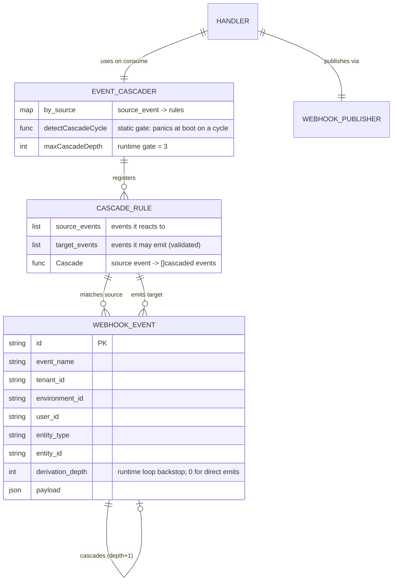
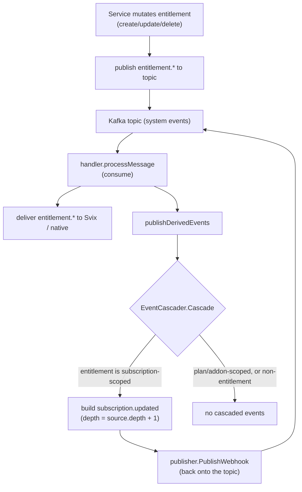

# `subscription.updated` Webhook Derivation — Design ERD

Status: **Implemented (backend)** — consumer-side derivation live
Date: 2026-07-24
Related: webhook pipeline in `internal/webhook/`, entitlement service in `internal/ee/service/entitlement.go`, event envelope in `internal/types/webhook.go`

---

## 1. Problem Statement

Many subscription-affecting mutations must emit `subscription.updated` so downstream consumers can re-sync the subscription aggregate: line-item add/update/delete, addon add/remove, grouped-invoicing membership, coupon/tax/trial changes, and **subscription-scoped entitlement** create/update/delete.

The first implementation published `subscription.updated` **manually at every mutation site**, including a scattered `if entity == SUBSCRIPTION { publishSubscriptionUpdated() }` branch repeated across all four entitlement CRUD paths plus a redundant public/internal method pair. This was duplicative, easy to forget, and easy to double-fire.

**Goal (achieved):** emit `subscription.updated` exactly once per logical change, with the derivation logic centralized rather than sprinkled across services — without adding request-path latency.

---

## 2. Key Decision: proxy vs non-proxy surfaces

The surfaces split cleanly by whether they already emit their **own** webhook event ("proxy event"):

| Surface | Own event? | How `subscription.updated` is produced |
| --- | --- | --- |
| Entitlements | **Yes** — `entitlement.created/updated/deleted` | **Derived** centrally on the webhook consumer |
| Line items | No | Emitted **directly** at the mutation site |
| Addons | No | Emitted **directly** at the mutation site |
| Grouped invoicing | No | Emitted **directly** at the mutation site |
| Coupon / tax / trial | No | Emitted **directly** at the mutation site |

- **Non-proxy surfaces** keep an explicit `publishSystemEvent(subscription.updated)` at the mutation site. These are genuine subscription-aggregate edits with nothing to derive from. An exported/internal method split (e.g. `AddSubscriptionLineItem` vs internal `addSubscriptionLineItem`) guarantees **exactly-once** emission: the exported method owns the event; internal reuse (during `CreateSubscription`, `UpdateSubscriptionLineItem`'s delete+create, addon loops) stays silent so compound operations fire once, and creation is covered by `subscription.created`.
- **Proxy surfaces (entitlements)** emit only their own `entitlement.*` event. A **consumer-side EventCascader** turns any subscription-scoped `entitlement.*` into one `subscription.updated`. The entitlement service no longer knows about `subscription.updated` at all.

Why consumer-side (not produce-side): cascading only needs data resolvable at consume time (the subscription id, recovered by re-loading the entitlement — works for soft-deleted rows too). Keeping it on the consumer avoids adding latency to the mutation request and avoids coupling webhook logic into the mutation transaction. If a future cascaded event needs produce-only data, we widen the **source event payload** rather than moving the cascader into the hot path.

---

## 3. Component model (ERD)

- `WebhookEventBuilder` (`internal/types/webhook.go`) centralizes the envelope boilerplate (id, timestamp, tenant/env/user identity, payload marshalling) previously duplicated across ~9 service `publishSystemEvent` copies.
- `CascadeRule` (`internal/webhook/handler/cascader.go`) declares `SourceEvents()`, `TargetEvents()`, and `Cascade()`.
- `EventCascader` registers cascade rules keyed by source event and enforces the two loop gates below.
- `entitlementCascadeRule` is the only rule today: `entitlement.* → subscription.updated`.

---

## 4. Runtime flow

- Cascade publish runs **only on the Kafka consume path** (`processMessage`), never on the synchronous retry path (`DeliverWebhook`), so retriggers / stale-retries never spawn duplicate cascaded events.
- Cascaded events re-enter the normal publish → consume → deliver pipeline, so they get their own `system_events` row and retry semantics.

---

## 5. Loop protection

Two independent gates prevent cascade cycles (e.g. `A → B → C → D → A`):

1. **Static gate (primary).** `NewEventCascader` builds the directed graph of all registered `source → target` edges and runs DFS cycle detection. Any cycle **panics at boot** (during fx wiring), with the offending path in the message — it can never reach production traffic.
2. **Runtime backstop.** Every cascaded event carries `derivation_depth` (source depth + 1). The cascader refuses to cascade from an event once it reaches `maxCascadeDepth = 3`, bounding damage if a loop ever slips past the static gate (e.g. a hand-built cascader).

A third runtime guard rejects any event a cascade rule emits that it did not declare in `TargetEvents()`.

---

## 6. Files touched

| File | Change |
| --- | --- |
| `internal/types/webhook.go` | `WebhookEventBuilder` + `derivation_depth` envelope field |
| `internal/webhook/handler/cascader.go` | `CascadeRule` / `EventCascader`, static cycle detection, depth + target gates, `entitlementCascadeRule` |
| `internal/webhook/handler/handler.go` | `publishDerivedEvents` on the consume path only |
| `internal/webhook/module.go` | fx wiring: construct cascader, register CascadeRules |
| `internal/ee/service/entitlement.go` | removed 4 `subscription.updated` branches + `publishSubscriptionUpdated`; collapsed the public/internal create split |
| `internal/ee/service/proration.go` | calls single `CreateEntitlement`; dropped redundant explicit publish |

---

## 7. Trade-offs & future work

- **Prorated-subscription initial creation** now emits `entitlement.created` → a cascaded `subscription.updated` alongside `subscription.created`. Narrow case; consistent with modify/plan-change flows that already emit `subscription.updated`. Muting it would require reintroducing a suppression signal (the smell we removed), so it is accepted.
- **Builder migration (follow-up):** the ~9 service `publishSystemEvent` copies still build the envelope by hand; migrating them to `WebhookEventBuilder` is a separate mechanical change.
- **Adding a cascade** is a one-line CascadeRule registration in `provideEventCascader`; the static cycle gate makes it safe by construction.
