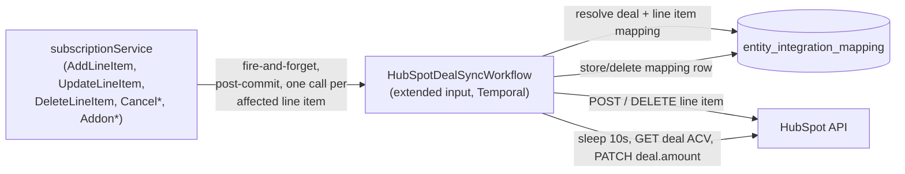
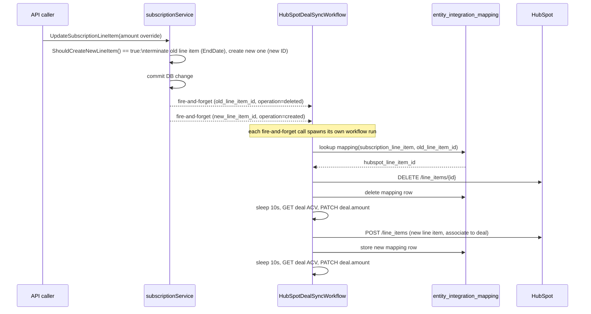
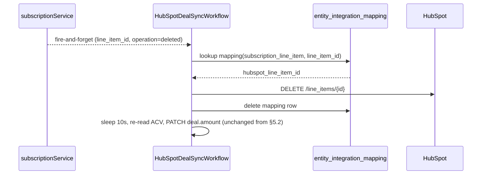

# HubSpot Deal Line Item Sync — keep Deal line items in sync as subscriptions change

- **Date:** 2026-07-27
- **Status:** Proposed — pending implementation
- **Reviewers:** *tbd*

---

## 1. Executive Summary

- **What ships:** Today, FlexPrice pushes a subscription's flat-rate line items into a HubSpot Deal exactly once, at subscription creation. Nothing re-syncs afterward. This design extends that one-shot sync into an ongoing, event-driven sync: whenever a `FIXED` line item is added or ends (including as the two-step effect of a quantity/price override, or a subscription/addon cancellation), the corresponding HubSpot Deal line item is created or deleted to match — and the Deal's `amount` is re-derived from HubSpot's own recalculated ACV afterward, same as today.
- **Scope constraint:** Deal line items only. Quote sync and Invoice sync are separate, already-working outbound flows and are explicitly out of scope. Usage-based line items stay excluded from the Deal (as today) — no fixed quantity/price to represent. No inbound sync — edits made directly on a HubSpot Deal never flow back into FlexPrice.
- **Data:** No new tables. Two additions to the existing `entity_integration_mapping` table (reused by every other provider integration in this codebase): a new `subscription_line_item` entity type (FlexPrice line item ID → HubSpot line item ID) and a new use of the existing `subscription` entity type (FlexPrice subscription ID → HubSpot deal ID), replacing today's ad hoc `customer.Metadata["hubspot_deal_id"]` lookup — with a backward-compatible fallback so subscriptions synced before this ships keep working.
- **New infra:** No new Temporal workflow type — the existing `HubSpotDealSyncWorkflow` (`TemporalHubSpotDealSyncWorkflow`) is extended in place to take a single mutated line item and an operation (`created` / `deleted`) instead of always syncing the full line item set, fired fire-and-forget from subscription-service call sites.
- **Reused:** `entity_integration_mapping` idempotency pattern, the existing `Deal.Outbound` sync-config flag (no new toggle), the existing ACV-read-back step, Temporal per-workflow retry policy (3 attempts), the fire-and-forget post-commit trigger pattern already used for subscription creation.
- **Deferred:** No periodic reconciliation safety net — a permanently failed sync (after 3 retries) surfaces only as a Failed workflow in Temporal UI, with no new alerting. No `Subscription.Outbound` config flag. No usage-based line items on the Deal.

## 2. Motivation

### 2.1 What we're building

FlexPrice already has a HubSpot integration (`internal/integration/hubspot/`) that, on subscription creation, creates line items on a customer's linked HubSpot Deal for every active flat-rate line item, then reads back HubSpot's calculated ACV to set the Deal amount. This works once. It was never extended to keep syncing as the subscription changes: adding a line item, changing a quantity, ending a line item, or cancelling the subscription entirely leaves the HubSpot Deal permanently stale relative to FlexPrice, with sales/CS looking at numbers that stopped being true the moment anything changed after signup.

This design closes that gap: every FlexPrice-side mutation to a `FIXED` line item on a HubSpot-linked subscription pushes a corresponding create/delete to HubSpot, keeping the Deal's line items — and therefore its ACV-derived amount — continuously accurate.

**Important correction from the original brainstorm:** FlexPrice's own line item model never mutates an existing `SubscriptionLineItem`'s price/quantity/amount in place. `UpdateSubscriptionLineItemRequest` ([dto/subscription_line_item.go:118](../../internal/api/dto/subscription_line_item.go)) has no `Quantity` field, and any override of `Amount`/`BillingModel`/`TierMode`/`Tiers`/`TransformQuantity`/commitment fields trips `ShouldCreateNewLineItem()`, which — inside a single `UpdateSubscriptionLineItem` call — terminates the existing line item (sets `EndDate`) and creates a brand-new line item row with a new ID ([subscription_line_item.go:445-552](../../internal/ee/service/subscription_line_item.go)). The only true in-place update path (`UpdateSubscriptionLineItem`'s `else` branch) touches only `Metadata`/commitment fields — never anything a HubSpot line item represents. So a "quantity change" is never a single field-level update; it is always **one delete + one create**, which this design already handles as two independent operations. There is no scenario that needs a PATCH-line-item call, so the HubSpot client gains no update/PATCH method — only create and delete.

### 2.2 Why we need it

Sales and CS teams work out of HubSpot, not FlexPrice. A Deal whose line items and amount only ever reflect day-one subscription state actively misleads anyone using it to forecast revenue, handle renewals, or answer "what is this customer paying us right now." Every comparable billing platform with a HubSpot integration (Chargebee's Quote-to-Cash app, for instance) treats "keep the CRM record in sync with subscription changes" as core, not optional — FlexPrice's integration was missing that half.

## 3. Goals & Non-Goals

### 3.1 Goals

- Every `FIXED`/active line item mutation on a HubSpot-linked subscription (add, end — including the delete+create pair produced by a quantity/price override, addon add/remove, subscription cancellation) results in exactly the affected HubSpot Deal line item(s) being created or deleted — without requiring a full resync of every line item on the Deal each time.
- Never touch HubSpot line items unaffected by a given mutation — unlike Tabs' existing delete-and-recreate-everything pattern, only the specific line item(s) that actually changed are created/deleted, preserving HubSpot's reporting/forecast continuity for everything else on the Deal.
- Move the subscription↔deal association off `customer.Metadata` (which assumes one Deal per customer) onto `entity_integration_mapping` (keyed per subscription), fixing the multi-subscription-per-customer collision — **without breaking subscriptions already synced under the old scheme**.
- Every sync activity is safe to retry blind (idempotent create, self-healing on 404), matching this repo's event-processing invariants.
- Zero new opt-in required: continues to be gated purely by the existing `Deal.Outbound` sync-config flag.

### 3.2 Non-Goals

- **No Quote sync or Invoice sync changes.** Those are separate, already-working outbound flows; this design does not touch them.
- **No usage-based line items on the Deal.** They have no fixed quantity/price to represent on a HubSpot line item and stay excluded, as today.
- **No inbound sync.** A sales rep editing a Deal's line item quantity directly in HubSpot never flows back into the FlexPrice subscription. This integration remains outbound-only, same direction as today.
- **No periodic reconciliation workflow.** Sync is purely event-driven; a permanently failed sync (all retries exhausted) is not auto-corrected by any background pass — it surfaces only via Temporal UI. Accepted trade-off for staying scoped to what was asked.
- **No new `Subscription.Outbound` sync-config flag.** `SyncConfig.Validate()` continues to reject `Subscription.Outbound: true`; this feature keeps gating on `Deal.Outbound`, since it is fundamentally deal-sync, not subscription-sync.
- **No new alerting/webhook on sync failure.** Failures are logged with full context and left visible in Temporal UI, consistent with how every other one-shot sync workflow in this codebase already fails today.

## 4. Terminology


| Term                         | Meaning                                                                                                                                                                                                                                                                                  |
| ---------------------------- | ---------------------------------------------------------------------------------------------------------------------------------------------------------------------------------------------------------------------------------------------------------------------------------------- |
| **Deal**                     | A HubSpot CRM object representing a sales opportunity. FlexPrice associates exactly one Deal per subscription (see §7).                                                                                                                                                                  |
| **Deal line item**           | A HubSpot object representing one priced item on a Deal (`hs_line_item`), with `quantity`, `price`, `amount`, `hs_recurring_billing_period`. This design only ever creates or deletes these — never updates one in place (see §2.1).                                                    |
| **ACV**                      | Annual Contract Value — a property HubSpot itself calculates on a Deal from its associated line items' recurring amounts. FlexPrice never computes this manually; it always reads HubSpot's own calculation back after a line item change (existing behavior, unchanged by this design). |
| `entity_integration_mapping` | Existing table mapping a FlexPrice entity to a provider-side identifier, reused here for two new/expanded mapping kinds — see §7.                                                                                                                                                        |
| **FIXED line item**          | A `subscription.SubscriptionLineItem` with `PriceType == types.PRICE_TYPE_FIXED` — a flat-rate charge, as opposed to usage-based. Only these sync to HubSpot, same as today.                                                                                                             |


## 5. High-Level View

### 5.1 System context




### 5.2 Sequence — quantity/price override (delete old line item + create new one)




### 5.3 Sequence — line item ended




## 6. Current State (Baseline) — what we reuse and what changes

### 6.1 What exists today

- `DealSyncService.SyncSubscriptionToDeal` ([deal.go](../../internal/integration/hubspot/deal.go)) — creates HubSpot line items for every active `FIXED` line item on a subscription, called exactly once via `triggerHubSpotDealSyncWorkflow` at subscription creation ([subscription.go:563](../../internal/ee/service/subscription.go)).
- `HubSpotDealSyncWorkflow` ([hubspot_deal_sync_workflow.go](../../internal/temporal/workflows/hubspot_deal_sync_workflow.go)) — 3-step workflow: create line items → sleep 10s → read ACV and update deal amount.
- Deal ID resolution: `customer.Metadata["hubspot_deal_id"]` — assumes one Deal per customer.
- HubSpot line item IDs created by the sync are **never persisted anywhere** — no way to locate them again for update/delete.
- Gated on `connection.IsDealOutboundEnabled()` (`SyncConfig.Deal.Outbound`).

### 6.2 What's new

- `DealSyncService` gains a `DeleteHubSpotLineItem` method alongside the existing `createHubSpotLineItem`, both operating against a single line item rather than the full set. No update/PATCH method is added — FlexPrice never mutates a line item's HubSpot-relevant fields in place (see §2.1 correction).
- `HubSpotDealSyncWorkflow` keeps its registered workflow type name (no Temporal registration churn) but its input is extended to `{subscription_id, line_item_id, operation}` instead of just `{subscription_id}`; the creation call site is updated to fire once per line item with `operation=created` instead of syncing the whole set inline.
- `entity_integration_mapping` gains a `subscription_line_item` entity type and a `subscription` → HubSpot-deal-id mapping (see §7).
- Five subscription-service call sites gain a trigger, per §8.

## 7. Data Model

No schema changes — both mapping kinds reuse the existing `entity_integration_mapping` table.

### 7.1 `subscription` → HubSpot deal ID (new usage of an existing `IntegrationEntityType`)

```
entity_type:        subscription
entity_id:          <subscription.ID>
provider_type:      hubspot
provider_entity_id: <hubspot_deal_id>
```

Resolution order (backward compatible with subscriptions synced before this ships):

```
resolveDealID(ctx, sub, customer):
    1. row := entity_integration_mapping.Get(entity_type=subscription, entity_id=sub.ID, provider=hubspot)
       if found: return row.ProviderEntityID
    2. dealID := customer.Metadata["hubspot_deal_id"]   // today's only source, unchanged
       if dealID != "":
           persist entity_integration_mapping(subscription, sub.ID, hubspot, dealID)  // backfill
           return dealID
    3. return "", not-linked  // same as today: skip sync silently
```

How a Deal first gets associated with a customer is unchanged by this design (still `customer.Metadata["hubspot_deal_id"]`, set by the existing inbound webhook flow) — only *where the subscription-level link is stored* changes, and only to fix multi-subscription collisions going forward.

### 7.2 `subscription_line_item` → HubSpot line item ID (new `IntegrationEntityType`)

```
entity_type:        subscription_line_item   (NEW constant in internal/types/entityintegrationmapping.go)
entity_id:          <subscription.SubscriptionLineItem.ID>
provider_type:      hubspot
provider_entity_id: <hubspot line item id>
metadata:           { "deal_id": "..." }
```

Written on `created`, read/deleted on `deleted` (or self-healed away on a 404 from HubSpot — see §9).

## 8. Approach

### 8.1 Trigger call sites in `subscriptionService`

All fire the workflow fire-and-forget, after the DB transaction commits — same pattern as today's `triggerHubSpotDealSyncWorkflow` call. Each skips silently (no workflow fired) if `resolveDealID` finds nothing, or the mutated line item is not `FIXED`+active. A single API call can fire more than one workflow trigger (e.g. an override fires both a `deleted` and a `created`).


| Call site                                                                | Mutation                                                                  | Operation(s) fired                                       |
| ------------------------------------------------------------------------- | -------------------------------------------------------------------------- | ------------------------------------------------------- |
| `AddSubscriptionLineItem`                                                | new line item                                                             | `created` (new line item)                                |
| `DeleteSubscriptionLineItem`                                             | line item ended                                                          | `deleted` (terminated line item)                         |
| `UpdateSubscriptionLineItem`, `ShouldCreateNewLineItem()` branch         | price/amount/tier/commitment override — terminates old, creates new       | `deleted` (old line item ID) **and** `created` (new line item ID) |
| `UpdateSubscriptionLineItem`, metadata-only branch                       | metadata/commitment-only update, same line item ID, no price/qty change   | none — HubSpot line item has nothing to sync              |
| `AddAddonToSubscription` → `createLineItemFromPrice`                     | addon adds a line item                                                    | `created`                                                |
| `RemoveAddonFromSubscription` / `cancelAddonsForSubscription`            | addon removed                                                             | `deleted`                                                |
| `CancelSubscription` → `cancelAllLineItemsForSubscription`               | subscription cancelled                                                    | `deleted` per mapped line item                           |


### 8.2 `HubSpotDealSyncWorkflow` (extended)

Extends today's 3-step shape; step 1 branches on `operation` instead of always creating:

1. **Create/Delete** — per `operation`:
  - `created`: if a mapping row already exists for this line item (retry-safety), treat as a no-op (already synced) instead of double-creating. Otherwise `POST /line_items`, associate to the deal, persist the mapping.
  - `deleted`: look up the mapping; `DELETE /line_items/{id}`; delete the mapping row. A 404 here is treated as already-done (no-op), not a failure. A missing mapping row (never synced in the first place, e.g. the line item wasn't `FIXED` at creation time) is also a no-op.
2. **Sleep 10s** — unchanged, gives HubSpot time to recalculate ACV.
3. **Update deal amount from ACV** — unchanged from today's `UpdateDealAmountFromACV`.

Activity retry policy: 3 attempts (unchanged from today).

### 8.3 Feature gating

Unchanged: every step above is skipped unless `connection.IsDealOutboundEnabled()` (`SyncConfig.Deal.Outbound == true`) — the same flag today's one-shot sync already checks.

## 9. Error Handling & Idempotency

- **Retries**: Temporal `RetryPolicy{MaximumAttempts: 3}`, matching today.
- **Permanent failure**: logged with `subscription_id`, `line_item_id`, `deal_id`, `operation`, and the error; left as a Failed workflow in Temporal UI. No auto-retry beyond the policy, no new alerting — consistent with every other one-shot sync workflow in this codebase.
- **Idempotent create**: an existing mapping row for the line item short-circuits `created` into a no-op, so a retried "created" workflow never double-creates.
- **Self-healing on drift**: a 404 from HubSpot on `DELETE` (deal or line item removed on HubSpot's side) deletes the stale local mapping rather than failing the workflow — the next mutation on that line item creates fresh, rather than requiring a reconciliation pass to notice the mapping is stale.
- **Ordering**: each workflow instance only ever touches the one `subscription_line_item_id` it was given, reading current DB state at activity-execution time rather than a stale snapshot captured when the event fired — so two rapid mutations to the same line item can't clobber each other with stale data, even if their workflows complete out of order.

## 10. Rollout Plan

- Add `subscription_line_item` to `IntegrationEntityType` (+ validation).
- Extend `DealSyncService` with per-line-item create/delete methods and the mapping-backed `resolveDealID`.
- Extend `HubSpotDealLineItemSyncWorkflow` input/branching; update Temporal registration if the workflow name changes.
- Wire the trigger call sites in `subscriptionService` per §8.1.
- Backfill happens automatically and lazily (§7.1, step 2) — no explicit migration script needed; existing HubSpot-linked subscriptions get their `entity_integration_mapping` row the first time any line item on them changes after this ships.
- No config/flag rollout needed — ships gated on the existing `Deal.Outbound` flag, so tenants already opted into Deal sync get the new behavior automatically.

## 11. Open Questions

- Should `AddAddonToSubscription`/`RemoveAddonFromSubscription` reuse the exact same `created`/`deleted` operations as plain line items, or do addons need distinct HubSpot line item naming/description conventions? Current assumption: no difference — an addon's line item is still just a `subscription.SubscriptionLineItem` under the hood via `createLineItemFromPrice`.
- Confirm HubSpot Line Items API rate limits are not a concern for tenants with high-frequency line item churn (e.g. many quick quantity adjustments in a row) — Temporal's built-in retry/backoff should absorb transient 429s, but worth a quick check against HubSpot's documented limits during implementation.

## 12. Decisions Log


| Decision                  | Choice                                                                                                      | Why                                                                                                                                           |
| ------------------------- | ----------------------------------------------------------------------------------------------------------- | --------------------------------------------------------------------------------------------------------------------------------------------- |
| Scope                     | Deal line items only                                                                                        | Quote/Invoice sync already work; user explicitly scoped this to the Deal line item gap.                                                       |
| Trigger model             | Event-driven only, no reconciliation                                                                        | Simplicity; matches what was asked. Accepted risk: a permanently failed sync isn't self-healed by a background pass.                          |
| Update strategy           | Create + delete only, no PATCH/update                                                                       | FlexPrice never mutates a line item's price/quantity in place (any override terminates-and-recreates); building an unused PATCH path would be dead code. Only the specific changed line item(s) are touched — never a full-Deal resync (unlike Tabs' delete-and-recreate-everything pattern), which is what preserves HubSpot's reporting/forecast continuity. |
| Deal↔subscription mapping | Per-subscription via `entity_integration_mapping`, with backward-compatible fallback to `customer.Metadata` | Fixes the one-deal-per-customer collision for customers with multiple subscriptions, without breaking anything already synced.                |
| Feature gating            | Keep `Deal.Outbound`, no new `Subscription.Outbound` flag                                                   | This is deal sync, not subscription sync; `SyncConfig.Validate()` already rejects `Subscription.Outbound` and there's no need to change that. |
| Usage-based line items    | Stay excluded                                                                                               | No fixed quantity/price to represent; not the problem being solved here.                                                                      |
| Failure surfacing         | Log + Temporal UI only                                                                                      | Consistent with how every other one-shot sync workflow in this codebase already fails; no new alerting infra requested.                       |


