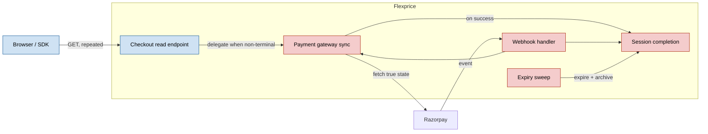
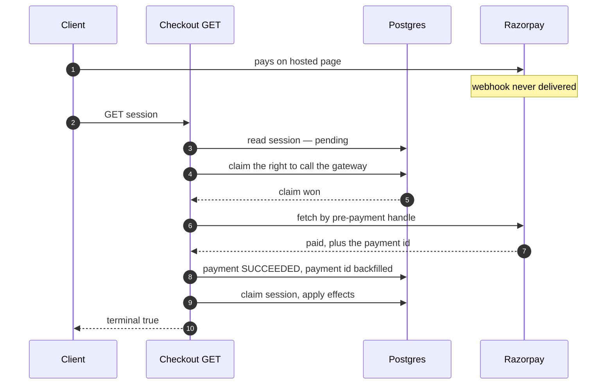
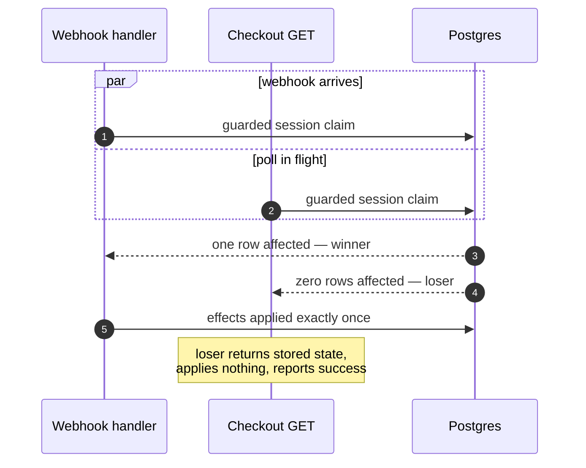
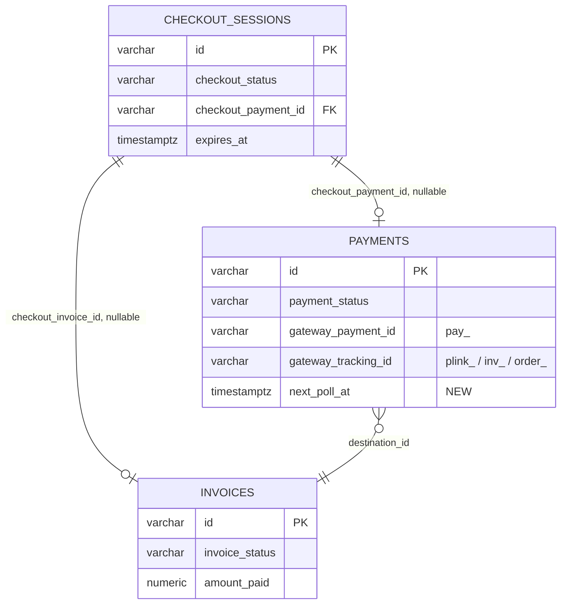
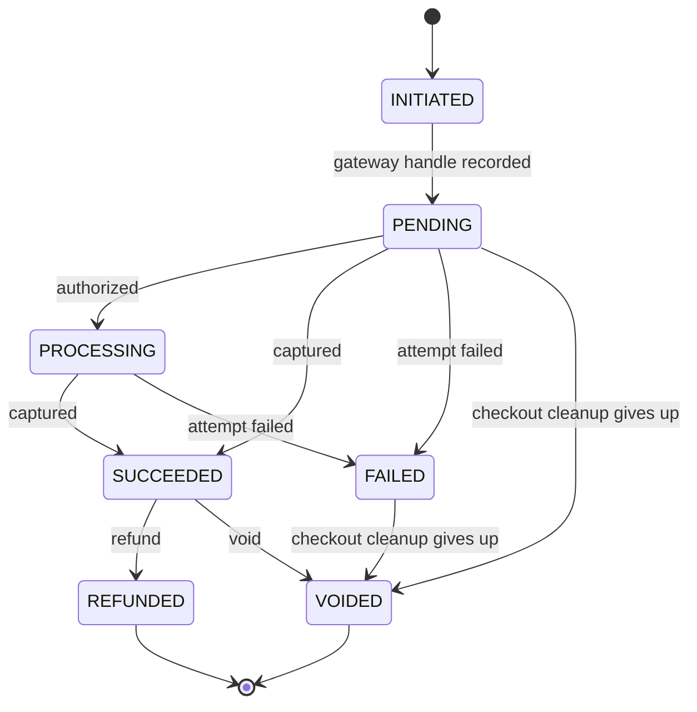
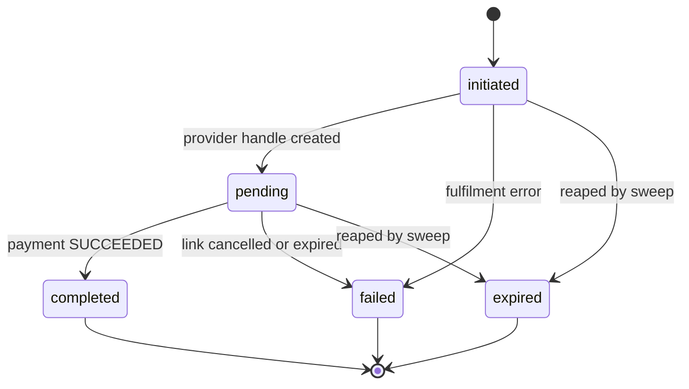

# Checkout Session Polling — Design ERD

Date: 2026-08-11  
Related: [Payment-gated subscription create](2026-08-07-payment-gated-subscription-create.md), [Payment-gated addon attach](2026-08-06-payment-gated-addon-attach.md), [Payment-gated wallet top-up](2026-07-20-payment-gated-wallet-topup.md), [Payment-gated quantity change](2026-07-17-payment-gated-quantity-change.md), [Razorpay UPI autocharge](2026-07-11-razorpay-upi-autocharge.md)

---

## 1. Problem

A customer pays on a Razorpay-hosted page. The only thing that tells us they paid is Razorpay's
webhook. If it's late, dropped, or errors, the customer watches a spinner while their money is
gone and their subscription doesn't exist.

The frontend has no way to ask "is it done?". `GET /v1/checkout/sessions/{id}` returns stored
state and never consults the gateway, so polling it returns the same stale answer forever.

Three separable problems get conflated here. **v0 solves only A.**


|       | Problem                                                                                         | v0?                  |
| ----- | ----------------------------------------------------------------------------------------------- | -------------------- |
| **A** | Customer present and waiting can't ask "is it done?"                                            | **yes**              |
| **B** | Customer left, webhook never arrived, nothing recovers                                          | no — needs a sweeper |
| **C** | Payment status writes are unguarded read-modify-write; duplicate webhooks double-count invoices | no                   |


B and C are pre-existing. Polling neither creates nor worsens them.

**v0 introduces no new mutation.** `CompleteCheckoutSession` already exists, already runs from
the webhook, and already has a terminal guard plus an atomic claim. The poll is a *second
trigger* for a transition that is already reachable. That is why v0 is small.

---


## 2. Why polling

**Webhook-only** stays required — it's the only thing that works when the customer has gone —
but a webhook is a push to us, invisible to the customer's browser.

**Long polling / SSE** convert a cheap read into a held connection for up to a full checkout.
Deferred, not rejected.

**Client-driven** `POST /complete` makes the browser a participant in a money-moving
transition. Any server-side verification we'd bolt on re-derives the gateway fetch that polling
already does — polling with a worse verb and a trust problem.

**Chosen: idempotent read-triggered reconciliation.** The client polls an ordinary GET. When the
session is non-terminal and a debounce window has elapsed, the server asks the gateway what
happened and routes any transition through the existing completion routine. The client asserts
nothing.

This is close to industry consensus. Stripe instructs you to call one `fulfill_checkout` from
*both* the webhook and the return page, and to make it safe when "called multiple times,
possibly concurrently, for the same Checkout Session"
([Stripe](https://docs.stripe.com/checkout/fulfillment)). Chargebee goes further — "Webhooks are
asynchronous and are not recommended for time-critical applications" — and ships a manual
**Sync Now** button that fetches gateway status for stuck transactions
([Chargebee](https://www.chargebee.com/docs/billing/2.0/site-configuration/events_and_webhooks)).
Orb and Metronome avoid the problem by not owning payments. We own them, so we inherit it.

---


## 3. How it works




**Webhook lost, poll settles it:**




**Both race — the atomic claim resolves it:**




**Gateway down:** every gateway error, timeout and rate-limit refusal inside the refresh path is
logged and swallowed. The endpoint returns HTTP 200 with stored state. A customer whose payment
succeeded and whose page shows an error is strictly worse off than one who sees "processing".

---


## 4. The three provider paths

The least obvious part of the design. One gateway, three checkout mechanics, each producing a
different identifier at a different time — and the identifier decides which API can answer "did
this pay?".


| Path                                                        | Handle at creation       | Polled via         | `pay_` appears          |
| ----------------------------------------------------------- | ------------------------ | ------------------ | ----------------------- |
| Hosted payment link (`send_invoice`)                        | payment-link id `plink_` | payment-link fetch | after the customer pays |
| Authorisation link (`charge_automatically`, no saved token) | **invoice** id `inv_`    | invoice fetch      | after the customer pays |
| Saved-token charge (`charge_automatically`, token exists)   | `pay_` **immediately**   | payment fetch      | at creation             |
| …same, retry-guard variant                                  | order id `order_`        | order fetch        | after authorisation     |


`pay_` **is the source of truth; the other handles are bootstrap scaffolding.** They exist only  
to answer "has anyone paid yet?". The moment a poll discovers a `pay_`, it is stored and every  
later poll uses the payment fetch. The sync routine already prefers `gateway_payment_id` when  
present, so v0 extends an existing preference.

---


## 5. Expiry, grace, and cleanup

A checkout session and a payment have coupled but non-identical lifecycles, and most consistency
hazards live in the gap.

A session provisions a **draft subscription and draft invoice ahead of payment**. When it ends
unpaid, cleanup **archives** everything it provisioned — payment, invoice, subscription, pending
addon associations — then marks the session `failed` or `expired`. Cleanup is guarded (returns
immediately if already terminal) and best-effort per child (individual archive failures are
logged and skipped).

### 5.1 Expiry is enforced at the gateway,

Today `expires_at` is a private constant Razorpay knows nothing about, so a customer can pay on
a still-live link after we consider the session dead. The sweep's 30-minute cadence against a
15-minute expiry created an accidental 0–30 minute grace window that masked this.

**Decision: push expiry to the gateway; no grace.**

- We send an expiry to Razorpay so the link **stops accepting payment** at a time we chose.
- Our `expires_at` is deliberately **later** than the gateway's, absorbing clock skew and
in-flight requests.
- A payment arriving after our `expires_at` is **rejected**. It should not be able to happen,
because the gateway closed first.
- The sweep reaps whenever its cadence fires. Its interval is now purely a housekeeping-latency
knob and no longer influences whether a payment is honoured.

`expires_at` now means exactly one thing: *the gateway will not take money after this.* Cleanup
timing becomes independent of payment correctness.

**The current 15-minute session expiry cannot survive this.** Measured against the live gateway:


| `expire_by` sent | Result                                                                  |
| ---------------- | ----------------------------------------------------------------------- |
| now + 5m         | rejected — `expire_by should be at least 15 minutes after current time` |
| now + 14m        | rejected — same                                                         |
| now + 16m        | accepted                                                                |


So `gateway_window ≥ 15m`, and the rule is `gateway_window < our_window`, therefore
`our_window > 15m`. **Session expiry must be raised.** Proposed:


| Value                | Setting       | Why                                                                            |
| -------------------- | ------------- | ------------------------------------------------------------------------------ |
| Gateway `expire_by`  | `now() + 16m` | one minute above the hard floor, covering skew and request latency             |
| Session `expires_at` | `now() + 20m` | ~4 minutes later, absorbing payments authorised just before the gateway closes |


Computed as `expire_by = max(session.expires_at − buffer, now() + 16m)` so the floor is explicit
and cannot be violated.

### Where the lifecycles diverge


| #   | State                                          | Cause                                                                       | Repaired by                                            |
| --- | ---------------------------------------------- | --------------------------------------------------------------------------- | ------------------------------------------------------ |
| C1  | payment `SUCCEEDED`, session `pending`         | crash between the two writes (separate transactions)                        | next poll or webhook; **nothing if the tab is closed** |
| C2  | session `completed`, invoice still `DRAFT`     | settlement partially failed                                                 | nothing — manual                                       |
| C3  | session `expired`, payment row still live      | per-child archive failure during cleanup                                    | nothing — manual                                       |
| C4  | invoice `OVERPAID`                             | duplicate webhook double-counts `amount_paid`                               | nothing — problem C                                    |
| C5  | wallet debited twice                           | reconciling onto a **draft** invoice, then finalisation re-applying credits | **prevented by PR-1**                                  |
| C6  | payment succeeds after the session is terminal | debit landed post-expiry                                                    | refund                                                 |


---


## 6. Invariants


| #      | Invariant                                                | Enforced by                                                                                        |
| ------ | -------------------------------------------------------- | -------------------------------------------------------------------------------------------------- |
| **I1** | At most one gateway call per payment per debounce window | A conditional UPDATE reserving the right to call, using the database clock on both sides           |
| **I2** | Effects applied at most once per session                 | The existing completion claim — a guarded status update. Zero rows affected means someone else won |
| **I3** | The read never 5xxs because of the gateway               | Every gateway failure inside the refresh path is swallowed; stored state is returned               |
| **I4** | No transition reachable *only* via the read              | The read calls the same completion routine the webhook calls                                       |
| **I5** | The gateway is authoritative, never the client           | Status is derived from a gateway fetch, never a request body                                       |


I1 bounds cost, I2 bounds correctness. Independent, both required.

---


## 7. Non-goals

Closed tab + lost webhook (needs the sweeper). Late-authorisation latency. Guarded payment
status transitions. Effects in one transaction. A transactional outbox. Consolidating the three
mutators. Non-Razorpay gateways.

---


## 8. Data model and state machines

One new column: `payments.next_poll_at` — `timestamptz`, nullable, no default, plain
single-column btree index.

Plain and not partial deliberately: the migrator runs with  
`WithSkipChanges(DropIndex | DropColumn | ModifyIndex)`. A partial index that drifts can't even be repaired by the normal path. Plain gets the  
selectivity anyway — Postgres btrees don't index NULLs for single-column indexes.




`checkout_payment_id` is **nil on every insert** and stays nil if fulfilment fails — the poll
path must tolerate it.

### Payment status




Terminal is `VOIDED | REFUNDED`. `SUCCEEDED` is deliberately not terminal — an authorised payment
can still be voided or refunded.

`FAILED` **means "this attempt failed", not "this payment is dead."** A late authorisation can
still move it. When a checkout session is cleaned up, its payment is driven to `VOIDED`,
which is unambiguously terminal for every reader. 

### Checkout status




### Who may do what


| Transition                          | Webhook                      | Poll (v0)                  | Expiry sweep                   |
| ----------------------------------- | ---------------------------- | -------------------------- | ------------------------------ |
| `initiated` → `pending`             | no                           | no                         | no — creation path only        |
| `pending` → `completed`             | yes                          | **yes, new**               | no                             |
| `pending` → `failed`                | yes — link cancelled/expired | no                         | no                             |
| `initiated` / `pending` → `expired` | no                           | no                         | yes                            |
| payment → `SUCCEEDED`               | yes                          | **yes, new**               | no                             |
| payment → `FAILED`                  | yes                          | yes — via the sync routine | no                             |
| payment → `VOIDED`                  | no                           | no                         | **yes — cascade from cleanup** |
| archive drafts                      | no                           | no                         | yes                            |


The poll gains exactly two capabilities, both of which the webhook already had. It cannot fail,
expire, or archive anything — which is what makes **I4** hold.

The expiry sweep is *checkout-scoped*. It touches payments only as a cascade of tearing down a
session, never on its own initiative.

---


## 9. Concurrency

The claim:

```sql
UPDATE payments
SET    next_poll_at = now() + $4::interval, updated_at = now()
WHERE  id = $1 AND tenant_id = $2 AND environment_id = $3
  AND  (next_poll_at IS NULL OR next_poll_at <= now())
RETURNING *
```

**Read before claim.** The handler reads the session first and evaluates the debounce against
that. Fifty concurrent polls inside one window therefore produce fifty primary-key selects and
zero updates. Claim-first would make all fifty issue the UPDATE and forty-nine wait on the row
lock — same correctness, far worse behaviour.

The webhook passes `force`, skipping the debounce check but **still taking the claim**, so two
simultaneous webhooks don't both call the gateway.


| Race                       | Resolved by                                  | Loser sees                                   |
| -------------------------- | -------------------------------------------- | -------------------------------------------- |
| poll vs poll (any process) | the claim                                    | zero rows → stored state                     |
| poll vs webhook            | the claim, then the session completion claim | `ErrAlreadyExists`, treated as success       |
| poll vs expiry sweep       | both guard on terminal status first          | sweep skips completed; poll returns terminal |


---

## 10. API contract

Route unchanged: `GET /v1/checkout/sessions/{id}`. No new endpoint, no new verb.

### What it returns today

```json
{
  "id": "cs_01KZNG78VW7RFCHHJBQYA9SPAA",
  "checkout_status": "completed",
  "checkout_invoice_id": "inv_...",
  "checkout_payment_id": "pay_01K...",
  "expires_at": "2026-08-10T09:46:52Z",
  "completed_at": "2026-08-10T09:37:25Z",
  "status": "published",
  "tenant_id": "tenant_01K...",
  "created_by": "user_01K...",
  "updated_by": ""
}
```

Two problems visible in that live response. `status: "published"` is the base-mixin row state
leaking through the embedded domain model — it is not the checkout's status and means nothing to
a caller. And `tenant_id` / `created_by` / `updated_by` are internal audit fields.

There is also no `payment_action`, because completion nulled `provider_result` — the clobbering
bug. A client that read the redirect URL before completion finds it gone afterwards.

### What it returns after v0

```json
{
  "id": "cs_01KZNG78VW7RFCHHJBQYA9SPAA",
  "customer_id": "cust_01K...",
  "action": "add_addon",
  "payment_provider": "razorpay",

  "checkout_status": "pending",
  "terminal": false,

  "payment": {
    "id": "pay_01K...",
    "status": "PROCESSING",
    "gateway": "razorpay"
  },

  "checkout_invoice_id": "inv_...",
  "checkout_payment_id": "pay_01K...",

  "expires_at": "2026-08-10T09:46:52Z",
  "completed_at": null,
  "created_at": "2026-08-10T09:31:52Z",

  "next_poll_after_ms": 2000,
  "stale": false,

  "payment_action": { "type": "payment_link", "url": "https://rzp.io/..." }
}
```


### Field by field


| Field                | New?    | Meaning                                                                                                                                                                                    |
| -------------------- | ------- | ------------------------------------------------------------------------------------------------------------------------------------------------------------------------------------------ |
| `checkout_status`    | kept    | The real status. **Name unchanged** — renaming it to `status` would break existing readers for no gain                                                                                     |
| `terminal`           | **new** | `checkout_status ∈ {completed, failed, expired}`. Saves every client hardcoding that set and getting it wrong when we add a state                                                          |
| `payment`            | **new** | Nullable block. `null` when the session has no payment yet — which is every session at insert, and permanently if fulfilment failed                                                        |
| `next_poll_after_ms` | **new** | Server-driven backoff. `0` when terminal, meaning stop                                                                                                                                     |
| `stale` | **new** | `true` when this response is stored state because the gateway was not consulted on this request — debounced, timed out, or rate-limited. Computed per-request; **needs no column**. Lets a UI say "still checking" rather than showing a stale answer as fact |
| `payment_action`     | kept    | Redirect URL. Requires fixing the `provider_result` clobber, or it vanishes after completion                                                                                               |
|                      |         |                                                                                                                                                                                            |


### Backoff

`next_poll_after_ms` and the server-side debounce are both functions of session age. They are
different numbers on purpose: the hint is what a well-behaved client should do, the debounce is
the floor enforced regardless of client behaviour.


| Session age       | Debounce (server floor) | `next_poll_after_ms` (client hint) |
| ----------------- | ----------------------- | ---------------------------------- |
| < 30s             | 500 ms                  | 1000                               |
| 30s – 2m          | 2 s                     | 2000                               |
| 2m – `expires_at` | 10 s                    | 5000                               |
| past `expires_at` | 60 s                    | 15000                              |
| terminal          | —                       | 0                                  |


The hint is roughly double the debounce so a single well-behaved client gets a fresh gateway  
check on most polls. The debounce is not there to throttle that client — it is there for the  
case of several tabs, a retry loop, or a poll colliding with the webhook and the sweep.

