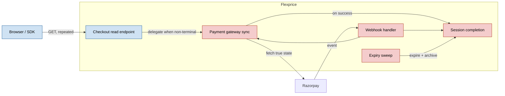
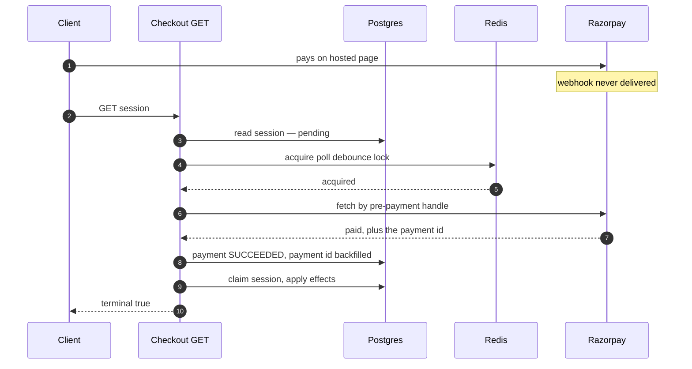
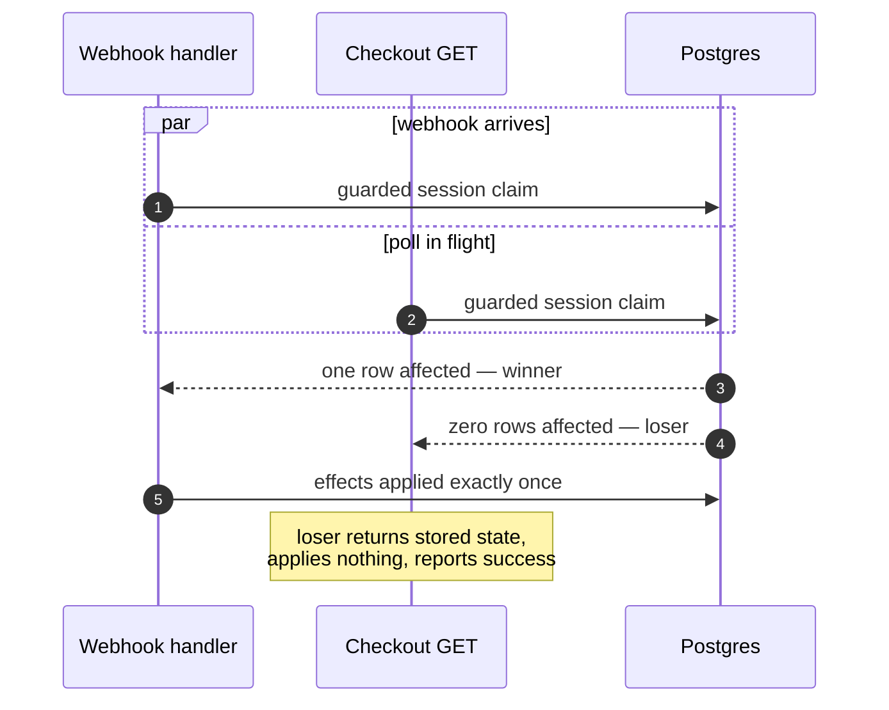
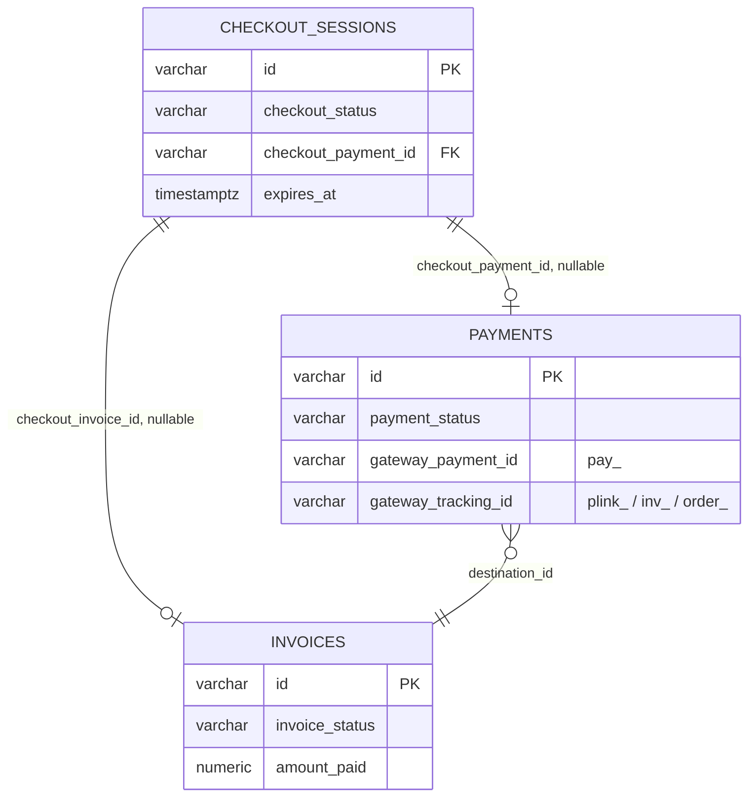
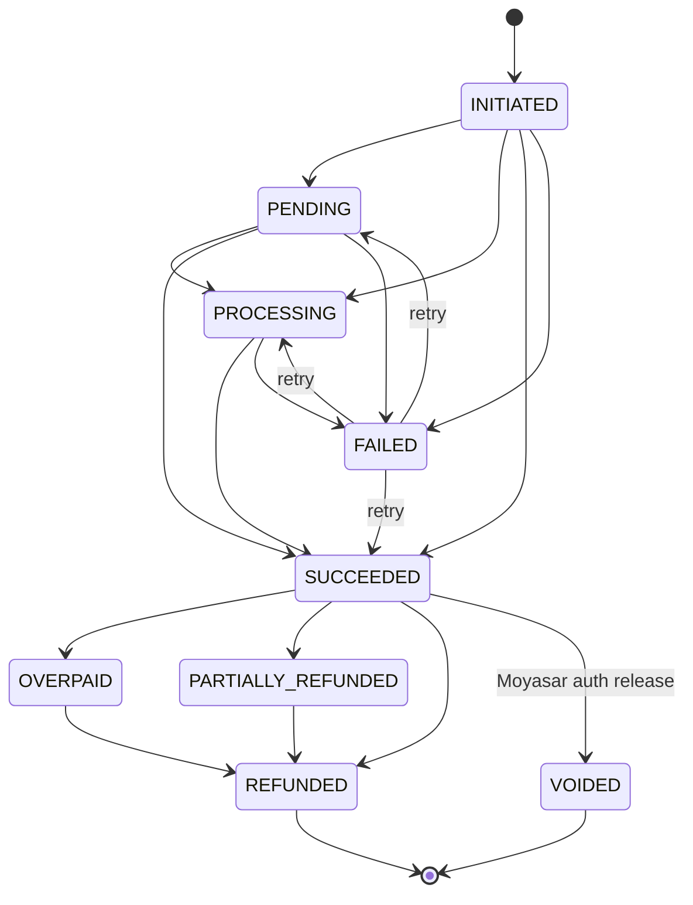
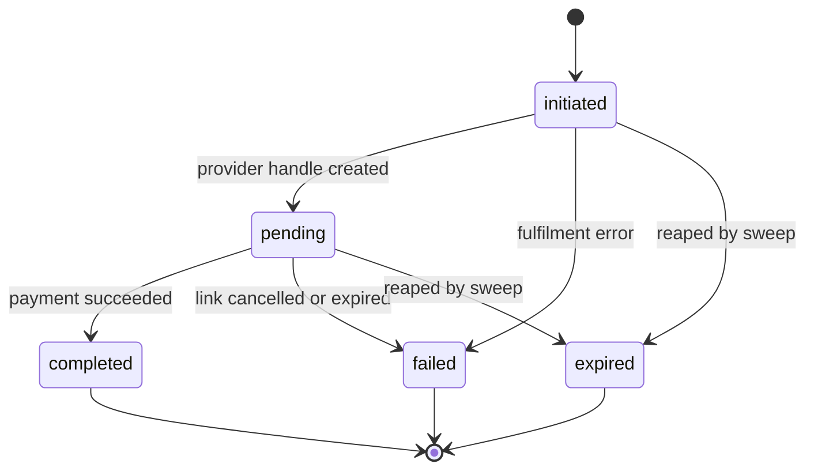

# Checkout Session Polling — Design ERD

Date: 2026-08-11  
Related: [Payment-gated subscription create](2026-08-07-payment-gated-subscription-create.md), [Payment-gated addon attach](2026-08-06-payment-gated-addon-attach.md), [Payment-gated wallet top-up](2026-07-20-payment-gated-wallet-topup.md), [Payment-gated quantity change](2026-07-17-payment-gated-quantity-change.md), [Razorpay UPI autocharge](2026-07-11-razorpay-upi-autocharge.md)

---

## 1. Problem

A customer pays on a Razorpay-hosted page. The only thing that tells us they paid is Razorpay's
webhook. If it's late, dropped, or errors, the customer watches a spinner while their money is
gone and their subscription doesn't exist.

The frontend has no way to ask "is it done?". `GET /v1/checkout/sessions/{id}` returns stored  
state and never consults the gateway, so polling it returns the same stale answer forever.

---


## 2. Why polling

**Webhook-only** stays required — it's the only thing that works when the customer has gone —  
but a webhook is a push to us, invisible to the customer's browser.

**Client-driven** `POST /complete` makes the browser a participant in a money-moving
transition. Any server-side verification we'd bolt on re-derives the gateway fetch that polling
already does — polling with a worse verb and a trust problem.

**Chosen: idempotent read-triggered reconciliation.** The client polls an ordinary GET. When the
session is non-terminal and a debounce window has elapsed, the server asks the gateway what
happened and routes any transition through the existing completion routine. The client asserts
nothing.

This is close to industry consensus. Stripe instructs you to call one `fulfill_checkout` from
*both* the webhook and the return page, and to make it safe when "called multiple times,
possibly concurrently, for the same Checkout Session"
([Stripe](https://docs.stripe.com/checkout/fulfillment)). Chargebee goes further — "Webhooks are
asynchronous and are not recommended for time-critical applications" — and ships a manual
**Sync Now** button that fetches gateway status for stuck transactions
([Chargebee](https://www.chargebee.com/docs/billing/2.0/site-configuration/events_and_webhooks)).
Orb and Metronome avoid the problem by not owning payments. We own them, so we inherit it.

---


## 3. How it works




**Webhook lost, poll settles it:**




**Both race — the atomic claim resolves it:**




**Gateway down:** every gateway error, timeout and rate-limit refusal inside the refresh path is
logged and swallowed. The endpoint returns HTTP 200 with stored state. A customer whose payment
succeeded and whose page shows an error is strictly worse off than one who sees "processing".

---


## 4. The three provider paths

The least obvious part of the design. One gateway, three checkout mechanics, each producing a
different identifier at a different time — and the identifier decides which API can answer "did
this pay?".


| Path                                                        | Handle at creation       | Polled via         | `pay_` appears          |
| ----------------------------------------------------------- | ------------------------ | ------------------ | ----------------------- |
| Hosted payment link (`send_invoice`)                        | payment-link id `plink_` | payment-link fetch | after the customer pays |
| Authorisation link (`charge_automatically`, no saved token) | **invoice** id `inv_`    | invoice fetch      | after the customer pays |
| Saved-token charge (`charge_automatically`, token exists)   | `pay_` **immediately**   | payment fetch      | at creation             |
| …same, retry-guard variant                                  | order id `order_`        | order fetch        | after authorisation     |


`pay_` **is the source of truth; the other handles are bootstrap scaffolding.** They exist only  
to answer "has anyone paid yet?". The moment a poll discovers a `pay_`, it is stored and every  
later poll uses the payment fetch. The sync routine already prefers `gateway_payment_id` when  
present, so v0 extends an existing preference.

---


## 5. Expiry, grace, and cleanup

A checkout session and a payment have coupled but non-identical lifecycles, and most consistency
hazards live in the gap.

A session provisions a **draft subscription and draft invoice ahead of payment**. When it ends
unpaid, cleanup **archives** everything it provisioned — payment, invoice, subscription, pending
addon associations — then marks the session `failed` or `expired`. Cleanup is guarded (returns
immediately if already terminal) and best-effort per child (individual archive failures are
logged and skipped).

### 5.1 Two expiries, and the grace between them

There are two deadlines, not one, and they exist for different reasons.


| Deadline                | Value                         | Owned by | Meaning                                  |
| ----------------------- | ----------------------------- | -------- | ---------------------------------------- |
| **Payment link expiry** | the provider's minimum        | Razorpay | the link stops accepting new payments    |
| **Checkout expiry**     | link expiry **+ 5 min grace** | us       | we stop waiting and tear the drafts down |


The gateway closes **first**. That is what makes the grace safe: once the link is dead no *new*  
payment can start, so the grace window only ever covers a payment that was **already in flight**  
when the link closed. Its purpose is precisely that — **capture late payments** rather than  
refund a customer who pressed pay a few seconds before the deadline and whose bank was slow.

### 5.2 What the sweeper does at expiry

The sweeper never simply gives up. Before reaping, it does **one last best-effort fetch** of the
payment from the gateway if the local record has not been updated, then decides:

```
payment succeeded, and it happened before checkout expiry   -> complete the checkout
payment succeeded, but it happened after checkout expiry    -> refund, then fail the checkout
no successful payment                                       -> void the payment, fail the checkout
```

This is what makes the grace window real rather than decorative: a payment that lands inside the  
grace is completed by the sweeper even if no webhook and no poll ever saw it.

---


## 6. Invariants


| #      | Invariant                                                | Enforced by                                                                          |
| ------ | -------------------------------------------------------- | ------------------------------------------------------------------------------------ |
| **I1** | At most one gateway call per payment per debounce window | Redis lock on payment id                                                             |
|        |                                                          |                                                                                      |
| **I2** | The read never 5xxs because of the gateway               | Every gateway failure inside the refresh path is swallowed; stored state is returned |
| **I3** | One reconcile method to rule them all                    | All state transitions are powered via the same method                                |
|        |                                                          |                                                                                      |


---


## 8. Data model and state machines




### Payment status




#### "Terminal" means two different things


| Question                                             | States                            | Who asks                          |
| ---------------------------------------------------- | --------------------------------- | --------------------------------- |
| **Lifecycle-terminal** — can this ever change again? | `REFUNDED`, `VOIDED`              | refund and void guards            |
| **Settlement-terminal** — is the outcome known?      | `SUCCEEDED`, `REFUNDED`, `VOIDED` | reporting, invoice reconciliation |


`SUCCEEDED` is settlement-terminal but **not** lifecycle-terminal: a refund can still follow.

#### The one required change: `FAILED` is not terminal

`FAILED` means *this attempt failed*, not *this payment is dead*. A customer whose card declines  
can retry on the same still-live link, and the same payment row is reused with its  
`gateway_payment_id` overwritten.

The fix is to let `FAILED` behave like `PENDING` again: `{FAILED, PENDING, PROCESSING, SUCCEEDED, OVERPAID}`, and `IsTerminal()` becomes `VOIDED | REFUNDED`.

#### Marking an abandoned payment

Not a new state. Cleanup already marks it — into the wrong column. `PaymentRepo.Delete` writes
`types.StatusArchived` (a row-lifecycle value) into `payment_status` (the money-lifecycle enum),
producing rows with `payment_status = 'archived'` and base `status = 'published'`. That value is
not in the enum, so `ValidateTransitionTo` refuses any transition out of it and the row is frozen
by accident, while `IsTerminal()` reports false for something dead.

The fix is to write the base `status` column, where `archived` already means "out of use" for
every other entity. Filed as a bug rather than absorbed into this design.

If an explicit intent-level cancel is ever wanted, the name is `CANCELLED`.

### What makes a payment pollable

**The session decides, not the payment status.**

The generic gateway sync refuses to contact the gateway unless a payment is `PENDING` or
`PROCESSING`. That is the right rule for the ordinary payment read — no one wants every
`GET /payments/{id}` hitting Razorpay — but it is the wrong gate for the checkout poll, and
inheriting it would open a hole exactly where retries happen:

```
attempt fails  -> payment FAILED, session still pending, link still live
customer retries on the same link
retry succeeds -> webhook lost
poll runs      -> payment is FAILED -> generic guard bails -> never recovered
```

So the checkout poll gates on `checkout_status IN (initiated, pending)` — which
`refreshSessionFromGateway` already does — and does **not** re-check payment status. The session
is the authority on "we are still trying"; the payment status only decides what to *do* with
whatever the gateway reports.

### Checkout status




Terminal is `completed | failed | expired`, and unlike the payment machine this is **not
declared anywhere** — it is inlined in four places (both cleanup and completion guards, the
`MarkCompleted` predicate, and the expired-session query), which happen to agree today. Only one
transition is compare-and-swapped: `MarkCompleted`.

The work is to declare what already exists — a `CheckoutStatus.IsTerminal()` and a transition map
mirroring the payment one, with CAS extended past `MarkCompleted`. No behaviour change; it just
stops four copies from drifting apart.

### Who may do what


| Transition                          | Webhook                      | Poll (v0)                  | Expiry sweep |
| ----------------------------------- | ---------------------------- | -------------------------- | ------------ |
| `initiated` → `pending`             | no                           | no                         | no           |
| `pending` → `completed`             | yes                          | **yes, new**               | no           |
| `pending` → `failed`                | yes — link cancelled/expired | no                         | no           |
| `initiated` / `pending` → `expired` | no                           | no                         | yes          |
| payment → `SUCCEEDED`               | yes                          | **yes, new**               | no           |
| payment → `FAILED`                  | yes                          | yes — via the sync routine | no           |
| archive drafts                      | no                           | no                         | yes          |


The poll gains exactly two capabilities, both of which the webhook already had. It cannot fail, expire, or archive anything.

The expiry sweep is *checkout-scoped*. It touches payments only as a cascade of tearing down a
session, never on its own initiative.

---

## 9. Debounce and concurrency

A poll that finds a non-terminal session tries to acquire a lock keyed on the payment, with a
TTL equal to the backoff window for the session's age:

```
lock key: checkout:poll:<payment_id>          TTL = backoff(session age).debounce
acquired -> call the gateway
not acquired -> serve stored state, stale = true
```

**The lock is acquired and never released.** Expiry of the TTL *is* the debounce; releasing it
would let the next caller straight through and defeat the purpose. This is a rate-limit token
wearing a lock's interface. For the same reason it uses a single non-retrying `AcquireLock` —
the retrying helper would queue callers up behind the window instead of turning them away.

**Only the polling API uses it.** The sweeper runs on its own cadence and does not consult the
lock; it is not competing for the same resource and does not need to be debounced against
customers.

Why Redis rather than a column: the debounce is soft, per-request, and disposable. Losing it
costs at most one extra gateway call per payment. Paying a schema migration, an index, and a
write on every poll for state we are happy to lose is the wrong trade — and the write would be
on an indexed column, so every poll would amplify into an index update.

### Failure modes


| Condition                     | Behaviour                        | Rationale                                                                                                                             |
| ----------------------------- | -------------------------------- | ------------------------------------------------------------------------------------------------------------------------------------- |
| Redis unreachable             | **fail open** — call the gateway | The rate limiter (§10) is the real ceiling. Failing closed would silently stop all polling, which looks identical to a healthy system |
| Locker not configured (nil)   | fail open                        | The helper already returns a nil lock in this case; callers decide                                                                    |
| Process dies holding the lock | window expires on its own        | Nothing to clean up — there is no release path                                                                                        |


Fail-open is safe only because a second, independent ceiling exists. If the outbound rate
limiter is ever removed, this choice must be revisited.

### Races


| Race                       | Resolved by                                                                                                | Loser sees                             |
| -------------------------- | ---------------------------------------------------------------------------------------------------------- | -------------------------------------- |
| poll vs poll (any process) | the Redis lock                                                                                             | stored state, `stale = true`           |
| poll vs webhook            | the webhook bypasses the debounce entirely; session completion is arbitrated by the existing guarded claim | `ErrAlreadyExists`, treated as success |
| poll vs sweeper            | both call the same completion routine, which is guarded                                                    | whichever loses applies no effects     |


Session completion remains guarded by the existing conditional UPDATE on `checkout_status`, which
is a Postgres row-level operation and unaffected by moving the debounce out. **That guard is what
enforces "effects at most once" (I2); the Redis lock only bounds gateway call volume (I1).** 

## 10. API contract

Route unchanged: `GET /v1/checkout/sessions/{id}`. No new endpoint, no new verb.

### What it returns today

```json
{
  "id": "cs_01KZNG78VW7RFCHHJBQYA9SPAA",
  "checkout_status": "completed",
  "checkout_invoice_id": "inv_...",
  "checkout_payment_id": "pay_01K...",
  "expires_at": "2026-08-10T09:46:52Z",
  "completed_at": "2026-08-10T09:37:25Z",
  "status": "published",
  "tenant_id": "tenant_01K...",
  "created_by": "user_01K...",
  "updated_by": ""
}
```

Two problems visible in that live response. `status: "published"` is the base-mixin row state
leaking through the embedded domain model — it is not the checkout's status and means nothing to
a caller. And `tenant_id` / `created_by` / `updated_by` are internal audit fields.

There is also no `payment_action`, because completion nulled `provider_result` — the clobbering
bug. A client that read the redirect URL before completion finds it gone afterwards.

### What it returns after v0

```jsonc
{
  "id": "cs_01KZNG78VW7RFCHHJBQYA9SPAA",
  "customer_id": "cust_01K...",
  "action": "add_addon",
  "payment_provider": "razorpay",

  "checkout_status": "pending",
  "terminal": false, // to be used by the clients to know when to stop polling

  "payment": { // only populated if checkout is related to payment
    "id": "pay_01K...",
    "status": "PROCESSING",
    "gateway": "razorpay"
  },

  "checkout_invoice_id": "inv_...",
  "checkout_payment_id": "pay_01K...",

  "expires_at": "2026-08-10T09:46:52Z",
  "completed_at": null,
  "created_at": "2026-08-10T09:31:52Z",

  "next_poll_after_ms": 2000, // hint for the caller
  "stale": false, // to indicate staleness

  "payment_action": { "type": "payment_link", "url": "https://rzp.io/..." }
}
```


### Field by field


| Field             | New?    | Meaning                                                                                                                                                                                                                                                       |
| ----------------- | ------- | ------------------------------------------------------------------------------------------------------------------------------------------------------------------------------------------------------------------------------------------------------------- |
| `checkout_status` | kept    | The real status. **Name unchanged** — renaming it to `status` would break existing readers for no gain                                                                                                                                                        |
| `terminal`        | **new** | `checkout_status ∈ {completed, failed, expired}`. Saves every client hardcoding that set and getting it wrong when we add a state                                                                                                                             |
| `payment`         | **new** | Nullable block. `null` when the session has no payment yet — which is every session at insert, and permanently if fulfilment failed                                                                                                                           |
| `next_poll_at_ms` | **new** | Server-driven backoff. `0` when terminal, meaning stop                                                                                                                                                                                                        |
| `stale`           | **new** | `true` when this response is stored state because the gateway was not consulted on this request — debounced, timed out, or rate-limited. Computed per-request; **needs no column**. Lets a UI say "still checking" rather than showing a stale answer as fact |
| `payment_action`  | kept    | Redirect URL. Requires fixing the `provider_result` clobber, or it vanishes after completion                                                                                                                                                                  |
|                   |         |                                                                                                                                                                                                                                                               |


## 11. Cancel checkout (Need to be finalised and need more thoughts on the product side)

Polling tells a customer what happened. It gives no way to *stop*. A session that is stuck, or
one the customer has changed their mind about, currently has no exit but the sweeper — and if the
payment lands late, the only outcome is an automatic refund with no operator involvement.

`POST /v1/checkout/sessions/{id}/cancel` closes that gap, in **two endpoints**: a preview that
answers "what would happen?" and an execute that does it. Cancelling a checkout can move money
and can revoke access, so it must never be a surprise.

### The three cases


| Case                     | Condition                                  | What execute does                                                                         |
| ------------------------ | ------------------------------------------ | ----------------------------------------------------------------------------------------- |
| **1. Nothing collected** | no successful payment                      | invalidate the link at the provider, fail the session, archive the drafts and the payment |
| **2. Payment collected** | a successful payment exists                | refund it, then reverse everything the checkout did — as far as it can be reversed        |
| **3. Already terminal**  | session `completed` / `failed` / `expired` | rejected — nothing to cancel. Use the ordinary refund path instead                        |


### What can actually be reversed

Effects fan out from checkout completion. They are not equally undoable, and the split does not
follow the action boundary — it follows whether the effect left our system or was consumed.


| Effect                                           | Reversible? | How, and what it costs                                                                                               |
| ------------------------------------------------ | ----------- | -------------------------------------------------------------------------------------------------------------------- |
| Gateway payment                                  | **yes**     | refund at the provider                                                                                               |
| Draft / finalised invoice                        | **yes**     | void, or issue a credit note if already finalised                                                                    |
| Subscription created                             | **yes**     | cancel or archive                                                                                                    |
| Quantity change applied                          | **yes**     | apply the inverse change                                                                                             |
| Addon association                                | **yes**     | archive it                                                                                                           |
| Payment link                                     | **yes**     | cancel it at the provider                                                                                            |
| **Wallet credit already spent**                  | **no**      | credits consumed against usage cannot be clawed back. A reversal can drive the balance negative or leave a shortfall |
| **Usage metered against an active subscription** | **no**      | events are already ingested and may already be billed                                                                |
| **Invoice number issued**                        | **partly**  | numbers come from a gapless sequence; the correct reversal is a credit note, not deletion                            |
| **Invoice synced to an external system**         | **no**      | Zoho, Tabs, QuickBooks already have it. Reversal means a second document there, not an edit                          |
| **Webhooks already delivered**                   | **no**      | the customer's own systems have acted on `subscription.activated` and friends                                        |


The one that matters most in practice is **wallet credit**. A `wallet_topup` checkout credits a
balance the customer can spend immediately; a `create_subscription` checkout can apply credit
grants on activation. By the time anyone cancels, some of it may be gone.

### Preview

`GET .../cancel/preview` returns what execute would do, so a UI can make the customer confirm
against specifics rather than a generic warning:

```json
{
  "case": "payment_collected",
  "refund": { "amount": "5.16", "currency": "inr", "payment_id": "pay_..." },
  "reversible": [
    { "entity": "subscription", "id": "subs_...", "action": "cancel" },
    { "entity": "invoice", "id": "inv_...", "action": "credit_note" }
  ],
  "irreversible": [
    { "entity": "wallet_credit", "amount": "5.16", "spent": "2.00",
      "note": "2.00 of credit has already been consumed and cannot be recovered" }
  ],
  "blocked": false
}
```

`blocked: true` when the irreversible set is large enough that we should refuse and require an  
operator — the obvious rule being that a wallet top-up already substantially spent is not  
something a self-serve cancel should unwind.

---


## 12. Bugs found while designing this

Each is pre-existing and independent of polling. Listed here because the design ran into them;
they should be tickets, not absorbed into this work.


| #   | Bug                                                                                                                                                         | Impact                                                                                                                                                                                                                           |
| --- | ----------------------------------------------------------------------------------------------------------------------------------------------------------- | -------------------------------------------------------------------------------------------------------------------------------------------------------------------------------------------------------------------------------- |
| 1   | `PaymentRepo.Delete` writes `types.StatusArchived` into `payment_status` instead of the base `status` column                                                | Puts a non-enum value in the enum. `ValidateTransitionTo` then refuses every transition out of it, freezing the row by accident, while `IsTerminal()` reports false for something dead and base `status` still reads `published` |
| 2   | `paymentStatusTransitions[FAILED] = {FAILED}` blocks retry recovery                                                                                         | A customer who retries successfully after a decline cannot be moved to `SUCCEEDED`; the session never completes and the sweeper refunds them. **Transition rejection proven; the retry scenario itself not yet reproduced**      |
| 3   | Two state machines over one enum disagree                                                                                                                   | The invoice-side `validatePaymentStatusTransition` allows `FAILED → SUCCEEDED`; the payment-side map forbids it. Same enum, opposite rules, on precisely the transition retry needs                                              |
| 4   | Invoice `SUCCEEDED → SUCCEEDED` is permitted alongside `AmountPaid.Add()`                                                                                   | A duplicate webhook double-counts and flips the invoice to `OVERPAID`                                                                                                                                                            |
| 5   | Checkout terminality is inlined in four places with no declared map and no CAS beyond `MarkCompleted`                                                       | They agree today; nothing keeps them agreeing                                                                                                                                                                                    |
| 6   | Razorpay token selection reads only `recurring_details.status`, ignoring the token's top-level `status`                                                     | A token that is `confirmed` but `failed` is selected and charged; the charge silently never authorises                                                                                                                           |
| 7   | `provider_result` is clobbered on completion — `NextAction` and friends dropped, and the claim writes it unconditionally so a nil argument nulls the column | `payment_action` disappears from the API response after completion                                                                                                                                                               |
| 8   | The generic payment read eager-loads `payment_attempts` on every call                                                                                       | Checkout payments set `track_attempts = false` and never have any — a guaranteed-empty query per poll. The table has zero rows system-wide                                                                                       |
| 9   | Expiry sweep pages with `offset` hardcoded to 0 and breaks on a short page                                                                                  | ≥1000 consecutive cleanup failures loop forever inside a 10-minute activity                                                                                                                                                      |
| 10  | Webhook signature compared with `!=` rather than a constant-time compare; a missing signature header returns 200 with no processing                         | Timing-attack surface, and silently dropped events                                                                                                                                                                               |


Numbers 1–3 are the ones this design actually depends on. The rest are recorded so they are not
rediscovered.