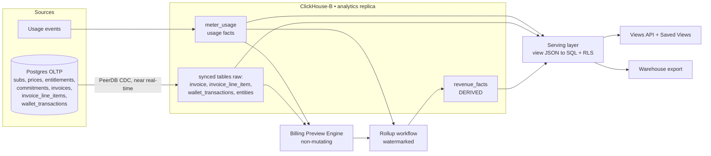
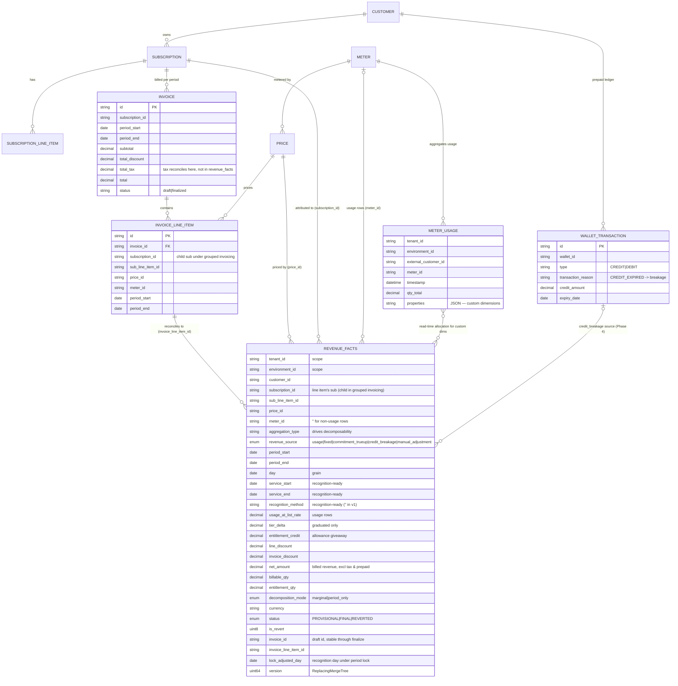
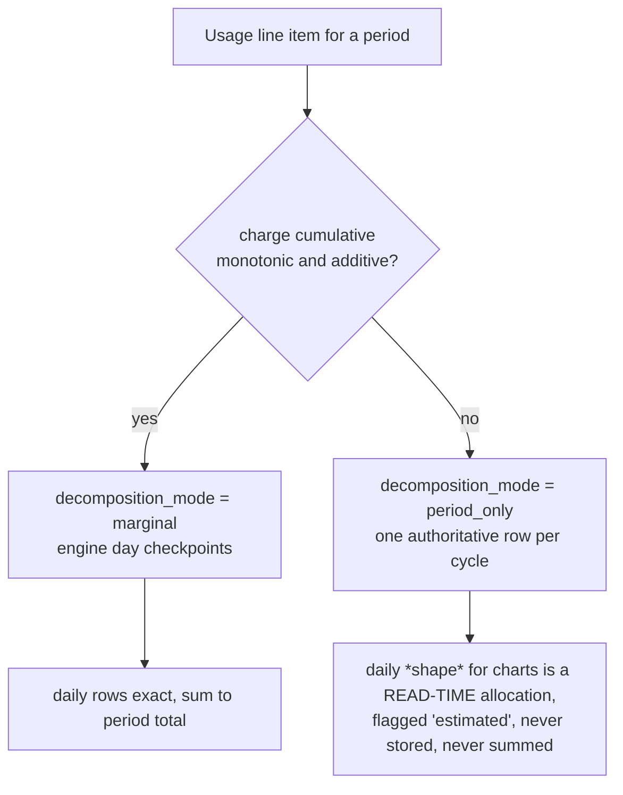
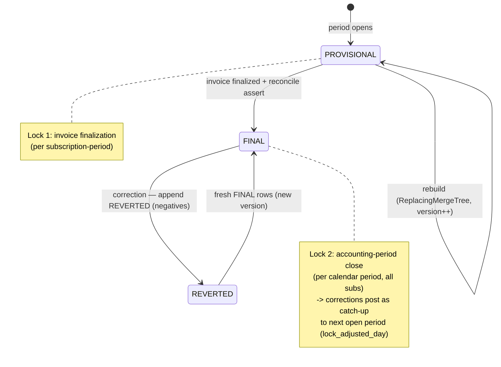
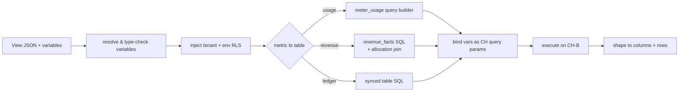

# FLE-1257 — Analytics Platform: Product & Revenue Analytics (ERD)

- **Ticket:** [FLE-1257](https://linear.app/flexprice/issue/FLE-1257/analytics)
- **Date:** 2026-09-10
- **Author:** Ankit Malik
- **Status:** Proposed

**Scope:** A tenant-facing analytics platform over usage and revenue, plus a warehouse-export path, served from a ClickHouse analytics replica. Built to be revenue-recognition (ASC 606) ready.

---

## 1. What we are building and why

Flexprice tenants (our customers) need to understand their own business through two very different lenses:

1. **Product analytics** — *"how is my product being used?"* Usage patterns, feature adoption, the effect of a pricing experiment, cost-per-API-key, credit top-up behavior, price-change history. This lens is **exploratory and open-ended**: a tenant should be able to slice their data by almost any dimension and save that slice as a reusable view.

2. **Revenue analytics** — *"where is the money coming from?"* Revenue by feature, plan, customer, region; committed vs. overage; the impact of discounts and commitments. Consumed by **finance, leadership, and investors**, so the numbers must be **exact and defensible** — they have to tie to the invoices we actually issued.

These lenses pull in opposite directions. Product analytics wants maximum flexibility and cardinality. Revenue analytics wants correctness above all, and correctness is genuinely hard because pricing is non-linear (tiers, included allowances, minimum commitments, discounts, taxes). One design must serve both without letting the flexibility of one corrupt the correctness of the other.

The guiding idea:

> **Two use cases, two read models, one storage substrate.** Product analytics reads the raw usage store we already have. Revenue analytics reads a new *derived* table produced by **re-running our real billing engine** in a non-mutating mode and recording what it computes. The two meet in a shared serving layer (saved views + a query API) and a shared export path.

### Audience for this document
A reader who has *not* followed the design discussion. Section 2 gives the background; a glossary is in Appendix A.

---

## 2. Background you need to follow this

**Meters and events.** Tenants send **usage events**. A **meter** turns a stream of events into a billable quantity via an **aggregation** (`SUM`, `COUNT`, `COUNT_UNIQUE`, `MAX`, `LATEST`, `AVG`, `SUM_WITH_MULTIPLIER`, `WEIGHTED_SUM`), an optional filter, and optional dimensions. Aggregated usage lands in a ClickHouse table, `meter_usage`.

**Prices and pricing shapes.** A **price** attaches money to a meter:
- **Flat / per-unit** — fixed rate per unit.
- **Graduated tiers** — first N units at rate A, next M at rate B (like tax brackets); each unit charged at its bracket's rate.
- **Volume tiers** — the reached tier sets **one** rate applied to **all** units; crossing into a cheaper tier can make the whole bill drop.
- **Package** — "$10 per 1,000 units," in whole packages (rounded up).

**Included allowances (entitlements).** A plan may include an allowance; only overage is charged.

**Commitments and true-up.** A subscription may commit to a minimum spend; a **true-up** covers any shortfall. Commitments can span **multiple billing periods** (annual commitment billed monthly), so one month's true-up depends on earlier months.

**Fixed charges & billing cadence.** Recurring fees are billed **in advance** (at period start) or **in arrear** (at period end), configured per line item. The *service window* (what the fee is for) is recorded separately from *when* it's billed.

**Discounts and taxes.** Coupons discount a line or a whole invoice. **Tax is computed at the invoice level** (not per line item) and collected on behalf of tax authorities.

**Prepaid credits / wallet.** Customers can prepay into a wallet and draw it down; credits can **expire**.

**Why revenue is hard to attribute.** Because of tiers, allowances, and commitments, **a period's charge cannot be computed one day (or one dimension) at a time in isolation** — the 100,000th unit's price depends on the 99,999 before it. "Revenue by region" or "revenue on day 12" is an *attribution* of a non-decomposable total. This one fact shapes the whole revenue design.

**ASC 606 (revenue recognition), briefly.** Accounting distinguishes *billed* revenue (invoiced) from *recognized* revenue (earned by delivering the service). Prepaid money is a **liability (deferred revenue)** until earned. Sales tax collected is a **liability**, not revenue. Finance "closes the books" for a period, after which its numbers must not silently change. "ASC 606 ready" means the data model can support these later without a rebuild.

---

## 3. Principles

1. **Re-run the engine; never reimplement pricing.** All money is computed by the billing engine. The analytics layer records and arranges its output; it does arithmetic (sums, allocation), never pricing. Two pricing implementations would drift, and a dashboard that contradicts the invoice destroys trust.
2. **Exact reconciliation is a hard invariant.** Any revenue number that claims to reconcile must sum to the finalized invoice, asserted in code with alerts on drift.
3. **Analytics is downstream-only.** Derived, read-only; the billing/invoicing path never reads it.
4. **Nothing tenant-authored becomes a database object.** Saved views are JSON in Postgres; tenants never cause DDL or submit SQL.
5. **Product analytics shows usage; money comes only from the revenue table.** Never approximate money as `usage × rate` in the product-analytics path — it ignores tiers/allowances and is wrong.

---

## 4. Architecture



- **Postgres → ClickHouse-B (CH-B)** via **PeerDB** CDC, near real-time — copies operational tables (subscriptions, prices, entitlements, commitments, **invoices**, **invoice line items**, **wallet_transactions**) into CH-B **as raw tables**. They serve as structural dimensions, the reconciliation anchor, and ledger sources.
- **`meter_usage`** — existing aggregated usage facts; the product-analytics substrate.
- **`revenue_facts`** — the new **derived** table produced by the rollup (§6–7).
- **Serving layer** — turns a saved view into parameterized SQL, injects tenant isolation, reads whichever table the metric needs, and feeds exports.

Everything is scoped by `tenant_id` + `environment_id`; every query filters on both.

### 4.1 Data model (ERD)

`revenue_facts` is the one **derived** table; every other entity is a **raw PeerDB-synced** copy of a Postgres table (or the existing `meter_usage`). Relationships below are the join keys the serving/rollup layers use — `revenue_facts` is intentionally denormalized (it stores ids, not FKs) so these are logical joins, not enforced constraints.



---

## 5. Product analytics

The flexible lens, largely **reusing existing infrastructure**: `meter_usage` plus a hardened, parameterized query builder that already supports filters, allow-listed group-by, windowed aggregation, and custom dimensions (arbitrary event properties via `JSONExtract`).

Added on top:
- **Saved views** (§9) — reusable, shareable slices as JSON.
- **Runtime "adjusted usage."** "Billable vs. included usage" or "overage units" are computed **at query time** from the *current* entitlement/price config — **never stored**, because that config is versioned and a stored copy would go stale.
- **Non-usage series.** Wallet transactions, credit grants, and price-change history are PeerDB-synced tables queried through the same view machinery (filtered lists, running totals).

**Hard rule:** product-analytics views never render money as `usage × rate`. Money comes from `revenue_facts`.

---

## 6. Revenue analytics — the derived `revenue_facts` table

### 6.1 Core idea: re-run the engine, record the decomposition

Flexprice already computes charges through a **non-mutating preview path**: it applies entitlements, tiers, commitments, coupons in memory, and only persists/deducts at finalization. The rollup calls this path and records the output. Because it is literally the code that issues the invoice, the numbers reconcile **by construction** — no second pricing implementation.

Two correctness requirements from the engine investigation:
- Use the **standard preview reference point** (mirrors real finalization), **not** the "internal preview" path — the latter computes **multi-period commitments incorrectly** (it would true-up to the full annual amount every month).
- Multi-period commitment state is only correct if prior periods are finalized. The rollup therefore **maintains its own cumulative "prior-base" running total** per commitment window and feeds it in, gating true-up to the final period — so correctness doesn't depend on invoice-finalization ordering.

### 6.2 Revenue has multiple sources

`revenue_facts` is not just "decomposed invoice line items." It is a unified revenue store with several **producers**, distinguished by `revenue_source`:

| `revenue_source` | Producer | Reconciles to invoice? | Phase |
|---|---|---|---|
| `usage` | billing preview (usage line items) | yes | v1/v2 |
| `fixed` | billing preview (fixed/recurring line items) | yes | v1/v2 |
| `commitment_trueup` | billing preview (period-end shortfall) | yes | v1/v2 |
| `credit_breakage` | wallet ledger (expired unused credits) | **no** (never invoiced) | Phase 4 |
| `manual_adjustment` | credit notes / manual corrections | varies | later |

Usage / fixed / true-up come from the billing engine and reconcile to the invoice. **Breakage** — recognizing previously-deferred revenue when prepaid credits expire unused — is derivable from `wallet_transactions` (`type=DEBIT`, `reason=CREDIT_EXPIRED`), is a **recognition-era** concept, and does not tie to any invoice. v1 only needs the `revenue_source` slot so these can be added later without a schema change.

**Why `revenue_source`, and not `price_type`?** For price-derived rows, `revenue_source ∈ {usage, fixed}` carries the same fact as a price's `price_type`, so we keep only `revenue_source` (the "kind of revenue") and drop `price_type` — the underlying price's nature is a join to the synced `price` table if ever needed. The two only *diverge* for true-up: a `commitment_trueup` row sits on a **usage** price but is a different kind of revenue.

**Why `commitment_trueup` must be its own row (not folded into usage).** A minimum-commitment true-up is revenue *not caused by usage* — it is the floor that applies when usage falls short. If we left it inside the usage line's amount and then daily-decomposed that line (§6.5), the entire true-up would land on the **last day** (that is when the floor engages) and falsely read as "usage earned on day 30." Emitting it as a separate `period_only` row dated at `period_end` keeps every usage day honest and lets finance answer "how much revenue was floor vs. actual usage." So it is required for correctness, not just labeling.

### 6.3 Schema

One row per **`(tenant, environment, subscription, price, day, revenue_source)`**. Daily grain enables fine-grained exports and future recognition. Money is decomposed into **columns on `usage` rows**; `fixed`/`trueup`/etc. are their own rows carrying just `net_amount`. Usage is measured **gross** (billable + allowance) so the allowance shows as a visible credit. **Tax and prepaid are excluded** (§6.6, §6.7).

```sql
CREATE TABLE revenue_facts (
    tenant_id            LowCardinality(String),
    environment_id       LowCardinality(String),
    customer_id          String,
    subscription_id      String,                  -- the LINE ITEM's subscription (child in grouped invoicing)
    sub_line_item_id     String,
    price_id             String,                  -- versioned; amendments create new ids
    meter_id             LowCardinality(String),  -- '' for fixed / non-usage rows
    aggregation_type     LowCardinality(String),  -- drives decomposability (§6.5); '' for non-usage rows
    revenue_source       Enum8('usage'=1,'fixed'=2,'commitment_trueup'=3,'credit_breakage'=4,'manual_adjustment'=5),
    -- NOTE: no price_type column — revenue_source subsumes the usage/fixed split; the
    -- underlying price's nature is available by joining price_id to the synced price table.

    -- time
    period_start         Date,
    period_end           Date,
    day                  Date,                     -- grain (billing/booking day for non-usage rows)
    service_start        Date,                     -- recognition-ready: the charge's service window
    service_end          Date,
    recognition_method   LowCardinality(String),   -- recognition-ready: 'point_in_time'|'ratable'|'usage' ('' in v1)

    -- decomposition (usage rows only), GROSS basis, EXCLUDES tax & prepaid
    usage_at_list_rate   Decimal(38,9),  -- (billable_qty + entitlement_qty) x list/effective rate
    tier_delta           Decimal(38,9),  -- graduated only: engine Amount - gross_qty x tier1_rate; else 0
    entitlement_credit   Decimal(38,9),  -- entitlement_qty x list rate  (>=0, subtracted)
    line_discount        Decimal(38,9),  -- coupon on this line           (>=0, subtracted)
    invoice_discount     Decimal(38,9),  -- invoice-level discount, allocated to line (>=0, subtracted)
    net_amount           Decimal(38,9),  -- billed revenue for this row (excl tax, excl prepaid)

    billable_qty         Decimal(38,9),  -- net of allowance
    entitlement_qty      Decimal(38,9),
    decomposition_mode   Enum8('marginal'=1, 'period_only'=2),  -- §6.5

    -- lifecycle / audit
    currency             LowCardinality(String),
    status               Enum8('PROVISIONAL'=1, 'FINAL'=2, 'REVERTED'=3),
    is_revert            UInt8,           -- append-only correction model (§8)
    invoice_id           String,          -- draft id once a draft exists; stable through finalize
    invoice_line_item_id String,          -- the specific line item, for exact reconciliation
    lock_adjusted_day    Date,            -- recognition day given accounting-period lock (§8)
    computed_at          DateTime64(3),
    version              UInt64
) ENGINE = ReplacingMergeTree(version)
PARTITION BY toYYYYMM(day)
ORDER BY (tenant_id, environment_id, subscription_id, price_id, day, revenue_source, is_revert);
```

**Decomposition-field rationale (reviewed):**
- `usage_at_list_rate` + `tier_delta` — kept as two fields because the `list` policy (efficiency comparison) needs list rate and graduated pricing needs the delta. Collapsing them would lose list-vs-effective visibility that finance uses.
- `entitlement_credit` — contra-revenue (value given away as allowance); finance wants it visible.
- `line_discount` vs `invoice_discount` — kept separate: different origins, allocated differently (invoice-level is spread across lines). Merging loses "where the discount came from."
- `fixed_charge` / `commitment_trueup` — **not columns.** They are separate `revenue_source` rows carrying `net_amount`, so a usage row never carries always-zero fixed/trueup columns and non-line-item revenue (breakage) fits the same shape.
- `tax` — **removed** (invoice-level only in the system; §6.6).
- `net_amount` — the row's billed revenue, tax- and prepaid-excluded.

**Reconciliation (sanity check, not derivation):**
- usage rows: `net_amount ≈ usage_at_list_rate + tier_delta − entitlement_credit − line_discount − invoice_discount`.
- `fixed` / `commitment_trueup` rows: `net_amount` = the engine's amount for that charge.
- Per line item/period: `Σ net_amount == that invoice_line_item's billed amount (excl tax)`.
- Per invoice: `Σ net_amount == invoice.Subtotal − invoice.TotalDiscount` (pre-tax, pre-prepaid revenue). Tax is verified **separately** against `invoice.TotalTax` at invoice grain. Any gap → alert, never plugged.

**Tiers:** graduated → `usage_at_list_rate = gross_qty × tier1_rate`, `tier_delta = engine Amount − gross_qty × tier1_rate` (one delta, no engine refactor). Volume/package/flat → single resolved rate on all units, `tier_delta = 0`.

### 6.4 Linking `invoice_id`

- Join key is the **line item's** identity: `invoice_line_item.subscription_id + price_id + period` (and `sub_line_item_id`). **Not** `invoice.subscription_id` — under **grouped invoicing** a parent invoice merges children and each merged line item is stamped with the *child* `subscription_id`, so the invoice's own subscription differs from the line item's.
- A **draft invoice id exists before finalization** (the flow is draft → compute → finalize). So once a draft exists for a period, `revenue_facts.invoice_id` (and `invoice_line_item_id`) are stamped and stay stable through finalization. Mid-period provisional rows, before any draft exists, carry empty ids.
- At finalization we match rows to the finalized line items and assert reconciliation.

### 6.5 Daily decomposition — what one row means, and how it is computed

**A row is the revenue *earned on that day*, not "revenue up to that day."** This is the single most important thing to understand about the table. The billing engine gives us a *cumulative* number (the charge for everything through day D), but what we **store** is the **marginal difference** — day D's slice alone:

> for a `usage` row, `component(day D) = charge(cumulative usage through D) − charge(cumulative usage through D−1)`,
> applied to `usage_at_list_rate`, `tier_delta`, and `entitlement_credit` (allowance consumed earliest-first).

So `SUM(net_amount)` over days 1..D gives the cumulative-through-D; a single row is one day's incremental revenue. You reconstruct any "as of day X" snapshot by summing rows up to X — you never store cumulative values.

The marginal-cumulative difference applies **only to the usage-rate components** of a `usage` row (the part with a cumulative-usage curve). Everything else is layered on per its own rule.

Everything else is layered per its own rule — **this is the part the earlier draft glossed over:**
- **Discounts**: a percentage discount scales the day's usage amount; a fixed discount is allocated by day share.
- **Fixed charges** (`revenue_source='fixed'`): **not** usage-curve-driven. In v1 (billed) they book as a single row on the **billing-cadence day** (advance → `period_start`, arrear → `period_end`), `decomposition_mode='period_only'`. (The $1/day straight-line spread is the *recognized* view — §11, Phase 4 — using `service_start/end`.)
- **Commitment true-up** (`revenue_source='commitment_trueup'`): a period-end shortfall → one `period_only` row dated at `period_end`.
- **Tax**: not in `revenue_facts` (§6.6).

So a usage row's `net_amount(D)` is assembled from the day's marginal usage components plus daily-proportional discount — **not** a single cumulative subtraction over the whole invoice; and fixed/true-up are separate rows, not part of any day's marginal difference.

#### Worked example — how the rows for one subscription-month are computed

**Setup.** A 30-day monthly subscription with:
- a **$30/month platform fee**, billed **in advance**;
- a **usage meter** at a flat **$0.01/call**, with **20,000 calls included** (allowance);
- a **$500 minimum commitment** on usage.
- Actual usage: **2,000 calls/day** → **60,000 calls** for the month.

**Step 1 — usage rows (marginal, daily).** The allowance (20,000) is consumed earliest-first, i.e. over days 1–10 (2,000/day). The engine's cumulative *billable* charge is $0 through day 10, then rises $20/day.
- Day 11's row = `charge(through 11) − charge(through 10)` = $20 − $0 = **$20**. Every later day is the same.
- Days 1–10: gross `usage_at_list_rate` = $20, `entitlement_credit` = $20, `net_amount` = **$0** (fully inside the allowance — visible as a giveaway, not hidden).
- Days 11–30: `usage_at_list_rate` = $20, `entitlement_credit` = $0, `net_amount` = **$20**. That's 20 days × $20 = **$400** of usage revenue.

**Step 2 — fixed row (period_only).** One row on **day 1** (advance cadence): `revenue_source=fixed`, `net_amount=$30`, `decomposition_mode=period_only`. (Not $1/day — that straight-line spread is the *recognized* view, Phase 4.)

**Step 3 — commitment true-up (period_only).** Usage revenue ($400) is below the $500 minimum, so a true-up of **$100** is booked as one row on **day 30**: `revenue_source=commitment_trueup`, `net_amount=$100`, `period_only`.

**Resulting rows (representative):**

| day | revenue_source | usage_at_list_rate | entitlement_credit | net_amount | mode |
|---|---|---:|---:|---:|---|
| 1 | fixed | – | – | 30.00 | period_only |
| 1 | usage | 20.00 | 20.00 | 0.00 | marginal |
| … 2–10 | usage | 20.00 | 20.00 | 0.00 | marginal |
| 11 | usage | 20.00 | 0.00 | 20.00 | marginal |
| … 12–30 | usage | 20.00 | 0.00 | 20.00 | marginal |
| 30 | commitment_trueup | – | – | 100.00 | period_only |

`SUM(net_amount)` = $30 + (10 × $0) + (20 × $20) + $100 = **$530**, which equals the invoice's pre-tax revenue (`Subtotal − TotalDiscount`). Each row answers "what revenue was earned, of what kind, on what day" — and they add up to the invoice, exactly.

**Guard:** the rollup reads **pre-aggregated `meter_usage`** (event quantities already clamped ≥ 0), **never raw events** — removing an entire class of "negative day" bugs.

**When marginal decomposition is valid vs. not:**



`marginal` (exact): `SUM`/`COUNT`/`COUNT_UNIQUE`/`SUM_WITH_MULTIPLIER`/`MAX` with flat/graduated/package pricing; also bucketed-`MAX` with **sub-day** buckets (15m…day — all divide a day evenly).

`period_only` (non-decomposable — one authoritative row per cycle):

| Condition | Why daily decomposition breaks |
|---|---|
| **Volume tiers** | Resolved rate applies to all units; crossing to a cheaper tier makes the total *drop* → negative marginal day. |
| **`LATEST`** | Value can fall over time → cumulative charge drops. |
| **`AVG`** | Cumulative average falls on a low day → charge drops. |
| **`WEIGHTED_SUM`** | Weights depend on `period_end`; recomputing "cumulative through D" re-weights all prior events → non-additive. |
| **Bucketed `MAX`, week/month buckets** | A bucket spans multiple days; a single day's share is undefined. (Sub-day buckets are fine.) |

Explicitly **safe** (not on the list): package/`ceil` (monotonic, only lumpy), and negative raw quantities (prevented by the ingestion clamp).

**Authoritative rule (bookkeeping):** stored rows are `marginal` (daily) or `period_only` (per cycle), mutually exclusive per line-item-period — so summing stored rows is always exact. The approximate daily *shape* for a `period_only` item (for a chart) is computed **at read time** by proportional allocation over `meter_usage`, labeled `estimated`, and is **never stored and never summed** into an authoritative total.

### 6.6 Tax is excluded from `revenue_facts`

Tax in Flexprice is computed **at the invoice level** (one `tax_applied` row per tax rate; no per-line-item tax), and under ASC 606 collected tax is a **liability, not revenue**. So `revenue_facts` carries **tax-excluded** revenue and has **no tax column**. Tax lives at invoice grain in the synced `invoice` table (`TotalTax`) and reconciles separately. If a tenant ever wants "tax by dimension," it can only be a **read-time estimated allocation** of invoice tax by line share (flagged estimated) — the system does not compute per-line tax, so we will not fabricate it as authoritative.

### 6.7 Prepaid credits are excluded (ASC 606-aligned)

`revenue_facts` records the **earned charge**. It does **not** subtract prepaid/wallet drawdown: under ASC 606 prepaid money is a **contract liability (deferred revenue)** until the service is delivered; the revenue is earned regardless of settlement method. Prepaid drawdown lives in the `wallet_transactions` ledger. *(Recognition-phase nuance: credits sold at a discount/bonus recognize at their cost basis when consumed — §11, not a `revenue_facts` column. Expired unused credits become `credit_breakage` revenue — §6.2.)*

---

## 7. Write path (the rollup)

```mermaid
sequenceDiagram
    autonumber
    participant WM as Watermark (Postgres)
    participant RJ as Rollup job (Temporal)
    participant EN as Billing Preview Engine
    participant RF as revenue_facts (CH-B)

    WM->>RJ: dirty subscriptions (usage moved / period close / amendment)
    loop each dirty subscription
        RJ->>EN: preview OPEN period (standard reference point)<br/>request cumulative day-checkpoints
        Note over RJ,EN: feed our cumulative commitment prior-base
        EN-->>RJ: decomposed line items + cumulative curve
        RJ->>RJ: usage rows -> marginal (else period_only);<br/>fixed / true-up -> own rows
        RJ->>RJ: assert per-row + Σ net == line-item / invoice revenue
        alt period still open
            RJ->>RF: upsert (version++)
        else finalized / accounting-locked
            RJ->>RF: append REVERTED row(s) + fresh rows
        end
    end
```

- **Dirty-subscription set** — from a usage watermark plus period-close and amendment events; only subscriptions that moved are rebuilt.
- **Whole-open-period recompute** — tiers/allowances/commitments are period-cumulative; cheap because it reads aggregated `meter_usage`, not raw events.
- **Cadence** — watermark-driven; a modest default (e.g. hourly) for open periods, tunable. `FINAL` periods are never recomputed, only corrected (§8). A configurable **grace window** (~3 days, à la Orb) keeps a period `PROVISIONAL` while late usage settles.
- **Isolation** — separate ClickHouse role/quota so a backfill can't starve the tenant read path.
- **Engine dependency to build** — a preview entry point returning cumulative charge as-of an arbitrary in-period date, ideally all day-checkpoints in one pass (Q2).

---

## 8. Lifecycle, locks, and corrections

Two **independent** locks:



1. **Invoice finalization** (per subscription-period): billed amounts become legally fixed. Rows flip `PROVISIONAL → FINAL`, get `invoice_id`/`invoice_line_item_id`, and we assert reconciliation.
2. **Accounting-period lock** (ASC 606 finance close, per calendar period across all subscriptions): once a month is closed, its recognized numbers are frozen.

**Storage by lock state:**
- **Open / provisional** → `ReplacingMergeTree(version)`: recompute freely, last version wins, high churn, nobody depends on it yet.
- **Finalized or accounting-locked** → **append-only, corrected via reverts.** There is **no `AMENDED` state.** A correction appends **`REVERTED`** rows (the exact negatives of what's being corrected, `is_revert=1`) plus fresh `FINAL` rows with a new `version`. Summing all rows is self-correcting (original + its `REVERTED` twin = 0). Closed accounting periods are never mutated in place.

**`lock_adjusted_day`** is the day a row is *recognized* given lock posture: it equals `day` when the period is open, and shifts to the **first day of the next open period** when the real period is closed — a "catch-up" so a closed month is never rewritten. Reports key on `lock_adjusted_day`; analytics/attribution key on `day`.

---

## 9. Serving layer (a translator, not a compiler)

A **saved view is a JSON row in Postgres**, immutable and versioned. It creates nothing in ClickHouse.

```json
{
  "view_id": "view_01JQZ8...",
  "view_version": 3,
  "name": "Revenue by feature",
  "shape": "breakdown",
  "metrics": ["revenue"],
  "dimensions": ["feature_id"],
  "allocation_policy": "billed",
  "filters": [{ "field": "customer_id", "op": "in", "value": "{{customers}}", "optional": true }],
  "time": { "range": "{{date_range}}", "grain": "month" },
  "sort": [{ "field": "revenue", "dir": "desc" }],
  "limit": 25,
  "variables": [
    { "name": "date_range", "type": "date_range", "required": true },
    { "name": "customers", "type": "string_list", "required": false }
  ]
}
```



- **Shapes (v1):** `timeseries`, `breakdown`, `single_value`, `drilldown`. (`pivot`, `distribution` later.)
- **Variables** bind as **ClickHouse query parameters**, never string interpolation. Optional filters with no value are dropped from `WHERE`. Dimension-position variables are allowed only against a per-tenant registered-property allowlist.
- **Custom dimensions** are aggregated **at read time** (`JSONExtract` over `meter_usage`; an allocation join for revenue).
- **Allocation presets** (custom-dimension revenue only): `billed` (default; aggregate-level components as their own rows so every line is defensible) and `amortized` (aggregate effects spread by usage share). Allocate per price, then sum. A third, `list` (usage at list rate only), is an opt-in for efficiency comparisons; it deliberately does **not** reconcile and returns `reconciles_to_invoice: false`.
- **Authoritative vs. estimated:** a revenue query returns stored authoritative rows (`marginal` + `period_only`). A daily-shape chart over `period_only` items uses read-time `estimated` allocation, labeled and never summed into an authoritative total.

### 9.1 Anatomy of a view — what each field means

| Field | Meaning | Notes |
|---|---|---|
| `shape` | The query template: `timeseries` (metric over time), `breakdown` (metric grouped by 1–N dimensions, ranked), `single_value` (one number, e.g. a KPI), `drilldown` (raw rows). | Determines the SQL structure and the chart type. |
| `metrics` | *What* to measure — each maps to a `(table, aggregation)` (see 9.2). E.g. `usage_quantity`, `event_count`, `billable_usage`, `revenue`. | Multiple metrics allowed if they share a source table. |
| `dimensions` | The **group-by** keys. Structural (`customer_id`, `plan_id`, `feature_id`, `meter_id`) or custom (any event property, e.g. `region`, `api_key`). | This is the `GROUP BY`. Order matters for `breakdown` ranking. |
| `filters` | `WHERE` predicates as `{field, op, value}`. `op` ∈ eq/in/gt/…; `value` may be a `{{variable}}`. | An **optional** filter whose variable is unset is **dropped** from the query, not passed as null. |
| `time` | `range` (often a `{{variable}}`) + `grain` (`day`/`week`/`month`). | `grain` sets the time bucket for `timeseries`. |
| `sort`, `limit` | Ordering and top-N. | Drives "top 10 customers by revenue". |
| `allocation_policy` | Only for **custom-dimension revenue** — `billed` / `amortized` / `list` (§9 bullets). | Ignored for usage metrics and structural revenue breakdowns. |
| `variables` | Typed placeholders (`date_range`, `string`, `string_list`, `number`, `enum`, `boolean`) bound at query time. | Bound as **ClickHouse query parameters**, never string-interpolated. |

**Group-by resolution.** A **structural** dimension resolves by joining `price_id`/`meter_id`/`customer_id` to the PeerDB-synced entity tables in CH-B (e.g. `feature_id` via the meter→feature relation). A **custom** dimension (e.g. `region`) resolves via `JSONExtractString(properties, 'region')` on `meter_usage` **at read time** — no pre-declaration, but it must pass the registered-property allowlist to become a legal group-by.

### 9.2 What powers a view — and where "runtime adjustments" apply

The metric decides the source table. This is the crux of your question, and the split is deliberate:

| Metric kind | Powered by | Adjustments |
|---|---|---|
| **Usage** (`usage_quantity`, `event_count`, `billable_usage`, `overage_units`) | **`meter_usage`** via the existing query builder | "Adjusted" usage (`billable_usage`, `overage_units`) is computed **at runtime** by applying the *current* entitlement/price config to the raw usage — never stored, so it can't go stale. |
| **Revenue** (`revenue`, `usage_at_list_rate`, `entitlement_credit`, …) | **`revenue_facts`** (pre-computed) | Money is **not** derived from `meter_usage` at read time — tiers/allowances/commitments make `usage × rate` wrong. It is read from `revenue_facts`, which the engine already priced. Custom-dimension revenue additionally does a read-time **allocation join** to `meter_usage` for the dimension's usage share. |
| **Ledger** (credit top-ups, balance, price-change history) | **synced tables** (`wallet_transactions`, …) | Simple filters/sums; no pricing. |

So: **usage views** *are* powered by `meter_usage` with runtime-computed adjustment fields — exactly as you said. But **revenue views** are powered by `revenue_facts`, precisely because revenue can't be safely recomputed from usage at read time. A view that mixes a usage metric and a revenue metric runs two sub-queries (one per source) and joins the results in the serving layer.

---

## 10. Warehouse export

Daily grain makes tenant-side BI viable. Export surface:
- **Derived:** `revenue_facts` (and, later, the recognition table).
- **Raw (PeerDB-synced):** `invoice`, `invoice_line_item`, entities, `wallet_transactions` — reconciliation anchor and structural dimensions.

Export is a fast-follow on `revenue_facts`, hedging the risk that a full in-app builder is more than some tenants need. Mechanism (snapshot vs. incremental by `updated_at`/`version`; destinations) is deferred; the common pattern is a first full snapshot then daily incrementals.

---

## 11. ASC 606 recognition-readiness

v1 carries the fields a recognition engine needs — daily grain, `service_start`/`service_end`, `recognition_method`, `net_amount`, `is_revert`, `lock_adjusted_day`, `revenue_source` — but v1 stores **billed** revenue only; it does **not** compute recognized/deferred/unbilled.

Concretely, this is the billed-vs-recognized split the fixed-charge example makes vivid: a $30/month fee **bills** as a lump on its cadence day (v1), but **recognizes** straight-line ≈ $1/day over its service window (`recognition_method='ratable'`, Phase 4). The recognition engine (Phase 4) will also handle usage-based recognition, deferred & unbilled balances, credit cost-basis, **breakage** (`credit_breakage` from expired credits), performance obligations, and period locks. Deferring it costs nothing structurally because the schema is already shaped for it.

### 11.1 Breakage, worked through — why it is revenue with no invoice

"Breakage" is the accounting term for **deferred revenue that becomes real when a prepaid obligation will never be fulfilled** — here, when prepaid credits expire unused. It matters because otherwise that pre-collected cash would sit forever as a liability that will never be delivered against.

**Example.** A customer prepays **$100** for **10,000 credits** (1 credit = $0.01), expiring in 90 days.
1. **At purchase** — $100 cash in. This is **deferred revenue (a liability)**, *not* revenue. Nothing lands in `revenue_facts`. (Prepaid is excluded — §6.7.)
2. **As credits are consumed** — say the customer runs **6,000 credits** ($60) of usage over the quarter. That usage is *billed* like any usage (invoice line items), so it appears as normal **`usage` revenue** in `revenue_facts`, reconciling to those invoices. The wallet drawdown that *settles* those invoices is just a `wallet_transactions` movement.
3. **At expiry** — **4,000 credits ($40) expire unused.** The system already writes a `CREDIT_EXPIRED` debit to `wallet_transactions`. The recognition engine reads that and books a **`credit_breakage`** row in `revenue_facts`: `net_amount=$40` (at the credits' cost basis), `day` = expiry date, `invoice_id=''`, `decomposition_mode=period_only`.

**Total recognized** from the $100 prepaid = $60 usage (as consumed) + $40 breakage (at expiry) = **$100** — it ties back to the cash over time, but through two different revenue sources and two different moments. Breakage is `revenue_source=credit_breakage`, reconciles to **no** invoice (there never was one), and is therefore excluded from the invoice-reconciliation invariants.

**Use-cases this unlocks:** "breakage revenue this quarter", "deferred-revenue balance outstanding" (unconsumed, unexpired credits), and "prepaid → recognized waterfall" (how a cohort's prepayment converts to usage vs. breakage over time). All are recognition-era (Phase 4); v1 only reserves the `revenue_source` slot so no schema change is needed later.

---

## 12. Design choices and non-goals

- **No tenant SQL and no semantic-model DSL / query compiler.** The serving layer is a translator over an existing hardened query builder.
- **No cross-tenant "auto-cube" discovery in v1.** `meter_usage`'s sort key serves hot dimensions; custom dimensions use `JSONExtract`. Targeted per-shape projections come later, on query-log evidence.
- **No pre-declared attribution/dimension registry.** Custom dimensions work on demand.
- **Money is engine-computed, never re-derived in SQL.**
- **Analytics never feeds billing.**

---

## 13. Invariants (asserted in code, with alerts)

1. Per-row reconciliation residual ≈ 0 (usage rows against their component sum).
2. `Σ net_amount(day) == engine period total` for a line item; at FINAL, `Σ net_amount == invoice.Subtotal − TotalDiscount` for the invoice. Fail → alert, never silent-correct.
3. Tax reconciles separately: invoice-grain `Σ tax_applied == invoice.TotalTax`. Tax never appears in `revenue_facts`.
4. Any allocation policy except `list`: `Σ returned revenue == reconcilable revenue for the filter scope`. `list` carries `reconciles_to_invoice: false`.
5. No query executes without tenant + environment predicates injected by the serving layer.
6. No cache entry is keyed without tenant + environment.
7. Analytics tables are never read by the invoicing path.
8. Finalized / accounting-locked rows are never mutated in place — corrections are append + `REVERTED`.
9. The rollup reads pre-aggregated `meter_usage`, never raw events.
10. Multi-period commitments use the standard preview path + our cumulative prior-base, never the internal-preview path.
11. Revenue-facts join to invoices on the **line item's** subscription, never the invoice's (grouped invoicing).

---

## 14. Phasing

| Phase | Ships | Proves | Prerequisites |
|---|---|---|---|
| **1** | Saved-view model + serving translator + `/analytics/query` over `meter_usage` (usage only). `timeseries` + `breakdown`. | The view model expresses today's hand-built usage views. | none |
| **2** | `revenue_facts` (daily, columnar, multi-source) + preview rollup + engine day-checkpoints + cumulative commitment prior-base + append/`REVERTED` + two-lock lifecycle + `usage`/`fixed`/`commitment_trueup` sources + **structural** revenue breakdowns + reconciliation asserts. Run silently one full cycle. | Billed money in-surface, reconciling, at daily grain. | engine cumulative-checkpoint entry point; decomposition-mode classifier |
| **3** | **Custom-dimension** revenue allocation + `billed`/`amortized` presets + non-usage ledger views. | Flexible revenue slicing that reconciles. | Phase 2 green |
| **4** | Warehouse export; evidence-driven acceleration; **ASC 606 recognition engine** (recognized/deferred/unbilled, straight-line fixed, usage recognition, `credit_breakage`, period locks). | Tenant BI; recognized revenue. | query-log evidence; recognition spec |

**Phase 2 gate:** do not expose revenue breakdowns until reconciliation (invariants 1–2) has been green for a full cycle.

---

## 15. Open questions

**Q1 — Cost of the preview call under rollup load.** The rollup re-runs the billing preview for every dirty subscription's open period, potentially hourly. *Why it matters:* it sets achievable cadence and whether we (a) lengthen the interval, (b) reuse an already-computed draft invoice, or (c) cache the preview per period keyed on the usage watermark. *Resolved by:* a benchmark against realistic volumes with the billing-workflow owners.

**Q2 — Engine entry point for as-of-day cumulative charge.** Daily decomposition needs `charge(cumulative through D)` at each day boundary, ideally emitted in one pass. *Why it matters:* calling the engine once per day per subscription may be too costly, and a one-pass API keeps pricing logic in the engine (never reimplemented in the rollup). *Resolved by:* a design review with billing to extend the preview path to return a cumulative curve; scope the change.

**Q3 — Multi-period commitment prior-base.** For an annual commitment billed monthly, month N needs cumulative consumption from months 1..N-1; the engine reads it only from *finalized* invoices and degrades silently otherwise. *Why it matters:* the rollup produces provisional numbers before finalization, exactly when the engine's source is incomplete. *Resolved by:* fixing the fields of a rollup-maintained cumulative prior-base (sum of usage-line base; overage lines ÷ overage factor; true-up excluded), where it's stored, and the rule gating true-up to the final period.

**Q4 — PeerDB sync coverage and latency.** The design assumes `invoice`, `invoice_line_item`, `wallet_transactions`, and entities are in CH-B with low lag. *Why it matters:* structural breakdowns and ledger views join these; the reconciliation anchor is the synced invoice. *Resolved by:* confirming which tables PeerDB replicates into CH-B, observed lag, and failure/backfill behavior.

**Q5 — Allocation basis for `period_only` daily shape.** Rendering a daily shape for a non-decomposable item allocates the period total proportionally, proposed as that day's usage share. *Why it matters:* for volume tiers and `LATEST`/`AVG` meters this is defensible but not unique; even-spread may read better for some. *Resolved by:* picking a default and checking it against real volume-tier and `LATEST` examples; decide if it's per-aggregation-type.

**Q6 — Ownership and rules of the accounting-period lock.** `lock_adjusted_day` and catch-up assume someone closes periods. *Why it matters:* it determines whether this is a tenant-facing finance control, the catch-up posting rule for backdated activity, and its interaction with invoice finalization. *Resolved by:* a product decision on period-close ownership and a short spec of catch-up rules.

**Q7 — Retention at daily grain.** Daily `revenue_facts` grows with `subscriptions × prices × days`. *Why it matters:* replica storage vs. how far back tenants query at daily resolution. *Resolved by:* a retention policy (e.g. daily for N months, then monthly), informed by expected volume.

**Q8 — Export mechanism.** Destinations, full-snapshot vs. incremental watermark, dedupe semantics. *Why it matters:* it's the interface tenants' BI depends on; wrong choices create duplicate/stale rows. *Resolved by:* a Phase-4 export design following "first full snapshot, then daily incremental."

**Q9 — Breakage timing and reconciliation.** Expired credits (`CREDIT_EXPIRED` debits) become `credit_breakage` revenue, but this is recognition-era and does not tie to an invoice. *Why it matters:* it's revenue with no invoice anchor, so it needs its own correctness story (when recognized, at what amount/cost-basis). *Resolved by:* the Phase-4 recognition spec.

---

## Appendix A — Glossary

- **Meter / aggregation type** — how usage events become a billable quantity (`SUM`, `COUNT`, `COUNT_UNIQUE`, `MAX`, `LATEST`, `AVG`, `SUM_WITH_MULTIPLIER`, `WEIGHTED_SUM`).
- **Graduated vs. volume tiers** — graduated charges each bracket at its rate; volume applies one rate (the reached tier's) to all units.
- **Entitlement / allowance** — included usage, not charged.
- **Commitment / true-up** — minimum spend; true-up covers a shortfall. May span multiple billing periods.
- **Billing cadence (advance/arrear)** — a recurring fee billed at period start vs. period end.
- **Billed vs. recognized revenue** — invoiced vs. earned; ASC 606 governs recognition timing.
- **Deferred revenue** — money received but not yet earned (a liability); prepaid credits are deferred until consumed.
- **Breakage** — deferred revenue recognized when prepaid credits expire unused.
- **PeerDB / CH-B** — the CDC pipeline replicating Postgres into the ClickHouse analytics replica this platform reads.

## Appendix B — Codebase anchors

- Preview (correct path): `PrepareSubscriptionInvoiceRequest` `internal/ee/service/billing.go:1558`; standard preview reference point `billing.go:1735`. **Avoid** `GetInternalPreviewInvoice` `invoice.go:2355` for commitments.
- Commitment cumulative logic: `billing_meter_usage.go:53,77`; `getCumulativePriorBaseFromInvoices` `billing.go:1335` (finalized-only); math `billing_commitment.go:218,397,489`.
- Tax (invoice-level): `CalculateTaxesOnInvoice` `internal/ee/service/tax.go:1130`; `taxableAmount` `tax.go:1118`; `TaxApplied` `internal/domain/taxapplied/model.go:13` (entity=invoice, no line-item ref). Invoice totals `internal/domain/invoice/model.go` (Subtotal 51, Total 54, TotalTax 131); total formula `invoice.go:3975`.
- Invoice/line-item linking + grouped invoicing: line item `subscription_id`/`sub_line_item_id` `internal/domain/invoice/line_item.go:19,54`; grouped merge stamps child subscription `billing.go:1870-1904`; draft-first flow `invoice.go:289,378`.
- Fixed charge cadence: `InvoiceCadence` ADVANCE/ARREAR `internal/types/invoice.go:31`; processing `billing.go:158-220`; service-window stamp `buildFixedInvoiceLineItem` `billing.go:332,374`.
- Credit expiry (breakage source): `ExpireCredits` `internal/ee/service/wallet.go:2457`; `TransactionReasonCreditExpired` `internal/types/wallet.go:66`; cron `temporal/workflows/cron/wallet_credit_expiry_workflow.go`.
- Usage engine (build on): `internal/repository/clickhouse/meter_usage_query_builder.go`, `aggregators.go`; table `migrations/clickhouse/000007_create_meter_usage.sql`; ingestion clamp `meter_usage_tracking.go:493`.
- Price math: `internal/ee/service/price.go:1088-1239`, bucketed max `1065-1084`; `internal/domain/price/model.go:275-360`.
- Monthly persistence (no analytics precompute exists): `invoice.go:430-618,2112`.
- Analytics-lake feed (usage → CH-B): `internal/ee/analytics/meter_usage_sink_publisher.go` (`cfg.Analytics`).
