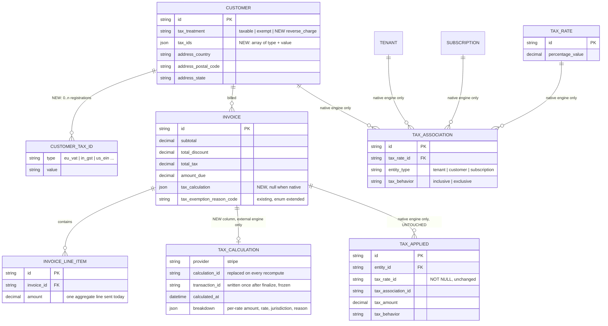
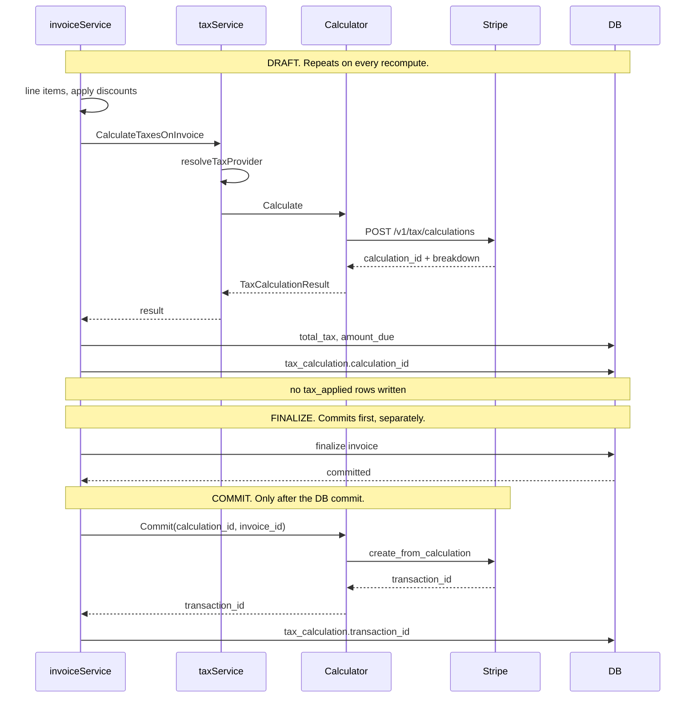
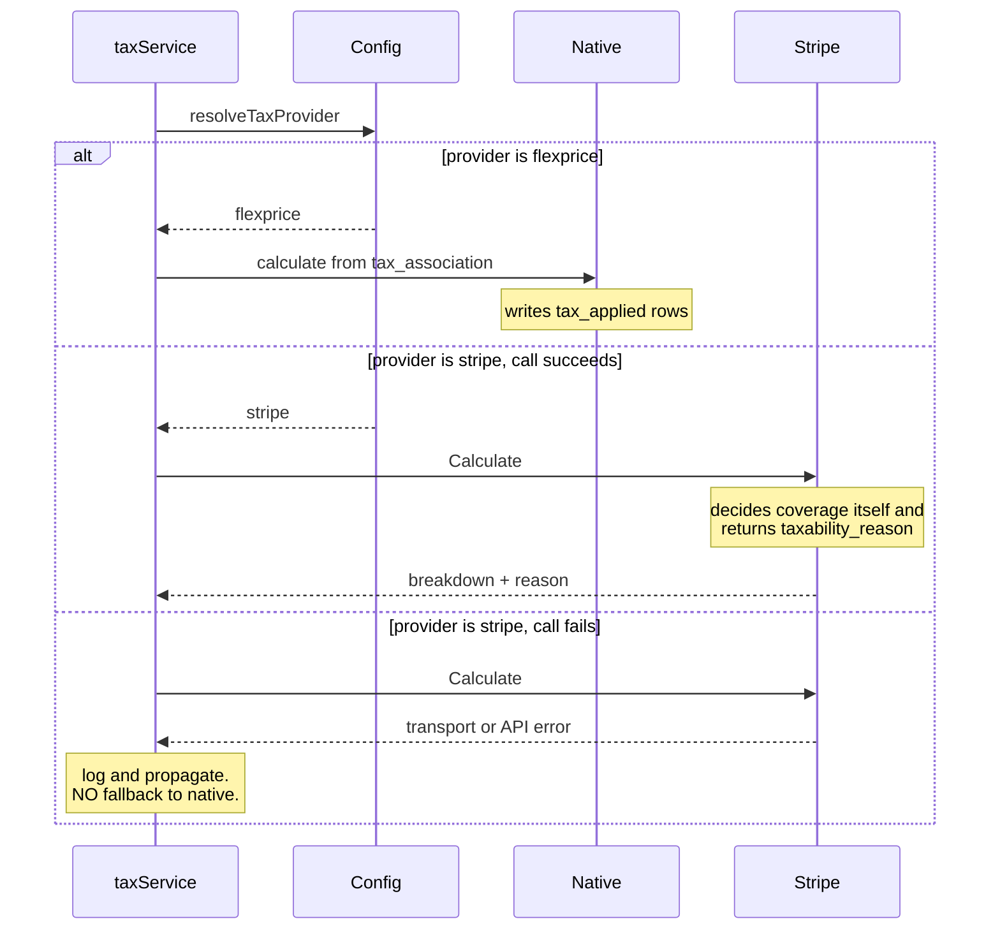

# Stripe Tax Engine Integration — Design ERD

Author: Tsage  
Date: 2026-09-11   
Ticket: FLE-1167

---

## 1. Problem Statement

Flexprice computes tax itself. A tenant defines `tax_rate` rows, links them to a tenant, customer or subscription via `tax_association`, and `taxService` does the arithmetic at invoice compute or finalize. That works for flat percentage rates the tenant already knows.

It does not work for real **indirect tax**. Getting VAT, GST and US sales tax right needs a jurisdiction rules database, per-jurisdiction registration tracking, product taxability classification, and reverse charge determination for B2B cross-border sales. None of that is something Flexprice is building.

**Goal**: let a tenant delegate tax calculation to Stripe Tax, behind an interface that other engines can be added to later without touching invoice code.

**Non-goal**: replacing the native engine. It stays as the default for tenants who do not opt in.

## 2. Approach

### 2.1 Flexprice owns the invoice, the engine only returns numbers

The external engine is a calculator. It never becomes the system of record, never finalizes anything, and never sees a Flexprice invoice. Flexprice sends an amount and a customer address, gets tax back, writes that onto its own invoice, and finalizes on its own schedule.

The practical consequence is that **Stripe's** `automatic_tax` **must never be enabled**, on invoices or on checkout sessions. Flexprice already folds tax into the amount it sends to Stripe. If Stripe also calculated tax the invoice would be taxed twice.  
Note: Today this holds only because no code sets the field. It gets set explicitly to `false` so the intent is recorded.

### 2.2 Two stages: preview, then commit

| Stage | Stripe call | Repeatable | What it does |
| --- | --- | --- | --- |
| **Preview** | `POST /v1/tax/calculations` | yes | Answers "what is the tax". Persists nothing on Stripe's side. Runs again on every draft recompute |
| **Commit** | `POST /v1/tax/transactions/create_from_calculation` | no | Records the tax in Stripe's books, so it appears in the tenant's Stripe Tax reports and they can file |

Preview alone produces a correct Flexprice invoice. Commit is what lets the tenant actually file. Commit is the terminal step.

### 2.3 All tax configuration lives in Stripe, including tax behavior

If a tenant selects Stripe Tax, they configure tax **in Stripe**: registrations, product tax codes, and the default tax behavior in Stripe Tax Settings. They do not create `tax_rate` or `tax_association` rows in Flexprice for those customers, and Flexprice does not send any.

The `POST /v1/tax/calculations` request carries:

| Sent | Value |
| --- | --- |
| `currency` | invoice currency |
| `line_items[0].amount` | invoice subtotal after discounts, smallest unit |
| `line_items[0].reference` | Flexprice invoice ID |
| `customer_details.address` | from the Flexprice customer |
| `customer_details.tax_ids[]` | from `customer.tax_ids`, all of them |
| `customer_details.taxability_override` | `customer_exempt` when `tax_treatment` is exempt |
| `expand[0]` | `line_items.data.tax_breakdown` |

| Deliberately not sent | Why |
| --- | --- |
| `tax_behavior` | Stripe resolves it from the tenant's Tax Settings default. See below |
| `tax_code` | Stripe falls back to the tenant's preset tax code |
| any rate or percentage | Stripe determines the rate. That is the entire point |

#### Why `tax_behavior` is omitted, and what the tenant must get right

`tax_behavior` decides whether the amount we send is treated as pre-tax or post-tax:

```
subtotal sent = 10000, rate 18%

exclusive  ->  tax 1800,  amount_total 11800     tax added on top
inclusive  ->  tax 1525,  amount_total 10000     tax carved out, total unchanged
```

Omitting it means Stripe uses the account's `defaults.tax_behavior` from Tax Settings. Stripe's recommended value is "Automatic", which resolves to **exclusive for USD and CAD, inclusive for all other currencies**.

This is the correct design, because tax configuration belongs in one place and that place is Stripe. But it puts a real obligation on the tenant, and it must be documented prominently:

> **If the tenant sets their Stripe tax behavior to inclusive, the plan prices the customer is subscribed to must already contain the tax.** Then the calculation resolves to inclusive, the subtotal stays intact, and the tax is reported out of it rather than added to it.
>
> **If the tenant sets it to exclusive, plan prices must be pre-tax**, and Stripe adds tax on top.

A mismatch between the tenant's Stripe setting and how they priced their Flexprice plans produces a wrong total, silently. Flexprice cannot detect it, because with no `tax_association` there is nothing to compare against.

Our side of the contract is to be rigid: always omit `tax_behavior`, never guess it, never override it. The tenant's side is to keep their pricing and their Stripe setting consistent. This needs to be spelled out in the product documentation in detail, with worked examples for both settings.

### 2.4 The switch between native and external

Selection happens once, at the top of `CalculateTaxesOnInvoice`, and the branch is total. There is no mixing.

```
CalculateTaxesOnInvoice(ctx, inv, rates) (TaxCalculationResult, error):

    provider := resolveTaxProvider(ctx)          // tenant + environment scoped

    if provider == flexprice:
        return nativeCalculate(inv, rates)       // unchanged path

    calculator := registry.For(provider)
    return calculator.Calculate(ctx, input)      // `rates` ignored. Error propagates.
```

Four properties:

1. When an external provider runs, the `rates` argument is **ignored**. `PrepareTaxRatesForInvoice` returns an empty set anyway, because the tenant holds no associations for that customer.
2. The resolved provider is stamped on the invoice at compute time and never re-resolved. Switching a tenant's provider does not retroactively change finalized invoices.
3. **Flexprice does not decide whether a jurisdiction is supported.** Stripe answers that in the response through `taxability_reason`, using `not_supported` when it does not cover a country or product and `not_collecting` when the tenant has no registration there. Duplicating that judgement on our side would go stale the moment Stripe adds a country, and would defeat the purpose of delegating. We record the reason and move on.
4. **There is no fallback to native.** Exactly one engine is responsible for an invoice, decided by configuration. If the tenant selected Stripe Tax and the call fails, the error propagates and the operation fails. It is not retried against the native engine.

#### Why there is no fallback

Silently falling back would mean a tenant who configured Stripe Tax receives an invoice taxed by Flexprice's own rates instead, without asking for it. Those rates are usually absent entirely, since a tenant on Stripe Tax has no `tax_association` rows, so the realistic fallback result is **zero tax on an invoice that should have been taxed**. That is worse than a failed operation, because it is invisible and it ships to the customer.

An engine failure is an operational problem with an operational fix. It surfaces as an error, gets logged, and is retried by the existing Temporal retry. It does not get papered over with a different tax answer.

### 2.5 `tax_applied` stays internal. External tax lives on the invoice.

`tax_applied` is identified by two foreign keys into internal tax configuration, `tax_rate_id` and `tax_association_id`. The table encodes a specific claim: a Flexprice `tax_rate`, resolved through a Flexprice `tax_association`, was applied to this entity.

A Stripe-calculated tax has neither. There is also no Stripe identifier to put in `tax_rate_id`, because the standalone Tax API returns rate details inline with no id at all.

So external tax does not write `tax_applied` rows. It is recorded on the invoice instead, and `tax_applied` is left completely untouched: no new columns, no nullable `tax_rate_id`, no index rework, no idempotency change.

The visible consequence is that **`taxes[]` is empty on engine invoices** while `total_tax` is non-zero. That is intentional, and `tax_summary.provider` tells a consumer why.

### 2.6 One read path, not four

Four places read tax for display: `GetInvoice`, the list path when expanded, the PDF path, and a count guard in discount recalculation. Branching in all four would guarantee drift.

A single function returns the same shape regardless of source:

```
resolveInvoiceTaxLines(ctx, inv) -> ([]TaxLine, *TaxSummary)

    if inv.TaxCalculation != nil:
        return taxLinesFromExternalCalculation(inv.TaxCalculation)

    return taxLinesFromAppliedTaxes(ctx, inv.ID)
```

`TaxSummary` keeps being derived exactly as today, it simply derives from a different source. Adding another engine later touches only this function.

### 2.7 The interface

```go
type TaxCalculator interface {
    // Preview. Persists nothing. Safe to call repeatedly on a draft.
    Calculate(ctx context.Context, in TaxCalculationInput) (TaxCalculationResult, error)

    // Commit. Records the calculation in the provider's books, once, after finalize.
    Commit(ctx context.Context, calculationRef, reference string) (transactionRef string, err error)
}
```

The native implementation satisfies the same interface, with `Commit` as a no-op.

### 2.8 Logging

The tax path already logs. `CalculateTaxesOnInvoice` emits `"tax computed for invoice"` and `"exemption applied at compute"`, and `ApplyTaxesOnInvoice` emits `"applying taxes to invoice"`, `"no tax rates to apply to invoice"` and `"successfully calculated taxes for invoice"`. All Info, all carrying `invoice_id`.

So this is not a new logging scheme. It is two existing lines gaining fields, plus the failure points the engine introduces that cannot exist today.

**Existing lines, extended**

| Line | Add |
| --- | --- |
| `"tax computed for invoice"` | `provider`, and `taxability_reason` when the provider returned one |
| `"successfully calculated taxes for invoice"` | `provider`, `calculation_id` |

`provider` belongs on these as a **field, not its own log line**. It is static per tenant, so a separate line per invoice would be noise, but attached to the computation it answers "why was this invoice taxed this way" at the point it matters.

`taxability_reason` matters more than it looks. A zero from an engine is legitimate for `reverse_charge` and broken for a misconfigured registration returning `not_collecting`, and the two are indistinguishable without it. This is the field that separates them.

**New lines, for events that do not exist today**

| Event | Level | Fields |
| --- | --- | --- |
| Engine call failed | Error | `invoice_id`, `provider`, `"error"` |
| Commit succeeded | Info | `invoice_id`, `calculation_id`, `transaction_id` |
| Commit skipped, already committed | Info | `invoice_id`, `transaction_id` |
| Commit failed | Error | `invoice_id`, `calculation_id`, `"error"` |
| Finalized with no committed transaction after retries | Error | `invoice_id`, `calculation_id` |

The last one is the reconciliation trigger from section 6, and is the only log in this list that something operational should alert on.

**House rules**, from `AGENTS.md`:

- Every `log.Error` must include a literal `"error"` key in its fields. `Error(ctx, err.Error())` alone fails the `LL006` lint gate.
- `ctx` is the first argument, never a field.
- Log meaningful state changes, failures and operational decisions. Not every branch.

Logging is deliberately absent from the sequence diagrams in section 4. It is cross-cutting and would obscure the interactions those diagrams exist to show. The one exception is the `log and propagate` note in 4.2, where the log is the outcome rather than a side effect.

## 3. ERD



### 3.1 Schema changes

| Table | Change | Why |
| --- | --- | --- |
| `invoice` | add `tax_calculation` typed JSON column, null when native | The only new storage. Holds the engine handles and the breakdown |
| `customer` | add `tax_ids` typed JSON **array** of `{type, value}` | Needed for reverse charge determination |
| `customer` | add `reverse_charge` to `tax_treatment` | Already reserved in a code comment, currently rejected by `Validate()` |
| `tax_exemption_reason_code` | extend enum, see 3.3 | Map the engine's reason back to ours |
| `InvoiceConfig` setting | add `tax_provider`, default `flexprice` | Engine selection, see 3.4 |
| `tax_applied` | **no change** | See 2.5 |
| `credit_note` | **no change** | Reversal is a later enhancement, see 11 |

**Why `tax_ids` is an array.** A business can be tax-registered in several countries at once, for example a German company holding both a DE and an FR VAT number. We cannot know which jurisdiction matters until Stripe computes, so we send all of them and Stripe applies whichever fits the transaction. Stripe's parameter is an array for exactly this reason. Storing a single value risks sending the wrong one and getting the wrong reverse charge determination.

### 3.2 Invoice API response

`tax_summary` gains one field. Nothing existing is renamed or removed.

`taxes` and `tax_summary` are **sibling fields on the invoice**, not nested:

```jsonc
{
  "id": "inv_01H...",
  "total_tax": "18.00",

  "taxes": [],                          // empty when an engine calculated

  "tax_summary": {
    "inclusive_tax": "0.00",            // existing
    "exclusive_tax": "18.00",           // existing
    "total_tax": "18.00",               // existing
    "exemption": null,                  // existing
    "provider": "stripe"                // NEW. flexprice | stripe
  }
}
```

`provider` is the acknowledgement signal. Without it, `total_tax: 18.00` alongside `taxes: []` looks like missing data. With it, a consumer knows the detail lives in `tax_calculation`.

**No migration is needed.** Absent is read as `flexprice`. Invoices written after this ships state it explicitly.

**Compatibility note.** Any consumer that sums `taxes[]` instead of reading `total_tax` gets zero on engine invoices. Not a regression, since only new engine-enabled invoices reach that path, but it belongs in a release note.

### 3.3 Reason codes

Today `tax_exemption_reason_code` has `customer_exempt` and `no_tax_configured`. Stripe returns a 15-value `taxability_reason`, but only five are worth carrying.

| Code | Meaning |
| --- | --- |
| `reverse_charge` | Buyer self-assesses. Already reserved in a code comment |
| `customer_exempt` | Already exists |
| `not_collecting` | No registration in that jurisdiction, or a nontaxable product code |
| `not_subject_to_tax` | Jurisdiction imposes none |
| `not_supported` | Stripe does not cover that country or product |

Anything else maps to null, meaning tax was charged. Keep the raw provider string alongside the mapped value inside `tax_calculation.breakdown`, because `not_collecting` is ambiguous on Stripe's side and the raw value is the only way to tell its two causes apart later.

### 3.4 Where provider selection is configured

Stored on the existing **`InvoiceConfig`** setting, under `SettingKeyInvoiceConfig`, as a new field:

```go
type InvoiceConfig struct {
    // ... existing numbering, due date, finalization fields
    TaxProvider string `json:"tax_provider,omitempty"`   // flexprice | stripe. Default flexprice
}
```

Reasons this is the right home for now:

- It is already tenant and environment scoped, which is exactly the scope of the decision.
- Tax is an invoice-time concern, and this config already holds invoice-time behavior such as `DueDateDays` and `FinalizationDelaySeconds`.
- It already has a `Validate()` and is already fetched on the billing path at `billing.go:2238`, so there is no new plumbing.
- Absent means `flexprice`, so no migration and no backfill.

The config holds only **which** engine to use. Everything else already lives elsewhere: the seller address is on the tenant's Stripe account and Stripe uses it as the head office automatically, credentials are on the Stripe connection, and tax behavior is Stripe's per 2.3.

This is recorded as a decision taken rather than a settled conclusion. See open question 10.4.

## 4. Sequence diagrams

### 4.1 Preview, finalize, then commit



### 4.2 Provider selection



## 5. Stripe Tax contract

**Preview** — [`POST /v1/tax/calculations`](https://docs.stripe.com/api/tax/calculations/create)

Parameters as listed in 2.3. Returns `amount_total`, `tax_amount_exclusive`, `tax_amount_inclusive`, `tax_breakdown[]` and `expires_at`. Calculations expire after 90 days.

**Why `expand` is always sent.** Today one aggregate line item is sent, so the per-line breakdown is the invoice breakdown. When line-item taxation ships, the identical call returns one breakdown per line with no payload change. It also carries the localized tax name (`display_name`, for example "Umsatzsteuer (USt)") and the per-jurisdiction split, neither of which the top-level breakdown has.

**Commit** — [`POST /v1/tax/transactions/create_from_calculation`](https://docs.stripe.com/api/tax/transactions/create_from_calculation)

Takes `calculation` and a `reference` that must be unique across all transactions. We pass the Flexprice invoice ID. Returns `tax_...`, stored on `tax_calculation.transaction_id` and frozen.

**Not used: the Tax Associations API.** `GET /v1/tax/associations/find` exposes transactions Stripe created on your behalf from a PaymentIntent under `automatic_tax`. We call `create_from_calculation` explicitly and receive the transaction id directly, so there is nothing to look up.

**Pushing tax onto the synced Stripe invoice.** The existing sync sends line items at pre-tax amounts and never sends `total_tax`, so a synced Stripe invoice is short by exactly the tax. `POST /v1/invoices/{id}/add_lines` carries per-line `tax_amounts[]` with `amount`, `taxable_amount`, `taxability_reason` and `tax_rate_data`. That is the only way to put our tax on a Stripe invoice without `automatic_tax`. Drafts only.

## 6. Finalize and commit ordering

A Stripe HTTP call cannot sit inside a database transaction, so finalize and commit **cannot be genuinely atomic**. The design makes them sequential and separately recoverable instead.

**Order: finalize the invoice and commit the database transaction first. Call Stripe second.**

```
1. DB transaction: finalize the invoice, tax_calculation.transaction_id still null
2. DB commit
3. Stripe: create_from_calculation
4. DB: write tax_calculation.transaction_id
```

Two mechanisms make step 3 safe to repeat:

1. **Temporal retries.** `FinalizeInvoiceActivity` is a Temporal activity, so a failure at step 3 or 4 is retried automatically.
2. **Stripe-native uniqueness.** The transaction `reference` is the invoice ID and must be unique across all transactions, so Stripe rejects a duplicate on retry.

Retry plus provider-side idempotency gives the practical guarantee of atomicity without holding a database lock open across a third-party network call.

The residual state is a finalized invoice with `transaction_id` null after retries are exhausted. That is **recoverable, not corrupt**: the invoice and its tax are correct, only Stripe's copy is missing. Recovery is to re-run the commit from the stored `calculation_id`, bounded by the 90-day calculation expiry. This needs a reconciliation sweep, see open question 10.2.

Calculations themselves need no idempotency. They persist nothing on Stripe's side, and only the last `calculation_id` before finalize is ever committed.

## 7. Code map

| Area | File | Change |
| --- | --- | --- |
| Interface | `internal/taxengine` (new) | `TaxCalculator`, native and Stripe implementations |
| Selection | `internal/ee/service/tax.go` | `resolveTaxProvider`, branch in `CalculateTaxesOnInvoice` |
| Signature | `internal/ee/service/tax.go` | `CalculateTaxesOnInvoice` gains an `error` return |
| Read path | `internal/ee/service/invoice.go` | `resolveInvoiceTaxLines`, used by all read sites |
| Commit | `internal/ee/service/invoice.go` | call `Commit` after finalize, write `tax_calculation` |
| Stripe sync | `internal/integration/stripe/invoice_sync.go` | set `automatic_tax=false`, move to `add_lines` |
| Schema | `ent/schema/invoice.go`, `ent/schema/customer.go` | `tax_calculation`, `tax_ids` |
| Types | `internal/types/tax.go` | reason codes, `reverse_charge` |
| Config | `internal/types/invoice.go` | `TaxProvider` on `InvoiceConfig` |

Read sites that must go through `resolveInvoiceTaxLines`: `invoice.go:687` (`GetInvoice`), `invoice.go:4557` (list with expand), `invoice.go:4614` (`getAppliedTaxesForPDF`), `invoice_recalculate_discount.go:71` (count guard).

Call sites of `CalculateTaxesOnInvoice` needing a failure-policy decision: `tax.go:1199` and the three preview paths at `invoice.go:2236`, `:2333`, `:2412`.

## 8. Scenarios

| # | Scenario | Handling |
| --- | --- | --- |
| 1 | No tax engine configured | Native, unchanged. `provider = flexprice`, `tax_applied` rows written |
| 2 | Stripe connected for payments, native selected for tax | Native. Stripe's tax settings stay inert because `automatic_tax` is never set |
| 3 | Stripe Tax selected | Preview on draft, finalize, then commit. `taxes[]` empty, `tax_calculation` populated |
| 4 | Stripe Tax selected and the tenant also has `tax_association` rows | Associations ignored. The branch is total, so no double taxation |
| 5 | B2C customer | No tax IDs sent. Stripe forward-charges at the destination rate |
| 6 | B2B customer with tax IDs | All stored tax IDs sent. Stripe applies whichever fits the transaction and determines reverse charge. Zero tax, `reverse_charge` |
| 7 | Customer marked exempt | `taxability_override = customer_exempt`. Zero tax, `customer_exempt` |
| 8 | Stripe does not cover the country or product | Stripe returns zero tax with `not_supported`. Recorded, invoice still computes |
| 9 | Tenant has no registration in the buyer's jurisdiction | Stripe returns zero tax with `not_collecting`. Recorded, invoice still computes |
| 10 | Stripe call fails or times out | Logged at Error, error propagates, operation fails. **No fallback to native.** Retried by Temporal |
| 11 | Customer address unusable | Stripe returns `requires_location_inputs`. Zero tax, reason recorded, invoice still computes |
| 12 | Tenant switches provider mid-cycle | Finalized invoices untouched. Provider stamped per invoice at compute |
| 13 | Commit retried after finalize | `transaction_id` already set, commit skipped. Stripe also rejects the duplicate reference |
| 14 | Commit permanently fails | Finalized invoice with `transaction_id` null. Recoverable, see 6 |
| 15 | Invoice predates this feature | `tax_calculation` null, `provider` reads as `flexprice`. No migration |

## 9. Constraints

### 9.1 Draft subscription invoices carry no tax today

`ComputeInvoice` applies coupons only. For subscription invoices tax is deferred to finalize, and the `applyTaxes` branch is set only for `InvoiceTypeOneOff` and `InvoiceTypeCredit`.

So "preview on the draft, repeatedly" is a **behavior change** for subscription invoices, not a swap. Either move tax earlier into compute, or accept one calculation at finalize and lose the preview.

### 9.2 Reverse charge invoices need a template change

Stripe's wording: "Instead of collecting the tax, you must issue an invoice with the text, 'Tax to be paid on reverse charge basis.'"

Not cosmetic. It transfers liability in writing, it is the seller's audit defence for a zero-tax invoice, and in most VAT regimes the buyer cannot claim input credit without it.

### 9.3 Tenant pricing must match their Stripe tax behavior setting

See 2.3. Flexprice cannot detect a mismatch. This is a documentation obligation, not a code one.

## 10. Open questions

### 10.1 Invoice PDF

The PDF renders `TaxName`, `TaxCode`, `TaxType`, `TaxRate`, `TaxableAmount`, `TaxAmount`, sourced from the expanded `TaxRate` object, which does not exist for engine-calculated tax.

1. What should the PDF display for engine-calculated tax? Amounts and percentages map cleanly. `TaxName` can come from `display_name` or be derived from `tax_type`. `TaxCode` has no external equivalent.
2. Should the Stripe `transaction_id` appear on the PDF for audit traceability?
3. The reverse charge statement from 9.2 is absent today and is a confirmed requirement.
4. **Pre-existing gap.** `internal/pdf/` contains no VAT, GSTIN or tax ID field. The PDF carries neither the seller's nor the customer's tax registration number, both normally required on a B2B invoice in VAT and GST jurisdictions.

### 10.2 Invoice level

5. Does subscription tax move from finalize into compute? See 9.1.
6. Should `tax_calculation` retain superseded `calculation_id` values for audit, or only the last one before finalize?
7. What drives the reconciliation sweep for a finalized invoice whose commit permanently failed? A scheduled job over invoices with `tax_calculation.transaction_id` null and a non-null `calculation_id`, bounded by the 90-day expiry.

### 10.3 Tax records and calculation

8. Failure policy for the three preview call sites of `CalculateTaxesOnInvoice`, which tolerate a slow or failed engine call differently than invoice compute does.
9. Confirm nothing outside the four identified read sites queries `tax_applied` for display.

### 10.4 Provider selection config

**Decision taken for now: `tax_provider` on the existing `InvoiceConfig` setting.** See 3.4 for the reasoning.

10. Revisit if the config ever needs to hold more than the single enum. A dedicated `tax_config` settings key becomes more attractive the moment tax behavior, a per-customer override, or engine credentials need a home, because at that point tax configuration stops being an invoice concern and becomes its own thing. Nothing currently requires that, so the simpler option stands.
11. Should provider be overridable per customer, or is tenant plus environment always the right granularity? Tenant level is assumed, on the basis that the tax engine is an accounting decision rather than a per-customer one.

## 11. Future enhancements

### 11.1 Reversal transactions

Out of scope for v1 because it adds meaningful complexity before the forward path has shipped.

**What a reversal is.** A committed tax transaction tells Stripe, and therefore the tenant's tax reports, that "we collected X tax on this sale." If the sale is later reduced or cancelled and Stripe is not told, the report still shows the full amount and the tenant **over-reports and over-remits tax to the government out of their own pocket**. A reversal corrects the recorded liability.

[`POST /v1/tax/transactions/create_reversal`](https://docs.stripe.com/api/tax/transactions/create_reversal) takes `mode` (`full` or `partial`), `original_transaction`, a fresh unique `reference`, and for partial reversals a `flat_amount`, described as "a flat amount to reverse across the entire transaction, in the smallest currency unit in negative."

Because we send one aggregate line item, `flat_amount` is the right shape and **no per-line identifiers need storing**.

**It only applies when tax was actually collected.** A credit note against a reverse-charge invoice needs no reversal, because the tax was zero and no liability was ever recorded.

**Open question.** Which direction does this run, and is a webhook involved?

- *Outbound*: a Flexprice credit note triggers `create_reversal`. This is the expected direction, since Flexprice owns the invoice.
- *Inbound, proposed*: listen for a Stripe event when a reversal transaction is created, and issue a Flexprice credit note in response. Whether Stripe emits such an event for tax transactions has not been verified and needs checking before this is designed.

Either direction needs a reversal handle. That is `tax_calculation.transaction_id`, already stored, so no schema change is required to enable this later.

### 11.2 Line-item level taxation

Flexprice computes tax at invoice level today. Every engine is already line-item native, so when per-line tax ships the request grows from one line item to many and `reference` becomes the `invoice_line_item.id`. Because `expand` is already sent, the response shape does not change either.

## 12. Scalability: adding other engines

| Engine | Preview | Commit | Notes |
| --- | --- | --- | --- |
| Stripe Tax | `POST /v1/tax/calculations` | `create_from_calculation` | Transaction reference is ours, transaction id is Stripe's |
| Avalara AvaTax | `DocType: SalesOrder`, a temporary estimate not preserved | `DocType: SalesInvoice`, then `Commit` | Four states: Saved, Posted, Committed, Locked. `Commit` issues two calls |
| Anrok | `createEphemeral`, not used for filing or thresholds | `createOrUpdate` | Returns no calculation id. Jurisdiction is a display string only |
| TaxJar | `POST /v2/taxes` | `POST /v2/transactions/orders` | Returns no calculation id |

What a second adapter costs:

- The two interface methods.
- A reason code mapping. Avalara publishes no enum comparable to `taxability_reason` and expresses the same idea through `exemptAmount` and `nonTaxableAmount`. Anrok's full `notTaxedReason` set is unpublished and must be built empirically.
- Transaction reference generation. Stripe generates the transaction id, but Avalara, Anrok and TaxJar take a caller-supplied identifier, so the adapter owns uniqueness.
- Jurisdiction and tax type normalization. Structure differs per vendor, and Anrok returns only a display string.