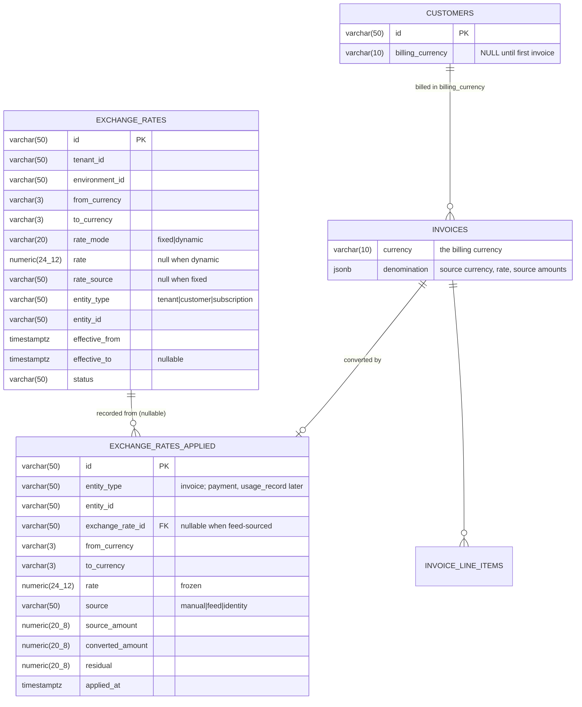

# Billing Currency & FX Conversion — ERD

Status: **Proposed** — v1 (supersedes v0, which scoped conversion to integration egress)
Date: 2026-09-23
PRD: [`docs/prds/billing-currency-and-fx-conversion-prd.md`](../prds/billing-currency-and-fx-conversion-prd.md)

---

## 1. Scope

One new column on `customers`, two new tables, one changed decision inside invoice creation.

A customer acquires a **billing currency**. Charges priced in any currency are converted into
it at invoice generation, at a rate resolved from a scope hierarchy. The rate is frozen onto
the invoice at finalization and reused by everything downstream, including the accounting
integrations.

### 1.1 M1 and M2

**M1 is custom rates only.** Rates come from configuration — tenant, customer or
subscription. With none configured, invoice generation fails; it does not reach for a market
rate.

| | M1 | M2 |
| --- | --- | --- |
| `customers.billing_currency` | ✅ | |
| `exchange_rates`, scoped and dated | ✅ fixed only | `dynamic` enabled |
| Conversion at invoice generation | ✅ | |
| Rate frozen on the invoice | ✅ | |
| Integrations send our rate | ✅ | |
| Live market feed | | ✅ |
| Fiat wallets follow billing currency | | ✅ (PRD D1) |
| Custom currency shares the denomination | | ✅ (PRD D2) |

The `rate_mode = dynamic` column and the `feed` source value ship in M1 **unused**, so M2 is
a validation change rather than a migration on a populated table. Sections marked **[M2]**
are specified for that reason, not built.

### 1.2 Why this is safe to ship incrementally

**Today, for every customer, invoice currency == subscription currency == wallet currency.**
Nothing in production is multi-currency at the customer level.

So M1's backfill is unambiguous, and until a tenant deliberately sets a billing currency that
differs from a subscription's charge currency, the conversion branch is never entered and
every existing path runs unchanged.

**Not in scope, either milestone** (PRD §5.3): cross-currency payments, changing a customer's
billing currency after invoicing, `price_units` convergence.

---

## 2. Entity relationship



### 2.1 One rate table, not the tax engine's two

The tax engine splits `tax_rates` from `tax_associations` because a tax rate has identity
independent of attachment — "CGST 9%" is one thing, attached in many places.

An FX rate has no such identity. The pair, the scope, the window and the value are one
indivisible fact. A split would give a `fx_rates` row of `(usd, inr, 83)` and an association
row of `(that row, tenant X)` — one row on each side, forever.

It also avoids inheriting two defects the tax audit surfaced: `tax_associations.priority` is
stored, validated and copied but nothing sorts by it; and `EntityHierarchy` is declared but
called nowhere, with the real cascade hardcoded in two services. Here, the hierarchy constant
**is** the resolution loop, with one call site.

---

## 3. Schema

### 3.1 `customers.billing_currency`

```go
field.String("billing_currency").
    SchemaType(map[string]string{"postgres": "varchar(10)"}).
    Optional().
    Nillable().
    Comment("currency this customer is invoiced in; null until the first invoice sets it")
```

Nullable is the important part. Null means *"not yet known"*, and the first invoice resolves
it — the same lifecycle as a Zoho contact's currency, chosen for the same reason: it is the
first moment the answer exists.

### 3.2 `exchange_rates`

```go
// ent/schema/exchangerate.go

func (ExchangeRate) Fields() []ent.Field {
    return []ent.Field{
        field.String("id").SchemaType(pg("varchar(50)")).Unique().Immutable(),

        field.String("from_currency").SchemaType(pg("varchar(3)")).NotEmpty().Immutable(),
        field.String("to_currency").SchemaType(pg("varchar(3)")).NotEmpty().Immutable(),

        // fixed carries a literal rate; dynamic resolves rate_source at conversion time
        field.String("rate_mode").
            GoType(types.ExchangeRateMode("")).
            SchemaType(pg("varchar(20)")).
            Default(string(types.ExchangeRateModeFixed)).
            Immutable(),

        // target units per 1 source unit. Null when rate_mode is dynamic.
        field.Other("rate", decimal.Decimal{}).
            SchemaType(pg("numeric(24,12)")).Optional().Nillable().Immutable(),

        field.String("rate_source").SchemaType(pg("varchar(50)")).Optional().Nillable().Immutable(),

        field.String("entity_type").
            GoType(types.ExchangeRateEntityType("")).
            SchemaType(pg("varchar(50)")).NotEmpty().Immutable(),
        field.String("entity_id").SchemaType(pg("varchar(50)")).NotEmpty().Immutable(),

        field.Time("effective_from").Default(time.Now),
        field.Time("effective_to").Optional().Nillable(),

        field.JSON("metadata", map[string]string{}).Optional().SchemaType(pg("jsonb")),
    }
}

func (ExchangeRate) Indexes() []ent.Index {
    return []ent.Index{
        index.Fields("tenant_id", "environment_id", "entity_type", "entity_id",
            "from_currency", "to_currency", "status").
            StorageKey(Idx_exchange_rate_resolution),
        index.Fields("tenant_id", "environment_id", "from_currency", "to_currency").
            StorageKey(Idx_exchange_rate_pair),
    }
}
```

**Why `rate` is `Immutable()`.** A rate is never edited in place. "Changing" USD→INR from 83
to 85 closes the current row (`effective_to = now`) and inserts a new one, in one
transaction. That makes PRD R6 mechanical rather than a convention: there is no UPDATE path
that could move a rate an invoice already used.

**Why `numeric(24,12)`.** `price_units.conversion_rate` is `numeric(10,5)`, too narrow.
USD→VND is ~25,000 and VND→USD ~0.00004 — the latter loses all precision at 5 decimals.

**Why fixed and dynamic.** An override is not always a number. *"For customer X, always use
the live market rate"* has no value until asked for, so it cannot be a row with a rate in it.
A `dynamic` row names a source instead; resolution is identical, only the lookup differs.

```
tenant      → fixed 83.00                  the house rate
customer X  → dynamic, source = feed       always live, overrides tenant
customer Y  → fixed 85.00                  negotiated contract rate
```

### 3.3 `exchange_rates_applied`

```go
func (ExchangeRateApplied) Indexes() []ent.Index {
    return []ent.Index{
        index.Fields("tenant_id", "environment_id", "entity_type", "entity_id").
            Unique().
            StorageKey(Idx_exchange_rate_applied_unique).
            Annotations(entsql.IndexWhere("((status)::text = 'published'::text)")),
    }
}
```

The partial index on `published` follows the precedent documented on `ent/schema/settings.go`:
archived rows accumulate as history without colliding with the live one.

`entity_type` is a real enum that will grow to `payment` and `usage_record`. Naming those now
stops the next reader hardcoding `WHERE entity_type = 'invoice'` into a shared helper.

### 3.4 The invoice denomination

**This already exists.** `invoices.custom_currency` is precisely the required shape:

```go
type CustomCurrency struct {
    Code string           // source currency
    Rate decimal.Decimal  // live while draft, frozen at finalization
    Subtotal, TotalDiscount, TotalTax,
    TotalPrepaidCreditsApplied, Total, AmountDue decimal.Decimal
}
```

with per-line copies on `invoice_line_items.custom_currency`, and
`ProjectCustomCurrency()` / `RestoreFromDenomination()` handling the round trip.

**Two options, and the choice is PRD D2:**

| | Approach | Cost |
| --- | --- | --- |
| **A** | Generalize: rename the concept to `denomination`, carry a `source_kind` of `custom` or `fiat`. Custom currency and FX both produce it | One migration on a live JSON column; touches finalization |
| **B** | Parallel: add `invoices.exchange_rate` + `source_currency` columns beside `custom_currency` | Cheaper now, two denomination mechanisms forever |

**Recommend A**, sequenced last (PRD phase 6). B is the pragmatic way to ship phase 4 before
phase 6 lands, and the two can coexist during the transition — but shipping B and stopping
leaves the duplication permanently.

### 3.5 Write-time validation

| Rule | Why |
| --- | --- |
| `from_currency != to_currency` | An identity rate is resolved, never stored |
| `rate > 0` when `rate_mode = fixed` | A zero or negative rate is the ₹5.00 bug with extra steps |
| `rate` null and `rate_source` set when `dynamic` | A dynamic row with a literal rate is ambiguous |
| Both codes pass `ValidateCurrencyCode` | Consistency with every other currency field |
| `effective_to > effective_from` when both set | Mirrors `CreateTaxAssociationRequest.Validate` |
| No overlapping window for the same `(tenant, env, entity_type, entity_id, from, to)` | §3.6 |

### 3.6 Overlap rejection

Two rates for the same pair and scope with overlapping windows make resolution
non-deterministic. Rejected at write with the standard interval-overlap predicate — the same
one `TaxAssociationFilter` documents:

```
effective_from < :new_to  AND  (effective_to IS NULL OR effective_to > :new_from)
```

An open-ended row blocks a later insert for the same pair until closed. The update API closes
it in the same transaction, so the common path never trips this; it fires only on genuine
misconfiguration.

---

## 4. Resolution

### 4.1 Algorithm

```
ResolveRate(ctx, from, to, at, scope) → (rate, source, rateID, err)

1. from == to
       → rate 1, source = identity. No lookup, no applied record.

2. For level in [subscription, customer, tenant]:
       published exchange_rates where
           entity_type     = level
       AND entity_id       = scope.ID(level)        -- skip level if unset
       AND from_currency   = from
       AND to_currency     = to
       AND effective_from <= at
       AND (effective_to IS NULL OR effective_to > at)
       order by effective_from DESC, created_at DESC
       limit 1
   → first level with a hit wins.
       rate_mode = fixed   → the row's rate,       source = manual
       rate_mode = dynamic → call rate_source,     source = feed

3. [M2] No configured rate, feed configured for the tenant
       → cached feed rate (§4.3).                  source = feed

4. Nothing
       → ierr.ErrValidation naming the pair and the scopes tried.
```

Three queries at worst, all served by `Idx_exchange_rate_resolution`.

**M1 stops at step 2.** Step 3 does not exist — no configured rate means step 4. The
`rate_mode = dynamic` column and the `feed` source value ship unused so that adding step 3
in M2 is a validation change, not a migration on a populated table.

> [!IMPORTANT]
> **Resolution happens at conversion time, not copy-down at entity creation.** This is a
> deliberate divergence from the tax engine, which copies associations down the hierarchy
> when a customer or subscription is created (`customer.go:52`, `subscription.go:1024`) — so
> a tenant-level change never reaches entities that already exist.
>
> For a rate carrying its own validity window, copy-down is self-contradicting: the copy
> outlives the window it was copied from. A rate that expires must stop being used, and only
> resolve-at-time gives that.

### 4.2 Determinism

Ordering is fully specified, with nothing left to database row order:

1. **Scope specificity** — subscription, then customer, then tenant. The whole point.
2. **`effective_from DESC`** — the most recently effective rate within a level.
3. **`created_at DESC`** — tie-break for identical `effective_from`.

### 4.3 The feed — **M2**

Not built in M1. Specified here so the M1 schema does not foreclose it.

| | |
| --- | --- |
| Configured at | tenant level, in `settings` |
| Fetched | on a schedule, into a cache with a TTL — **not per invoice** |
| Recorded as | `source = feed`, with the fetch timestamp in the applied record's metadata |
| On failure | falls through to hard-fail. Never `1` |

A per-invoice network call on the billing path is the wrong shape: it makes invoice
generation depend on a third party's availability, and a slow feed becomes a billing outage.
Cached-with-TTL keeps the dependency asynchronous.

**Staleness is a product decision, not a technical one.** A 24-hour TTL means an invoice can
use yesterday's rate. That is normal — Microsoft Marketplace uses *monthly* benchmark rates,
and Zuora's OANDA integration is 1–2 days behind by design. The TTL should be configurable
and its value recorded, so an invoice can always be explained.

### 4.4 The `Convert` primitive

One function, one rounding policy, one residual policy — shared with custom currency when
PRD phase 6 lands.

```go
// internal/types/fxconvert.go
func Convert(total decimal.Decimal, parts []decimal.Decimal,
    rate decimal.Decimal, toCurrency string) ConversionResult
```

```
1. convertedTotal = RoundToCurrencyPrecision(total * rate, toCurrency)   ← authoritative
2. each part:     RoundToCurrencyPrecision(part * rate, toCurrency)
3. residual = convertedTotal − Σ convertedParts
4. residual ≠ 0 → add it to the largest-magnitude part
```

**Why the total is authoritative.** Downstream consumers — the invoice PDF, the customer
portal, Zoho — recompute a total from line items. If our recorded total came from converting
the total while lines were converted independently, the two would disagree by a cent and the
documents would not match.

**Why the largest part absorbs the residual.** Smallest relative distortion, and it is the
policy `calculateTaxBreakdown` already uses for splitting combined inclusive tax — *"kept
with its rate so the largest share can absorb the rounding remainder"*. One policy, already
proven.

**Worked example** — $100.00, three lines, rate 83, target INR (precision 2):

| | source | × 83 | rounded |
| --- | --- | --- | --- |
| line A | 33.33 | 2766.39 | 2766.39 |
| line B | 33.33 | 2766.39 | 2766.39 |
| line C | 33.34 | 2767.22 | 2767.22 |
| **Σ lines** | 100.00 | | **8300.00** |
| **total** | 100.00 | 8300.00 | **8300.00** |

Residual zero here. It appears whenever the per-line roundings don't land exactly — with
precision-0 targets (JPY, KRW, VND) it appears on most invoices.

---

## 5. Invoice generation

### 5.1 Where the decision is made

`CreateEmptyDraftInvoice` is the **single choke point** — every invoice flow reaches it:

```
subscription billing   →  Currency: sub.Currency        (invoice.go:429)
wallet top-up          →  Currency: wallet.Currency     (wallet.go:1164)
one-off / API          →  Currency: request.Currency
                                   ↓
                       CreateEmptyDraftInvoice
```

Inside, currency is decided in two steps today:

```go
// dto/invoice.go — take what was handed in
Currency: strings.ToLower(r.Currency)

// invoice.go — then, maybe, swap it for custom currency
if ccCfg.IsCustom(code) {
    inv.Currency = ccCfg.DefaultFiatCurrency
    inv.CustomCurrency = &types.CustomCurrency{Code: code, Rate: ...}
}
```

### 5.2 After

```
1. chargeCurrency = the currency handed in (subscription / wallet / request)

2. billingCurrency = customer.BillingCurrency
       null → set it to chargeCurrency, persist, and continue with no conversion
              (this is how a customer acquires one)

3. billingCurrency == chargeCurrency
       → unchanged path. No rate, no denomination, no applied record.

4. Otherwise:
       resolved = ResolveRate(chargeCurrency, billingCurrency, now, {sub, customer, tenant})
       inv.Currency    = billingCurrency
       inv.Denomination = { Code: chargeCurrency, Rate: resolved.Rate, <source amounts> }
       amounts projected via Convert()
```

Step 2 is the bootstrap. Step 3 is the common case and must stay free — a single-currency
tenant does no extra work and touches no new code.

### 5.3 Freezing

Mirrors custom currency exactly, because it is the same mechanism:

```
DRAFT       rate live — re-resolved on each recompute
            ↓
FINALIZE    rate re-read and FROZEN onto the denomination
            no rate resolvable → refuse to finalize
            RestoreFromDenomination() → recompute from source amounts
            project once at the frozen rate
            ↓
SEALED      amounts never move again
```

`RestoreFromDenomination()` is what enforces "converted exactly once": every recomputation
goes back to the source amounts and re-projects, rather than converting an already-converted
number.

### 5.4 What must not happen

**Never convert a converted amount.** A MAC-priced subscription for an INR customer is
`MAC → INR`, one hop, using the `inr` factor that already exists in
`fiat_conversion_factors`. Not `MAC → USD → INR`.

That factor is unreachable today because invoice currency is pinned to
`default_fiat_currency` tenant-wide. Billing currency is what makes it reachable — the config
was written for this and has been dead since.

---

## 6. Integration egress

### 6.1 Today, after PR #2907

Both accounting integrations resolve a rate **from the provider**:

| | Source |
| --- | --- |
| Zoho | `GET /books/v3/settings/currencies` — Zoho's own table |
| QuickBooks | `GET /v3/company/{realm}/exchangerate` — QBO's own endpoint |

That was correct for a fix whose job was faithfulness. It means every rate in a tenant's
books today is the provider's, not theirs.

### 6.2 After

The invoice already carries a frozen rate. The integrations should send **that**:

```
invoice.Denomination.Rate  ──▶  Zoho  exchange_rate
                           ──▶  QBO   ExchangeRate
```

Both call sites are already isolated — `ResolveInvoiceCurrency` in Zoho,
`GetExchangeRate` in QuickBooks. Each grows one branch:

```
invoice has a frozen rate  → send it
otherwise                  → fall back to the provider's, as today
```

The fallback is not optional: invoices created before this ships have no denomination, and
must keep syncing.

> [!NOTE]
> This changes what the provider's ledger records. A tenant who has been reconciling against
> Zoho's rate will see the number move on the first invoice that carries ours. Worth a
> release note, and worth checking whether the tenant's accountant needs a statutory rate for
> GST rather than a contract rate.

### 6.3 What does not change

Line item amounts are already in the invoice's currency, so they are sent as-is. The
integrations are not asked to convert anything, and `exchange_rate` remains ledger metadata
that does not rescale line items.

---

## 7. Failure modes

| # | Condition | Behaviour |
| --- | --- | --- |
| F1 | `chargeCurrency == billingCurrency` | Short-circuit. No rate, no record, no cost |
| F2 | Customer has no billing currency | Set from charge currency, no conversion. Not an error |
| F3 | No rate at any scope | **Invoice generation fails**, naming the pair and scopes tried. This is the M1 terminal case |
| F4 | [M2] Feed configured but unreachable, no configured rate | Same as F3. Never `1` |
| F5 | [M2] Feed rate older than its TTL | Recommend reject — a wrong rate is worse than a late invoice |
| F6 | Rate resolves but `Convert` yields zero from a non-zero source | `ErrInternal`. Indicates a rate underflowing target precision |
| F7 | Finalization with no resolvable rate | Refuse to finalize. Matches custom currency's existing behaviour |
| F8 | Invoice already finalized | Frozen rate reused, never re-resolved |

F3 is the one that will be felt: a tenant who enables billing currency without configuring
rates gets blocked invoice generation. That is correct — a blocked invoice is recoverable, a
wrong one is not — but it needs to surface as an actionable error, not a Temporal stack trace.

---

## 8. Test coverage

### 8.1 Resolution

| # | Case | Expect |
| --- | --- | --- |
| T1 | `from == to` | rate 1, identity, no query |
| T2 | Tenant rate only | resolved, source manual |
| T3 | Tenant + customer rate | customer wins |
| T4 | Tenant + customer + subscription | subscription wins |
| T5 | Window closed / not yet open | not resolved, falls through |
| T6 | Two rows, different `effective_from` | later wins |
| T7 | Identical `effective_from` | later `created_at` wins |
| T8 | Archived row | not resolved |
| T9 | Different environment | not resolved (tenancy) |
| T10 | No rate configured at any scope | `ErrValidation` — the M1 terminal case |
| T11 | [M2] No rate, feed configured | feed rate, source feed |
| T12 | Reverse pair exists, not the requested direction | **not** resolved — no inverse derivation |

### 8.2 Conversion

| # | Case | Expect |
| --- | --- | --- |
| T13 | Parts sum exactly | unchanged |
| T14 | Residual −0.01 | largest part reduced; parts sum to total |
| T15 | Residual +0.01 | largest part increased |
| T16 | Zero-decimal target (JPY) | no fractional amounts |
| T17 | Three-decimal target (KWD) | rounded at 3 |
| T18 | Negative part (credit line) | magnitude used for "largest", sign preserved |

### 8.3 Billing currency

| # | Case | Expect |
| --- | --- | --- |
| T19 | Null billing currency, first invoice | set from charge currency, no conversion |
| T20 | Billing == charge | unchanged path, no denomination written |
| T21 | Billing ≠ charge | invoice in billing currency, denomination carries source |
| T22 | Two subscriptions, USD and EUR, billing INR | **both invoices in INR** |
| T23 | Change billing currency with invoices present | rejected |
| T24 | Explicit set before any invoice | accepted |

### 8.4 Lifecycle

| # | Case | Expect |
| --- | --- | --- |
| T25 | Rate changes while draft open | draft re-resolves |
| T26 | Rate changes after finalization | finalized amounts unchanged |
| T27 | Finalize with no resolvable rate | refused |
| T28 | Credit note against a converted invoice | reuses the parent's frozen rate |
| T29 | Proration on a converted subscription | same rate as the parent invoice |

### 8.5 Egress

| # | Case | Expect |
| --- | --- | --- |
| T30 | Invoice with a frozen rate → Zoho | sends the invoice's rate, not the provider's |
| T31 | Invoice with a frozen rate → QuickBooks | same |
| T32 | Pre-existing invoice with no denomination | falls back to the provider's rate |

---

## 9. Migration

| Step | | Reversible |
| --- | --- | --- |
| 1 | `CREATE TABLE exchange_rates`, `exchange_rates_applied` + indexes | Yes — nothing reads them |
| 2 | `ALTER TABLE customers ADD COLUMN billing_currency varchar(10) NULL` | Yes — nullable, unread |
| 3 | Backfill `billing_currency` from each customer's most recent invoice currency | Yes — it is derived |
| 4 | Enable conversion | **No** — invoices are issued in a new currency |

**M1 ends at step 4.** No wallet migration: credits already apply in the denomination
currency, which for every existing customer *is* the invoice currency (PRD §6.1).

Steps 1–3 are inert: after them, `billing_currency == charge_currency` for every existing
customer, so step 4 switches conversion on against data already known to be correct.

**Step 3 is the one to think about.** A customer whose invoices span currencies — 123 exist,
though all 7 Zoho-mapped ones are test accounts — has no single right answer. Recommend:
backfill from the most recent invoice, and report the ambiguous set for review rather than
guessing silently.

---

## 10. Enhancements

### 10.1 Marketplace usage reporting

AWS, GCP and Azure accept USD only. `reporter.go:228` silently drops every non-USD usage
record today, with a comment naming this feature: *"a non-USD record stays unsynced, retried
once currency conversion lands."*

Same registry, same `Convert()`, different consumer. `exchange_rates_applied.entity_type`
grows `usage_record`.

### 10.2 Analytics normalisation

`revenue_analytics.go:87-98` sums `item.TotalCost` across items **with no currency check**,
then labels the total with *"the first subscription currency from meter usage"*. For a
multi-currency tenant that produces a meaningless number, and `Margin`, `MarginPercent` and
`ROI` are all derived from it.

Billing currency reduces this substantially — a customer's invoices become single-currency —
but does not eliminate it across customers. A reporting currency plus this rate table does.

### 10.3 Cross-currency payments

Deferred (PRD N2). Needs two amounts on a payment — presentment and settlement — plus a held
quote and somewhere for realised FX gain/loss. `payment_processor.go:739` currently sums
payments and hard-errors on any currency mismatch, *after* the gateway has taken the money.
That reconciliation model is the real blocker, upstream of anything FX does.

---

## 11. References

| | |
| --- | --- |
| Invoice currency choke point | `internal/ee/service/invoice.go` — `CreateEmptyDraftInvoice` |
| Custom currency projection | `internal/types/custom_currency.go`; `internal/domain/invoice/model.go` — `ProjectCustomCurrency`, `RestoreFromDenomination` |
| Rate freeze precedent | `internal/ee/service/invoice.go` — finalization |
| Currency equality | `internal/types/currency.go:85` |
| Rounding | `internal/types/currency.go:137` |
| Residual policy precedent | `internal/ee/service/tax.go` — `calculateTaxBreakdown` |
| Tax hierarchy (declared, unused) | `internal/types/taxassociation.go:29` |
| Tax copy-down cascade | `internal/ee/service/customer.go:52`; `subscription.go:1024` |
| Partial-index precedent | `ent/schema/settings.go` |
| Zoho / QBO rate resolution | `zoho/client.go` — `ResolveInvoiceCurrency`; `quickbooks/client.go` — `GetExchangeRate` |
| Marketplace drop | `internal/temporal/activities/marketplace/reporter.go:228` |
| Analytics currency mixing | `internal/ee/service/revenue_analytics.go:87-98` |
