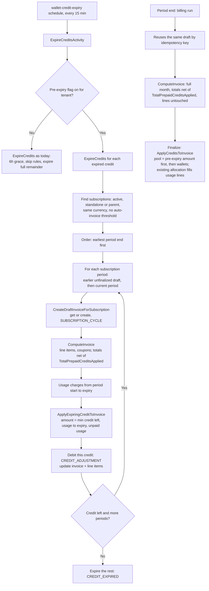

# Mid-period credit expiry

Status: approach chosen, pending review. Last updated 29 Sep 2026.
Linear: FLE-897. Code references are to `develop` @ `67fce0940`.

## The problem

When credits expire in the middle of a billing period, Flexprice expires everything left on them,
including the part that should have paid for usage before the expiry. That usage is then charged
to the customer's other credits, or to the customer.

Example: 100 purchased + 30 free credits, 20 of usage, free credits expire mid-period.
Expected balance afterwards: 100. Today: 80. Reproduced end to end on a local stack.

## How it works today

For a monthly period ending 1 Oct 00:00 UTC, default settings:

| When | What happens | Wallet changes? |
|---|---|---|
| During the period | Usage lands in ClickHouse | No. Only the ongoing balance (calculated on read) goes down |
| 1 Oct ~00:02 | Billing run creates an empty draft and rolls the subscription to the next period | No |
| ~00:17, or the first wallet balance read | Draft is computed: line items and totals | No |
| ~02:02–02:35 | Draft is finalized. Credits are applied here | **Yes**, the only time usage is taken from the wallet |

The daily draft setting (`draft_invoice_recompute_config`) would create the draft early, but no
tenant has it on.

The expiry job runs every 15 minutes. It picks up credits that expired more than 6 hours ago and
debits everything left on them.

### Why credits get lost

1. **Expiry removes the full remainder** (`ExpireCredits`, `wallet.go:2516`). At expiry, this
   period's usage hasn't been taken from the wallet yet, so all of it looks unused.
2. **An invoice can only use credits that expire on or after its period end**
   (`FindEligibleCredits`, `internal/repository/ent/wallet.go:267`).

The ongoing balance hides this: it shows usage as spent, but only as a calculation on the wallet
total. No credit is marked as used until finalization.

## Chosen approach: apply the credit to the period's draft at expiry

At expiry, get or create the subscription's draft for the current period, compute it, apply the
expiring credit to it (capped at usage up to the expiry), and expire the rest. The period-end
billing run reuses the same draft and finalizes it as usual; finalization only adds other credits
for what's still unpaid.

The draft invoice itself is the record of what the credit paid. No new table, no holds.

### Flow



### Walk-through (case 2)

| Step | Current | Ongoing |
|---|---|---|
| Top-ups: 100 purchased, 30 free | 130 | 130 |
| Usage 20 | 130 | 110 |
| Expiry: draft computed, 20 applied from free credits, 10 expired | 100 | 100 |
| Period end: draft recomputed with the full month; invoice-level total keeps the 20 | 100 | 100 − later usage |
| Finalization: other credits pay only what's unpaid | 100 − later usage | same |

### Changes by function

| Parent | Function | File | Change |
|---|---|---|---|
| Config | `FeatureFlagConfig` | `internal/config/config.go`, `config.yaml` | Global flag + enabled-tenants list, off by default |
| `ExpireCreditsActivity` | expired-credit filter | `internal/temporal/activities/cron/wallet_activities.go:55` | Flag on: `expiry <= now − 2h` (buffer for late events; usage is still capped at the expiry time). Flag off: unchanged (6h) |
| `ExpireCreditsActivity` | `ExpireCredits` | `internal/ee/service/wallet.go:2516` | Flag on: skip `shouldSkipCreditExpiry…`; for each eligible subscription period, get or create the draft, compute it, apply the credit, then expire only what's left. Flag off: unchanged |
| `ExpireCredits` | `CreateDraftInvoiceForSubscription` | `internal/ee/service/invoice.go:411` | No change. Called directly (same key the billing run uses) |
| Every compute (expiry, period-end invoice workflow, compute API) | `ComputeInvoice` | `internal/ee/service/invoice.go:448` | Recalculate `Total`, `AmountDue`, `AmountRemaining` net of `TotalPrepaidCreditsApplied` (today they're reset to gross). Line items untouched. Never mark SKIPPED when credits are applied |
| `ComputeInvoice` | `reconcileLineItems` | `internal/ee/service/invoice.go:3584` | No change. Draft lines carry no credits; they get them at finalization through the normal allocation |
| `ExpireCredits` | usage up to expiry | reuse `GetMeterUsageForSubscription` (`subscription.go:6240`) + `CalculateMeterUsageCharges` (`billing_meter_usage.go:64`) | Small helper: usage charges for `[period_start, expiry)` |
| `ExpireCredits` | **new** `ApplyExpiringCreditToInvoice` | `internal/ee/service/credit_adjustment.go` | Debit the specific credit with `ParentCreditTxID` (skips eligibility), reason `CREDIT_ADJUSTMENT`, reference = invoice, metadata `adjustment_type=pre_expiry` (informational only), idempotency key = invoice + credit. Add to `TotalPrepaidCreditsApplied` and recalculate totals. Lines untouched |
| `performFinalizeInvoiceActions` | `ApplyCreditsToInvoice` | `internal/ee/service/credit_adjustment.go:207` | Put the pre-expiry amount (`TotalPrepaidCreditsApplied` on the draft) at the front of the credit pool as a source with nothing to debit, before the wallets. Skip it in the debit loop (it was debited at expiry). Don't return early for "no wallet with a balance" when it's above 0. Invoice total = sum of lines, as today |
| `ApplyCreditsToInvoice` | `CalculateCreditAdjustments` | `internal/ee/service/credit_adjustment.go:65` | Allocation logic unchanged: fills usage lines in order, drawing from the pool in order, so the pre-expiry amount is used first. Only the pool input changes. Invoices without pre-expiry credits behave exactly as today |
| `GetWalletBalanceV2` | `computeRealtimeBalanceDefault` + `GetUnpaidInvoicesToBePaid` | `internal/ee/service/wallet.go:3342`, `internal/ee/service/invoice.go:2619` | Per subscription, compare each invoice's period with the subscription's current period (see "Ongoing balance" below). Unpaid usage = `Σ(usage Amount − LineItemDiscount) − inv.TotalPrepaidCreditsApplied` instead of per line, so drafts with no line-level credits are right. Uses the invoices already loaded; no extra query |
| `VoidInvoice` callers | `validateInvoiceVoidable` | `internal/ee/service/invoice.go:1372` | Reject void if the invoice has a `pre_expiry` credit adjustment (API, recalculate, line-item edit) |
| Zoho webhook | `VoidInvoice` → refund | `internal/ee/service/refund.go:308` | Zoho has already voided it, so allow it, but return the pre-expiry part as a credit that expires immediately |
| Immediate cancel, plan change with `anchor_at_effect`, scheduled cancel firing | `CancelSubscription` (`subscription.go:1900`), `applyAnchorReset` / `settlePlanChange` (`subscription_change_v2.go:1032`, `:1208`), scheduled cancellation processor | various | Before the new invoice: undo a current-period draft with pre-expiry credits (relabel as expired, archive the draft). See "Subscription cancel and plan change" |
| Line items repo | `ListByInvoiceID` | `internal/repository/ent/invoice_line_item.go` | Order by `created_at, id` so allocation at finalization is deterministic |

Not changed: `FindEligibleCredits`, the billing and invoice workflows, draft finalization, the
daily draft job, the UI and API.

Rough size: around 10 files plus tests, 1.5 to 2 weeks for one engineer.

### Ongoing balance

Today: `ongoing = wallet.balance − (current-period usage from ClickHouse + unpaid invoices)`.
Unpaid invoices skip drafts whose period hasn't ended.

Two problems once credits are applied to drafts at expiry:

- **Mid-period:** the wallet was already debited for pre-expiry usage, but ClickHouse usage still
  includes it. Case 2 would show 80 instead of 100.
- **Between period end and rollover** (~2 min, longer if the billing run is late): the
  subscription still points at the old period, so ClickHouse usage covers it, and the ended draft
  is also counted as unpaid. The same period is counted twice.

Rule, per subscription, for each of its subscription invoices:

| Invoice period | Treatment |
|---|---|
| Before the subscription's current period (it has rolled over) | Count as unpaid, as today |
| Equal to the current period (mid-period draft, or ended but not rolled over yet) | Not unpaid. Subtract its `TotalPrepaidCreditsApplied` from the subscription's ClickHouse usage, capped at that usage |

```
pending_sub = usage_sub(current period) − min(current-period draft TotalPrepaidCreditsApplied, usage_sub)
ongoing     = wallet.balance − Σ pending_sub − unpaid (past-period invoices only)
```

Examples (case 2): at expiry, usage 20, applied 20 → pending 0, ongoing 100. After 15 more usage
→ pending 15, ongoing 85.

Why not skip usage when the draft owes 0: the draft is a snapshot from expiry; usage after it is
only in ClickHouse.

### Subscription cancel and plan change

Our draft is found again only through its key: subscription + period start/end + billing reason
(`invoice.go:215–229`). Anything that cuts the period short leaves it orphaned.

**Cancellation** (`CancelSubscription`, `subscription.go:1900`)

| Type | What happens today | Our draft |
|---|---|---|
| `end_of_period` | Schedule fires at the normal period end; billing run makes the final invoice | ✅ same key, reused |
| `immediate` | `current_period_end` = cancel date, status cancelled (`:6082–6092`). Final invoice only if `cancel_immediately_invoice_policy = generate_invoice` (default skip): `PRORATION`, `[period_start, cancel date]`, finalized right away | ❌ orphaned. With `generate_invoice`: the new invoice bills pre-expiry usage again, because its "already billed" check only loads invoices fully inside `[start, cancel date]` (`billing.go:2110`, `invoice.go:1151`) and our draft ends later, so the customer pays twice. With skip: our draft is never finalized and shows as unpaid forever |
| `scheduled_date` mid-period | Schedule fires through the billing run at that date | ⚠️ very likely orphaned (period ends at the cancel date); not fully traced |

**Plan change** (`ExecutePlanChange`, `subscription_change_v2.go:838`)

| Mode | What happens today | Our draft |
|---|---|---|
| Deferred to period end | Schedule fires at the boundary after the old period is invoiced | ✅ reused |
| Immediate, `billing_period_behaviour = unchanged` (default) | Old plan's line items end at the change, new plan's start; same period; cycle invoice bills both at period end | ✅ same key, reused |
| Immediate, `anchor_at_effect` | Period restarts at the change (`applyAnchorReset`, `:1032`). Old plan's usage `[period_start, change]` billed now on an outgoing-usage invoice (`SUBSCRIPTION_UPDATE`, `:1140`), finalized as part of the change | ❌ orphaned, pre-expiry usage billed twice |

**Fix for v1: undo before the period is cut short**

In immediate cancel (both invoice policies), plan change with `anchor_at_effect`, and scheduled
cancel when it fires mid-period, before the new invoice is created:

1. Find the subscription's `SUBSCRIPTION_CYCLE` draft for the current period with
   `TotalPrepaidCreditsApplied > 0`.
2. Relabel that amount as expired: a credit row, then `CREDIT_EXPIRED`. No net balance change.
3. Archive the draft (as the pay-first failure flows do, `subscription_addon_change.go:780`).
4. Let the flow continue; its invoice bills the usage and uses the remaining eligible credits.

The customer gets today's outcome in these flows (the credit counts as expired), but nothing is
billed twice and nothing is left orphaned.

**Later: carry the credit over.** Reuse our draft as the cancel invoice (change its period end
and billing reason, recompute, finalize), so the customer keeps the benefit. Needs changes to the
cancel flow; doesn't fit the plan-change path, which builds its outgoing-usage invoice separately.

**Pending:** which transaction reason the undo credit row uses (reuse `INVOICE_VOID_REFUND`, or a
new reason). Also check pause and trace the scheduled-date cancel before building.

## Decisions

| Decision | Why |
|---|---|
| Fix it, rather than forbid mid-period expiry (option 0) | API callers, duration grants and top-ups from earlier periods can still expire mid-period; the UI rule alone doesn't prevent it |
| Keep one invoice per period, no separate invoice at expiry (option 2) | A separate finalized invoice splits the period: tiered pricing restarts, extra invoice per expiry through sync, tax and payment |
| Create the period's draft at expiry | The draft becomes the record of what the credit paid; no new table. The billing run reuses it through the same idempotency key |
| Call `CreateDraftInvoiceForSubscription` + `ComputeInvoice` directly, not a workflow | We need the computed draft right away; the daily-draft workflow is a thin wrapper around the same function. The billing workflow would roll the period |
| Not `CreateComputedDraftInvoice`, not a one-off invoice | Compute ignores caller line items for subscription invoices, and a hand-built request risks a second draft for the period. One-off = separate invoice |
| New `ApplyExpiringCreditToInvoice`, not `ApplyCreditsToInvoice` at expiry | `ApplyCreditsToInvoice` pools the whole wallet and checks eligibility against the period end, so it would skip the expiring credit and use purchased ones |
| Invoice-level `TotalPrepaidCreditsApplied` is the only record on the draft; at finalization it's the first source in the credit pool | It survives recompute. Draft lines stay as compute builds them (no line writes on recompute, draft sync and UI unchanged). At finalization the existing allocation puts every credit, pre-expiry or not, onto the lines, so lines always add up to the invoice total. No new spread function, and no "already applied" logic in `CalculateCreditAdjustments` |
| Cap at usage up to the expiry, not the draft total | The job runs up to 15 minutes after expiry; the draft includes usage after it |
| Retroactive price changes out of scope | Rare; handled today by void and regenerate, which we block for these invoices |
| Reuse the existing expiry workflow | New logic lives in `ExpireCredits`; schedule, workflow and activity stay. Per-credit timers (FLE-898) aren't needed for the fix |
| Several subscriptions: earliest period end first | That's the invoice that would finalize first today, so behavior matches |
| Run 2 hours after expiry (`expiry <= now − 2h`) | Late events timestamped before the expiry get counted. Usage is capped at `[period_start, expiry)`, so nothing after the expiry is counted. Cost accepted: for about 2h15m the current balance is high by the whole remaining credit and the ongoing balance by the unused part |
| Finalization pool sized by eligible credits, not `wallet.balance` (finalization slice) | During the wait the expired credit is still in the wallet. An invoice finalized then, with a period ending after the expiry, would plan to use it but the debit can't, and fails with "insufficient balance". Exists today with the 6h window too |
| Tenant rollout flag, old behavior when off | Safe rollout; the old grace and skip rules stay for everyone else |
| Block voids of invoices with pre-expiry credits | Void refunds credits with no expiry, which would bring expired free credits back permanently |
| No new transaction reason | `CREDIT_ADJUSTMENT` + metadata for the applied part, `CREDIT_EXPIRED` for the rest. No corrections needed without retroactive changes |

Options considered and dropped: forbid mid-period expiry (0); keep back at expiry without an
invoice (1, 1b); separate invoice at expiry (2); holds in wallet transaction metadata settled at
finalization (3). Option 3 was dropped once retroactive changes went out of scope and we chose to
create the draft at expiry.

## Cases

Unless stated otherwise: 100 purchased credits (no expiry), 30 free credits, conversion rate 1,
$1 per unit, period ends 22 Sep 00:00 UTC. "Balance" is the ongoing balance.

| # | Case | Today | With the fix |
|---|---|---|---|
| 1 | Free partly used (20), expiry 22 Sep 05:00, after period end | 100 ✅, only because finalization (~02:30) beats the expiry job (05:00 + 6h) | 100 ✅. If the ended period's draft is still unfinalized at 05:00, the credit is applied to it |
| 2 | Free partly used (20), expiry 21 Sep 15:00, mid-period | **80** ❌ | **100** ✅ |
| 3 | Free fully used (30), expiry after period end | 100 ✅ | 100 ✅ |
| 4 | Free fully used (30), no purchased credits | 0 ✅ | 0 ✅. Wallet balance is 0 after expiry, but the applied amount stays on the invoice |
| 5 | 90-day grant expires just after a period ends, draft not finalized yet | Safe only if finalized within ~6h | ✅ Earlier unfinalized draft is handled first |
| 6 | Price raised retroactively, to before expiry | — | Out of scope |
| 7 | Price lowered retroactively | — | Out of scope |
| 8 | Threshold billing on | Credits used only by windows ending before expiry | Excluded in v1 (see open points) |
| 9 | Invoice finalizes inside the 6h grace window | Can fail "insufficient balance" (pool counts the expired credit, debit skips it) | Flag on: no grace window; credit is applied or expired within 15 min |
| 10 | Late events for usage before expiry | — | Not covered: amount is fixed at expiry. Accepted for v1 |
| 11 | Invoice voided after pre-expiry credits applied | Refund comes back with no expiry | Void blocked; Zoho void re-expires the credit immediately |
| 12 | Several subscriptions (A used 20, period ends 1 Oct; B used 25, ends 15 Oct), 30 free left | Whichever finalizes first | A gets 20, B gets 10, nothing expires |

## Open points

1. **Threshold billing.** A threshold invoice moves `current_period_start`, so the billing run's
   key no longer matches the draft created at expiry, which would be left orphaned with credits
   on it. Proposal: skip subscriptions with an auto-invoice threshold in v1.
2. **Cancel and plan change.** See "Subscription cancel and plan change" above: undo in v1,
   carry over later. Still to trace: scheduled-date cancel and pause.
2b. **Parked: period ends inside the 2h wait.** By the time the job runs, the subscription may have
   rolled over, so pre-expiry usage sits on the previous period's unfinalized draft (case 5 becomes
   required, not a follow-up). Rare race if a tenant's finalization delay is shorter than the wait:
   the previous draft may finalize first, giving today's outcome. To discuss.
2d. **Open: eligibility tolerance at finalization (closes 2b).** Let an invoice's finalization use
   credits that expired up to 2h (the wait) before its period end: reference = `period_end − 2h`
   in `processDebitOperation` and `capToEligibleCredits`, not in `FindEligibleCredits` itself.
   Only for invoice debits and only for tenants with the setting on. Closes the race exactly:
   if the gap between expiry and period end is over 2h, the expiry job runs before period end.
   Cost: the credit can also pay up to 2h of usage after its expiry. Product to confirm.
2c. **Parked: threshold billing.** Threshold invoices keep the same subscription and move
   `current_period_start`. Fine if the threshold fires before the expiry; if it fires after, it
   bills pre-expiry usage again and orphans our draft. Needs a hook (carry the amount over to the
   threshold invoice). To discuss; excluded until then.
3. **Draft-stage sync.** Computing a draft notifies Tabs sync; mid-period drafts will now sync.
   Confirm that's fine.
4. **Drafts visible mid-period.** Customers and admins will see a draft invoice before period
   end. Product to confirm.
5. **Void UX.** Error message and any support path for invoices that must be corrected.
6. **Cost at expiry.** Each credit × subscription runs a draft compute and a usage query in
   ClickHouse. Fine at current volume; split into child workflows if a tenant expires thousands
   of grants at once.
7. **Earlier attempt.** Confirm why PR #2309 was reverted.

## Other bugs found along the way

- Finalization delay can't be set to 0: `FinalizationDelaySeconds` has `omitempty`
  (`internal/types/invoice.go:418`).
- Expiry hold misses credits spanning several periods: it only matches invoices whose period
  contains the credit's creation date (`wallet.go:2637`).
- Void refunds come back with no expiry (`refund.go:308`), for every invoice, not only this case.
- Reading a wallet balance computes uncomputed drafts, and every recompute restarts the
  finalization delay.
- Local stack from scratch: Postgres init runs `V5` before tables exist; `local-dev-user` isn't
  seeded; Temporal lacks the custom search attributes.

## How other platforms do it

| Platform | Usage before expiry, invoiced after | How |
|---|---|---|
| Metronome | Uses the credit | Draft exists from period start, credits applied on the draft continuously, line items split by date; locked at finalization (24h grace) |
| Orb | Uses the credit | Credits debited as events arrive, per day, at the usage time |
| Stripe | Lost | Credits apply at finalization, only if they expire after the period end |
| Lago | Lost (inferred) | Remaining credits voided at expiry |

Our approach is closest to Metronome: credits applied to the draft before finalization, one
invoice per period.
