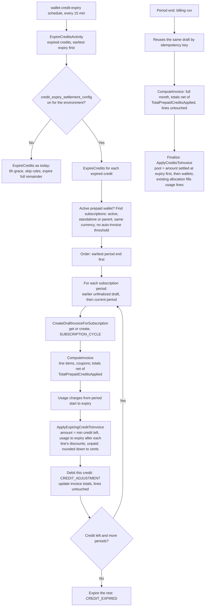

# Mid-period credit expiry

Status: v1 implemented (this PR), v2 designed. Last updated 30 Sep 2026.
Linear: FLE-897. Line references are approximate.

## The problem

When credits expire in the middle of a billing period, Flexprice expires everything left on them,
including the part that should have paid for usage before the expiry. That usage is then charged
to the customer's other credits, or to the customer.

Example: 100 purchased + 30 free credits, 20 of usage, free credits expire mid-period.
Expected balance afterwards: 100. Today: 80. Reproduced end to end on a local stack.

## How it works today

For a monthly period ending 1 Oct 00:00 UTC, default settings:

| When | What happens | Wallet changes? |
|---|---|---|
| During the period | Usage lands in ClickHouse | No. Only the ongoing balance (calculated on read) goes down |
| 1 Oct ~00:02 | Billing run creates an empty draft and rolls the subscription to the next period | No |
| ~00:17, or the first wallet balance read | Draft is computed: line items and totals | No |
| ~02:02–02:35 | Draft is finalized. Credits are applied here | **Yes**, the only time usage is taken from the wallet |

The daily draft setting (`draft_invoice_recompute_config`) would create the draft early, but no
tenant has it on.

The expiry job runs every 15 minutes. It picks up credits that expired more than 6 hours ago and
debits everything left on them.

### Why credits get lost

1. **Expiry removes the full remainder** (`ExpireCredits`, `wallet.go:2516`). At expiry, this
   period's usage hasn't been taken from the wallet yet, so all of it looks unused.
2. **An invoice can only use credits that expire on or after its period end**
   (`FindEligibleCredits`, `internal/repository/ent/wallet.go:267`).

The ongoing balance hides this: it shows usage as spent, but only as a calculation on the wallet
total. No credit is marked as used until finalization.

## Chosen approach: apply the credit to the period's draft at expiry

At expiry, get or create the subscription's draft for the current period, compute it, apply the
expiring credit to it (capped at usage up to the expiry), and expire the rest. The period-end
billing run reuses the same draft and finalizes it as usual; finalization only adds other credits
for what's still unpaid.

The draft invoice itself is the record of what the credit paid. No new table, no holds.

### Flow



### Walk-through (case 2)

| Step | Current | Ongoing |
|---|---|---|
| Top-ups: 100 purchased, 30 free | 130 | 130 |
| Usage 20 | 130 | 110 |
| Expiry: draft computed, 20 applied from free credits, 10 expired | 100 | 100 |
| Period end: draft recomputed with the full month; invoice-level total keeps the 20 | 100 | 100 − later usage |
| Finalization: other credits pay only what's unpaid | 100 − later usage | same |

### Changes by function

| Parent | Function | File | Change |
|---|---|---|---|
| Settings | `credit_expiry_settlement_config` | `internal/types/settings.go`, `internal/ee/service/settings.go` | Per-environment setting, off by default |
| `ExpireCreditsActivity` | expired-credit cutoff | `internal/temporal/activities/cron/wallet_activities.go` | Setting on: `expiry <= now − 2h` (buffer for late events; usage is still capped at the expiry time). Off: unchanged (6h) |
| `ExpireCreditsActivity` | `ExpireCredits` → `settleExpiringCredit` | `internal/ee/service/wallet.go`, new `credit_expiry.go` | Setting on: active prepaid wallets only; for each eligible subscription, earlier unfinalized cycle drafts then the current period's draft (created only if it has usage before the expiry); cap at usage before the expiry after each line's discounts (the line's own net / gross, as finalization prices it), rounded down to cents; apply, then expire the rest, in one transaction |
| `ExpireCredits` | `UsageChargesForWindow` | `internal/ee/service/billing_meter_usage.go` | Usage charges for `[period_start, expiry)` |
| `ExpireCredits` | `GetOrComputeCurrentPeriodDraft`, `ListOpenCycleDrafts` | `internal/ee/service/invoice.go` | Get or create + compute the current draft (same key as the billing run); list earlier open cycle drafts |
| `ExpireCredits` | **new** `ApplyExpiringCreditToInvoice` | `internal/ee/service/credit_adjustment.go` | Debit the specific credit with `ParentCreditTxID`, reason `CREDIT_ADJUSTMENT`, reference = invoice, idempotency key = invoice + credit. Add to `TotalPrepaidCreditsApplied` and recalculate totals. Lines untouched |
| Every compute | `ComputeInvoice` | `internal/ee/service/invoice.go` | Totals net of `TotalPrepaidCreditsApplied` (read from the denomination for custom currency). Never SKIPPED when credits are applied |
| `performFinalizeInvoiceActions` | `ApplyCreditsToInvoice` | `internal/ee/service/credit_adjustment.go` | Amount settled at expiry first in the pool, not debited again. Wallets capped at credits eligible at the period end. `CalculateCreditAdjustments` unchanged |
| Finalization schedule | `IsFinalizationDue` | `internal/ee/service/invoice.go` | Wait while a credit that expired inside the draft's period is unprocessed, at most expiry + 3h |
| Wallet balance | `pendingCharges`, `GetUnpaidInvoicesToBePaid` | `internal/ee/service/wallet.go`, `invoice.go` | Skip the current period's cycle draft (usage is counted live) and net its applied credits off that usage. Past drafts: subtract applied credits not yet on lines |
| `ExpireCreditsActivity` | expired-credit listing | `internal/temporal/activities/cron/wallet_activities.go` | Sorted by `expiry_date asc`, so a later credit can't take usage an earlier one could pay. An environment whose setting can't be read is skipped, not the whole run |
| Line items repo | `ListByInvoiceID` | `internal/repository/ent/invoice_line_item.go` | Order by `created_at, id` so allocation at finalization is deterministic |

### Ongoing balance

Today: `ongoing = wallet.balance − (current-period usage from ClickHouse + unpaid invoices)`.
Unpaid invoices skip drafts whose period hasn't ended.

Two problems once credits are applied to drafts at expiry:

- **Mid-period:** the wallet was already debited for usage before expiry, but ClickHouse usage still
  includes it. Case 2 would show 80 instead of 100.
- **Between period end and rollover** (~2 min, longer if the billing run is late): the
  subscription still points at the old period, so ClickHouse usage covers it, and the ended draft
  is also counted as unpaid. The same period is counted twice.

Rule, per subscription, for each of its subscription invoices:

| Invoice period | Treatment |
|---|---|
| Before the subscription's current period (it has rolled over) | Count as unpaid, as today |
| Equal to the current period (mid-period draft, or ended but not rolled over yet) | Not unpaid. Subtract its `TotalPrepaidCreditsApplied` from the subscription's ClickHouse usage, capped at that usage |

```
pending_sub = usage_sub(current period) − min(current-period draft TotalPrepaidCreditsApplied, usage_sub)
ongoing     = wallet.balance − Σ pending_sub − unpaid (past-period invoices only)
```

Examples (case 2): at expiry, usage 20, applied 20 → pending 0, ongoing 100. After 15 more usage
→ pending 15, ongoing 85.

Why not skip usage when the draft owes 0: the draft is a snapshot from expiry; usage after it is
only in ClickHouse.

### Scope: v1 and v2

**v1 (built):** apply at expiry, recompute, finalization, ongoing balance, earlier periods and the
finalization hold, voids as today. Threshold subscriptions are excluded.

**v2 (designed below):** reuse the open draft on cancel, threshold and scheduled cancel (one hook),
then plan change.

Until v2, an immediate cancel or an `anchor_at_effect` plan change after a mid-period expiry bills
the usage before expiry twice or orphans the draft. Before enabling v1 for a tenant:

1. Check how often the tenant uses immediate cancel and `anchor_at_effect` plan changes.
2. Monitor for orphaned drafts: open cycle drafts with credits applied whose subscription has a
   later period start or is cancelled. Fix those by hand.

### v2: cancel, threshold and scheduled cancel reuse the open draft

Our draft is found again only through its key: subscription + period start/end + billing reason.
Anything that ends the period early would otherwise create a second invoice and leave our draft
orphaned, with credits on it, never finalized, and counted as unpaid in the ongoing balance.

Rule: when a flow ends the period early and an open `SUBSCRIPTION_CYCLE` draft exists for the same
subscription and period start, reuse it: move its period end, set the flow's billing reason and
idempotency key, recompute, finalize. The credits applied at expiry stay on it and finalization
places them first. Without an open draft, the flow runs as today. The Metronome model needs the
same rule, since a draft is always open from period start.

| Flow | Today | Draft reused as |
|---|---|---|
| Immediate cancel, `generate_invoice` | `CreateSubscriptionInvoice`, `PRORATION`, `[start, cancel]` | End → cancel date, `PRORATION`. Recompute uses the cancel reference point: arrear charges up to the cancel |
| Threshold billing | `CreateSubscriptionInvoice`, `AUTO_INVOICE_THRESHOLD`, `[start, now]` (`subscription.go:8110`) | End → now, `AUTO_INVOICE_THRESHOLD`. Threshold subscriptions are no longer excluded at expiry |
| Scheduled-date cancel mid-period | Period end shortened at request; the billing run creates a cycle draft `[start, cancel date]` | Billing run moves our draft's end instead |

The recompute covers the whole window up to the cut, including usage after the draft was last
computed. One lookup before a draft is created covers all three: cancel and threshold go through
`CreateSubscriptionInvoice` → `CreateEmptyDraftInvoice`, the billing run through
`CreateDraftInvoiceForSubscription`.

Not affected: end-of-period cancel, and pause/resume (no period change, no invoice).

To handle:

1. **Credit expired just before the cut.** These flows finalize through `ProcessDraftInvoice`,
   which skips the finalization hold. Run expiry settlement for the customer's credits that
   expired inside the window before the cut.
2. **Idempotency key.** Unique per tenant and environment (`ent/schema/invoice.go:285`). Change it
   inside the flow's transaction with the draft locked, so the expiry job and billing run can't
   race it.
3. **Webhooks and sync.** The draft is updated and finalized, not created; integrations that
   synced it must follow the period change (open point 1).
4. **Skip policy** and **backdated cancel** (`subscription.go:1950`): open points 6 and 7.
5. **Paused subscriptions.** The expiry path only takes active subscriptions, so a credit that
   expires during a pause expires in full. Today's behavior; accepted for v1.

### v2: plan change

| Mode | Our draft |
|---|---|
| Deferred to period end | Fine: same period, reused by the billing run |
| Immediate, anchor unchanged (default) | Fine: old plan's lines end at the change, new plan's start, same period and key |
| Immediate, `anchor_at_effect` | Problem: period restarts at the change |

With `anchor_at_effect`, today's flow (`subscription_change_v2.go:148`, `:1241`) builds the old
plan's usage lines for `[period start, change date]` once (`outgoingUsageInvoiceRequest`), passes
them as given to `CreateInvoice` as a one-off `SUBSCRIPTION_UPDATE` invoice, settles fixed charges
through proration, and moves the period start to the change date. Nothing is recomputed.

Example: 100 purchased + 30 free (expire 10 Sep), usage 20 by 10 Sep and 10 more by 20 Sep, plan
change on 20 Sep. Expected wallet: 90.

| | 10 Sep expiry | 20 Sep plan change | Wallet |
|---|---|---|---|
| Today's flow | 20 applied to our draft, 10 expired | New one-off invoice bills all 30 from the wallet; our draft is orphaned | 70 ❌ |
| Draft reused | Same | Our draft: end → 20 Sep, lines replaced with the same outgoing usage lines, finalized; 20 already paid, wallet pays 10 | 90 ✅ |

Why the lines are passed in, not recomputed: a recompute reads the subscription, which is on the
new plan by then, and the cancel reference point would add fixed charges the plan change already
settles through proration. The change flow's lines are usage-only and up to the change date,
exactly what today's invoice gets.

To handle:

1. New path: finalize an existing draft with given lines (no recompute).
2. Match today's invoice: today's is `ONE_OFF` with no coupons, credits and taxes applied at
   creation. The reused draft stays a subscription invoice (credits and taxes at finalization);
   drop its compute-time coupon discounts and finalize it inside the change.
3. Preview shows the reused draft without writing.
4. Custom currency: lines in the draft's denomination.
5. Check whether a plan change can be backdated (open point 7).

Order: the cancel/threshold hook first, plan change second.

## Decisions

| Decision | Why |
|---|---|
| Fix it, rather than forbid mid-period expiry (option 0) | API callers, duration grants and top-ups from earlier periods can still expire mid-period; the UI rule alone doesn't prevent it |
| Keep one invoice per period, no separate invoice at expiry (option 2) | A separate finalized invoice splits the period: tiered pricing restarts, extra invoice per expiry through sync, tax and payment |
| Create the period's draft at expiry | The draft becomes the record of what the credit paid; no new table. The billing run reuses it through the same idempotency key |
| Call `CreateDraftInvoiceForSubscription` + `ComputeInvoice` directly, not a workflow | We need the computed draft right away; the daily-draft workflow is a thin wrapper around the same function. The billing workflow would roll the period |
| Not `CreateComputedDraftInvoice`, not a one-off invoice | Compute ignores caller line items for subscription invoices, and a hand-built request risks a second draft for the period. One-off = separate invoice |
| New `ApplyExpiringCreditToInvoice`, not `ApplyCreditsToInvoice` at expiry | `ApplyCreditsToInvoice` pools the whole wallet and checks eligibility against the period end, so it would skip the expiring credit and use purchased ones |
| Invoice-level `TotalPrepaidCreditsApplied` is the only record on the draft; at finalization it's the first source in the credit pool | It survives recompute. Draft lines stay as compute builds them. At finalization the existing allocation puts every credit, settled at expiry or not, onto the lines, so lines always add up to the invoice total, and `CalculateCreditAdjustments` needs no change |
| Usage before expiry priced with each line's own discounts | Finalization places credits per line at that line's net amount. A blended ratio across lines over- or under-applies when lines carry different line-level coupons; invoice-level coupons are already spread per line by `DistributeInvoiceLevelDiscount` |
| Cap at usage up to the expiry, not the draft total | The job runs up to 15 minutes after expiry; the draft includes usage after it |
| Retroactive price changes out of scope | Rare; handled today by void and regenerate |
| Reuse the existing expiry workflow | New logic lives in `ExpireCredits`; schedule, workflow and activity stay. Per-credit timers (FLE-898) aren't needed for the fix |
| Several subscriptions: earliest period end first | That's the invoice that would finalize first today, so behavior matches |
| Run 2 hours after expiry (`expiry <= now − 2h`) | Late events timestamped before the expiry get counted. Usage is capped at `[period_start, expiry)`, so nothing after the expiry is counted. Cost accepted: for about 2h15m the current balance is high by the whole remaining credit and the ongoing balance by the unused part |
| Finalization pool sized by eligible credits, not `wallet.balance` | During the wait the expired credit is still in the wallet. An invoice finalized then, with a period ending after the expiry, would plan to use it but the debit can't, and fails with "insufficient balance". Exists today with the 6h window too |
| Environment setting (`credit_expiry_settlement_config`), old behavior when off | Safe rollout per tenant environment; the old grace and skip rules stay for everyone else |
| Voids refund credits settled at expiry as today, with no expiry | Same as voiding any invoice with credits applied: `AmountPaid + TotalPrepaidCreditsApplied` comes back as a top-up with no expiry. Drafts are voidable, so this covers drafts carrying credits applied at expiry. The expired share becoming permanent is the existing void behavior for every invoice, fixed separately if ever |
| Early period cuts reuse the open draft, no undo | The credit keeps paying for the usage it covered; one invoice per cut; matches the Metronome model where a draft is always open |
| Expired credits processed earliest expiry first | Each credit is capped at usage before its own expiry; the earliest-expiring one can only pay older usage, so it goes first |
| No new transaction reason | `CREDIT_ADJUSTMENT` + metadata for the applied part, `CREDIT_EXPIRED` for the rest. No corrections needed without retroactive changes |

Options considered and dropped: forbid mid-period expiry (0); keep back at expiry without an
invoice (1, 1b); separate invoice at expiry (2); holds in wallet transaction metadata settled at
finalization (3). Option 3 was dropped once retroactive changes went out of scope and we chose to
create the draft at expiry.

## Cases

Unless stated otherwise: 100 purchased credits (no expiry), 30 free credits, conversion rate 1,
$1 per unit, period ends 22 Sep 00:00 UTC. "Balance" is the ongoing balance.

| # | Case | Today | With the fix |
|---|---|---|---|
| 1 | Free partly used (20), expiry 22 Sep 05:00, after period end | 100 ✅, only because finalization (~02:30) beats the expiry job (05:00 + 6h) | 100 ✅. If the ended period's draft is still unfinalized at 05:00, the credit is applied to it |
| 2 | Free partly used (20), expiry 21 Sep 15:00, mid-period | **80** ❌ | **100** ✅ |
| 3 | Free fully used (30), expiry after period end | 100 ✅ | 100 ✅ |
| 4 | Free fully used (30), no purchased credits | 0 ✅ | 0 ✅. Wallet balance is 0 after expiry, but the applied amount stays on the invoice |
| 5 | 90-day grant expires just after a period ends, draft not finalized yet | Safe only if finalized within ~6h | ✅ Earlier unfinalized draft is handled first |
| 6 | Price raised retroactively, to before expiry | — | Out of scope |
| 7 | Price lowered retroactively | — | Out of scope |
| 8 | Threshold billing on | Credits used only by windows ending before expiry | Excluded until the reuse hook lands; then the threshold invoice reuses the open draft |
| 9 | Invoice finalizes inside the 6h grace window | Can fail "insufficient balance" (pool counts the expired credit, debit skips it) | Pool capped at eligible credits; finalization waits for a pending expiry |
| 10 | Late events for usage before expiry | — | Not covered: amount is fixed at expiry. Accepted for v1 |
| 11 | Invoice voided after credits settled at expiry applied | Refund comes back with no expiry | Same: refunded with no expiry, draft or finalized |
| 12 | Several subscriptions (A used 20, period ends 1 Oct; B used 25, ends 15 Oct), 30 free left | Whichever finalizes first | A gets 20, B gets 10, nothing expires |
| 13 | Two grants in one period (10 expiring day 10, 20 expiring day 20); usage 8 before day 10, 24 before day 20 | Both expire in full (except what finalization catches) | 8 + 16 applied, in either separate runs or one run |

## Verification

Unit tests cover each rule above (`credit_expiry_settlement_test.go`,
`invoice_compute_prepaid_credits_test.go`). Run end to end on a local
stack, checking wallet, ledger and invoices at each step:

| Run | Result |
|---|---|
| Case 2: expiry mid-period, more usage, period end, finalization | Wallet 85 (today: 65); finalization debited only the unpaid 15 |
| Expiry inside the period, finalization tried before the expiry job | Finalization held; expiry applied to the ended period's draft; finalized with no extra debit |
| Expiry after period end, period finalized first | Period paid from the credit as today; next period's draft got the usage before expiry |
| Expiry after period end, expiry job first | Both periods' drafts got credits in one run |
| Case 13, separate runs and same run | 24 applied both ways |
| Void of a draft with credits applied at expiry | Refunded as a top-up with no expiry |

## Open points

1. **Draft-stage sync.** Computing a draft notifies Tabs sync; mid-period drafts will now sync,
   and reused drafts change period. Confirm that's fine.
2. **Drafts visible mid-period.** Customers and admins will see a draft invoice before period
   end. Product to confirm.
3. **Cost at expiry.** Each credit × subscription runs a draft compute and a usage query in
   ClickHouse. Fine at current volume; split into child workflows if a tenant expires thousands
   of grants at once.
4. **Earlier attempt.** Confirm why PR #2309 was reverted.
5. **Parked: read "already applied" from the ledger.** Finalization reads credits applied before
   it from `TotalPrepaidCreditsApplied`. `RecalculateInvoiceV2` overwrites that field with what it
   could place on lines, so a price cut or an empty draft can drop the amount settled at expiry and
   finalization debits the wallet again. Fix: sum the invoice's `CREDIT_ADJUSTMENT` debits
   instead.
6. **Product call: immediate cancel with `skip` invoice policy** (the default). No final invoice
   is created, so a draft opened mid-period (credits applied at expiry, or the daily draft
   setting) is orphaned: never finalized, and counted as unpaid in the ongoing balance from its
   original period end. Decide what closing the draft means when the tenant wants no invoice.
7. **Product call: cut before the expiry.** A backdated cancel (or plan change) can end the period
   before a credit's expiry after that credit already paid for usage up to the expiry. The
   shortened invoice bills less usage than the credit paid. Decide what happens to the excess.
8. **Accepted: failure breaks processing order.** The expiry job processes expired credits earliest
   expiry first, so a later credit can't take usage an earlier one could pay. If the earlier
   credit's expiry fails in a run and the later one succeeds, the later one takes that usage and
   the earlier one applies nothing on retry. Needs a mid-run error; fix if seen: skip later credits
   of the same wallet after a failure in that run.

## Other bugs found along the way

- Finalization delay can't be set to 0: `FinalizationDelaySeconds` has `omitempty`
  (`internal/types/invoice.go:418`).
- Expiry hold misses credits spanning several periods: it only matches invoices whose period
  contains the credit's creation date (`wallet.go:2637`).
- Void refunds come back with no expiry (`refund.go:308`), for every invoice, not only this case.
- Reading a wallet balance computes uncomputed drafts, and every recompute restarts the
  finalization delay.

## How other platforms do it

| Platform | Usage before expiry, invoiced after | How |
|---|---|---|
| Metronome | Uses the credit | Draft exists from period start, credits applied on the draft continuously, line items split by date; locked at finalization (24h grace) |
| Orb | Uses the credit | Credits debited as events arrive, per day, at the usage time |
| Stripe | Lost | Credits apply at finalization, only if they expire after the period end |
| Lago | Lost (inferred) | Remaining credits voided at expiry |

Our approach is closest to Metronome: credits applied to the draft before finalization, one
invoice per period.
