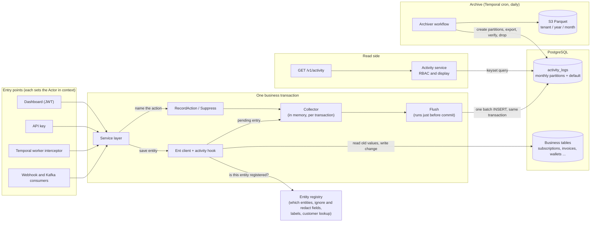

# Activity Log — ERD

Date: 2026-10-03
Status: **Proposed**
Author: Paras Aghija
Branch: `feat/activity-log`

---

## 1. Summary

Flexprice needs an activity log: a per-tenant, immutable record of what changed, who changed it, through which channel, and what the before/after values were, exposed in the dashboard and the public API. The primary user is the tenant auditing their own account. Support, debugging, and compliance are secondary users of the same data.

## 2. Goals and non-goals

### Goals

- A tenant can answer "what happened to subscription X, who did it, and what changed" from the dashboard or API within seconds of the change.
- Every mutation on a registered entity is captured, whether it came from the dashboard, the API, a Temporal workflow, a gateway webhook, or a Kafka consumer.
- Actor identity distinguishes user, API key, and system workflow. An empty actor is a bug, not a blank.
- Activity is kept hot for 90 days. Older data is dumped to Parquet.
- The schema can later hold security events (user, role, API key lifecycle) and failed actions without a redesign.

### Non-goals

- Security events and failed-action rows. Columns are reserved; nothing writes them.
- Querying cold data from the dashboard. Cold access is an export job.
- Replacing or changing the webhook pipeline. `system_events` is untouched.

## 3. Competitor analysis

| | Lago | Metronome | Orb | Stripe |
|---|---|---|---|---|
| UI | Developers → Activity Logs list; Activity Logs tab per object | Audit log page with export | Changelog tab per price only | Events page; admin Activity Logs API |
| Actor | user email or API key id | user name/email or API token name | not documented | user, service account, system |
| Source | `front`, `api`, `system` | request id, IP, user agent | not documented | `dashboard`, `scim`, `sso` |
| Diff | yes; full object on create | no, action and description only | yes per price edit | yes, `previous_attributes` |
| Outcome | committed only | success, failure, pending | n/a | yes |
| Pagination | cursor | cursor, max 100 | n/a | cursor |
| Retention | 30 days premium, unlimited enterprise | not stated | not stated | not stated |

Takeaways applied: the envelope matches the industry shape; `customer_id` is first-class as in Lago; creates carry a snapshot as in Lago; security events are a separate category as Lago does; failures are reserved as Metronome and Stripe record them; our hook-based capture is deliberately stronger than Lago's explicit calls, which is why Lago documents known gaps.

## 4. System events table

`system_events` is the closest thing Flexprice has today, but it exists for webhook delivery. The activity log gets its own table, and the webhook pipeline stays as it is.

- **No before/after.** A `system_events` row carries only `{entity_id, tenant_id}`; the entity is fetched at delivery time. The activity log stores old and new values when the change happens.
- **Immutable.** An audit log is only trustworthy if rows cannot be edited or removed after the fact, and are kept as long as the tenant needs them. `system_events` follows what webhook delivery needs, so it cannot make that promise.
- **Coverage independent of webhooks.** A `system_events` row exists only where a service chose to emit a webhook. Plan, price, addon, coupon, tax, credit grant, API key and user have zero rows, while subscription (70%) and wallet (17%) rows are mostly cron emissions and balance ticks. The activity log captures every mutation on a registered entity, with no new webhook event names.
- **Built for audit reads.** Entity, customer, subscription and actor lookups, newest first, with their own indexes and partitions. `system_events` is indexed on tenant and environment only.

## 5. Postgres vs ClickHouse

The activity log is written one row at a time inside a business transaction, and read as short, recent, keyed lookups. ClickHouse is built for the opposite: large analytical scans over years of data. Because the hot window is only 90 days, ClickHouse's main strengths are not needed, and Postgres wins on the things that matter here.

### 5.1 Why Postgres

- **Visible on the next request.** The row is inserted in the same transaction as the change, so there is no lag. ClickHouse needs an outbox, Kafka and a consumer, and the UI would have to handle "may be delayed".
- **No missing entries.** A row commits or rolls back with the change it describes. Publishing after commit can lose a row if the process dies in between, and the fix for that is an outbox table, which is Postgres anyway.
- **Customer data deletion.** When a customer asks for their data to be deleted (GDPR right to erasure, CCPA right to delete), Postgres scrubs the rows with a plain `UPDATE`. ClickHouse needs a part rewrite or a delete-and-merge.
- **Small hot tier.** 90 days is under 10M rows and about 20 GB, which Postgres handles comfortably. ClickHouse's compression and tiering only pay off when years of history are served in place.

Older data is dumped to Parquet either way.

## 6. Requirements

| # | Requirement | Source |
|---|---|---|
| R1 | Entry visible to the tenant on the next request after the change | Primary use case |
| R2 | Actor is one of user, API key (with owning user), system (with workflow or event name), customer portal | Discussion |
| R3 | Updates carry a field-level diff; creates carry a redacted snapshot; deletes carry the id | Competitor review (Lago, Stripe) |
| R4 | Coverage is guaranteed for registered entities regardless of which code path mutates them | system_events gap analysis |
| R5 | Entries for one request are linkable (shared request id) | Plan change touching line items |
| R6 | 90-day hot retention, older data in Parquet on S3 | User decision |
| R7 | Personal data can be erased on request without rewriting history | GDPR |
| R8 | Schema extends to security events and failed actions without migration of existing rows | User decision |
| R9 | API-key callers can read the log | Primary use case is self-audit via API |

## 7. Architecture



The business tables and `activity_logs` are in the same Postgres, so the log row commits or rolls back with the change it describes. The registry is read-only configuration. Only the flush step writes to `activity_logs`, and only the archiver removes data from it.

### 7.1 Components

Each component has one job.

| Component | Package | Responsibility |
|---|---|---|
| Actor | `internal/types` | Struct in context: type, id, label, owning user id. Set by auth middleware, the Temporal worker interceptor and the webhook and Kafka consumers |
| Registry | `internal/activity` | Per-entity declaration: ent type name, entity type constant, ignored fields, redacted fields, customer-id derivation, label function, action templates |
| Hook | `internal/activity` | Ent hook on the writer client. Computes raw change records for registered entities |
| Collector | `internal/types` (context) + `internal/activity` | Per-transaction accumulator keyed by entity type and id |
| RecordAction, Suppress | `internal/activity` | Service-facing calls to name an action and attach metadata, or to skip recording |
| Flush | `internal/activity` | Builds rows and inserts them using the transaction |
| Repository | `internal/repository/ent` | Batch insert via raw SQL; list and get via the ent query builder with a custom cursor predicate |
| Service | `internal/ee/service` | Authorization, display composition |
| Handler | `internal/api/v1` | `GET /v1/activity`, `GET /v1/activity/{id}` |
| Archiver | `internal/temporal/workflows/cron` | Partition maintenance, Parquet export, verify, drop |

### 7.2 Actor model

Every row records who did it. There are three kinds of actor, decided by who started the work:

| Who started it | Actor type | Recorded as |
|---|---|---|
| A person in the dashboard (JWT) | `user` | user id and name |
| An API call with a key | `api_key` | key id and name, plus the user who owns the key |
| The platform itself: Temporal workflows, webhook and Kafka consumers, signup and login | `system` | the workflow, event or consumer group name |

```go
type Actor struct {
    Type   ActorType // user | api_key | system
    ID     string    // user id, key id, or the workflow / event / consumer name
    Label  string    // display name, captured at write time
    UserID string    // owning user for api_key, and for system writes made on a user's behalf
}
```

The actor is set once at each entry point and carried in the request context: auth middleware for users and keys, and a worker interceptor for Temporal so no activity can miss it. `GetUserID(ctx)` keeps working and reads from the actor, so `created_by` and `updated_by` improve as a side effect. A row with no actor is refused at flush and logged as an error, so a new entry point that forgets to set one shows up as a bug and not a blank.

#### System writes made on a user's behalf

Sometimes a user's request makes the platform write more than was asked. A wallet top-up, for example, also creates an invoice, a checkout session and a payment. The user did not choose those rows, so they are recorded as `system`, with the requester kept as the owner:

```
POST /wallets/:id/top-up   by test@gmail.com
  wallet_transaction.created   actor: user    test@gmail.com
  invoice.created              actor: system  "Credit purchase billing"   owner: test@gmail.com
  payment.created              actor: system  "Checkout"                  owner: test@gmail.com
```

The log then says what decided the change and who triggered it. The code that does this derived work marks it with one call, `WithDerivedSystemActor(ctx, name, label)`. Everything written under that context is recorded as that system actor.

### 7.3 Ent hook

Registered once on the writer client via `client.Use(activity.Hook(registry))`. Behaviour by operation:

| Op | Before mutation | After mutation | Record |
|---|---|---|---|
| Create | nothing | read the returned entity | `created`, redacted snapshot |
| UpdateOne, Update (bulk-shaped) | resolve ids via the mutation's `IDs(ctx)`; `SELECT` the columns in `m.Fields()` for those ids inside the transaction | nothing | `updated` with `{field: {from, to}}` for fields whose value actually changed; `deleted` if `status` moved to `deleted` |
| DeleteOne, Delete | resolve ids | nothing | `deleted` |

Repository updates in this codebase are bulk-shaped, `Update().Where(id, tenant, env).Set…()`, 82 sites versus 24 single-row sites. Ent cannot provide old values for them, so the hook fetches old values itself with one `SELECT` per mutation. Because those updates set every column on every save, the diff step must drop unchanged fields; a save with no effective change records nothing.

Dropped before diffing: `updated_at`, `updated_by`, `created_at`, `created_by`, and the registry's per-entity ignore list. Redacted before storing: the registry's per-entity redact list; redacted fields appear in `changes` as `{"redacted": true}` so the reader knows the field changed without seeing the value.

A diff error never fails the mutation. It produces a degraded record (action known, `changes` null, `metadata.degraded = "diff_error"`) plus an error log and a counter metric.

One constraint comes with this. The old-value `SELECT` and the customer lookup run inside the business transaction with no savepoint, so a wrong table or column name in a registration would abort the business write. Every registration's names must be checked against the ent schema.

### 7.4 Collector and flush

`WithTx` installs the collector next to the existing post-commit hook list. Nested `WithTx` calls reuse the outer collector. A mutation outside any transaction (no collector in context) writes its row directly, through the mutation's own database client.

Flush runs inside `withTx` immediately before `tx.Commit()`:

1. Merge entries per `(entity_type, entity_id)`: first `from`, last `to`, union of fields. A create followed by an update in one transaction is one `created` row with the final snapshot.
2. Resolve action: the name set by the recorder, else `<entity>.<created|updated|deleted>`.
3. Attach actor, source, request id, customer id (from the registry derivation), occurred_at (transaction time).
4. One batch `INSERT`. An insert failure fails the transaction. There is no silent-skip path.

### 7.5 RecordAction and Suppress

The hook records every change to a registered entity automatically, using generic names such as `subscription.updated`. Services can steer this with two calls, and only where it matters.

#### RecordAction: name a change and say why

The hook can see that `status` went from `active` to `paused`, but not that this was a pause, or the reason. The service knows, so it says so:

```go
s.SubRepo.Update(txCtx, sub)          // the hook records the status change

activity.RecordAction(txCtx, activity.Entry{
    EntityType: "subscription",
    EntityID:   sub.ID,
    Action:     "subscription.paused",
    Metadata:   map[string]any{"reason": req.Reason},
})
```

| | Without `RecordAction` | With `RecordAction` |
|---|---|---|
| Action | `subscription.updated` | `subscription.paused` |
| Changes | `status: active → paused` | `status: active → paused` |
| Metadata | empty | `{"reason": "customer request"}` |
| Timeline | "Billing Sync updated Growth" | "Billing Sync paused Growth" |

It can be called before or after the save, and it only applies inside a transaction.

It also covers writes the hook cannot see. A few updates are raw SQL and bypass ent, for example archiving a price. These pass the changes themselves:

```go
activity.RecordAction(ctx, activity.Entry{
    EntityType: "price", EntityID: id,
    Action:     "price.archived",
    Changes:    map[string]activity.Change{"status": {From: "published", To: "archived"}},
})
```

It is called for pause, resume, cancel and plan change on subscriptions, finalize, void and paid on invoices, customer delete, price archive and plan price sync. Everything else keeps the generic name.

#### Suppress: do not record this

Some code saves often and is not worth logging. The wallet balance check runs on every usage tick, and recording it would flood the log and add a read to each tick:

```go
evalCtx := activity.Suppress(ctx, "wallet balance evaluation")
balance, err := s.GetWalletBalanceV2(evalCtx, walletID)   // nothing recorded under evalCtx
```

Only code that receives `evalCtx` is skipped. Using the original `ctx` afterwards, for example for an auto top-up that should appear in the customer's timeline, records as normal. A reason is required and logged at info level, so suppression always leaves a trace.

The wallet's stored `balance` and `credit_balance` change only when a transaction is applied, and are recorded then as `wallet.updated`. The ongoing balance is computed on read and never stored, so there is nothing to log for it.

### 7.6 Cost on the write path

Capture runs inside the business transaction, so writes to registered entities get slightly slower. Reads, unregistered entities and suppressed code pay nothing.

| Extra work | When |
|---|---|
| One `SELECT` for old values | Each update or delete on a registered entity |
| One `SELECT` for the customer | Entities without a `customer_id` column |
| One multi-row `INSERT`, four index entries per row | Once per transaction, just before commit |

Things to watch:

- **Many writes in one transaction.** The `SELECT` is per mutation, so a flow that updates many registered rows at once, such as subscription create with many line items, pays it many times.
- **Locks held longer.** The extra queries run while the transaction holds its locks, including the wallet advisory lock, so concurrent operations on one hot wallet wait a little longer.
- **Shared failure.** If the activity `INSERT` fails, the business write rolls back with it.

Busy paths that are not worth logging use `Suppress`, and `activity.enabled` turns capture off entirely.

## 8. Data model

### 8.1 Table

Hand-written dbmate migration under `migrations/versioned/postgres/`. The ent schema for `activity_logs` exists for typed reads but carries `entsql.Skip()` so ent auto-migration never creates or alters the table. Precedent: `revenue_facts` has an ent schema and a hand-written migration.

Deploy the migration before the binary, or set `FLEXPRICE_ACTIVITY_ENABLED=false` for the first roll. Rows are written inside the business transaction, so a missing table fails every write to a registered entity.

```sql
CREATE TABLE activity_logs (
    id                 VARCHAR(50)  NOT NULL,
    tenant_id          VARCHAR(50)  NOT NULL,
    environment_id     VARCHAR(50)  NOT NULL,
    category           VARCHAR(20)  NOT NULL DEFAULT 'business',
    entity_type        VARCHAR(64)  NOT NULL,
    entity_id          VARCHAR(50)  NOT NULL,
    entity_label       VARCHAR(255) NOT NULL DEFAULT '',
    action             VARCHAR(128) NOT NULL,
    actor_type         VARCHAR(20)  NOT NULL,
    actor_id           VARCHAR(128) NOT NULL,
    actor_label        VARCHAR(255) NOT NULL DEFAULT '',
    actor_user_id      VARCHAR(50)  NULL,
    source             VARCHAR(20)  NOT NULL,
    customer_id        VARCHAR(50)  NULL,
    subscription_id    VARCHAR(50)  NULL,
    request_id         VARCHAR(64)  NULL,
    outcome            VARCHAR(20)  NOT NULL DEFAULT 'success',
    error_code         VARCHAR(64)  NULL,
    changes            JSONB        NULL,
    snapshot           JSONB        NULL,
    metadata           JSONB        NULL,
    occurred_at        TIMESTAMPTZ  NOT NULL,
    PRIMARY KEY (occurred_at, id)
) PARTITION BY RANGE (occurred_at);

CREATE INDEX activity_logs_entity_idx
    ON activity_logs (tenant_id, environment_id, entity_type, entity_id, occurred_at DESC, id DESC);

CREATE INDEX activity_logs_feed_idx
    ON activity_logs (tenant_id, environment_id, occurred_at DESC, id DESC);

CREATE INDEX activity_logs_customer_idx
    ON activity_logs (tenant_id, environment_id, customer_id, occurred_at DESC, id DESC);

CREATE INDEX activity_logs_actor_idx
    ON activity_logs (tenant_id, environment_id, actor_type, actor_id, occurred_at DESC, id DESC);
```

Column notes:

- No `BaseMixin`. Its `status`, `updated_at`, `updated_by` imply mutability; rows are never updated except for erasure.
- `category` is `business` in v1. Reserved: `security`.
- `outcome` is `success` in v1. Reserved: `failure`, with `error_code`.
- `source` is one of `dashboard`, `api`, `workflow`, `webhook`, `consumer`, `portal`.
- `customer_id` and `subscription_id` are first-class because they are the two universal roll-ups in billing (Lago stores both). `subscription_id` is derived exactly like `customer_id`: copied from the row when present, else resolved through the same parent lookup. The registry derives it per entity (subscription → `customer_id`, invoice → `customer_id`, wallet → `customer_id`, customer → own id).
- `entity_label` is the human descriptor captured at write time, so history survives renames and deletions, exactly like `actor_label`. Not every entity has a name, so each registry entry defines a descriptor ladder from `LabelFields`: customer `name → external_id → short id`; subscription `lookup_key → short id` (plan and customer names are resolved on read); wallet `name → currency + wallet_type → short id`; invoice `invoice_number → short id`; plan `name → lookup_key → short id`; price `display_name → lookup_key → amount + currency + period → short id`; payment `amount + currency + gateway → short id`. The hook adds `LabelFields` to the old-value `SELECT` it already issues, so capturing the label costs no extra round trip.
- `changes` shape: `{"status": {"from": "active", "to": "paused"}, "email": {"redacted": true}}`.
- `snapshot` is the redacted created entity. Null for updates and deletes. The registry can cap or omit it per entity (invoices).
- `metadata` holds action-specific context and the `degraded` marker.
- Primary key includes `occurred_at` because Postgres requires the partition key in the primary key. `id` alone is still unique in practice (UUID with prefix `act_`).

### 8.2 Indexes

Four indexes, each one sort order of the same tuple, each serving one of the jobs the log is hired for:

| Index | Job |
|---|---|
| `entity_idx` (tenant, env, entity_type, entity_id, time) | "what happened to this entity" |
| `feed_idx` (tenant, env, time) | "what changed recently" |
| `customer_idx` (tenant, env, customer_id, time) | the customer tab roll-up, which is a v1 surface |
| `actor_idx` (tenant, env, actor_type, actor_id, time) | "what did this user or API key do", the first question after an incident or an offboarding |

Equality on the leading columns lands on a contiguous run already ordered by time, so every list query is an index range read with early stop. None can substitute for another: a different leading column means a different physical order. Four B-tree inserts per row at roughly a million rows a month is not a cost worth optimising. Queries always carry a time bound so partition pruning applies; the related-changes lookup by `request_id` bounds itself to the parent row's day.

### 8.3 Partitioning

Monthly range partitions on `occurred_at`, named `activity_logs_YYYY_MM`. The archiver (section 11) creates partitions three months ahead on every run, so an insert rarely hits a missing partition. The migration creates the current and next two months, and a `DEFAULT` partition catches any row whose month has no partition yet, so a business write never fails because the archiver was late. The archiver never exports or drops the default partition.

### 8.4 Entity registry

```go
type Definition struct {
    EntType       string                       // ent type name, e.g. "Subscription"
    EntityType    types.SystemEntityType
    Table         string                       // for the old-value SELECT
    LabelFields   []string                     // columns the label ladder needs; fetched with old values
    ParentFields  []string                     // columns CustomerLookup needs
    CustomerLookup func(ctx, Querier, fields) (string, error) // parent-row lookup when no customer_id column
    IgnoreFields  []string                     // never diffed (cached balances, counters)
    RedactFields  []string                     // diffed but value hidden
    SnapshotMode  SnapshotMode                 // full | none
    CustomerID    func(fields map[string]any) string
    Label         func(fields map[string]any) string   // "Invoice INV-0042"
    Actions       map[string]ActionTemplate    // optional per-action wording
    FieldLabels   map[string]FieldDisplay      // optional label + formatter hint
}
```

v1 registrations: every entity that reaches a customer, so the customer roll-up is complete.

| Linkage | Entities |
|---|---|
| Own `customer_id` | customer, subscription, invoice, wallet, wallet transaction, entitlement grant, payment method, credit note, invoice line item, subscription line item, checkout session |
| Via `subscription_id` | subscription phase, subscription schedule, subscription pause, credit grant, credit grant application, coupon association, coupon application |
| Via invoice or payment destination | payment, refund |
| Via `entity_type` / `entity_id` | addon association, tax association |
| Catalog, no customer | plan, price |

Entities without a `customer_id` column declare a `CustomerLookup`, one `SELECT` on the parent row inside the same transaction, and `ParentFields` so the parent key is fetched with the old values. A failed lookup logs and leaves the customer empty; the row is still written.

Wave 2 (catalog and settings): feature, entitlement, addon, coupon, meter, price unit, cost sheet, tax rate, group, settings, alert settings, connection, integration mapping. Wave 3 (`category = security`): user, API key secret, tenant, environment. Deferred children with no direct link: payment attempt, credit note line item, tax applied. Never: system events, incoming webhook events, scheduled tasks, tasks, workflow executions, sequences, revenue facts, analytics views, usage records, alert logs. Wallet transactions and entitlement grants are in v1 because background jobs write them on a customer's behalf, and they carry `customer_id`, so the customer roll-up shows "Workflow CreditGrantProcessing created credit 500 credits" with the wallet and customer linked.

### 8.5 Personal data policy

- `changes` stores raw values for business fields. Fields listed in `RedactFields` (tax ids, payment-method details, addresses if required by policy) store `{"redacted": true}`.
- `actor_label` is captured at write time so history survives user renames and deletions. It holds a display name, never an email for API keys.
- Erasure request for a customer: `UPDATE activity_logs SET changes = <redacted>, snapshot = NULL, actor_label = '[erased]' WHERE tenant_id = $1 AND customer_id = $2` on the hot tier, and a rewrite of that tenant's Parquet objects on the cold tier (section 11.4). This is a documented runbook, not a v1 feature.

## 9. Read side

### 9.1 Endpoints

| Method | Path | Purpose |
|---|---|---|
| `GET` | `/v1/activity` | List with filters and keyset pagination |
| `GET` | `/v1/activity/{id}` | Single entry |

No per-entity routes. Every surface calls the same list endpoint with different filters.

### 9.2 Filter

```go
type ActivityFilter struct {
    EntityType   *string   `form:"entity_type"`
    EntityID     *string   `form:"entity_id"`
    CustomerID   *string   `form:"customer_id"`
    SubscriptionID *string `form:"subscription_id"`
    ActorType    *string   `form:"actor_type"`
    ExcludeActorTypes []string `form:"exclude_actor_types"`
    ActorID      *string   `form:"actor_id"`
    Actions      []string  `form:"actions"`
    RequestID    *string   `form:"request_id"`
    StartTime    *time.Time `form:"start_time"`
    EndTime      *time.Time `form:"end_time"`
    Cursor       *string   `form:"cursor"`   // opaque, encodes (occurred_at, id)
    Limit        *int      `form:"limit"`    // default 50, max 200
}
```

Keyset pagination, not the repo's usual offset plus total count. Offset on an append-only partitioned table degrades with depth, and a total count across partitions is a full index scan per page. The response carries `next_cursor` and `has_more`; no total. The revenue facts filter already uses a cursor, so the shape is not new.

A list request with no `start_time` and no `end_time` defaults to the hot window. Queries always carry a time bound so partition pruning applies.

### 9.3 Response

```json
{
  "items": [{
    "id": "act_01HX…",
    "entity_type": "subscription",
    "entity_id": "sub_01HX…",
    "action": "subscription.paused",
    "actor": { "type": "api_key", "id": "sec_…", "label": "Billing Sync", "user_id": "user_…", "exists": true },
    "source": "api",
    "customer_id": "cus_…",
    "request_id": "req_…",
    "occurred_at": "2026-10-02T09:00:00Z",
    "changes": {
      "status": { "from": "active", "to": "paused", "label": "Status", "format": "enum" }
    },
    "metadata": { "reason": "customer request" },
    "entity_label": "Growth",
    "display": {
      "summary": "Billing Sync paused Growth",
      "entity_label": "Growth",
      "entity_exists": true
    }
  }],
  "next_cursor": "…",
  "has_more": true
}
```

`display` is computed by the service from the registry. Three tiers of wording:

1. **Generic, no code.** `{actor} {verb} {entity type} {entity label}`, for example "Alice updated wallet USD prepaid" or "Workflow CreditGrantProcessing created wallet transaction credit 500 credits". The entity label is the descriptor only, never the type noun, so the noun can be localised. Verb is the last segment of the action; one changed field is appended inline, several become "updated N fields".
2. **Per-action template, one line in the registry.** `subscription.paused → "{actor} paused {entity}"`.
3. **Custom function, rare.** Only when the sentence needs data outside the row. If it feels like one per action, the data belongs in `metadata` at write time instead.

The frontend ships an Arabic locale, so the sentence cannot be the only representation. `display` also carries `parts`, enough for the client to compose the summary through its own i18n:

```json
"display": {
  "summary": "Billing Sync paused Growth",
  "entity_label": "Growth",
  "parts": { "actor": "Billing Sync", "verb": "paused", "entity_type": "subscription", "entity": "Growth" }
}
```

`verb` is the action's last segment (`paused`, `updated`, `plan_changed`) and doubles as the i18n key; `entity_type` lets the client localise the noun. Change values and counts are not repeated in `parts`: the client reads them from `changes` (before/after per field, and its size is the count). API consumers read `summary`; the dashboard reads `parts`.

Field labels and formatter hints (`money`, `date`, `enum`, `boolean`, `text`) come from `FieldLabels` with snake_case humanization as the default. `metadata` is annotated the same way as `changes`, so the frontend never guesses what a key means.

Reference values are detected by id prefix. The repo's prefix table (`cust_`, `subs_`, `plan_`, `price_`, `inv_`, `wallet_`, `pay_`) maps to entity types, so any `from`, `to`, or metadata value carrying a known prefix gets `format: "ref:<entity_type>"` automatically. No registry entry has to declare that `plan_id` points at a plan. The frontend resolves references to names and links at read time.

### 9.4 Authorization

- Entity-scoped reads (`entity_type` and `entity_id` set, or `customer_id` set) require read permission on that entity type through the existing RBAC middleware.
- The tenant-wide feed requires a new `types.EntityActivity` with `ActionRead`.
- API keys are allowed. System actors are therefore visible to API consumers, which is correct for self-audit.
- Every query filters on tenant and environment from context. No cross-tenant path exists.

### 9.5 Frontend

One timeline component and one detail popup, both generic. The popup has five sections, all fed by the item above: header (summary), who (actor, source), when (occurred_at, request id), what changed (three-column diff table driven by `format`), context (entity link, customer link, metadata, "N related changes in this request" via a `request_id` filter). The only per-entity frontend code is the route map from entity type to page. Nested structures are never diffed: a line item is its own registered entity, linked by `request_id`.

## 10. Write-side details that affect other code

- `internal/postgres/client.go` `withTx`: install the collector after post-commit hooks; call flush before `tx.Commit()`; discard on rollback and panic.
- `internal/postgres/client.go` client construction: `writerClient.Use(activity.Hook(registry))`.
- `internal/rest/middleware/auth.go` `setContextValues`: set `Actor` alongside user id.
- Temporal activity entry points that currently call `SetUserID`: call `SetActor` with a system actor. Entry points that set nothing (alerts, gateway integrations, consumers) gain a system actor.
- `internal/webhook/handler/handler.go`: set a system actor from the event name where it sets `CtxUserID`.
- `types.GetUserID` reads from `Actor` first, then the legacy key.

## 11. Retention and archive

### 11.1 Policy

Hot window: 90 days, configurable in `config.yaml` under `activity.hot_window_days`. A partition is archivable once its upper bound is older than the window, so effective hot retention is 90 to 120 days. Per-tenant retention is a later feature and needs no schema change. The whole feature sits behind `activity.enabled`: when it is off, no hook or collector is installed and nothing is written.

### 11.2 Archiver workflow

Temporal cron, daily, registered alongside the other cron workflows in `internal/temporal/service/schedules.go`.

1. **Maintain partitions.** Create any missing monthly partition up to three months ahead.
2. **Find archivable partitions.** Any partition whose range end is before `now - hot_window_days`.
3. **Export.** For each, stream rows ordered by `tenant_id, occurred_at, id` and write Parquet to `s3://<bucket>/activity_logs/tenant_id=<t>/year=<yyyy>/month=<mm>/part-<n>.parquet`, 50k rows per file, using the Arrow Go Parquet writer. Hive-style keys so Athena, DuckDB, and ClickHouse's `s3()` function read them without a load step.
4. **Verify.** Compare the partition row count to rows written, per tenant. Write a manifest object with counts and object checksums.
5. **Drop.** `ALTER TABLE activity_logs DETACH PARTITION …` then `DROP TABLE …`. Only after a verified manifest.
6. **Idempotence.** A rerun finds the manifest, re-verifies counts against the still-attached partition if present, and skips or resumes.

The archiver touches nothing on the write path.

### 11.3 Cold access

Requests for history older than the hot window run as a Temporal export job: query the tenant's Parquet objects for the date range, filter, write a CSV to S3, and return a signed URL. Because ClickHouse is already deployed, the job uses `SELECT … FROM s3('…/tenant_id=<t>/*/*.parquet', Parquet) WHERE …` as the query engine. No new infrastructure, no live S3 reads from the dashboard.

### 11.4 Erasure on cold data

Parquet files are immutable, so an erasure request rewrites the affected `tenant_id=<t>/year=/month=` objects without the customer's rows, then updates the manifest. Partitioning the S3 layout by tenant keeps each rewrite small. Runbook, not a v1 feature.
