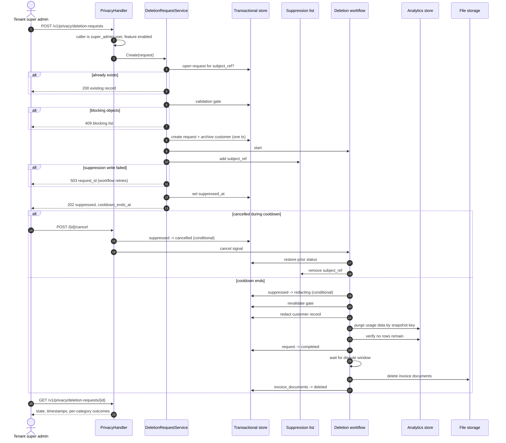

# PRD — Customer Data Deletion

Author: Agrim Mittal  
Date: 2026-10-06  
Ticket: [FLE-1475](https://linear.app/flexprice/issue/FLE-1475/offboarding-of-users-and-complete-data-removal-basis-configured)  
Related: [#2963 — Bulk Event Deletion](https://github.com/flexprice/flexprice/pull/2963) (`docs/design/2026-09-29-FLE-687-events-deletion.md`)

---

## 1. Overview

A tenant-facing API that permanently erases a customer's personal data on the tenant's instruction, including customers who have already churned. Written instructions run through the same flow. A second API lets the tenant check, at any time, whether the deletion has finished and what was deliberately kept and why.

A request goes through three stages:

1. **Suppression**, as soon as the request is accepted. The customer can no longer be read through any API, the UI or an export, and new events for them are refused.
2. **Cooldown**, a per-tenant window during which the tenant can cancel the request. The data stays suppressed throughout.
3. **Redaction**, when the cooldown ends. This cannot be undone. Personal data is overwritten in the transactional store and the customer's usage data is purged from the analytics store.

Data the law or the contract requires us to keep is kept for its configured period and reported as retained. It is never held back silently.

This is a different feature from bulk event deletion (#2963), but both are built on the same deletion machinery. Section 7 covers how they relate.

---

## 2. Problem & Context

### Current Behavior

`DELETE /v1/customers/{id}` only archives the customer. Their personal data stays in the transactional store, their usage events and meter usage stay in the analytics store, invoice PDFs stay in object storage, and nothing records that a deletion was asked for.

Nothing stops new events from arriving for a customer after they are archived.

### Problem

Tenants act as data controllers under GDPR and similar laws, and Flexprice processes data on their behalf. Contracts now require Flexprice to provide:

- a programmatic endpoint that triggers permanent deletion of a customer's data, churned accounts included;
- prompt execution of the deletion, whether the instruction came through the API or in writing;
- retention periods that follow each tenant's contract;
- an API the tenant can use to verify and audit that the deletion is complete.

None of this exists today.

### Legal frame

- **Deadline.** The controller must tell the data subject what action was taken within one month (GDPR Art. 12(3)). That can be extended by two further months for complex or numerous requests. Our own commitment is one month from request to redaction, with no extension, so the cooldown plus the redaction run must fit inside it.
- **No minimum retention under GDPR.** Data is kept no longer than necessary (Art. 5(1)(e)). Every retention period here comes from another law or from the tenant's contract:
  - Tax and accounting law requires keeping financial records (Art. 17(3)(b)).
  - Records needed to defend a dispute or chargeback can be kept for the dispute window (Art. 17(3)(e)).
- **Anonymised data is out of scope** (Recital 26). Financial records are kept, but dissociated from the person.
- **Pseudonymised data is still personal data** (Recital 26). The permanent audit record is pseudonymised, not anonymised, and is kept to demonstrate compliance (Art. 5(2)).

### Expected Outcome

The tenant sends one API call per customer and gets back a request id. The customer disappears from every read path straight away. The tenant can cancel while the cooldown runs. Within one month of the request, personal data is erased or anonymised, except the categories retained under BR1, each of which is reported with its end date and basis. At any later point the tenant can fetch the request and see, for each category of data, whether it was deleted, redacted or kept, until when, and on what basis.

---

## 3. Goals & Non-Goals

### Goals

- Programmatic deletion request per customer, idempotent across repeated and concurrent calls.
- Written instructions recorded through the same flow, with who entered them and what instruction they came from.
- Customer suppressed from every read path and from ingestion as soon as the request is accepted.
- Off by default. Flexprice enables it per tenant, only for tenants whose contract covers it.
- Callable only by the tenant's super admins.
- A per-tenant cooldown, with cancellation allowed while it runs.
- Personal data and usage data redacted within one month of the request, apart from the categories retained under BR1.
- Per-tenant retention periods for each category of data that is kept, set to match the tenant's contract.
- A verification API that reports every category of data as deleted, redacted or retained, with its retained-until date and basis.
- A permanent, pseudonymised record that the deletion happened.

### Non-Goals

- **No deletion of financial records within their retention period.** Invoices, payments, wallet transactions and refunds are kept, dissociated from the person.
- No purge of financial records once their retention period expires. That is a separate scheduled job.
- No surgical edits to backups. Backups age out on their normal rotation.
- No deletion of a whole tenant at contract end, including the tenant's own users. That is a future phase (§13).
- No self-serve UI. API only.
- No bulk or CSV requests. One request per customer.
- No blocking of a person who signs up again as a genuinely new customer, once the tenant confirms it (BR6).

---

## 4. Use Cases

### UC1 — Churned customer, deletion via API

A tenant's end user closes their account and asks to be erased. The customer has no active subscription and every invoice is settled. A tenant super admin calls the endpoint and receives `202` with state `suppressed` and a `cooldown_ends_at`. When the cooldown ends, redaction runs and the request moves to `completed`. The tenant polls the verification endpoint and stores the outcome for their own audit trail.

### UC2 — Written instruction

A tenant emails a deletion instruction. A Flexprice operator enters it through the operator route (R4), with `request_channel = written`, the operator's identity, and a reference to the written instruction. Everything after that is identical, and the tenant's super admin can verify it through the tenant API.

"Written" always means an instruction from the tenant, who is the controller. A request that reaches Flexprice directly from a data subject is forwarded to the tenant and is never acted on by Flexprice.

### UC3 — Cancelled during cooldown

The tenant sent the request by mistake. Before the cooldown ends, they cancel it. The customer returns to the status they had before the request, the suppression is lifted, and the request ends `cancelled`.

### UC4 — Repeat request

The tenant sends the same request again, possibly months later. The response is `200` with the original record, so they don't get a duplicate or an error. This is also how the tenant answers "did you delete this person?".

### UC5 — Customer still billing

The customer has an active subscription or an unsettled invoice. The request is refused with `409` and a list of what's blocking it. The tenant cancels or settles those, then asks again.

### UC6 — Failed request

A new subscription appears during the cooldown, so the recheck fails and the request ends `failed`. The tenant either resolves the blocker and retries the request, or cancels it to restore the customer.

### UC7 — Same person signs up again

After an erasure, the same person signs up again under the same `external_id`. The tenant creates the customer with `confirm_new_subject = true`. The suppression is lifted for that `external_id`, the lift is recorded on the old request, and new events attach to the new customer.

---

## 5. Requirements

### Functional Requirements

**R1.** `POST /v1/privacy/deletion-requests` accepts a `customer_id`, runs the validation gate, records the request, archives the customer, applies suppression, and starts the deletion workflow. It returns `202` once suppression is in effect (R7).

**R2.** `GET /v1/privacy/deletion-requests/{id}` returns the request's state, its timestamps, and one entry per data category with its outcome, retained-until date and basis. This is the verification API.

**R3.** `GET /v1/privacy/deletion-requests` lists requests filtered by `customer_id`, `subject_ref` or `state`, so tenants can audit without storing our request ids.

**R4.** Written instructions are entered by a Flexprice operator through a separate operator route, never through the tenant API. The request records `request_channel = written`, `created_by` (the operator) and `instruction_ref` (a reference to the written instruction). The tenant API's access rules (R12) are unchanged.

**R5.** `POST /v1/privacy/deletion-requests/{id}/cancel` cancels a request in `suppressed` or `failed`. It restores the customer's pre-request status and lifts the suppression. Cancelling any other state is refused.

**R6.** `POST /v1/privacy/deletion-requests/{id}/retry` restarts a `failed` request from the recheck. It is refused in any other state.

**R7.** `suppressed_at` is set only once both the customer archive and the suppression list entry are in effect. `202` is returned only after that. If the suppression write fails, the request stays recorded without `suppressed_at`, the call returns `503` with the request id, and the workflow retries the write as its first step. A repeated `POST` returns the same request.

**R8.** Personal data and usage data are redacted within one month of the request, apart from the categories retained under BR1. The cooldown plus the redaction run must fit inside that month.

**R9.** Event ingestion refuses events for a suppressed customer with `422`. A bulk call accepts the other events and returns a `rejected` list with each refused event's index, event id and reason (`customer_suppressed`). Clients retry nothing from that list.

**R10.** Every request leaves a permanent, pseudonymised record: `subject_ref`, `customer_id`, timestamps, channel, state and per-category outcomes. It keeps no external identifier and no personal field. `customer_id` is a Flexprice-generated id. It stays because it links the retained financial records, and after redaction it no longer resolves to any personal data.

**R11.** Redaction ends with a verification step. A category is reported `deleted` only when no rows remain for the customer in its store. The customer record is reported `redacted` only when every personal field has been overwritten. The row itself stays, because retained financial records reference it.

**R12.** Every tenant `/v1/privacy` endpoint requires a user caller holding `super_admin` in the tenant. API keys and service accounts are refused with `403`, whatever roles they carry.

**R13.** The feature, the cooldown and the retention periods live in a new `customer_data_deletion` setting (§8). Flexprice sets it per tenant directly in the database, with values taken from the tenant's contract. It is not exposed through the settings API, so a tenant can neither enable the feature nor change its values. Unset values fall back to the defaults.

**R14.** When the feature is not enabled, `POST /v1/privacy/deletion-requests` returns `404`. Reads, cancel and retry keep working on requests created while it was enabled, so turning the feature off never strands an open request or hides an audit record. Ingestion runs the suppression check only for tenants with the feature enabled or with any suppression entry in force, so every other tenant's hot path is unchanged.

**R15.** Checks run in a fixed order: caller (`403`), feature (`404`), input (`400`), customer (`404`), existing request (`200`), validation gate (`409`).

### Business Rules

**BR1.** Data falls into four classes:

| Class | Data | Outcome |
|---|---|---|
| Redact at cooldown end | Customer name, email, contact, address, `metadata`, `external_id`; `metadata` on the customer's subscriptions, wallets, invoices and payments | `redacted`. Fields overwritten, rows kept |
| Delete at cooldown end | Usage events and meter usage; #2963 deletion records | `deleted` |
| Keep for the dispute window | Invoice documents (PDFs render name and address) | `retained`, then `deleted` when the tenant's dispute window ends |
| Keep for the legal period | Invoices, payments, wallet transactions, refunds | `retained`. Their financial fields are unchanged. Their free-form `metadata` is redacted with the first class. Plan and price names on line items are tenant configuration, not personal data |

**BR1a.** Transient copies. Personal data passing through the event pipeline and the workflow engine ages out on their own retention, which must stay inside the one-month commitment. The deletion workflow's inputs carry only the request id, never personal data. Support conversations are outside this API and follow the support process.

**BR2.** The dispute window runs from the customer's newest transaction. If it has already passed when the cooldown ends, invoice documents are deleted together with everything else. Failed payments, voided invoices and non-production environments have no dispute window.

**BR3.** The request is refused while the customer is still billing: an active, paused, trialing or incomplete subscription; a draft invoice; a finalized invoice that is not yet settled; or a payment still in flight. A finalized invoice that is settled does not block.

**BR4.** `subject_ref = SHA-256(external_id || tenant_salt)`. It is the idempotency key and the audit handle. It is pseudonymous, not anonymous: anyone holding the salt can test a candidate `external_id` against it. The salt is per tenant, is readable only by the deletion service, and is never returned by any API.

**BR5.** `external_id` is captured when the request is made, because it is the key the analytics purge runs on, and redaction destroys it in the customer row. The snapshot is cleared once the request reaches `completed`.

**BR6.** Creating a customer whose `external_id` hashes to a suppressed `subject_ref` returns `409` unless the call sets `confirm_new_subject = true`. With confirmation, the suppression entry is removed and the old request records `suppression_lifted_at` and `suppression_lifted_by`. Without this, events for the new customer would be refused forever, or, if the check were skipped, would silently attach post-deletion usage to an erased person.

**BR7.** #2963's guards do not apply here. Its finalized-invoice guard refuses any finalized invoice in the period, and its marketplace guard refuses marketplace customers. Here, only an unsettled finalized invoice blocks (BR3), and a marketplace customer is not refused. Erasure is a legal instruction, and financial records are protected by BR1 rather than by refusing the request.

**BR8.** The setting in force is captured on the request when it is created. Later changes to the setting don't move an existing request's dates.

**BR9.** Financial retention is counted from each record's own date: the invoice date, payment date, transaction date or refund date. The `financial_records` category reports the latest of those end dates as its `retained_until`.

**BR10.** Every state change is a conditional update on the current state. Cancel succeeds only from `suppressed` or `failed`. The move to `redacting` succeeds only from `suppressed`. Whichever commits first wins, and the other gets `409` or stops.

### Validations / Constraints

**V1.** `customer_id` must resolve in this environment. Archived customers are valid targets.

**V2.** On the operator route, `request_channel` is `written` and `instruction_ref` is required. On the tenant route, `request_channel` is always `api`.

**V3.** `cooldown_days` is between 0 and 14. `dispute_window_days` is between 0 and 180. `financial_retention_years` is between 1 and 15. These ranges are checked when Flexprice writes the setting.

**V4.** The validation gate (BR3) runs again just before redaction, because a new subscription may have been created during the cooldown.

---

## 6. Product Behavior and Workflow

### States

```
suppressed ──(cooldown ends)──→ redacting ──→ completed
     │                              │
     │                              └──→ failed ──(retry)──→ redacting
     │                                     │
     └──(cancel)──→ cancelled ←──(cancel)──┘
```

`completed` means every category in the redact and delete classes is done. Categories still retained stay listed with their `retained_until`, and their outcome flips to `deleted` when the workflow removes them.

### Pseudocode

```
POST /v1/privacy/deletion-requests { customer_id }

require caller is a user with super_admin           // else 403
policy = SettingsService.Get(customer_data_deletion)
if not policy.enabled:
    return 404
validate input                                       // else 400

customer    = CustomerRepo.Get(customer_id)          // archived allowed; else 404
subject_ref = sha256(customer.external_id || tenant_salt)

if existing = DeletionRequestRepo.GetOpenBySubjectRef(subject_ref):
    return 200 existing

blocking = validation_gate(customer)
if blocking not empty:
    return 409 { blocking }

in one transaction:
    request = DeletionRequestRepo.Create(
        id                     = GenerateUUIDWithPrefix("delreq"),
        subject_ref, customer_id,
        external_id_snapshot   = customer.external_id,
        prior_customer_status  = customer.status,
        request_channel        = api,
        created_by             = caller,
        state                  = suppressed,
        policy_snapshot        = policy,
        cooldown_ends_at       = now + policy.cooldown_days,
        categories             = plan_categories(customer, policy))
    CustomerRepo.Archive(customer_id)
on unique-index conflict:
    return 200 DeletionRequestRepo.GetOpenBySubjectRef(subject_ref)

start CustomerDeletionWorkflow(request.id)

if SuppressionList.Add(tenant, env, subject_ref) fails:
    return 503 { request_id }                        // workflow retries the write
DeletionRequestRepo.SetSuppressedAt(request.id, now)
return 202 request
```

```
CustomerDeletionWorkflow(request_id):
    EnsureSuppressed                  // idempotent; sets suppressed_at if missing

    wait until cooldown_ends_at, or a cancel signal
        cancel: if transition(suppressed -> cancelled):
                    restore prior_customer_status, lift suppression, stop

    if not transition(suppressed -> redacting): stop
    RevalidateScope                   // gate again; blocked -> failed
    RedactCustomerRecord              // PII -> "[redacted]", external_id -> "redacted_<subject_ref>", metadata purged
    PurgeAnalyticsData                // events + meter usage + #2963 records, keyed on external_id_snapshot
    VerifyRedaction                   // deleted: no rows left; redacted: every personal field overwritten
    transition(redacting -> completed), clear external_id_snapshot

    wait until dispute window ends    // zero wait if already past
    DeleteInvoiceDocuments            // located through invoice rows, not the customer row
    mark category invoice_documents = deleted
```

Every activity is idempotent, because the workflow engine retries them. The analytics purge uses the snapshot taken at request time, not the live row. Retry starts a new run from `RevalidateScope`.

### Sequence Diagram



### Ingest suppression

```
IngestEvent -> validate
            -> subject_ref = sha256(external_customer_id || tenant_salt)
            -> suppressed?  yes: 422 (bulk: added to rejected list), not published
                            no:  publish (hot path unchanged)
```

The suppression check must not slow ingestion down. The list is held only as hashes, so it never holds the raw identifiers it exists to protect. Entries have no expiry. They are removed only by cancellation or by a confirmed new subject (BR6).

If the list is lost, it is rebuilt from `deletion_requests` before ingestion resumes checking. The rebuild loads every request in `suppressed`, `redacting`, `completed` or `failed` whose suppression has not been lifted. Cancelled requests and lifted suppressions are never reloaded.

---

## 7. Relationship to Bulk Event Deletion (#2963)

The two features answer different questions. #2963 lets a tenant **correct** events they ingested by mistake. This PRD lets a tenant **erase** a person. They share the machinery underneath, and #2963 should build that machinery so this feature reuses it rather than duplicates it.

| Shared piece | #2963 uses it for | This PRD uses it for |
|---|---|---|
| A request row in the transactional store with a state and a `GET` status endpoint | Tracking a bulk deletion through to completion | The verification API (R2) |
| An async workflow that issues deletes in the analytics store and waits for them to finish | Deleting events and meter usage | `PurgeAnalyticsData` |
| Delete predicates that filter by customer and period, and a cap on concurrent deletes | Keeping tenant-triggered deletes cheap and isolated | The same, scoped to one customer |
| A deleted-key list that ingestion and reprocessing check | Stopping deleted events from coming back | Ingest suppression (R9) |

Where they differ:

| | #2963 | This PRD |
|---|---|---|
| Scope | Chosen events in a period | Everything about one customer |
| Finalized invoice in scope | Refuse | Refuse only if unsettled (BR3). Otherwise keep the invoice and redact the person |
| Marketplace customer | Refuse | Not a reason to refuse (BR7) |
| Archive of deleted data | Permanent copy of the event payloads | Must be purged for an erased customer |

The last row is a hard requirement on #2963. Its `event_deletion_data` table keeps event payloads, and payloads are personal data. `PurgeAnalyticsData` must delete that table's rows for the erased customer as well, so `event_deletion_data` must be addressable by `external_customer_id`.

---

## 8. Data Model

### `deletion_requests` — new Postgres table

The request lives in Postgres, not the analytics store. It is mutable state that moves through several transitions, it needs a unique index for idempotency, and it is written in the same transaction as the customer archive. Base mixin plus environment mixin, the same pattern as `ScheduledTask`. The id is generated by Flexprice with `types.GenerateUUIDWithPrefix("delreq")` and returned in the `202`.

| Field | Type | Notes |
|---|---|---|
| `id` | varchar(50) | `delreq_*`, generated by us |
| `subject_ref` | varchar(64) | SHA-256 hex, pseudonymous (BR4) |
| `customer_id` | varchar(50) | Flexprice id, links retained financial records (R10) |
| `external_id_snapshot` | varchar(255), optional | Purge key. Cleared once the request reaches `completed` |
| `prior_customer_status` | varchar(20) | Restored on cancel |
| `request_channel` | varchar(20) | `api` \| `written` |
| `created_by` | varchar(50) | Tenant user, or Flexprice operator for `written` |
| `instruction_ref` | varchar(255), optional | Reference to the written instruction |
| `state` | varchar(20) | see §6 |
| `policy_snapshot` | JSON | The setting in force when the request was created (BR8) |
| `requested_at` | time | |
| `suppressed_at` | time, optional | Set once archive and suppression are both in effect (R7) |
| `cooldown_ends_at` | time | |
| `cancelled_at` | time, optional | |
| `completed_at` | time, optional | |
| `suppression_lifted_at` | time, optional | Set by cancel or a confirmed new subject (BR6) |
| `suppression_lifted_by` | varchar(50), optional | |
| `categories` | JSON | One entry per data category, see below |
| `workflow_id` | varchar(100), optional | |
| `failure_reason` | text, optional | |

Each entry in `categories`:

```json
{ "category": "invoice_documents", "outcome": "retained", "retained_until": "2027-01-04T00:00:00Z", "basis": "dispute_window" }
```

`outcome` is one of `pending`, `redacted`, `deleted` or `retained`. `basis` is one of `dispute_window` or `legal_retention`.

Indexes:

- `UNIQUE (tenant_id, environment_id, subject_ref) WHERE state <> 'cancelled'` for idempotency. A cancelled request does not block a new one.
- `(tenant_id, environment_id, state)` for listing and worker pickup
- `(customer_id)`

### `customer_data_deletion` — new setting

A new `SettingKey`, read per tenant and environment. Flexprice writes it directly in the database when a tenant's contract includes data deletion, with values taken from that contract. It is left out of the allowed keys for the settings API, so tenants cannot read or change it there.

| Key | Default | Range | Drives |
|---|---|---|---|
| `enabled` | `false` | — | Whether new requests are accepted (R14) |
| `cooldown_days` | 7 | 0–14 | `cooldown_ends_at` |
| `dispute_window_days` | 90 | 0–180 | When invoice documents are deleted |
| `financial_retention_years` | 10 | 1–15 | `retained_until` for financial records, counted per BR9 |

### Data disposition

| Data | Action | When | Reported as |
|---|---|---|---|
| Customer name, email, contact, address | Overwritten with `[redacted]` | Cooldown end | `customer_record: redacted` |
| Customer `external_id` | Overwritten with `redacted_<subject_ref>` | Cooldown end | `customer_record: redacted` |
| Customer `metadata` | Purged | Cooldown end | `customer_record: redacted` |
| `metadata` on the customer's subscriptions, wallets, invoices and payments | Purged | Cooldown end | `customer_record: redacted` |
| Usage events and meter usage | Deleted | Cooldown end | `usage_data: deleted` |
| #2963 deletion record | Deleted for this customer | Cooldown end | `usage_data: deleted` |
| Invoice PDFs | Deleted from file storage | End of the dispute window | `invoice_documents: retained`, then `deleted` |
| Invoices, payments, wallet transactions, refunds | Kept unchanged | Until each record's legal period ends (BR9) | `financial_records: retained` |
| Event pipeline and workflow history | Age out on their own retention | Inside the one-month commitment (BR1a) | Not reported per request |
| Backups | Expire on the normal rotation | Per backup policy | Not reported per request |

---

## 9. Contracts

### `POST /v1/privacy/deletion-requests`

`@x-scope "delete"`

```json
{ "customer_id": "cust_123" }
```

`202 Accepted`

```json
{
  "id": "delreq_01H...",
  "customer_id": "cust_123",
  "state": "suppressed",
  "request_channel": "api",
  "requested_at": "2026-10-06T10:00:00Z",
  "suppressed_at": "2026-10-06T10:00:00Z",
  "cooldown_ends_at": "2026-10-13T10:00:00Z",
  "categories": [
    { "category": "customer_record",   "outcome": "pending" },
    { "category": "usage_data",        "outcome": "pending" },
    { "category": "invoice_documents", "outcome": "pending" },
    { "category": "financial_records", "outcome": "retained", "retained_until": "2036-09-30T00:00:00Z", "basis": "legal_retention" }
  ]
}
```

`409 Conflict`

```json
{
  "error": "customer has blocking objects",
  "blocking": [
    { "type": "subscription", "id": "subs_9", "state": "active" },
    { "type": "invoice", "id": "inv_4", "state": "FINALIZED", "payment_status": "PENDING" }
  ]
}
```

`200 OK` on a repeat or concurrent duplicate request, with the existing record.

`503 Service Unavailable` with `request_id` if the suppression write failed (R7). The workflow retries it, and a repeated `POST` returns the request.

### Operator route for written instructions

Not part of the tenant API and not in the public spec. Same body plus `instruction_ref`. Records `request_channel = written` and the operator as `created_by`. Otherwise identical to the tenant `POST`.

### `POST /v1/privacy/deletion-requests/{id}/cancel`

`@x-scope "write"`. Allowed from `suppressed` or `failed`. Returns the record with state `cancelled`. Returns `409` from any other state.

### `POST /v1/privacy/deletion-requests/{id}/retry`

`@x-scope "write"`. Allowed from `failed`. Returns the record with state `redacting`. Returns `409` from any other state.

### `GET /v1/privacy/deletion-requests/{id}`

`@x-scope "read"`. Returns the record above. Once the request is `completed`, it also returns `completed_at` and a `verification` block:

```json
"verification": {
  "customer_record": "redacted",
  "usage_data_rows_remaining": 0,
  "verified_at": "2026-10-13T10:12:00Z"
}
```

### `GET /v1/privacy/deletion-requests`

`@x-scope "read"`. Filters: `customer_id`, `subject_ref`, `state`. Paginated.

### Customer create

`POST /v1/customers` gains an optional `confirm_new_subject` boolean (BR6). Without it, an `external_id` that matches a suppressed subject returns `409`.

### Bulk ingestion

The bulk ingest response gains a `rejected` array. Accepted events are published as normal.

```json
{
  "rejected": [
    { "index": 3, "event_id": "evt_123", "reason": "customer_suppressed" }
  ]
}
```

### Errors

Checked in the order listed (R15).

| HTTP | `ierr` mark | Condition |
|---|---|---|
| 403 | `ErrPermissionDenied` | Caller is not a user with `super_admin`, or is an API key or service account |
| 404 | `ErrNotFound` | `POST` while the feature is not enabled |
| 400 | `ErrValidation` | Missing `customer_id` |
| 404 | `ErrNotFound` | Customer or request not in this environment |
| 409 | `ErrInvalidOperation` | Validation gate tripped; cancel or retry from a state that doesn't allow it; `external_id` reuse without `confirm_new_subject` |
| 503 | `ErrInternal` | Suppression write failed, request recorded |
| 422 | `ErrInvalidOperation` | Ingestion: event for a suppressed customer |

---

## 10. Edge Cases

| Scenario | Expected Behavior |
|---|---|
| Customer already archived (churned) | Valid target. Proceeds as normal. Cancel leaves them archived. |
| Repeat request for the same subject | `200` with the original record and its original `requested_at`. |
| Two identical requests at the same moment | One creates the request. The other hits the unique index and returns `200` with the same record. |
| Request after a cancelled one | Allowed. Creates a new request. |
| `cooldown_days = 0` | Redaction starts immediately. Nothing to cancel. |
| Cancel and cooldown end race | Conditional updates decide it (BR10). Only one path wins. |
| Cancel after redaction starts | `409`. |
| Setting changed while a request is open | No effect on that request. It uses its `policy_snapshot`. |
| Feature turned off while requests are open | Open requests run to completion. Reads, cancel and retry still work. Only new requests get `404`. |
| New subscription created during the cooldown | Recheck fails and the request moves to `failed`. Nothing is redacted. The tenant retries or cancels. |
| Suppression write fails on create | `503` with the request id. The workflow retries the write before anything else. |
| Events arrive after suppression | Refused with `422`. Nothing new lands. |
| Bulk call with one suppressed customer | Other events ingest. The refused ones are listed in `rejected`. |
| Events already in flight when suppression lands | Purged in redaction. The verification step catches anything that lands late. |
| Raw-event reprocessing after the purge | Skipped by the deleted-key list shared with #2963. |
| Same `external_id` used for a new customer | `409` unless `confirm_new_subject = true`. With it, suppression is lifted and recorded (BR6). |
| Dispute window already passed at cooldown end | Invoice documents are deleted together with everything else. |
| Customer never had any transactions | Nothing to retain. Every category ends `redacted` or `deleted`. |
| Suppression list lost | Rebuilt from `deletion_requests` before ingestion resumes checking. Cancelled and lifted entries are not reloaded. |
| Redaction step fails | Retried. After retries are exhausted, `failed` with the reason. The customer stays suppressed until the tenant retries or cancels. |

---

## 11. Acceptance Criteria

**AC1.** A request for a clean, churned customer returns `202` with a `delreq_` id, `suppressed_at` and `cooldown_ends_at`. The customer is archived and absent from every read path, and the request row exists in Postgres.

**AC2.** A customer with an active subscription returns `409` naming that subscription.

**AC3.** A customer whose only finalized invoice is unsettled returns `409` naming it. A customer whose finalized invoices are all settled is accepted.

**AC4.** A marketplace customer with no blockers is accepted.

**AC5.** A repeat request returns `200` with the same `id` and the original `requested_at`. Two concurrent requests produce one record, and both callers receive it.

**AC6.** Cancelling during the cooldown restores the customer's pre-request status, lifts suppression and ends the request `cancelled`. For a customer archived before the request, they stay archived. Cancelling after redaction starts returns `409`.

**AC7.** A cancel racing the cooldown end produces exactly one outcome: either `cancelled` with nothing redacted, or `redacting` with the cancel refused.

**AC8.** With `cooldown_days = 7`, nothing is redacted before day 7. Redaction completes within one month of the request.

**AC9.** An event for a suppressed customer returns `422` and is not published. In a bulk call that includes one suppressed customer, every other event is still ingested and the refused ones appear in `rejected` with their index and event id.

**AC10.** If the suppression write fails, the call returns `503` with the request id, and the workflow applies suppression before any other step.

**AC11.** Suppression survives a loss of the list. A request cancelled before the loss is not re-suppressed by the rebuild.

**AC12.** After redaction, the customer's personal fields read `[redacted]`, `external_id` has the `redacted_` prefix, `metadata` is empty, and `GET` reports `customer_record: redacted`.

**AC13.** After redaction, no rows remain for the customer's usage data or #2963 deletion records in the analytics store, and `GET` reports `usage_data: deleted`.

**AC14.** Invoice documents are deleted when the dispute window ends, and not before.

**AC15.** After redaction, the customer's invoice rows, amounts and invoice numbers are unchanged, and `GET` reports financial records as `retained` with `basis = legal_retention` and `retained_until` equal to the latest per-record end date.

**AC16.** A change to a tenant's `customer_data_deletion` setting changes the dates on new requests only.

**AC17.** If a new subscription appears during the cooldown, the request ends `failed` and nothing is redacted. After the subscription is cancelled, retry completes the request. Cancel from `failed` restores the customer.

**AC18.** A written instruction entered through the operator route records `request_channel = written`, the operator as `created_by` and the `instruction_ref`, and behaves identically after that.

**AC19.** With the feature not enabled, `POST` returns `404` and ingestion does no suppression lookup for that tenant. Requests created while it was enabled stay readable.

**AC20.** A user without `super_admin` gets `403`. An API key or service account gets `403` even when it carries `super_admin`. A `403` is returned before any feature or input check.

**AC21.** `customer_data_deletion` cannot be read or written through the settings API.

**AC22.** Creating a customer with a suppressed `external_id` returns `409`. With `confirm_new_subject = true`, it succeeds, suppression is lifted, and the old request records who lifted it and when.

**AC23.** After redaction, `metadata` on the customer's subscriptions, wallets, invoices and payments is empty, and their amounts, dates and statuses are unchanged.

**AC24.** The deletion workflow's inputs and history contain the request id and no personal data.

---

## 12. Open Questions & Decisions

### Open Questions

**Q1 — Tenant salt.** Where is `subject_ref`'s per-tenant salt stored, and how is access to it restricted (BR4)?

**Q2 — Redaction run time.** The one-month commitment depends on how long a single customer's analytics purge takes at production scale. Measure it before fixing the maximum cooldown.

**Q3 — Invoice documents under tax law.** Some jurisdictions require keeping the issued invoice document as issued, name and address included. If so, invoice documents move to the legal-retention class for those tenants, and the one-month commitment excludes them there. This needs legal sign-off per entity.

**Q4 — Archived reads.** Does any tenant depend on reading archived customers? Suppression makes them unreadable.

**Q5 — Metered customer without a subscription.** Such a customer passes the gate but may still be sending billable usage. Once suppressed, that usage is refused. The contract needs to say who bears that.

**Q6 — Operator route.** Which internal access control guards the operator route, and how is the written instruction stored behind `instruction_ref`?

**Q7 — Pipeline retention.** Confirm that event pipeline and workflow history retention stay inside the one-month commitment (BR1a), or shorten them.

### Decisions

| Decision | Reason |
|---|---|
| Suppress, then cooldown, then redact | Nobody can read the data from the first moment, and a mistaken request can still be undone. |
| One-month commitment, no extension | Stricter than the Art. 12(3) maximum, and gives the tenant room to answer the data subject on time. |
| Cooldown capped at 14 days | Cooldown plus the redaction run must fit the one-month commitment. |
| Retention by data class, not one hold for everything | Only invoice documents are needed for disputes. Holding personal and usage data for the dispute window would break the one-month commitment. |
| Retention periods set per tenant | Each tenant's contract sets its own periods. |
| Enabled per tenant by Flexprice, off by default | Offered only where the contract covers it. Tenants can't switch it on themselves or change the contracted periods. |
| Turning the feature off blocks new requests only | Open requests and audit records must stay reachable. |
| Tenant `super_admin` users only, no API keys | Erasure is irreversible. It needs an accountable human, not an integration credential. |
| Written instructions through a separate operator route | Keeps the tenant API's access rule intact and records which operator acted on which instruction. |
| Settings snapshotted on the request | An open request's dates can't change under it. |
| Financial records kept, personal data dissociated | Tax and accounting retention outranks erasure (Art. 17(3)(b)). Anonymised data is out of scope (Recital 26). |
| Customer row redacted, not deleted | Retained financial records reference it. |
| Refuse while billing is active | Redacting mid-cycle corrupts an open invoice and cannot be undone. |
| Request stored in Postgres with our own id | Mutable state, a unique index for idempotency, and written in the same transaction as the archive. |
| Conditional state transitions | Cancel and redaction can't both win. |
| `failed` is recoverable | A temporary blocker or failure must not suppress a customer forever. |
| `202` only once suppression is in effect | The response must mean new events are already refused. |
| Hashed `subject_ref`, permanent pseudonymised record | Proves the deletion happened (Art. 5(2)). Treated as personal data, with the salt access-restricted. |
| `external_id` captured at request time | The purge needs it after the customer row is redacted. |
| `external_id` reuse needs explicit confirmation | Prevents both permanent blocking of a new customer and silent re-attachment to an erased one. |
| `422` at ingestion, not a silent drop | The client can tell suppression apart from a malformed payload. |
| Shared deletion machinery with #2963 | One way to delete from the analytics store, one workflow pattern, one deleted-key list. |
| Free-form `metadata` on linked records redacted | Tenants can put personal data in any free-form field. Financial fields stay intact. |
| Workflow inputs carry only the request id | Personal data never lands in workflow history. |
| Direct data-subject requests forwarded, not acted on | The tenant is the controller and decides. |
| Tenant termination deferred | A separate flow over every customer and user in the tenant, built on the same machinery. |

---

## 13. Future Phase — Tenant Termination

When a tenant's contract ends, the tenant chooses to have its data returned or deleted, except what the law requires us to keep. Delete runs this PRD's flow for every customer in the tenant, and also erases the tenant's own users (names, emails, authentication identifiers), who are data subjects too. Financial records follow the same retention classes, and backups follow the normal rotation. Out of scope for this PRD; it reuses the request record, the workflow and the verification API defined here.

---

## 14. Contract Language

Proposed clause 7.2 for the data processing agreement, added after the existing termination clause (7.1). It commits to exactly what this PRD delivers. Wording needs legal sign-off before use.

> **7.2 Deletion on Instruction During the Term.**
>
> (a) Where enabled for Customer under the Agreement, Flexprice shall provide an authenticated programmatic endpoint through which Customer may instruct the deletion of the Customer Personal Data relating to an individual end customer, including end customers whose accounts are inactive or closed. Flexprice shall also act on equivalent written instructions received from Customer. Requests received by Flexprice directly from Data Subjects are handled under Section 3.4.
>
> (b) Upon receipt of a valid instruction, Flexprice shall without undue delay render the relevant Customer Personal Data inaccessible through the Services, and shall refuse further usage data submitted for that end customer.
>
> (c) Following a cooldown period agreed in the Order Form, not exceeding fourteen (14) days, during which Customer may withdraw the instruction, Flexprice shall permanently delete the relevant Customer Personal Data, or irreversibly anonymise it so that it can no longer be attributed to the Data Subject, and in any event within thirty (30) days of receipt of the instruction.
>
> (d) Section 7.2(c) does not apply to: (i) invoices, payment records, credit and refund records, and other records Flexprice is required to retain under applicable tax, accounting or other law, which are retained for the period that law requires in a form dissociated from the Data Subject's identifying information; (ii) invoice documents, which may be retained for the dispute period agreed in the Order Form and are deleted at its end; and (iii) residual copies in routine backups, which are deleted in accordance with Section 7.1.
>
> (e) Flexprice may decline an instruction while the end customer has an active subscription, an unsettled invoice or a pending payment, and shall identify the blocking items to Customer.
>
> (f) Flexprice shall provide a programmatic verification endpoint that returns, for each instruction, its status, the dates of receipt and completion, and each category of Customer Personal Data retained under Section 7.2(d) with its retention end date and legal basis, so that Customer can verify and audit completion.
>
> (g) Flexprice retains a minimal record of each instruction, consisting of a pseudonymised reference to the Data Subject, dates and outcome, to demonstrate compliance with this Section.

| Clause | PRD source |
|---|---|
| 7.2(a) | R1, R4, UC2, R13 |
| 7.2(b) | R7, R9 |
| 7.2(c) | R5, R8, V3 |
| 7.2(d) | BR1, BR2, BR9, BR1a |
| 7.2(e) | BR3 |
| 7.2(f) | R2, R11 |
| 7.2(g) | R10, BR4 |
| One request per customer | Bulk erasure is not required, and one-per-customer keeps the gate and the audit record simple. |
