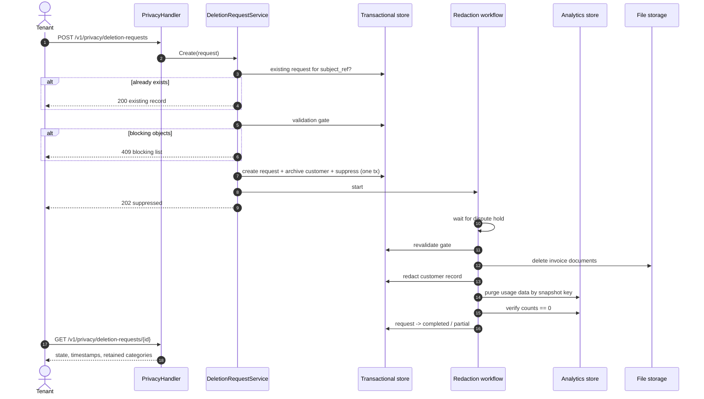

# PRD — Customer Data Deletion

Author: Agrim Mittal  
Date: 2026-10-06  
Ticket: [FLE-1475](https://linear.app/flexprice/issue/FLE-1475/offboarding-of-users-and-complete-data-removal-basis-configured)  
Related: [#2963 — Bulk Event Deletion](https://github.com/flexprice/flexprice/pull/2963) (`docs/design/2026-09-29-FLE-687-events-deletion.md`)

---

## 1. Overview

A tenant-facing API that permanently erases a customer's personal data on the tenant's instruction, including customers who have already churned. The same flow runs when the instruction arrives in writing. A second API lets the tenant check, at any time, whether the deletion has finished and what was deliberately kept and why.

Erasure has two stages. **Suppression** happens as soon as the request is accepted: the customer can no longer be read through any API, the UI or an export. **Redaction** happens later and cannot be undone: personal data is overwritten in the transactional store, the customer's usage data is purged from the analytics store, and invoice documents are deleted from file storage.

This is a different feature from bulk event deletion (#2963), but both are built on the same deletion machinery. Section 7 covers how they relate.

---

## 2. Problem & Context

### Current Behavior

`DELETE /v1/customers/{id}` only archives the customer. Their personal data stays in the transactional store, their usage events and meter usage stay in the analytics store, invoice PDFs stay in object storage, and nothing records that a deletion was asked for.

Ingesting an event never looks up the customer. `external_customer_id` is treated as an opaque string, so events for an archived customer are still accepted, processed and stored.

### Problem

Tenants act as data controllers under GDPR and similar laws, and Flexprice processes data on their behalf. Contracts now require Flexprice to provide:

- a programmatic endpoint that triggers permanent deletion of a customer's data, churned accounts included;
- prompt execution of the deletion, whether the instruction came through the API or in writing;
- an API the tenant can use to verify and audit that the deletion is complete.

None of this exists today.

### Expected Outcome

The tenant sends one API call per customer and gets back a request id. The customer disappears from every read path straight away. Within the agreed SLA, everything personal is erased or anonymised. At any later point the tenant can fetch the request and see its state, its timestamps, and every category of data that was kept, along with the legal basis for keeping it.

---

## 3. Goals & Non-Goals

### Goals

- Programmatic deletion request per customer, idempotent across repeated calls.
- Written instructions handled through the same flow and recorded with how they arrived (`api` or `written`).
- Customer suppressed from every read path as soon as the request is accepted.
- Within the SLA, redaction of personal data across the transactional store, the analytics store and file storage.
- New events for a suppressed customer refused at ingestion.
- A verification API returning state, timestamps and retained categories with their legal basis.
- A permanent, pseudonymised record that the deletion happened.

### Non-Goals

- **No deletion of financial records.** Issued invoices, payments, wallet transactions and refunds are kept under tax and accounting law. They are dissociated from the person, not destroyed.
- No surgical edits to backups. Backups age out on their normal rolling cycle.
- No erasure of Flexprice's own users or tenants. Those are a different class of data subject.
- No self-serve UI. API only.
- No bulk or CSV requests. One request per customer.
- No blocking of a person who signs up again as a genuinely new customer.

---

## 4. Use Cases

### UC1 — Churned customer, deletion via API

A tenant's end user closes their account and asks to be erased. The customer has no active subscription and every invoice is settled. The tenant calls the endpoint and receives `202` with state `suppressed`. After the hold period, redaction runs and the request moves to `completed` (or `partial`, if some data is legally retained). The tenant polls the verification endpoint and stores the outcome for their own audit trail.

### UC2 — Written instruction

A tenant emails a deletion instruction. Support creates the request on the tenant's behalf through the same endpoint with `request_channel = written`. Everything else is identical, and the tenant can verify it through the API.

### UC3 — Repeat request

The tenant sends the same request again, possibly months later. The response is `200` with the original record, so they don't get a duplicate or an error. This is also how the tenant answers "did you delete this person?".

### UC4 — Customer still billing

The customer has an active subscription or an open invoice. The request is refused with `409` and a list of what's blocking it. The tenant cancels or settles those, then asks again.

---

## 5. Requirements

### Functional Requirements

**R1.** `POST /v1/privacy/deletion-requests` accepts a `customer_id` and a `request_channel`, runs the validation gate, suppresses the customer, records the request, and starts redaction asynchronously. It returns `202`.

**R2.** `GET /v1/privacy/deletion-requests/{id}` returns the request's state, its timestamps, and the categories of data retained with their legal basis. This is the verification API.

**R3.** `GET /v1/privacy/deletion-requests` lists requests filtered by `customer_id`, `subject_ref` or `state`, so tenants can audit without storing our request ids.

**R4.** Suppression takes effect synchronously. Once `202` is returned, the customer is absent from every customer read, list, export and UI path.

**R5.** Redaction completes within 30 days of the dispute hold clearing.

**R6.** Event ingestion refuses events for a suppressed customer with `422`. In a bulk call, only the affected events are refused and the rest still ingest.

**R7.** Every request leaves a permanent, pseudonymised record: `subject_ref`, timestamps, channel, state and retained categories. No raw identifier is kept.

**R8.** Redaction finishes with a verification step that counts what remains for the customer in every store in scope. The request reaches `completed` only when every count is zero.

### Business Rules

**BR1.** Financial records are kept unchanged. Invoices hold no personal fields, so redacting the customer row dissociates them. Invoice PDFs render name and address, so the documents themselves are deleted.

**BR2.** Redaction waits until the customer's newest transaction is 90 days old (the dispute hold). The request stays `suppressed` until then. Failed payments, voided invoices and non-production environments are redactable straight away.

**BR3.** The request is refused while the customer is still billing: an active, paused, trialing or incomplete subscription; an invoice that is draft, or finalized and not yet settled; or a payment still in flight.

**BR4.** `subject_ref = SHA-256(external_id || tenant_salt)`. It is the idempotency key and the audit handle. The raw `external_id` is never kept after redaction.

**BR5.** `external_id` is captured when the request is made, because it is the key the analytics purge runs on, and redaction destroys it in the customer row.

**BR6.** The `external_id` of a suppressed customer cannot be reused for a new customer unless the tenant explicitly confirms the new customer is a different person. Otherwise post-deletion events would silently attach to the new customer.

**BR7.** Deletion is refused with neither the #2963 finalized-invoice guard nor its marketplace guard. Erasure is a legal instruction. Financial records are covered by BR1, not by refusing the request.

### Validations / Constraints

**V1.** `customer_id` must resolve in this environment. Archived customers are valid targets.

**V2.** `request_channel` is either `api` or `written`.

**V3.** The validation gate (BR3) runs again just before redaction, because a new subscription may have been created during the hold.

---

## 6. Product Behavior and Workflow

### States

```
pending → suppressed → redacting → completed
                              └──→ partial    (data retained by law)
                              └──→ failed     (gate tripped on recheck, or step failed)
```

### Pseudocode

```
POST /v1/privacy/deletion-requests { customer_id, request_channel }

customer   = CustomerRepo.Get(customer_id)          // archived allowed
subject_ref = sha256(customer.external_id || tenant_salt)

if existing = DeletionRequestRepo.GetBySubjectRef(subject_ref):
    return 200 existing

blocking = validation_gate(customer)
if blocking not empty:
    return 409 { blocking }

in one transaction:
    request = DeletionRequestRepo.Create(
        subject_ref, customer_id,
        external_id_snapshot = customer.external_id,
        request_channel, state = suppressed,
        redaction_eligible_at = newest_txn_at + 90d)
    CustomerRepo.Archive(customer_id)
    SuppressionList.Add(tenant, env, subject_ref)

start CustomerRedactionWorkflow(request.id)
return 202 request
```

```
CustomerRedactionWorkflow(request_id):
    wait until redaction_eligible_at
    RevalidateScope            // gate again; blocked -> failed
    DeleteInvoiceDocuments     // needs customer data, so before redaction
    RedactCustomerRecord       // PII -> "[redacted]", external_id -> "redacted_<subject_ref>", metadata purged
    PurgeAnalyticsData         // events + meter usage + #2963 deletion record, keyed on external_id_snapshot
    VerifyRedaction            // every count == 0, customer row re-read
    FinalizeRequest            // completed | partial, retained categories + basis
```

Steps are ordered on purpose. Document deletion needs data that `RedactCustomerRecord` destroys, so it runs first. The analytics purge uses the snapshot taken at request time, not the live row. Every activity is idempotent, because the workflow engine retries them.

### Sequence Diagram



### Ingest suppression

```
IngestEvent -> validate
            -> subject_ref = sha256(external_customer_id || tenant_salt)
            -> suppressed?  yes: 422, not published
                            no:  publish (hot path unchanged)
```

Ingestion reads no database today, so the suppression check is a cache lookup. The list is held only as hashes, so it never recreates the identifiers it exists to protect. It has no expiry, and the `deletion_requests` table is the source for rebuilding it if the cache is lost.

---

## 7. Relationship to Bulk Event Deletion (#2963)

The two features answer different questions. #2963 lets a tenant **correct** events they ingested by mistake. This PRD lets a tenant **erase** a person. They share the machinery underneath, and #2963 should build that machinery so this feature reuses it rather than duplicates it.

| Shared piece | #2963 uses it for | This PRD uses it for |
|---|---|---|
| A request row in the transactional store with a state and a `GET` status endpoint | Tracking a bulk deletion through to completion | The verification API (R2) |
| An async workflow that issues deletes in the analytics store and waits for them to finish | Deleting events and meter usage | `PurgeAnalyticsData` |
| Delete predicates that filter by customer and period, and a cap on concurrent deletes | Keeping tenant-triggered deletes cheap and isolated | The same, scoped to one customer |
| A deleted-key list that ingestion and reprocessing check | Stopping deleted events from coming back | Ingest suppression (R6) |

Where they differ:

| | #2963 | This PRD |
|---|---|---|
| Scope | Chosen events in a period | Everything about one customer |
| Finalized invoice in scope | Refuse | Keep the invoice, redact the person (BR1) |
| Marketplace customer | Refuse | Not a reason to refuse (BR7) |
| Archive of deleted data | Permanent copy of the event payloads | Must be purged for an erased customer |

The last row is a hard requirement on #2963. Its `event_deletion_data` table keeps event payloads, and payloads are personal data. `PurgeAnalyticsData` must delete that table's rows for the erased customer as well, so `event_deletion_data` must be addressable by `external_customer_id`.

---

## 8. Data Model

### `deletion_requests` — new Postgres table

Base mixin plus environment mixin, the same pattern as `ScheduledTask`.

| Field | Type | Notes |
|---|---|---|
| `id` | varchar(50) | `delreq_*` |
| `subject_ref` | varchar(64) | SHA-256 hex |
| `customer_id` | varchar(50) | |
| `external_id_snapshot` | varchar(255) | Purge key. Cleared once the request reaches `completed`. |
| `request_channel` | varchar(20) | `api` \| `written` |
| `state` | varchar(20) | see §6 |
| `requested_at` | time | |
| `suppressed_at` | time, optional | |
| `redaction_eligible_at` | time, optional | newest transaction + 90d |
| `completed_at` | time, optional | |
| `retained_categories` | JSON `[]string` | e.g. `["invoice_financial_record"]` |
| `retained_basis` | varchar(100), optional | e.g. `gdpr_art_17_3_b_tax_retention` |
| `retained_until` | time, optional | when retention expires |
| `workflow_id` | varchar(100), optional | |
| `failure_reason` | text, optional | |

Indexes:

- `UNIQUE (tenant_id, environment_id, subject_ref)` for idempotency
- `(tenant_id, environment_id, state)` for listing and worker pickup
- `(customer_id)`

### Data disposition

| Data | Action |
|---|---|
| Customer name, email, contact, address | Overwritten with `[redacted]` |
| Customer `external_id` | Overwritten with `redacted_<subject_ref>` |
| Customer `metadata` | Purged |
| Invoices, payments, wallet transactions, refunds | Kept unchanged |
| Invoice PDFs | Deleted from file storage |
| Usage events and meter usage | Deleted |
| #2963 deletion record | Deleted for this customer |
| Backups | Expire on the rolling cycle, ≤ 90 days |

---

## 9. Contracts

### `POST /v1/privacy/deletion-requests`

`@x-scope "delete"`

```json
{ "customer_id": "cust_123", "request_channel": "api" }
```

`202 Accepted`

```json
{
  "id": "delreq_01H...",
  "customer_id": "cust_123",
  "state": "suppressed",
  "requested_at": "2026-10-06T10:00:00Z",
  "suppressed_at": "2026-10-06T10:00:00Z",
  "redaction_eligible_at": "2027-01-04T00:00:00Z",
  "retained_categories": ["invoice_financial_record"],
  "retained_basis": "gdpr_art_17_3_b_tax_retention"
}
```

`409 Conflict`

```json
{
  "error": "customer has blocking objects",
  "blocking": [
    { "type": "subscription", "id": "subs_9", "state": "active" },
    { "type": "invoice", "id": "inv_4", "state": "FINALIZED", "payment_status": "PENDING" }
  ]
}
```

`200 OK` on a repeat request, with the existing record.

### `GET /v1/privacy/deletion-requests/{id}`

`@x-scope "read"`. Returns the record above. When the request is `completed` or `partial`, it also returns `completed_at` and a `verification` block:

```json
"verification": {
  "customer_record": "redacted",
  "usage_data_remaining": 0,
  "invoice_documents_remaining": 0,
  "verified_at": "2027-01-10T03:12:00Z"
}
```

### `GET /v1/privacy/deletion-requests`

`@x-scope "read"`. Filters: `customer_id`, `subject_ref`, `state`. Paginated.

### Errors

| HTTP | `ierr` mark | Condition |
|---|---|---|
| 400 | `ErrValidation` | Missing `customer_id`, unknown channel |
| 404 | `ErrNotFound` | Customer not in this environment |
| 409 | `ErrInvalidOperation` | Validation gate tripped |
| 403 | `ErrPermissionDenied` | Caller lacks the privacy capability |
| 422 | `ErrInvalidOperation` | Ingestion: event for a suppressed customer |

---

## 10. Edge Cases

| Scenario | Expected Behavior |
|---|---|
| Customer already archived (churned) | Valid target. Proceeds as normal. |
| Repeat request for the same subject | `200` with the original record and its original `requested_at`. |
| New subscription created during the hold | Recheck fails and the request moves to `failed` with a reason. Nothing is redacted. |
| Events arrive after suppression | Refused with `422`. Nothing new lands. |
| Events already in flight when suppression lands | Purged in redaction. The verification step catches anything that lands late. |
| Raw-event reprocessing after the purge | Skipped by the deleted-key list shared with #2963. |
| Same `external_id` used for a new customer | Refused unless the tenant confirms the new customer is a different person (BR6). |
| Customer never had any transactions | Redactable straight away. No hold. |
| Non-production environment | Redactable straight away. No hold. |
| Suppression cache lost | Rebuilt from `deletion_requests` before ingestion resumes checking. |
| Redaction step fails | Retried. After retries are exhausted, `failed` with the reason. The request stays suppressed. |

---

## 11. Acceptance Criteria

**AC1.** A request for a clean, churned customer returns `202`. The customer is archived and absent from every read path, and a record exists.

**AC2.** A customer with an active subscription returns `409` naming that subscription.

**AC3.** A repeat request returns `200` with the same `id` and the original `requested_at`.

**AC4.** An event for a suppressed customer returns `422` and is not published. In a bulk call that includes one suppressed customer, every other event is still ingested.

**AC5.** Suppression survives a cache flush.

**AC6.** After redaction, the customer's personal fields read `[redacted]`, `external_id` has the `redacted_` prefix, and `metadata` is empty.

**AC7.** After redaction, the customer's usage data and #2963 deletion records count zero in the analytics store, and their invoice documents are gone from storage.

**AC8.** After redaction, the customer's invoice rows, amounts and invoice numbers are unchanged.

**AC9.** `GET` returns `completed` or `partial` with the retained categories, the basis and the verification block.

**AC10.** If a new subscription appears during the hold, the request ends `failed` and nothing is redacted.

**AC11.** A request created with `request_channel = written` behaves identically to one created via the API, and its channel is recorded.

---

## 12. Open Questions & Decisions

### Open Questions

**Q1 — Tenant salt.** Should `subject_ref`'s salt be a new tenant setting, or derived from an existing tenant secret?

**Q2 — Redaction SLA.** The 30-day commitment depends on how long a single customer's analytics purge takes at production scale. Measure it before committing to the SLA externally.

**Q3 — Archived reads.** Does any tenant depend on reading archived customers? Suppression makes them unreadable.

**Q4 — Metered customer without a subscription.** Such a customer passes the gate but may still be sending billable usage. Once suppressed, that usage is refused. The contract needs to say who bears that.

**Q5 — RBAC.** Should this be a new user-only privacy role, or `delete` on `customer`? Decide this alongside #2963's Q5.

### Decisions

| Decision | Reason |
|---|---|
| Suppression, then redaction | Nobody can read the data from the first moment, and financial records stay defensible through the dispute window. |
| Financial records kept, personal data dissociated | Tax and accounting retention outranks erasure (GDPR Art. 17(3)(b)). Anonymised data is out of scope (Recital 26). |
| Refuse while billing is active | Redacting mid-cycle corrupts an open invoice and cannot be undone. |
| Hashed `subject_ref`, permanent record | Proves the deletion happened (Art. 5(2)) without keeping a re-identifiable value. |
| `external_id` captured at request time | The purge needs it after the customer row is redacted. |
| `422` at ingestion, not a silent drop | The client can tell suppression apart from a malformed payload. |
| Shared deletion machinery with #2963 | One way to delete from the analytics store, one workflow pattern, one deleted-key list. |
| One request per customer | Bulk erasure is not required, and one-per-customer keeps the gate and the audit record simple. |
