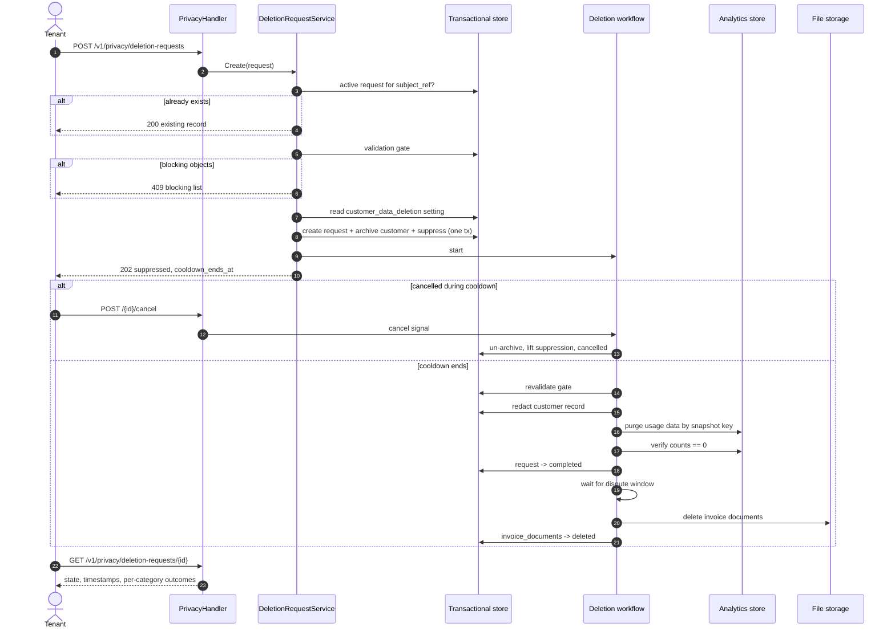

# PRD — Customer Data Deletion

Author: Agrim Mittal  
Date: 2026-10-06  
Ticket: [FLE-1475](https://linear.app/flexprice/issue/FLE-1475/offboarding-of-users-and-complete-data-removal-basis-configured)  
Related: [#2963 — Bulk Event Deletion](https://github.com/flexprice/flexprice/pull/2963) (`docs/design/2026-09-29-FLE-687-events-deletion.md`)

---

## 1. Overview

A tenant-facing API that permanently erases a customer's personal data on the tenant's instruction, including customers who have already churned. The same flow runs when the instruction arrives in writing. A second API lets the tenant check, at any time, whether the deletion has finished and what was deliberately kept and why.

A request goes through three stages:

1. **Suppression**, as soon as the request is accepted. The customer can no longer be read through any API, the UI or an export.
2. **Cooldown**, a per-tenant window during which the tenant can cancel the request. The data stays suppressed throughout.
3. **Redaction**, when the cooldown ends. This cannot be undone. Personal data is overwritten in the transactional store and the customer's usage data is purged from the analytics store.

Data the law or the contract requires us to keep is kept for its configured period and reported as retained. It is never held back silently.

This is a different feature from bulk event deletion (#2963), but both are built on the same deletion machinery. Section 7 covers how they relate.

---

## 2. Problem & Context

### Current Behavior

`DELETE /v1/customers/{id}` only archives the customer. Their personal data stays in the transactional store, their usage events and meter usage stay in the analytics store, invoice PDFs stay in object storage, and nothing records that a deletion was asked for.

Ingesting an event never looks up the customer. `external_customer_id` is treated as an opaque string, so events for an archived customer are still accepted, processed and stored.

### Problem

Tenants act as data controllers under GDPR and similar laws, and Flexprice processes data on their behalf. Contracts now require Flexprice to provide:

- a programmatic endpoint that triggers permanent deletion of a customer's data, churned accounts included;
- prompt execution of the deletion, whether the instruction came through the API or in writing;
- retention periods that follow each tenant's contract;
- an API the tenant can use to verify and audit that the deletion is complete.

None of this exists today.

### Legal frame

- **Deadline.** The controller must act on an erasure request without undue delay and within one month (GDPR Art. 12(3)). Because we act for the controller, the cooldown plus the redaction run must fit inside that month.
- **No minimum retention under GDPR.** Data is kept no longer than necessary (Art. 5(1)(e)). Every retention period here comes from another law or from the tenant's contract:
  - Tax and accounting law requires keeping financial records (Art. 17(3)(b)).
  - Records needed to defend a dispute or chargeback can be kept for the dispute window (Art. 17(3)(e)).
- **Anonymised data is out of scope** (Recital 26). Financial records are kept, but dissociated from the person.

### Expected Outcome

The tenant sends one API call per customer and gets back a request id. The customer disappears from every read path straight away. The tenant can cancel while the cooldown runs. Within one month of the request, all personal data is erased or anonymised. At any later point the tenant can fetch the request and see, for each category of data, whether it was deleted or kept, until when, and on what basis.

---

## 3. Goals & Non-Goals

### Goals

- Programmatic deletion request per customer, idempotent across repeated calls.
- Written instructions handled through the same flow and recorded with how they arrived (`api` or `written`).
- Customer suppressed from every read path as soon as the request is accepted.
- Off by default. Flexprice enables it per tenant, only for tenants whose contract covers it.
- Callable only by the tenant's super admins.
- A per-tenant cooldown, with cancellation allowed while it runs.
- Personal data and usage data redacted within one month of the request.
- Per-tenant retention periods for each category of data that is kept, set to match the tenant's contract.
- New events for a suppressed customer refused at ingestion.
- A verification API that reports every category of data as deleted or retained, with its retained-until date and basis.
- A permanent, pseudonymised record that the deletion happened.

### Non-Goals

- **No deletion of financial records within their retention period.** Invoices, payments, wallet transactions and refunds are kept, dissociated from the person.
- No purge of financial records once their retention period expires. That is a separate scheduled job.
- No surgical edits to backups. Backups age out on their normal rolling cycle.
- No erasure of Flexprice's own users or tenants. Those are a different class of data subject.
- No self-serve UI. API only.
- No bulk or CSV requests. One request per customer.
- No blocking of a person who signs up again as a genuinely new customer.

---

## 4. Use Cases

### UC1 — Churned customer, deletion via API

A tenant's end user closes their account and asks to be erased. The customer has no active subscription and every invoice is settled. The tenant calls the endpoint and receives `202` with state `suppressed` and a `cooldown_ends_at`. When the cooldown ends, redaction runs and the request moves to `completed`. The tenant polls the verification endpoint and stores the outcome for their own audit trail.

### UC2 — Written instruction

A tenant emails a deletion instruction. Support creates the request on the tenant's behalf through the same endpoint with `request_channel = written`. Everything else is identical, and the tenant can verify it through the API.

### UC3 — Cancelled during cooldown

The tenant sent the request by mistake. Before the cooldown ends, they cancel it. The customer is restored and readable again, the suppression is lifted, and the request ends `cancelled`.

### UC4 — Repeat request

The tenant sends the same request again, possibly months later. The response is `200` with the original record, so they don't get a duplicate or an error. This is also how the tenant answers "did you delete this person?".

### UC5 — Customer still billing

The customer has an active subscription or an open invoice. The request is refused with `409` and a list of what's blocking it. The tenant cancels or settles those, then asks again.

---

## 5. Requirements

### Functional Requirements

**R1.** `POST /v1/privacy/deletion-requests` accepts a `customer_id` and a `request_channel`, runs the validation gate, suppresses the customer, records the request, and starts the deletion workflow. It returns `202`.

**R2.** `GET /v1/privacy/deletion-requests/{id}` returns the request's state, its timestamps, and one entry per data category with its outcome, retained-until date and basis. This is the verification API.

**R3.** `GET /v1/privacy/deletion-requests` lists requests filtered by `customer_id`, `subject_ref` or `state`, so tenants can audit without storing our request ids.

**R4.** `POST /v1/privacy/deletion-requests/{id}/cancel` cancels a request whose cooldown has not ended. It un-archives the customer and lifts the suppression. After the cooldown ends, cancelling is refused.

**R5.** Suppression takes effect synchronously. Once `202` is returned, the customer is absent from every customer read, list, export and UI path.

**R6.** Personal data and usage data are redacted within one month of the request. The cooldown plus the redaction run must fit inside that month.

**R7.** The feature, the cooldown and the retention periods live in a new `customer_data_deletion` setting (§8). Flexprice sets it per tenant directly in the database, with values taken from the tenant's contract. It is not exposed through the settings API, so a tenant can neither enable the feature nor change its values. Unset values fall back to the defaults.

**R11.** Every `/v1/privacy` endpoint returns `404` for a tenant where the feature is not enabled. Ingestion runs the suppression check only for tenants where it is enabled, so every other tenant's hot path is unchanged.

**R12.** Every `/v1/privacy` endpoint requires a user caller holding `super_admin` in the tenant. API keys and service accounts are refused with `403`, whatever roles they carry.

**R8.** Event ingestion refuses events for a suppressed customer with `422`. In a bulk call, only the affected events are refused and the rest still ingest.

**R9.** Every request leaves a permanent, pseudonymised record: `subject_ref`, timestamps, channel, state and per-category outcomes. No raw identifier is kept.

**R10.** Redaction finishes with a verification step that counts what remains for the customer in every store in scope. A category is reported `deleted` only when its count is zero.

### Business Rules

**BR1.** Data falls into three retention classes:

| Class | Data | Outcome |
|---|---|---|
| Delete at cooldown end | Customer name, email, contact, address, `metadata`, `external_id`; usage events and meter usage; #2963 deletion records | Redacted or deleted when the cooldown ends |
| Keep for the dispute window | Invoice documents (PDFs render name and address) | Deleted when the tenant's dispute window ends |
| Keep for the legal period | Invoices, payments, wallet transactions, refunds | Kept unchanged. Invoices hold no personal fields, so redacting the customer row dissociates them |

**BR2.** The dispute window runs from the customer's newest transaction. If it has already passed when the cooldown ends, invoice documents are deleted together with everything else. Failed payments, voided invoices and non-production environments have no dispute window.

**BR3.** The request is refused while the customer is still billing: an active, paused, trialing or incomplete subscription; an invoice that is draft, or finalized and not yet settled; or a payment still in flight.

**BR4.** `subject_ref = SHA-256(external_id || tenant_salt)`. It is the idempotency key and the audit handle. The raw `external_id` is never kept after redaction.

**BR5.** `external_id` is captured when the request is made, because it is the key the analytics purge runs on, and redaction destroys it in the customer row.

**BR6.** The `external_id` of a suppressed customer cannot be reused for a new customer unless the tenant explicitly confirms the new customer is a different person. Otherwise post-deletion events would silently attach to the new customer.

**BR7.** Deletion is refused with neither the #2963 finalized-invoice guard nor its marketplace guard. Erasure is a legal instruction. Financial records are covered by BR1, not by refusing the request.

**BR8.** The setting in force is captured on the request when it is created. Later changes to the setting don't move an existing request's dates.

### Validations / Constraints

**V1.** `customer_id` must resolve in this environment. Archived customers are valid targets.

**V2.** `request_channel` is either `api` or `written`.

**V3.** `cooldown_days` is between 0 and 14. `dispute_window_days` is between 0 and 180. `financial_retention_years` is between 1 and 15. These ranges are checked when Flexprice writes the setting.

**V4.** The validation gate (BR3) runs again just before redaction, because a new subscription may have been created during the cooldown.

---

## 6. Product Behavior and Workflow

### States

```
suppressed ──(cooldown ends)──→ redacting ──→ completed
     │                              └──────→ failed     (gate tripped on recheck, or step failed)
     └──(cancel during cooldown)──→ cancelled
```

`completed` means every category in the delete-at-cooldown-end class is gone. Categories that are still retained stay listed with their `retained_until`, and their outcome flips to `deleted` when the workflow removes them.

### Pseudocode

```
POST /v1/privacy/deletion-requests { customer_id, request_channel }

customer    = CustomerRepo.Get(customer_id)          // archived allowed
subject_ref = sha256(customer.external_id || tenant_salt)

if existing = DeletionRequestRepo.GetActiveBySubjectRef(subject_ref):
    return 200 existing

blocking = validation_gate(customer)
if blocking not empty:
    return 409 { blocking }

policy = SettingsService.Get(customer_data_deletion)  // defaults when unset
if not policy.enabled:
    return 404

in one transaction:
    request = DeletionRequestRepo.Create(
        id                   = GenerateUUIDWithPrefix("delreq"),
        subject_ref, customer_id,
        external_id_snapshot = customer.external_id,
        request_channel,
        state                = suppressed,
        policy_snapshot      = policy,
        cooldown_ends_at     = now + policy.cooldown_days,
        categories           = plan_categories(customer, policy))
    CustomerRepo.Archive(customer_id)
    SuppressionList.Add(tenant, env, subject_ref)

start CustomerDeletionWorkflow(request.id)
return 202 request
```

```
CustomerDeletionWorkflow(request_id):
    wait until cooldown_ends_at, or a cancel signal
        cancel: un-archive customer, lift suppression, state = cancelled, stop

    state = redacting
    RevalidateScope              // gate again; blocked -> failed
    RedactCustomerRecord         // PII -> "[redacted]", external_id -> "redacted_<subject_ref>", metadata purged
    PurgeAnalyticsData           // events + meter usage + #2963 records, keyed on external_id_snapshot
    VerifyRedaction              // counts == 0, customer row re-read
    state = completed

    wait until dispute window ends     // zero wait if already past
    DeleteInvoiceDocuments             // located through invoice rows, not the customer row
    mark category invoice_documents = deleted
```

Every activity is idempotent, because the workflow engine retries them. The analytics purge uses the snapshot taken at request time, not the live row.

### Sequence Diagram



### Ingest suppression

```
IngestEvent -> validate
            -> subject_ref = sha256(external_customer_id || tenant_salt)
            -> suppressed?  yes: 422, not published
                            no:  publish (hot path unchanged)
```

Ingestion reads no database today, so the suppression check is a cache lookup. The list is held only as hashes, so it never recreates the identifiers it exists to protect. It has no expiry, and the `deletion_requests` table is the source for rebuilding it if the cache is lost. Cancelling a request removes its entry.

---

## 7. Relationship to Bulk Event Deletion (#2963)

The two features answer different questions. #2963 lets a tenant **correct** events they ingested by mistake. This PRD lets a tenant **erase** a person. They share the machinery underneath, and #2963 should build that machinery so this feature reuses it rather than duplicates it.

| Shared piece | #2963 uses it for | This PRD uses it for |
|---|---|---|
| A request row in the transactional store with a state and a `GET` status endpoint | Tracking a bulk deletion through to completion | The verification API (R2) |
| An async workflow that issues deletes in the analytics store and waits for them to finish | Deleting events and meter usage | `PurgeAnalyticsData` |
| Delete predicates that filter by customer and period, and a cap on concurrent deletes | Keeping tenant-triggered deletes cheap and isolated | The same, scoped to one customer |
| A deleted-key list that ingestion and reprocessing check | Stopping deleted events from coming back | Ingest suppression (R8) |

Where they differ:

| | #2963 | This PRD |
|---|---|---|
| Scope | Chosen events in a period | Everything about one customer |
| Finalized invoice in scope | Refuse | Keep the invoice, redact the person (BR1) |
| Marketplace customer | Refuse | Not a reason to refuse (BR7) |
| Archive of deleted data | Permanent copy of the event payloads | Must be purged for an erased customer |

The last row is a hard requirement on #2963. Its `event_deletion_data` table keeps event payloads, and payloads are personal data. `PurgeAnalyticsData` must delete that table's rows for the erased customer as well, so `event_deletion_data` must be addressable by `external_customer_id`.

---

## 8. Data Model

### `deletion_requests` — new Postgres table

The request lives in Postgres, not the analytics store. It is mutable state that moves through several transitions, it needs a unique index for idempotency, and it has to be written in the same transaction as the customer archive. Base mixin plus environment mixin, the same pattern as `ScheduledTask`. The id is generated by Flexprice with `types.GenerateUUIDWithPrefix("delreq")` and returned in the `202`.

| Field | Type | Notes |
|---|---|---|
| `id` | varchar(50) | `delreq_*`, generated by us |
| `subject_ref` | varchar(64) | SHA-256 hex |
| `customer_id` | varchar(50) | |
| `external_id_snapshot` | varchar(255) | Purge key. Cleared once the request reaches `completed`. |
| `request_channel` | varchar(20) | `api` \| `written` |
| `state` | varchar(20) | see §6 |
| `policy_snapshot` | JSON | The setting in force when the request was created (BR8) |
| `requested_at` | time | |
| `cooldown_ends_at` | time | |
| `cancelled_at` | time, optional | |
| `completed_at` | time, optional | |
| `categories` | JSON | One entry per data category, see below |
| `workflow_id` | varchar(100), optional | |
| `failure_reason` | text, optional | |

Each entry in `categories`:

```json
{ "category": "invoice_documents", "outcome": "retained", "retained_until": "2027-01-04T00:00:00Z", "basis": "dispute_window" }
```

`outcome` is one of `pending`, `deleted` or `retained`. `basis` is one of `dispute_window` or `legal_retention`.

Indexes:

- `UNIQUE (tenant_id, environment_id, subject_ref) WHERE state <> 'cancelled'` for idempotency. A cancelled request does not block a new one.
- `(tenant_id, environment_id, state)` for listing and worker pickup
- `(customer_id)`

### `customer_data_deletion` — new setting

A new `SettingKey`, read per tenant and environment. Flexprice writes it directly in the database when a tenant's contract includes data deletion, with values taken from that contract. It is left out of the allowed keys for the settings API, so tenants cannot read or change it there.

| Key | Default | Range | Drives |
|---|---|---|---|
| `enabled` | `false` | — | Whether `/v1/privacy` and the ingest suppression check are active for the tenant |
| `cooldown_days` | 7 | 0–14 | `cooldown_ends_at` |
| `dispute_window_days` | 90 | 0–180 | When invoice documents are deleted |
| `financial_retention_years` | 10 | 1–15 | `retained_until` reported for financial records |

### Data disposition

| Data | Action | When |
|---|---|---|
| Customer name, email, contact, address | Overwritten with `[redacted]` | Cooldown end |
| Customer `external_id` | Overwritten with `redacted_<subject_ref>` | Cooldown end |
| Customer `metadata` | Purged | Cooldown end |
| Usage events and meter usage | Deleted | Cooldown end |
| #2963 deletion record | Deleted for this customer | Cooldown end |
| Invoice PDFs | Deleted from file storage | End of the dispute window |
| Invoices, payments, wallet transactions, refunds | Kept unchanged | Reported until the legal retention period ends |
| Backups | Expire on the rolling cycle | ≤ 90 days |

---

## 9. Contracts

### `POST /v1/privacy/deletion-requests`

`@x-scope "delete"`

```json
{ "customer_id": "cust_123", "request_channel": "api" }
```

`202 Accepted`

```json
{
  "id": "delreq_01H...",
  "customer_id": "cust_123",
  "state": "suppressed",
  "requested_at": "2026-10-06T10:00:00Z",
  "cooldown_ends_at": "2026-10-13T10:00:00Z",
  "categories": [
    { "category": "customer_record",   "outcome": "pending" },
    { "category": "usage_data",        "outcome": "pending" },
    { "category": "invoice_documents", "outcome": "pending" },
    { "category": "financial_records", "outcome": "retained", "retained_until": "2036-10-06T00:00:00Z", "basis": "legal_retention" }
  ]
}
```

`409 Conflict`

```json
{
  "error": "customer has blocking objects",
  "blocking": [
    { "type": "subscription", "id": "subs_9", "state": "active" },
    { "type": "invoice", "id": "inv_4", "state": "FINALIZED", "payment_status": "PENDING" }
  ]
}
```

`200 OK` on a repeat request, with the existing record.

### `POST /v1/privacy/deletion-requests/{id}/cancel`

`@x-scope "write"`. Returns the record with state `cancelled`. Returns `409` once the cooldown has ended.

### `GET /v1/privacy/deletion-requests/{id}`

`@x-scope "read"`. Returns the record above. Once the request is `completed`, it also returns `completed_at` and a `verification` block:

```json
"verification": {
  "customer_record": "redacted",
  "usage_data_remaining": 0,
  "verified_at": "2026-10-13T10:12:00Z"
}
```

### `GET /v1/privacy/deletion-requests`

`@x-scope "read"`. Filters: `customer_id`, `subject_ref`, `state`. Paginated.

### Errors

| HTTP | `ierr` mark | Condition |
|---|---|---|
| 400 | `ErrValidation` | Missing `customer_id`, unknown channel, setting value out of range |
| 404 | `ErrNotFound` | Customer or request not in this environment |
| 409 | `ErrInvalidOperation` | Validation gate tripped, or cancel after cooldown |
| 403 | `ErrPermissionDenied` | Caller is not a user with `super_admin`, or is an API key or service account |
| 404 | `ErrNotFound` | Feature not enabled for the tenant |
| 422 | `ErrInvalidOperation` | Ingestion: event for a suppressed customer |

---

## 10. Edge Cases

| Scenario | Expected Behavior |
|---|---|
| Customer already archived (churned) | Valid target. Proceeds as normal. |
| Repeat request for the same subject | `200` with the original record and its original `requested_at`. |
| Request after a cancelled one | Allowed. Creates a new request. |
| `cooldown_days = 0` | Redaction starts immediately. Nothing to cancel. |
| Cancel after cooldown ends | `409`. Redaction is already running or done. |
| Setting changed while a request is open | No effect on that request. It uses its `policy_snapshot`. |
| New subscription created during the cooldown | Recheck fails and the request moves to `failed` with a reason. Nothing is redacted. |
| Events arrive after suppression | Refused with `422`. Nothing new lands. |
| Events already in flight when suppression lands | Purged in redaction. The verification step catches anything that lands late. |
| Raw-event reprocessing after the purge | Skipped by the deleted-key list shared with #2963. |
| Same `external_id` used for a new customer | Refused unless the tenant confirms the new customer is a different person (BR6). |
| Dispute window already passed at cooldown end | Invoice documents are deleted together with everything else. |
| Customer never had any transactions | Nothing to retain. Every category ends `deleted`. |
| Suppression cache lost | Rebuilt from `deletion_requests` before ingestion resumes checking. |
| Redaction step fails | Retried. After retries are exhausted, `failed` with the reason. The request stays suppressed. |

---

## 11. Acceptance Criteria

**AC1.** A request for a clean, churned customer returns `202` with a `delreq_` id and `cooldown_ends_at`. The customer is archived and absent from every read path, and the request row exists in Postgres.

**AC2.** A customer with an active subscription returns `409` naming that subscription.

**AC3.** A repeat request returns `200` with the same `id` and the original `requested_at`.

**AC4.** Cancelling during the cooldown restores the customer, lifts suppression and ends the request `cancelled`. Cancelling after the cooldown returns `409`.

**AC5.** With `cooldown_days = 7`, nothing is redacted before day 7. Redaction completes within one month of the request.

**AC6.** An event for a suppressed customer returns `422` and is not published. In a bulk call that includes one suppressed customer, every other event is still ingested.

**AC7.** Suppression survives a cache flush.

**AC8.** After redaction, the customer's personal fields read `[redacted]`, `external_id` has the `redacted_` prefix, and `metadata` is empty.

**AC9.** After redaction, the customer's usage data and #2963 deletion records count zero in the analytics store.

**AC10.** Invoice documents are deleted when the dispute window ends, and not before.

**AC11.** After redaction, the customer's invoice rows, amounts and invoice numbers are unchanged, and `GET` reports financial records as `retained` with `basis = legal_retention`.

**AC12.** A change to a tenant's `customer_data_deletion` setting changes the dates on new requests only.

**AC13.** If a new subscription appears during the cooldown, the request ends `failed` and nothing is redacted.

**AC14.** A request created with `request_channel = written` behaves identically to one created via the API, and its channel is recorded.

**AC15.** For a tenant where the feature is not enabled, every `/v1/privacy` endpoint returns `404` and ingestion does no suppression lookup.

**AC16.** A user without `super_admin` gets `403`. An API key or service account gets `403` even when it carries `super_admin`.

**AC17.** `customer_data_deletion` cannot be read or written through the settings API.

---

## 12. Open Questions & Decisions

### Open Questions

**Q1 — Tenant salt.** Should `subject_ref`'s salt be a new tenant setting, or derived from an existing tenant secret?

**Q2 — Redaction run time.** The one-month commitment depends on how long a single customer's analytics purge takes at production scale. Measure it before fixing the maximum cooldown.

**Q3 — Invoice documents under tax law.** Some jurisdictions require keeping the issued invoice document as issued, name and address included. If so, invoice documents move to the legal-retention class for those tenants. This needs legal sign-off per entity.

**Q4 — Archived reads.** Does any tenant depend on reading archived customers? Suppression makes them unreadable.

**Q5 — Metered customer without a subscription.** Such a customer passes the gate but may still be sending billable usage. Once suppressed, that usage is refused. The contract needs to say who bears that.
### Decisions

| Decision | Reason |
|---|---|
| Suppress, then cooldown, then redact | Nobody can read the data from the first moment, and a mistaken request can still be undone. |
| Cooldown capped at 14 days | Cooldown plus the redaction run must fit the one-month deadline (Art. 12(3)). |
| Retention by data class, not one hold for everything | Only invoice documents are needed for disputes. Holding personal and usage data for the dispute window would break the one-month deadline. |
| Retention periods set per tenant | Each tenant's contract sets its own periods. |
| Enabled per tenant by Flexprice, off by default | Offered only where the contract covers it. Tenants can't switch it on themselves or change the contracted periods. |
| Tenant `super_admin` users only, no API keys | Erasure is irreversible. It needs an accountable human, not an integration credential. |
| Settings snapshotted on the request | An open request's dates can't change under it. |
| Financial records kept, personal data dissociated | Tax and accounting retention outranks erasure (Art. 17(3)(b)). Anonymised data is out of scope (Recital 26). |
| Refuse while billing is active | Redacting mid-cycle corrupts an open invoice and cannot be undone. |
| Request stored in Postgres with our own id | Mutable state, a unique index for idempotency, and written in the same transaction as the archive. |
| Hashed `subject_ref`, permanent record | Proves the deletion happened (Art. 5(2)) without keeping a re-identifiable value. |
| `external_id` captured at request time | The purge needs it after the customer row is redacted. |
| `422` at ingestion, not a silent drop | The client can tell suppression apart from a malformed payload. |
| Shared deletion machinery with #2963 | One way to delete from the analytics store, one workflow pattern, one deleted-key list. |
| One request per customer | Bulk erasure is not required, and one-per-customer keeps the gate and the audit record simple. |
