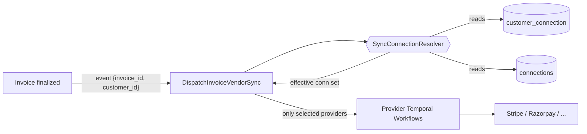
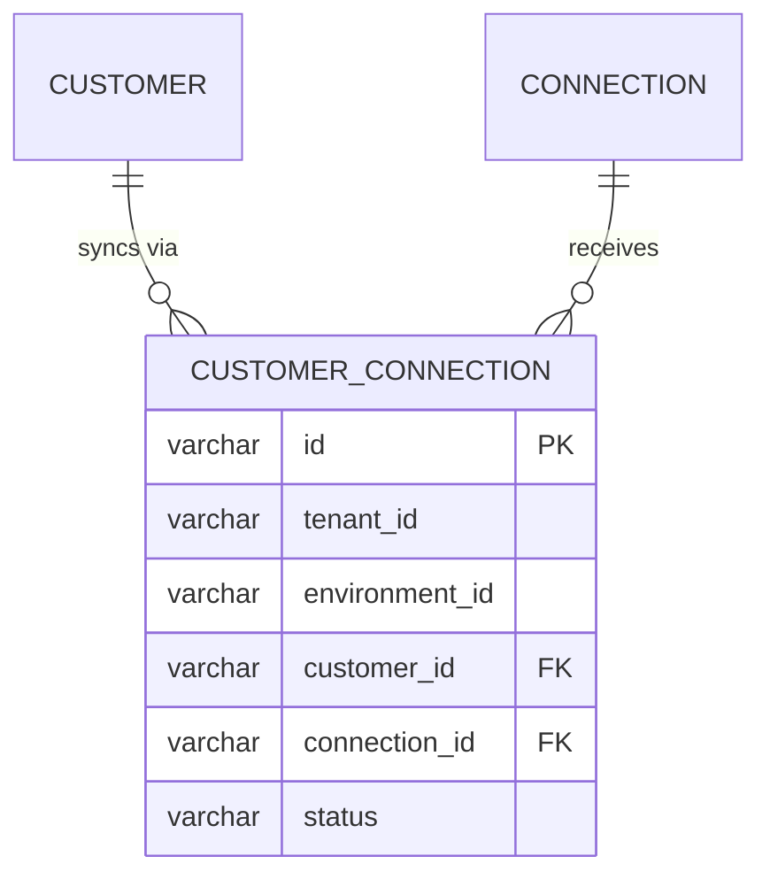

# CONN-SYNC-SELECT — Per-Customer Connection Sync Selection: let tenants choose which connections a customer's invoices/payments sync to

- **Ticket:** FLE-996
- **Date:** 2026-07-09
- **Author:** Gursimar
- **Status:** Draft for review
- **Reviewers:** _tbd_

---

## 1. Executive Summary

- **What ships (Phase 1):** A per-customer selection of which integration connections that customer's **invoices, payments, and customer records** are allowed to sync to. Outbound sync dispatch honors the selection instead of fanning out to every enabled connection.
- **Data:** One new join table `customer_connection` (customer_id ↔ connection_id, tenant/env scoped). No changes to existing tables except an added `customer_id` field in the invoice-sync **event payload** (not a DB column).
- **Reused:** The entire dispatch/Temporal machinery in [`internal/integration/events/dispatch.go`](../../internal/integration/events/dispatch.go), the connection-level `IsInvoiceOutboundEnabled` / `IsPaymentOutboundEnabled` gates ([`connection/model.go:367`](../../internal/domain/connection/model.go)), and `entity_integration_mapping` idempotency ([`dispatch.go:38`](../../internal/integration/events/dispatch.go)) — all unchanged.
- **New infra:** None. No new datastore, no new workflow, no new Kafka topic.
- **Activation guard (the headline constraint):** The selection mechanism is **completely dormant unless the tenant-env has more than one *eligible* connection for that entity**. At 0 or 1 eligible connection, dispatch takes today's exact code path — no resolver call, no new behavior, current functionality untouched. The gating "comes into action" only when >1 eligible connections exist (i.e. the only situation where the fan-out bug can occur).
- **Default behavior once active:** When >1 eligible connections exist and a customer has **no** explicit selection → sync to **none** until the tenant selects (refuse to guess). With a selection → sync to `eligible ∩ selection`.
- **Deferred:** Multiple connections of the *same* provider; per-entity-type routing (invoices→A, payments→B); env-level defaults with per-customer override; inbound sync selection.

## 2. Motivation

### 2.1 What we're building

Today a tenant-environment can hold several integration connections at once (e.g. Stripe **and** Razorpay **and** Chargebee). When an invoice is finalized, [`DispatchInvoiceVendorSync`](../../internal/integration/events/dispatch.go) loops over **all ~10 providers** and syncs the invoice to **every** connection whose `SyncConfig.Invoice.Outbound` flag is on. There is no notion of "customer X bills through Stripe, customer Y bills through Razorpay."

We are adding a per-customer allow-list of connections. Concrete example:

> Tenant *Acme* has Stripe + Razorpay connected, both with invoice outbound enabled. Customer `cust_india` should sync only to Razorpay; customer `cust_us` only to Stripe. After this change, `cust_india`'s invoice creates a Razorpay invoice and **not** a Stripe one.

### 2.2 Why we need it

- **Correctness / money bug:** duplicate invoices are being created in providers a customer was never meant to bill through. This is a billing-integrity defect, not a nice-to-have.
- **Multi-provider tenants are real:** tenants operating across regions (e.g. Razorpay for India, Stripe for US) need to route per customer.
- **Least-surprise default:** the chosen fallback rule (§8.2) means multi-connection tenants stop mass-syncing immediately, while single-connection tenants see zero change.

## 3. Goals & Non-Goals

### 3.1 Goals (this phase)

1. A tenant can attach a set of connections to a customer; only those connections receive that customer's **invoice**, **payment**, and **customer** outbound syncs.
2. **No regression** for single-connection tenants: with one eligible connection and no explicit selection, behavior is identical to today.
3. Multi-connection tenants with no selection sync to **none** for that entity (fixes the fan-out bug safely rather than guessing).
4. Additive migration only — new table, no destructive change to existing rows.
5. Idempotency and retry-safety of the existing dispatch path are preserved unchanged.

### 3.2 Non-Goals (aggressively out of scope)

- **Multiple connections of the same provider.** `GetByProvider` returns `connections[0]` today ([`connection.go:149`](../../internal/repository/ent/connection.go)); we keep the one-connection-per-provider assumption. Selection is by connection ID so the model is future-proof, but resolving two same-provider connections is deferred.
- **Per-entity-type routing** (invoices→Stripe, payments→QuickBooks for the same customer). One selection list applies to all three entities this phase.
- **Env-level default sets with per-customer override.** Only per-customer lists + the automatic single-connection fallback.
- **Inbound sync** selection (provider→FlexPrice). Only outbound.
- **UI.** API + backend only; the dashboard consumes the new endpoints separately.
- **Backfilling existing customers** with explicit selections. The fallback rule (§8.2) makes backfill unnecessary for the single-connection case, and intentional for the multi-connection case (see Open Question O1).

## 4. Terminology

| Term | Meaning |
|---|---|
| **Connection** | A configured integration provider instance, `internal/domain/connection` — carries `SyncConfig` and provider credentials. |
| **Eligible connection** (for entity E) | A published connection in the tenant-env whose `SyncConfig.<E>.Outbound == true`. Computed per entity type. **This — not raw "active connection" count — is what the >1 activation guard counts** (see Decisions Log): an export-only connection (e.g. S3) with no invoice-outbound flag does not push a single-provider tenant into the "active" branch. |
| **Selection** | The set of connection IDs a tenant has attached to a given customer via the new `customer_connection` table. |
| **Effective connections** (customer C, entity E) | The connections C's entity-E syncs actually fire against — the resolver output of §8.1. |
| **Dispatch** | `DispatchInvoiceVendorSync` / `DispatchCustomerVendorSync` / `DispatchInvoicePaidVendorSync` in [`dispatch.go`](../../internal/integration/events/dispatch.go) — the per-provider fan-out that starts Temporal workflows. |
| **EIM** | `entity_integration_mapping` — existing table mapping `(entity_id, entity_type, provider_type) → provider_entity_id`; used for idempotency. |

## 5. High-Level View

### 5.1 System context



### 5.2 Sequence — invoice sync with selection

```mermaid
sequenceDiagram
    autonumber
    participant Svc as InvoiceService
    participant Disp as DispatchInvoiceVendorSync
    participant Res as SyncConnectionResolver
    participant T as Temporal
    Svc->>Disp: WebhookEvent {invoice_id, customer_id}
    Disp->>Res: ResolveEffectiveConnections(customer_id, Invoice)
    Res->>Res: eligible = published conns with Invoice.Outbound
    alt ≤1 eligible (DORMANT — as today)
        Res-->>Disp: eligible (0 → none, 1 → that one); selection table not read
    else >1 eligible (ACTIVE)
        Res->>Res: selected = customer_connection rows for customer
        alt selection non-empty
            Res-->>Disp: eligible ∩ selected
        else no selection
            Res-->>Disp: [] (sync to none) + warn log
        end
    end
    loop each provider trigger
        Disp->>Disp: gate: conn in effective set?
        Disp->>T: start workflow (only if gated in)
    end
```

### 5.3 ER diagram



## 6. Current State (Baseline)

### 6.1 Sync dispatch today

`DispatchInvoiceVendorSync` ([`dispatch.go:100`](../../internal/integration/events/dispatch.go)) parses `{invoice_id}` from the event and calls a hardcoded list of `triggerXIfEnabled` funcs — one per provider. Each trigger:

1. `getConnectionIfExists(ctx, connRepo, provider)` → `GetByProvider` → the single connection for that provider (or nil).
2. Gates on `conn.IsInvoiceOutboundEnabled()` — a **connection-level** flag from `SyncConfig.Invoice.Outbound`.
3. Gates on `invoiceAlreadySynced(...)` (EIM idempotency).
4. Starts the provider's Temporal workflow.

**The limit that motivates this work:** step 2 is the *only* per-invoice gate, and it is connection-global. Nothing consults the invoice's customer. Payment push (e.g. [`stripe/payment.go:1504`](../../internal/integration/stripe/payment.go), [`razorpay/payment.go:490`](../../internal/integration/razorpay/payment.go)) gates on the same connection-level `IsInvoiceOutboundEnabled()`.

Note also: dispatch deliberately does **no invoice DB read** — the invoice is fetched inside the Temporal activity after a short sleep to dodge the "event arrives before commit" race ([`dispatch.go:78-86`](../../internal/integration/events/dispatch.go)). It *does* read connections. So the invoice's `customer_id` is **not** available at dispatch time today.

### 6.2 What we reuse (the reuse map)

| Need | Existing symbol (`file.go:line`) | What we get for free |
|---|---|---|
| Per-provider fan-out to Temporal | `DispatchInvoiceVendorSync` [`dispatch.go:100`](../../internal/integration/events/dispatch.go) | Provider→workflow wiring, error aggregation, logging — we add one gate, touch nothing else. |
| Connection-level outbound toggle | `Connection.IsInvoiceOutboundEnabled` / `IsPaymentOutboundEnabled` [`connection/model.go:367`](../../internal/domain/connection/model.go) | Defines "eligible connection"; the resolver builds on it, not around it. |
| Idempotency (no duplicate external invoices) | `invoiceAlreadySynced` [`dispatch.go:38`](../../internal/integration/events/dispatch.go) | Retry/redelivery safety is unchanged; selection is an *additional* filter, never a weaker one. |
| Connection lookup by provider (one-per-provider) | `GetByProvider` [`connection.go:149`](../../internal/repository/ent/connection.go) | Lets the resolver map an eligible connection back to its trigger; underpins the Non-Goal boundary. |
| Customer↔provider provider-id mapping | `entity_integration_mapping` [`entityintegrationmapping/model.go`](../../internal/domain/entityintegrationmapping/model.go) | Existing customer-mapping semantics stay; we deliberately do **not** overload it for selection (see §12). |
| Invoice→customer link | `Invoice.CustomerID` [`invoice/model.go:20`](../../internal/domain/invoice/model.go) | The resolver key; enables adding `customer_id` to the sync event payload without a DB read. |
| Connection domain repo (filter, tenant/env) | `connection.Repository` [`connection/repository.go`](../../internal/domain/connection/repository.go) | Listing eligible connections with tenant/env filters already handled. |

### 6.3 What's being removed / deprecated

Nothing removed. The connection-level `IsInvoiceOutboundEnabled` gate stays as the *eligibility* signal; the new per-customer gate is layered on top.

## 7. Data Model

### 7.1 Changes to existing tables

None. (The invoice-sync **event payload** gains a `customer_id` field — a JSON field in the Kafka/webhook event, not a DB column. See §8.3.)

### 7.2 New table: `customer_connection`

```sql
CREATE TABLE customer_connection (
    id             varchar PRIMARY KEY,          -- prefix: cuconn_
    tenant_id      varchar NOT NULL,
    environment_id varchar NOT NULL,
    customer_id    varchar NOT NULL,
    connection_id  varchar NOT NULL,
    status         varchar NOT NULL DEFAULT 'published',
    created_at     timestamptz NOT NULL DEFAULT now(),
    updated_at     timestamptz NOT NULL DEFAULT now(),
    created_by     varchar,
    updated_by     varchar
);

-- One selection row per (tenant, env, customer, connection); prevents duplicate attachment.
CREATE UNIQUE INDEX uq_customer_connection
    ON customer_connection (tenant_id, environment_id, customer_id, connection_id)
    WHERE status = 'published';

-- Forward lookup: "which connections for this customer?" (the dispatch hot path).
CREATE INDEX ix_customer_connection_customer
    ON customer_connection (tenant_id, environment_id, customer_id);

-- Reverse lookup: "which customers use this connection?" (cleanup on connection delete).
CREATE INDEX ix_customer_connection_connection
    ON customer_connection (tenant_id, environment_id, connection_id);
```

Follows flexprice conventions: `tenant_id` + `environment_id` on every row and every query (§ constitution), prefixed IDs, `status` soft-delete. Built via `ent/schema/customerconnection.go` → `make generate-ent` → `make generate-migration` (never hand-edited).

## 8. Approach

### 8.1 The resolver (single source of truth)

Add one service function reused by all three flows. **The first check is the activation guard**: if ≤1 eligible connection, return the eligible set verbatim and never touch the selection table — this is the literal "don't change current functionality" path.

```
ResolveEffectiveConnections(ctx, customerID, entityType) ([]*Connection, error):
    eligible = connRepo.List(published) filtered by SyncConfig.<entityType>.Outbound == true

    // --- ACTIVATION GUARD: dormant unless >1 eligible connection ---
    if len(eligible) <= 1:
        return eligible                       // 0 → none (as today); 1 → that one (as today)

    // >1 eligible: selection mechanism is now active
    selected = customerConnectionRepo.ListConnectionIDs(customerID)   // []string
    if len(selected) == 0:
        return []                              // no selection → sync to none (+ warn log)
    return eligible ∩ selected                 // intersection, by connection ID
```

Two invariants this shape guarantees:
- **Dormant at ≤1 eligible.** The selection table is not even read; a single-connection tenant's behavior is byte-for-byte today's.
- **Selection only narrows.** Intersecting with `eligible` (not returning `selected` raw) means a customer can't be forced onto a connection whose entity-outbound flag is off, and a stale selection pointing at a deleted/ineligible connection is silently ignored.

### 8.2 Behavior matrix

| Eligible connections for entity | Selection set | Effective connections | Mechanism |
|---|---|---|---|
| 0 | (not read) | none | **Dormant** — as today. |
| 1 | (not read) | that 1 | **Dormant** — as today (backward-compat). |
| >1 | empty | **none** (+ warn log) | **Active** — refuse to guess; fixes the fan-out bug. |
| >1 | non-empty | eligible ∩ selection | **Active** — explicit tenant intent, narrowed to eligible. |

### 8.3 Wiring into dispatch

`DispatchInvoiceVendorSync` has no `customer_id` today and must not read the invoice (race, §6.1). Two ways to get the customer:

- **(Chosen) Add `customer_id` to the invoice-sync event payload.** Both producers already hold the invoice — [`integration_sync.go:79`](../../internal/ee/service/integration_sync.go) and [`invoice.go:4193`](../../internal/ee/service/invoice.go) marshal `{invoice_id}`; they become `{invoice_id, customer_id}`. Dispatch then resolves selection with **zero invoice DB read**, preserving the commit-race avoidance. Old in-flight events without `customer_id` fall through to the current behavior guarded by the flag (§9), so rollout is safe.
- (Rejected) Resolve inside each provider's Temporal activity where the invoice is already loaded — see §12.

Dispatch change is minimal and additive:

```go
// once, before the provider loop:
effective, _ := resolver.ResolveEffectiveConnections(ctx, in.CustomerID, types.IntegrationEntityTypeInvoice)
allowed := setOfConnIDs(effective)     // map[string]bool

// inside each triggerXIfEnabled, after the existing IsInvoiceOutboundEnabled gate:
if !allowed[conn.ID] { return nil }    // <- the one new line of gating
```

Payment ([`stripe/payment.go:1504`](../../internal/integration/stripe/payment.go), [`razorpay/payment.go:490`](../../internal/integration/razorpay/payment.go)) and `DispatchCustomerVendorSync` gate the same way — they already have the customer in hand, so no payload change is needed there.

### 8.4 CRUD + connection lifecycle

- New endpoints (API layer only, delegating to service): attach/detach/list connections for a customer (`POST/DELETE/GET /customers/{id}/connections`). Follows the add-endpoint checklist (domain → repo → service → handler → route → swagger).
- On **connection delete** ([`connection.go:705`](../../internal/ee/service/connection.go)), soft-delete the connection's `customer_connection` rows in the same transaction (reverse index `ix_customer_connection_connection`), so a deleted connection can't linger in a customer's effective set.

### 8.5 Failure modes

| Failure | Behavior |
|---|---|
| Duplicate event redelivery | Unchanged — `invoiceAlreadySynced` (EIM) still guards; selection filter runs first, only ever narrows. |
| Event without `customer_id` (old in-flight) | Only matters at >1 eligible (dormant otherwise). Flag-gated: flag off → today's fan-out; flag on → treated as "no selection" → sync to none for that multi-connection customer until re-emitted. |
| `customer_connection` read error (only reachable at >1 eligible) | Fail the dispatch (return err) so Kafka/Temporal retries — never fall back to fan-out-to-all (that would reintroduce the bug). At ≤1 eligible the table is never read, so this path can't affect single-connection tenants. |
| Selection points at a now-ineligible/deleted connection | Silently dropped by `eligible ∩ selection`. |
| Customer has selection but none are eligible | Sync to none — correct: tenant chose connections that can't currently sync. |

### 8.6 Scale

Negligible. Per invoice/payment/customer sync: one indexed `customer_connection` read (`ix_customer_connection_customer`) added to a path that already does N `GetByProvider` connection reads. No new QPS class; the read is on the same tenant-env-scoped hot index.

## 9. Rollout Plan

- **Phase 0 — Prep:** ship `customer_connection` table + Ent schema + CRUD endpoints + `customer_id` in the invoice-sync payload. No dispatch behavior change yet. Producers emit the new field; consumers ignore it.
- **Phase 1 — Ship gating behind flag `customer_connection_sync_selection` (default off):**
  - Flag **off** → dispatch behaves exactly as today (fan-out to all eligible).
  - Enable per-tenant after they've configured selections; shadow-log the would-be effective set for a few tenants first to confirm no unexpected drops.
- **Rollback:** flip flag off — dispatch reverts to fan-out instantly. The table and payload field are inert and can stay.

## 10. Metrics & SLIs

- Counter `sync.dispatch.effective_connections{entity,decision}` where `decision ∈ {selection, single_fallback, none_multi, none_zero}` — watch `none_multi` to see how many tenants need to configure selections.
- Counter `sync.dispatch.skipped_by_selection{provider}` — invoices that previously would have synced and now don't (validates the fix).
- Alert if `none_multi` spikes for a tenant right after enablement (they may have forgotten to configure selections).

## 11. Open Questions

1. **O1 — Multi-connection tenants at cutover.** With the "sync to none" default, existing multi-connection tenants stop syncing until they configure selections. Do we (a) require them to configure before flag-on (per-tenant rollout, recommended), or (b) run a one-time backfill inferring selections from existing `entity_integration_mapping` customer rows? → **Product + the onboarded multi-connection tenants.**
2. **O2 — Should `customer_connection` validate that the connection's entity-outbound flag is on at attach time**, or only at resolve time? Resolve-time only (current design) is simpler and self-heals when flags change; attach-time validation gives earlier feedback. → **Eng.**
3. **O3 — Payment-only nuance:** payment push currently gates on `IsInvoiceOutboundEnabled` (not `IsPaymentOutboundEnabled`) in [`stripe/payment.go:1504`](../../internal/integration/stripe/payment.go). Do we keep that quirk or align payment to its own flag as part of this change? → **Eng (possibly separate ticket).**

## 12. Alternatives Considered

| Alternative | Rejected because |
|---|---|
| Store selection as a JSON array on `customer.metadata` / new customer column | No reverse lookup (connection-delete cleanup becomes a full scan), no uniqueness enforcement, weak typing (`map[string]string`). A join table is barely more code and far cleaner. |
| Overload `entity_integration_mapping` (a `customer→provider` row = "selected") | EIM is keyed by `provider_type` (string), not connection ID; its `Validate` restricts providers to a fixed list; `provider_entity_id` is required and semantically means "already synced." Conflating selection with sync-state invites idempotency bugs. |
| Resolve selection inside each provider's Temporal activity (invoice already loaded there) | Starts a workflow per eligible provider even when it will no-op — wasteful, and scatters the decision across ~10 provider activities instead of one resolver. Adding `customer_id` to the payload keeps the decision central and cheap. |
| Select by **provider type** instead of connection ID | User chose connection ID for future-proofing; provider-type would need re-modeling the day a tenant adds a second same-provider connection. Connection ID costs nothing extra now given one-per-provider. |
| Keep fan-out, dedupe by "primary" connection per tenant | Doesn't express per-customer routing at all — the actual requirement. |

## 13. Decisions Log

| Decision | Rationale |
|---|---|
| Per-customer, per-connection list (one list for invoice+payment+customer) | User-selected. Simplest model that fixes the bug; per-entity routing deferred (§3.2). |
| Selection keyed by **connection ID** | User-selected; future-proofs against same-provider duplicates without extra cost today. |
| **Activation guard: mechanism dormant unless >1 eligible connection** | User-required ("should not break current functionality; comes into action only when >1 active connection"). At ≤1 eligible, dispatch uses today's exact path and the selection table is never read. |
| Fallback once active: >1 eligible + no selection → sync none | User-selected (reconfirmed). Refuse to guess which provider; the only behavior change lands on multi-connection tenants, which is where the bug lives. |
| ">1" counts **eligible** connections (per entity), not all published/active | Counting raw active connections would push a single-real-provider tenant that also has an export-only connection (e.g. S3) into "sync to none" — that *would* break current functionality. Eligibility per entity is the exact set across which duplicate syncs can occur. |
| Dedicated `customer_connection` join table | Reverse lookup + uniqueness + typing; see §12. |
| Add `customer_id` to invoice-sync event payload | Lets dispatch resolve selection with no invoice DB read, preserving the commit-race avoidance (§6.1). |
| Selection can only **narrow** eligible (intersection) | Guarantees selection never bypasses a connection-level outbound-off flag or idempotency. |
| Ship behind flag, per-tenant enablement | Instant rollback; multi-connection tenants opt in after configuring (O1). |

## 14. Appendix

### 14.1 Sample: attach connections to a customer

```
POST /customers/cust_india/connections
{ "connection_ids": ["conn_razorpay_01"] }
```

### 14.2 Sample: invoice-sync event payload (new field)

```json
{ "invoice_id": "inv_01H...", "customer_id": "cust_india" }
```

### 14.3 Not building now (future phases, do not implement)

- Per-entity-type routing: extend `customer_connection` with an `entity_type` column (nullable = all) — sketch only.
- Env-level default selection set with per-customer override.
- Multiple connections of the same provider (requires reworking `GetByProvider`'s `connections[0]`).
