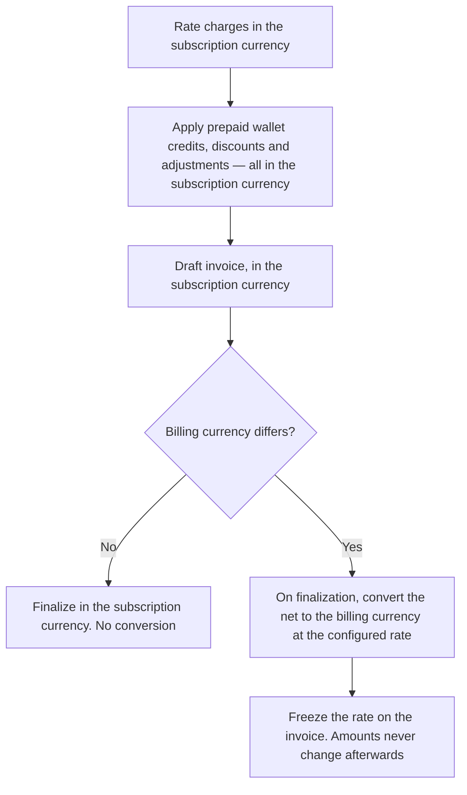
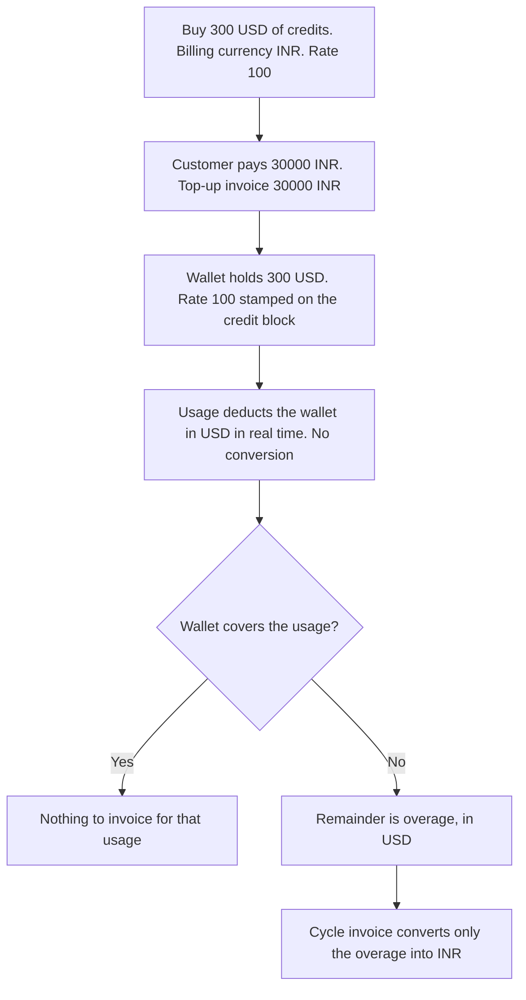
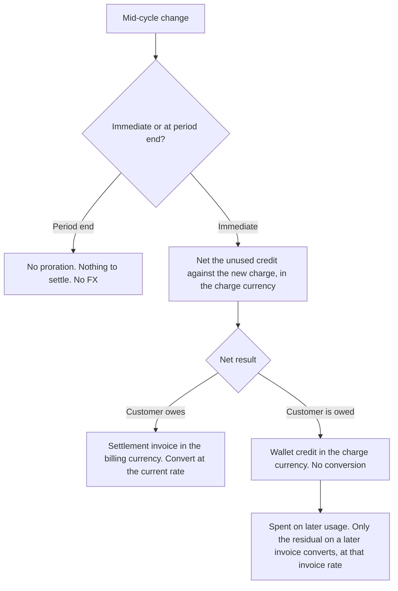
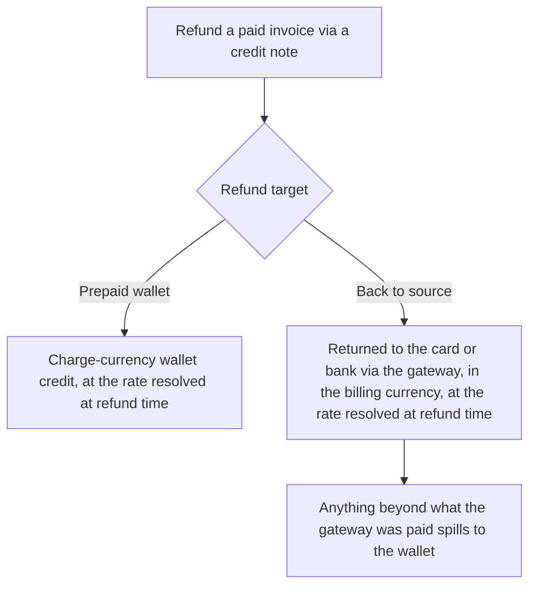

# Adaptive Multi-Currency Billing — PRD

**Status:** Draft
**Last updated:** 2026-09-25
**Proposed by:** Paras Aghija
**Issue:** FLE-1383

---

## Summary

**Adaptive Multi-Currency** lets a company price a plan in one currency and bill a customer in
another.

A plan priced in USD can be invoiced to a customer in INR, to another customer in EUR, and so
on — without rebuilding the plan for each currency. The company defines the exchange rate it
wants to use. Flexprice applies that rate when it generates the invoice, records the rate on the
invoice, and never changes it afterwards.

Rates are **fixed values the company configures**. Flexprice does not pull live market rates.

---

## The problem

Software and AI companies usually set one global price list in a single base currency. But their
customers are spread across regions, and many of those customers want to be billed in their own
currency. A customer in India would rather see and pay an INR invoice than a USD one, and avoid
the extra fees their bank adds on a cross-border charge.

Today Flexprice supports both of these, and both are painful:

1. **Rebuild the price list in every currency** — a plan can hold prices in several currencies, but
   each one is maintained and kept in sync by hand, or
2. **Bill everyone in the base currency** and push the currency problem onto the customer.

Either way, nobody actually chooses a customer's currency: an invoice comes out in whatever currency
the subscribed plan happens to be priced in, and a customer with two subscriptions priced in two
currencies gets two invoices in two currencies.

We want a company to keep **one source-of-truth price** and still bill any customer in that
customer's currency, using a rate the company controls.

---

## Competitor analysis

No billing platform offers "price in one currency, bill in another at a rate you set" out of the
box. The incumbents are built on **single-currency price lists and rate cards** — a foundational
assumption in how they model pricing — so cross-currency billing means maintaining a parallel price
list per currency, or bolting middleware onto the rating engine. It is an architectural limit, not
a missing setting: converting at billing time would reach into their core rating and invoicing
path, which is why none of them has done it.

| Platform | Bill in a currency different from the plan? | How you do it | Wallet / credit currency |
| --- | --- | --- | --- |
| **Stripe** | No automatic conversion | Define the price in each currency; the customer is locked to one currency | Held per currency; credits never offset an invoice in another currency |
| **Chargebee** | No automatic conversion | Add a separate price point per currency on the plan | Must match the invoice currency |
| **Zoho** | Partly | Derive the foreign price from a rate, or keep a per-currency price list | The customer's single currency |
| **Metronome** | No, for real currencies | Price the rate card in the target currency; only custom units convert | Denominated per credit type |
| **Orb** | No, for real currencies | Price in the target currency; only virtual units convert, at overage | One ledger per currency or unit |
| **Flexprice (this)** | **Yes** | **Keep one priced plan; convert to the customer's currency at a rate you configure** | **Charge currency; only the leftover converts** |

**Orb, up close** (the nearest comparison). Orb stores an *invoicing currency*, but it is the single
currency a customer, its prices, and its invoices all share — not a conversion target. An invoice is
one real-world currency, and the only conversion Orb performs is **credits (a custom pricing unit) →
that currency**, at overage. There is no fiat-to-fiat conversion, so billing a USD-priced plan in INR
means either a parallel INR price list or re-pricing the plan in credits. Orb's FX-rate and
functional-amount handling is for **ledger reporting**, not for changing an invoice's currency.

Two takeaways shape this design:

- **It is a real, urgent gap.** The incumbents cannot offer native configured-rate billing without
  reworking the currency assumption baked into their pricing core, so the need stays unmet — a
  difference Flexprice can own, not a catch-up feature.
- **Wallets belong in the subscription (charge) currency — that is the common practice.** Every one
  of these platforms keeps credits in the charge currency and never converts a wallet across two
  real currencies. Flexprice follows that consensus, which is exactly what keeps the credit-grant
  and real-time-usage flows correct.

---

## What we are building

Four things, in plain terms:

1. **A customer has a billing currency.** This is the currency all of that customer's invoices
   come out in. It is optional and starts empty, and must be set explicitly (through the API or
   UI). While it is empty, invoices follow the subscription's charge currency — exactly as today.

2. **Plans and subscriptions keep any currency.** Nothing about pricing changes. A plan can hold
   USD prices, EUR prices, or both. A subscription is created in one of them, exactly as today.
   This is the **charge currency** — the currency a charge is priced in.

3. **A customer is always billed in their billing currency.** When a charge's currency is
   different from the customer's billing currency, Flexprice converts it while generating the
   invoice and issues the invoice in the billing currency.

   | Charge | Customer billing currency | Invoice |
   | --- | --- | --- |
   | USD $100 | USD | $100 — no conversion |
   | USD $100 | INR | ₹8,300 — converted |
   | EUR €90 | INR | ₹8,100 — converted |

   One customer, one currency, on every invoice — no matter how many subscriptions they have or
   what those subscriptions are priced in.

4. **The rate is chosen, recorded, and reused.** Flexprice looks for a configured rate in this
   order and uses the first one it finds:

   ```
   subscription   →   customer   →   tenant + environment   →   fail
   ```

   The rate is written onto the invoice. Every downstream consumer — including the accounting
   integrations — uses that recorded rate, so the invoice, the ledger, and the sync all agree.

---

## Core concepts

| Term | Meaning |
| --- | --- |
| **Billing currency** | The currency a customer is invoiced in. New, optional, starts empty. |
| **Charge currency** | The currency a plan, price, or subscription is priced in. |
| **FX rate** | A fixed conversion rate the company configures. `target = source × rate`. USD→INR at `83` means $1 = ₹83. |
| **Frozen rate** | The rate written onto an invoice when it finalizes. It never moves afterwards, whatever happens to the configured rate later. |

---

## How today's billing keeps working

This change is additive. Nothing happens to a customer until someone gives them a billing
currency that differs from what they are charged in.

- A customer with **no billing currency** is billed exactly as today — each invoice takes the
  subscription's charge currency, and the billing currency stays empty until it is set explicitly.
- A customer whose **billing currency equals the charge currency** follows the same code path as
  today — no rate is looked up, nothing extra appears on the invoice.
- Conversion only switches on when the two currencies differ **and** a rate is configured.

Every existing customer keeps working untouched until a company deliberately opts one in.

---

## Where conversion happens

Three things create invoices in Flexprice, and all three convert the same way:

- **Subscription billing** — the usual cycle invoice.
- **Wallet top-up** — buying prepaid credits.
- **One-off invoice** — created directly through the API.

In every case the invoice is **calculated entirely in the subscription (charge) currency first**:
charges are rated, prepaid wallet credits are applied, and discounts and adjustments are taken — all
in the charge currency, on the draft. **Only at finalization is the resulting net converted into the
customer's billing currency**, and the rate used is frozen onto the invoice at that moment. So a
draft sits in the charge currency (a billing-currency figure can be shown as a live estimate, but
the actual conversion is the finalization step).



These rules keep this safe:

- **A subscription is rejected at creation if its rate is missing.** When the customer has a
  billing currency set and the plan's charge currency is different, Flexprice requires a configured
  rate for that pair before the subscription is created. If none exists, the subscription is not
  created and the error says what to do — for example, *"No exchange rate configured for USD → INR.
  Set a rate before subscribing this customer to a USD plan."* This catches the gap before any
  usage accrues, rather than at the end of the cycle.
- **The draft stays in the subscription currency; conversion happens once, at finalization.** The
  rate is applied to the final net — after prepaid credits, discounts and adjustments — and frozen
  there. A finalized invoice's amounts never move afterwards, whatever the configured rate does.
- **If no rate is configured, invoice generation still fails and says which pair is missing.**
  Flexprice never falls back to a rate of `1` or guesses a number, because a wrong invoice that has
  already been sent cannot be taken back, while a blocked one can be fixed.

---

## The wallet

A wallet holds prepaid or granted credits in the **charge currency** — US dollars for a USD plan —
not in the customer's billing currency. This is the single most important design choice in the
document, so here is why.

Usage draws the wallet down in the charge currency, in real time, with **no conversion**. A
$0.01 API call reduces a USD wallet by $0.01, whatever the customer is billed in. Conversion only
happens when money actually moves in the billing currency, and that is only at two moments:

- **Top-up.** The customer pays in their billing currency. Flexprice converts at the rate in
  effect at top-up, adds the credits to the wallet in the charge currency, and stamps that rate
  onto the credit block.
- **Cycle invoice.** Only the usage the wallet did not cover — the overage — is converted and
  invoiced.



**Worked example.** A customer billed in INR buys $300 of credits at a rate of 100. They pay
₹30,000, and the top-up invoice is ₹30,000. Their wallet holds $300. Over the month they run
$330 of usage:

- The first $300 is covered by the wallet — drawn down in dollars, no conversion.
- The last $30 is overage. At cycle close it is converted at the configured rate, say 100, to
  ₹3,000, and that is the invoice.
- Total paid: ₹30,000 + ₹3,000 = ₹33,000 for $330 of usage. Correct, and the wallet balance was
  never touched by a rate.

**Why the wallet is not held in the billing currency.** If the wallet were INR, every usage
event priced in USD would have to be converted to draw it down, and the rate used at drawdown
would rarely match the rate used on the invoice — so the balance the customer sees and the amount
they are billed would drift apart. A prepaid "$100 of credit" would also silently become worth
less than $100 of usage the moment the rate moved. Holding the wallet in the charge currency
avoids both: **$100 of credit always buys exactly $100 of usage.** Every major platform
(Stripe, Chargebee, Zoho, Metronome, Orb) keeps credits in the charge currency for this reason;
none converts a wallet across two real currencies.

A balance can still be **shown** to the customer in their billing currency for convenience — that
is a display detail. What is stored and drawn down is the charge currency.

**Refunds of unused credits** use the rate the credits were bought at — the stamped rate on the
credit block — not today's rate. A customer who paid ₹30,000 for $300 and used $100 is refunded
$200 at the rate of 100, i.e. ₹20,000.

**Credit and entitlement grants work the same way.** A granted $100 of credit is just $100 in the
charge-currency wallet — it never converts, so it always buys $100 of usage, whatever the customer
is billed in and however the rate moves. Included-unit entitlements (minutes, calls, seats) are
counted in units, not money, and never touch a rate.

### Postpaid wallets

Everything above is a **prepaid** wallet: it offsets usage *before* an invoice is cut, so it lives
in the **charge currency**. A **postpaid** wallet is the mirror image — a stored balance that
**pays a finalized invoice**, like an on-file payment method. It does not deplete as usage arrives;
it is drawn on only when a bill is issued, and it can be limited to certain lines (only usage, only
fixed fees, or the whole invoice).

A finalized invoice is already in the **billing currency**, and a payment has to match the invoice
currency — so a **postpaid wallet is held in the billing currency**. Everything that follows from
that is reassuring:

- **Paying an invoice needs no conversion.** The invoice was converted once at finalization; the
  postpaid wallet simply settles the resulting billing-currency amount — the whole bill, or just
  the usage or fixed lines, which are already in that currency.
- **Refunds, credit notes, and overpayments land in it with no conversion**, since they are already
  in the billing currency.

So the two wallets sit on opposite sides of the conversion and compose cleanly: the prepaid wallet
draws down usage in the charge currency, the residual is converted and finalized, and the postpaid
wallet then settles that billing-currency balance — no cross-currency step at either wallet.

**Migrating credits from a prepaid wallet to a postpaid wallet** is the one place a conversion can
happen. It is not an in-place switch: the prepaid wallet is closed and its balance is migrated into
a new postpaid wallet, and whoever runs the migration picks the currency that wallet should hold.
The same currency migrates the credits one-to-one, no conversion. A different currency — usually a
charge-currency prepaid balance moving into a billing-currency postpaid wallet — converts the
credits once at the configured rate, and is allowed **only if a rate is resolvable** at the customer
or tenant level; if none is configured, the migration is rejected and names the pair. A customer can
hold only one active postpaid wallet per currency.

---

## Mid-cycle changes

When a customer changes plan mid-cycle, Flexprice works out the **unused credit** from the old plan
and the **new charge** for the rest of the period — both **in the charge currency** — and nets them
into a single settlement. What that net turns out to be decides everything, including whether any
conversion is needed. (Any metered usage on the old plan up to the switch is billed as its own
invoice, which is an ordinary new charge.)

- **Net is a charge** (the customer owes — typically an upgrade): one **settlement invoice** is
  raised in the billing currency. This is the only automatic path that converts, and it converts at
  the **current configured rate**.
- **Net is a credit** (the customer is owed — a downgrade, dropping a quantity, removing an add-on,
  or cancelling): the amount is added to the **wallet as credit, in the charge currency**. **Nothing
  converts.** It is not returned to the card, and not converted to the billing currency — a customer
  billed in INR on a USD plan simply gets USD wallet credit, which converts only later, when it is
  spent and a residual lands on an invoice.
- **Change scheduled for period end:** no proration happens at all — the switch takes effect at the
  cycle boundary, so there is nothing to settle and nothing to convert.

Getting money back to the card is a **separate, deliberate step**, not part of proration: someone
raises a **refund credit note** against a paid invoice (below).

### How each amount is squared off, and where FX applies



Refunding an already-paid invoice is the separate path:



The rule behind both diagrams:

| What is happening | Needs FX? | Which rate |
| --- | --- | --- |
| Net credit paid to the wallet | No | — (stays in the charge currency) |
| Net charge raised as a settlement invoice | Yes | the current configured rate |
| Wallet credit later offsets usage | Only the residual | that later invoice's own rate |
| Refund credit note → wallet or back to source | Yes | the rate **resolved at refund time** (= the original while rates are fixed) |
| Change scheduled for period end | No | — |

In one line: **new charges, proration, and refunds all use the rate resolved at that moment; only a
finalized invoice keeps its own frozen rate for its own amounts; and money that stays in the
charge-currency wallet does not convert at all.** While rates are fixed (the model today), the rate
resolved at a refund equals the one the original invoice used, so nothing deviates. If dynamic FX
rates are ever introduced, a refund could resolve a different rate than the original invoice and
deviate by the difference — an accepted, known trade-off.

**Worked example — downgrade (net credit → wallet).** A $120/month plan, customer billed in INR;
halfway through the month they downgrade to $60/month.

- Unused half of the old plan: **$60** credit. New plan's remaining half: **$30** charge.
- Net = **$30 credit → $30 added to the USD wallet.** No conversion, no card refund. The customer
  later spends that $30 on usage, and only any residual then converts, at that invoice's rate.

**Worked example — upgrade (net charge → invoice).** The same customer instead upgrades from $60 to
$120/month halfway through.

- Unused half of the old plan: **$30** credit. New plan's remaining half: **$60** charge.
- Net = **$30 charge → converted at the current rate** (say 100) → a **₹3,000 settlement invoice**
  in the billing currency.

**Worked example — refund to card.** A customer paid a **₹8,300** invoice ($100 at a rate of 83). To
return it, a refund credit note is raised using the rate **resolved at refund time**. While that
rate is still 83, **back to source** returns **₹8,300** to their card via the gateway, and **to
wallet** credits **$100** to their USD wallet (₹8,300 ÷ 83) — netting exactly against the original.
Only if the resolved rate had moved (dynamic rates) would the returned amount differ from ₹8,300.

---

## Expected user flows

**Setting up (company).**

1. Configure an exchange rate — at the tenant level for a default, or at the customer or
   subscription level for a specific deal.
2. Set the customer's billing currency explicitly. If it is left empty, invoices follow the
   subscription's charge currency.

**Being billed (customer).**

1. The customer subscribes to a plan (priced in, say, USD) or tops up a wallet.
2. At the end of the cycle, Flexprice converts the charges into the customer's billing currency
   and issues one invoice in that currency.
3. The invoice shows the source amount and the rate used — for example, *"$100.00 converted at
   83.00."* The customer can always see what they were charged and how it became their local
   amount.

---

## Syncing to external systems

Whatever currency an invoice is generated in, it syncs to the ERP or any third-party integration
**in that same currency**. Flexprice never restates an invoice into a different currency on the way
out — an INR invoice syncs as INR, a USD invoice syncs as USD. The recorded rate is sent alongside
it, so the external system can post its own base-currency ledger entry without looking up a rate of
its own.

This is the pattern throughout: an invoice's currency is fixed when it is generated, and every
downstream consumer — accounting sync, payments, reporting — reads that currency and the recorded
rate rather than re-deriving either.

Those systems bind each customer to a single currency, so the invoice's currency must match the
currency of the mapped customer in the ERP. **If it does not, the sync fails** — Flexprice does not
convert the document or force it onto a mismatched customer. This is why a customer billed in more
than one currency needs a separate ERP customer per currency.

---

## Changing a customer's billing currency

A customer's billing currency can be changed when a company needs to, as long as a rate to the new
currency is available. The change applies going forward and leaves history untouched:

- **A rate to the new currency must be resolvable.** Before the change is accepted, Flexprice checks
  that an exchange rate to the new billing currency exists — at the customer or tenant level — for
  every currency the customer's active subscriptions are charged in. If one is missing, the change
  is rejected and names the pair, so the customer's next invoice cannot fail for want of a rate.
- **Existing invoices are not restated.** Each invoice keeps the currency and frozen rate it was
  finalized with. Invoices billed in INR stay INR; invoices billed in USD stay USD.
- **New invoices use the new currency**, converting from each charge's currency at the rate that
  applies then — the same conversion as any other invoice.
- **Wallets are unaffected.** A wallet keeps its charge currency and is still drawn down before
  conversion, so a change of billing currency does not touch prepaid balances.

**What this means for ERP sync.** Each Flexprice customer maps to one customer in Zoho or
QuickBooks, and both systems **lock that customer to a single currency and do not allow it to
change once the customer has transactions**. A customer who has billed in two currencies therefore
cannot sync both to one ERP customer. When the billing currency changes, invoices in the new
currency must map to a **separate ERP customer for that currency**: the original ERP customer
keeps its currency and its earlier invoices, and a per-currency counterpart holds the new ones.
Without this, the new-currency invoices have no valid customer to sync to.

---

## Restrictions

| Restriction | Reason |
| --- | --- |
| An invoice is entirely in one currency — the customer's billing currency. | A single document with mixed currencies cannot be paid or reconciled cleanly. |
| A customer's billing currency can change; existing invoices keep their currency and only new invoices use the new one. | History stays correct because finalized invoices are never restated. |
| Invoices in a new billing currency sync to a separate Zoho/QuickBooks customer for that currency. | Both systems lock a customer to one currency and will not change it once it has transactions. |
| A wallet holds one currency — the charge currency it offsets. | Keeps drawdown conversion-free. A customer who needs two currencies has two wallets. |
| A payment is in the invoice's currency. | Paying one invoice with two currencies is out of scope. |
| A subscription is rejected at creation if the plan's charge currency differs from the customer's billing currency and no rate is configured. | Surfaces a missing rate before any usage accrues. |
| No configured rate → invoice generation fails, naming the missing pair. | A blocked invoice is recoverable; a wrong one that was already sent is not. |
| Rates are fixed values the company sets; they do not move on their own. | Companies asking for this negotiated a specific number with the customer and want it to hold. |

---

## Edge cases

- **Reversals use the rate resolved at reversal time.** A credit note converts at the rate configured
  then — equal to the original invoice's rate while rates are fixed, so it nets to zero; under future
  dynamic rates it could deviate. A downgrade credit is different again: it goes to the wallet in the
  charge currency and does not convert at all.
- **Rounding is absorbed, not dropped.** Converted line items always add up to the converted
  invoice total; any sub-unit remainder is absorbed into the invoice rather than lost.
- **Wallet leftover "dust" is written off.** A tiny residual balance (for example under ₹1) is
  written off so an invoice can close and the customer is not chased for a fraction of a rupee.
- **Included units do not convert.** Entitlements counted in units — minutes, calls, seats — are
  never money and never touch a rate. Only monetary credits and charges convert.
- **Multiple subscriptions in different charge currencies** each convert independently into the
  one billing currency; the customer still receives a single-currency invoice.

---

## What fixed rates mean for a company

A fixed rate keeps the **customer's** bill steady and lets the **company's** realized value move
with the market. If a plan is $100 and the rate is 95, the customer pays ₹9,500 every month even
as the market drifts; what changes is how many dollars that ₹9,500 is worth to the company. That
is usually exactly what a company that priced a local deal wants.

The one thing to watch is **drift over time**: a rate set at 95 and never revisited keeps billing
₹9,500 while the market moves to 110, quietly eroding value even though every invoice is paid in
full. This argues for periodically reviewing configured rates, and it applies most to long-lived
prepaid balances, which hold their rate the longest.

---

## Success criteria

- A customer with USD and EUR subscriptions and a billing currency of INR receives **every**
  invoice in INR.
- The rate used is stored on the invoice and can be read back.
- Converted line items add up exactly to the invoice total — no leftover drift.
- Changing a configured rate does not alter any finalized invoice.
- With no configured rate, invoice generation fails and names the missing pair — no invoice is
  created.
- A customer whose billing currency equals the charge currency follows an unchanged path.
- A customer billed in INR who tops up a USD wallet pays in INR, receives an INR top-up invoice,
  and the wallet still holds USD credits.
- Accounting integrations send the invoice's recorded rate, not one they look up themselves.
- Every converted invoice shows the source amount and the rate used.

---

## Open questions

- **Tax reference rate.** Some jurisdictions (for example India GST) may require the local-currency
  value on an invoice to use a prescribed reference rate rather than the commercial rate the
  company set. If so, an invoice may need to carry two rates — one commercial, one for tax
  reporting. This needs confirmation with a finance contact at a company that would use the
  feature, because it affects what an invoice has to store.
- **How proration reversals are structured.** When a mid-cycle change gives back money already
  billed in advance, the reversal must use the original invoice's rate. That can be a credit note
  against the original invoice (keeping one rate per document) or a line on the next invoice that
  carries the original rate. Both keep the money correct; the choice is about how invoices are
  organized.
