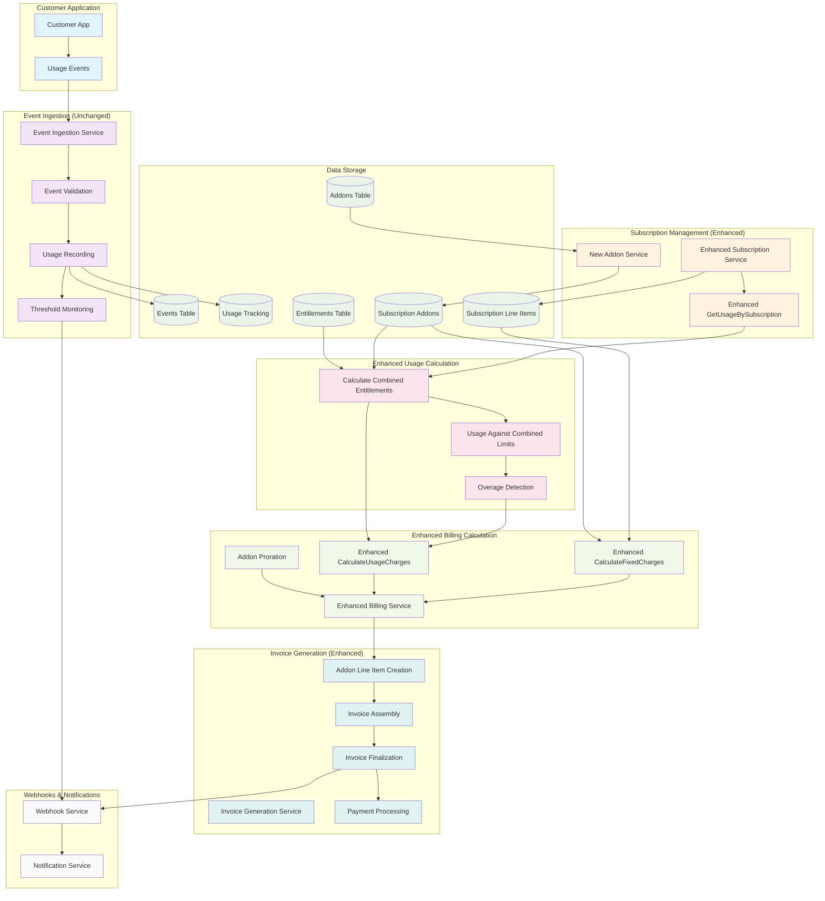
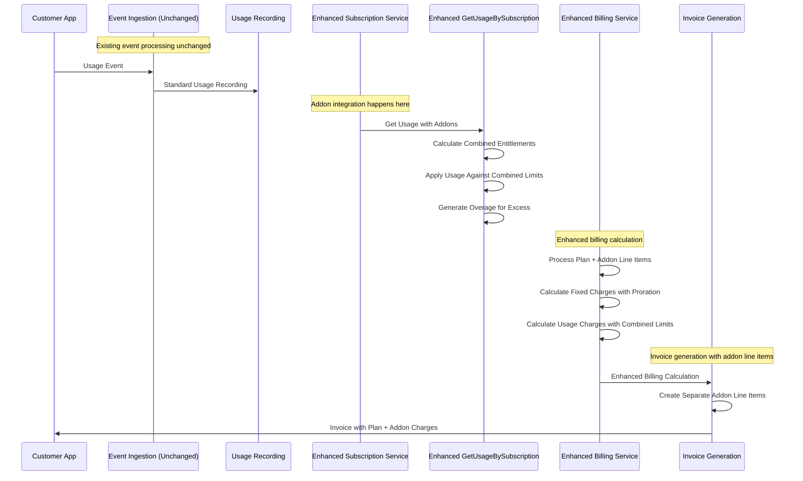
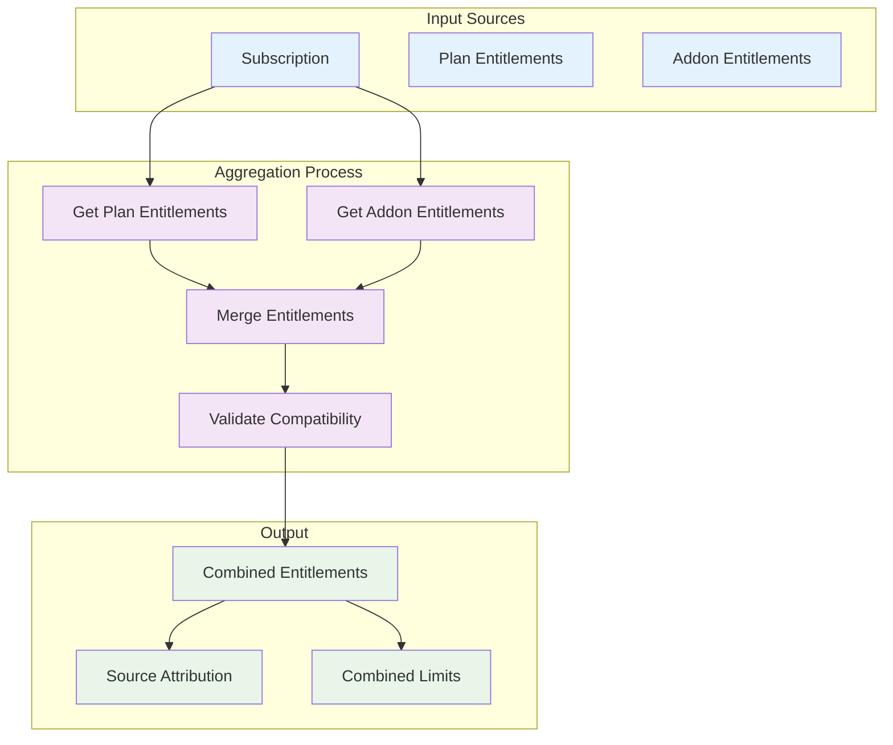
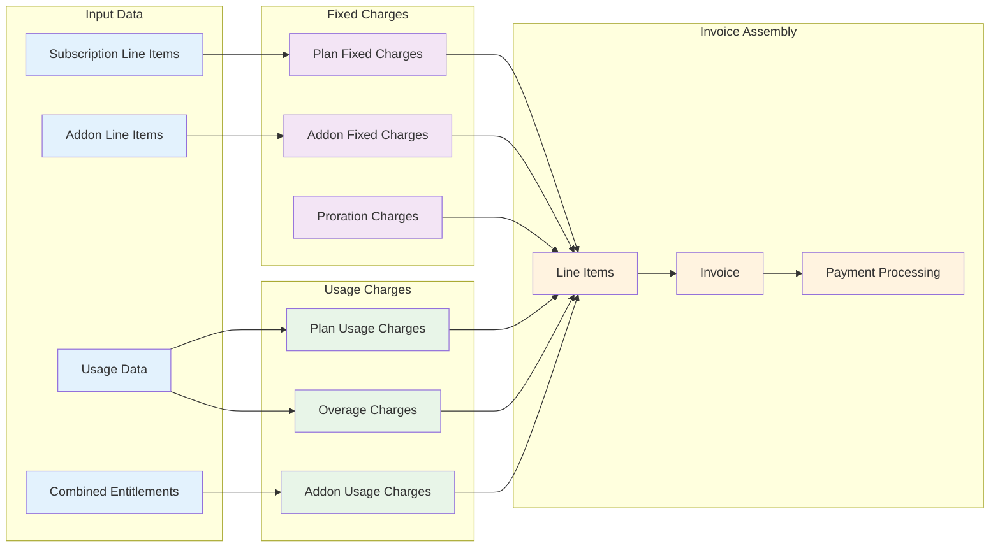
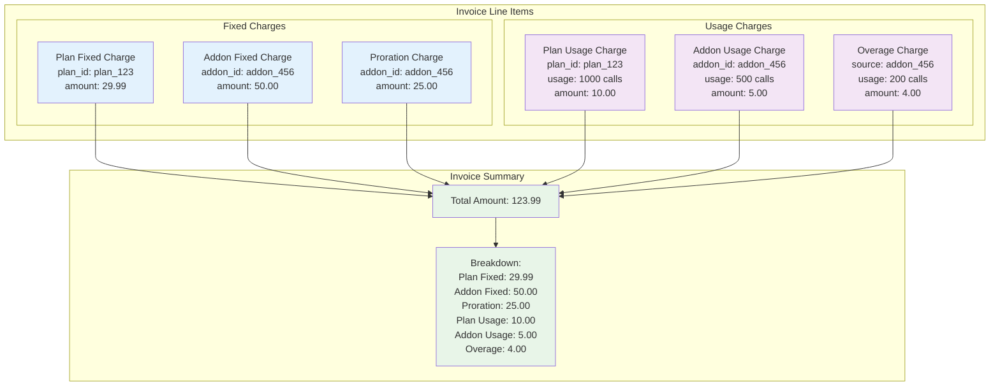
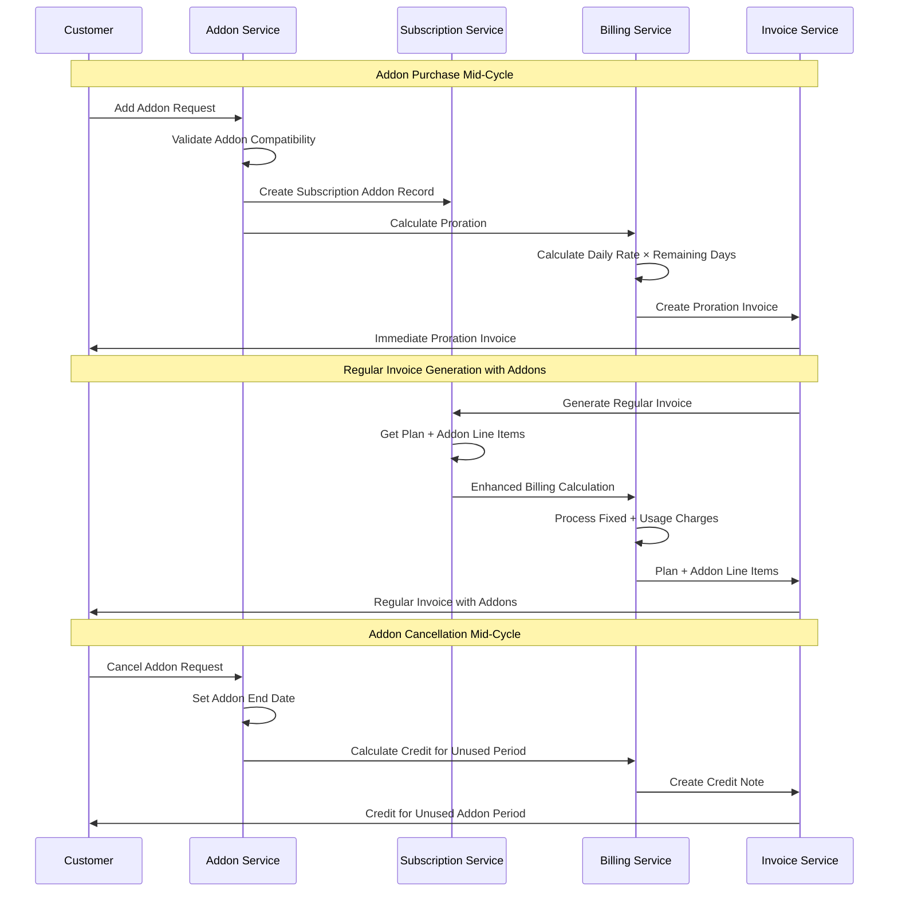
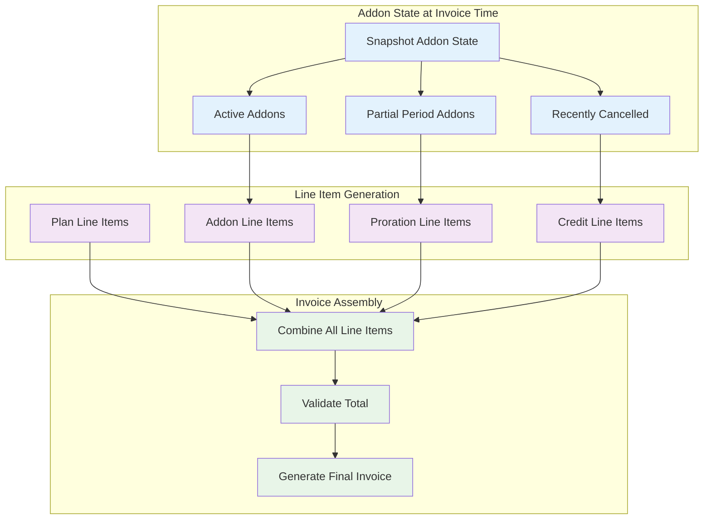
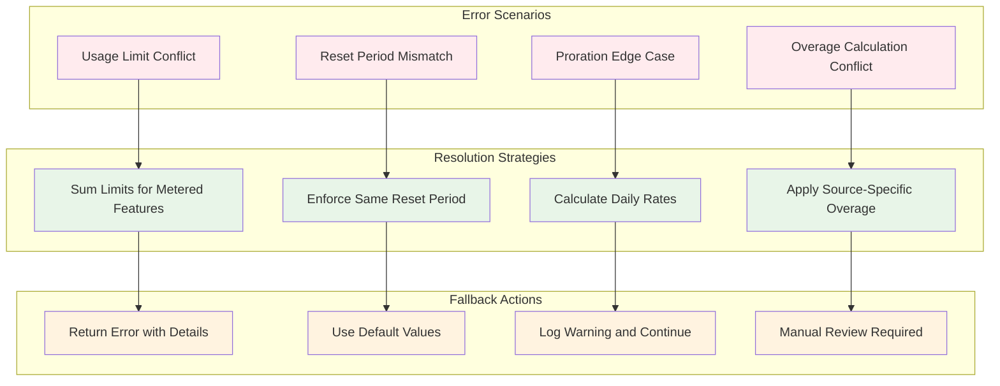
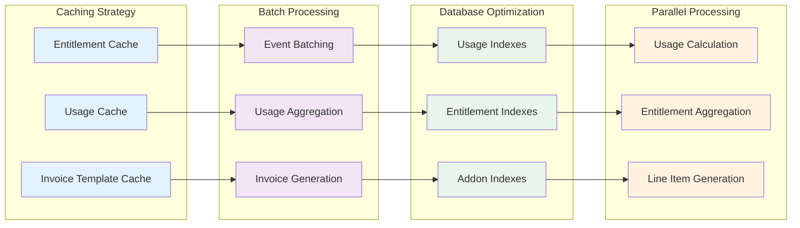
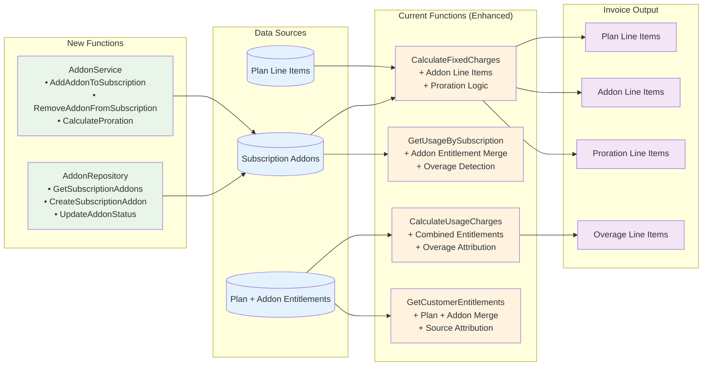

# Add-ons Accounting Flow Diagram (Invoice-Level Integration)

## Complete System Flow (Minimal Changes Approach)



## Invoice-Level Integration Flow



## Entitlement Aggregation Flow



## Billing Calculation Flow



## Invoice Line Item Structure



## Usage Tracking with Source Attribution

```mermaid
graph TB
    subgraph "Usage Event"
        EVENT[Usage Event<br/>meter_id: api_calls<br/>usage: 1500 calls<br/>timestamp: 2024-01-15]
    end

    subgraph "Entitlement Sources"
        PLAN_ENT[Plan Entitlement<br/>limit: 1000 calls<br/>used: 1000 calls]
        ADDON_ENT[Addon Entitlement<br/>limit: 500 calls<br/>used: 500 calls]
    end

    subgraph "Usage Calculation"
        PLAN_USAGE[Plan Usage<br/>1000 calls (within limit)]
        ADDON_USAGE[Addon Usage<br/>500 calls (within limit)]
        OVERAGE_USAGE[Overage Usage<br/>0 calls (no overage)]
    end

    subgraph "Billing Impact"
        PLAN_CHARGE[Plan Charge<br/>1000 calls × 0.01 = 10.00]
        ADDON_CHARGE[Addon Charge<br/>500 calls × 0.01 = 5.00]
        OVERAGE_CHARGE[Overage Charge<br/>0 calls × 0.02 = 0.00]
    end

    EVENT --> PLAN_ENT
    EVENT --> ADDON_ENT
    PLAN_ENT --> PLAN_USAGE
    ADDON_ENT --> ADDON_USAGE
    PLAN_USAGE --> PLAN_CHARGE
    ADDON_USAGE --> ADDON_CHARGE
    OVERAGE_USAGE --> OVERAGE_CHARGE

    %% Styling
    classDef event fill:#e3f2fd
    classDef entitlement fill:#f3e5f5
    classDef usage fill:#e8f5e8
    classDef billing fill:#fff3e0

    class EVENT event
    class PLAN_ENT,ADDON_ENT entitlement
    class PLAN_USAGE,ADDON_USAGE,OVERAGE_USAGE usage
    class PLAN_CHARGE,ADDON_CHARGE,OVERAGE_CHARGE billing
```

## Mid-Cycle Addon Management Flow



## Invoice Generation During Addon Changes



## Error Handling and Edge Cases



## Performance Optimization Points



## Enhanced Function Integration Points



## Summary: Minimal Integration Approach

This approach provides comprehensive addon functionality while:

1. **Preserving Event System**: No changes to event ingestion
2. **Enhancing Key Functions**: Minimal changes to existing billing functions
3. **Adding New Services**: Clean addon management layer
4. **Invoice-Level Integration**: All addon logic handled during invoice generation
5. **Mid-Cycle Flexibility**: Full support for addon changes with proper proration

The system maintains backward compatibility while adding powerful addon capabilities through strategic enhancements to existing functions and addition of focused addon management services.
