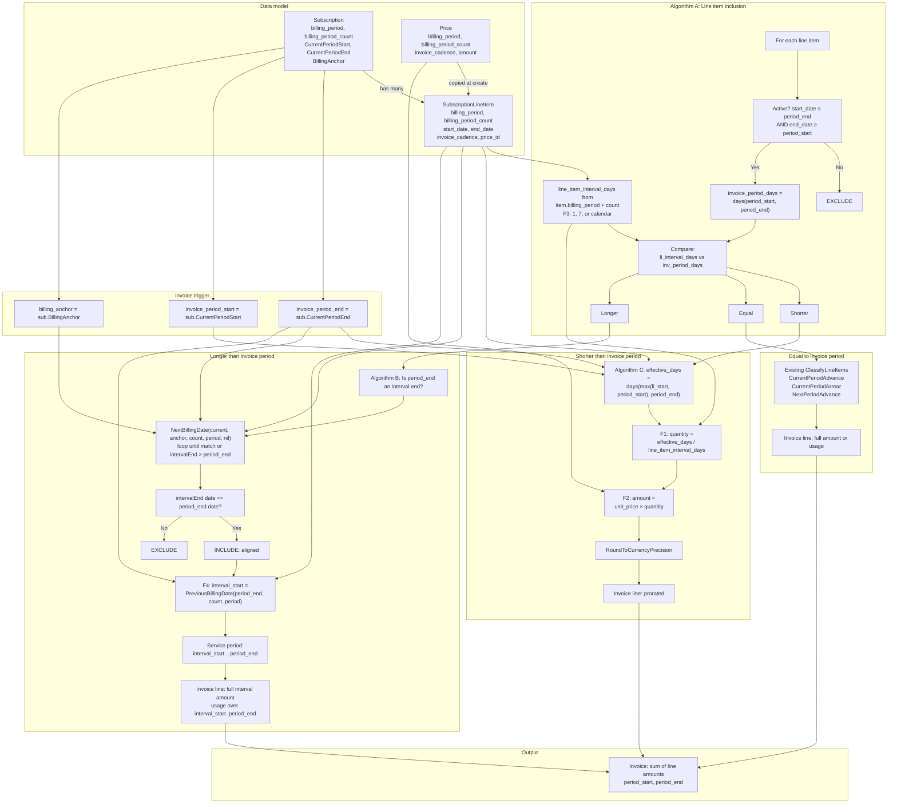

# Mixed-Interval Billing – Single Flow Diagram

One diagram showing how all pieces of the mixed-interval billing solution connect: data model, invoice period, line-item inclusion (Algorithm A), alignment check (Algorithm B), formulas (F1–F5), date helpers, and output.

---

---

## How to read this diagram

| Section | What it shows |
|--------|----------------|
| **Data model** | Subscription (invoice period), SubscriptionLineItem (per-price interval from Price). Line item gets `billing_period` and `billing_period_count` from Price at create. |
| **Invoice trigger** | `invoice_period_start`, `invoice_period_end`, and `billing_anchor` come from Subscription and drive all inclusion and proration. |
| **Algorithm A** | For each line item: check active → compute invoice and line-item interval days (F3) → compare lengths → branch Shorter / Equal / Longer. |
| **Shorter path** | Algorithm C → effective_days; F1 (quantity); F2 (amount); round → invoice line. Depends on LI, period, Price. |
| **Equal path** | Existing ClassifyLineItems (advance/arrear buckets) → invoice line. No new formulas. |
| **Longer path** | Algorithm B uses NextBillingDate in a loop; if period_end matches an interval end, use PreviousBillingDate (F4) for service period → full amount and usage window → invoice line. |
| **Output** | All branches contribute invoice lines; invoice is the sum over the period. |

**Key dependencies:** NextBillingDate and PreviousBillingDate ([internal/types/date.go](internal/types/date.go)) are used only in the longer path (alignment + F4). F1/F2 use effective_days (Algorithm C) and line_item_interval_days (F3). Subscription and LineItem fields feed every branch.
