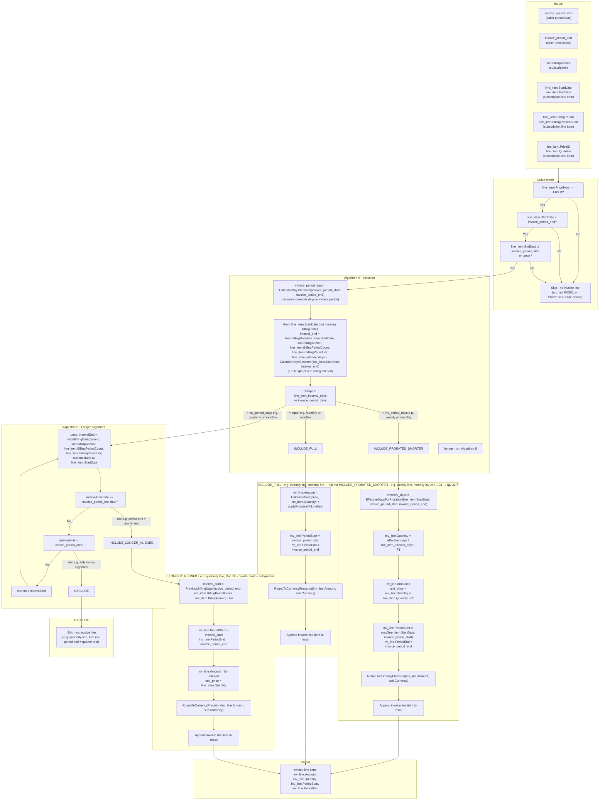

# Mixed-Interval Billing – Logic Diagram

Single flowchart for **CalculateFixedCharges** ([internal/service/billing.go](internal/service/billing.go)): inclusion (Algorithm A/B), period and amount per type (F1, F2, F4), date helpers. Scope: [mixed-interval-billing-implementation-scope.md](mixed-interval-billing-implementation-scope.md). Formulas & algorithms: [mixed-interval-billing.md](mixed-interval-billing.md) §5.6, 5.7, 5.9; helpers: [internal/types/date.go](internal/types/date.go).

---

## How to read

**Names:** `invoice_period_start` / `invoice_period_end` = this invoice period; `sub` = subscription (BillingAnchor, Currency); `line_item` = subscription line item (StartDate, EndDate, BillingPeriod, BillingPeriodCount, PriceID, Quantity, PriceType); `inv_line` = created invoice line (Amount, Quantity, PeriodStart, PeriodEnd).

**Flow:** For each fixed `line_item`: (1) Active check → skip if not FIXED or outside period. (2) Algorithm A: compare `line_item_interval_days` (from line item start, F3) vs `invoice_period_days` → shorter / equal / longer. (3) Longer → Algorithm B: include only if `invoice_period_end` equals a line-item interval end. (4) EXCLUDE → no line; PRORATED_SHORTER → F1/F2, effective_days, round; LONGER_ALIGNED → F4, full amount, round; FULL → CalculateCost + applyProrationToLineItem, round. (5) Append `inv_line`. Details: [mixed-interval-billing.md](mixed-interval-billing.md) §5.6, 5.7.

---

## Effective days and proration (INCLUDE_PRORATED_SHORTER)

### How `effective_days` is computed (Algorithm C)

**EffectiveDaysForProration(line_item.StartDate, invoice_period_start, invoice_period_end)** returns the number of calendar days the line item is active **inside** the invoice period — i.e. the overlap of “line item active window” and “invoice period”.

**Formula:**

1. **start** = max(`line_item.StartDate`, `invoice_period_start`) — first day that counts (clip to period if line item starts mid-period).
2. **end** = `invoice_period_end`, or min(`invoice_period_end`, `line_item.EndDate`) if the line item has an end date — last day that counts.
3. **effective_days** = CalendarDaysBetween(start, end) — count of calendar days in [start, end] (inclusive; use same convention as [internal/types/date.go](internal/types/date.go)).

So we bill only for days that fall **both** in the line item’s active life **and** in this invoice period. Mid-term adds and line-item end dates are handled by this clipping.

### Full proration chain (F1, F2)

- **inv_line.Quantity** (F1) = `effective_days` / `line_item_interval_days` (decimal).
- **inv_line.Amount** (F2) = `unit_price` × inv_line.Quantity × `line_item.Quantity`.
- Then **RoundToCurrencyPrecision**(inv_line.Amount, sub.Currency).

So: **effective_days** = “how many days to bill in this period”; **line_item_interval_days** = “length of one full interval” (e.g. 7 for weekly). Quantity is “how many intervals’ worth” (e.g. 4.43 weeks).

---

### Example: monthly sub, weekly line item (both start Jan 1; period end Jan 31)

- **invoice_period_start** = Jan 1, **invoice_period_end** = Jan 31 (monthly invoice).
- **line_item.StartDate** = Jan 1; line item is **weekly** (e.g. BillingPeriod = WEEKLY, count = 1).
- **line_item_interval_days** = 7 (one week).
- **invoice_period_days** = 31 → Algorithm A: 7 &lt; 31 → **INCLUDE_PRORATED_SHORTER**.

**Effective days:**

- start = max(Jan 1, Jan 1) = Jan 1  
- end = Jan 31 (no line_item.EndDate)  
- **effective_days** = CalendarDaysBetween(Jan 1, Jan 31) = **31** (full month).

So we bill for **all 31 days** of January in this invoice period.

**Quantity and amount:**

- **inv_line.Quantity** = 31 / 7 = **4.4286…** (i.e. 4 full weeks + 3 days).
- **inv_line.Amount** = unit_price × 4.4286… × line_item.Quantity, then rounded.

So the line item is billed for **4 weeks plus the extra 2–3 days** (here 3 days) in one go: we don’t bill “4 weeks” and then “3 days” separately; we use the single prorated quantity **31/7**, which is correct for “whole period up to invoice period end” (Jan 1–Jan 31). The weekly price is effectively applied at a daily rate (price/7) for 31 days.

---

## Examples by branch / route

Each example assumes one **fixed** line item and one invoice period; the route is the path taken for that line item.

---

### 1. Skip (active check) — no invoice line

**Scenario:** Line item is not in scope for this invoice period.

| Example | Why we skip |
|--------|--------------|
| **Not FIXED** | line_item.PriceType = USAGE (or other). Only FIXED items are considered. |
| **Not started yet** | line_item.StartDate = Feb 15; invoice_period_end = Jan 31 → StartDate > periodEnd → skip. |
| **Already ended** | line_item.EndDate = Dec 31; invoice_period_start = Jan 1 → EndDate < periodStart → skip. |

**Outcome:** No invoice line item is created for this line item on this invoice.

---

### 2. INCLUDE_PRORATED_SHORTER

**Scenario:** Line item interval **shorter** than invoice period (e.g. weekly on monthly invoice).

**Example:** Monthly sub, **weekly** line item; both start Jan 1. Invoice period Jan 1–Jan 31.

- invoice_period_days = 31, line_item_interval_days = 7 → 7 < 31 → **INCLUDE_PRORATED_SHORTER**.
- effective_days = 31 (Jan 1–Jan 31).
- inv_line.Quantity = 31 / 7 ≈ 4.43; inv_line.Amount = unit_price × 4.43 × line_item.Quantity (rounded).
- inv_line.PeriodStart = Jan 1, inv_line.PeriodEnd = Jan 31.

**Outcome:** One invoice line with prorated amount for 4 full weeks + 3 days in January.

---

### 3. INCLUDE_FULL

**Scenario:** Line item interval **equal** to invoice period (e.g. monthly on monthly invoice).

**Example:** Monthly sub, **monthly** line item; both aligned. Invoice period Jan 1–Jan 31.

- invoice_period_days ≈ 31, line_item_interval_days ≈ 31 → **≈ equal** → **INCLUDE_FULL**.
- inv_line.Amount = CalculateCost(price, line_item.Quantity) + applyProrationToLineItem (existing logic).
- inv_line.PeriodStart = Jan 1, inv_line.PeriodEnd = Jan 31.

**Outcome:** One invoice line with full (non-prorated) charge for the month; same behavior as today for same-interval items.

---

### 4. INCLUDE_LONGER_ALIGNED

**Scenario:** Line item interval **longer** than invoice period, and **invoice_period_end** is the end of a full line-item interval (Algorithm B match).

**Example:** Monthly sub, **quarterly** line item; line item start Jan 1. Invoice period **Mar 1–Mar 31** (period end = Mar 31).

- invoice_period_days = 31, line_item_interval_days ≈ 90 → longer → run Algorithm B.
- Interval ends from Jan 1: e.g. Apr 1, Jul 1, … (or calendar quarter ends Mar 31, Jun 30, … depending on anchor). If Mar 31 equals one of those interval ends → **INCLUDE_LONGER_ALIGNED**.
- interval_start = PreviousBillingDate(Mar 31, 1, QUARTERLY) = Jan 1 (start of that quarter).
- inv_line.PeriodStart = Jan 1, inv_line.PeriodEnd = Mar 31; inv_line.Amount = full quarterly price × line_item.Quantity (rounded).

**Outcome:** One invoice line for the full quarter (Jan 1–Mar 31); this monthly invoice is the one that "contains" the quarter end.

---

### 5. EXCLUDE (Algorithm B) — no invoice line

**Scenario:** Line item interval **longer** than invoice period, but **invoice_period_end** does **not** match any line-item interval end.

**Example:** Monthly sub, **quarterly** line item; line item start Jan 1. Invoice period **Feb 1–Feb 28** (period end = Feb 28).

- invoice_period_days = 28, line_item_interval_days ≈ 90 → longer → run Algorithm B.
- Interval ends from Jan 1: e.g. Apr 1, Jul 1, … (or Mar 31, Jun 30, …). Feb 28 does **not** equal any interval end → **EXCLUDE**.
- No invoice line created for this line item on the February invoice.

**Outcome:** No invoice line; the quarterly item will appear on the March (or April) invoice when the period end aligns with the quarter end.
