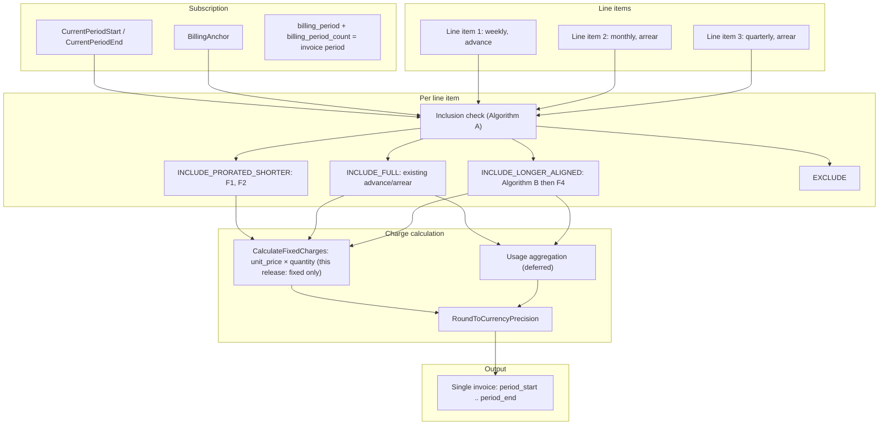
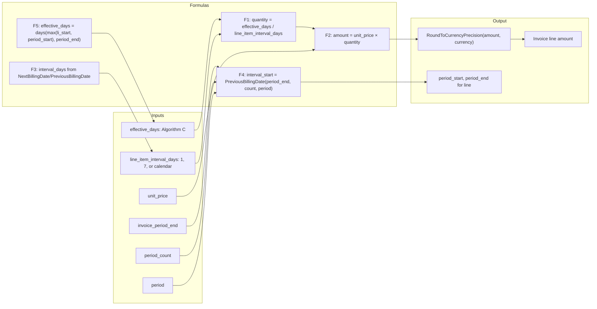
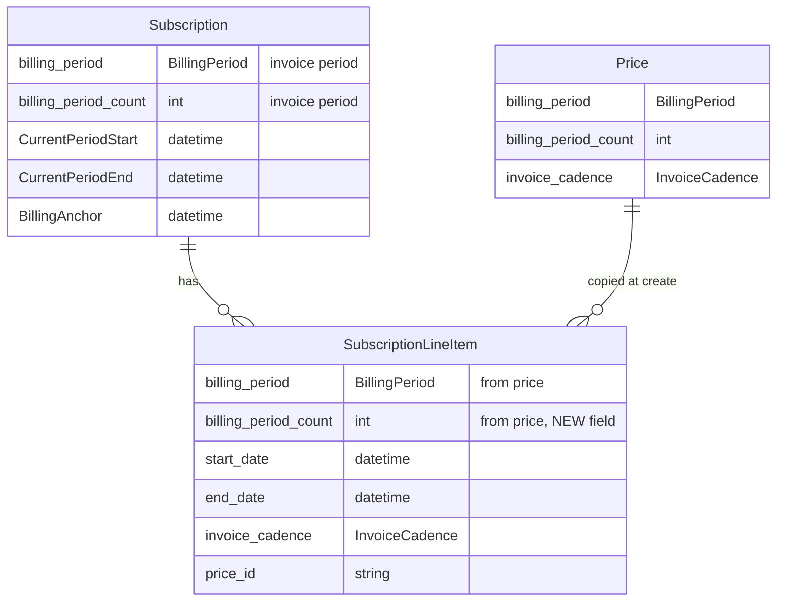
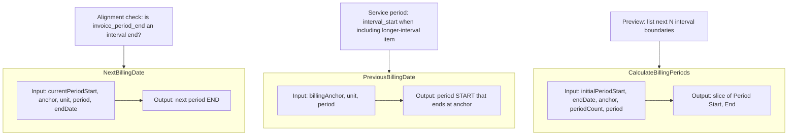

# Mixed-Interval Billing – Product Requirements Document (PRD)

## Executive summary

**What:** One subscription can have line items with **different billing intervals** (daily, weekly, monthly, quarterly, annual) and **invoice cadence** (advance/arrear). Invoices are generated at a **subscription-level invoice period** (e.g. monthly). Each invoice includes only line items due for that period, with **proration** when the line item’s interval is shorter or longer than the invoice period.

**Why:** Today all plan prices must match the subscription’s single billing period. Product and customers need plans that mix e.g. weekly + monthly + quarterly on one subscription with one invoice per month.

**Reuse (decide as much as possible):** Use existing **subscription** `billing_period` and `billing_period_count` as the **invoice period** (no subscription schema change). Line item already has `billing_period`; add **`billing_period_count`** on subscription line item only if needed for invoice logic (read path; default 1 when absent). **Do not change line item creation** (subscription creation, add-ons, etc.)—only invoice generation uses per–line-item interval. Use existing **`NextBillingDate`**, **`PreviousBillingDate`**, **`CalculateBillingPeriods`** ([internal/types/date.go](internal/types/date.go)) for all interval math. Use existing **`ClassifyLineItems`** / **`PrepareSubscriptionInvoiceRequest`** / **`CalculateFixedCharges`** ([internal/service/billing.go](internal/service/billing.go)) and extend them for interval-aware inclusion and proration. Use existing proration service and **`InvoiceCadence`** (advance/arrear). No new date helpers; no new billing period enums.

**Implementation scope (this release):** Focus **only on invoice generation** and **only on fixed line items**. No changes to subscription creation, plan/price validation, or how line items are created. Invoice logic reads each line item’s `billing_period` and `billing_period_count` (default 1 if missing) and applies inclusion and proration for **fixed** charges. **Do not change how usage line items are billed** in `internal/service/billing.go`—leave existing usage billing logic untouched; only add or extend logic for **fixed** line items.

---

## 1. Introduction

### 1.1 Purpose

This PRD defines requirements for **mixed-interval billing** in FlexPrice: a single subscription where line items can have different billing intervals (daily, weekly, monthly, quarterly, annual) and billing modes (in-advance vs in-arrears), with one invoice generated at a subscription-level invoice frequency. The design aligns with patterns used by Orb and Stripe for mixed-interval subscriptions.

**Document structure:** Definitions and reuse checklist (Section 1) → Problem and goals (2–3) → Requirements and inclusion rule (5) → **Formulas (5.6)** → **Algorithms (5.7)** → **Mermaid diagrams (5.8)** → Edge cases (6) → Complex scenarios (7) → Test matrix (8) → Acceptance criteria (9) → **Implementation actionables (10)** → Open questions and references (11–12).

### 1.2 Scope

- **In scope:** **Invoice generation for fixed line items only:** subscription-level invoice period; per–line-item interval **read** from line item (`billing_period`, `billing_period_count` default 1); inclusion rules (Algorithm A/B); proration for shorter/equal/longer intervals for **fixed** charges; edge cases and scenarios that affect fixed-charge invoicing (calendar, timezone, mid-cycle change, cancellation, trials, failed payments, tax).
- **Out of scope (this release):** **Usage (metered) line items**—do not change how usage line items are billed in `billing.go`; existing usage billing logic stays as-is. Interval-aware inclusion/aggregation for usage-based line items is deferred to a later phase. **Line item creation and subscription lifecycle:** no changes to how line items are created or which fields are set. No changes to plan/price validation. Custom intervals; revenue recognition (design only); payment provider sync behavior.

### 1.3 Definitions

| Term                   | Definition                                                                                                                                       |
| ---------------------- | ------------------------------------------------------------------------------------------------------------------------------------------------ |
| **Invoice period**     | The cadence at which invoices are generated for the subscription (e.g. monthly). Same as subscription `billing_period` + `billing_period_count`. |
| **Line-item interval** | The billing interval of a single line item: `billing_period` + `billing_period_count` (e.g. weekly = WEEKLY + 1, quarterly = QUARTERLY + 1).     |
| **Invoice cadence**    | When a charge is billed: ADVANCE (start of interval) or ARREAR (end of interval). Existing type `InvoiceCadence`.                                |
| **Interval alignment** | Whether the invoice period end date equals the end of a full line-item interval (used for longer-than-invoice items).                            |

### 1.4 Reuse checklist (use existing; avoid new)

| Area                          | Use existing                                                                                                           | Do not add                                            |
| ----------------------------- | ---------------------------------------------------------------------------------------------------------------------- | ----------------------------------------------------- |
| Subscription invoice period   | `sub.BillingPeriod`, `sub.BillingPeriodCount`                                                                          | No subscription schema change                         |
| Line item interval            | `item.BillingPeriod`; **add** `item.BillingPeriodCount` (schema)                                                       | New interval types                                    |
| Interval boundaries           | `NextBillingDate`, `PreviousBillingDate`, `CalculateBillingPeriods` ([internal/types/date.go](internal/types/date.go)) | New date/interval helpers                             |
| Advance vs arrear             | `InvoiceCadence` (ADVANCE/ARREAR), existing `ClassifyLineItems` buckets                                                | New cadence types                                     |
| Proration (mid-period change) | Existing proration service, `applyProrationToLineItem`                                                                 | Duplicate proration logic                             |
| Rounding                      | `types.RoundToCurrencyPrecision`                                                                                       | New rounding rules                                    |
| Price filtering               | No change to subscription/plan validation in this release                                                              | N/A (invoice-only scope)                              |
| Usage line item billing       | **No change** to how usage line items are billed in `billing.go`                                                       | Do not modify usage aggregation or usage charge logic |

---

## 2. Problem Statement

Today, FlexPrice assumes a single billing period per subscription for invoicing; line items are typically stamped with the subscription’s period. To support mixed intervals (e.g. weekly + monthly + quarterly on one subscription with one monthly invoice), the **invoice generation** logic must:

- Decide which line items to include on each invoice based on each line item’s **interval** relative to the subscription’s **invoice period**.
- Prorate when the line item’s interval is shorter or longer than the invoice period.
- Align longer-interval items so they appear only when the invoice period end matches the line item’s interval end.

**This PRD (this release)** addresses **invoice generation only**. We do not change how line items are created (subscription creation, add-ons, etc.). Once line items carry per-item intervals (from existing fields or a future schema/creation change), the billing engine will correctly include and prorate them on each invoice.

---

## 3. Goals and Non-Goals

### 3.1 Goals

1. Support multiple billing intervals (daily, weekly, monthly, quarterly, annual) on a single subscription.
2. Retain per–line-item invoice cadence (advance/arrear).
3. Generate one invoice per subscription invoice period, including only line items that are due for that period (with proration where needed).
4. Handle calendar edge cases (leap years, month-end, different month lengths).
5. Support mid-cycle plan/quantity changes and cancellation with correct proration per interval.
6. Maintain backward compatibility with existing single-interval subscriptions.

### 3.2 Non-Goals

1. **Usage (metered) line items** in this release—interval-aware inclusion and aggregation for usage-based line items is deferred to a later phase.
2. Custom intervals beyond the existing BillingPeriod enum (e.g. “every 2 weeks”).
3. Implementing revenue recognition logic (only design considerations).
4. Changing core payment or invoice finalization flows beyond what’s needed for inclusion and proration.

---

## 4. User Stories

1. **As a** product manager, **I want** to define a plan with a monthly platform fee, a weekly compliance fee, and a quarterly support fee **so that** one subscription can bill all three on a single monthly invoice with correct amounts.
2. **As a** billing operator, **I want** to see one invoice per month that includes prorated weekly charges (e.g. 4.29 weeks), full monthly charges, and the quarterly fee only on every third month **so that** billing is accurate and auditable.
3. **As a** customer, **I want** to upgrade my plan mid-month **so that** I get a credit for the unused portion of my current plan and a prorated charge for the new plan for the rest of the period, per line item interval.
4. **As a** support agent, **I want** to cancel a subscription mid-quarter **so that** in-advance items receive a credit for unused time and the quarterly in-arrears fee is prorated for the partial quarter. _(Arrear usage to cancel date is deferred; this release focuses on fixed line items.)_
5. **As a** developer, **I want** the billing engine to generate correct invoices when line items have different intervals (e.g. weekly, monthly, quarterly) **so that** a single subscription invoice includes the right prorated amounts per line item. _(Creating such subscriptions/line items is out of scope for this release.)_

---

## 5. Functional Requirements

### 5.1 Data Model (invoice-generation scope only)

- **FR-1** Subscription retains `billing_period` and `billing_period_count` as the **invoice period** (when invoices are generated). **No schema change** for subscription table; use existing fields.
- **FR-2** **For invoice generation:** The billing engine **reads** each line item’s `billing_period` and `billing_period_count` to determine line-item interval. Line item schema may add `billing_period_count` (default 1) so invoice logic can read it; **no change to line item creation**—whatever code creates line items today is left unchanged (e.g. if today line items get subscription’s period, that remains). When `billing_period_count` is missing or zero, treat as 1. Invoice logic uses (item.BillingPeriod, item.BillingPeriodCount or 1) for inclusion and proration.
- **FR-3** _(Out of scope for this release.)_ Plan/price validation and subscription creation rules (e.g. invoice period = minimum of line-item intervals) are **not** changed. Invoice generation assumes line items already exist with some `billing_period` (and optionally `billing_period_count`); it applies inclusion and proration based on those values.
- **FR-4** Existing subscriptions and line items continue to work: when line item’s interval equals the subscription’s invoice period (e.g. both monthly), behavior is unchanged (backward compatible).

### 5.2 Invoice Generation

- **FR-5** On each subscription invoice date (driven by `CurrentPeriodStart` / `CurrentPeriodEnd`), the system shall determine which line items to include using **interval alignment**:
  - **Shorter than invoice period** (e.g. weekly on monthly): Include on every invoice. Charge = unit price × prorated quantity, where quantity = (days in invoice period) / (days in one item interval). Quantity may be decimal (e.g. 4.29).
  - **Equal to invoice period:** Include every time. Advance charges for current period (or next, per existing logic); arrear for current period. No interval proration.
  - **Longer than invoice period** (e.g. quarterly on monthly): Include only when the invoice period end date is the end of a full line-item interval (e.g. every 3rd monthly invoice). No partial charge for the long interval until that date.
- **FR-6** Proration for **fixed** charges with shorter interval: use day-based proration. Formula: `quantity = days_in_invoice_period / days_in_line_item_interval`. Use actual calendar days (28–31 for month, 90–92 for quarter). _(This release: fixed line items only.)_
- **FR-7** _(Out of scope for this release.)_ **Usage (metered) line items:** do not change how usage line items are billed in `internal/service/billing.go`—leave existing usage billing logic untouched. Usage aggregation over invoice period or line-item interval is deferred. This release implements mixed-interval logic for **fixed** line items only.
- **FR-8** Advance charges for the **next** subscription period are included on the same invoice (at period end) as today. For shorter-interval **fixed** advance items, the “next period” advance can be the prorated amount for the next invoice period (same formula as FR-6 for the next period’s days).

### 5.3 Subscription Lifecycle

- **FR-9** _(Out of scope for this release.)_ **Subscription creation** is unchanged: no changes to which prices are accepted, how invoice period is set, or how line items are created (e.g. no “copy from price” requirement). When line items already have per-item intervals (e.g. set elsewhere or by a future change), invoice generation will use them.
- **FR-10** **Mid-cycle plan/quantity change (invoice side):** When generating invoices, proration (credit/charge) uses the **line item’s** interval (as read from the line item) and remaining days in the current interval (or subscription period, whichever is relevant). Existing proration behavior applies per line item; no credit in excess of amount paid for that item. No change to how plan/quantity changes create or update line items.
- **FR-11** **Cancellation (immediate or at period end)** _(fixed line items in scope):_
  - In-advance items: Issue credit for unused portion (by days remaining in current interval or period).
  - Arrear fixed: Final charge for the partial period/interval.
  - Arrear usage: _(Deferred.)_ Final charge for usage up to cancel date—usage line items out of scope this release.
  - Longer-interval in-arrears (e.g. quarterly): Prorated charge for the partial interval (e.g. Jan 10–Mar 12).

### 5.4 API and Validation

- **FR-12** API responses that return subscription line items shall include each line item’s `billing_period` and `billing_period_count`.
- **FR-13** Preview invoice shall show prorated quantities and amounts for shorter-interval items and shall indicate when longer-interval items will next appear (e.g. “Quarterly support fee – next on Apr 1”).

### 5.5 Inclusion rule: when to include a line item on the current invoice

**Clarity:** For each **invoice** (subscription period `period_start` … `period_end`) and each **line item**, we must decide: (1) include or exclude, (2) if include, full amount or prorated (and if longer interval, what service period). The following steps are the single source of truth; Algorithms A and B (Section 5.7) implement them using existing date helpers.

For a given **invoice** (for the subscription period from `period_start` to `period_end`) and a **line item** (with its own `billing_period`, `billing_period_count`, `invoice_cadence`, and `start_date`), use the following steps to decide **whether to include** the line item and **how** (full vs prorated).

**Inputs:**

- `invoice_period_start`, `invoice_period_end` — current subscription billing period (the “current invoice” period).
- `line_item_interval` — line item’s billing period (DAILY, WEEKLY, MONTHLY, QUARTERLY, ANNUAL) and count.
- `line_item_start` — line item’s start date (subscription start or mid-term add date).
- `invoice_cadence` — ADVANCE or ARREAR for this line item.

**Step 1: Is the line item active in this period?**

- If `line_item_start` is after `invoice_period_end` → **exclude** (not yet active).
- If the line item has an `end_date` and `end_date` is before `invoice_period_start` → **exclude** (no longer active).
- Otherwise the line item is in scope for this period; continue.

**Step 2: Compare line-item interval length to invoice period length.**

Convert both to **days** (using actual calendar days for the current period and standard days per interval: day=1, week=7, month=28–31, quarter=90–92, year=365/366).

- `invoice_period_days` = days between `invoice_period_start` and `invoice_period_end`.
- `line_item_interval_days` = typical length of one interval of the line item (e.g. 7 for weekly, 30 or actual for monthly, 91 for quarter, 365 for annual).

Then:

- **Shorter:** `line_item_interval_days` < `invoice_period_days` (e.g. weekly on monthly invoice).
- **Equal:** `line_item_interval_days` ≈ `invoice_period_days` (e.g. monthly on monthly).
- **Longer:** `line_item_interval_days` > `invoice_period_days` (e.g. quarterly on monthly invoice).

**Step 3: Apply inclusion and charge type.**

| Case        | Include on this invoice?                                                                                                                | How to charge                                                                                                                                                                                                                                                                                                                                                                                                                                                                              |
| ----------- | --------------------------------------------------------------------------------------------------------------------------------------- | ------------------------------------------------------------------------------------------------------------------------------------------------------------------------------------------------------------------------------------------------------------------------------------------------------------------------------------------------------------------------------------------------------------------------------------------------------------------------------------------ |
| **Shorter** | **Yes**, every invoice in this period.                                                                                                  | Prorate: quantity = `invoice_period_days / line_item_interval_days` (decimal). Amount = unit price × quantity. For ADVANCE: charge for the _current_ invoice period (prorated). For ARREAR: same—charge for the period that just ended (prorated). _(Fixed line items only this release.)_                                                                                                                                                                                                 |
| **Equal**   | **Yes**, every invoice.                                                                                                                 | Use existing logic: ADVANCE → charge for _next_ period (or current, per existing behavior); ARREAR → charge for _current_ period. Full quantity (e.g. 1) for **fixed** items. _(Usage for the period is out of scope this release.)_ No interval proration.                                                                                                                                                                                                                                |
| **Longer**  | **Only if** this invoice’s `invoice_period_end` is the **end of a full line-item interval** that started at or after `line_item_start`. | **Alignment check:** Let `interval_end = line_item_start` + N × `line_item_interval_days` (N = 1, 2, 3, …). If `invoice_period_end` equals (or is the same calendar day as) any such `interval_end`, **include**; otherwise **exclude**. Charge: full amount for that interval (or prorate only if it’s the first partial interval after add). For ARREAR: charge for the interval that just ended. For ADVANCE: charge for the next full interval (if we bill advance at interval start). |

**Step 4: Advance vs arrear for “equal” and “longer”.**

- **ADVANCE (equal):** Include on the invoice that is generated at the **start** of the period (or, per current FlexPrice behavior, at period end together with next-period advance). So the line item appears when we are “billing for the upcoming period.”
- **ARREAR (equal):** Include on the invoice at **period end** for the period that just ended.
- **Longer interval:** Include only when the period end **aligns** with the line item’s interval end (Step 3). ARREAR = charge for the interval that just ended; ADVANCE = charge at the start of that interval (or at the invoice date that aligns with interval start, per product choice).

**Step 5: Mid-term line item (start date after subscription start).**

- For **shorter** and **equal:** Effective period for proration is from `max(line_item_start, invoice_period_start)` to `invoice_period_end`. Use that day count for quantity / proration.
- For **longer:** Alignment is computed from `line_item_start`, not subscription start. First interval end = `line_item_start` + 1 × `line_item_interval_days`. Include only when `invoice_period_end` aligns with that or a later interval end.

**Summary: one-line rule per case**

- **Shorter than invoice period** → Always include; charge = unit price × (invoice_period_days / line_item_interval_days), with effective period clipped to line item start/end.
- **Equal to invoice period** → Always include; full charge for the period (fixed); advance/arrear as today. _(Usage for the period: later phase.)_
- **Longer than invoice period** → Include only when `invoice_period_end` is the end of a full line-item interval (from line item start); then charge full (or prorate only for first partial interval).

This is the rule the billing engine must implement to know “whether to include this charge/line item in the current invoice or not.”

#### 5.5.1 Calculation: “Is the invoice period end the end of a full line-item interval?” (longer-than-invoice items)

For a line item whose interval is **longer** than the subscription invoice period (e.g. quarterly line item, monthly invoice), we include it only when the **current invoice period end date** equals the **end date of one of that line item’s intervals**, where intervals are anchored to the **line item start date**.

**Reuse: `NextBillingDate`, `PreviousBillingDate`, and `CalculateBillingPeriods` in [internal/types/date.go](internal/types/date.go)**

FlexPrice already provides:

- `**NextBillingDate(currentPeriodStart, billingAnchor, unit int, period BillingPeriod, subscriptionEndDate *time.Time) (time.Time, error)`** — returns the **next** period **end\*\* after `currentPeriodStart` (same calendar rules: day of month, last-day handling, leap year, etc.).
- `**PreviousBillingDate(billingAnchor time.Time, unit int, period BillingPeriod) (time.Time, error)`** — returns the date that is **one period before** the anchor; i.e. the **start** of the full billing period that **ends\*\* at `billingAnchor`. Used today in proration (e.g. [proration.go](internal/service/proration.go)) to get period start from an anchor.
- `**CalculateBillingPeriods(initialPeriodStart, endDate, anchor, periodCount, billingPeriod) ([]Period, error)`** — returns a slice of `Period{Start, End}` from `initialPeriodStart` until `endDate`, using the same calendar logic. Useful when we need **all\*\* interval boundaries (e.g. preview, reporting).

Use these **without** introducing new date helpers.

**Inputs**

- `line_item_start` — start of the line item (subscription start or mid-term add date).
- `line_item_period` — e.g. QUARTERLY, ANNUAL, HALF_YEARLY (same as `BillingPeriod`).
- `line_item_period_count` — e.g. 1 (one quarter, one year); pass as `unit` to `NextBillingDate`.
- `billing_anchor` — for day-of-month / weekday alignment; use `line_item_start` (or subscription billing anchor) so intervals align consistently.
- `invoice_period_end` — end of the current subscription billing period. Compare **date only** (e.g. same calendar day).

**Algorithm using `NextBillingDate`**

1. Let `currentPeriodStart = line_item_start`. Use `billing_anchor = line_item_start` (or the subscription’s billing anchor).
2. Loop for N = 1, 2, 3, … (cap at a safe limit, e.g. 100 for annual):

- `intervalEnd, err := NextBillingDate(currentPeriodStart, billing_anchor, line_item_period_count, line_item_period, nil)`  
  This is the **end of the Nth interval** (same calendar rules as subscription periods).
- If `intervalEnd` has the **same date** as `invoice_period_end` → **include** this line item.
- If `intervalEnd` **after** `invoice_period_end` → **exclude**; stop.
- Set `currentPeriodStart = intervalEnd` and continue.

3. If the loop ends without a match, **exclude**.

So the **end of the 1st interval** = `NextBillingDate(line_item_start, anchor, period_count, period, nil)`. The **end of the 2nd** = call again with `currentPeriodStart` = that result, and so on. No new date math is required beyond `NextBillingDate`.

**Example (quarterly on monthly)**

- Line item start: **Jan 10, 2025**. Interval: **QUARTERLY**, count **1**. Anchor = Jan 10.
- 1st interval end: `NextBillingDate(Jan 10, Jan 10, 1, QUARTERLY, nil)` → **Apr 10, 2025**.
- 2nd: `NextBillingDate(Apr 10, Jan 10, 1, QUARTERLY, nil)` → **Jul 10, 2025**.
- 3rd: **Oct 10, 2025**, then **Jan 10, 2026**, …
- Invoice period end **Apr 10, 2025** → matches 1st interval end → **include**. **Jul 10, 2025** → include. Any other monthly period end → **exclude**.

So we include the quarterly line item only on the **3rd** monthly invoice (Apr 10), then the **6th** (Jul 10), etc. — “every 3rd monthly invoice.”

**Example (annual on monthly)**

- Line item start: **Jan 10, 2025**. Interval: **ANNUAL**, count **1**.
- 1st interval end: `NextBillingDate(Jan 10, anchor, 1, ANNUAL, nil)` → **Jan 10, 2026**; then Jan 10, 2027, …
- Only the monthly invoice whose period end is **Jan 10, 2026** (and each following Jan 10) includes this line item.

**When to use which function**

| Scenario                                                                                              | Function                        | Use                                                                                                                                                                                                                                                                                                                                                                                                                                                                      |
| ----------------------------------------------------------------------------------------------------- | ------------------------------- | ------------------------------------------------------------------------------------------------------------------------------------------------------------------------------------------------------------------------------------------------------------------------------------------------------------------------------------------------------------------------------------------------------------------------------------------------------------------------ |
| **Is this invoice period end an interval end?** (alignment check for longer-than-invoice items)       | `**NextBillingDate`\*\*         | Loop from `line_item_start`: call `NextBillingDate(currentPeriodStart, anchor, period_count, period, nil)`; if result equals `invoice_period_end` (date), include the line item. Advance `currentPeriodStart` to the result and repeat until result > `invoice_period_end` or match found.                                                                                                                                                                               |
| **What is the start of the interval that ends at this date?** (once we know we’re including the item) | `**PreviousBillingDate`\*\*     | When `invoice_period_end` is an interval end, **interval_start = PreviousBillingDate(invoice_period_end, line_item_period_count, line_item_period)**. Use this for: (1) **Service period** on the invoice line (period_start, period_end) for revenue recognition and display; (2) **Usage aggregation** _(deferred)_ for that line item (e.g. quarterly usage: aggregate from interval_start to interval_end—later phase). Same calendar rules as subscription periods. |
| **List all interval boundaries** (e.g. preview “when will the next quarterly charge appear?”)         | `**CalculateBillingPeriods`\*\* | Call with `initialPeriodStart = line_item_start`, `anchor`, `periodCount`, `billingPeriod`, and optional `endDate`. Returns `[]Period{Start, End}`; use to show “next N interval ends” or to iterate without writing a custom loop.                                                                                                                                                                                                                                      |

**Implementation note**

Implement a small helper, e.g. **`IsLineItemIntervalEnd(lineItemStart, billingAnchor time.Time, periodCount int, period BillingPeriod, invoicePeriodEnd time.Time) (bool, error)`**, that loops calling `NextBillingDate` as above and returns true iff `invoicePeriodEnd` (date only) equals some interval end. When true, compute **interval start** with **`PreviousBillingDate(invoicePeriodEnd, periodCount, period)`** for the invoice line’s service period (and later for usage aggregation window). Reuse existing calendar logic from [internal/types/date.go](internal/types/date.go). _(This release: fixed line items only; usage aggregation deferred.)_

---

## 5.6 Formulas (reference)

All formulas use **actual calendar days** (no fixed 30-day month). Reuse existing rounding: **`types.RoundToCurrencyPrecision(amount, currency)`** for final amounts.

| ID     | Name                                          | Formula                                                                                                                                                                                                                                                                             | Where used                                                             |
| ------ | --------------------------------------------- | ----------------------------------------------------------------------------------------------------------------------------------------------------------------------------------------------------------------------------------------------------------------------------------- | ---------------------------------------------------------------------- |
| **F1** | Prorated quantity (shorter interval)          | `quantity = effective_days / line_item_interval_days` where `effective_days = days(max(line_item_start, period_start), period_end)` and `line_item_interval_days` = 1 (daily), 7 (weekly), or actual days for month/quarter/year from interval type.                                | Fixed charge for line item with interval shorter than invoice period.  |
| **F2** | Prorated amount (fixed, shorter)              | `amount = unit_price × quantity` (quantity from F1). Round with `RoundToCurrencyPrecision(amount, currency)`.                                                                                                                                                                       | Invoice line amount for shorter-interval fixed item.                   |
| **F3** | Interval length in days (for F1)              | Use: 1 (DAILY), 7 (WEEKLY), actual days in period for MONTHLY/QUARTERLY/ANNUAL (e.g. 28–31 for month, 90–92 for quarter, 365/366 for year). Prefer existing period boundaries from `NextBillingDate` / `PreviousBillingDate` so interval_days = days(interval_start, interval_end). | Denominator in F1 when line item interval is longer than one day/week. |
| **F4** | Longer-interval service period                | `interval_start = PreviousBillingDate(invoice_period_end, line_item_period_count, line_item_period)`; `interval_end = invoice_period_end` (when aligned). Use for invoice line `period_start` / `period_end`. _(Usage aggregation window: later phase.)_                            | When line item is included on invoice (alignment = true).              |
| **F5** | Partial period (mid-term add or first period) | Same as F1 with `effective_days = days(max(line_item_start, period_start), period_end)`.                                                                                                                                                                                            | Mid-term add; first partial invoice period.                            |

---

## 5.7 Algorithms (implementation reference)

_(This release: apply to **fixed** line items only; usage line items deferred.)_

**Algorithm A: Line item inclusion (per line item, per invoice period)**

- **Inputs:** `invoice_period_start`, `invoice_period_end`, line item’s `start_date`, `end_date`, `billing_period`, `billing_period_count`, `invoice_cadence`.
- **Output:** One of: `EXCLUDE`, `INCLUDE_FULL`, `INCLUDE_PRORATED_SHORTER`, `INCLUDE_LONGER_ALIGNED`.

1. If `line_item.start_date` &gt; `invoice_period_end` → return **EXCLUDE**.
2. If `line_item.end_date` != nil and `line_item.end_date` &lt; `invoice_period_start` → return **EXCLUDE**.
3. Compute `invoice_period_days` = days(`invoice_period_start`, `invoice_period_end`). Compute `line_item_interval_days` from line item’s `billing_period` + `billing_period_count` (use same logic as subscription: 1, 7, or calendar length for month/quarter/year).
4. If `line_item_interval_days` &lt; `invoice_period_days` → return **INCLUDE_PRORATED_SHORTER** (use F1, F2 for amount).
5. If `line_item_interval_days` ≈ `invoice_period_days` (equal) → return **INCLUDE_FULL** (existing advance/arrear logic).
6. If `line_item_interval_days` &gt; `invoice_period_days` → run **Algorithm B**; if true return **INCLUDE_LONGER_ALIGNED** (use F4 for service period), else return **EXCLUDE**.

**Algorithm B: Is invoice period end an interval end? (longer-than-invoice items)**

- **Inputs:** `line_item_start`, `billing_anchor`, `line_item_period_count`, `line_item_period`, `invoice_period_end`.
- **Output:** boolean; if true, interval start = `PreviousBillingDate(invoice_period_end, line_item_period_count, line_item_period)`.

1. `current := line_item_start`; `anchor := billing_anchor` (or `line_item_start`).
2. Loop (max iterations e.g. 100):
   - `intervalEnd, err := NextBillingDate(current, anchor, line_item_period_count, line_item_period, nil)`.
   - If `intervalEnd` (date) == `invoice_period_end` (date) → return **true**.
   - If `intervalEnd` &gt; `invoice_period_end` → return **false**.
   - `current = intervalEnd`.
3. Return **false**.

**Algorithm C: Effective days for proration (mid-term or partial period)**

- **Inputs:** `line_item_start`, `invoice_period_start`, `invoice_period_end`.
- **Output:** number of days to use in F1.

1. `start := max(line_item_start, invoice_period_start)` (date only).
2. Return `days(start, invoice_period_end)` (inclusive or exclusive per existing code; typically exclusive end → count days in [start, end) or [start, end] and be consistent with existing proration).

---

## 5.8 Mermaid diagrams (proposed solution)

**Single end-to-end diagram:** For one diagram that shows how everything flows and depends on each other (data model → invoice trigger → Algorithm A → shorter/equal/longer paths → formulas and date helpers → output), see **[mixed-interval-billing-flow.md](mixed-interval-billing-flow.md)**.

---

### 5.8.1 High-level: mixed-interval invoice generation flow



### 5.8.2 Line item inclusion decision (Algorithm A)

```mermaid
flowchart TB
  Start(["For each line item"]) --> ActiveCheck{ "line_item.start_date > period_end OR end_date < period_start?" }
  ActiveCheck -->|Yes| Exclude["EXCLUDE"]
  ActiveCheck -->|No| ComputeDays["Compute invoice_period_days and line_item_interval_days"]
  ComputeDays --> Compare{ "Compare interval lengths" }
  Compare -->|"line_item_interval_days < invoice_period_days"| Shorter["INCLUDE_PRORATED_SHORTER"]
  Compare -->|"≈ equal"| Equal["INCLUDE_FULL"]
  Compare -->|"line_item_interval_days > invoice_period_days"| RunB["Run Algorithm B"]
  RunB --> Aligned{ "invoice_period_end is interval end?" }
  Aligned -->|Yes| LongerInclude["INCLUDE_LONGER_ALIGNED"]
  Aligned -->|No| Exclude

  Shorter --> F1["F1: quantity = effective_days / line_item_interval_days"]
  F1 --> F2["F2: amount = unit_price × quantity"]
  F2 --> Round["RoundToCurrencyPrecision"]

  Equal --> ExistingLogic["Existing ClassifyLineItems: advance/arrear buckets"]

  LongerInclude --> F4["F4: interval_start = PreviousBillingDate(period_end, count, period)"]
  F4 --> ServicePeriod["Set invoice line period_start, period_end"]
```

### 5.8.3 Alignment check – is period end an interval end? (Algorithm B)

```mermaid
flowchart TB
  Init["current = line_item_start; anchor = billing_anchor"] --> Loop{"Loop (max 100)"}
  Loop --> NextBilling["intervalEnd = NextBillingDate(current, anchor, period_count, period, nil)"]
  NextBilling --> Match{ "intervalEnd date == invoice_period_end date?" }
  Match -->|Yes| ReturnTrue["return true → INCLUDE"]
  Match -->|No| After{ "intervalEnd > invoice_period_end?" }
  After -->|Yes| ReturnFalse["return false → EXCLUDE"]
  After -->|No| Advance["current = intervalEnd"]
  Advance --> Loop
  ReturnTrue --> PrevBilling["interval_start = PreviousBillingDate(invoice_period_end, period_count, period)"]
  PrevBilling --> F4Use["Use F4 for service period and usage window"]
```

### 5.8.4 Formulas and data flow



### 5.8.5 Data model (subscription and line item)



### 5.8.6 When to use which date function



---

## 6. Edge Cases (Detailed)

### 6.1 Calendar and Time

| ID   | Edge case                                | Rule                                                                                                                                                                                             | Example / Notes                                                |
| ---- | ---------------------------------------- | ------------------------------------------------------------------------------------------------------------------------------------------------------------------------------------------------ | -------------------------------------------------------------- |
| EC-1 | **Leap year (Feb 29)**                   | Use actual days in period. February in a leap year = 29 days.                                                                                                                                    | Monthly invoice for Feb: weekly item quantity = 29/7 ≈ 4.14.   |
| EC-2 | **Month without same day (e.g. 31st)**   | Use billing anchor and “last day of month” logic already in `NextBillingDate` / `CalculateCalendarBillingAnchor`.                                                                                | Subscription anchored to 31st: in Feb, period end = Feb 28/29. |
| EC-3 | **Different month lengths (28–31 days)** | Proration uses actual days in the invoice period.                                                                                                                                                | Weekly on monthly: Jan = 31/7, Feb = 28/7 or 29/7.             |
| EC-4 | **Quarter length (90 vs 91 vs 92 days)** | Use actual days in the quarter for proration.                                                                                                                                                    | Q1 (Jan–Mar): 90 or 91 days depending on leap year.            |
| EC-5 | **Timezone for “day” boundaries**        | Use tenant/account (or subscription) timezone for “start of day” / “end of day” when splitting usage or determining “today.” Document and keep consistent with existing billing anchor behavior. | Usage “on March 15” = full day in customer TZ.                 |
| EC-6 | **DST transition**                       | Billing periods are date-based (days), not hour-based. No special rule for DST; only date boundaries matter.                                                                                     | No 23/25-hour “day” for proration.                             |

### 6.2 Interval Alignment

| ID    | Edge case                                       | Rule                                                                                                                                                 | Example / Notes                                                                          |
| ----- | ----------------------------------------------- | ---------------------------------------------------------------------------------------------------------------------------------------------------- | ---------------------------------------------------------------------------------------- |
| EC-7  | **Subscription start mid-period**               | First invoice period may be partial. Prorate all line items (including same-as-invoice-period) for the partial period by days.                       | Start Jan 15, monthly invoice: first period Jan 15–Feb 15 (31 days); next Feb 15–Mar 15. |
| EC-8  | **Longer-interval item: first occurrence**      | Quarterly item on monthly subscription: first appears on the invoice whose period end is the first quarter end after subscription start.             | Start Jan 10, monthly: quarterly item first on Apr 10 invoice (period Mar 10–Apr 10).    |
| EC-9  | **Longer-interval item: alignment from anchor** | Alignment = (period_end - subscription_start) is a multiple of the item interval (in days). Use subscription start (or billing anchor) as reference. | Quarterly: period end must be subscription_start + 90/91/92 days, etc.                   |
| EC-10 | **Half-yearly / annual alignment**              | Same as EC-9: period end must align with end of N half-years or years from start/anchor.                                                             | Annual fee: only on the invoice that contains the anniversary.                           |

### 6.3 Quantities and Rounding

| ID    | Edge case                    | Rule                                                                                                                                                                        | Example / Notes                                                             |
| ----- | ---------------------------- | --------------------------------------------------------------------------------------------------------------------------------------------------------------------------- | --------------------------------------------------------------------------- |
| EC-11 | **Decimal quantity display** | Prorated quantity may be decimal (e.g. 4.29). Store and display with defined precision (e.g. 4 decimal places); round amount to currency precision at invoice line level.   | Weekly $10, 30-day month: quantity 4.2857…, amount $42.86 (USD 2 decimals). |
| EC-12 | **Zero-decimal currencies**  | Same formula; round final amount to integer. Quantity can remain decimal for audit.                                                                                         | JPY: amount rounded to whole yen.                                           |
| EC-13 | **Maximum quantity cap**     | If invoice period is extremely long (e.g. manual correction), cap prorated quantity to a configurable max (e.g. 366 for daily in a year) to avoid overflow.                 | Safeguard only.                                                             |
| EC-14 | **Minimum charge**           | If a plan has minimum charge rules, apply after proration. E.g. “minimum $5 per month” for a weekly item: sum of weekly prorated amounts in that month must be at least $5. | Product decision: document if we support minimums per line item.            |

### 6.4 Mid-Cycle and Lifecycle

| ID    | Edge case                                    | Rule                                                                                                                                                                                                                                                                                 | Example / Notes                                                                                                             |
| ----- | -------------------------------------------- | ------------------------------------------------------------------------------------------------------------------------------------------------------------------------------------------------------------------------------------------------------------------------------------ | --------------------------------------------------------------------------------------------------------------------------- |
| EC-15 | **Add line item mid-period**                 | New line item starts at add time. For same-as-invoice-period: prorate from add date to period end. For shorter interval: prorate from add date to period end (days). For longer interval: no charge until next alignment date; then full or prorate from add date to that alignment. | Add weekly item on Jan 20 (monthly period Jan 1–Jan 31): charge 12/31 of “monthly equivalent” or 12/7 weeks at weekly rate. |
| EC-16 | **Remove line item mid-period**              | Credit for in-advance (unused days). Arrear: no further charge; usage already billed or to be billed to removal date.                                                                                                                                                                | Remove weekly advance item Jan 20: credit 11 days of that week (or full remaining weeks).                                   |
| EC-17 | **Quantity change mid-period**               | Same as today: prorate credit for old quantity, charge for new quantity for remainder of period. Use line item’s interval for “period” when computing remainder (e.g. if weekly, remainder = remaining days in current week or in subscription period; define policy).               | Prefer: remainder = subscription period end for simplicity.                                                                 |
| EC-18 | **Plan change (multiple line items change)** | Each added/removed/changed line item is prorated independently. Credits capped so total credit ≤ amount previously paid per item.                                                                                                                                                    | Upgrade: credit old plan line items (prorated), charge new plan line items (prorated).                                      |
| EC-19 | **Multiple changes in same period**          | Apply same caps as existing proration: total credits for an item cannot exceed what was charged for that item in that period. Track “already credited” per line item per period if needed.                                                                                           | Two downgrades in same month: second credit capped.                                                                         |

### 6.5 Cancellation and End of Life

| ID    | Edge case                                     | Rule                                                                                                                                                                                         | Example / Notes                                                                                    |
| ----- | --------------------------------------------- | -------------------------------------------------------------------------------------------------------------------------------------------------------------------------------------------- | -------------------------------------------------------------------------------------------------- |
| EC-20 | **Cancel at period end**                      | No immediate proration. At period end, generate final invoice: arrear for full period; advance items already billed, no credit (or credit next period if we had billed in advance for next). | Standard “cancel at period end.”                                                                   |
| EC-21 | **Cancel immediately – in-advance items**     | Credit for unused portion. For weekly in-advance: credit unused days of current week + any full unused weeks to period end. For annual in-advance: credit unused months (e.g. 10 months).    | Cancel Mar 12: credit from Mar 12 to end of current period/interval.                               |
| EC-22 | **Cancel immediately – quarterly in-arrears** | If current quarter is partial (e.g. Jan 10–Apr 10, cancel Mar 12), charge prorated amount for Jan 10–Mar 12.                                                                                 | Proration = (days from quarter start to cancel date) / (total days in quarter) × quarterly amount. |
| EC-23 | **Subscription end date (fixed term)**        | When `EndDate` is set, last invoice before end date includes prorated items for the partial period ending on EndDate. No invoice after EndDate.                                              | Same as cancellation for the last period.                                                          |
| EC-24 | **Pause and resume**                          | During pause, no charges. On resume, next period starts at resume time; first period may be partial. Prorate all items for the resumed period.                                               | Existing pause logic; ensure interval proration applies to first period after resume.              |

### 6.6 Trials and Discounts

| ID    | Edge case                              | Rule                                                                                                                                                                       | Example / Notes                                                                                                  |
| ----- | -------------------------------------- | -------------------------------------------------------------------------------------------------------------------------------------------------------------------------- | ---------------------------------------------------------------------------------------------------------------- |
| EC-25 | **Trial per price**                    | If a price has a trial, that line item has no charge until trial end. After trial, first charge follows item’s interval and cadence; prorate if first interval is partial. | 7-day trial on weekly item: first charge on day 8 for that week (or prorated if trial ends mid-week per policy). |
| EC-26 | **Trial and longer-interval item**     | Trial end may not align with interval. First charge for longer-interval item at next interval boundary after trial end, prorated from trial end to that boundary.          | 30-day trial, quarterly item: first charge at end of quarter containing trial end, prorated.                     |
| EC-27 | **Coupon/discount on prorated amount** | Apply discount (e.g. percent off) to the prorated line amount, not to the full-period amount.                                                                              | 10% off: 10% off (weekly prorated amount).                                                                       |
| EC-28 | **Credit grant / wallet**              | Application of wallet to invoice is unchanged; invoice total is sum of (prorated) line items minus discounts, then wallet applied.                                         | No change to payment application.                                                                                |

### 6.7 Failed Payments and Dunning

| ID    | Edge case                                          | Rule                                                                                                                                                 | Example / Notes                                                             |
| ----- | -------------------------------------------------- | ---------------------------------------------------------------------------------------------------------------------------------------------------- | --------------------------------------------------------------------------- |
| EC-29 | **Failed payment on invoice with mixed intervals** | Entire invoice remains unpaid. Retry and dunning as today. No special rule per line item.                                                            | One invoice; if payment fails, all line items on that invoice stay unpaid.  |
| EC-30 | **Partial payment**                                | If we support partial payment (e.g. pay one line item), allocate payment to line items per existing policy. Otherwise treat as full invoice payment. | Document if partial payment is in scope.                                    |
| EC-31 | **Longer-interval item on past-due invoice**       | When invoice is finally paid, revenue and recognition use the correct service period (interval) for that line item.                                  | Audit: invoice paid late but service period is still Jan–Mar for quarterly. |

### 6.8 Tax and Compliance

| ID    | Edge case                      | Rule                                                                                                                  | Example / Notes                             |
| ----- | ------------------------------ | --------------------------------------------------------------------------------------------------------------------- | ------------------------------------------- |
| EC-32 | **Tax on prorated line items** | Tax is calculated on the prorated amount per line item. No tax on credited amounts (credit note).                     | Tax = f(prorated amount, address, rules).   |
| EC-33 | **Zero-amount invoice**        | If after proration and credits the invoice total is zero, still create invoice (or skip per tenant config) for audit. | Optional: allow “skip zero-amount invoice.” |
| EC-34 | **Currency rounding**          | Final amounts per line and total rounded to currency precision. Use existing `RoundToCurrencyPrecision`.              | No new rounding rules.                      |

### 6.9 Usage-Specific _(deferred – this release: fixed line items only)_

| ID    | Edge case                                    | Rule                                                                                                                                                                             | Example / Notes                                                                          |
| ----- | -------------------------------------------- | -------------------------------------------------------------------------------------------------------------------------------------------------------------------------------- | ---------------------------------------------------------------------------------------- |
| EC-35 | **Usage line item with longer interval**     | _(Deferred.)_ When a usage-based line item has quarterly interval, aggregate usage over the quarter. Include on invoice only when period end aligns with quarter end.            | Quarterly usage: sum(usage in that quarter) × unit price.                                |
| EC-36 | **Usage reset and interval**                 | _(Deferred.)_ If usage resets (e.g. monthly reset), reset date should align with invoice or line-item interval. Document: reset by subscription period vs by line-item interval. | Prefer: reset by subscription invoice period for simplicity.                             |
| EC-37 | **Multiple meters with different intervals** | _(Deferred.)_ Each meter can be tied to a price with its own interval. Same inclusion rules: include when interval aligns; aggregate usage over that interval.                   | Monthly API usage + quarterly storage usage: two line items, different inclusion months. |

### 6.10 Multi-Tenant and Configuration

| ID    | Edge case                                 | Rule                                                                                                                                                                                                     | Example / Notes                                                    |
| ----- | ----------------------------------------- | -------------------------------------------------------------------------------------------------------------------------------------------------------------------------------------------------------- | ------------------------------------------------------------------ |
| EC-38 | **Feature flag / rollout**                | Optional: “mixed interval billing” flag per tenant or plan. When off, retain current behavior (all prices must match subscription period). When on, allow mixed intervals and new inclusion/proration.   | Safe rollout.                                                      |
| EC-39 | **Migration of existing subscriptions**   | Existing line items keep `billing_period` = subscription period (backfill or leave as-is). They behave as “same as invoice period” so no change in behavior. New subscriptions can use per-price period. | No migration of amounts; only schema/defaults if needed.           |
| EC-40 | **Invoice period not equal to any price** | Subscription invoice period can be “monthly” while plan has weekly + quarterly (no monthly price). Valid. Invoice includes prorated weekly and quarterly when aligned.                                   | FR-3: invoice period = minimum of line-item intervals or explicit. |

---

## 7. Complex Scenarios (Narratives)

### 7.1 Scenario A: Monthly invoice with weekly, monthly, and quarterly items

- **Setup:** Subscription starts Jan 10. Invoice period = monthly. Line items: (1) Platform fee $100/month in advance, (2) Compliance fee $70/week in advance, (3) Support fee $300/quarter in arrears.
- **Jan 10 invoice:**
  - Platform: $100 (full month in advance).
  - Compliance: ~3 weeks (Jan 10–Jan 31) = 22/7 ≈ 3.14 weeks → $70 × 3.14 ≈ $219.80.
  - Support: not yet (quarter ends Apr 10).
- **Feb 1 invoice (period Jan 10–Feb 10):**
  - Platform: $100 (next month in advance).
  - Compliance: ~4.43 weeks (31/7) → $70 × 4.43 ≈ $310.
  - Support: still no (quarter not ended).
  - _(Usage for Jan 10–Feb 10: deferred; this release is fixed line items only.)_
- **Apr 1 invoice (period Mar 10–Apr 10):**
  - Platform: $100.
  - Compliance: ~4.43 weeks.
  - Support: $300 (quarter Jan 10–Apr 10 in arrears).
  - _(Usage for Mar 10–Apr 10: deferred.)_

### 7.2 Scenario B: Mid-cycle upgrade with mixed intervals

- **Setup:** Monthly subscription. Line items: Monthly plan $50 (advance), Weekly add-on $20 (advance). On Feb 18 upgrade: monthly $80, weekly $25.
- **Expected:**
  - Credit: $50 × (10/28) ≈ $17.86 (unused month), $20 × (remaining days in current week / 7) for weekly (or full remaining weeks).
  - Charge: $80 × (10/28) ≈ $28.57, $25 × (same remainder) for new weekly.
  - Net on immediate invoice: charge − credit; subscription period (Feb 18–Mar 18) for new plan.

### 7.3 Scenario C: Cancel mid-quarter with annual, quarterly, and monthly items

- **Setup:** Subscription started Jan 10. Items: Annual fee $2,400 in advance (already billed Jan 10), Quarterly support $300 in arrears (due Apr 10), Monthly usage. Cancel Mar 12.
- **Expected (fixed line items in scope):**
  - Annual: Credit for ~9.5 months unused (Mar 12–Jan 10 next year).
  - Quarterly support: Prorate Jan 10–Mar 12: (62/91) × $300 ≈ $204.40 (assuming non–leap year).
  - Monthly usage: _(Deferred.)_ Charge for usage to cancel date—usage line items out of scope this release.
  - One “cancellation” invoice with credits and final fixed charges.

### 7.4 Scenario D: First period partial (start mid-month)

- **Setup:** Start Jan 15, monthly invoice period. One monthly advance item $100.
- **Expected:** First period Jan 15–Feb 15 (31 days). Prorated: (31/28 or 31/29 or 31/31) × $100 depending on whether we prorate by “standard month” or actual days. **Requirement:** Prorate by actual days: (31 / days_in_normal_month) or simply charge $100 for 31 days and use (31/30) or (31/28) for consistency. **Recommended:** First period = 31 days, “full” monthly amount scaled by 31 / (days in the month we’re in or average 30). Clarify product: either “first period is full month from start” (31 days) and charge = 31/30 × 100, or “first period is partial month” and charge = 31/28 × 100 for Jan (wrong). Prefer: first period end = first billing anchor after start; period length varies; proration = (period_days / standard_days_for_interval). E.g. monthly standard = 30; charge = 100 × (31/30).

### 7.5 Scenario E: Leap year and month boundaries

- **Setup:** Monthly subscription, weekly $10 in advance. Invoice for February in a leap year (29 days).
- **Expected:** Quantity = 29/7 ≈ 4.14. Amount ≈ $41.43. No 31st in February: period end = Feb 29 (if anchor is last day or 31st).

### 7.6 Scenario F: Trial then mixed intervals

- **Setup:** 14-day trial. After trial: monthly $50 advance, quarterly $100 arrear. Start Jan 1, trial ends Jan 15.
- **Expected:**
  - Jan 15 invoice (trial end): Monthly $50 prorated for Jan 15–Feb 1 (17 days) = 50 × (17/31) ≈ $27.42. Quarterly: not yet.
  - Feb 1 invoice: Monthly $50 (full next month). Quarterly: not yet.
  - Apr 1 invoice: Monthly $50. Quarterly $100 (Jan 15–Apr 15 in arrears; or Jan 1–Mar 31 depending on alignment). Define whether quarterly is “from subscription start” or “calendar quarter.”

---

## 8. Test Matrix: Subscription Billing Period × Line-Item Combinations and Start Timing

This section defines test scenarios that must be covered for mixed-interval billing: varying the **subscription invoice period** (daily, weekly, monthly, annually), **line-item interval combinations**, and whether each line item **starts at subscription start** or is **added mid-term** (after subscription creation).

### 8.1 Subscription invoice period (what we test)

| Sub invoice period | Invoices generated | Typical use                                |
| ------------------ | ------------------ | ------------------------------------------ |
| **Daily**          | One per day        | High-frequency or daily commitment billing |
| **Weekly**         | One per week       | Weekly plans, weekly usage                 |
| **Monthly**        | One per month      | Most common                                |
| **Quarterly**      | One per quarter    | Quarterly plans                            |
| **Annual**         | One per year       | Annual plans                               |

For each subscription invoice period, we must test with line items whose intervals are **shorter than**, **equal to**, and **longer than** the subscription period, and with **line items starting at sub start** vs **added mid-term**.

### 8.2 Line-item combinations to test (by subscription invoice period)

For each row, “Include” means the combination is valid and must be tested; “Prorate” describes how the line item appears on the invoice.

#### 8.2.1 Subscription invoice period = **Daily**

| Line item interval | Include? | Behavior on each daily invoice                                             |
| ------------------ | -------- | -------------------------------------------------------------------------- |
| Daily              | Yes      | Full charge per day (or prorate if line item start is mid-day per policy). |
| Weekly             | Yes      | Prorate: 1/7 of weekly amount (one day).                                   |
| Monthly            | Yes      | Prorate: 1/(28–31) of monthly amount.                                      |
| Quarterly          | Yes      | Prorate: 1/(90–92) of quarterly amount.                                    |
| Annual             | Yes      | Prorate: 1/365 (or 366) of annual amount.                                  |

**Test:** Sub start Jan 1, daily invoice. Line items: daily $5, weekly $35, monthly $100. Expect day-1 invoice: $5 + $35/7 + $100/31 (or 30).

#### 8.2.2 Subscription invoice period = **Weekly**

| Line item interval | Include? | Behavior on each weekly invoice                                    |
| ------------------ | -------- | ------------------------------------------------------------------ |
| Daily              | Yes      | Prorate: 7 × daily rate (or 6 if partial week at period boundary). |
| Weekly             | Yes      | Full weekly charge.                                                |
| Monthly            | Yes      | Prorate: 7/28 or 7/29 or 7/30 or 7/31 of monthly amount.           |
| Quarterly          | Yes      | Prorate: 7/(90–92) of quarterly amount.                            |
| Annual             | Yes      | Prorate: 7/365 of annual amount.                                   |

**Test:** Sub start Monday Jan 1, weekly invoice. Line items: daily $10, weekly $70, monthly $300. First invoice (Jan 1–Jan 8): 7×$10 + $70 + $300×(7/31).

#### 8.2.3 Subscription invoice period = **Monthly**

| Line item interval | Include? | Behavior on each monthly invoice                                                                        |
| ------------------ | -------- | ------------------------------------------------------------------------------------------------------- |
| Daily              | Yes      | Prorate: (days in month) × daily rate.                                                                  |
| Weekly             | Yes      | Prorate: (days in month)/7 × weekly rate (decimal quantity).                                            |
| Monthly            | Yes      | Full monthly charge.                                                                                    |
| Quarterly          | Yes      | Only on the month when period end = quarter end; full quarterly amount (or prorate if partial quarter). |
| Annual             | Yes      | Only on the month when period end = anniversary; full annual amount.                                    |

**Test:** Sub start Jan 10, monthly invoice. Line items: daily $5, weekly $70, monthly $100, quarterly $300. Jan 10 invoice: prorated daily (22 days), prorated weekly (22/7), $100, no quarterly. Apr 10 invoice: include quarterly $300.

#### 8.2.4 Subscription invoice period = **Quarterly**

| Line item interval | Include? | Behavior on each quarterly invoice                                                                                       |
| ------------------ | -------- | ------------------------------------------------------------------------------------------------------------------------ |
| Daily              | Yes      | Prorate: (days in quarter) × daily rate.                                                                                 |
| Weekly             | Yes      | Prorate: (days in quarter)/7 × weekly rate.                                                                              |
| Monthly            | Yes      | 3 × monthly rate (or prorate for partial months at quarter boundaries).                                                  |
| Quarterly          | Yes      | Full quarterly charge.                                                                                                   |
| Annual             | Yes      | Only on the quarter that contains the anniversary; prorate 3/12 of annual (or full annual on exact anniversary quarter). |

**Test:** Sub start Jan 10, quarterly invoice. Line items: monthly $100, quarterly $300. First invoice (Jan 10–Apr 10): 3×$100 (or prorated for Jan 10–Jan 31, Feb, Mar, Apr 1–10) + $300.

#### 8.2.5 Subscription invoice period = **Annual**

| Line item interval | Include? | Behavior on the annual invoice                               |
| ------------------ | -------- | ------------------------------------------------------------ |
| Daily              | Yes      | Prorate: 365 (or 366) × daily rate.                          |
| Weekly             | Yes      | Prorate: 365/7 (or 366/7) × weekly rate.                     |
| Monthly            | Yes      | 12 × monthly rate (or prorate for partial first/last month). |
| Quarterly          | Yes      | 4 × quarterly rate.                                          |
| Annual             | Yes      | Full annual charge.                                          |

**Test:** Sub start Jan 1, annual invoice. Line items: monthly $50, annual $500. First invoice (Jan 1–Dec 31): 12×$50 + $500.

### 8.3 Line item start date: subscription start vs mid-term add

Two timing cases must be tested for every combination above where relevant.

#### 8.3.1 Line item start date = subscription start

- **Rule:** Line item’s `start_date` = subscription `start_date` (or first phase start). All charges and alignments are computed from this date.
- **Test coverage:** All scenarios in 8.2 assume this unless stated otherwise. Explicit tests:
  - Sub start Jan 1, monthly invoice; line items (daily, weekly, monthly, quarterly) all start Jan 1. Verify first invoice and subsequent invoices as in 8.2.3.
  - Sub start Jan 15, monthly invoice; same line items start Jan 15. Verify first period is Jan 15–Feb 15 and proration uses actual days in that period.

#### 8.3.2 Line item added mid-term (after subscription creation)

- **Rule:** New line item has `start_date` = add date (or effective date of the change). From that date:
  - **Shorter than invoice period:** Include on every invoice from the next invoice date; prorate for the **partial period** from add date to the **current invoice period end** (or next period end, depending on advance/arrear).
  - **Equal to invoice period:** Prorate from add date to end of current subscription period (or full charge for next period if advance).
  - **Longer than invoice period:** First include when an invoice period end aligns with the end of a full interval **starting from the line item start date** (e.g. add date Jan 20 → quarterly item first appears on invoice whose period end is Apr 20, then Jul 20, etc.). Until then, optionally prorate for the partial “first interval” on the invoice that contains that interval end (see EC-15, EC-22).

**Test matrix (mid-term add):**

| Sub invoice period | Line item added | Add date (example)          | Expected first charge                                                                                                                                                                                                                                                                                                                                                                                                                                                                                           |
| ------------------ | --------------- | --------------------------- | --------------------------------------------------------------------------------------------------------------------------------------------------------------------------------------------------------------------------------------------------------------------------------------------------------------------------------------------------------------------------------------------------------------------------------------------------------------------------------------------------------------- |
| Monthly            | Daily $5        | Jan 20                      | Next monthly invoice (e.g. Jan 20–Feb 20 or Feb 1–Feb 28): prorate 12 days (Jan 20–31) + full days in Feb, or (days from Jan 20 to period end) × $5.                                                                                                                                                                                                                                                                                                                                                            |
| Monthly            | Weekly $70      | Jan 20                      | Same invoice: (partial week Jan 20–26) + full weeks in period. E.g. 12/7 + 2 full weeks = 2.71 weeks × $70.                                                                                                                                                                                                                                                                                                                                                                                                     |
| Monthly            | Monthly $100    | Jan 20                      | Prorate: (days from Jan 20 to period end) / (days in month). E.g. period end Feb 20: 31/31 = full $100 for first period.                                                                                                                                                                                                                                                                                                                                                                                        |
| Monthly            | Quarterly $300  | Jan 20                      | First full quarter end = Apr 20. On Apr 20 invoice: $300 (Jan 20–Apr 20). No charge on Feb or Mar invoices for this item.                                                                                                                                                                                                                                                                                                                                                                                       |
| Weekly             | Monthly $100    | Wed Jan 10 (sub is Mon–Mon) | First invoice that includes Jan 10: prorate monthly for (days from Jan 10 to period end) / 30. Next full week: include 7/30 of monthly.                                                                                                                                                                                                                                                                                                                                                                         |
| Annual             | Quarterly $300  | Mar 15 (sub started Jan 1)  | First quarter end from add = Jun 15. On the **annual** invoice we only have one date (next Jan 1); so quarterly item appears on “interim” logic or we define whether annual subs can have interim invoices. If no interim: prorate 3/12 annual for partial year, and quarterly item could be 2 quarters (Jun 15–Dec 15) on the annual invoice. **Clarify:** For annual-invoice subs, do we generate one invoice per year only, or also support “mid-year” charges for longer-interval items? Document decision. |

**Explicit test cases (mid-term add):**

1. **TC-M1** Sub: monthly invoice, start Jan 1. On Jan 15 add line item: weekly $70 (advance). Expect: Jan 31 invoice (or Feb 1) includes prorated weekly from Jan 15–Jan 31 (17 days → 17/7 ≈ 2.43 weeks) = 2.43 × $70.
2. **TC-M2** Sub: monthly invoice, start Jan 1. On Mar 10 add line item: quarterly $300 (arrear). Expect: No charge on Mar 31 invoice. Apr 30 invoice: no (quarter would end Jun 10). Jun 30 invoice: quarter Mar 10–Jun 10 ends; include $300.
3. **TC-M3** Sub: daily invoice, start Jan 1. On Jan 10 add line item: monthly $100 (advance). Expect: Each daily invoice from Jan 10 includes $100/31 (or 100/30) for that month’s share until Feb 1; then full month logic.
4. **TC-M4** Sub: monthly invoice, start Jan 1. On Jan 1 all line items start (daily, weekly, monthly, quarterly). On Feb 15 add new line item: monthly $50 (advance). Expect: Mar 1 invoice includes $50 × (14/28) or (15/28) for Feb 15–Feb 28 (or Feb 15–Mar 1 depending on period boundaries).

### 8.4 Summary: minimum test coverage

- **Subscription invoice period:** At least one automated (or documented manual) test for **daily**, **weekly**, **monthly**, **quarterly**, **annual**.
- **Line-item mix per sub period:** For each sub period, test at least one combination that includes:
  - One item **shorter** than sub period (proration),
  - One item **equal** to sub period,
  - One item **longer** than sub period (alignment).
- **Start timing:** For at least **monthly** and **weekly** sub invoice periods, test:
  - All line items start at **subscription start**,
  - At least one line item **added mid-term** (different intervals: shorter, equal, longer than sub period).

These tests will catch inclusion bugs, proration errors, and alignment bugs for both “same as sub start” and “added mid-term” line items across different subscription billing periods and line-item combinations.

---

## 9. Acceptance Criteria (Summary)

_(All criteria apply to **invoice generation** only; no requirement to change subscription or line item creation.)_

- **AC-1** When line items have different `billing_period` (and optionally `billing_period_count`) values, invoice generation uses each line item’s interval for inclusion and proration. (No change to how subscriptions or line items are created.)
- **AC-2** Invoice logic reads each line item’s `billing_period` and `billing_period_count` (default 1 if missing). API responses that return line items may expose these for display (DTOs/Swagger).
- **AC-3** On each invoice date, line items with interval shorter than invoice period are included with prorated quantity (days in period / days in interval); amount = unit price × quantity, rounded to currency.
- **AC-4** Line items with interval longer than invoice period are included only when the period end aligns with the end of their interval; alignment is deterministic from line item start/anchor.
- **AC-5** When generating invoices for mid-cycle plan/quantity change, proration (credit/charge) uses the line item’s interval and remaining days; total credit per item does not exceed amount previously charged for that item in the period.
- **AC-6** Immediate cancellation produces one invoice (or credit note + invoice) with: credits for in-advance unused portions, final arrear **fixed** charges, and prorated longer-interval arrear. _(Final arrear usage to cancel date: deferred.)_
- **AC-7** Leap year, month-end (28–31), and quarter length (90–92 days) are handled using actual days.
- **AC-8** Preview invoice shows prorated amounts and indicates when longer-interval items will next appear.
- **AC-9** Existing subscriptions (all line items same period as subscription) behave unchanged after deployment.

---

## 10. Implementation Phases and Actionables

**Scope: invoice generation for fixed line items only. Do not change line item creation (subscription creation, add-ons, plan change) or plan/price validation. Do not change how usage line items are billed in `internal/service/billing.go`—only add or extend logic for fixed line items.**

**Phase 1: Data model for invoice read path only (no creation changes)**

- [ ] **1.1** If not already present, add `billing_period_count` to [ent/schema/subscription_line_item.go](ent/schema/subscription_line_item.go) (default 1). Generate Ent code and add migration. Purpose: invoice logic reads this to compute line-item interval; existing rows default to 1.
- [ ] **1.2** _(Omitted.)_ Do **not** change line item creation in `internal/service/subscription.go`—no setting of `BillingPeriod`/`BillingPeriodCount` from price at create.
- [ ] **1.3** _(Omitted.)_ Do **not** change `filterValidPricesForSubscription` or subscription creation validation.
- [ ] **1.4** In **invoice generation code only:** when reading a line item, treat missing or zero `billing_period_count` as 1. No backfill required for creation; backward compatible for existing line items (same interval as subscription → same behavior as today).

**Phase 2: Inclusion and proration (shorter / equal interval) – fixed line items only**

- [ ] **2.1** Implement **Algorithm A** and **Algorithm B** (Section 5.7) using **NextBillingDate** and **PreviousBillingDate** only. Add helper e.g. `IsLineItemIntervalEnd` in `internal/types/date.go` or billing package.
- [ ] **2.2** Extend **ClassifyLineItems** ([internal/service/billing.go](internal/service/billing.go)) **for fixed line items only**: for each **fixed** line item compute inclusion (EXCLUDE / INCLUDE_FULL / INCLUDE_PRORATED_SHORTER / INCLUDE_LONGER_ALIGNED) using Algorithm A. Use subscription’s `CurrentPeriodStart`/`CurrentPeriodEnd` and line item’s `billing_period`, `billing_period_count`, `start_date`. **Do not change** how usage line items are classified or billed—leave existing usage paths unchanged.
- [ ] **2.3** In **CalculateFixedCharges** only: for fixed line items with INCLUDE_PRORATED_SHORTER, compute quantity by **F1** (effective_days / line_item_interval_days), amount by **F2**. Use **Algorithm C** for effective days when `line_item_start` &gt; period_start. Reuse existing **applyProrationToLineItem** where it applies (mid-period change); add separate path for interval proration. **Do not modify** usage charge calculation or aggregation logic.
- [ ] **2.4** Ensure **equal** interval fixed line items still use existing advance/arrear classification (CurrentPeriodAdvance, CurrentPeriodArrear, NextPeriodAdvance) and existing fixed-charge logic. Usage line items continue to use existing behavior unchanged.

**Phase 3: Longer-interval inclusion (fixed line items only)**

- [ ] **3.1** For INCLUDE_LONGER_ALIGNED **fixed** line items only: compute service period with **PreviousBillingDate** (F4). Set invoice line `period_start` / `period_end` for that line. Charge full amount for the interval (or prorate only first partial interval after mid-term add per EC-15). **Do not change** any usage aggregation or usage charge logic in billing.go.
- [ ] **3.2** _(Deferred.)_ Usage line items with longer interval: out of scope this release. Existing usage billing in billing.go remains unchanged.

**Phase 4: Mid-cycle change and cancellation**

- [ ] **4.1** Mid-cycle plan/quantity change: use **line item’s** `billing_period` and `billing_period_count` (and remaining days) for proration. Reuse existing proration service; ensure period start/end for proration use line item interval where relevant (or keep subscription period for simplicity per EC-17).
- [ ] **4.2** Cancellation: in-advance credit and arrear final charge per line item interval (EC-20–EC-24). Longer-interval arrear: prorate with (days from interval start to cancel date) / (total days in interval) × amount.

**Phase 5: API, preview, and docs**

- [ ] **5.1** API: include `billing_period` and `billing_period_count` on subscription line item in responses (already on schema; ensure DTOs and Swagger).
- [ ] **5.2** Preview invoice: show prorated quantities (F1) and “next on &lt;date&gt;” for longer-interval items using **CalculateBillingPeriods** or NextBillingDate loop.
- [ ] **5.3** Logging: log inclusion outcome per line item (EXCLUDE / INCLUDE\_\*) when generating invoice for debugging.
- [ ] **5.4** Document in PRD and code comments: reuse of NextBillingDate, PreviousBillingDate, and subscription/line item fields.

---

## 11. Open Questions and Decisions

- **OQ-0** **Line item creation:** This release does not change how line items are created (subscription creation, add-ons, plan change). A future phase may add “copy from price” and relax plan/price validation so new subscriptions can be created with mixed-interval plans; until then, invoice logic will apply whenever line items already have per-item intervals (e.g. from existing schema or manual/API updates).
- **OQ-0b** **Usage line items:** This release implements mixed-interval inclusion and proration for **fixed** line items only. Do not change how usage line items are billed in `billing.go`; existing usage billing stays as-is. Usage (metered) interval-aware logic is deferred to a later phase.
- **OQ-1** First partial period: prorate monthly by (actual_days / 30) or (actual_days / days_in_start_month)? Recommend: (actual_days / 30) for predictability.
- **OQ-2** Weekly advance on monthly invoice: “next period advance” = full next month’s worth of weeks (4.29 × rate) or only first week? Recommend: full next month so one invoice has “current arrear + next advance” in one place.
- **OQ-3** _(Deferred – fixed-only scope.)_ Usage reset period: always subscription period, or allow per–line-item (e.g. quarterly reset for quarterly usage)? Recommend: subscription period for v1 when usage line items are in scope.
- **OQ-4** Feature flag: tenant-level, plan-level, or global rollout? Recommend: tenant-level for safe rollout.
- **OQ-5** Annual subscription with quarterly (or monthly) line item added mid-term: do we generate only one invoice per year (on anniversary), or allow “interim” invoices when a longer-interval line item’s period ends (e.g. quarterly charge on Jun 15 while next sub invoice is Jan 1)? Recommend: define “invoice period” as the only invoice cadence; longer-interval items on annual sub accrue and appear on the next annual invoice with proration, or we support interim invoice dates for annual subs when a line item’s interval ends.

---

## 12. References

- [Advance and Arrear Billing Implementation](advance_arrear_billing_implementation.md)
- [Subscription Proration and Workflow Implementation](subscription_proration_and_workflow_implementation.md)
- [Subscription Billing](subscription-billing.md)
- Internal: `internal/service/billing.go`—**only extend logic for fixed line items** (e.g. ClassifyLineItems and CalculateFixedCharges for fixed items; inclusion/proration for fixed only). **Do not change** how usage line items are classified, aggregated, or billed; leave all existing usage billing logic in billing.go untouched. `internal/types/date.go` (NextBillingDate, PreviousBillingDate, CalculateBillingPeriods); `internal/service/proration.go`; `ent/schema/subscription_line_item.go` (add `billing_period_count` for read path only). **No changes** to `internal/service/subscription.go` (line item creation, filterValidPricesForSubscription).
