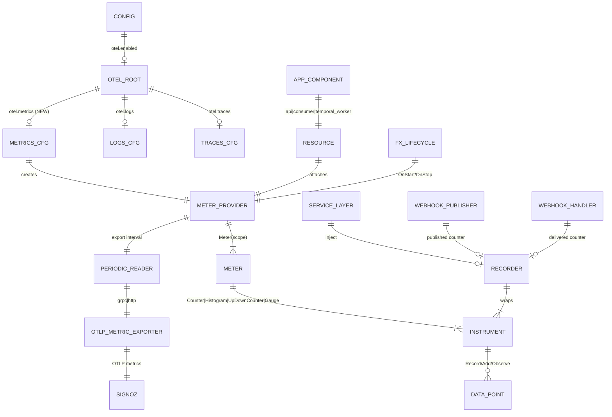
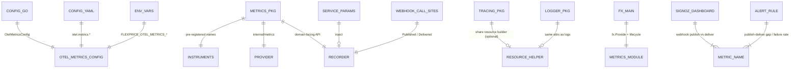

# OTEL Custom Metrics → SigNoz — ERD & Starter Catalog

**Status:** Design / ERD (no implementation in this PR)  
**Goal:** Extend the existing OTLP → SigNoz pipeline (traces + logs) with **custom metrics**, and define an instrumentation surface so call sites can add metrics without touching exporters.

**Starter use case:** outbound **webhook** pipeline only (publish → Kafka → deliver via Svix/native). Broader catalogs are deferred until real alert needs show up.

---

## 1. Current state

| Signal  | Status | Package / wiring |
| ------- | ------ | ---------------- |
| Traces  | Live   | `internal/tracing` → OTLP (`otel.traces.*`) |
| Logs    | Live   | `internal/logger` + otelzap → OTLP (`otel.logs.*`) |
| Metrics | **Missing** | `go.opentelemetry.io/otel/metric` is only an **indirect** dep; `OtelConfig` has no `metrics` block |

Shared resource attributes already used for traces/logs (reuse for metrics):

- `service.name` (`FLEXPRICE_OTEL_SERVICE_NAME` / deployment mode)
- `app.component` (`api` | `consumer` | `temporal_worker`)
- `deployment.environment`, `cloud.region`, `service.version`

SigNoz Cloud ingest (same as traces/logs today):

```text
ingest.in2.signoz.cloud:443  +  signoz-ingestion-key
```

**Also already in SigNoz:** AWS CloudWatch metrics (including Kafka). Do **not** re-instrument infra lag/throughput that CloudWatch already covers.

---

## 2. Design principles

1. **Separate metrics config** — `otel.metrics.*` so metrics can be enabled/disabled independently of traces and logs (same endpoint/auth resolution pattern).
2. **One MeterProvider per process** — init once in Fx lifecycle; shut down on stop (flush pending export).
3. **Dedicated `internal/metrics` package** — services never import OTLP exporters or call raw `otel.Meter` at call sites; they use a thin injected `Recorder`.
4. **Inject `Recorder` into services** — prefer Fx / `ServiceParams` injection for testability (`Noop` when disabled).
5. **Selective, need-driven metrics** — only instrument pipelines where we today rely on Postgres polling / ad-hoc queries for SLIs (starting with webhooks). Do not blanket-metric every Kafka publish or consumer.
6. **Traces for activity, metrics for rates/gaps** — consumer handlers and Temporal workflows/activities should **start spans** at entry; that is enough to observe those activities. Do not add parallel “job started / jobs running” metrics.
7. **Cardinality budget** — low-cardinality labels only; never `customer_id` / `invoice_id` / raw event IDs on metrics.
8. **Fail open** — if metrics are disabled or export fails, business paths must not error.

---

## 3. Entity-relationship diagram (setup)

### 3.1 Runtime / export topology



### 3.2 Code / package relationships



### 3.3 Who emits the starter metrics

| `app.component` | Webhook role |
| --------------- | ------------ |
| `api` (and any producer of system events) | `flexprice.webhook.published` when enqueueing to the system-events / webhook Kafka topic |
| `consumer` (webhook delivery handler) | `flexprice.webhook.delivered` when Svix/native send succeeds (and failure outcome on the same counter) |

Same MeterProvider + SigNoz endpoint; `app.component` separates series.

---

## 4. Proposed config surface (mirrors traces/logs)

```yaml
otel:
  enabled: true
  protocol: "grpc"
  insecure: false
  # ... existing traces / logs ...

  metrics:                                    # NEW
    enabled: false
    endpoint: ""                              # e.g. ingest.in2.signoz.cloud:443
    protocol: ""                              # empty = inherit otel.protocol
    auth_header: "signoz-ingestion-key"
    auth_value: ""
    headers: {}
    export_interval: 60s                      # PeriodicReader interval
    # optional later: temporality (cumulative default for SigNoz/Prometheus)
```

Env vars (same pattern as traces/logs):

| Env | Maps to |
| --- | ------- |
| `FLEXPRICE_OTEL_METRICS_ENABLED` | `otel.metrics.enabled` |
| `FLEXPRICE_OTEL_METRICS_ENDPOINT` | `otel.metrics.endpoint` |
| `FLEXPRICE_OTEL_METRICS_PROTOCOL` | `otel.metrics.protocol` |
| `FLEXPRICE_OTEL_METRICS_AUTH_HEADER` | `otel.metrics.auth_header` |
| `FLEXPRICE_OTEL_METRICS_AUTH_VALUE` | `otel.metrics.auth_value` |
| `FLEXPRICE_OTEL_METRICS_EXPORT_INTERVAL` | `otel.metrics.export_interval` |

Reuse top-level `otel.enabled`, `otel.insecure`, `otel.headers`, `ResolveProtocol` / `ResolveHeaders` / `ResolveServiceName`.

**Go modules to add (direct):**

- `go.opentelemetry.io/otel/exporters/otlp/otlpmetric/otlpmetricgrpc`
- `go.opentelemetry.io/otel/exporters/otlp/otlpmetric/otlpmetrichttp`
- `go.opentelemetry.io/otel/sdk/metric`
- (promote) `go.opentelemetry.io/otel/metric`

---

## 5. Easy-in-code instrumentation API

### 5.1 Package layout

```text
internal/metrics/
  module.go          # Fx Module + lifecycle (init MeterProvider, set global)
  provider.go        # build exporter + resource + PeriodicReader
  recorder.go        # Recorder interface + noop + otel impl
  instruments.go     # well-known metric names + attribute keys
  webhook.go         # WebhookPublished / WebhookDelivered helpers
```

Keep the package small. Add new helper files only when a **new** product pipeline needs metrics (not preemptively for Kafka/Temporal/CH).

### 5.2 Call-site pattern (preferred)

```go
// Inject once via Fx / ServiceParams
type webhookPublisher struct {
    metrics metrics.Recorder
    // ...
}

func (p *webhookPublisher) Publish(ctx context.Context, event *types.WebhookEvent) error {
    err := p.publisher.Publish(ctx, msg)
    p.metrics.WebhookPublished(ctx, metrics.WebhookAttrs{
        EventName: event.EventName, // bounded enum / known webhook types only
        Outcome:   metrics.OutcomeFrom(err),
        Transport: "kafka",         // or "memory" in tests
    })
    return err
}
```

Delivery side (Svix / native handler):

```go
p.metrics.WebhookDelivered(ctx, metrics.WebhookAttrs{
    EventName: event.EventName,
    Outcome:   metrics.OutcomeFrom(err), // ok | error
    Provider:  "svix",                   // or "native"
})
```

Minimal `Recorder` for Phase 1:

```go
type Recorder interface {
    WebhookPublished(ctx context.Context, a WebhookAttrs)
    WebhookDelivered(ctx context.Context, a WebhookAttrs)
}

func Noop() Recorder // always safe when metrics disabled
```

Grow the interface only when a new use case is approved — do not pre-add Kafka lag / Temporal / ClickHouse methods.

### 5.3 Why not raw `otel.Meter` at every call site?

| Raw Meter everywhere | Thin `Recorder` |
| -------------------- | --------------- |
| Inconsistent names | Single catalog in `instruments.go` |
| Easy to explode cardinality | Attributes via typed structs |
| Hard to unit-test | Swap `Noop` / in-memory fake |
| Exporter details leak | Services stay exporter-agnostic |

### 5.4 Init sketch (Fx)

```text
OnStart:
  if !otel.enabled || !otel.metrics.enabled || endpoint == "":
      register Noop Recorder; return
  build Resource (same attrs as tracing.newResource)
  create OTLP metric exporter (grpc|http, headers, insecure)
  MeterProvider = sdkmetric.NewMeterProvider(
      WithResource,
      WithReader(PeriodicReader(exporter, interval)),
  )
  otel.SetMeterProvider(MeterProvider)
  Recorder = NewOTelRecorder(MeterProvider.Meter("github.com/flexprice/flexprice"))

OnStop:
  MeterProvider.Shutdown(ctx)  // flush
```

Share resource construction with `internal/tracing` (extract `internal/otelresource` or a package-level helper) so metrics/traces/logs stay aligned in SigNoz filters.

---

## 6. What NOT to push as custom metrics

### 6.1 Covered by traces / logs (use spans, not metrics)

| Signal | Prefer |
| ------ | ------ |
| HTTP RPS, latency, status | otelgin / HTTP server spans |
| Handler / service errors | exception span events + status |
| Postgres / ClickHouse / Redis **per-query** latency | storage spans (when enabled) |
| Outbound HTTP client latency | otelhttp client spans |
| **Consumer handler start / work** | start a **trace/span** at handler entry |
| **Temporal workflow / activity start / execution** | start a **trace/span** at workflow/activity entry — no “jobs running” counters |

**Side note (explicit):** wherever we need visibility into “this consumer handler ran” or “this Temporal job started,” instrument with **traces**, not metrics or extra logs. Spans already give timing, errors, and correlation in SigNoz. Metrics are reserved for aggregate rates and publish→deliver gaps that spans do not answer cheaply.

### 6.2 Covered by AWS CloudWatch → SigNoz (do not duplicate)

| Signal | Why skip |
| ------ | -------- |
| Kafka consumer lag, broker throughput, partition counts | Already ingested from CloudWatch |
| Other AWS infra gauges already in SigNoz | Prefer CloudWatch series |

### 6.3 Explicitly out of scope for now (do not add in Phase 1)

| Rejected earlier idea | Reason |
| --------------------- | ------ |
| Kafka lag / DLQ / retry / processed counters (generic) | Infra lag via CloudWatch; handler visibility via traces |
| Event / meter-usage / feature-usage / costsheet Kafka publish metrics | High volume; not the alerting pain; keep Kafka publish metrics **selective** |
| ClickHouse insert rows / duration / bytes | Not needed; query spans if debugging |
| Temporal workflow/activity counts or durations as metrics | Use traces at Temporal entrypoints |
| Invoice compute / lifecycle metrics | Defer until a concrete alert need |
| Wallet alert / auto-topup / debit metrics | Defer |
| Cache hit ratio / DB pool gauges | Defer |
| Periodic `webhook.pending` gauge from Postgres | Prefer publish vs deliver **counter gap** first; revisit if gap alerts are insufficient |

---

## 7. Starter metrics: webhook publish → deliver

### 7.1 Why this first

Today, webhook pipeline health is often inferred by **querying the `system_events` Postgres table** (pending / stale undelivered rows). That works but is slow for alerting and does not give a clean publish vs deliver rate in SigNoz.

We want:

1. A counter when a webhook **system event is published** onto the webhook/Kafka path (`internal/webhook/publisher`).
2. A counter when that webhook is **successfully delivered** (or fails) via Svix or native HTTP (`internal/webhook/handler`).
3. Same low-cardinality dimensions on both sides so SigNoz can compare rates and approximate **pipeline lag / stuck volume** (published − delivered over a window), without scraping Postgres on every alert evaluation.

**Selective Kafka publish tracking:** only the webhook publisher path — **not** usage-event / meter-usage Kafka publishes.

### 7.2 Metrics

| Metric | Type | Unit | Labels (low-card) | Emit where |
| ------ | ---- | ---- | ----------------- | ---------- |
| `flexprice.webhook.published` | Counter | events | `event_name` (bounded), `outcome` (`ok`\|`error`), `transport` (`kafka`\|`memory`) | Webhook publisher after enqueue attempt |
| `flexprice.webhook.delivered` | Counter | events | `event_name`, `outcome` (`ok`\|`error`), `provider` (`svix`\|`native`) | Delivery handler after Svix/native attempt |

Optional later (not required for first cut):

- `reason` on deliver failures (bounded enum: `svix_app_missing`, `http_4xx`, …) — only if alert routing needs it.
- Histogram of publish→deliver latency **if** we can pass a publish timestamp through the message without high cardinality (derive from `system_events.created_at` in the consumer span/metric record once).

### 7.3 Correlation model (for lag / stuck alerts)

```text
Producer (API / service)
  → persist system_events (existing)
  → Kafka publish
  → metrics: webhook.published{outcome=ok}

Consumer (webhook handler)
  → build payload
  → Svix / native HTTP
  → metrics: webhook.delivered{outcome=ok|error}
  → OnDelivered / failure persistence (existing)
```

**Alert ideas (SigNoz):**

- `rate(published{outcome=ok}) - rate(delivered{outcome=ok})` sustained positive → backlog growing.
- `rate(delivered{outcome=error}) / rate(delivered)` above threshold → delivery breakage.
- Still keep Postgres stale-pending checks as a safety net until metric alerts prove reliable.

Traces remain useful on the same path (publish span + deliver span linked by `system_event` id in **span attributes**, not metric labels).

### 7.4 Hook points in code (implementation hint only)

| Step | Likely file | Action |
| ---- | ----------- | ------ |
| Publish | `internal/webhook/publisher/publisher.go` | `WebhookPublished` after publish success/failure |
| Deliver | `internal/webhook/handler/handler.go` (`deliverSvix` / native) | `WebhookDelivered` after send attempt |

No metrics on generic event/meter Kafka producers.

---

## 8. Cardinality & tenancy rules

**Allowed by default for webhook metrics:** `event_name` (known webhook type enum), `outcome`, `transport`, `provider`, plus resource attrs (`service.name`, `app.component`, env).

**Use sparingly:** `tenant_id` — default **off** for Phase 1; add only if per-tenant webhook alerts are required and tenant count is bounded.

**Never on metrics:** `customer_id`, `subscription_id`, `invoice_id`, `system_event_id`, `message_uuid`, free-text errors, URLs.

---

## 9. SigNoz usage (after export works)

1. Confirm `flexprice.webhook.published` / `flexprice.webhook.delivered` under Metrics.
2. Dashboard: publish rate, deliver success rate, deliver error rate, publish−deliver gap.
3. Alerts: sustained gap; elevated deliver error ratio.
4. Use traces on the webhook consumer for per-message debugging; use metrics for pipeline SLIs.

---

## 10. Implementation phases

### Phase 0 — Platform (follow-up implementation PR; not this doc PR)

1. Add `OtelMetricsConfig` + env bindings + `config.yaml` comments.
2. Add `internal/metrics` MeterProvider + Fx module + Noop `Recorder`.
3. Wire module in `cmd/server/main.go` next to tracing.
4. Inject `Recorder` where webhook publisher/handler are constructed.

### Phase 1 — Webhook SLI only

1. `WebhookPublished` on webhook Kafka (selective) publish path.
2. `WebhookDelivered` on Svix/native success/failure.
3. SigNoz panels + alert drafts for publish−deliver gap.
4. Validate against existing `system_events` pending queries; then decide whether Postgres alerts can be reduced.

### Phase 2+ — Only when a concrete need appears

Add new `Recorder` methods per approved use case. Do **not** pre-build Kafka/Temporal/ClickHouse/wallet catalogs.

---

## 11. Testing strategy

| Layer | Approach |
| ----- | -------- |
| Unit | `Recorder` fake: assert `WebhookPublished` / `WebhookDelivered` attrs |
| Config | Contract test: env → `OtelMetricsConfig` |
| Integration | Optional smoke counter or webhook path against SigNoz staging |
| Safety | Metrics disabled → Noop; exporter errors → OTel error handler log only |

---

## 12. Open decisions (resolve in implementation PR)

1. **Share vs split resource builder** with tracing — recommend extract shared helper.
2. **`event_name` label set** — use existing webhook event name enum; reject free-form strings.
3. **Delta vs cumulative temporality** — default cumulative unless SigNoz account docs say otherwise.
4. **`tenant_id` on webhook metrics** — default **no** for Phase 1.
5. **Whether deliver failures increment the same counter with `outcome=error` or a separate counter** — prefer one counter + `outcome` label.

---

## 13. Success criteria

- Enabling `FLEXPRICE_OTEL_METRICS_*` alone starts exporting to the same SigNoz project as traces/logs.
- Adding a metric is a **typed Recorder helper + inject + one call site**, not exporter boilerplate.
- Phase 1 answers: “How many webhook events are we publishing?” and “How many are we successfully delivering?” and supports a publish−deliver gap alert — without Postgres polling as the primary signal.
- No Kafka lag, Temporal job counts, ClickHouse insert, or usage-event publish metrics in the first implementation.
- Consumer/Temporal activity visibility continues to rely on **traces**, not new metrics.
- API/consumer/worker remain correct when metrics are off.
