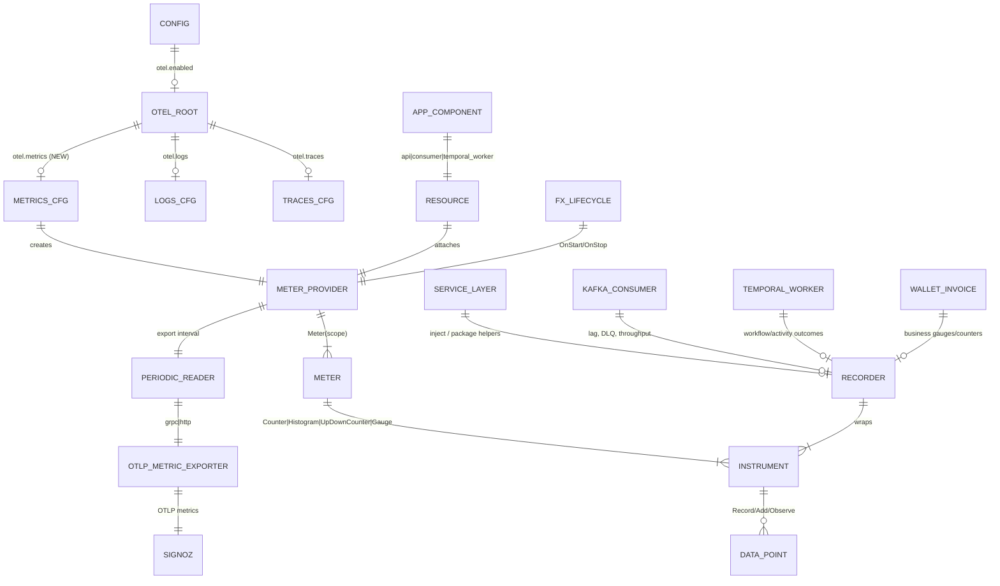
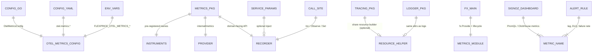

# OTEL Custom Metrics → SigNoz — ERD & Starter Catalog

**Status:** Design / ERD (no implementation in this PR)  
**Goal:** Extend the existing OTLP → SigNoz pipeline (traces + logs) with **custom metrics**, and define an instrumentation surface so call sites can add metrics without touching exporters.

---

## 1. Current state

| Signal  | Status | Package / wiring |
| ------- | ------ | ---------------- |
| Traces  | Live   | `internal/tracing` → OTLP (`otel.traces.*`) |
| Logs    | Live   | `internal/logger` + otelzap → OTLP (`otel.logs.*`) |
| Metrics | **Missing** | `go.opentelemetry.io/otel/metric` is only an **indirect** dep; `OtelConfig` has no `metrics` block |

Shared resource attributes already used for traces/logs (reuse for metrics):

- `service.name` (`FLEXPRICE_OTEL_SERVICE_NAME` / deployment mode)
- `app.component` (`api` | `consumer` | `temporal_worker`)
- `deployment.environment`, `cloud.region`, `service.version`

SigNoz Cloud ingest (same as traces/logs today):

```text
ingest.in2.signoz.cloud:443  +  signoz-ingestion-key
```

---

## 2. Design principles

1. **Mirror traces/logs config** — `otel.metrics.*` with the same endpoint / protocol / auth / headers resolution as traces and logs.
2. **One MeterProvider per process** — init once in Fx lifecycle; shut down on stop (flush pending export).
3. **Thin domain API** — services never import OTLP exporters; they call `internal/metrics` helpers (or inject a small `Recorder` interface).
4. **Metrics ≠ re-aggregated traces** — only emit what spans/logs cannot answer cheaply (gauges, lag, backlog, business counters, pool saturation).
5. **Cardinality budget** — prefer low-cardinality labels (`tenant_id` only when essential and bounded; never `customer_id` / `invoice_id` / raw event IDs on metrics).
6. **Fail open** — if metrics are disabled or export fails, business paths must not error.

---

## 3. Entity-relationship diagram (setup)

### 3.1 Runtime / export topology



### 3.2 Code / package relationships (how we add metrics easily)



### 3.3 Signal ownership by deployment mode

| `app.component`     | Owns primarily |
| ------------------- | -------------- |
| `api`               | Ingest accept/reject, cache hit ratio, pool wait, payment/webhook outbound |
| `consumer`          | Kafka lag, DLQ, processing lag, ClickHouse batch flush, feature/meter usage throughput |
| `temporal_worker`   | Workflow/activity start/complete/fail, queue wait, invoice compute duration |

All three share the same MeterProvider + SigNoz endpoint; resource attribute `app.component` separates series.

---

## 4. Proposed config surface (mirrors traces/logs)

```yaml
otel:
  enabled: true
  protocol: "grpc"
  insecure: false
  # ... existing traces / logs ...

  metrics:                                    # NEW
    enabled: false
    endpoint: ""                              # e.g. ingest.in2.signoz.cloud:443
    protocol: ""                              # empty = inherit otel.protocol
    auth_header: "signoz-ingestion-key"
    auth_value: ""
    headers: {}
    export_interval: 60s                      # PeriodicReader interval
    # optional later: temporality (cumulative default for SigNoz/Prometheus)
```

Env vars (same pattern as traces/logs):

| Env | Maps to |
| --- | ------- |
| `FLEXPRICE_OTEL_METRICS_ENABLED` | `otel.metrics.enabled` |
| `FLEXPRICE_OTEL_METRICS_ENDPOINT` | `otel.metrics.endpoint` |
| `FLEXPRICE_OTEL_METRICS_PROTOCOL` | `otel.metrics.protocol` |
| `FLEXPRICE_OTEL_METRICS_AUTH_HEADER` | `otel.metrics.auth_header` |
| `FLEXPRICE_OTEL_METRICS_AUTH_VALUE` | `otel.metrics.auth_value` |
| `FLEXPRICE_OTEL_METRICS_EXPORT_INTERVAL` | `otel.metrics.export_interval` |

Reuse top-level `otel.enabled`, `otel.insecure`, `otel.headers`, `ResolveProtocol` / `ResolveHeaders` / `ResolveServiceName`.

**Go modules to add (direct):**

- `go.opentelemetry.io/otel/exporters/otlp/otlpmetric/otlpmetricgrpc`
- `go.opentelemetry.io/otel/exporters/otlp/otlpmetric/otlpmetrichttp`
- `go.opentelemetry.io/otel/sdk/metric`
- (promote) `go.opentelemetry.io/otel/metric`

---

## 5. Easy-in-code instrumentation API

### 5.1 Package layout

```text
internal/metrics/
  module.go          # Fx Module + lifecycle (init MeterProvider, set global)
  provider.go        # build exporter + resource + PeriodicReader
  recorder.go        # Recorder interface + noop + otel impl
  instruments.go     # well-known metric names + attribute keys
  kafka.go           # helpers: RecordLag, RecordDLQ, ...
  billing.go         # helpers: InvoiceComputed, WalletAlertTransition, ...
```

### 5.2 Call-site pattern (preferred)

```go
// Inject once via Fx / ServiceParams
type EventConsumptionService struct {
    metrics metrics.Recorder
    // ...
}

func (s *EventConsumptionService) handle(ctx context.Context, batch []*events.Event) error {
    start := time.Now()
    err := s.persist(ctx, batch)
    s.metrics.EventBatchProcessed(ctx, metrics.EventBatchAttrs{
        Topic:   topic,
        Outcome: metrics.OutcomeFrom(err),
        Size:    len(batch),
    }, time.Since(start))
    return err
}
```

Helpers hide instrument names and enforce allowed attributes:

```go
type Recorder interface {
    EventBatchProcessed(ctx context.Context, a EventBatchAttrs, d time.Duration)
    KafkaConsumerLag(ctx context.Context, a KafkaLagAttrs, lag int64)
    KafkaDLQPublished(ctx context.Context, a KafkaDLQAttrs)
    InvoiceLifecycle(ctx context.Context, a InvoiceAttrs)          // counter
    WalletAlertTransition(ctx context.Context, a WalletAlertAttrs) // counter
    CacheResult(ctx context.Context, a CacheAttrs)                 // hit|miss
    // ...
}

func Noop() Recorder // always safe when metrics disabled
```

### 5.3 Why not raw `otel.Meter` at every call site?

| Raw Meter everywhere | Thin `Recorder` |
| -------------------- | --------------- |
| Inconsistent names (`events_processed` vs `event.processed`) | Single catalog in `instruments.go` |
| Easy to explode cardinality | Attributes validated / typed structs |
| Hard to unit-test | Swap `Noop` / in-memory fake |
| Exporter details leak | Services stay exporter-agnostic |

Optional escape hatch: `Recorder.Meter()` for one-off experiments, then graduate into named helpers.

### 5.4 Init sketch (Fx)

```text
OnStart:
  if !otel.enabled || !otel.metrics.enabled || endpoint == "":
      register Noop Recorder; return
  build Resource (same attrs as tracing.newResource)
  create OTLP metric exporter (grpc|http, headers, insecure)
  MeterProvider = sdkmetric.NewMeterProvider(
      WithResource,
      WithReader(PeriodicReader(exporter, interval)),
  )
  otel.SetMeterProvider(MeterProvider)
  Recorder = NewOTelRecorder(MeterProvider.Meter("github.com/flexprice/flexprice"))

OnStop:
  MeterProvider.Shutdown(ctx)  // flush
```

Share resource construction with `internal/tracing` (extract `internal/otelresource` or a package-level helper) so metrics/traces/logs stay aligned in SigNoz filters.

---

## 6. What NOT to push as custom metrics

Already (or better) available from **API traces / spans / logs** — do not duplicate as first-class custom metrics:

| Signal from traces/logs | Why skip as custom metric |
| ----------------------- | ------------------------- |
| HTTP RPS, latency, status | otelgin / HTTP server spans |
| Handler / service error rate | exception span events + status |
| Postgres / ClickHouse / Redis **per-query** latency | storage spans (when enabled) |
| Outbound HTTP client latency | otelhttp client spans |
| Individual request failure reasons | logs + span attributes |
| Exact stack traces | exceptions / logs |

**Rule of thumb:** if a PromQL-style question needs a **gauge**, **queue depth**, **lag**, **batch size**, **hit ratio**, or **business state transition rate**, it belongs in metrics. If it is “how slow/erroring was this request path?”, use traces.

---

## 7. Starter metrics catalog (Phase 1)

Focus on FlexPrice’s OLAP/OLTP split: Kafka → ClickHouse metering, Temporal billing, wallets/webhooks. Names use `flexprice.*` prefix for easy SigNoz discovery.

### 7.1 Pipeline / Kafka (consumer) — highest priority

| Metric | Type | Unit | Labels (low-card) | Why traces are not enough |
| ------ | ---- | ---- | ----------------- | ------------------------- |
| `flexprice.kafka.consumer.lag` | Gauge / async UpDown | messages | `topic`, `consumer_group`, `partition` (optional) | Lag is **state between polls**, not a request span attribute |
| `flexprice.kafka.messages.processed` | Counter | messages | `topic`, `handler`, `outcome` | Throughput + failure mix over time without sampling bias |
| `flexprice.kafka.messages.retries` | Counter | retries | `topic`, `handler` | Retry loops are invisible as “success” spans |
| `flexprice.kafka.dlq.published` | Counter | messages | `topic`, `handler` | Poison/DLQ is rare; needs a dedicated counter for alerts |
| `flexprice.events.ingest_to_ch.lag_ms` | Histogram | ms | `pipeline` (`events`\|`feature_usage`\|`meter_usage`\|`costsheet`) | **Business lag**: `now - event.timestamp` or `ingested_at - timestamp`; not HTTP duration |
| `flexprice.events.batch.size` | Histogram | events | `pipeline` | Batching efficiency; spans usually record one batch op without distribution over time |
| `flexprice.events.rejected` | Counter | events | `reason` (`validation`\|`auth`\|`throttle`\|…) | Accept path may 200 on enqueue; rejects need aggregate rates |

Existing hook point: `StartKafkaLagMonitoringSpan` in tracing — **replace or dual-write** lag as a real gauge rather than only a monitoring span.

### 7.2 ClickHouse write path

| Metric | Type | Labels | Why |
| ------ | ---- | ------ | --- |
| `flexprice.clickhouse.insert.rows` | Counter | `table`, `outcome` | Volume + failure rate independent of span sampling |
| `flexprice.clickhouse.insert.duration_ms` | Histogram | `table` | Insert batch duration distribution for capacity |
| `flexprice.clickhouse.insert.bytes` | Histogram (optional) | `table` | Payload size pressure |

### 7.3 Temporal / invoice generation (worker)

| Metric | Type | Labels | Why |
| ------ | ---- | ------ | --- |
| `flexprice.temporal.workflow.started` | Counter | `workflow_type` | Volume by workflow type |
| `flexprice.temporal.workflow.completed` | Counter | `workflow_type`, `outcome` | Success/fail/cancel rates |
| `flexprice.temporal.activity.duration_ms` | Histogram | `activity_type`, `outcome` | Activity cost beyond parent workflow span sampling |
| `flexprice.invoice.compute.duration_ms` | Histogram | `flow_type`, `outcome` | Core billing CPU; alert on p95 growth |
| `flexprice.invoice.lifecycle` | Counter | `from_status`, `to_status` (bounded enum) | State-machine throughput (draft→finalized, etc.) |

### 7.4 Wallets / credits (business SLIs)

| Metric | Type | Labels | Why |
| ------ | ---- | ------ | --- |
| `flexprice.wallet.alert.transition` | Counter | `alert_type`, `to_state` (`ok`\|`in_alarm`) | Alert churn; not visible as HTTP metrics |
| `flexprice.wallet.auto_topup.triggered` | Counter | `outcome` | Side-effect rate for prepaid reliability |
| `flexprice.wallet.debit.outcome` | Counter | `outcome` (`ok`\|`insufficient`\|`error`) | Soft-fail business outcomes that may still be 2xx |

Avoid gauges of **absolute wallet balance** per wallet (cardinality + PII/business sensitivity). Use alerts already in product; metrics only for **rates of transitions**.

### 7.5 Webhooks / integrations

| Metric | Type | Labels | Why |
| ------ | ---- | ------ | --- |
| `flexprice.webhook.delivery` | Counter | `direction` (`outbound`\|`inbound`), `provider`, `outcome` | Delivery SLI across async retries |
| `flexprice.webhook.pending` | Gauge (periodic) | `state` (`pending`\|`stale`) | Backlog of undelivered system events — classic gauge |
| `flexprice.payment.provider` | Counter | `provider`, `operation`, `outcome` | Stripe/etc. success mix without scraping every span |

### 7.6 Runtime saturation (all modes)

| Metric | Type | Labels | Why |
| ------ | ---- | ------ | --- |
| `flexprice.cache.ops` | Counter | `cache` (`memory`\|`redis`), `result` (`hit`\|`miss`\|`error`) | Hit ratio needs counters; spans are awkward for ratios |
| `flexprice.db.pool.in_use` | Gauge | `db` (`postgres`\|`clickhouse`\|`redis`) | Pool exhaustion is process state |
| `flexprice.db.pool.wait_ms` | Histogram | `db` | Wait for connection — often missing from business spans |
| `process.*` / Go runtime | (optional Phase 2) | — | Prefer OTel host/runtime instrumentation later; not custom |

---

## 8. Cardinality & tenancy rules

**Allowed by default:** `app.component`, `topic`, `handler`, `pipeline`, `workflow_type`, `activity_type`, `outcome`, `provider`, `table`, `cache`, `db`, bounded enums (`flow_type`, `alert_type`).

**Use sparingly:** `tenant_id` — only on business metrics where you already alert per tenant **and** tenant count is known-bounded; prefer recording tenant in traces/logs and keep metrics global or by `environment_id` only if needed.

**Never on metrics:** `customer_id`, `subscription_id`, `invoice_id`, `event_id`, `wallet_id`, free-text `error_message`, high-cardinality URLs.

---

## 9. SigNoz usage (after export works)

1. Confirm series under Metrics → filter `service.name` / `flexprice.*`.
2. Dashboards (suggested panels):
   - Kafka lag by topic/group
   - Event pipeline lag p50/p95 (`ingest_to_ch.lag_ms`)
   - DLQ rate
   - Invoice compute p95 + workflow failure rate
   - Webhook pending gauge + delivery failure rate
   - Cache hit ratio = `hit / (hit+miss)`
3. Alerts (starter):
   - `kafka.consumer.lag` > threshold for N minutes
   - `kafka.dlq.published` rate > 0 sustained
   - `events.ingest_to_ch.lag_ms` p95 regression
   - `webhook.pending{state="stale"}` growth
   - `temporal.workflow.completed{outcome="failed"}` rate spike

---

## 10. Implementation phases

### Phase 0 — Platform (this ERD → next PR)

1. Add `OtelMetricsConfig` + env bindings + `config.yaml` comments.
2. Add `internal/metrics` MeterProvider + Fx module + Noop Recorder.
3. Wire module in `cmd/server/main.go` next to tracing.
4. Smoke: one `flexprice.metrics.export_up` counter = 1 to prove SigNoz ingest.

### Phase 1 — Pipeline SLIs (highest ROI)

1. Kafka lag gauge (replace span-only monitoring).
2. Processed / retry / DLQ counters on Watermill router hooks.
3. Event → ClickHouse lag histogram + batch size.
4. ClickHouse insert counters/histograms at repository boundary.

### Phase 2 — Billing & money path

1. Temporal workflow/activity counters + invoice compute histogram.
2. Wallet alert / auto-topup counters.
3. Webhook pending gauge + delivery counter.
4. Payment provider outcome counter.

### Phase 3 — Saturation & polish

1. Cache hit/miss, DB pool gauges.
2. Shared `otelresource` helper.
3. SigNoz dashboard JSON / alert as-code (optional).
4. Docs in `ARCHITECTURE.md` observability row.

---

## 11. Testing strategy

| Layer | Approach |
| ----- | -------- |
| Unit | `Recorder` fake: assert Inc/Observe called with attrs |
| Config | Contract test: env → `OtelMetricsConfig` (like existing otel traces/logs tests) |
| Integration | Optional: OTLP collector mock or SigNoz staging with `export_up` |
| Safety | Metrics disabled → Noop; exporter errors → OTel error handler log only |

---

## 12. Open decisions (resolve in implementation PR)

1. **Share vs split MeterProvider resource builder** with tracing — recommend extract shared helper.
2. **Inject `Recorder` into `ServiceParams` vs package-level** — prefer inject for testability; package helpers OK for middleware/router.
3. **Kafka lag collection** — in-process gauge from consumer metadata vs external exporter; prefer in-process first (we already have lag monitoring span hooks).
4. **Delta vs cumulative temporality** — default cumulative (Prometheus/SigNoz-friendly) unless SigNoz docs for the account say otherwise.
5. **Whether `tenant_id` appears on any Phase 1 metric** — default **no**.

---

## 13. Success criteria

- Enabling `FLEXPRICE_OTEL_METRICS_*` alone starts exporting to the same SigNoz project as traces/logs.
- Adding a new business metric is a **typed helper + one call site**, not exporter boilerplate.
- Phase 1 metrics answer: “Is the metering pipeline falling behind?” and “Are we losing messages to DLQ?” without digging through sampled traces.
- No high-cardinality labels in the starter set.
- API/consumer/worker remain correct when metrics are off.
