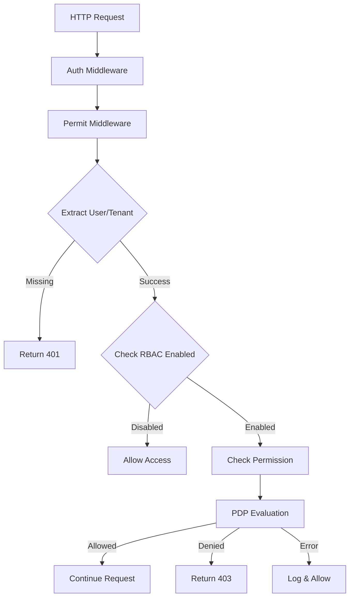

# PRD: Permit.io Middleware Integration for FlexPrice

## Executive Summary

This PRD outlines the implementation of Permit.io RBAC (Role-Based Access Control) middleware in FlexPrice, providing fine-grained authorization and permission management across the platform. The integration uses Permit.io's cloud service with a local Policy Decision Point (PDP) for high-performance permission checking.

## Problem Statement

FlexPrice requires a scalable, multi-tenant authorization system that can:
- Control access to API endpoints based on user roles and permissions
- Support tenant-specific RBAC configurations
- Provide attribute-based access control (ABAC) capabilities
- Maintain high performance with minimal latency
- Allow granular permission management without code changes

## Solution Overview

### Architecture Components

1. **Permit.io Cloud Service**: Centralized policy management and configuration
2. **Local PDP (Policy Decision Point)**: High-performance local decision engine
3. **Permit Middleware**: Gin middleware for request-level authorization
4. **Permit Service**: Business logic layer for Permit.io operations
5. **Tenant RBAC Configuration**: Per-tenant RBAC enablement

### Technical Stack

- **Permit.io SDK**: `github.com/permitio/permit-golang`
- **PDP Container**: `permitio/pdp-v2:latest` on port 7766
- **Middleware Framework**: Gin HTTP middleware
- **Configuration**: YAML-based with environment overrides

## Implementation Details

### 1. PDP (Policy Decision Point) Setup

The PDP runs as a Docker container providing local policy evaluation:

```yaml
# docker-compose.yml
flexprice-pdp:
  image: permitio/pdp-v2:latest
  ports:
    - "7766:7766"
  environment:
    - PDP_API_KEY=permit_key_[REDACTED]
    - PDP_DEBUG=True
```

**Key Features:**
- Local policy caching for sub-millisecond response times
- Automatic policy synchronization with Permit.io cloud
- Debug mode for development and troubleshooting

### 2. Permit Service Layer

**Location**: `internal/service/permit.go`

**Core Capabilities:**
- User management and synchronization
- Role assignment and management
- Permission checking with attributes
- Resource management
- Tenant and environment management
- RBAC status checking

**Key Methods:**
```go
// Permission Checking
CheckPermission(ctx, userID, action, resource, tenantID) (bool, error)
CheckPermissionWithAttributes(ctx, userID, action, resource, attributes) (bool, error)

// User Management
SyncUser(ctx, userID, email, tenantID) error
AssignRole(ctx, userID, roleKey, tenantID) error

// RBAC Control
IsTenantRBACEnabled(ctx, tenantID) (bool, error)
```

### 3. Middleware Implementation

**Location**: `internal/rest/middleware/permit.go`

**Two Middleware Types:**

#### Basic Permission Middleware
```go
RequirePermission(action, resource string) gin.HandlerFunc
```
- Checks basic action/resource permissions
- Validates user and tenant context
- Respects tenant RBAC enablement

#### Attribute-Based Middleware
```go
RequirePermissionWithAttributes(action, resource string, attributeExtractor func(*gin.Context) map[string]interface{}) gin.HandlerFunc
```
- Supports complex attribute-based decisions
- Dynamic attribute extraction from request context
- Enhanced policy evaluation capabilities

### 4. Authorization Flow



### 5. Configuration Management

**Location**: `internal/config/permit.go`

```yaml
permit:
  api_key: "" # Set via FLEXPRICE_PERMIT_API_KEY
  api_url: "https://api.permit.io"
  project_id: "your-project-id"
  pdp_url: "http://localhost:7766"
```

## Use Cases

### 1. Endpoint Protection
**Scenario**: Protect API endpoints with role-based access
**Implementation**: Apply `RequirePermission("read", "customers")` middleware
**Outcome**: Only users with customer read permissions can access

### 2. Multi-Tenant Isolation
**Scenario**: Ensure users only access their tenant's resources
**Implementation**: Tenant context extraction + permission checking
**Outcome**: Automatic tenant-scoped authorization

### 3. Attribute-Based Access Control
**Scenario**: Allow access based on resource attributes (e.g., customer ownership)
**Implementation**: Use `RequirePermissionWithAttributes` with custom extractors
**Outcome**: Fine-grained access control based on resource properties

### 4. Graceful Degradation
**Scenario**: Handle Permit.io service unavailability
**Implementation**: Error handling allows access with logging
**Outcome**: System remains functional during authorization service outages

### 5. Selective RBAC Enablement
**Scenario**: Enable RBAC only for specific tenants
**Implementation**: `permit_rbac_enabled` metadata flag per tenant
**Outcome**: Gradual rollout and tenant-specific control

### 6. Dynamic Role Management
**Scenario**: Assign/remove roles without code deployment
**Implementation**: Permit.io dashboard or API calls
**Outcome**: Real-time permission updates

## Security Considerations

### 1. Fail-Safe Behavior
- **Permission Check Failures**: Allow access with warning logs
- **Service Unavailability**: Graceful degradation
- **Invalid Configuration**: Clear error messages

### 2. API Key Management
- Environment variable injection: `FLEXPRICE_PERMIT_API_KEY`
- No hardcoded secrets in configuration files
- Separate keys for different environments

### 3. Audit Logging
- All permission checks logged with context
- Failed authorization attempts tracked
- User and tenant information included

### 4. Performance Optimization
- Local PDP for sub-millisecond decisions
- Tenant RBAC status caching
- Minimal database queries per request

## Monitoring and Observability

### Key Metrics
- Permission check latency
- Authorization success/failure rates
- PDP availability and response times
- Tenant RBAC adoption rates

### Logging Structure
```json
{
  "level": "warn",
  "msg": "permission denied",
  "tenant_id": "tenant-123",
  "user_id": "user-456",
  "action": "delete",
  "resource": "customer",
  "allowed": false
}
```

## Deployment Considerations

### Development Environment
- PDP runs locally via Docker Compose
- Debug mode enabled for detailed logging
- Test API keys for development

### Production Environment
- High-availability PDP deployment
- Production API keys with proper rotation
- Monitoring and alerting setup
- Performance tuning for scale

## Future Enhancements

1. **Policy as Code**: Version-controlled policy definitions
2. **Advanced ABAC**: Complex attribute-based rules
3. **Audit Dashboard**: Real-time authorization monitoring
4. **Policy Testing**: Automated policy validation
5. **Multi-Environment Support**: Dev/staging/prod policy isolation

## Success Metrics

- **Security**: Zero unauthorized access incidents
- **Performance**: <5ms authorization latency p95
- **Adoption**: 90% of protected endpoints using middleware
- **Reliability**: 99.9% authorization service availability
- **Usability**: Self-service role management for tenant admins

## Conclusion

The Permit.io middleware integration provides FlexPrice with enterprise-grade authorization capabilities while maintaining simplicity and performance. The combination of cloud-based policy management and local decision-making ensures both flexibility and speed, making it suitable for multi-tenant SaaS applications requiring fine-grained access control.
