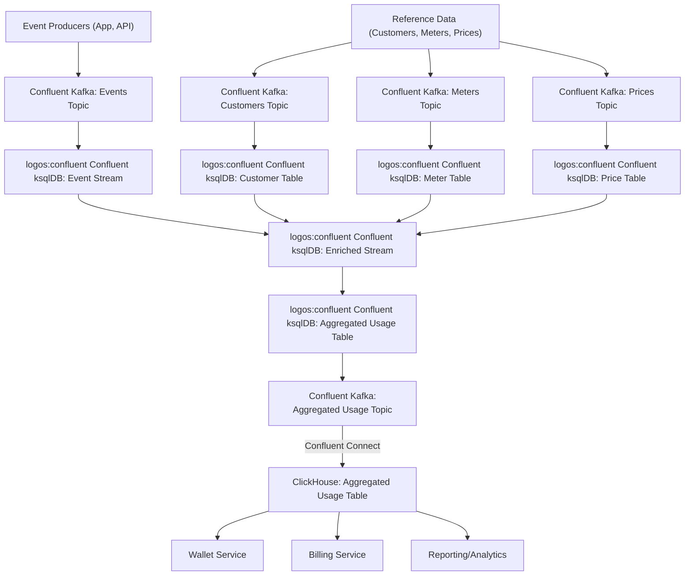

# Pre-Aggregation with ksqlDB: Evaluation and Design Considerations

## Overview

This document evaluates an alternative approach to event metering and usage aggregation in Flexprice: using Kafka for event streaming and ksqlDB for pre-aggregating events as they are ingested. The goal is to compare this stream-processing approach with the current/proposed post-processing pipeline (see `event_postprocessing.md`), considering scalability, correctness, latency, and operational complexity.

---

## 1. High-Level Architecture

**Current/Proposed Solution:**
- Events are ingested and stored raw (ClickHouse).
- Post-processing pipeline (Kafka + Go) enriches events with business context and computes costs.
- Pre-computed results are stored for fast querying (wallet, usage, billing).

**ksqlDB-Based Alternative:**
- Events are ingested from Kafka.
- ksqlDB creates streams and tables from Kafka topics.
- Persistent queries perform filtering, enrichment (where possible), and aggregation.
- Aggregated results are materialized as ksqlDB tables (backed by Kafka topics).
- Results are written to ClickHouse (via Kafka Connect or custom sink) for fast querying.
- Downstream systems query pre-aggregated data in ClickHouse.

---

## 2. Business Context Enrichment in ksqlDB

### Challenge
Events often lack full business context (e.g., customer ID, subscription, meter, price) at ingestion time. Enrichment is required for correct aggregation and billing.

### Solution
- **Reference Data as Kafka Topics:**
  - Mirror reference data (customers, subscriptions, meters, prices) into Kafka topics.
  - Define ksqlDB TABLEs over these topics.
- **Stream-Table Joins:**
  - Use ksqlDB's stream-table join to enrich events with business context.
  - Example: Join event stream with customer table on external_customer_id.
- **Edge Cases:**
  - If reference data is missing (e.g., customer not yet created), the join will result in a NULL; such events can be routed to a dead letter topic for later reprocessing.
  - Reference data staleness is minimized if Kafka topics are updated in near real-time.

---

## 3. Meter Matching & Aggregation Logic

### Meter Matching
- Meter definitions can be stored as a Kafka topic and modeled as a ksqlDB TABLE.
- Events can be joined with the meter table based on event name and filter properties (to the extent supported by ksqlDB's SQL).

### Aggregation Types
- **COUNT:** Use `COUNT(*)` in a GROUP BY query.
- **SUM:** Use `SUM(property)` in a GROUP BY query.
- **COUNT_UNIQUE:** Use `COUNT(DISTINCT property)` in a GROUP BY query (supported, but with limitations on windowing and cardinality).
- **AVG:** Use `AVG(property)` in a GROUP BY query.

### Windowing
- ksqlDB supports tumbling, hopping, and session windows for aggregations.
- Aggregations can be windowed (hourly, daily, etc.) or continuous.

---

## 4. Handling Complex Aggregations (e.g., COUNT_UNIQUE)

- **COUNT_UNIQUE**: Supported via `COUNT(DISTINCT ...)` but may not scale for very high cardinality; ksqlDB may impose limits.
- **Deduplication**: Can be handled if events have unique IDs.
- **Late Arriving Events**: ksqlDB supports window grace periods for late data, but after the window closes, late events are dropped.

---

## 5. Output & Storage

- Aggregated results are materialized as ksqlDB tables (backed by Kafka topics).
- Use Kafka Connect or a custom sink to write these results to ClickHouse.
- Downstream systems query pre-aggregated data in ClickHouse.

---

## 6. Trade-Offs and Challenges

### Pros
- **Declarative SQL**: Easy to define and maintain aggregations.
- **Real-Time Aggregation**: Low-latency, continuous aggregation as events arrive.
- **Integration with Kafka**: Native, seamless integration with Kafka topics.
- **Operational Simplicity**: Easier to operate than Flink for simple use cases.

### Cons & Challenges
- **Business Context Enrichment:**
  - All reference data must be available as Kafka topics and kept in sync.
  - Complex enrichment logic (multi-table joins, advanced filtering) is limited compared to Flink or custom code.
- **State Management:**
  - ksqlDB manages state internally, but scaling for high-cardinality aggregations (e.g., COUNT_UNIQUE) can be challenging.
- **Late Arriving Data:**
  - Limited to window grace periods; after that, late events are dropped.
- **Operational Complexity:**
  - Simpler than Flink, but still requires running and monitoring ksqlDB clusters.
- **Complex Aggregations:**
  - COUNT_UNIQUE and similar are supported but may not scale for very high cardinality.
  - No support for approximate algorithms like HyperLogLog.

---

## 7. Best Practices

- Mirror all reference data into Kafka topics and keep them updated.
- Use stream-table joins for enrichment, but keep joins simple for performance.
- Monitor ksqlDB state store size and query performance.
- Use window grace periods to handle late data.
- Store raw events for audit and reprocessing if needed.
- Use Kafka Connect for reliable export to ClickHouse.

---

## 8. Comparison to Current/Post-Processing Pipeline

| Aspect                | ksqlDB Pre-Aggregation                | Post-Processing Pipeline (Current/Proposed) |
|-----------------------|---------------------------------------|---------------------------------------------|
| **Latency**           | Real-time, low-latency                | Near real-time, but with post-processing lag|
| **Query Complexity**  | Simple, pre-aggregated reads          | Simple (if using pre-computed), complex if fallback to raw|
| **Business Context**  | Stream-table join, limited complexity | Enriched in post-processing, easier to correct|
| **Late Data**         | Window grace period, then dropped     | Easier to handle with batch reprocessing    |
| **Operational Overhead** | Moderate (ksqlDB, Kafka, Connect)  | Moderate (Kafka, Go services, ClickHouse)   |
| **Correction/Backfill** | Harder, requires reprocessing logic | Easier, can re-run post-processing          |
| **Complex Aggregations** | Supported, but not for high cardinality | Supported, but may require on-demand queries|

---

## 9. Summary & Recommendations

- **ksqlDB-based pre-aggregation** offers a declarative, real-time aggregation solution that is well-suited for simple to moderately complex use cases.
- **Business context enrichment** is feasible if all reference data is available as Kafka topics, but complex enrichment is limited.
- **Complex aggregations** (e.g., COUNT_UNIQUE) are supported but may not scale for very high cardinality.
- **Operational complexity** is moderate, and ksqlDB is easier to operate than Flink for most use cases.
- **Correction and backfill** are more challenging in a pure streaming model; hybrid approaches may be optimal.

**Recommendation:**
- Prototype ksqlDB for a subset of meters/aggregations to evaluate enrichment, aggregation, and operational fit.
- If business context enrichment and correction are major concerns, a hybrid or post-processing approach may offer better maintainability and correctness.

---

## 10. Architecture Diagram

