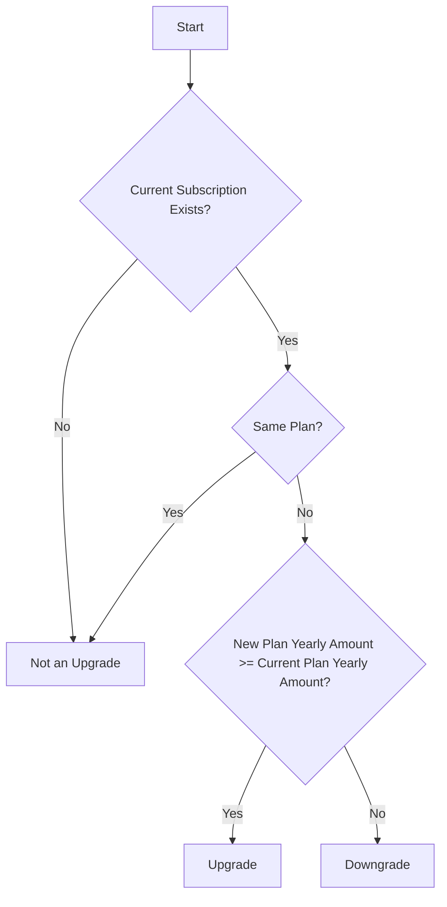
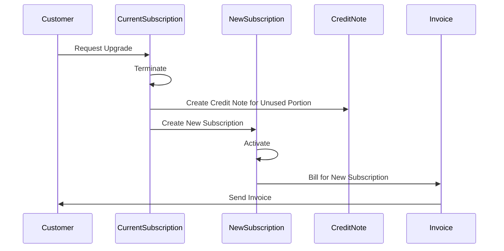
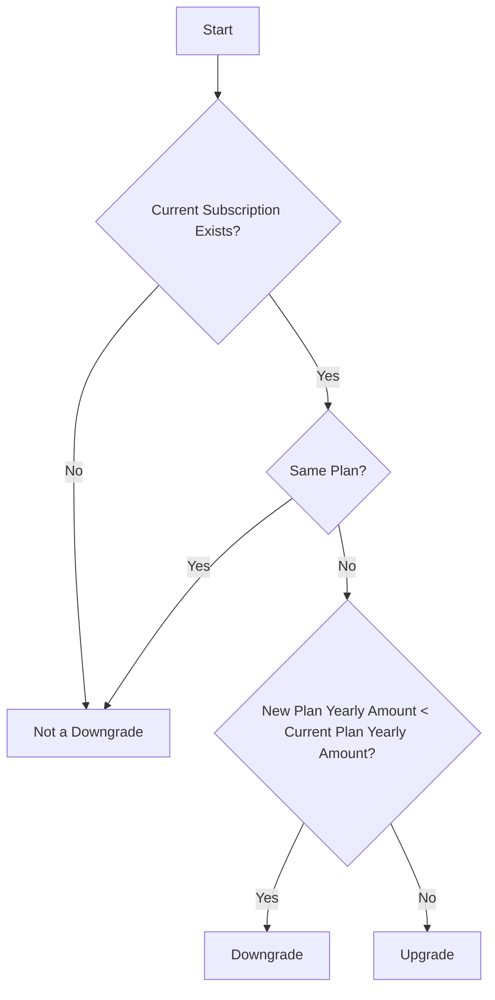
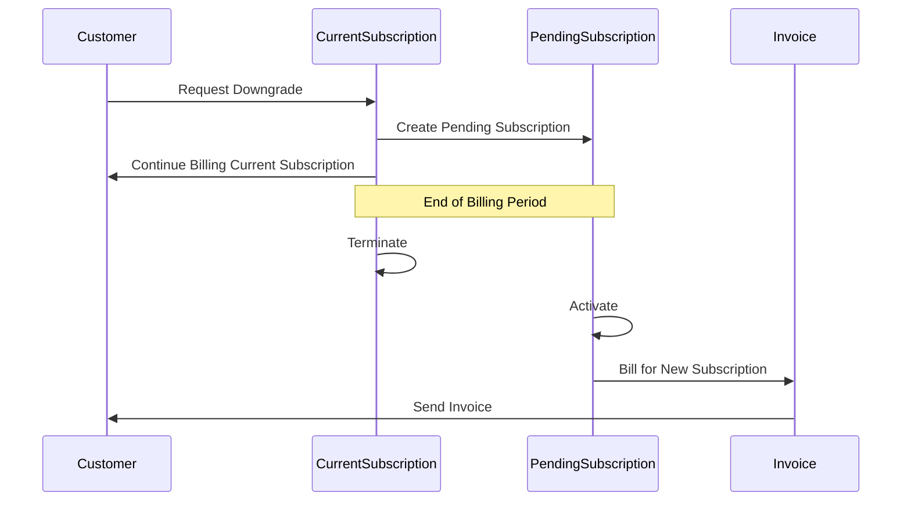
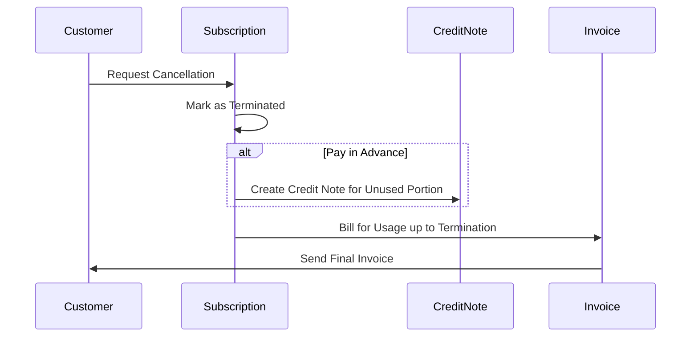
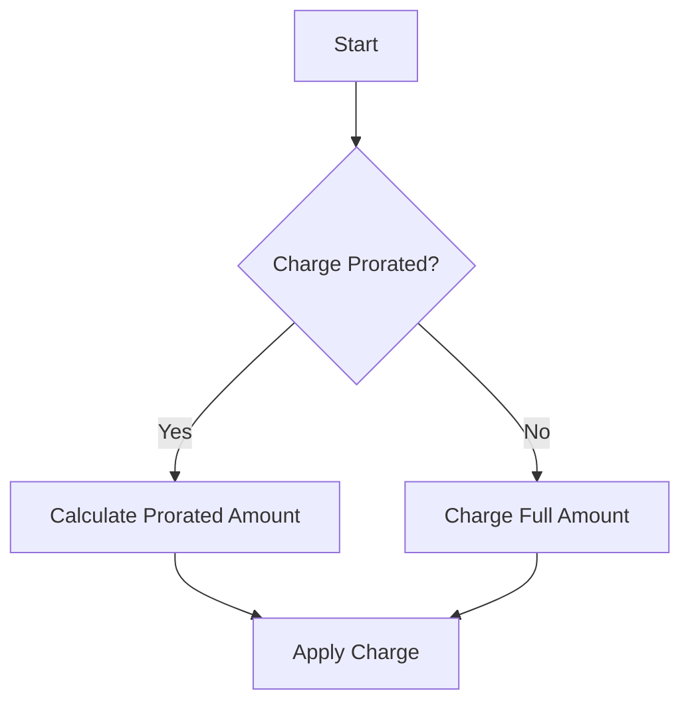
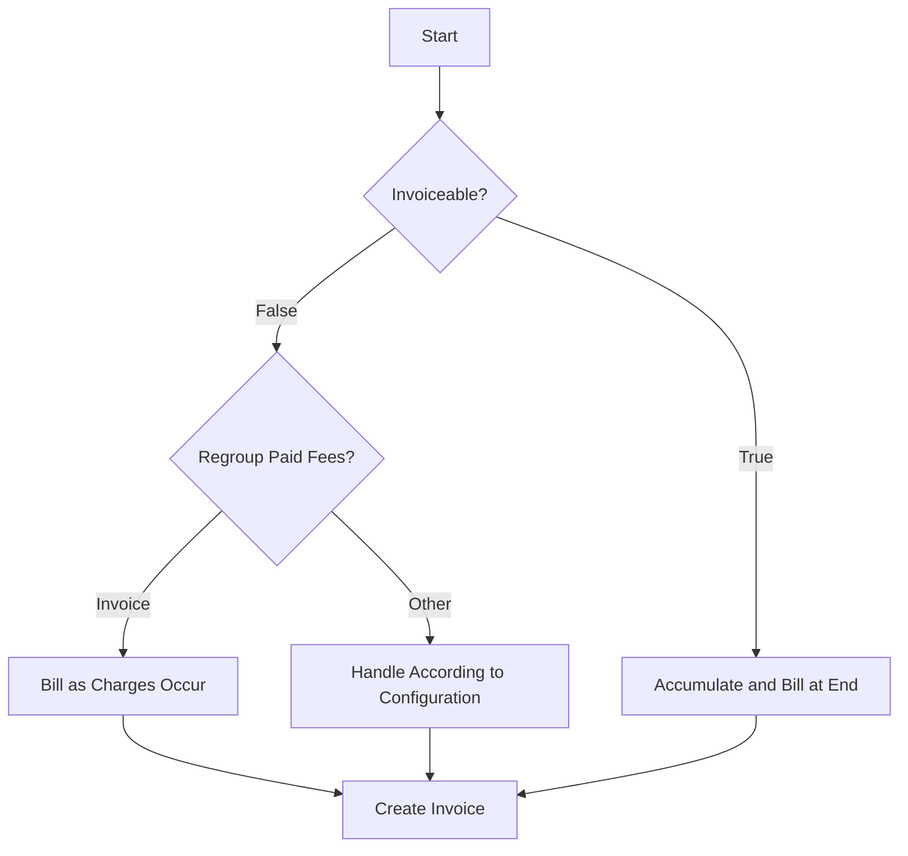

# Subscription Proration in Lago: Developer Guide

## Introduction

This document provides a comprehensive overview of how subscription proration works in Lago. Proration is the process of calculating charges proportionally based on the time a service was used within a billing period. Understanding proration is crucial for implementing and maintaining billing functionality in the system.

## Table of Contents

1. [Core Concepts](#1-core-concepts)
2. [Subscription Upgrade Workflow](#2-subscription-upgrade-workflow)
3. [Subscription Downgrade Workflow](#3-subscription-downgrade-workflow)
4. [Subscription Cancellation Workflow](#4-subscription-cancellation-workflow)
5. [Proration Configurations](#5-proration-configurations)
6. [Implementation Details](#6-implementation-details)
7. [Test Cases](#7-test-cases)
8. [Edge Cases and Special Considerations](#8-edge-cases-and-special-considerations)
9. [Troubleshooting Common Issues](#9-troubleshooting-common-issues)

## 1. Core Concepts

### 1.1 Proration Coefficient

The proration coefficient is a value between 0 and 1 that represents the portion of a billing period for which a customer should be charged. It's calculated as:

```
proration_coefficient = days_used / total_days_in_period
```

For example, if a customer uses a service for 15 days in a 30-day month, the proration coefficient would be 0.5.

### 1.2 Plan Types

- **Pay in Advance**: Customer is billed at the beginning of the billing period.
- **Pay in Arrears**: Customer is billed at the end of the billing period.

### 1.3 Charge Types

- **Prorated Charges**: Charges that are calculated proportionally based on usage time.
- **Non-prorated Charges**: Charges that are billed at full price regardless of usage time.

### 1.4 Billing Time

- **Calendar Billing**: Billing occurs on a fixed date each month (e.g., the 1st).
- **Anniversary Billing**: Billing occurs on the anniversary of the subscription start date.

## 2. Subscription Upgrade Workflow

An upgrade occurs when a customer moves from a lower-priced plan to a higher-priced plan.

### 2.1 Upgrade Detection



Lago determines an upgrade based on the yearly amount of the plans:

```ruby
def upgrade?
  return false unless current_subscription
  return false if plan.id == current_subscription.plan.id

  plan.yearly_amount_cents >= current_subscription.plan.yearly_amount_cents
end
```

### 2.2 Upgrade Process



When a subscription is upgraded:

1. The current subscription is terminated immediately.
2. A credit note is issued for the unused portion of the current subscription (if pay in advance).
3. A new subscription is created and activated immediately.
4. The customer is billed for the new subscription (if pay in advance).

Key implementation in `PlanUpgradeService`:

```ruby
def call
  if current_subscription.starting_in_the_future?
    update_pending_subscription
    result.subscription = current_subscription
    return result
  end

  new_subscription = new_subcription_with_overrides

  ActiveRecord::Base.transaction do
    cancel_pending_subscription if pending_subscription?

    # Group subscriptions for billing
    billable_subscriptions = billable_subscriptions(new_subscription)

    # Terminate current subscription as part of the upgrade process
    Subscriptions::TerminateService.call(
      subscription: current_subscription,
      upgrade: true
    )

    new_subscription.mark_as_active!
    after_commit do
      SendWebhookJob.perform_later("subscription.started", new_subscription)
    end

    bill_subscriptions(billable_subscriptions) if billable_subscriptions.any?
  end

  result.subscription = new_subscription
  result
end
```

### 2.3 Credit Note Creation for Upgrades

When a subscription is upgraded, a credit note is created for the unused portion of the current subscription:

```ruby
def call
  return result if (last_subscription_fee&.amount_cents || 0).zero? || last_subscription_fee.invoice.voided?

  amount = compute_amount
  return result unless amount.positive?

  # NOTE: In some cases, if the fee was already prorated (in case of multiple upgrade) the amount
  #       could be greater than the last subscription fee amount.
  #       In that case, we have to use the last subscription fee amount
  amount = last_subscription_fee.amount_cents if amount > last_subscription_fee.amount_cents

  # NOTE: if credit notes were already issued on the fee,
  #       we have to deduct them from the prorated amount
  amount -= last_subscription_fee.credit_note_items.sum(:amount_cents)
  return result unless amount.positive?

  CreditNotes::CreateService.new(
    invoice: last_subscription_fee.invoice,
    credit_amount_cents: creditable_amount_cents(amount),
    refund_amount_cents: 0,
    items: [
      {
        fee_id: last_subscription_fee.id,
        amount_cents: amount.truncate(CreditNote::DB_PRECISION_SCALE)
      }
    ],
    reason: reason.to_sym,
    automatic: true
  ).call
end
```

The amount to credit is calculated based on the day price and the remaining duration:

```ruby
def compute_amount
  day_price * remaining_duration
end

def day_price
  date_service.single_day_price(plan_amount_cents:)
end

def remaining_duration
  billed_from = terminated_at_in_timezone.end_of_day.utc.to_date
  billed_from -= 1.day if upgrade

  if plan.has_trial? && subscription.trial_end_date >= billed_from
    billed_from = if subscription.trial_end_date > to_date
      to_date
    else
      subscription.trial_end_date - 1.day
    end
  end

  duration = (to_date - billed_from).to_i

  duration.negative? ? 0 : duration
end
```

## 3. Subscription Downgrade Workflow

A downgrade occurs when a customer moves from a higher-priced plan to a lower-priced plan.

### 3.1 Downgrade Detection



Lago determines a downgrade based on the yearly amount of the plans:

```ruby
def downgrade?
  return false unless current_subscription
  return false if plan.id == current_subscription.plan.id

  plan.yearly_amount_cents < current_subscription.plan.yearly_amount_cents
end
```

### 3.2 Downgrade Process



When a subscription is downgraded:

1. The current subscription remains active until the end of the billing period.
2. A new subscription is created with a pending status.
3. The new subscription becomes active at the start of the next billing period.

Key implementation in `CreateService`:

```ruby
def downgrade_subscription
  if current_subscription.starting_in_the_future?
    update_pending_subscription
    return current_subscription
  end

  cancel_pending_subscription if pending_subscription?

  # NOTE: When downgrading a subscription, we keep the current one active
  #       until the next billing day. The new subscription will become active at this date
  Subscription.create!(
    customer:,
    plan: params.key?(:plan_overrides) ? override_plan(plan) : plan,
    name:,
    external_id: current_subscription.external_id,
    previous_subscription_id: current_subscription.id,
    subscription_at: current_subscription.subscription_at,
    status: :pending,
    billing_time: current_subscription.billing_time,
    ending_at: params.key?(:ending_at) ? params[:ending_at] : current_subscription.ending_at
  )

  after_commit { SendWebhookJob.perform_later("subscription.updated", current_subscription) }

  current_subscription
end
```

### 3.3 Downgrade Activation

When the billing period ends, the current subscription is terminated, and the pending subscription is activated:

```ruby
def terminate_and_start_next(timestamp:)
  next_subscription = subscription.next_subscription
  return result unless next_subscription
  return result unless next_subscription.pending?

  rotation_date = Time.zone.at(timestamp)

  ActiveRecord::Base.transaction do
    subscription.mark_as_terminated!(rotation_date)

    if subscription.should_sync_hubspot_subscription?
      Integrations::Aggregator::Subscriptions::Hubspot::UpdateJob.perform_later(subscription:)
    end

    next_subscription.mark_as_active!(rotation_date)
    if next_subscription.should_sync_hubspot_subscription?
      Integrations::Aggregator::Subscriptions::Hubspot::UpdateJob.perform_later(next_subscription)
    end
  end

  # NOTE: Create an invoice for the terminated subscription
  #       if it has not been billed yet
  #       or only for the charges if subscription was billed in advance
  #       Also, add new pay in advance plan inside if applicable
  billable_subscriptions = if next_subscription.plan.pay_in_advance?
    [subscription, next_subscription]
  else
    [subscription]
  end
  BillSubscriptionJob.perform_later(billable_subscriptions, timestamp, invoicing_reason: :upgrading)
  BillNonInvoiceableFeesJob.perform_later([subscription], rotation_date) # Ignore next subscription since there can't be events

  SendWebhookJob.perform_later("subscription.terminated", subscription)
  SendWebhookJob.perform_later("subscription.started", next_subscription)

  result.subscription = next_subscription

  result
end
```

## 4. Subscription Cancellation Workflow

Cancellation occurs when a customer terminates their subscription.

### 4.1 Cancellation Process



When a subscription is cancelled:

1. The subscription is marked as terminated.
2. If the subscription was paid in advance, a credit note is issued for the unused portion.
3. The subscription is billed for any usage up to the termination date.

Key implementation in `TerminateService`:

```ruby
def call
  return result.not_found_failure!(resource: "subscription") if subscription.blank?

  if subscription.pending?
    subscription.mark_as_canceled!
  elsif !subscription.terminated?
    subscription.mark_as_terminated!

    if subscription.should_sync_hubspot_subscription?
      Integrations::Aggregator::Subscriptions::Hubspot::UpdateJob.perform_later(subscription:)
    end

    if subscription.plan.pay_in_advance? && pay_in_advance_invoice_issued?
      # NOTE: As subscription was payed in advance and terminated before the end of the period,
      #       we have to create a credit note for the days that were not consumed
      credit_note_result = CreditNotes::CreateFromTermination.new(
        subscription:,
        reason: "order_cancellation",
        upgrade:
      ).call
      credit_note_result.raise_if_error!
    end

    # NOTE: We should bill subscription and generate invoice for all cases except for the upgrade
    #       For upgrade we will create only one invoice for termination charges and for in advance charges
    #       It is handled in subscriptions/create_service.rb
    bill_subscription unless upgrade
  end

  # NOTE: Pending next subscription should be canceled as well
  next_subscription = subscription.next_subscription
  next_subscription&.mark_as_canceled!

  if next_subscription&.should_sync_hubspot_subscription?
    Integrations::Aggregator::Subscriptions::Hubspot::UpdateJob.perform_later(subscription: next_subscription)
  end

  # NOTE: Wait to ensure job is performed at the end of the database transaction.
  SendWebhookJob.set(wait: 2.seconds).perform_later("subscription.terminated", subscription)

  result.subscription = subscription
  result
end
```

### 4.2 Credit Note Creation for Cancellations

Similar to upgrades, a credit note is created for the unused portion of the subscription:

```ruby
def call
  return result if (last_subscription_fee&.amount_cents || 0).zero? || last_subscription_fee.invoice.voided?

  amount = compute_amount
  return result unless amount.positive?

  # NOTE: In some cases, if the fee was already prorated (in case of multiple upgrade) the amount
  #       could be greater than the last subscription fee amount.
  #       In that case, we have to use the last subscription fee amount
  amount = last_subscription_fee.amount_cents if amount > last_subscription_fee.amount_cents

  # NOTE: if credit notes were already issued on the fee,
  #       we have to deduct them from the prorated amount
  amount -= last_subscription_fee.credit_note_items.sum(:amount_cents)
  return result unless amount.positive?

  CreditNotes::CreateService.new(
    invoice: last_subscription_fee.invoice,
    credit_amount_cents: creditable_amount_cents(amount),
    refund_amount_cents: 0,
    items: [
      {
        fee_id: last_subscription_fee.id,
        amount_cents: amount.truncate(CreditNote::DB_PRECISION_SCALE)
      }
    ],
    reason: reason.to_sym,
    automatic: true
  ).call
end
```

## 5. Proration Configurations

### 5.1 Prorated Billing



Charges can be configured to be prorated or not:

```ruby
def create_charge(plan, args)
  charge = plan.charges.new(
    billable_metric_id: args[:billable_metric_id],
    invoice_display_name: args[:invoice_display_name],
    charge_model: charge_model(args),
    pay_in_advance: args[:pay_in_advance] || false,
    prorated: args[:prorated] || false
  )
  # ...
end
```

When a charge is prorated, the amount is calculated based on the time the service was used:

```ruby
def compute_pay_in_advance_aggregation(aggregation_without_proration:)
  return BigDecimal(0) unless event
  return BigDecimal(0) if event.properties.blank?

  result_without_proration = aggregation_without_proration.pay_in_advance_aggregation
  result.full_units_number = result_without_proration
  result.units_applied = aggregation_without_proration.units_applied

  # In order to get proration coefficient we have to divide number of seconds with number
  # of seconds in one day (86400). That way we will get number of days when the service was used.
  proration_coefficient = Utils::Datetime.date_diff_with_timezone(
    event.timestamp,
    to_datetime,
    customer.applicable_timezone
  ).fdiv(period_duration)

  value = (result_without_proration * proration_coefficient).ceil(5)

  extend_cached_aggregation(value, aggregation_without_proration)

  value
end
```

### 5.2 Charge Usage in Advance vs. at the End



Lago supports two billing models for usage-based charges:

1. **Charge Usage in Advance and Invoice Each Charge**: Charges are billed as they occur.
2. **Charge Usage in Advance but Invoice at the End**: Charges are accumulated and billed at the end of the billing period.

This is controlled by the `invoiceable` and `regroup_paid_fees` properties:

```ruby
if License.premium?
  charge.invoiceable = args[:invoiceable] unless args[:invoiceable].nil?
  charge.regroup_paid_fees = args[:regroup_paid_fees] if args.key?(:regroup_paid_fees)
  charge.min_amount_cents = args[:min_amount_cents] || 0
end
```

#### 5.2.1 Charge Usage in Advance and Invoice Each Charge

When `invoiceable` is `false` and `regroup_paid_fees` is set to `invoice`, charges are billed as they occur:

```ruby
def has_charges_with_statement?
  plan_ids = subscriptions.pluck(:plan_id)
  Charge.where(plan_id: plan_ids, pay_in_advance: true, invoiceable: false, regroup_paid_fees: :invoice).any?
end
```

#### 5.2.2 Charge Usage in Advance but Invoice at the End

When `invoiceable` is `true`, charges are accumulated and billed at the end of the billing period:

```ruby
def create_charges_fees(subscription, boundaries)
  return unless charge_boundaries_valid?(boundaries)

  received_event_codes = distinct_event_codes(subscription, boundaries)

  subscription
    .plan
    .charges
    .includes(:taxes, billable_metric: :organization, filters: {values: :billable_metric_filter})
    .joins(:billable_metric)
    .where(invoiceable: true)
    .where
    .not(pay_in_advance: true, billable_metric: {recurring: false})
    .find_each do |charge|
      next if should_not_create_charge_fee?(charge, subscription)

      bypass_aggregation = !received_event_codes.include?(charge.billable_metric.code)
      Fees::ChargeService.call(invoice:, charge:, subscription:, boundaries:, context:, bypass_aggregation:).raise_if_error!
    end
end
```

## 6. Implementation Details

### 6.1 Key Files and Classes

- **Subscription Creation**: `app/services/subscriptions/create_service.rb`
- **Subscription Termination**: `app/services/subscriptions/terminate_service.rb`
- **Plan Upgrade**: `app/services/subscriptions/plan_upgrade_service.rb`
- **Credit Note Creation**: `app/services/credit_notes/create_from_termination.rb`
- **Proration Calculation**: `app/services/billable_metrics/prorated_aggregations/base_service.rb`

### 6.2 Database Schema

Key tables involved in proration:

- `subscriptions`: Stores subscription information
- `plans`: Stores plan information
- `charges`: Stores charge information
- `fees`: Stores fee information
- `invoices`: Stores invoice information
- `credit_notes`: Stores credit note information

### 6.3 Workflow Integration

Proration is integrated into the following workflows:

1. **Subscription Creation**: When a subscription is created, it may be prorated if it doesn't start at the beginning of a billing period.
2. **Subscription Upgrade**: When a subscription is upgraded, the old subscription is terminated and a credit note is issued for the unused portion.
3. **Subscription Downgrade**: When a subscription is downgraded, the old subscription remains active until the end of the billing period.
4. **Subscription Cancellation**: When a subscription is cancelled, a credit note is issued for the unused portion if paid in advance.

## 7. Test Cases

### 7.1 Upgrade Test Case

```ruby
it "performs subscription upgrade and billing correctly" do
  travel_to(DateTime.new(2024, 6, 1, 0, 0)) do
    create_subscription(
      {
        external_customer_id: customer.external_id,
        external_id: external_subscription_id,
        plan_code: plan.code,
        billing_time:
      }
    )
    perform_billing
  end

  travel_to(DateTime.new(2024, 6, 5, 0, 0)) do
    send_event! "user_1"
  end

  travel_to(DateTime.new(2024, 6, 15, 10, 5, 59)) do
    send_event! "user_2"
  end

  # More test steps...
end
```

### 7.2 Downgrade Test Case

```ruby
it "performs subscription downgrade and billing correctly" do
  travel_to(DateTime.new(2024, 6, 1, 0, 0)) do
    create_subscription(
      {
        external_customer_id: customer.external_id,
        external_id: external_subscription_id,
        plan_code: plan.code,
        billing_time:
      }
    )
    perform_billing
  end

  travel_to(DateTime.new(2024, 6, 5, 0, 0)) do
    send_event! "user_1"
  end

  travel_to(DateTime.new(2024, 6, 15, 10, 5, 59)) do
    send_event! "user_2"
  end

  # More test steps...
end
```

### 7.3 Cancellation Test Case

```ruby
it "downgrades and bill subscriptions" do
  subscription = nil

  # NOTE: Jul 19th: create the subscription
  travel_to(subscription_at) do
    create_subscription(
      {
        external_customer_id: customer.external_id,
        external_id: customer.external_id,
        plan_code: monthly_plan.code,
        billing_time: "anniversary",
        subscription_at: subscription_at.iso8601
      }
    )

    subscription = customer.subscriptions.first
    expect(subscription).to be_active
    expect(subscription.invoices.count).to eq(1)

    invoice = subscription.invoices.last
    expect(invoice.fees_amount_cents).to eq(monthly_plan.amount_cents)
    expect(invoice.invoice_subscriptions.first.from_datetime.iso8601).to eq("2023-07-19T00:00:00Z")
    expect(invoice.invoice_subscriptions.first.to_datetime.iso8601).to eq("2023-08-18T23:59:59Z")
  end

  # More test steps...
end
```

## 8. Edge Cases and Special Considerations

### 8.1 Trial Periods

When a subscription has a trial period, proration is adjusted accordingly:

```ruby
def remaining_duration
  billed_from = terminated_at_in_timezone.end_of_day.utc.to_date
  billed_from -= 1.day if upgrade

  if plan.has_trial? && subscription.trial_end_date >= billed_from
    billed_from = if subscription.trial_end_date > to_date
      to_date
    else
      subscription.trial_end_date - 1.day
    end
  end

  duration = (to_date - billed_from).to_i

  duration.negative? ? 0 : duration
end
```

### 8.2 Multiple Upgrades/Downgrades

When a subscription is upgraded or downgraded multiple times, Lago handles the transitions correctly:

```ruby
def cancel_pending_subscription
  current_subscription.next_subscription.mark_as_canceled!
end

def pending_subscription?
  return false unless current_subscription&.next_subscription

  current_subscription.next_subscription.pending?
end
```

### 8.3 Calendar vs. Anniversary Billing

Lago supports both calendar and anniversary billing:

```ruby
def create_subscription
  new_subscription = Subscription.new(
    customer:,
    plan: params.key?(:plan_overrides) ? override_plan(plan) : plan,
    subscription_at:,
    name:,
    external_id:,
    billing_time: billing_time || :calendar,
    ending_at: params[:ending_at]
  )
  # ...
end
```

### 8.4 Timezone Considerations

Proration calculations take into account the customer's timezone:

```ruby
proration_coefficient = Utils::Datetime.date_diff_with_timezone(
  event.timestamp,
  to_datetime,
  customer.applicable_timezone
).fdiv(period_duration)
```

## 9. Troubleshooting Common Issues

### 9.1 Incorrect Proration Amounts

If proration amounts are incorrect, check:

1. The subscription start and end dates
2. The plan's billing cycle
3. The charge's proration configuration
4. The customer's timezone

### 9.2 Missing Credit Notes

If credit notes are not being created for terminated subscriptions, check:

1. The subscription's payment status
2. The plan's payment configuration (pay in advance vs. pay in arrears)
3. The subscription's termination date

### 9.3 Unexpected Billing Behavior

If billing behavior is unexpected, check:

1. The subscription's status
2. The plan's billing cycle
3. The charge's invoiceable configuration
4. The charge's regroup_paid_fees configuration

## Conclusion

Lago's subscription proration system is designed to handle various scenarios, including upgrades, downgrades, and cancellations. The system calculates prorated amounts based on the time a service was used, ensuring fair billing for both customers and service providers.

Key points to remember:
- Upgrades are processed immediately, with credit notes issued for unused portions of the current subscription.
- Downgrades are scheduled to take effect at the end of the billing period.
- Cancellations terminate the subscription immediately, with credit notes issued for unused portions if paid in advance.
- Charges can be configured to be prorated or not.
- Usage-based charges can be billed as they occur or accumulated and billed at the end of the billing period.

This comprehensive approach to proration ensures flexibility and fairness in the billing process, accommodating a wide range of business models and customer needs. 