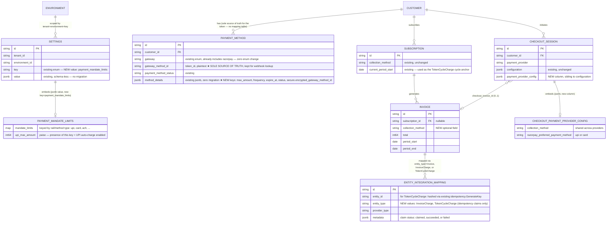
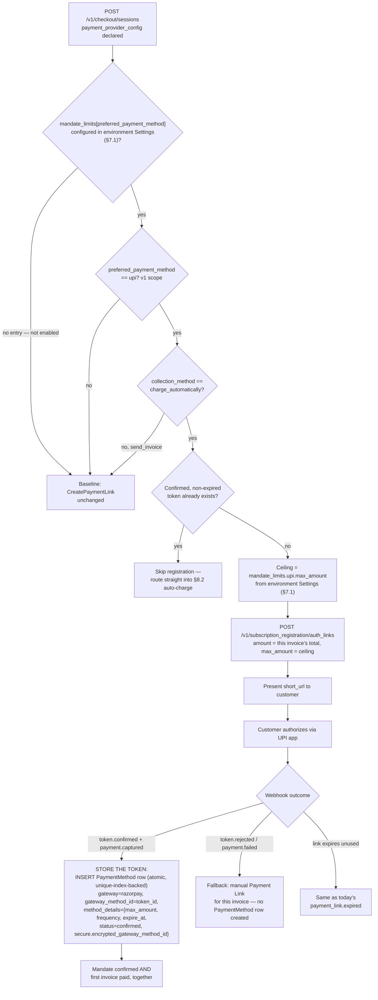

# Razorpay UPI Autopay — PRD

Status: **Design agreed, implementation not started.**
Date: 2026-07-07
Companion diagrams (interactive/whiteboard versions of the diagrams embedded below): `docs/prds/diagrams/razorpay-autocharge-flow.excalidraw`, `docs/prds/diagrams/razorpay-autocharge-erd.excalidraw`.

---

## 1. Problem Statement

Every Razorpay invoice today — one-off or subscription — is sent for manual payment via a Payment Link, regardless of a subscription's `collection_method`. There's no mandate/token registration, no auto-charge on finalize, and mandate-lifecycle webhooks are dropped.

**Goal**: once a customer authorizes a UPI Autopay mandate on their first invoice, all subsequent invoices auto-charge against it — up to its ceiling — falling back to manual payment whenever auto-charge isn't possible.

## 2. Goals & Non-Goals

| Goal (v1) | Non-Goal (v1) |
|---|---|
| Mandate registration at checkout, combined with the first invoice payment in one step | Card-based mandate registration (structurally anticipated, not implemented) |
| Auto-charge every subsequent invoice (one-off, renewal, draft-processed) | Dunning state machine / grace-period tracking / auto-cancellation |
| Structurally guarantee an invoice is never charged twice | Proactive "mandate expiring soon" reminders |
| Zero behavior change for tenants who don't opt in | Customer-facing payment-method picker (Razorpay's API fixes the method per request — not our choice) |

## 3. Scenarios

- **New customer, autopay enabled**: checkout → authorizes mandate → same action pays first invoice → future invoices auto-charge silently.
- **Renewal, existing mandate**: subscription renews → auto-charges with no customer action.
- **Mandate expires mid-subscription**: falls back to manual for that invoice + fires a fresh Registration Link.
- **Mandate rejected/cancelled**: falls back to manual, no special handling.
- **Invoice exceeds mandate ceiling**: falls back to manual for that invoice only (existing behavior).
- **Tenant not opted in**: zero behavior change.

## 4. Current State

| Area | Today | Gap |
|---|---|---|
| Checkout (`POST /v1/checkout/sessions` → `CheckoutSessionHandler.Create` → `CreatePaymentLink`) | Generic Payment Link, no `method` forcing | No mandate registration path |
| Invoice finalize (`performFinalizeInvoiceActions`, `invoice.go:874`) | Single hook already covers one-off, Temporal renewal, and draft-processing invoices | No auto-charge branch; `SyncInvoiceToRazorpayIfEnabled` has no `collectionMethod` param (unlike its Stripe counterpart) |
| Webhooks (`webhook/handler.go:64-87`) | Handles `payment.captured/failed`, `payment_link.*` | `payment.authorized` silently dropped; no `token.confirmed/rejected/cancelled` handling |
| `PaymentMethod` domain model | Populated only from Moyasar (`internal/integration/moyasar/webhook/handler.go:250-267`), via check-then-create (`Count` by `GatewayMethodID`+`CustomerID`, no DB unique constraint) | Not wired to Razorpay yet — **but `PaymentMethod.Gateway`'s enum (`types.PaymentGatewayType`) already includes `PaymentGatewayTypeRazorpay`**, and `MethodDetails` is already a jsonb column, so this is a population-logic gap only, not a schema gap |
| `entity_integration_mapping` | Generic entity↔provider mapping, unique on `(tenant, env, entity_type, entity_id, provider_type)` | Reusable as-is for the new `InvoiceCharge`/`TokenCycleCharge` idempotency claims (§10) — **not** used for token storage itself, since `PaymentMethod` is already a first-class table with its own `GatewayMethodID` and doesn't need the mapping-table workaround `Customer` requires (`Customer` has no native `razorpay_customer_id` column; `PaymentMethod` already has the equivalent) |
| `CollectionMethod` | Exists only on Subscription | Missing on Invoice (needed for one-off invoices, which have no subscription to read from) |

## 5. Razorpay API: What We're Building Against

| Decision | Detail |
|---|---|
| Product | **Recurring Payments ("Charge-At-Will")** API, not the Subscriptions API (whose UPI Autopay support is unconfirmed/possibly stale — open question, §14) |
| Registration | **Registration Link API** (`POST /v1/subscription_registration/auth_links`) — one call, returns `short_url`, method fixed per request (no cross-method picker), completion tracked via webhook only. **Confirmed: the link's `amount` is charged as the authorization payment itself** — mandate setup and first payment happen together |
| Subsequent charge | `POST /v1/orders` → `POST /v1/payments/create/recurring`, referencing the stored `token_id` |
| Idempotency | **None on our side from Razorpay** — its idempotency-key headers (`X-Payout-Idempotency` etc.) cover Payouts/Transfers/Refunds only, not Orders/Payments. We own idempotency entirely (§8) |
| Constraints | INR only · one successful debit per token per billing cycle (NPCI) · pre-debit notification required ~24h ahead · mandates can't be edited, only cancelled + re-registered · exact current unattended-debit cap should be re-verified against live Razorpay docs at implementation time (published figures have varied) |
| SDK | `github.com/razorpay/razorpay-go` — verify the exact method for `/payments/create/recurring` and token cancellation against SDK source before implementation (undocumented) |

Test mode: UPI ID `success@razorpay` / `failure@razorpay` simulates approval/decline (§12). Reference links: [Recurring payments overview](https://razorpay.com/docs/payments/payment-gateway/s2s-integration/recurring-payments/upi/) · [Webhooks](https://razorpay.com/docs/payments/payment-gateway/s2s-integration/recurring-payments/upi/webhooks/) · [Go SDK](https://github.com/razorpay/razorpay-go).

## 6. Data Model & ERD



Full visual (color-coded: green = unchanged, orange = new/modified field, blue = new embedded config object): `docs/prds/diagrams/razorpay-autocharge-erd.excalidraw`.

**Key decisions**:
- **No new field on `Connection`.** The tenant-wide "is auto-charge available, and at what ceiling" question moved off Connection entirely and now has two separate homes: the *ceiling* lives in a new environment-level `Settings` entry (below), the *per-request intent* (`collection_method`, `preferred_payment_method`) lives only in the new `CheckoutSession.payment_provider_config` column.
- **`CheckoutSession.payment_provider_config` is a new dedicated jsonb column**, sibling to the existing `configuration` column, not nested inside it — keeps subscription-creation params and payment-provider behavior as two clearly separate concerns, each independently discoverable/queryable.
- **Mandate ceilings reuse the codebase's existing generic `Settings` infrastructure** (`ent/schema/settings.go`, `internal/domain/settings/`) rather than inventing a new table. `Settings` is already environment-scoped (unique index on `tenant_id, environment_id, status, key`), already stores an arbitrary jsonb `value`, and is already used for exactly this shape of config (`SettingKeySubscriptionConfig`, `SettingKeyInvoicePDFConfig`, etc. — `internal/types/settings.go`). A new `SettingKeyPaymentMandateLimits` key needs zero migration and follows an established pattern instead of adding a new one. See §7 for the exact shape.
- **Keyed by payment rail/method type (`upi`, `card`, `ach`, ...), not by provider name.** A ceiling like UPI's NPCI-imposed cap is a property of the *rail*, not of whichever provider (Razorpay today, potentially others later) executes it — one `upi` entry governs UPI auto-charge regardless of provider. **Presence of an entry for a given type is what enables auto-charge for it** — no separate boolean to keep in sync; an environment with no `upi` entry simply never attempts UPI auto-charge, falling back to manual.
- **The mandate token lives entirely on `PaymentMethod` — no `entity_integration_mapping` dual-write for it.** `PaymentMethod` is already a first-class table with its own `GatewayMethodID` (token_id), `Gateway` enum (already includes `PaymentGatewayTypeRazorpay` — confirmed, zero enum change), and `MethodDetails` (existing jsonb, zero migration). Unlike `Customer` — which has no native `razorpay_customer_id` column and genuinely needs `entity_integration_mapping` as a bolt-on (`EnsureCustomerSyncedToRazorpay`'s existing pattern) — `PaymentMethod` doesn't need that workaround, so introducing it here would have been an unnecessary extra table for no benefit. This does mean `PaymentMethod` doesn't participate in the generic "list all provider integrations for entity X" pattern used for `Customer` (`ExpandIntegrations`, `internal/ee/service/customer.go:167-195`) — not a regression, since no such cross-cutting convention was ever established for `PaymentMethod` in the first place, but worth a dedicated query path if a similar admin view is wanted for payment methods later.

  **New unique index required**: `(tenant_id, environment_id, customer_id, gateway, gateway_method_id) WHERE status='published'` — Moyasar's existing token-creation path today is check-then-create with **no DB constraint and no transaction** (`internal/integration/moyasar/webhook/handler.go:230-267`, confirmed as a genuine, currently-live TOCTOU race — two concurrent webhook deliveries for the same token can both pass the `Count == 0` check before either inserts). This closes it for Razorpay and Moyasar alike. **Migration must include a pre-deploy duplicate audit**: run `SELECT tenant_id, environment_id, customer_id, gateway, gateway_method_id, COUNT(*) FROM payment_methods WHERE status='published' GROUP BY 1,2,3,4,5 HAVING COUNT(*) > 1` before adding the index — given the race is confirmed live in production code today, existing duplicates from retried Moyasar webhooks are a real possibility, not a hypothetical, and `CREATE UNIQUE INDEX` will fail outright at deploy time if any are found. Resolve (soft-delete the older duplicate) before the index migration runs, and use `CREATE UNIQUE INDEX CONCURRENTLY` to avoid locking the table.

  **Repository gap**: `internal/domain/paymentmethod/repository.go` has no `Get`-by-token lookup today — only `Create/Get(by id)/Update/Delete/List/Count/GetDefaultForCustomer`. Add `GetByGatewayMethodID(ctx, gateway, gatewayMethodID string) (*PaymentMethod, error)` — needed for both the `token.confirmed` dedup path and, critically, the `token.cancelled` webhook, which must find and *mutate* a specific row (status → cancelled), not just check existence via `Count`.

**`IntegrationEntityType` enum change required**: `internal/types/entityintegrationmapping.go`'s enum (`Customer, Plan, Invoice, Subscription, Payment, CreditNote, Addon, Item, ItemPrice, Price`) has no `InvoiceCharge`/`TokenCycleCharge` values today. Two new values must be added (not three — `PaymentMethod` is no longer needed here, see above) — and the type's `Validate()` allow-list updated to accept them. Plain Go string consts, no migration.

**Existing unique index detail that matters for §10**: `entity_integration_mapping`'s unique index (`ent/schema/entityintegrationmapping.go`) is a *partial* index — `WHERE status = 'published'` — where `status` is the generic soft-delete/archive column from the shared base mixin, **not** a claim-lifecycle field. The claim's own lifecycle (`claimed`/`succeeded`/`failed`) lives in the unindexed `metadata` jsonb column. This distinction is why §10's protocol requires an explicit locked re-read rather than trusting the unique violation alone to disambiguate claim state.

## 7. Configuration Structure

Two layers, in two different homes, answering two different questions.

### 7.1 Mandate ceilings — environment-level `Settings`, generic across providers

Reuses the existing `Settings` domain (`internal/domain/settings/`, `internal/types/settings.go`) — no new table:

```go
// internal/types/settings.go
const SettingKeyPaymentMandateLimits SettingKey = "payment_mandate_limits"

type PaymentMandateLimits struct {
    // keyed by payment rail/method type — "upi", "card", "ach", etc. —
    // NOT by provider name. Presence of a key enables auto-charge for
    // that type; absence means it falls back to manual, unconditionally.
    MandateLimits map[string]MandateLimit `json:"mandate_limits"`
}

type MandateLimit struct {
    MaxAmount int64  `json:"max_amount"`          // smallest currency unit (paise for INR)
    Currency  string `json:"currency,omitempty"`  // defaults to the environment's billing currency
}

func (c PaymentMandateLimits) Validate() error { return validator.ValidateRequest(c) }
```

Read at runtime via the existing `Repository.GetByKey(ctx, SettingKeyPaymentMandateLimits)` → `Setting.GetValue("mandate_limits", &limits)`. Written via the existing settings CRUD path — no new API surface needed beyond whatever admin/settings endpoint already manages other `SettingKey` values.

### 7.2 Per-request intent — `CheckoutSession.payment_provider_config` (new dedicated column)

```go
type CheckoutPaymentProviderConfig struct {
    CollectionMethod types.CollectionMethod  `json:"collection_method,omitempty"` // shared, reuses existing enum
    Razorpay         *RazorpayCheckoutConfig `json:"razorpay,omitempty"`
}
type RazorpayCheckoutConfig struct {
    PreferredPaymentMethod string `json:"preferred_payment_method,omitempty"` // "upi" | "card"
}
```

```json
POST /v1/checkout/sessions
{
  "customer_external_id": "...",
  "payment_provider": "razorpay",
  "payment_provider_config": {
    "collection_method": "charge_automatically",
    "razorpay": { "preferred_payment_method": "upi" }
  }
}
```

`collection_method` is shared (not nested per-provider) since it's a generic billing concept both Stripe and Razorpay share; `preferred_payment_method` stays nested since it's genuinely provider-specific. **Validation**: reject the request if a provider sub-object other than the one matching the top-level `payment_provider` field is populated, and reject if `preferred_payment_method` has no corresponding entry in the environment's `payment_mandate_limits` (§7.1) — i.e. a checkout request can't ask for a method the environment hasn't configured a ceiling for.

## 8. Architecture: Two Flows

### 8.1 Checkout / mandate registration



**Where the generated token is stored** (previously left implicit): the `token_id` Razorpay returns via the `token.confirmed` webhook is persisted in exactly **one place** — `PaymentMethod.GatewayMethodID = token_id`, with `MaxAmount`/`Frequency`/`ExpireAt`/`Status` (and a redundant encrypted copy of the token, §12) in its existing `MethodDetails` jsonb column. The insert is guarded by the new unique index (§6) rather than Moyasar's existing check-then-create, so a duplicate `token.confirmed` delivery (Razorpay webhook retry) can't create two `PaymentMethod` rows for the same mandate. Every later mandate-usability check (§8.2) and the `token.cancelled` webhook both read/update through this same row — no separate mapping table, no separate "mandate" table.

### 8.2 Invoice finalize / auto-charge

```mermaid
flowchart TD
    A[performFinalizeInvoiceActions] --> B{Mandate usability:\ntoken exists, confirmed,\nnot expired, under ceiling?}
    B -->|any fail| Z[Fallback to manual\n+ new Registration Link if expired]
    B -->|all pass| C["Acquire Redis lock (throughput\noptimization only — see §10 note\non what actually guarantees correctness)"]
    C -->|already held| R1[No-op: another attempt owns this]
    C -->|acquired| D[BEGIN transaction]
    D --> E["INSERT claim A: entity_type=InvoiceCharge,\nentity_id=invoice_id, status=claimed"]
    E -->|no conflict| F["invoice.SubscriptionID != nil?\n(true for BOTH renewal AND\nmid-cycle proration one-offs)"]
    F -->|yes| F2["INSERT claim B: entity_type=TokenCycleCharge,\nentity_id=idempotency.GenerateKey(token_id,\nsubscription_id, cycle_start), status=claimed"]
    F -->|no — standalone one-off,\nno subscription anchor| I
    E -->|conflict| G["SELECT claim A FOR UPDATE\n(locked read, same transaction)"]
    G -->|status=succeeded| R2[COMMIT no-op: already charged]
    G -->|status=claimed| R3[COMMIT no-op: defer to reconciliation sweep]
    G -->|status=failed| H["UPDATE claim A SET status=claimed\n(still holding the row lock)"]
    H --> F
    F2 -->|conflict — another invoice already\nclaimed this token+subscription+cycle| R4["ROLLBACK entire transaction\n(undoes claim A too), fallback to manual\n— NPCI would reject this anyway"]
    F2 -->|no conflict| I[COMMIT — claim(s) durably 'claimed']
    I --> J[POST /v1/orders]
    J --> K[POST /v1/payments/create/recurring]
    K --> L[Update claims A and B: succeeded, payment_id set]
    L --> M{Webhook}
    M -->|payment.captured| N[Mark invoice paid, release lock]
    M -->|payment.failed| O[Claims: failed, fallback to manual, release lock]
    M -->|TTL expires, nothing| P[Lock gone, claims stay 'claimed' —\nresolved only by reconciliation sweep]
```

## 9. Payment Method Support: UPI and Cards

Both methods share the same downstream primitives (`token`, Order, recurring Payment) — §8.2's idempotency/claim/lock/reconciliation logic is method-agnostic and needs zero changes for cards. What differs is **registration**: UPI uses the one-call Registration Link API; cards require a hosted Checkout form (card entry + AFA/OTP) — a different integration surface needing its own future adapter (`CreateCardMandateCheckout`). The method is fixed per request either way — no customer-facing picker. UPI's debit cap vs. cards' no-practical-ceiling means the over-cap fallback is realistically UPI-specific.

**v1 ships UPI only.** §7's config structure already reserves a slot for cards — this is a designed-for extension, not a future re-architecture.

## 10. Idempotency Guarantee

**The Redis lock is a throughput/thundering-herd optimization only — it is not a correctness layer and carries no load-bearing weight in the "never charge twice" guarantee.** If Redis is fully unavailable, every concurrent attempt falls through to the Postgres transaction below, which is where correctness actually lives; the only cost is more wasted DB round-trips, not a risk of double-charging. This is stated explicitly because a skim of the §8.2 diagram could otherwise read the lock as a peer of the DB claim — it isn't.

**Two structural claims, not one, both enforced by Postgres's real unique constraint** (`entity_integration_mapping`'s partial unique index on `(tenant_id, environment_id, entity_type, entity_id, provider_type) WHERE status='published'` — the existing soft-delete index, not a new one):

1. **`InvoiceCharge`** (`entity_id=invoice_id`) — guarantees *this invoice* is never charged twice. `invoice_id` isn't sensitive, so it's used directly as the key, no hashing needed.
2. **`TokenCycleCharge`** (`entity_id=idempotency.NewGenerator().GenerateKey(ScopeTokenCycleCharge, {token_id, subscription_id, cycle_start})`) — guarantees *this token* is never debited twice in the same billing cycle for this subscription (the NPCI rule, §11 #4), independent of which invoice triggers it. Reuses the codebase's existing `internal/idempotency` package (already used for `ScopeSubscriptionInvoice`, `ScopeCreditGrant`, `ScopePayment`, etc. — a SHA-256-based `Generator.GenerateKey(scope, params)`) rather than hand-rolling string concatenation; a new `ScopeTokenCycleCharge` constant is the only addition needed. This also means the raw `token_id` never appears in plaintext in the `entity_id` column — a smaller side benefit on top of consistency with an established pattern.

   Applies to **any invoice with a non-nil `SubscriptionID`** — this covers mid-cycle **quantity-change and line-item-change proration invoices** (`internal/ee/service/subscription_modification.go`'s `handleQuantityChangeProration` and `internal/ee/service/line_item_proration.go`'s `settleCharge`, both confirmed to set `SubscriptionID: &sub.ID` and read `sub.CurrentPeriodStart` before any mutation touches it — so it's a safe, stable anchor at invoice-creation time), not just scheduled renewals. **Plan changes are a different case, not actually at risk here**: `internal/ee/service/subscription_change.go` cancels the old subscription and creates an entirely new `Subscription` row with its own fresh `CurrentPeriodStart` for any proration credit, rather than generating a mid-cycle invoice against the old subscription's ID — so there's no shared-cycle collision to protect against for plan changes specifically; the new subscription's own opening invoice gets its own independent `TokenCycleCharge` key. The key is derived from `Subscription.CurrentPeriodStart`, not `Invoice.PeriodStart` — the latter is set inconsistently across invoice origins (proration invoices set it to the change's effective timestamp, not the cycle boundary), so it cannot be used as a stable per-cycle anchor.

**Known residual risk, explicitly accepted rather than silently ignored**: a standalone one-off invoice with **no** `SubscriptionID` (e.g. a pure one-time purchase, unrelated to any subscription) gets no `TokenCycleCharge` claim, since there's no subscription to anchor a cycle boundary to. If a customer's shared token is used for such an invoice in the same real-world NPCI cycle as another charge, our system does not structurally pre-empt a possible double-debit at the DB layer for this specific case. This is accepted because **Razorpay/NPCI's own network enforces the one-debit-per-token-per-cycle rule regardless of what we do on our side** — the realistic failure mode is our attempt getting rejected by Razorpay (handled identically to any other `payment.failed`, falling back to manual), not an actual double charge landing. Confirming the precise definition of "cycle" NPCI applies to a token shared across multiple subscriptions (vs. our per-subscription `CurrentPeriodStart` anchor) is listed as an open question (§14).

**The claim-state read/write protocol is transactional, not a bare insert-and-inspect**: on `INSERT ... claim A` failing with a unique violation, the existing row is re-read with `SELECT ... FOR UPDATE` *inside the same transaction* before branching on its `metadata.status` — this closes the race window between "insert fails" and "read what's there," since a plain unlocked re-read could observe a `metadata.status` that another in-flight transaction is concurrently updating. Only after both claims are inserted/validated does the transaction commit; the Razorpay API calls happen strictly after that commit, never inside it (external HTTP calls do not belong inside a DB transaction).

- **Never charge twice, structurally**: both claims are Postgres-constraint-backed, not application-level checks — correctness holds even under full concurrency, node crashes, or Redis being down.
- **Ambiguous outcomes (timeout/5xx) are never treated as failure** — only an explicit `payment.failed` webhook permits retry; everything else is resolved exclusively by the reconciliation sweep (§11), never by inline retry racing an unresolved attempt.
- **Orphaned Razorpay Orders are accepted, harmless clutter** — Orders don't move money; only the Payment call does, and that's fully gated by both claims already having committed.

## 11. Edge Cases & Reconciliation

| # | Scenario | Handling |
|---|---|---|
| 1 | Duplicate `payment.captured` webhook | Handler checks invoice status first — no-op on repeat |
| 2 | Retry after the first attempt already succeeded | Claim already `succeeded` → short-circuits |
| 3 | Two invoices, same customer, concurrent finalize | Lock/claim keyed per-invoice — independent; cycle constraint enforced separately (#4) |
| 4 | NPCI: one debit per token per cycle | Structural for any invoice tied to a subscription (renewal or mid-cycle proration alike): the `TokenCycleCharge` claim (§10), keyed off `Subscription.CurrentPeriodStart`, makes a second concurrent charge attempt fail on Postgres's own unique constraint. For token-sharing across standalone one-off invoices with no subscription, this is not structurally enforced on our side — accepted residual risk, backstopped by Razorpay/NPCI's own network rejection (§10) |
| 5 | Invoice total changes mid-flight (e.g. credit note) | Non-issue — same invoice snapshot throughout; mutation-after-finalize guarded elsewhere |
| 6 | Ambiguous Razorpay response | Claim stays `claimed`; resolved only by reconciliation sweep |
| 7 | Webhook never arrives | Lock TTL expires, claim stays `claimed` — stuck-but-safe, resolved by sweep |
| 8 | Subscription cancelled mid-cycle before charge completes | Out of scope — existing subscription invariants govern this |
| 9 | Environment's `payment_mandate_limits` entry for a method is removed/changed mid-flight | Settings read once per invoice at hook entry (§7.1); next invoice picks up the new state |
| 10 | Invoice re-finalized twice (unrelated bug) | Same claim+lock guard handles it identically |
| 11 | Duplicate `token.confirmed` webhook delivery (Razorpay retry) | New unique index on `PaymentMethod` (§6) makes the second insert attempt fail atomically — replaces Moyasar's existing racy check-then-create, no separate claim mechanism needed since `PaymentMethod` itself is now the guarded resource |

**Reconciliation sweep** (Temporal workflow or cron, every 15–30 min): query claims `status=claimed` older than ~1hr → call Razorpay's read-only `Payment.Fetch` on the recorded `payment_id` (or treat as abandoned if none was recorded) → resolve to `succeeded`/`failed`, update the invoice, release any lingering lock. This is the **only** place a stuck claim resolves — the finalize hook never doubles as a reconciler.

## 12. Monitoring, Security & Rollback

**Monitoring/alerting** (new, not present in earlier drafts of this design): alert on (a) claim rows stuck in `claimed` past the reconciliation sweep's resolution window (signals the sweep itself is failing, not just a normal stuck-but-safe case), (b) `token.rejected`/mandate-rejection rate spiking for a tenant, (c) reconciliation sweep job failures/skipped runs, (d) NPCI `TokenCycleCharge` rejection rate (an unexpectedly high rate could indicate a bug generating duplicate invoices against one mandate, not just legitimate mid-cycle plan changes).

**Security/compliance**: this feature moves money without a per-charge customer action, which is exactly the shape of thing that generates "why was I charged" support/compliance disputes — the claim row (§10) doubles as the audit trail (which invoice, which token, which payment_id, timestamped), but this must be explicitly queryable/exportable for support tooling, not just an internal implementation detail. Webhook signature verification status for the existing Razorpay webhook handler should be confirmed (not verified as part of this PRD) before this feature ships, given it now triggers financial state changes (`token.confirmed`, `payment.captured`) rather than just informational updates.

**Token encryption at rest**: a mandate `token_id` is a live debit-authorization credential — meaningfully more sensitive than an ordinary external-ID reference (e.g. `razorpay_customer_id`), since possessing it alongside the merchant's own API credentials is sufficient to trigger a charge. `PaymentMethod.MethodDetails.secure.encrypted_gateway_method_id` (a nested sub-object within the existing jsonb column, §6) holds an encrypted copy of the `token_id`, written via the codebase's existing `internal/security.EncryptionService` (AES-256-GCM, already used for `Connection.EncryptedSecretData` — Razorpay's own `KeyID`/`SecretKey`/`WebhookSecret` and every other provider's credentials go through this exact path today).

**Deliberately nested under a `secure` sub-key, not a flat sibling of `MethodDetails`'s existing display fields** (`company`/`name`/`number` for Moyasar, `max_amount`/`frequency`/`expire_at`/`status` for Razorpay): mixing an encrypted value directly into the same flat map as plaintext display metadata invites exactly the failure mode this is meant to prevent — a future log statement, support-tooling export, or API response change that serializes the whole `MethodDetails` blob "because it's mostly just display data" would silently leak ciphertext alongside plaintext, and worse, normalize treating the entire blob as safe-to-expose. Segregating everything sensitive under one clearly-named sub-key keeps `MethodDetails.secure.*` visually and structurally distinct from `MethodDetails`'s existing plaintext fields, matching the spirit of `Connection.EncryptedSecretData`'s existing precedent (a wholly separate field, not commingled with `Connection.metadata`) as closely as a single jsonb column allows.

`PaymentMethod.GatewayMethodID` itself (the existing plain column, also holding `token_id`) is deliberately left unchanged — it's the platform-wide convention every gateway (Stripe, Moyasar, Razorpay) already uses for exact-match lookups, and encrypting it would require introducing a new blind-index/hash-lookup pattern that doesn't exist anywhere else in this codebase, as a Razorpay-only carve-out from an established cross-gateway convention. The encrypted copy is additive defense-in-depth (a more strictly-access-controlled value, e.g. for audit export) layered on top of, not replacing, the existing plaintext lookup path. No new encryption primitive needed — this is a new *use* of an existing, already-proven service.

**Kill switch / rollback**: removing (or zeroing) an environment's `payment_mandate_limits` entry for a given method (§7.1) stops *new* invoices from auto-charging via that method (checked once at finalize-hook entry, edge case #9) but does **not** affect claims already `claimed`/in-flight; those still resolve via the reconciliation sweep regardless of current settings state (the sweep doesn't gate on settings — it only ever resolves existing claims to a terminal state). There is intentionally **no single platform-wide kill switch** in v1 beyond removing each environment's settings entry individually — acceptable for v1 given this is an opt-in feature with no environments on it at launch, but worth flagging as a fast-follow (e.g. a global feature flag checked alongside the per-environment settings) if incident response speed becomes a concern before enough environments adopt this to matter.

## 13. Testing Strategy

- Unit: mandate-usability check matrix; claim-row state machine; checkout provider-mismatch validation.
- Integration (real Postgres + Redis/miniredis): concurrent auto-charge attempts → exactly one Payment call; per-cycle dedup; reconciliation sweep resolving a seeded stuck claim; webhook idempotency; checkout flow (success/failure/expiry); backward compatibility (no config → zero behavior change).
- **Manual/Postman against Razorpay test mode**: Customer → Registration Link → authorize with `success@razorpay`/`failure@razorpay` → fetch token → Order → recurring Payment → fetch Payment (mirrors the reconciliation sweep) → deliberately double-charge the same token/cycle to observe Razorpay's own NPCI rejection. Concurrency/crash-recovery scenarios can only be tested via the Go integration tests above, not Postman.

## 14. Rollout & Open Questions

All new config is additive jsonb — a tenant with nothing set sees zero behavior change. No existing field renamed or removed.

**Open**: confirm with Razorpay support whether Subscriptions API genuinely dropped UPI Autopay (doesn't block this design either way) · verify exact `razorpay-go` SDK methods for recurring payment + token cancellation against source · re-verify the current unattended-debit cap against live docs · fallback ordering across multiple preferred methods (deferred past v1) · how a mandate gets set up if a customer's first invoice is a renewal rather than a checkout session (not blocking v1's primary checkout-originated path, worth a fast-follow) · **confirm with Razorpay/NPCI how the one-debit-per-token-per-cycle rule is actually scoped when one customer's token is shared across multiple subscriptions or standalone one-off invoices** — our `TokenCycleCharge` claim (§10) anchors per-subscription via `CurrentPeriodStart`, which may not exactly match NPCI's real enforcement window in the shared-token, no-subscription-anchor case; currently backstopped by Razorpay's own rejection rather than a structural DB guarantee.

## 15. Key Files (Implementation Reference)

`internal/ee/service/invoice.go` (`performFinalizeInvoiceActions`, new `AutoChargeInvoice`) · `internal/types/entityintegrationmapping.go` (new `InvoiceCharge`, `TokenCycleCharge` constants + `Validate()` update — no `PaymentMethod` value needed) · `internal/security/encryption.go` (reuse existing `EncryptionService.Encrypt`/`Decrypt` for `PaymentMethod.MethodDetails.secure.encrypted_gateway_method_id`, §12 — no new primitive) · `internal/idempotency/generator.go` (reuse existing `Generator.GenerateKey`, new `ScopeTokenCycleCharge` constant, §10 — no new key-derivation scheme) · `internal/types/settings.go` (new `SettingKeyPaymentMandateLimits` + `PaymentMandateLimits` type + `ValidateSettingValue`/`GetDefaultSettings` updates, §7.1) · `ent/schema/paymentmethod.go` (new unique index `(tenant_id, environment_id, customer_id, gateway, gateway_method_id) WHERE status='published'`, §6) · `internal/domain/paymentmethod/repository.go` (add a `GetByGatewayMethodID`-style lookup — currently missing, only `Count`+filter exists) · `internal/domain/invoice/model.go` + `ent/schema/invoice.go` (new `CollectionMethod` field) · `internal/domain/checkout/model.go` + `ent/schema/checkoutsession.go` (new `payment_provider_config` column) · `internal/api/dto/checkout_session.go` (request validation) · `internal/integration/razorpay/checkout_adapter.go` (new `CreateRegistrationLink`) · `internal/integration/razorpay/webhook/{handler.go,types.go}` (new event cases incl. `PaymentMethod` creation on `token.confirmed`, confirm signature verification against existing `VerifyWebhookSignature` in `client.go`) · `internal/ee/service/subscription_modification.go` (`handleQuantityChangeProration`) + `internal/ee/service/line_item_proration.go` (`settleCharge`) — both confirmed sources of mid-cycle proration one-off invoices where the `TokenCycleCharge` cycle-key derivation in §10 must be wired in · new reconciliation sweep (Temporal workflow or `internal/api/cron/`) · new monitoring/alerting hooks (§12).
