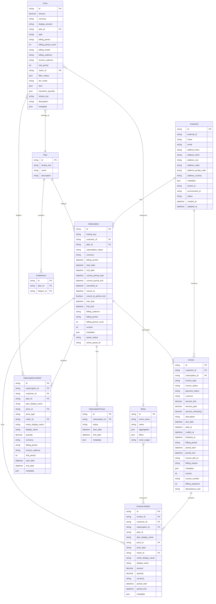

```mermaid
erDiagram
    Customer ||--o{ Subscription : has
    Customer ||--o{ Invoice : receives
    
    Plan ||--o{ Subscription : defines
    Plan ||--o{ Entitlement : contains
    
    Subscription ||--o{ SubscriptionLineItem : contains
    Subscription ||--o{ SubscriptionPause : has
    Subscription ||--o{ Invoice : generates
    
    Price }|--o{ SubscriptionLineItem : defines
    Price }|--|| Plan : belongs_to
    Price }o--o| Meter : measures
    
    Invoice ||--o{ InvoiceLineItem : contains
    InvoiceLineItem }o--|| Subscription : from
    
    Meter }|--o{ InvoiceLineItem : measures
    
    %% Entity definitions with key fields
    Customer {
        string id PK
        string external_id
        string name 
        string email
        string address_line1
        string address_line2
        string address_city
        string address_state
        string address_postal_code
        string address_country
        json metadata
        %% BaseMixin & EnvironmentMixin fields
        string tenant_id
        string environment_id
        string status
        datetime created_at
        datetime updated_at
    }
    
    Plan {
        string id PK
        string lookup_key
        string name
        string description
    }
    
    Subscription {
        string id PK
        string lookup_key
        string customer_id FK
        string plan_id FK
        string subscription_status
        string currency
        datetime billing_anchor
        datetime start_date
        datetime end_date
        datetime current_period_start
        datetime current_period_end
        datetime cancelled_at
        datetime cancel_at
        boolean cancel_at_period_end
        datetime trial_start
        datetime trial_end
        string billing_cadence
        string billing_period
        int billing_period_count
        int version
        json metadata
        string pause_status
        string active_pause_id
    }
    
    SubscriptionLineItem {
        string id PK
        string subscription_id FK
        string customer_id FK
        string plan_id FK
        string plan_display_name
        string price_id FK
        string price_type
        string meter_id FK
        string meter_display_name
        string display_name
        decimal quantity
        string currency
        string billing_period
        string invoice_cadence
        int trial_period
        datetime start_date
        datetime end_date
        json metadata
    }
    
    Price {
        string id PK
        decimal amount
        string currency
        string display_amount
        string plan_id FK
        string type
        string billing_period
        int billing_period_count
        string billing_model
        string billing_cadence
        string invoice_cadence
        int trial_period
        string meter_id FK
        json filter_values
        string tier_mode
        json tiers
        json transform_quantity
        string lookup_key
        string description
        json metadata
    }
    
    Meter {
        string id PK
        string event_name
        string name
        json aggregation
        json filters
        string reset_usage
    }
    
    Invoice {
        string id PK
        string customer_id FK
        string subscription_id FK
        string invoice_type
        string invoice_status
        string payment_status
        string currency
        decimal amount_due
        decimal amount_paid
        decimal amount_remaining
        string description
        datetime due_date
        datetime paid_at
        datetime voided_at
        datetime finalized_at
        string billing_period
        datetime period_start
        datetime period_end
        string invoice_pdf_url
        string billing_reason
        json metadata
        int version
        string invoice_number
        int billing_sequence
        string idempotency_key
    }
    
    InvoiceLineItem {
        string id PK
        string invoice_id FK
        string customer_id FK
        string subscription_id FK
        string plan_id
        string plan_display_name
        string price_id FK
        string price_type
        string meter_id FK
        string meter_display_name
        string display_name
        decimal amount
        decimal quantity
        string currency
        datetime period_start
        datetime period_end
        json metadata
    }
    
    Entitlement {
        string id PK
        string plan_id FK
        string feature_id FK
    }
    
    SubscriptionPause {
        string id PK
        string subscription_id FK
        string status
        datetime start_date
        datetime end_date
        json metadata
    }
```