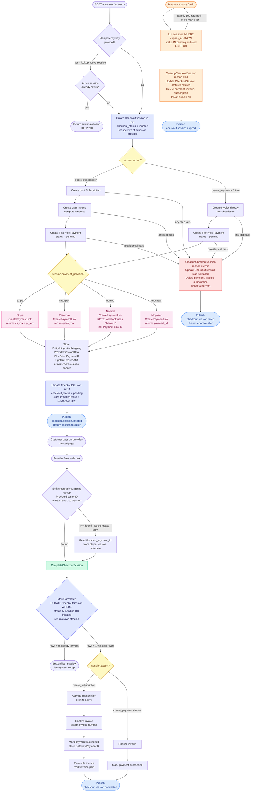

```mermaid
flowchart TD

    %% ENTRY
    A([POST /checkout/sessions]) --> IK
    IK{"Idempotency key\nprovided?"}
    IK -->|yes - lookup active session| IKL{"Active session\nalready exists?"}
    IKL -->|yes| IKR(["Return existing session\nHTTP 200"])
    IKL -->|no| DBCREATE
    IK -->|no| DBCREATE

    %% DB ENTITY CREATED FIRST - ALWAYS
    DBCREATE["Create CheckoutSession in DB\ncheckout_status = initiated\nIrrespective of action or provider"]
    DBCREATE --> ACT

    %% ACTION BRANCH
    ACT{"session.action?"}

    %% ACTION: create_subscription
    ACT -->|create_subscription| CS1["Create draft Subscription"]
    CS1 --> CS2["Create draft Invoice\ncompute amounts"]
    CS2 --> CS3["Create FlexPrice Payment\nstatus = pending"]
    CS3 --> PROV

    %% ACTION: create_payment - future
    ACT -->|create_payment - future| CP1["Create Invoice directly\nno subscription"]
    CP1 --> CP2["Create FlexPrice Payment\nstatus = pending"]
    CP2 --> PROV

    %% PROVIDER DISPATCH
    PROV{"session.payment_provider?"}
    PROV -->|stripe| P1["Stripe\nCreatePaymentLink\nreturns cs_xxx + pi_xxx"]
    PROV -->|razorpay| P2["Razorpay\nCreatePaymentLink\nreturns plink_xxx"]
    PROV -->|nomod| P3["Nomod\nCreatePaymentLink\nNOTE: webhook uses Charge ID\nnot Payment Link ID"]
    PROV -->|moyasar| P4["Moyasar\nCreatePaymentLink\nreturns payment_id"]

    P1 & P2 & P3 & P4 --> MAP
    MAP["Store EntityIntegrationMapping\nProviderSessionID to FlexPrice PaymentID\nTighten ExpiresAt if provider URL expires sooner"]
    MAP --> UPDATE["Update CheckoutSession in DB\ncheckout_status = pending\nstore ProviderResult + NextAction URL"]
    UPDATE --> INITPUB(["Publish checkout.session.initiated\nReturn session to caller"])

    %% FAILURE DURING FULFILLMENT
    CS1 -->|any step fails| FAIL
    CS2 -->|any step fails| FAIL
    CS3 -->|provider call fails| FAIL
    CP1 -->|any step fails| FAIL
    CP2 -->|provider call fails| FAIL

    FAIL["CleanupCheckoutSession\nreason = error\nUpdate CheckoutSession status = failed\nDelete payment, invoice, subscription\nIsNotFound = ok"]
    FAIL --> FAILPUB(["Publish checkout.session.failed\nReturn error to caller"])

    %% CUSTOMER PAYS
    INITPUB --> PAY([Customer pays on provider-hosted page])
    PAY --> WH([Provider fires webhook])

    WH --> LOOKUP{"EntityIntegrationMapping\nlookup\nProviderSessionID\nto PaymentID to Session"}
    LOOKUP -->|Found| COMPLETE["CompleteCheckoutSession"]
    LOOKUP -->|Not found - Stripe legacy only| LEG["Read flexprice_payment_id\nfrom Stripe session metadata"]
    LEG --> COMPLETE

    COMPLETE --> MARK{"MarkCompleted\nUPDATE CheckoutSession WHERE\nstatus IN pending OR initiated\nreturns rows affected"}
    MARK -->|rows = 0 already terminal| IDEM(["ErrConflict - swallow\nidempotent no-op"])
    MARK -->|rows = 1 this caller wins| CACT

    %% COMPLETION BRANCHING BY ACTION
    CACT{"session.action?"}

    CACT -->|create_subscription| CC1["Activate subscription\ndraft to active"]
    CC1 --> CC2["Finalize invoice\nassign invoice number"]
    CC2 --> CC3["Mark payment succeeded\nstore GatewayPaymentID"]
    CC3 --> CC4["Reconcile invoice\nmark invoice paid"]
    CC4 --> DONE(["Publish checkout.session.completed"])

    CACT -->|create_payment - future| CP3["Finalize invoice"]
    CP3 --> CP4["Mark payment succeeded"]
    CP4 --> DONE

    %% EXPIRY
    TMP(["Temporal - every 5 min"]) --> TLIST["List sessions WHERE\nexpires_at < NOW\nstatus IN pending, initiated\nLIMIT 100"]
    TLIST --> TCLEAN["CleanupCheckoutSession\nreason = nil\nUpdate CheckoutSession status = expired\nDelete payment, invoice, subscription\nIsNotFound = ok"]
    TCLEAN --> EXPPUB(["Publish checkout.session.expired"])
    TLIST -->|exactly 100 returned - more may exist| TMP

    %% STYLES
    classDef dbwrite fill:#e0e7ff,stroke:#6366f1,color:#1e1b4b
    classDef action fill:#fef9c3,stroke:#ca8a04,color:#713f12
    classDef provider fill:#fce7f3,stroke:#ec4899,color:#831843
    classDef atomic fill:#d1fae5,stroke:#10b981,color:#064e3b
    classDef event fill:#dbeafe,stroke:#3b82f6,color:#1e3a8a
    classDef expiry fill:#ffedd5,stroke:#f97316,color:#7c2d12
    classDef fail fill:#fee2e2,stroke:#ef4444,color:#7f1d1d

    class DBCREATE,UPDATE,MARK dbwrite
    class ACT,CACT,PROV action
    class P1,P2,P3,P4 provider
    class COMPLETE atomic
    class DONE,INITPUB,FAILPUB,EXPPUB event
    class TMP,TLIST,TCLEAN expiry
    class FAIL fail
```
