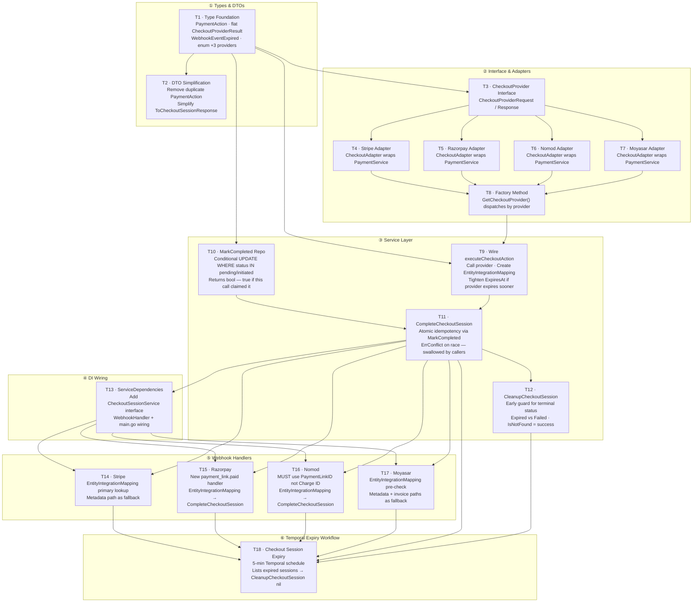

```mermaid
flowchart TD
    subgraph TYPES["① Types & DTOs"]
        T1["T1 · Type Foundation\nPaymentAction · flat CheckoutProviderResult\nWebhookEventExpired · enum +3 providers"]
        T2["T2 · DTO Simplification\nRemove duplicate PaymentAction\nSimplify ToCheckoutSessionResponse"]
    end

    subgraph IFACE["② Interface & Adapters"]
        T3["T3 · CheckoutProvider Interface\nCheckoutProviderRequest / Response"]
        T4["T4 · Stripe Adapter\nCheckoutAdapter wraps PaymentService"]
        T5["T5 · Razorpay Adapter\nCheckoutAdapter wraps PaymentService"]
        T6["T6 · Nomod Adapter\nCheckoutAdapter wraps PaymentService"]
        T7["T7 · Moyasar Adapter\nCheckoutAdapter wraps PaymentService"]
        T8["T8 · Factory Method\nGetCheckoutProvider() dispatches by provider"]
    end

    subgraph SVC["③ Service Layer"]
        T9["T9 · Wire executeCheckoutAction\nCall provider · Create EntityIntegrationMapping\nTighten ExpiresAt if provider expires sooner"]
        T10["T10 · MarkCompleted Repo\nConditional UPDATE WHERE status IN pending/initiated\nReturns bool — true if this call claimed it"]
        T11["T11 · CompleteCheckoutSession\nAtomic idempotency via MarkCompleted\nErrConflict on race — swallowed by callers"]
        T12["T12 · CleanupCheckoutSession\nEarly guard for terminal status\nExpired vs Failed · IsNotFound = success"]
    end

    subgraph DI["④ DI Wiring"]
        T13["T13 · ServiceDependencies\nAdd CheckoutSessionService interface\nWebhookHandler + main.go wiring"]
    end

    subgraph WEBHOOKS["⑤ Webhook Handlers"]
        T14["T14 · Stripe\nEntityIntegrationMapping primary lookup\nMetadata path as fallback"]
        T15["T15 · Razorpay\nNew payment_link.paid handler\nEntityIntegrationMapping → CompleteCheckoutSession"]
        T16["T16 · Nomod\nMUST use PaymentLinkID not Charge ID\nEntityIntegrationMapping → CompleteCheckoutSession"]
        T17["T17 · Moyasar\nEntityIntegrationMapping pre-check\nMetadata + invoice paths as fallback"]
    end

    subgraph TEMPORAL["⑥ Temporal Expiry Workflow"]
        T18["T18 · Checkout Session Expiry\n5-min Temporal schedule\nLists expired sessions → CleanupCheckoutSession nil"]
    end

    T1 --> T2
    T1 --> T3
    T1 --> T9
    T1 --> T10
    T3 --> T4
    T3 --> T5
    T3 --> T6
    T3 --> T7
    T4 --> T8
    T5 --> T8
    T6 --> T8
    T7 --> T8
    T8 --> T9
    T10 --> T11
    T9 --> T11
    T11 --> T12
    T11 --> T13
    T13 --> T14
    T13 --> T15
    T13 --> T16
    T13 --> T17
    T11 --> T14
    T11 --> T15
    T11 --> T16
    T11 --> T17
    T14 --> T18
    T15 --> T18
    T16 --> T18
    T17 --> T18
    T11 --> T18
    T12 --> T18
```
