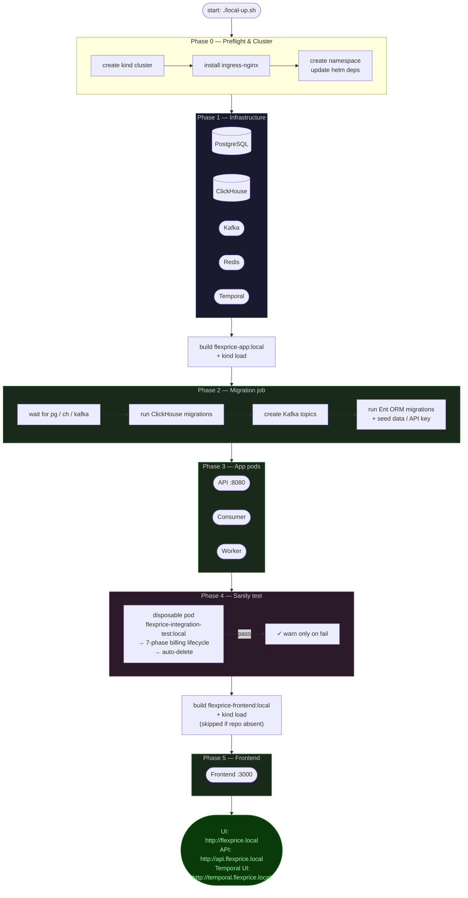

# FlexPrice — Local Development Guide (Kind + Helm)

This guide covers everything you need to run the full FlexPrice stack locally using [kind](https://kind.sigs.k8s.io/) (Kubernetes-in-Docker) and Helm. It documents every section of `values.yaml` that matters for local dev, how to build or pull images, and how to configure secrets before startup.

---

## Prerequisites

| Tool | Install |
|------|---------|
| Docker | https://docs.docker.com/get-docker/ |
| kind | https://kind.sigs.k8s.io/docs/user/quick-start/#installation |
| kubectl | https://kubernetes.io/docs/tasks/tools/ |
| helm | https://helm.sh/docs/intro/install/ |

Optional (for the frontend):
- The `flexprice-front` repo checked out as a sibling to this repo: `../flexprice-front/`

---

## One-Command Startup

```bash
# From the repo root
cd helm/
./local-up.sh
```

The script handles everything: cluster creation, ingress-nginx, Helm dependencies, image builds, migrations, and app deployment. See [What the script does](#what-the-script-does) for the full breakdown.

---

## /etc/hosts Setup

Before accessing the local stack you must add these entries (requires `sudo`):

```
127.0.0.1  flexprice.local
127.0.0.1  api.flexprice.local
127.0.0.1  temporal.flexprice.local
```

Edit with:
```bash
sudo nano /etc/hosts
```

After startup, the services are reachable at:

| Service | URL |
|---------|-----|
| Frontend UI | http://flexprice.local |
| API | http://api.flexprice.local |
| Temporal UI | http://temporal.flexprice.local |

---

## Building Images

The local stack uses two Docker images. Both use `imagePullPolicy: IfNotPresent` and must be pre-loaded into the kind cluster — they are **never** pulled from a registry.

### API / Backend Image

**Source:** `Dockerfile.local` at the repo root.

**Build and load:**
```bash
# From repo root
docker build -f Dockerfile.local -t flexprice-app:local .
kind load docker-image flexprice-app:local --name flexprice-local
```

The `local-up.sh` script does this automatically. Rebuild manually whenever you change Go source.

**What it produces:**
- A two-stage Alpine build: `golang:1.24-alpine` builder → minimal Alpine runtime
- Binary: `/app/server` (the main HTTP/consumer/worker process)
- Binary: `/app/migrate` (the Ent migration tool)
- Config directory: `/app/config/` (all YAML configs and `rbac/roles.json`)

> **Important:** If you rebuild the image without updating the kind node, pods will continue using the cached image. The `local-up.sh` script handles this correctly via `kind load docker-image`.

### Frontend Image

**Source:** `../flexprice-front/` (sibling repo, optional).

**Build and load:**
```bash
docker build \
  --build-arg VITE_API_URL="http://api.flexprice.local/v1" \
  --build-arg VITE_ENVIRONMENT="self-hosted" \
  -t flexprice-frontend:local \
  ../flexprice-front/

kind load docker-image flexprice-frontend:local --name flexprice-local
```

If `flexprice-front` is not present, the script skips the frontend build with a warning and `frontend.enabled` in `values.yaml` should be set to `false`.

---

## values.yaml — Section by Section

### `image` — API Image Reference

```yaml
image:
  repository: flexprice-app   # Docker image name (no registry prefix for local)
  pullPolicy: IfNotPresent    # NEVER pull from registry; use pre-loaded kind image
  tag: "local"                # Must match the tag used in `kind load docker-image`
```

For local dev, **never change `pullPolicy` to `Always`** — there is no registry to pull from.

---

### `replicaCount`

```yaml
replicaCount: 1
```

Applies to all three Go services (api, consumer, worker) unless overridden per-component. Keep at `1` locally to save resources.

---

### `api` / `consumer` / `worker` — Per-Service Configuration

Each service section has the same shape:

```yaml
api:
  replicaCount: 1
  resources:
    requests:
      cpu: "100m"
      memory: "256Mi"
    limits:
      cpu: "500m"
      memory: "512Mi"
  autoscaling:
    enabled: false
```

- **`replicaCount`** — number of pods for that service
- **`resources`** — CPU/memory requests and limits; reduce for constrained laptops
- **`autoscaling`** — keep `false` locally

All three services run the same `flexprice-app:local` image. The deployment mode is controlled by `FLEXPRICE_DEPLOYMENT_MODE` env var (set automatically by the chart):

| Service | Mode value |
|---------|-----------|
| api | `api` |
| consumer | `consumer` |
| worker | `temporal_worker` |

---

### `frontend` — UI Deployment

```yaml
frontend:
  enabled: true                         # Set false if flexprice-front repo is absent
  replicaCount: 1
  image:
    repository: flexprice-frontend
    tag: "local"
    pullPolicy: IfNotPresent
  env:
    apiUrl: "http://api.flexprice.local/v1"   # Must match your /etc/hosts entry
    environment: "self-hosted"
    supabaseUrl: ""                           # Leave empty unless using Supabase auth
    supabaseAnonKey: ""
  resources:
    requests:
      cpu: "500m"
      memory: "768Mi"
    limits:
      cpu: "1000m"
      memory: "1536Mi"
```

The frontend runs on port 3000 inside the pod. The `VITE_API_URL` build arg baked into the image must match `env.apiUrl` here.

---

### `ingress` — API Ingress

```yaml
ingress:
  enabled: true
  className: "nginx"
  annotations: {}
  host: "api.flexprice.local"   # Must be in /etc/hosts → 127.0.0.1
  tls: []
```

The `local-up.sh` script runs plain HTTP (port 80) — no TLS config needed for the default local setup. Port 443 is mapped in `kind-cluster.yaml` so TLS works if you choose to enable it.

---

### `frontendIngress` — Frontend Ingress

```yaml
frontendIngress:
  enabled: true
  className: "nginx"
  annotations: {}
  host: "flexprice.local"   # Must be in /etc/hosts → 127.0.0.1
  tls: []
```

---

### `temporalIngress` — Temporal UI Ingress

```yaml
temporalIngress:
  enabled: true
  className: "nginx"
  annotations: {}
  host: "temporal.flexprice.local"   # Must be in /etc/hosts → 127.0.0.1
  tls: []
```

---

### TLS for Local Ingress (Optional)

Plain HTTP is the default and works fine for local dev. If you need TLS — for example to test `Secure` cookies, Supabase auth, or HTTPS redirects — the chart supports it on all three ingresses via the `tls:` field. No chart changes are needed; just supply a TLS Secret and reference it in `values-local.yaml`.

#### Option A: Bring your own CA / corporate PKI

If your org has a CA or you already have a wildcard cert for `*.flexprice.local`:

```bash
# Load your cert and key into the cluster
kubectl create secret tls flexprice-local-tls \
  --cert=path/to/tls.crt \
  --key=path/to/tls.key \
  -n flexprice
```

#### Option B: mkcert (recommended for individuals)

[mkcert](https://github.com/FiloSottile/mkcert) installs a local CA into your OS/browser trust store so certs are trusted with no warnings.

```bash
# Install mkcert and add its CA to your system trust store (once per machine)
brew install mkcert   # or: apt install mkcert / choco install mkcert
mkcert -install

# Issue a cert covering all three local hostnames
mkcert -key-file tls.key -cert-file tls.crt \
  flexprice.local api.flexprice.local temporal.flexprice.local

# Load into the cluster
kubectl create secret tls flexprice-local-tls \
  --cert=tls.crt \
  --key=tls.key \
  -n flexprice
```

#### Option C: cert-manager with a self-signed issuer

If you already have cert-manager installed, create a self-signed `ClusterIssuer` and a `Certificate` CRD — cert-manager will populate the Secret automatically. You'll still need to add the CA to your trust store manually for browser trust.

#### Enabling TLS in values-local.yaml (all options)

Once the Secret exists, add to `values-local.yaml`:

```yaml
ingress:
  tls:
    - secretName: flexprice-local-tls
      hosts:
        - api.flexprice.local

frontendIngress:
  tls:
    - secretName: flexprice-local-tls
      hosts:
        - flexprice.local

temporalIngress:
  tls:
    - secretName: flexprice-local-tls
      hosts:
        - temporal.flexprice.local
```

Then apply:
```bash
helm upgrade flexprice ./flexprice -f flexprice/values.yaml -f values-local.yaml -n flexprice
```

The `secretName` can be anything — just match it across the secret and values. A single wildcard cert can cover all three hosts in one Secret.

---

### `auth` — Authentication Provider

```yaml
auth:
  provider: "supabase"        # or "noop" to disable auth checks locally
  secret: "changeme-dev"      # JWT signing secret (any string for local)
  supabase:
    url: ""
    serviceKey: ""            # Only needed if provider=supabase
```

For local development without Supabase, set `provider: noop` or use a local Supabase instance. The `auth.secret` value becomes the `AUTH_SECRET` environment variable.

---

### `postgres` — PostgreSQL Configuration

Three deployment options:

**Option 1 (default for local): Bitnami subchart**
```yaml
postgresql:
  enabled: true          # top-level key — enables the subchart
  auth:
    username: flexprice
    password: flexprice123
    database: flexprice
```

```yaml
postgres:
  host: ""               # ignored when subchart is enabled
  port: 5432
  user: flexprice
  password: flexprice123
  dbName: flexprice
  sslMode: disable       # use "disable" for local
  external:
    enabled: false
```

The chart resolves the hostname automatically to `<release>-postgresql` when `postgresql.enabled=true`.

**Option 2: External (e.g. RDS, local Docker Compose)**
```yaml
postgresql:
  enabled: false
postgres:
  host: "your-postgres-host"
  port: 5432
  user: flexprice
  password: flexprice123
  dbName: flexprice
  sslMode: disable
  external:
    enabled: true
```

---

### `clickhouse` — ClickHouse Configuration

Always use `standalone` mode — it is a single-replica StatefulSet with no operator. **Never use `altinity` mode locally** (requires the Altinity operator installed cluster-wide). Replicas are not supported or needed; ClickHouse in this setup is always one node.

```yaml
clickhouse:
  mode: "standalone"           # always standalone for local — never altinity
  tls: false
  username: "default"
  password: "flexprice123"     # set via secret (see Secrets section)
  database: "flexprice"
  standalone:
    image:
      repository: clickhouse/clickhouse-server
      tag: "24.8-alpine"
      pullPolicy: IfNotPresent
    persistence:
      size: "10Gi"             # reduce from default 50Gi for local laptops
      storageClass: ""         # empty = use cluster default (kind uses standard)
    resources:
      requests:
        memory: "1Gi"          # default is 2Gi; reduce if RAM is tight
        cpu: "250m"
      limits:
        memory: "2Gi"
        cpu: "1"
```

> The `altinity` and multi-replica configs in `values.yaml` are for cloud deployments only. For local, ignore them entirely.

---

### `kafka` — Kafka Configuration

Three deployment options:

**Option 1 (default for local): Bitnami subchart (KRaft, no Zookeeper)**
```yaml
kafka:
  enabled: true                # top-level key
```

```yaml
kafkaConfig:
  enabled: true
  brokers:
    - ""                       # resolved automatically
  useSASL: false               # no auth for local
```

**Option 2: External**
```yaml
kafka:
  enabled: false
kafkaConfig:
  enabled: true
  brokers:
    - "your-broker:9092"
  external:
    enabled: true
  useSASL: true
  saslMechanism: PLAIN
  saslUsername: "user"
  # password comes from secrets (see Secrets section)
```

Topics are created idempotently by the migration job. The chart creates: `events`, `events_lazy`, `events_post_processing`, `events_post_processing_backfill`, `raw_events`, `raw_events_consumer`, `system_events`.

---

### `redis` — Redis Configuration

```yaml
redis:
  enabled: true              # top-level key — enables Bitnami subchart

redisConfig:
  host: ""                   # resolved automatically
  port: 6379
  db: 0
  password: ""              # no password for local
  external:
    enabled: false
```

---

### `temporal` — Temporal Workflow Engine

**Option 1 (default for local): Bitnami/temporalio subchart**
```yaml
temporal:
  enabled: true
  external:
    enabled: false
```

Temporal uses the same Postgres instance but a separate database (`temporal`). The subchart creates the schema automatically.

**Option 2: External (Temporal Cloud)**
```yaml
temporal:
  enabled: false
  external:
    enabled: true
address: "your-namespace.tmprl.cloud:7233"
namespace: "your-namespace"
# API key comes from secrets
```

---

### `migration` — Database Migration Job

```yaml
migration:
  enabled: true
  backoffLimit: 3
  activeDeadlineSeconds: 600
  timeout: 300
  steps:
    postgresSetup: true    # creates extensions schema + uuid-ossp
    clickhouse: true       # runs ClickHouse SQL migrations
    kafka: true            # creates Kafka topics (idempotent)
    ent: true              # runs Ent ORM migrations
    seed: false            # optional seed data
  resources:
    requests:
      cpu: "100m"
      memory: "128Mi"
    limits:
      cpu: "500m"
      memory: "512Mi"
```

The migration job runs as a `pre-install`/`pre-upgrade` Helm hook. It uses init containers to wait for each dependency (Postgres, ClickHouse, Kafka) before running. Each step is idempotent — safe to re-run.

---

### `secrets` — Managing Secrets Before Startup

There are two modes. Pick one:

---

#### Mode A: Inline values (dev fallback)

Leave `secrets.existingSecret` empty. The chart renders its own Kubernetes Secret from values in `values.yaml` / `values-local.yaml`. **Never commit real credentials.**

Minimum required:

```yaml
secrets:
  existingSecret: ""                              # empty = inline mode
  encryptionKey: "dev-encryption-key-32chars!!"   # 32+ chars; openssl rand -hex 32
postgres:
  password: "flexprice123"
clickhouse:
  password: "flexprice123"
auth:
  secret: "dev-auth-secret"
```

Put overrides in a gitignored `values-local.yaml`:

```yaml
# helm/flexprice/values-local.yaml  (in .helmignore — never committed)
secrets:
  encryptionKey: "my-real-local-key-32-bytes-here!!"
postgres:
  password: "mypassword"
clickhouse:
  password: "mypassword"
auth:
  secret: "my-jwt-secret"
```

Then install with:
```bash
helm upgrade --install flexprice ./flexprice \
  -f flexprice/values.yaml \
  -f flexprice/values-local.yaml \
  -n flexprice
```

---

#### Mode B: Pre-existing Kubernetes Secret (recommended for any shared env)

Create the secret yourself (once), then tell the chart to use it. The chart skips rendering its own Secret and reads all keys from yours via `secretKeyRef`.

**Step 1 — Create the Kubernetes Secret:**
```bash
kubectl create secret generic flexprice-secrets -n flexprice \
  --from-literal=encryption-key=$(openssl rand -hex 32) \
  --from-literal=auth-secret=$(openssl rand -hex 32) \
  --from-literal=postgres-password=flexprice123 \
  --from-literal=clickhouse-password=flexprice123
```

To use custom passwords for Postgres or ClickHouse, just change the values above. The secret key names (`postgres-password`, `clickhouse-password`) are fixed — the chart templates reference them by name.

**Step 2 — Point `values-local.yaml` at it:**
```yaml
secrets:
  existingSecret: "flexprice-secrets"   # chart uses this; ignores all inline password fields
# These are now ignored (password comes from the secret):
postgres:
  password: ""
clickhouse:
  password: ""
auth:
  secret: ""
```

**Step 3 — Install:**
```bash
helm upgrade --install flexprice ./flexprice \
  -f flexprice/values.yaml \
  -f flexprice/values-local.yaml \
  -n flexprice
```

**To rotate a secret** (e.g. change Postgres password):
```bash
kubectl create secret generic flexprice-secrets -n flexprice \
  --from-literal=postgres-password=newpassword \
  --dry-run=client -o yaml | kubectl apply -f -

# Restart pods to pick up the new secret value
kubectl rollout restart deployment -n flexprice
```

---

**Required secret keys** (chart errors if missing when the feature is enabled):

| Key | When required |
|-----|--------------|
| `encryption-key` | Always |
| `auth-secret` | Always |
| `postgres-password` | Always |
| `clickhouse-password` | Always |
| `kafka-sasl-password` | Only if `kafkaConfig.useSASL=true` |
| `temporal-api-key` | Only if using Temporal Cloud |
| `supabase-service-key` | Only if `auth.provider=supabase` |
| `sentry-dsn` | Only if `sentry.enabled=true` |
| `email-resend-api-key` | Only if `email.enabled=true` |
| `svix-auth-token` | Only if `webhook.svixConfig.enabled=true` |

---

### `sentry` — Error Tracking (Optional)

```yaml
sentry:
  enabled: false        # set true to enable; DSN comes from secrets
```

---

### `logging` — Observability (Optional)

```yaml
logging:
  level: "info"
  otel:
    enabled: false      # set true to send traces to SigNoz/OTLP
    endpoint: ""
    authValue: ""       # comes from secrets if enabled
```

---

### `extraEnv` — Custom Environment Variables

Inject additional env vars into all pods (api, consumer, worker):

```yaml
extraEnv:
  - name: FLEXPRICE_SOME_FLAG
    value: "true"
  - name: MY_SECRET_VAR
    valueFrom:
      secretKeyRef:
        name: my-secret
        key: my-key
```

---

## What the Script Does

`local-up.sh` runs in five phases. The diagram shows what is running after each phase completes:



`local-up.sh` runs in five phases:

**Phase 0 — Preflight**
- Checks that `kind`, `kubectl`, and `helm` are installed
- Creates the kind cluster from `kind-cluster.yaml` (single node, ports 80/443 mapped to host) — skips if already exists
- Installs `ingress-nginx` — skips if already installed
- Creates the `flexprice` namespace — skips if already exists
- Runs `helm dependency update` to pull Bitnami/Temporal subcharts

**Phase 1 — Infrastructure only**
```bash
helm upgrade --install flexprice ./flexprice \
  -f values.yaml \
  -f values-local.yaml \
  --set migration.enabled=false \

  --set api.replicaCount=0 \
  --set consumer.replicaCount=0 \
  --set worker.replicaCount=0
```
Brings up Postgres, ClickHouse, Kafka, Redis, Temporal — waits for all to be healthy before proceeding.

**Phase 2 — Build API image + run migrations**
- Builds `flexprice-app:local` from `Dockerfile.local` and loads it into kind
- Enables the migration job (`helm upgrade`) — waits for the Job to complete
- Seeds tenant, environments, and the local API key `sk_local_flexprice_test_key`

**Phase 3 — App pods (api, consumer, worker)**
- Deploys the three Go services with `frontend.enabled=false`
- Waits for all rollouts to be healthy before proceeding

**Phase 4 — Integration sanity test**

Builds a throwaway image from `integration-testing-suite/go/`, loads it into kind, then runs it as a disposable pod inside the cluster:

```bash
kubectl run integration-test --rm --attach --restart=Never \
  -n flexprice \
  --image=flexprice-integration-test:local \
  --image-pull-policy=IfNotPresent \
  --env="FLEXPRICE_API_KEY=sk_local_flexprice_test_key" \
  --env="FLEXPRICE_API_HOST=flexprice.flexprice.svc.cluster.local/v1" \
  --env="FLEXPRICE_INSECURE=true"
```

The pod hits the API service directly via in-cluster DNS (no ingress needed), runs all 7 billing lifecycle phases (catalog → billing → wallet → subscription → usage → invoice → cleanup), then auto-deletes. The seeded API key `sk_local_flexprice_test_key` is always present after migration.

A test failure **warns but does not abort** — the stack stays up and is usable. Re-run manually any time with the command above.

**Phase 5 — Frontend image + deploy**
- Builds `flexprice-frontend:local` from `../flexprice-front/` (skipped if the repo isn't present)
- Loads the image into kind and deploys with `frontend.enabled=true`
- Frontend is last because it has no bearing on the sanity test and takes the longest to build

---

## Manual Sanity Check

Once the stack is up, verify the API is responding with the seeded local key:

```bash
curl -H "x-api-key: sk_local_flexprice_test_key" http://api.flexprice.local/v1/customers
```

Expected: a `200` response with a JSON list (empty `[]` on a fresh install). Any `401` means the API key didn't get seeded — check that the migration job ran the seed step. Any `502` means the API pod isn't up yet or ingress isn't routing — check `kubectl get pods -n flexprice`.

---

## Teardown

```bash
# Delete the entire cluster (all data lost)
kind delete cluster --name flexprice-local
```

---

## Troubleshooting

**Quick overview of all pods:**
```bash
kubectl get pods -n flexprice
kubectl get pods -n ingress-nginx
```

---

**Pods stuck in `ErrImageNeverPull`**

`imagePullPolicy: IfNotPresent` + no registry = the image must already exist in the kind node. The tag in the node must match `image.tag` in values exactly.

```bash
# See what's loaded in the kind node
docker exec flexprice-local-control-plane crictl images | grep flexprice

# Re-load the image
kind load docker-image flexprice-app:local --name flexprice-local
kind load docker-image flexprice-frontend:local --name flexprice-local

# Restart pods so they pick up the new image
kubectl rollout restart deployment -n flexprice
```

If the tag is correct but pods still fail, the containerd tag may be mangled (space instead of hyphen). Verify:
```bash
docker exec flexprice-local-control-plane ctr -n k8s.io images ls | grep flexprice
```
The name must show `flexprice-app:local` (with a hyphen). If it shows `flexprice app:local`, re-import via `kind load` which uses the correct path.

---

**Migration job fails**

Check init containers first — they wait for each dependency before the main container runs:
```bash
# List all containers in the job pod
kubectl get pods -n flexprice -l job-name=flexprice-migration

# Logs per init container
kubectl logs -n flexprice job/flexprice-migration -c wait-for-postgres
kubectl logs -n flexprice job/flexprice-migration -c wait-for-clickhouse
kubectl logs -n flexprice job/flexprice-migration -c create-kafka-topics

# Main migration container
kubectl logs -n flexprice job/flexprice-migration -c migration
```

If the job has already completed/failed and needs a re-run:
```bash
kubectl delete job flexprice-migration -n flexprice
helm upgrade flexprice ./flexprice -f values.yaml -f values-local.yaml -n flexprice
```

---

**`roles.json` not found at runtime / config files missing**

The `Dockerfile.local` copies the entire `config/` directory. If you see this after a rebuild, Docker used a cached layer. Force a clean rebuild:
```bash
docker build --no-cache -f Dockerfile.local -t flexprice-app:local .
kind load docker-image flexprice-app:local --name flexprice-local
kubectl rollout restart deployment -n flexprice
```

Verify the file exists in the image before loading:
```bash
docker run --rm flexprice-app:local ls /app/config/rbac/
```

---

**Cannot reach `api.flexprice.local` / `flexprice.local`**

1. Check `/etc/hosts`:
```bash
grep flexprice /etc/hosts
# Expected: 127.0.0.1  flexprice.local api.flexprice.local temporal.flexprice.local
```

2. Check ingress-nginx is running and has received the ingress rules:
```bash
kubectl get pods -n ingress-nginx
kubectl get ingress -n flexprice
```

3. Check the ingress controller got the host port mapped (kind-cluster.yaml maps 80→80):
```bash
docker ps | grep flexprice-local
# Should show 0.0.0.0:80->80/tcp
```

4. Test the API directly without DNS:
```bash
curl -H "Host: api.flexprice.local" http://127.0.0.1/v1/health
```

---

**ClickHouse pod in `CrashLoopBackOff` / `OOMKilled`**

ClickHouse standalone mode is a single StatefulSet pod. If it's OOMing, increase its limits in `values-local.yaml`:
```yaml
clickhouse:
  standalone:
    resources:
      requests:
        memory: "1Gi"
      limits:
        memory: "3Gi"    # bump if OOMKilled
```

Check current resource usage:
```bash
kubectl top pod -n flexprice -l app.kubernetes.io/component=clickhouse
kubectl describe pod -n flexprice -l app.kubernetes.io/component=clickhouse | grep -A5 "OOM\|Limits\|Requests"
```

---

**Postgres password mismatch / auth failed**

If you changed the Postgres password after the PVC was already initialized, the StatefulSet still holds the old password on disk. You must delete the PVC and let it re-initialize:
```bash
kubectl delete statefulset flexprice-postgresql -n flexprice
kubectl delete pvc data-flexprice-postgresql-0 -n flexprice
# Then re-run helm upgrade — migration will re-create the schema
```

If using `secrets.existingSecret`, verify the secret has the right key:
```bash
kubectl get secret flexprice-secrets -n flexprice -o jsonpath='{.data.postgres-password}' | base64 -d
```

---

**`secret "flexprice-secrets" not found` error during helm install**

You set `secrets.existingSecret: "flexprice-secrets"` but haven't created the secret yet. Create it first (see Mode B in the Secrets section), then re-run helm install.

---

**Temporal pods not starting / `ALREADY_EXISTS` errors**

Temporal races against Postgres on cold clusters. The `local-up.sh` script handles this by restarting Temporal server pods after the schema init jobs complete. If you deployed manually:
```bash
# Check Temporal schema job status
kubectl get jobs -n flexprice | grep temporal

# Restart Temporal server pods
kubectl rollout restart deployment -n flexprice -l app.kubernetes.io/name=temporal
```

---

**Kafka topics not created / consumer can't connect**

```bash
# Check the create-kafka-topics init container
kubectl logs -n flexprice job/flexprice-migration -c create-kafka-topics

# Verify the Kafka broker is up
kubectl get pods -n flexprice -l app.kubernetes.io/name=kafka

# List topics manually (exec into Kafka pod)
kubectl exec -n flexprice -it flexprice-kafka-0 -- \
  kafka-topics.sh --bootstrap-server localhost:9092 --list
```

---

**Frontend shows blank page or API errors in browser**

The frontend is built with `VITE_API_URL` baked in at image build time. If the URL is wrong, you must rebuild the image:
```bash
docker build \
  --build-arg VITE_API_URL="http://api.flexprice.local/v1" \
  --build-arg VITE_ENVIRONMENT="self-hosted" \
  -t flexprice-frontend:local \
  ../flexprice-front/
kind load docker-image flexprice-frontend:local --name flexprice-local
kubectl rollout restart deployment/flexprice-frontend -n flexprice
```

Check what URL is currently baked in:
```bash
docker run --rm flexprice-frontend:local printenv VITE_API_URL
```

---

**Frontend shows "Blocked request. This host is not allowed" (Vite `allowedHosts`)**

This means the frontend image is running Vite's **dev server** instead of a production build. Vite's dev server rejects requests from unrecognized hostnames by default.

**Fix A (correct):** The frontend Dockerfile should run `vite build` and serve the static `dist/` output via nginx or `serve` — not `vite dev`. A production bundle has no `allowedHosts` restriction. Check `flexprice-front/Dockerfile` and ensure the final stage is not running the dev server.

**Fix B (quick workaround):** If the frontend intentionally runs the Vite dev server in local mode, add to `flexprice-front/vite.config.js`:
```js
server: {
  allowedHosts: ['flexprice.local', 'api.flexprice.local', 'temporal.flexprice.local']
}
```
Then rebuild and reload the image:
```bash
docker build \
  --build-arg VITE_API_URL="http://api.flexprice.local/v1" \
  --build-arg VITE_ENVIRONMENT="self-hosted" \
  -t flexprice-frontend:local \
  ../flexprice-front/
kind load docker-image flexprice-frontend:local --name flexprice-local
kubectl rollout restart deployment/flexprice-frontend -n flexprice
```
